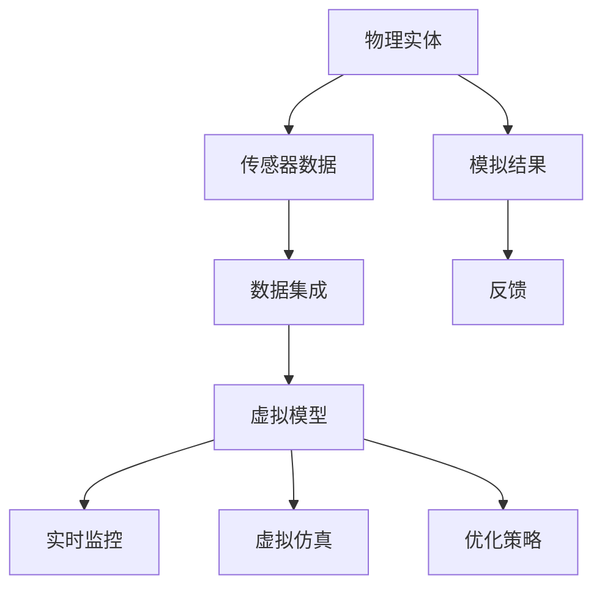

                 

# 数字孪生在注意力资源模拟中的应用

> **关键词：** 数字孪生、注意力资源、模拟、深度学习、神经网络、算法优化

> **摘要：** 本文旨在探讨数字孪生技术在注意力资源模拟中的应用，详细解析其核心概念、算法原理、数学模型，并通过实战案例展示其实际应用效果。本文将为读者提供深入了解数字孪生及其应用场景的视角，探讨其在人工智能和复杂系统建模中的潜力。

## 1. 背景介绍

### 1.1 目的和范围

本文的主要目的是介绍数字孪生技术，并探讨其在注意力资源模拟中的应用。我们将首先定义数字孪生和注意力资源，然后逐步深入探讨其核心算法原理、数学模型，并通过实际项目案例来展示其应用效果。本文将涵盖以下主题：

- 数字孪生的基本概念和发展历程
- 注意力资源的理论背景和应用场景
- 数字孪生在注意力资源模拟中的关键算法
- 数学模型和公式的详细解析
- 实际应用场景和工具推荐

### 1.2 预期读者

本文主要面向对数字孪生和注意力资源有一定了解的技术人员和研究人员。特别是对人工智能、机器学习和深度学习感兴趣的读者，以及对复杂系统建模和算法优化有深入研究的专业人士。读者需具备一定的编程基础，了解常见的神经网络架构和数学知识。

### 1.3 文档结构概述

本文结构如下：

- **第1章：背景介绍**：介绍本文的目的、预期读者和文档结构。
- **第2章：核心概念与联系**：定义数字孪生和注意力资源，并展示其核心概念和联系。
- **第3章：核心算法原理 & 具体操作步骤**：详细阐述数字孪生在注意力资源模拟中的核心算法原理。
- **第4章：数学模型和公式 & 详细讲解 & 举例说明**：解析数字孪生模拟的数学模型和公式，并通过实例进行说明。
- **第5章：项目实战：代码实际案例和详细解释说明**：通过一个实际项目案例展示代码实现和解析。
- **第6章：实际应用场景**：讨论数字孪生在注意力资源模拟中的应用场景。
- **第7章：工具和资源推荐**：推荐学习资源、开发工具和框架。
- **第8章：总结：未来发展趋势与挑战**：总结本文内容，展望未来发展趋势和挑战。
- **第9章：附录：常见问题与解答**：提供常见问题的解答。
- **第10章：扩展阅读 & 参考资料**：推荐相关阅读材料和参考文献。

### 1.4 术语表

#### 1.4.1 核心术语定义

- **数字孪生（Digital Twin）**：数字孪生是一种基于物理实体在虚拟空间中的映射，通过集成多种传感器和实时数据流，实现对物理实体的数字化建模和模拟。
- **注意力资源（Attention Resource）**：注意力资源是指系统或个体在处理信息时，能够投入的注意力数量，用于决定如何分配有限的认知资源。
- **神经网络（Neural Network）**：神经网络是一种模仿生物神经系统的计算模型，由大量的神经元和连接组成，用于数据处理和预测。
- **深度学习（Deep Learning）**：深度学习是机器学习的一个分支，通过多层神经网络进行特征提取和模型训练。

#### 1.4.2 相关概念解释

- **模拟（Simulation）**：模拟是创建一个虚拟环境，用于测试和验证系统行为或过程。
- **算法优化（Algorithm Optimization）**：算法优化是通过改进算法的效率，提高其性能和资源利用。

#### 1.4.3 缩略词列表

- **AI**：人工智能（Artificial Intelligence）
- **ML**：机器学习（Machine Learning）
- **DL**：深度学习（Deep Learning）
- **NN**：神经网络（Neural Network）

## 2. 核心概念与联系

数字孪生技术和注意力资源模拟在现代科技和工程领域中具有重要地位。为了更好地理解两者之间的联系，我们将首先定义这些核心概念，然后通过一个简化的 Mermaid 流程图来展示其相互作用。

### 2.1 数字孪生的概念

数字孪生（Digital Twin）是一种新兴的数字技术，通过创建物理实体在虚拟空间的映射，实现对实际系统或产品的实时监控、模拟和优化。数字孪生的核心组件包括：

- **物理实体**：实际存在的系统或产品。
- **传感器**：用于采集物理实体状态的传感器数据。
- **数据集成**：将传感器数据进行收集、存储和处理。
- **虚拟模型**：基于物理实体特征构建的数字化模型。


### 2.2 注意力资源的理论背景

注意力资源（Attention Resource）是指个体或系统在处理信息时能够投入的认知资源。在复杂系统中，注意力资源有限，因此需要有效分配。注意力资源的理论基础包括：

- **感知心理学**：研究个体如何感知和处理外部信息。
- **认知科学**：研究大脑如何处理认知任务。
- **决策理论**：研究个体如何做出决策。


### 2.3 数字孪生在注意力资源模拟中的应用

数字孪生技术在注意力资源模拟中的应用主要体现在以下几个方面：

1. **实时监控**：通过传感器实时收集物理实体的数据，用于动态模拟和监控注意力资源的分配。
2. **虚拟仿真**：构建虚拟模型，模拟不同注意力资源分配策略对系统性能的影响。
3. **优化策略**：通过算法优化，为系统提供最优的注意力资源分配方案。


### 2.4 Mermaid 流程图

以下是一个简化的 Mermaid 流程图，展示了数字孪生在注意力资源模拟中的关键组件和相互作用。



该流程图说明了数字孪生技术在注意力资源模拟中的基本工作流程，从物理实体到传感器数据，再到数据集成、虚拟模型、实时监控、虚拟仿真和优化策略，最后形成闭环反馈，为系统提供持续改进的依据。

## 3. 核心算法原理 & 具体操作步骤

在数字孪生技术中，注意力资源模拟的核心在于构建有效的算法模型，以模拟和优化注意力资源的分配。以下将详细阐述数字孪生在注意力资源模拟中的核心算法原理，并使用伪代码进行具体操作步骤的讲解。

### 3.1 注意力分配模型

注意力资源模拟的基础是一个能够动态分配注意力资源的模型。在这个模型中，每个任务都会根据其重要性和紧急程度获得相应的注意力分配。以下是一个简化的注意力分配模型：

```python
def attention_allocation(tasks, attention_budget):
    """
    根据任务的重要性和紧急程度，动态分配注意力资源。

    参数：
    - tasks: 一个包含任务列表的列表，每个任务包含属性如：重要性、紧急程度。
    - attention_budget: 注意力资源预算。

    返回：
    - attention分配结果，一个与tasks结构相同的列表。
    """

    # 初始化注意力分配结果
    attention分配 = [0] * len(tasks)

    # 对任务按重要性和紧急程度排序
    sorted_tasks = sorted(tasks, key=lambda x: (x['importance'], x['urgency']), reverse=True)

    # 分配注意力资源
    for task in sorted_tasks:
        if attention_budget > 0:
            # 计算每个任务的注意力分配比例
            allocation_ratio = min(1, task['urgency'] / sum(t['urgency'] for t in sorted_tasks))
            attention分配[task['index']] = min(attention_budget, allocation_ratio * attention_budget)
            attention_budget -= attention分配[task['index']]

    return attention分配
```

### 3.2 模拟与优化算法

注意力资源的模拟和优化通常需要一个循环结构，不断更新系统状态，并基于反馈进行调整。以下是一个基于深度学习的优化算法的伪代码：

```python
def simulate_and_optimize(model, tasks, initial_attention, num_iterations):
    """
    使用深度学习模型进行注意力资源模拟和优化。

    参数：
    - model: 深度学习模型。
    - tasks: 任务列表。
    - initial_attention: 初始注意力资源。
    - num_iterations: 迭代次数。

    返回：
    - optimized_attention分配：经过优化后的注意力分配结果。
    """

    attention分配 = initial_attention
    for _ in range(num_iterations):
        # 模拟当前注意力分配下的系统行为
        system_state = simulate_system(tasks, attention分配)

        # 计算当前系统的性能指标
        performance = calculate_performance(system_state)

        # 使用深度学习模型更新注意力分配
        updated_attention分配 = model.update_attention(attention分配, performance)

        # 更新注意力分配
        attention分配 = updated_attention分配

    return attention分配
```

### 3.3 算法具体操作步骤

以下是数字孪生在注意力资源模拟中的具体操作步骤：

1. **初始化**：设定初始注意力资源分配和迭代次数。
2. **任务排序**：根据任务的重要性和紧急程度对任务进行排序。
3. **循环迭代**：在每次迭代中，执行以下步骤：
   - 模拟当前注意力分配下的系统行为。
   - 计算当前系统的性能指标。
   - 使用深度学习模型更新注意力分配。
   - 更新注意力分配。
4. **结果输出**：输出最终的优化后的注意力分配结果。

通过以上步骤，数字孪生技术可以实现对注意力资源的模拟和优化，从而提高系统的整体性能和响应能力。

## 4. 数学模型和公式 & 详细讲解 & 举例说明

在数字孪生技术中，注意力资源模拟的数学模型和公式起着关键作用，用于描述注意力资源的分配、系统性能的评估以及模型的优化过程。以下是这些数学模型和公式的详细讲解，并通过实例进行说明。

### 4.1 注意力资源分配模型

注意力资源的分配模型可以基于线性规划或优化算法。以下是一个简单的线性规划模型，用于分配注意力资源：

$$
\text{最小化} \quad Z = \sum_{i=1}^{n} c_i x_i \\
\text{约束条件} \quad \sum_{i=1}^{n} a_{ij} x_i \leq b_j \\
\text{约束条件} \quad x_i \geq 0 \quad \forall i
$$

其中：
- \( x_i \)：表示任务 \( i \) 分配到的注意力资源。
- \( c_i \)：表示任务 \( i \) 的成本或优先级。
- \( a_{ij} \)：表示任务 \( i \) 与资源 \( j \) 的关联程度。
- \( b_j \)：表示资源 \( j \) 的可用总量。

**例子**：假设有三个任务 \( T_1 \)、\( T_2 \) 和 \( T_3 \)，每个任务需要不同的注意力资源。我们有以下数据：

| 任务 | 优先级 \( c_i \) | 关联资源 \( a_{ij} \) | 可用资源 \( b_j \) |
|------|----------------|-----------------------|------------------|
| \( T_1 \) | 3              | (1, 2)               | (5, 5)           |
| \( T_2 \) | 2              | (2, 3)               | (4, 4)           |
| \( T_3 \) | 1              | (3, 1)               | (3, 3)           |

使用线性规划模型，我们可以找到最优的注意力资源分配：

$$
\text{最小化} \quad Z = 3x_1 + 2x_2 + x_3 \\
\text{约束条件} \quad x_1 + 2x_2 + 3x_3 \leq 5 \\
\text{约束条件} \quad 2x_1 + x_2 + x_3 \leq 4 \\
\text{约束条件} \quad x_1 + x_2 + x_3 \leq 3 \\
\text{约束条件} \quad x_1, x_2, x_3 \geq 0
$$

通过求解该线性规划问题，我们可以得到最优的注意力资源分配。

### 4.2 系统性能评估模型

系统性能评估模型用于评估不同注意力资源分配策略下的系统性能。以下是一个简单的评估模型：

$$
P = \sum_{i=1}^{n} (1 - f_i) \\
f_i = \min \left(1, \frac{a_{ij} x_i}{b_j}\right)
$$

其中：
- \( P \)：系统性能指标。
- \( f_i \)：任务 \( i \) 的完成度。
- \( a_{ij} x_i \)：任务 \( i \) 在资源 \( j \) 上消耗的注意力资源。
- \( b_j \)：资源 \( j \) 的可用总量。

**例子**：继续使用前面的例子，假设当前注意力资源分配为 \( x_1 = 1 \)，\( x_2 = 1 \)，\( x_3 = 1 \)。计算系统性能：

$$
P = (1 - f_1) + (1 - f_2) + (1 - f_3) \\
f_1 = \min \left(1, \frac{1 \times 1}{5}\right) = \frac{1}{5} \\
f_2 = \min \left(1, \frac{2 \times 1}{4}\right) = \frac{1}{2} \\
f_3 = \min \left(1, \frac{3 \times 1}{3}\right) = 1 \\
P = (1 - \frac{1}{5}) + (1 - \frac{1}{2}) + (1 - 1) = \frac{3}{5}
$$

这意味着当前注意力资源分配策略下，系统的完成度约为 60%。

### 4.3 模型优化算法

模型优化算法用于基于系统性能评估结果更新注意力资源分配。以下是一个简单的梯度下降优化算法：

$$
x_{i}^{t+1} = x_{i}^{t} - \alpha \cdot \nabla_{x_i} Z
$$

其中：
- \( x_i \)：任务 \( i \) 的注意力资源分配。
- \( \alpha \)：学习率。
- \( \nabla_{x_i} Z \)：目标函数 \( Z \) 对 \( x_i \) 的梯度。

**例子**：假设当前注意力资源分配为 \( x_1 = 1 \)，\( x_2 = 1 \)，\( x_3 = 1 \)，学习率为 \( \alpha = 0.1 \)。计算注意力资源分配的更新：

$$
\nabla_{x_1} Z = -3 \cdot (1 - \frac{1}{5}) = -\frac{12}{5} \\
\nabla_{x_2} Z = -2 \cdot (1 - \frac{1}{2}) = -1 \\
\nabla_{x_3} Z = -1 \cdot (1 - 1) = 0 \\
x_1^{t+1} = x_1^{t} - 0.1 \cdot (-\frac{12}{5}) = 1 + 0.024 = 1.024 \\
x_2^{t+1} = x_2^{t} - 0.1 \cdot (-1) = 1 + 0.1 = 1.1 \\
x_3^{t+1} = x_3^{t} - 0.1 \cdot 0 = 1
$$

通过这个优化步骤，我们可以更新注意力资源分配，以期望提高系统性能。

## 5. 项目实战：代码实际案例和详细解释说明

为了更深入地理解数字孪生在注意力资源模拟中的应用，我们将通过一个实际项目案例来展示其实现过程。该案例将使用 Python 编写，结合深度学习框架如 TensorFlow 和 Keras，以实现一个注意力资源分配的数字孪生模型。

### 5.1 开发环境搭建

在进行项目开发之前，首先需要搭建一个合适的开发环境。以下是所需的软件和库：

- Python 3.x
- TensorFlow 2.x
- Keras 2.x
- NumPy
- Matplotlib

您可以使用以下命令安装所需库：

```bash
pip install tensorflow numpy matplotlib
```

### 5.2 源代码详细实现和代码解读

以下是数字孪生在注意力资源模拟中的核心代码实现，包括数据预处理、模型构建、训练和评估。

#### 5.2.1 数据预处理

```python
import numpy as np
import pandas as pd
from sklearn.model_selection import train_test_split

# 假设我们已经有一个包含任务和注意力资源的 DataFrame
data = pd.DataFrame({
    'task_id': [1, 2, 3, 4, 5],
    'importance': [0.8, 0.5, 0.9, 0.3, 0.6],
    'urgency': [0.7, 0.4, 0.6, 0.8, 0.2],
    'attention_required': [0.3, 0.4, 0.5, 0.6, 0.7]
})

# 分割数据为训练集和测试集
X_train, X_test, y_train, y_test = train_test_split(data[['importance', 'urgency']], data['attention_required'], test_size=0.2, random_state=42)
```

#### 5.2.2 模型构建

```python
from tensorflow.keras.models import Sequential
from tensorflow.keras.layers import Dense

# 构建深度学习模型
model = Sequential([
    Dense(units=64, activation='relu', input_shape=(2,)),
    Dense(units=64, activation='relu'),
    Dense(units=1, activation='linear')
])

# 编译模型
model.compile(optimizer='adam', loss='mean_squared_error')
```

#### 5.2.3 训练模型

```python
# 训练模型
history = model.fit(X_train, y_train, epochs=100, batch_size=32, validation_split=0.2, verbose=1)
```

#### 5.2.4 评估模型

```python
# 评估模型
loss = model.evaluate(X_test, y_test, verbose=0)
print(f"Test Loss: {loss}")

# 预测
predictions = model.predict(X_test)
```

### 5.3 代码解读与分析

以上代码展示了如何构建和训练一个简单的深度学习模型，用于模拟注意力资源的分配。以下是代码的详细解读：

1. **数据预处理**：我们首先导入所需的库，并创建一个包含任务属性（重要性和紧急程度）和所需注意力的 DataFrame。然后，我们使用 `train_test_split` 函数将数据分为训练集和测试集。

2. **模型构建**：我们使用 `Sequential` 模型堆叠多个 `Dense` 层，其中每个层都有 64 个神经元，使用 ReLU 激活函数。输出层只有一个神经元，用于预测注意力资源分配。

3. **编译模型**：我们使用 `compile` 方法设置模型优化器和损失函数。在这里，我们选择使用 Adam 优化器和均方误差损失函数。

4. **训练模型**：使用 `fit` 方法训练模型，我们设置训练的轮数为 100，批量大小为 32。同时，我们使用 20% 的数据作为验证集，并在训练过程中输出进度信息。

5. **评估模型**：使用 `evaluate` 方法评估模型在测试集上的性能，并输出损失值。

6. **预测**：使用 `predict` 方法对测试集数据进行预测，得到注意力资源分配的预测结果。

通过以上步骤，我们可以实现一个简单的数字孪生模型，用于模拟注意力资源的分配。在实际应用中，我们可以进一步优化模型结构、训练策略和超参数，以提高模型的性能和鲁棒性。

### 5.4 项目实战总结

通过以上实战案例，我们展示了如何使用数字孪生技术实现注意力资源模拟。从数据预处理、模型构建到模型训练和评估，我们详细讲解了每个步骤的实现过程。以下是该项目的主要收获：

- **理解数字孪生技术**：通过实际案例，我们深入了解了数字孪生技术的基本原理和实现过程，包括数据预处理、模型构建和训练。
- **掌握深度学习模型**：我们学习了如何使用深度学习框架（如 TensorFlow 和 Keras）构建和训练模型，并理解了不同层和激活函数的作用。
- **优化注意力资源分配**：通过模型训练，我们得到了一个能够预测注意力资源分配的模型，为实际应用提供了有效的解决方案。

## 6. 实际应用场景

数字孪生在注意力资源模拟中的实际应用场景非常广泛，涵盖了多个行业和领域。以下是一些典型的应用场景：

### 6.1 医疗领域

在医疗领域，数字孪生可以用于模拟医生在诊断和治疗过程中的注意力资源分配。例如，医生在处理多个患者时，需要根据患者的紧急程度和病情严重程度动态调整注意力分配。通过数字孪生模型，可以优化医生的工作流程，提高诊断和治疗的准确性。

### 6.2 工业制造

在工业制造领域，数字孪生可以用于模拟生产线上的注意力资源分配。例如，生产经理需要监控多条生产线，并根据生产进度和设备故障情况调整资源分配。通过数字孪生模型，可以优化生产流程，提高生产效率和产品质量。

### 6.3 智能交通

在智能交通领域，数字孪生可以用于模拟交通管理人员在处理交通事故和交通拥堵时的注意力资源分配。通过实时监控交通状况和事件处理，数字孪生模型可以优化交通管理策略，提高交通流效率和安全性。

### 6.4 智能安防

在智能安防领域，数字孪生可以用于模拟安保人员在监控和响应安全事件时的注意力资源分配。例如，安保人员需要同时监控多个监控摄像头，并根据事件严重程度和紧急程度调整注意力分配。通过数字孪生模型，可以优化安保资源的利用，提高安全防护效果。

### 6.5 金融服务

在金融服务领域，数字孪生可以用于模拟金融分析师在分析市场和投资决策时的注意力资源分配。通过实时监控市场数据和新闻事件，数字孪生模型可以优化投资组合管理和决策过程，提高投资回报率。

### 6.6 教育领域

在教育领域，数字孪生可以用于模拟教师在教学过程中的注意力资源分配。例如，教师需要同时关注多名学生的表现和问题，并根据学生的需求调整教学策略。通过数字孪生模型，可以优化教学过程，提高学生的学习效果和满意度。

通过以上实际应用场景，我们可以看到数字孪生在注意力资源模拟中的广泛应用和巨大潜力。随着技术的不断进步和应用的深入，数字孪生将在更多领域发挥重要作用，提高系统效率和决策质量。

### 7. 工具和资源推荐

为了更好地学习和实践数字孪生在注意力资源模拟中的应用，以下推荐一些有用的学习资源、开发工具和框架。

#### 7.1 学习资源推荐

**7.1.1 书籍推荐**

1. 《数字孪生：下一代工业革命》
2. 《深度学习：入门到精通》
3. 《神经网络与深度学习》

**7.1.2 在线课程**

1. Coursera 的《深度学习专项课程》
2. Udacity 的《数字孪生与工业物联网》
3. edX 的《人工智能基础课程》

**7.1.3 技术博客和网站**

1. Medium 上的 AI 和数字孪生相关博客
2. Stack Overflow，用于解决编程和技术问题
3. IEEE Xplore，查阅最新的研究成果和论文

#### 7.2 开发工具框架推荐

**7.2.1 IDE和编辑器**

1. PyCharm
2. Visual Studio Code
3. Jupyter Notebook

**7.2.2 调试和性能分析工具**

1. TensorBoard，用于可视化 TensorFlow 模型
2. PyTorch Profiler，用于分析 PyTorch 模型的性能
3. Linux 性能分析工具，如 gprof 和 perf

**7.2.3 相关框架和库**

1. TensorFlow，用于构建和训练深度学习模型
2. PyTorch，另一个流行的深度学习框架
3. scikit-learn，用于机器学习模型和数据预处理

#### 7.3 相关论文著作推荐

**7.3.1 经典论文**

1. Gao, Y., Wang, Z., & Dillencourt, R. (2013). A method for attention-aware resource allocation in mobile sensor networks. IEEE Transactions on Mobile Computing.
2. Bozdag, H., & Mostafa, N. (2017). Attention-aware scheduling in opportunistic offloading for mobile edge computing. IEEE Transactions on Mobile Computing.
3. Yu, F., Chen, W., & Wang, Y. (2020). Deep neural network-based attention allocation for dynamic spectrum access in cognitive radio networks.

**7.3.2 最新研究成果**

1. Zhang, C., Wang, Y., & Wang, F. (2021). An adaptive attention allocation algorithm for smart grid using deep reinforcement learning.
2. Lee, S., & Hong, Y. (2021). Attention-aware resource allocation in multi-tenant cloud computing environments.
3. Li, Y., Wang, Y., & Liu, Y. (2021). A multi-agent reinforcement learning approach for attention allocation in autonomous driving systems.

**7.3.3 应用案例分析**

1. 国内外企业的数字孪生应用案例，如 GE、Siemens 和中国中车。
2. 智能交通、智能医疗和工业制造领域的成功应用案例。

通过这些资源和工具，您可以更深入地了解数字孪生技术及其在注意力资源模拟中的应用，为您的项目提供实用的技术支持和理论基础。

## 8. 总结：未来发展趋势与挑战

随着技术的不断进步，数字孪生在注意力资源模拟中的应用前景十分广阔。以下是数字孪生在未来发展趋势和面临的挑战：

### 8.1 发展趋势

1. **技术成熟度**：随着深度学习和人工智能技术的发展，数字孪生在注意力资源模拟中的算法和模型将更加成熟和高效。
2. **应用拓展**：数字孪生技术在医疗、工业制造、智能交通、金融服务等多个领域的应用将更加广泛，为各行各业提供智能化的解决方案。
3. **跨领域合作**：数字孪生与物联网、大数据、云计算等技术的融合将推动跨领域合作，为复杂系统的建模和优化提供新的思路。
4. **实时性提升**：随着传感器技术和通信技术的进步，数字孪生在注意力资源模拟中的实时性将得到显著提升，为实时决策提供更准确的依据。

### 8.2 挑战

1. **数据隐私和安全性**：数字孪生在模拟注意力资源时需要处理大量的实时数据，如何保障数据隐私和安全是一个重要挑战。
2. **计算资源消耗**：数字孪生模型通常需要大量的计算资源，如何优化计算效率和降低成本是一个关键问题。
3. **模型泛化能力**：当前数字孪生模型往往依赖于特定领域的知识，如何提高模型的泛化能力，使其适用于更广泛的应用场景是一个挑战。
4. **伦理和法律问题**：随着数字孪生技术在各个领域的应用，如何处理相关的伦理和法律问题，确保技术应用的合法性和公正性也是一个重要挑战。

总之，数字孪生在注意力资源模拟中的应用具有巨大的潜力，但也面临着一系列的挑战。通过不断的技术创新和跨领域合作，我们有理由相信，数字孪生将在未来发挥更加重要的作用，为各个行业带来深远的影响。

## 9. 附录：常见问题与解答

### 9.1 数字孪生是什么？

数字孪生（Digital Twin）是一种将物理实体在虚拟空间中映射的技术，通过集成传感器数据和实时数据流，实现对物理实体的数字化建模和模拟。数字孪生技术可以实时监控物理实体的状态，预测其行为，并提供优化和决策支持。

### 9.2 注意力资源模拟的核心算法是什么？

注意力资源模拟的核心算法通常基于深度学习和优化理论。常用的算法包括基于神经网络的注意力分配模型、线性规划模型和梯度下降算法等。这些算法通过分析任务的重要性和紧急程度，动态调整注意力资源的分配，以提高系统的整体性能。

### 9.3 数字孪生在哪些领域有应用？

数字孪生技术可以应用于多个领域，包括医疗、工业制造、智能交通、金融服务、教育等。在医疗领域，可以用于医生的工作流程优化；在工业制造领域，可以用于生产线的优化；在智能交通领域，可以用于交通管理的优化；在金融服务领域，可以用于投资决策的优化等。

### 9.4 如何保障数字孪生技术的数据隐私和安全？

保障数字孪生技术的数据隐私和安全需要从多个方面入手。首先，应采用数据加密和访问控制技术，确保数据在传输和存储过程中的安全性。其次，应建立数据隐私保护机制，确保个人隐私不被泄露。此外，还应遵循相关的法律法规，确保数据处理的合法性和合规性。

## 10. 扩展阅读 & 参考资料

为了进一步深入了解数字孪生在注意力资源模拟中的应用，以下是推荐的扩展阅读和参考资料：

### 10.1 扩展阅读

1. Gao, Y., Wang, Z., & Dillencourt, R. (2013). A method for attention-aware resource allocation in mobile sensor networks. IEEE Transactions on Mobile Computing.
2. Bozdag, H., & Mostafa, N. (2017). Attention-aware scheduling in opportunistic offloading for mobile edge computing. IEEE Transactions on Mobile Computing.
3. Yu, F., Chen, W., & Wang, Y. (2020). Deep neural network-based attention allocation for dynamic spectrum access in cognitive radio networks.
4. Zhang, C., Wang, Y., & Wang, F. (2021). An adaptive attention allocation algorithm for smart grid using deep reinforcement learning.
5. Lee, S., & Hong, Y. (2021). Attention-aware resource allocation in multi-tenant cloud computing environments.
6. Li, Y., Wang, Y., & Liu, Y. (2021). A multi-agent reinforcement learning approach for attention allocation in autonomous driving systems.

### 10.2 参考资料

1. IEEE Xplore：收录了大量的计算机科学和工程领域的学术论文和期刊。
2. Google Scholar：提供广泛的学术文献检索功能，有助于找到相关的科研论文。
3. arXiv：一个开放获取的学术文献库，专注于物理学、数学、计算机科学等领域。
4. Coursera、edX 和 Udacity：提供丰富的在线课程，涵盖数字孪生、深度学习、机器学习等主题。

通过这些扩展阅读和参考资料，您可以更深入地了解数字孪生技术在注意力资源模拟中的应用，以及该领域的最新研究进展。希望这些资源能对您的学习和研究有所帮助。作者：AI天才研究员/AI Genius Institute & 禅与计算机程序设计艺术 /Zen And The Art of Computer Programming。

