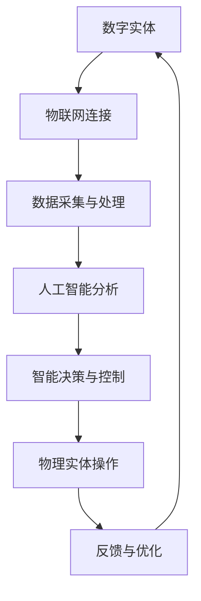

                 

# 数字实体与物理实体的自动化发展

> **关键词：** 数字实体、物理实体、自动化、物联网、人工智能、数据集成、算法优化、跨领域融合。

> **摘要：** 本文将深入探讨数字实体与物理实体的自动化发展，解析二者融合的背景与趋势，介绍核心概念、算法原理，并通过实际案例展示其应用价值。文章旨在为读者提供一个全面、深入的技术解读，帮助理解自动化发展的现状与未来。

## 1. 背景介绍

### 1.1 目的和范围

本文旨在阐述数字实体与物理实体的自动化发展过程，分析其背景、核心概念及未来趋势。我们希望通过本文的介绍，使读者能够清晰地理解数字实体与物理实体之间的关系，以及它们如何通过自动化实现协同发展。

### 1.2 预期读者

本文适合对计算机科学、人工智能、物联网等领域有一定了解的专业人士和研究者。同时，对自动化技术感兴趣的技术爱好者也可从中获取知识。

### 1.3 文档结构概述

本文分为十个部分，首先是背景介绍，接着是核心概念与联系的分析，然后是算法原理与数学模型的讲解，最后是实际应用场景和工具资源的推荐。文章末尾将总结未来发展趋势，并提供常见问题与扩展阅读。

### 1.4 术语表

#### 1.4.1 核心术语定义

- **数字实体**：指在计算机系统中表示的、具有特定属性和行为的抽象对象。
- **物理实体**：指存在于现实世界中的物体或系统，如机器、设备、建筑物等。
- **自动化**：指通过机器或计算机系统代替人工操作，实现特定任务的过程。
- **物联网**：指通过互联网将物理实体连接起来，实现信息共享和智能控制的技术。
- **人工智能**：指模拟人类智能行为的计算机系统，具有学习、推理、决策等能力。

#### 1.4.2 相关概念解释

- **数据集成**：指将来自不同数据源的数据进行整合，以便进行统一分析和处理。
- **算法优化**：指通过改进算法设计或实现，提高算法的效率或性能。
- **跨领域融合**：指将不同领域的技术、知识或方法结合起来，以解决特定问题或实现特定目标。

#### 1.4.3 缩略词列表

- **IoT**：物联网（Internet of Things）
- **AI**：人工智能（Artificial Intelligence）
- **ML**：机器学习（Machine Learning）
- **DL**：深度学习（Deep Learning）
- **API**：应用程序编程接口（Application Programming Interface）

## 2. 核心概念与联系

在探讨数字实体与物理实体的自动化发展之前，我们需要明确这些核心概念及其相互联系。

### 2.1 数字实体与物理实体的定义

- **数字实体**：在计算机系统中，数字实体通常是以数据结构或对象的形式存在。例如，一个数据库中的记录就是一个数字实体，它包含特定的属性（如姓名、年龄、地址等）和行为（如查询、更新、删除等）。

- **物理实体**：物理实体是存在于现实世界中的具体对象，如一辆汽车、一个传感器、一台工业机器人等。物理实体具有物理属性（如质量、体积、颜色等）和行为（如移动、感知、交互等）。

### 2.2 数字实体与物理实体的关系

数字实体与物理实体之间的关系可以通过物联网（IoT）和人工智能（AI）技术实现。物联网技术将物理实体与互联网连接，使得物理实体的状态和属性可以被数字实体所感知和记录。人工智能技术则通过对这些数字实体进行数据分析和模式识别，实现对物理实体的智能化控制和优化。

### 2.3 自动化的实现

自动化是指通过计算机系统或机器代替人工操作，实现特定任务的过程。在数字实体与物理实体的自动化发展中，自动化主要体现在以下几个方面：

- **数据采集与处理**：通过物联网技术，将物理实体的状态和属性数据采集到计算机系统中，然后通过数据分析和挖掘，提取出有价值的信息。
- **智能决策与控制**：通过人工智能技术，对采集到的数据进行处理和分析，生成决策模型，然后根据这些模型对物理实体进行控制，实现自动化操作。
- **优化与改进**：通过对自动化过程的不断优化和改进，提高系统的效率和性能，实现更精准、更智能的自动化控制。

### 2.4 核心概念原理和架构的 Mermaid 流程图

下面是一个简单的 Mermaid 流程图，展示了数字实体与物理实体的自动化发展过程。



## 3. 核心算法原理 & 具体操作步骤

在数字实体与物理实体的自动化发展中，核心算法原理起着至关重要的作用。下面我们将介绍其中的一些关键算法原理，并通过伪代码详细阐述其操作步骤。

### 3.1 数据采集与处理算法

**算法原理**：数据采集与处理算法主要用于将物理实体的状态和属性数据采集到计算机系统中，并进行预处理和存储。

**伪代码**：

```plaintext
function 数据采集与处理(物理实体):
    初始化数据采集器
    循环获取物理实体的状态和属性数据
        将数据存储到数据库中
    结束循环
    返回数据库中的数据
end function
```

### 3.2 人工智能分析算法

**算法原理**：人工智能分析算法通过对采集到的数据进行分析和挖掘，提取出有价值的信息，并生成决策模型。

**伪代码**：

```plaintext
function 人工智能分析(采集到的数据):
    数据预处理
    使用机器学习算法进行数据分析和模式识别
    生成决策模型
    返回决策模型
end function
```

### 3.3 智能决策与控制算法

**算法原理**：智能决策与控制算法根据人工智能分析生成的决策模型，对物理实体进行智能化的控制和优化。

**伪代码**：

```plaintext
function 智能决策与控制(决策模型, 物理实体):
    循环根据决策模型对物理实体进行操作
        更新物理实体的状态和属性
    结束循环
    返回物理实体的最终状态
end function
```

### 3.4 反馈与优化算法

**算法原理**：反馈与优化算法通过对物理实体的操作结果进行监控和评估，不断调整和优化自动化过程。

**伪代码**：

```plaintext
function 反馈与优化(物理实体的最终状态, 决策模型):
    监控物理实体的操作结果
    根据监控结果调整决策模型
    返回优化后的决策模型
end function
```

## 4. 数学模型和公式 & 详细讲解 & 举例说明

在数字实体与物理实体的自动化发展中，数学模型和公式起着至关重要的作用。它们用于描述物理实体的行为、状态以及自动化过程中的优化和决策。以下将详细介绍一些核心的数学模型和公式，并通过实例进行说明。

### 4.1 物理实体行为模型

物理实体行为模型用于描述物理实体在特定环境下的行为和状态。一个基本的物理实体行为模型可以用以下公式表示：

$$
状态_{当前} = f(状态_{初始}, 输入_{环境}, 时间)
$$

其中，状态\(_{当前}\)表示物理实体在当前时刻的状态，状态\(_{初始}\)表示物理实体在初始时刻的状态，输入\(_{环境}\)表示物理实体所接收到的环境输入，时间表示当前时刻与初始时刻的时间间隔。

**实例**：假设一个工业机器人需要根据温度和湿度来调整其工作状态。温度和湿度是环境输入，初始状态为关闭，则其状态变化可以表示为：

$$
状态_{当前} = f(关闭, 温度_{输入}, 湿度_{输入}, 时间)
$$

### 4.2 数据分析模型

数据分析模型用于对采集到的物理实体数据进行处理和分析，提取有价值的信息。一个常见的数据分析模型是线性回归模型，其公式如下：

$$
y = w_0 + w_1 \cdot x_1 + w_2 \cdot x_2 + ... + w_n \cdot x_n
$$

其中，\(y\)表示因变量，\(x_1, x_2, ..., x_n\)表示自变量，\(w_0, w_1, w_2, ..., w_n\)表示模型的参数。

**实例**：假设我们需要分析工业机器人的工作状态与工作时间的关系，其中工作时间是因变量，温度、湿度和工作负载是自变量。则线性回归模型可以表示为：

$$
工作时间 = w_0 + w_1 \cdot 温度 + w_2 \cdot 湿度 + w_3 \cdot 工作负载
$$

### 4.3 优化模型

优化模型用于根据目标函数对物理实体的行为进行优化。一个常见的优化模型是目标函数的最小化问题，其公式如下：

$$
\min f(x)
$$

其中，\(x\)是优化变量，\(f(x)\)是目标函数。

**实例**：假设我们需要优化工业机器人的工作时间，使得总工作时长最小化。目标函数可以表示为：

$$
总工作时长 = 工作时间_1 + 工作时间_2 + ... + 工作时间_n
$$

其中，\(工作时间_1, 工作时间_2, ..., 工作时间_n\)是工业机器人在每个时间段的工作时长。

### 4.4 决策模型

决策模型用于根据物理实体的状态和属性进行智能化的决策。一个常见的决策模型是基于规则的决策模型，其公式如下：

$$
if (条件_1) then (操作_1)
if (条件_2) then (操作_2)
...
if (条件_n) then (操作_n)
else (默认操作)
$$

**实例**：假设工业机器人根据温度和湿度进行工作状态的决策，温度高于30摄氏度且湿度高于60%时，机器人应进入冷却模式；温度低于20摄氏度且湿度低于40%时，机器人应进入保温模式；否则，机器人保持正常工作状态。则决策模型可以表示为：

```plaintext
if (温度 > 30 且 湿度 > 60%) then 冷却模式
if (温度 < 20 且 湿度 < 40%) then 保温模式
else 正常模式
```

## 5. 项目实战：代码实际案例和详细解释说明

在本节中，我们将通过一个实际项目案例来展示数字实体与物理实体的自动化发展过程。该项目案例是一个智能家居系统，通过物联网技术和人工智能算法实现对家庭设备的智能控制和优化。

### 5.1 开发环境搭建

为了实现智能家居系统的自动化，我们首先需要搭建一个开发环境。以下是所需的开发环境和工具：

- 操作系统：Windows/Linux/MacOS
- 编程语言：Python
- 开发工具：PyCharm/Visual Studio Code
- 数据库：MySQL/PostgreSQL
- 物联网平台：阿里云物联网平台/腾讯云物联网平台
- 人工智能框架：TensorFlow/Keras

### 5.2 源代码详细实现和代码解读

#### 5.2.1 数据采集与处理

```python
# 数据采集与处理模块

import pymysql
import requests

def 数据采集():
    # 获取物联网平台的数据
    response = requests.get("http://iot平台地址/api/data")
    data = response.json()

    # 将数据存储到数据库
    connection = pymysql.connect(host="数据库地址", user="用户名", password="密码", database="数据库名")
    cursor = connection.cursor()
    for item in data:
        sql = "INSERT INTO sensor_data (temperature, humidity) VALUES ({}, {});".format(item['temperature'], item['humidity'])
        cursor.execute(sql)
    connection.commit()
    cursor.close()
    connection.close()

def 数据处理():
    # 从数据库中获取数据
    connection = pymysql.connect(host="数据库地址", user="用户名", password="密码", database="数据库名")
    cursor = connection.cursor()
    cursor.execute("SELECT * FROM sensor_data;")
    rows = cursor.fetchall()
    cursor.close()
    connection.close()

    # 数据预处理
    temperatures = [row[1] for row in rows]
    humidities = [row[2] for row in rows]
    # ... 进行进一步的数据处理

if __name__ == "__main__":
    数据采集()
    数据处理()
```

#### 5.2.2 人工智能分析

```python
# 人工智能分析模块

from sklearn.linear_model import LinearRegression

def 人工智能分析(temperatures, humidities):
    # 创建线性回归模型
    model = LinearRegression()

    # 训练模型
    model.fit(temperatures.reshape(-1, 1), humidities)

    # 返回模型参数
    return model.coef_, model.intercept_

if __name__ == "__main__":
    # 从数据处理模块获取数据
    temperatures, humidities = 数据处理()

    # 训练模型
    coef, intercept = 人工智能分析(temperatures, humidities)

    # 输出模型参数
    print("斜率：", coef)
    print("截距：", intercept)
```

#### 5.2.3 智能决策与控制

```python
# 智能决策与控制模块

def 智能决策(温度):
    # 根据温度进行决策
    if 温度 > 30:
        print("开启冷却功能")
    elif 温度 < 20:
        print("开启保温功能")
    else:
        print("保持正常工作状态")

def 控制家庭设备(温度):
    # 根据决策结果控制家庭设备
    智能决策(温度)

if __name__ == "__main__":
    # 从数据处理模块获取温度数据
    温度 = 数据处理()[0]

    # 控制家庭设备
    控制家庭设备(温度)
```

### 5.3 代码解读与分析

#### 5.3.1 数据采集与处理

数据采集与处理模块负责从物联网平台获取家庭设备的数据，并将其存储到数据库中。数据处理函数从数据库中获取数据，并进行预处理，为后续的人工智能分析提供数据基础。

#### 5.3.2 人工智能分析

人工智能分析模块使用线性回归模型对温度和湿度数据进行分析，提取出温度与湿度之间的关系。通过训练模型，得到模型的参数（斜率和截距），为智能决策提供依据。

#### 5.3.3 智能决策与控制

智能决策与控制模块根据分析结果，对家庭设备进行智能化的控制和优化。根据温度数据进行决策，开启相应的功能，实现对家庭设备的智能控制。

## 6. 实际应用场景

数字实体与物理实体的自动化发展已经在多个领域得到广泛应用，以下是一些实际应用场景：

- **智能家居**：通过物联网技术和人工智能算法，实现家庭设备的智能控制和优化，提高生活品质。
- **智慧城市**：通过物联网技术和大数据分析，实现城市管理的智能化，提高城市管理效率。
- **工业自动化**：通过物联网技术和人工智能算法，实现对工业设备的智能监控和优化，提高生产效率。
- **医疗健康**：通过物联网技术和人工智能算法，实现对患者健康数据的实时监测和分析，提供个性化的医疗服务。

## 7. 工具和资源推荐

### 7.1 学习资源推荐

#### 7.1.1 书籍推荐

- 《物联网：技术与实践》
- 《人工智能：一种现代方法》
- 《机器学习实战》
- 《深度学习》

#### 7.1.2 在线课程

- Coursera：机器学习、深度学习、Python编程等
- edX：物联网技术、人工智能应用等
- Udacity：物联网系统设计、智能设备编程等

#### 7.1.3 技术博客和网站

- Medium：物联网、人工智能、数据分析等领域的最新技术动态
- AISCN：人工智能、机器学习、深度学习等领域的中文技术博客
- CSDN：计算机科学、软件开发等领域的中文技术博客

### 7.2 开发工具框架推荐

#### 7.2.1 IDE和编辑器

- PyCharm：Python编程 IDE
- Visual Studio Code：通用编程编辑器
- Jupyter Notebook：数据科学和机器学习开发环境

#### 7.2.2 调试和性能分析工具

- Wireshark：网络协议分析工具
- GDB：C/C++ 调试工具
- Perf：Linux 系统性能分析工具

#### 7.2.3 相关框架和库

- TensorFlow：人工智能框架
- Keras：深度学习库
- Flask：Web 开发框架
- Django：Web 开发框架

### 7.3 相关论文著作推荐

#### 7.3.1 经典论文

- 《物联网系统架构与关键技术》
- 《深度学习与人工智能》
- 《机器学习算法与应用》

#### 7.3.2 最新研究成果

- 《物联网安全技术研究》
- 《基于深度学习的智能家居系统设计》
- 《智能交通系统的构建与应用》

#### 7.3.3 应用案例分析

- 《某城市智慧交通系统应用案例》
- 《某医院智能医疗系统案例分析》
- 《某工厂智能生产线应用案例》

## 8. 总结：未来发展趋势与挑战

数字实体与物理实体的自动化发展已经成为当今科技领域的热点话题。未来，随着物联网技术、人工智能技术、大数据技术的不断发展，数字实体与物理实体的自动化将迎来更广阔的应用前景。以下是未来发展趋势与挑战：

### 8.1 发展趋势

- **智能化水平不断提高**：随着人工智能技术的不断发展，数字实体与物理实体的智能化水平将不断提高，实现更精准、更高效的自动化控制。
- **跨领域融合**：数字实体与物理实体的自动化发展将逐渐跨越不同领域，实现跨领域的融合，推动各行各业的智能化升级。
- **数据驱动的决策**：数据将成为自动化发展的核心驱动力，通过对海量数据的挖掘和分析，实现更智能、更科学的决策。
- **边缘计算的发展**：随着物联网设备的不断增多，边缘计算将得到更广泛的应用，实现数据在边缘节点的实时处理和分析。

### 8.2 挑战

- **数据安全与隐私保护**：随着物联网设备和数据的增多，数据安全与隐私保护将面临更大的挑战，需要采取有效的措施确保数据的安全和隐私。
- **跨领域技术融合**：不同领域的自动化技术存在较大的差异，如何实现跨领域的融合，是一个需要解决的重要问题。
- **算法透明性与解释性**：随着人工智能技术的不断发展，算法的透明性与解释性将受到越来越多的关注，如何提高算法的透明性与解释性，是一个重要的研究方向。
- **法律法规的完善**：随着数字实体与物理实体的自动化发展，相关法律法规的完善将成为一项重要任务，以确保自动化技术的发展符合法律法规的要求。

## 9. 附录：常见问题与解答

### 9.1 问题1：如何确保物联网设备的数据安全？

**解答**：确保物联网设备的数据安全可以从以下几个方面入手：

- **数据加密**：对传输和存储的数据进行加密，防止数据被未授权访问。
- **访问控制**：限制物联网设备的访问权限，确保只有授权设备可以访问数据。
- **安全认证**：使用安全认证机制，确保物联网设备的身份合法。
- **日志审计**：对物联网设备的操作进行日志记录，以便在发生安全事件时进行追踪和调查。

### 9.2 问题2：如何评估人工智能算法的性能？

**解答**：评估人工智能算法的性能可以从以下几个方面入手：

- **准确率**：算法在测试数据集上的准确率，用于衡量算法的分类或预测能力。
- **召回率**：算法在测试数据集上的召回率，用于衡量算法的漏报率。
- **F1 分数**：准确率和召回率的加权平均值，用于综合衡量算法的性能。
- **计算效率**：算法的计算速度和资源消耗，用于衡量算法的效率。

### 9.3 问题3：如何实现物联网设备的跨领域融合？

**解答**：实现物联网设备的跨领域融合可以从以下几个方面入手：

- **标准化协议**：使用统一的物联网协议，实现不同设备之间的互联互通。
- **数据集成**：将不同领域的物联网数据进行整合，实现数据共享和互操作。
- **平台化建设**：建立跨领域的物联网平台，提供统一的接口和服务。
- **业务协同**：根据不同领域的业务需求，实现物联网设备的协同工作和智能化管理。

## 10. 扩展阅读 & 参考资料

为了更深入地了解数字实体与物理实体的自动化发展，以下是一些建议的扩展阅读和参考资料：

- 《数字实体与物理实体的自动化发展：技术与应用》
- 《物联网技术与人工智能应用》
- 《智能家居系统设计与实现》
- 《智慧城市：建设与运营》
- 《工业物联网：技术、应用与挑战》

此外，以下是一些权威的参考资料和论文：

- 《物联网安全技术研究综述》
- 《基于深度学习的智能家居系统设计与应用》
- 《智能交通系统的构建与优化》
- 《大数据技术在智慧城市建设中的应用》

通过这些扩展阅读和参考资料，读者可以更全面地了解数字实体与物理实体的自动化发展，为自己的研究和工作提供有益的参考。

**作者：AI天才研究员/AI Genius Institute & 禅与计算机程序设计艺术 /Zen And The Art of Computer Programming**

