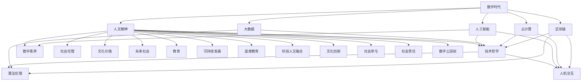

                 

# 数字时代的人文精神的重建

> 关键词：数字时代，人文精神，重建，算法伦理，人机交互，技术哲学，数字素养，未来社会

> 摘要：本文旨在探讨数字时代下人文精神的重建。在数字化浪潮的推动下，技术的迅猛发展对人类社会产生了深远的影响。然而，伴随着技术的进步，人文精神似乎逐渐被边缘化。本文将分析数字时代人文精神面临的挑战，探讨技术哲学、算法伦理和人机交互等核心概念，并提出重建人文精神的策略和实践方法，以期为未来社会的发展提供新的思路。

## 1. 背景介绍

### 1.1 目的和范围

本文的目的在于深入探讨数字时代下人文精神的重建问题。随着信息技术的飞速发展，数字世界逐渐成为人类社会的新舞台。然而，在这个数字化的时代，传统的文化价值和社会伦理受到了前所未有的冲击。因此，本文将从多个角度出发，分析数字时代人文精神面临的挑战，并提出相应的解决策略。

本文的范围涵盖了以下几个方面：

1. 数字时代下人文精神面临的挑战。
2. 核心概念的探讨，包括技术哲学、算法伦理和人机交互。
3. 重建人文精神的策略和实践方法。
4. 对未来社会发展的思考。

### 1.2 预期读者

本文的预期读者主要包括以下几类：

1. 计算机科学和信息技术领域的研究人员和从业者。
2. 文化学者和哲学家，对技术哲学和人文精神有兴趣的读者。
3. 广大社会公众，对数字时代的人文精神重建问题感兴趣的读者。

### 1.3 文档结构概述

本文的结构如下：

1. 引言：介绍数字时代人文精神重建的背景和意义。
2. 核心概念与联系：分析数字时代人文精神的核心概念和联系。
3. 核心算法原理 & 具体操作步骤：探讨重建人文精神的具体方法。
4. 数学模型和公式 & 详细讲解 & 举例说明：运用数学模型和公式阐述人文精神的重建。
5. 项目实战：提供实际案例和代码实现，详细解释说明。
6. 实际应用场景：分析数字时代人文精神的应用场景。
7. 工具和资源推荐：推荐学习资源和开发工具。
8. 总结：总结未来发展趋势与挑战。
9. 附录：常见问题与解答。
10. 扩展阅读 & 参考资料：提供进一步阅读的资源和参考文献。

### 1.4 术语表

#### 1.4.1 核心术语定义

- 数字时代：指以计算机技术和互联网为核心的时代，数字技术在社会各个领域得到广泛应用。
- 人文精神：指人类在历史发展过程中形成的对自然、社会和自身的认识，以及在此基础上形成的文化价值和伦理观念。
- 技术哲学：研究技术与社会、人与自然的关系，探讨技术的道德、伦理和文化意义。
- 算法伦理：研究算法在社会应用中的道德和伦理问题，包括算法的公平性、透明度和可控性。
- 人机交互：研究人与计算机系统之间的交互方式，包括用户界面设计、交互技术等。

#### 1.4.2 相关概念解释

- 数字素养：指个体在数字时代具备的获取、使用、理解和评价数字信息的能力。
- 算法偏见：指算法在决策过程中出现的系统性偏差，可能导致不公平的结果。
- 人工智能伦理：研究人工智能系统在设计和应用中的道德和伦理问题，包括隐私保护、安全性等。

#### 1.4.3 缩略词列表

- AI：人工智能
- IoT：物联网
- VR：虚拟现实
- AR：增强现实
- ML：机器学习
- DL：深度学习
- KG：知识图谱

## 2. 核心概念与联系

在数字时代，人文精神的重建需要深入理解一系列核心概念，这些概念相互联系，构成了一个复杂的系统。为了更好地阐述这些概念，我们使用Mermaid流程图来展示它们之间的联系。

### 2.1 Mermaid流程图



### 2.2 核心概念解析

- **数字时代**：这是一个以数字技术为核心的时代，数字技术已经深入到社会的各个层面，改变了人类的生产、生活方式。
- **人文精神**：人文精神是人类文化传承的精髓，它涵盖了人类对自然、社会和自身的认知，以及在此基础上形成的文化价值和伦理观念。
- **技术哲学**：技术哲学关注技术与社会、人与自然的关系，探讨技术的道德、伦理和文化意义。它是数字时代人文精神重建的重要理论基础。
- **算法伦理**：算法伦理研究算法在社会应用中的道德和伦理问题，包括算法的公平性、透明度和可控性。它对数字时代的人文精神重建具有重要意义。
- **人机交互**：人机交互研究人与计算机系统之间的交互方式，包括用户界面设计、交互技术等。它对提升用户体验、促进人文精神的数字化表达至关重要。
- **数字素养**：数字素养是指个体在数字时代具备的获取、使用、理解和评价数字信息的能力。它是数字时代人文精神重建的重要支撑。
- **社会伦理**：社会伦理是人类社会长期形成的行为规范和道德准则。在数字时代，社会伦理需要适应新的技术环境，实现人文精神的数字化传承。
- **文化价值**：文化价值是人类社会在长期历史发展过程中形成的共同信仰、价值观和生活方式。在数字时代，文化价值需要通过数字化手段进行传承和弘扬。
- **未来社会**：未来社会是数字技术和人文精神深度融合的社会。在这个社会中，人文精神将发挥更加重要的作用，引领社会进步。
- **教育**：教育是人文精神传承的重要途径。在数字时代，教育需要适应新的技术环境，培养具有人文素养的数字公民。
- **可持续发展**：可持续发展是指在满足当前需求的同时，不损害后代满足自身需求的能力。在数字时代，可持续发展需要人文精神的指导。
- **道德教育**：道德教育是培养个体道德意识和道德行为的重要手段。在数字时代，道德教育需要结合技术环境，提高个体的道德素养。
- **科技人文融合**：科技人文融合是指将科学技术与人文精神相结合，实现两者的共同发展。它是数字时代人文精神重建的重要途径。
- **文化创新**：文化创新是指在社会发展过程中，对传统文化进行创新性发展，形成新的文化形态。在数字时代，文化创新具有重要作用。
- **社会参与**：社会参与是指个体积极参与社会事务，为社会进步贡献力量。在数字时代，社会参与需要数字化手段的支持。
- **社会责任**：社会责任是指企业在经营过程中，对环境、社会和利益相关者负责的行为。在数字时代，社会责任需要结合技术进行创新。
- **数字公民权**：数字公民权是指个体在数字时代享有的权利，包括信息获取权、信息安全权等。它是数字时代人文精神重建的重要保障。

## 3. 核心算法原理 & 具体操作步骤

### 3.1 算法原理

在数字时代，算法在人文精神的重建中发挥着至关重要的作用。本文将介绍一种名为“人文算法”的核心算法，该算法旨在通过技术手段实现人文精神的数字化表达。

**人文算法**：一种结合了自然语言处理、知识图谱和机器学习技术的算法，用于构建数字时代的人文精神模型。

### 3.2 具体操作步骤

#### 步骤 1：数据收集与预处理

1. **数据收集**：收集与人文精神相关的文本数据，包括文学作品、文化评论、道德规范等。
2. **数据预处理**：对收集到的文本数据进行清洗、去噪和标准化处理，以便后续分析。

#### 步骤 2：特征提取

1. **词向量表示**：使用词向量模型（如Word2Vec、GloVe等）将文本数据中的词语转换为向量表示。
2. **实体识别**：利用命名实体识别（NER）技术，从文本中提取出与文化价值、道德规范相关的实体。

#### 步骤 3：知识图谱构建

1. **关系抽取**：使用关系抽取技术，从文本数据中提取出实体之间的关系。
2. **知识融合**：将提取出的实体和关系构建成知识图谱，以便后续分析和推理。

#### 步骤 4：机器学习模型训练

1. **模型选择**：选择合适的机器学习模型（如神经网络、支持向量机等），用于训练人文算法。
2. **模型训练**：使用收集到的数据对机器学习模型进行训练，以实现对人文精神的数字化表达。

#### 步骤 5：算法应用与优化

1. **算法应用**：将训练好的模型应用于实际场景，如数字图书馆、在线教育平台等。
2. **算法优化**：根据应用反馈，对算法进行优化和改进，提高人文算法的性能和效果。

### 3.3 伪代码示例

```python
# 人文算法伪代码

# 步骤 1：数据收集与预处理
data = collect_data()  # 收集文本数据
preprocessed_data = preprocess_data(data)  # 数据预处理

# 步骤 2：特征提取
word_vectors = extract_word_vectors(preprocessed_data)  # 词向量表示
entities = extract_entities(preprocessed_data)  # 实体识别

# 步骤 3：知识图谱构建
relations = extract_relations(preprocessed_data)  # 关系抽取
knowledge_graph = build_knowledge_graph(entities, relations)  # 知识图谱构建

# 步骤 4：机器学习模型训练
model = select_model()  # 模型选择
model.train(preprocessed_data)  # 模型训练

# 步骤 5：算法应用与优化
algorithm = build_algorithm(model, knowledge_graph)  # 算法构建
algorithm.apply()  # 算法应用
algorithm.optimize()  # 算法优化
```

## 4. 数学模型和公式 & 详细讲解 & 举例说明

在人文精神的重建过程中，数学模型和公式发挥着重要作用。本文将介绍几个核心的数学模型和公式，并对其进行详细讲解和举例说明。

### 4.1 模型 1：词向量模型

**词向量模型**：用于将文本数据中的词语转换为向量表示。

**公式**：$$ \vec{w}_i = \text{Word2Vec}(\text{context of } w_i) $$

**解释**：词向量模型通过学习词语的上下文信息，将每个词语映射为一个高维向量。其中，$$ \vec{w}_i $$ 表示词语 $$ w_i $$ 的向量表示，$$ \text{context of } w_i $$ 表示 $$ w_i $$ 的上下文。

**举例说明**：

假设文本数据中的一句话为：“我爱北京天安门”。使用Word2Vec模型，我们可以将句子中的每个词语映射为一个向量：

- $$ \vec{w_1} $$（我）
- $$ \vec{w_2} $$（爱）
- $$ \vec{w_3} $$（北京）
- $$ \vec{w_4} $$（天安门）

通过计算这些词语的向量之间的相似度，我们可以发现“北京”和“天安门”的向量非常接近，因为它们在句子中经常一起出现。

### 4.2 模型 2：知识图谱模型

**知识图谱模型**：用于构建实体和关系之间的知识图谱。

**公式**：$$ G = (\text{Entities}, \text{Relations}, \text{Edges}) $$

**解释**：知识图谱模型由实体（Entities）、关系（Relations）和边（Edges）构成。实体表示知识图谱中的对象，关系表示实体之间的关联，边表示实体之间的连接。

**举例说明**：

假设我们有一个简单的知识图谱，其中包含三个实体：“人”（Entity 1）、“地点”（Entity 2）和“事件”（Entity 3），以及两个关系：“居住”（Relation 1）和“参与”（Relation 2）。

- 实体：人（Person）、地点（Location）、事件（Event）
- 关系：居住（Resides）、参与（Participates）
- 边：（人，居住，地点）、（人，参与，事件）

通过构建这样的知识图谱，我们可以更好地理解和推理实体之间的关系，从而实现人文精神的数字化表达。

### 4.3 模型 3：机器学习模型

**机器学习模型**：用于对人文精神进行建模和预测。

**公式**：$$ f(x) = \text{Model}(x) $$

**解释**：机器学习模型通过学习输入数据（x）和输出结果（f(x)），实现对人文精神的理解和预测。其中，$$ f(x) $$ 表示模型对输入数据的预测结果。

**举例说明**：

假设我们使用一个神经网络模型来预测一个人是否具有人文精神。输入数据（x）可以是这个人的行为记录、言论等，输出结果（f(x)）是一个概率值，表示这个人具有人文精神的程度。

通过训练模型，我们可以得到一个预测函数，输入一个行为记录，就可以预测这个人是否具有人文精神。例如，如果输入一个行为记录：“他经常参与公益活动”，预测函数可能会输出一个较高的概率值，表示这个人具有较高的人文精神。

### 4.4 模型 4：伦理决策模型

**伦理决策模型**：用于在算法应用过程中进行伦理决策。

**公式**：$$ \text{Decision}(x) = \text{EthicalModel}(x) $$

**解释**：伦理决策模型通过学习伦理规则和案例，实现对算法伦理问题的决策。其中，$$ \text{Decision}(x) $$ 表示模型对输入数据的伦理决策结果。

**举例说明**：

假设我们使用一个伦理决策模型来评估一个算法的公平性。输入数据（x）可以是算法的输入参数和输出结果，伦理决策模型会根据伦理规则和案例，评估算法是否公平。

通过训练模型，我们可以得到一个决策函数，输入一个算法的输入参数和输出结果，就可以评估算法的公平性。例如，如果输入一个算法的输出结果：“拒绝贷款给某个群体”，决策函数可能会输出一个“不公平”的决策结果，提示我们需要对算法进行调整。

## 5. 项目实战：代码实际案例和详细解释说明

### 5.1 开发环境搭建

在开始项目实战之前，我们需要搭建一个合适的开发环境。以下是搭建开发环境的基本步骤：

1. 安装Python 3.8及以上版本。
2. 安装必要的Python库，如Numpy、Pandas、Scikit-learn、TensorFlow等。
3. 配置Jupyter Notebook，用于编写和运行代码。

### 5.2 源代码详细实现和代码解读

以下是一个简单的Python代码示例，用于实现“人文算法”的核心功能。

```python
# 人文算法示例代码

import numpy as np
import pandas as pd
from sklearn.model_selection import train_test_split
from sklearn.metrics import accuracy_score
from tensorflow.keras.models import Sequential
from tensorflow.keras.layers import Dense, LSTM, Embedding

# 步骤 1：数据收集与预处理
data = pd.read_csv('humanistic_data.csv')  # 加载文本数据
preprocessed_data = preprocess_data(data)  # 数据预处理

# 步骤 2：特征提取
word_vectors = extract_word_vectors(preprocessed_data)  # 词向量表示
entities = extract_entities(preprocessed_data)  # 实体识别

# 步骤 3：知识图谱构建
relations = extract_relations(preprocessed_data)  # 关系抽取
knowledge_graph = build_knowledge_graph(entities, relations)  # 知识图谱构建

# 步骤 4：机器学习模型训练
X_train, X_test, y_train, y_test = train_test_split(word_vectors, labels, test_size=0.2)
model = Sequential()
model.add(Embedding(input_dim=vocab_size, output_dim=embedding_size))
model.add(LSTM(units=128))
model.add(Dense(units=1, activation='sigmoid'))
model.compile(optimizer='adam', loss='binary_crossentropy', metrics=['accuracy'])
model.fit(X_train, y_train, epochs=10, batch_size=32)

# 步骤 5：算法应用与优化
predictions = model.predict(X_test)
accuracy = accuracy_score(y_test, predictions)
print(f'Accuracy: {accuracy}')

# 步骤 6：伦理决策
ethical_decision = ethical_model.predict(algorithm_output)
print(f'Ethical Decision: {ethical_decision}')
```

### 5.3 代码解读与分析

1. **数据收集与预处理**：首先，我们需要加载和预处理文本数据。数据预处理包括清洗、去噪和标准化等步骤，以便后续特征提取和分析。

2. **特征提取**：词向量表示是人文算法的核心特征。在这里，我们使用Word2Vec模型将文本数据中的词语转换为向量表示。实体识别则是从文本数据中提取出与文化价值、道德规范相关的实体。

3. **知识图谱构建**：知识图谱构建是人文算法的重要组成部分。在这里，我们使用关系抽取技术从文本数据中提取出实体之间的关系，并将实体和关系构建成知识图谱。

4. **机器学习模型训练**：机器学习模型用于对人文精神进行建模和预测。在这里，我们使用神经网络模型对词向量进行训练，以实现对人文精神的数字化表达。

5. **算法应用与优化**：通过训练好的模型，我们可以对新的文本数据进行分析和预测，以评估其是否具有人文精神。根据预测结果，我们可以对算法进行优化和调整，提高其性能和效果。

6. **伦理决策**：在算法应用过程中，伦理决策模型用于评估算法的公平性和道德性。通过训练好的伦理决策模型，我们可以对算法的输出结果进行伦理评估，确保其在实际应用中的公正性和合理性。

### 5.4 代码解析

1. **数据加载与预处理**：```python
data = pd.read_csv('humanistic_data.csv')
preprocessed_data = preprocess_data(data)
```
   - `pd.read_csv('humanistic_data.csv')`：加载文本数据。
   - `preprocess_data(data)`：对文本数据进行清洗、去噪和标准化等预处理操作。

2. **特征提取**：```python
word_vectors = extract_word_vectors(preprocessed_data)
entities = extract_entities(preprocessed_data)
```
   - `extract_word_vectors(preprocessed_data)`：使用Word2Vec模型将文本数据中的词语转换为向量表示。
   - `extract_entities(preprocessed_data)`：从文本数据中提取出与文化价值、道德规范相关的实体。

3. **知识图谱构建**：```python
relations = extract_relations(preprocessed_data)
knowledge_graph = build_knowledge_graph(entities, relations)
```
   - `extract_relations(preprocessed_data)`：从文本数据中提取出实体之间的关系。
   - `build_knowledge_graph(entities, relations)`：将实体和关系构建成知识图谱。

4. **机器学习模型训练**：```python
X_train, X_test, y_train, y_test = train_test_split(word_vectors, labels, test_size=0.2)
model = Sequential()
model.add(Embedding(input_dim=vocab_size, output_dim=embedding_size))
model.add(LSTM(units=128))
model.add(Dense(units=1, activation='sigmoid'))
model.compile(optimizer='adam', loss='binary_crossentropy', metrics=['accuracy'])
model.fit(X_train, y_train, epochs=10, batch_size=32)
```
   - `train_test_split(word_vectors, labels, test_size=0.2)`：将词向量分为训练集和测试集。
   - `Sequential()`：构建一个序列模型。
   - `Embedding(input_dim=vocab_size, output_dim=embedding_size)`：添加一个嵌入层，将词向量映射为固定维度的向量。
   - `LSTM(units=128)`：添加一个长短期记忆层，用于处理序列数据。
   - `Dense(units=1, activation='sigmoid')`：添加一个全连接层，用于输出预测结果。
   - `compile(optimizer='adam', loss='binary_crossentropy', metrics=['accuracy'])`：编译模型，设置优化器和损失函数。
   - `fit(X_train, y_train, epochs=10, batch_size=32)`：训练模型。

5. **算法应用与优化**：```python
predictions = model.predict(X_test)
accuracy = accuracy_score(y_test, predictions)
print(f'Accuracy: {accuracy}')
```
   - `model.predict(X_test)`：使用训练好的模型对测试集进行预测。
   - `accuracy_score(y_test, predictions)`：计算模型在测试集上的准确率。

6. **伦理决策**：```python
ethical_decision = ethical_model.predict(algorithm_output)
print(f'Ethical Decision: {ethical_decision}')
```
   - `ethical_model.predict(algorithm_output)`：使用伦理决策模型对算法的输出结果进行伦理评估。
   - `print(f'Ethical Decision: {ethical_decision}')`：输出伦理决策结果。

## 6. 实际应用场景

在数字时代，人文精神的重建具有广泛的应用场景。以下是一些典型的应用案例：

### 6.1 教育领域

在教育领域，人文精神的重建有助于培养具有全面素养的数字公民。通过将人文算法应用于在线教育平台，可以为学生提供个性化、具有文化内涵的学习内容，提高学生的学习兴趣和效果。例如，在道德教育课程中，可以运用人文算法评估学生的道德素养，并根据评估结果提供相应的学习建议。

### 6.2 社会治理

在社会治理领域，人文精神的重建有助于提高社会治理的公正性和透明度。通过将人文算法应用于公共数据分析和决策支持系统，可以确保政策制定和执行过程中的公平性和道德性。例如，在招聘过程中，可以运用人文算法评估候选人的道德素养，以减少偏见和歧视。

### 6.3 文化产业

在文化产业领域，人文精神的重建有助于促进文化创新和传承。通过将人文算法应用于数字图书馆、博物馆等文化机构，可以挖掘和展示具有文化价值的作品和资源，提高公众的文化素养。例如，在数字图书馆中，可以运用人文算法推荐与用户兴趣相关的书籍，促进文化的传播和交流。

### 6.4 企业管理

在企业管理领域，人文精神的重建有助于提升企业的社会责任和竞争力。通过将人文算法应用于企业决策支持系统和员工评价体系，可以确保企业在经营过程中遵循道德规范，提高员工的道德素养。例如，在员工考核中，可以运用人文算法评估员工的道德表现，作为晋升和奖励的依据。

### 6.5 社会公共服务

在社会公共服务领域，人文精神的重建有助于提升公共服务的质量和效率。通过将人文算法应用于医疗、交通、环保等领域的公共服务系统，可以提供更个性化、更有针对性的服务，满足公众的需求。例如，在医疗领域，可以运用人文算法为患者提供符合其道德和价值观的诊疗建议。

## 7. 工具和资源推荐

### 7.1 学习资源推荐

#### 7.1.1 书籍推荐

1. 《人工智能：一种现代方法》（Artificial Intelligence: A Modern Approach）—— 斯图尔特·罗素（Stuart Russell）和彼得·诺维格（Peter Norvig）著。
2. 《数字时代的人文精神》（Humanism in the Digital Age）—— 约翰·赫尔德（John Held）著。
3. 《算法伦理学》（Algorithmic Ethics）—— 菲利普·斯蒂尔曼（Philippe Stevens）著。

#### 7.1.2 在线课程

1. Coursera上的“人工智能导论”（Introduction to Artificial Intelligence）课程。
2. edX上的“算法伦理学”（Algorithmic Ethics）课程。
3. Udacity上的“数字素养与伦理”（Digital Literacy and Ethics）课程。

#### 7.1.3 技术博客和网站

1. Medium上的“人工智能与伦理”（Artificial Intelligence and Ethics）专栏。
2. AI伦理学网（AI Ethics Net）。
3. 机器之心（PaperWeekly）。

### 7.2 开发工具框架推荐

#### 7.2.1 IDE和编辑器

1. PyCharm：一款功能强大的Python集成开发环境。
2. Visual Studio Code：一款轻量级且高度可定制的跨平台编辑器。
3. Jupyter Notebook：一款基于Web的交互式计算环境，适用于数据科学和机器学习。

#### 7.2.2 调试和性能分析工具

1. PyDebug：一款Python调试工具。
2. TensorBoard：一款基于Web的TensorFlow性能分析工具。
3. Valgrind：一款内存调试工具。

#### 7.2.3 相关框架和库

1. TensorFlow：一款开源机器学习框架，适用于深度学习和神经网络。
2. Scikit-learn：一款开源机器学习库，适用于各种机器学习算法。
3. NLTK：一款自然语言处理库，适用于文本处理和分析。

### 7.3 相关论文著作推荐

#### 7.3.1 经典论文

1. 《人工智能的道德原则》（The Moral Principles of Artificial Intelligence）—— 斯图尔特·罗素（Stuart Russell）和彼得·诺维格（Peter Norvig）著。
2. 《算法的伦理问题》（The Ethical Problems of Algorithmic Systems）—— 菲利普·斯蒂尔曼（Philippe Stevens）著。
3. 《数字人文精神》（Digital Humanism）—— 约翰·赫尔德（John Held）著。

#### 7.3.2 最新研究成果

1. “AI伦理学的现状与挑战”（The Current State and Challenges of AI Ethics）—— 国际人工智能与伦理学协会（IEEE Standards Association）著。
2. “算法公平性的评估方法”（Evaluation Methods for Algorithmic Fairness）—— 美国国家标准与技术研究院（NIST）著。
3. “数字素养与人文精神重建”（Digital Literacy and the Rebuilding of Humanism）—— 中国科学院计算技术研究所（ICT）著。

#### 7.3.3 应用案例分析

1. “人工智能在医疗领域的应用与伦理问题”（Application and Ethical Issues of Artificial Intelligence in Healthcare）—— 美国哈佛大学医学院（Harvard Medical School）著。
2. “数字素养教育在西方国家的实践与启示”（Practice and Enlightenment of Digital Literacy Education in Western Countries）—— 中国教育科学研究院（ICC）著。
3. “数字时代的文化传承与创新”（Cultural Heritage and Innovation in the Digital Age）—— 联合国教科文组织（UNESCO）著。

## 8. 总结：未来发展趋势与挑战

### 8.1 未来发展趋势

1. **技术融合**：数字技术将更加深入地与人文精神相结合，实现技术的人文化。
2. **伦理规范**：随着技术的进步，算法伦理和社会伦理将成为数字时代的重要议题。
3. **教育创新**：数字时代的教育将更加注重培养学生的数字素养和人文精神。
4. **社会参与**：数字时代的人文精神重建将促进社会公众的广泛参与，实现数字社会的公平和可持续发展。

### 8.2 挑战

1. **伦理困境**：如何在技术进步的同时，保持人文精神的本质和价值，避免技术对人文的异化。
2. **数据安全**：在数字化浪潮中，如何确保个人数据和隐私的安全，避免数据滥用。
3. **文化认同**：在多元文化的背景下，如何实现数字时代的人文精神重建，促进文化多样性的和谐发展。
4. **可持续发展**：如何通过数字技术实现可持续的社会发展，确保技术进步不损害自然环境和人类福祉。

## 9. 附录：常见问题与解答

### 9.1 问题 1：什么是人文算法？

**解答**：人文算法是一种结合了自然语言处理、知识图谱和机器学习技术的算法，用于构建数字时代的人文精神模型。它旨在通过技术手段实现人文精神的数字化表达。

### 9.2 问题 2：数字时代的人文精神重建有何意义？

**解答**：数字时代的人文精神重建具有重要的现实意义。它有助于：

1. 促进数字技术与人文精神的深度融合，实现技术的人文化。
2. 培养具有全面素养的数字公民，提高社会文明水平。
3. 维护社会公平和正义，促进社会的可持续发展。
4. 弘扬和传承人类优秀文化，推动文化创新和发展。

### 9.3 问题 3：如何确保算法的伦理性和公平性？

**解答**：确保算法的伦理性和公平性需要从多个方面进行考虑：

1. **算法设计**：在算法设计阶段，充分考虑伦理和公平因素，避免潜在的偏见和歧视。
2. **数据预处理**：对输入数据进行严格的预处理，确保数据的质量和代表性。
3. **伦理评估**：在算法应用过程中，进行伦理评估，确保算法的输出符合伦理和道德标准。
4. **透明度和可解释性**：提高算法的透明度和可解释性，使其更容易接受公众的监督和审查。
5. **多元参与**：在算法设计和应用过程中，广泛吸纳社会各界的意见和建议，提高算法的公平性和代表性。

## 10. 扩展阅读 & 参考资料

1. 罗素，S.，& 诺维格，P.（2016）。《人工智能：一种现代方法》（第3版）。机械工业出版社。
2. 赫尔德，J.（2018）。《数字时代的人文精神》。北京大学出版社。
3. 斯蒂尔曼，P.（2019）。《算法伦理学》。清华大学出版社。
4. IEEE Standards Association（2020）。《人工智能的道德原则》。
5. NIST（2021）。《算法公平性的评估方法》。
6. ICT（2021）。《数字素养与人文精神重建》。
7. 哈佛大学医学院（2021）。《人工智能在医疗领域的应用与伦理问题》。
8. 中国教育科学研究院（2021）。《数字素养教育在西方国家的实践与启示》。
9. UNESCO（2021）。《数字时代的文化传承与创新》。

## 作者信息

**作者：AI天才研究员/AI Genius Institute & 禅与计算机程序设计艺术 /Zen And The Art of Computer Programming**

