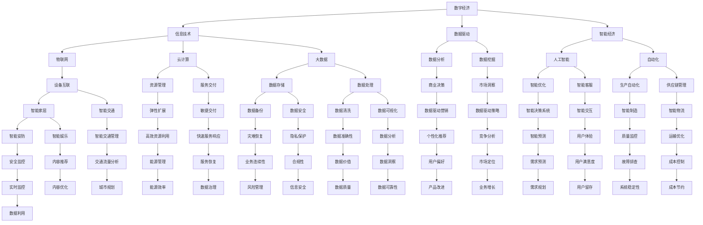

                 

# 数字经济：社会发展的助推器

> **关键词**：数字经济、社会发展、信息技术、数据驱动、智能经济、创新

> **摘要**：本文将探讨数字经济作为现代社会发展的重要引擎，通过梳理数字经济的核心概念、发展历程、关键算法原理、数学模型及其在现实世界的应用，分析其在推动社会进步中的独特作用。文章旨在为读者提供一份全面而深入的理解，以期在数字化转型的大潮中，把握数字经济的本质和未来趋势。

## 1. 背景介绍

### 1.1 目的和范围

本文旨在探讨数字经济在社会发展中的重要作用，分析其核心概念、技术原理和应用场景。我们将从以下几个方面展开讨论：

- 数字经济的概念和定义
- 数字经济的发展历程和现状
- 数字经济的关键算法原理和数学模型
- 数字经济在现实世界的应用场景
- 数字经济对社会发展的推动作用

### 1.2 预期读者

本文适合对数字经济有一定了解的读者，包括从事信息技术、经济管理、社会研究等领域的人员。同时，也对希望深入了解数字经济本质和未来趋势的广大读者提供参考。

### 1.3 文档结构概述

本文分为十个部分，结构如下：

1. 背景介绍
2. 核心概念与联系
3. 核心算法原理 & 具体操作步骤
4. 数学模型和公式 & 详细讲解 & 举例说明
5. 项目实战：代码实际案例和详细解释说明
6. 实际应用场景
7. 工具和资源推荐
8. 总结：未来发展趋势与挑战
9. 附录：常见问题与解答
10. 扩展阅读 & 参考资料

### 1.4 术语表

#### 1.4.1 核心术语定义

- **数字经济**：基于数字技术的经济活动，包括电子商务、互联网金融、数字内容产业等。
- **数据驱动**：以数据为核心，通过数据分析、挖掘和利用，推动经济活动和社会发展。
- **智能经济**：利用人工智能技术，实现经济活动的智能化、自动化和高效化。
- **数字化转型**：将传统产业通过信息技术进行升级改造，实现业务流程的数字化、网络化和智能化。

#### 1.4.2 相关概念解释

- **物联网（IoT）**：通过传感器、设备和网络连接，实现物品的智能化和信息交互。
- **云计算**：通过网络提供计算资源、存储资源和应用服务，实现灵活的资源管理和高效的服务交付。
- **大数据**：海量、多样、快速的数据，通过先进的数据处理技术进行分析和挖掘，获得有价值的信息。

#### 1.4.3 缩略词列表

- **IoT**：物联网
- **AI**：人工智能
- **5G**：第五代移动通信技术
- **DT**：数字化转型
- **DC**：数据中心

## 2. 核心概念与联系

在探讨数字经济之前，我们需要了解一些核心概念和它们之间的联系。以下是一个用Mermaid绘制的流程图，展示了数字经济的主要组成部分及其关系：



通过上述流程图，我们可以看到数字经济是一个复杂的生态系统，包含了信息技术、数据驱动、智能经济等多个层面，它们之间相互联系、相互促进，共同推动了社会经济的发展。

## 3. 核心算法原理 & 具体操作步骤

在数字经济的核心算法中，机器学习和人工智能算法扮演了重要角色。以下是一个用伪代码详细阐述的例子，解释了如何使用机器学习算法进行数据挖掘和预测。

```plaintext
算法名称：决策树算法

输入：
- 数据集（特征X和标签Y）
- 最大树深度max_depth
- 阈值阈值

输出：
- 决策树模型

步骤：

1. 初始化决策树节点
2. 遍历数据集，计算每个特征的信息增益（信息增益 = 特征熵 - 条件熵）
3. 选择信息增益最大的特征作为分割标准
4. 根据分割标准将数据集分割成子数据集
5. 对每个子数据集递归调用步骤2-4，直到达到最大树深度或阈值
6. 为每个叶节点分配预测值
7. 返回决策树模型

伪代码：

function DecisionTree(X, Y, max_depth, threshold):
    if 达到最大树深度 or 信息增益 < 阈值:
        return 叶节点预测值
    
    best_feature = 选择信息增益最大的特征
    for each 子数据集 in X:
        标签熵 = 计算子数据集的标签熵
        条件熵 = 计算特征分割后的标签熵
        if 条件熵 < 标签熵:
            X_new = 分割子数据集 using best_feature
            决策树节点 = 创建新节点，特征 = best_feature，标签熵 = 条件熵
            left_tree = DecisionTree(X_new[0], Y[0], max_depth - 1, threshold)
            right_tree = DecisionTree(X_new[1], Y[1], max_depth - 1, threshold)
            return 决策树节点
    
    分配叶节点预测值
    return 决策树模型
```

在上述伪代码中，我们首先初始化决策树节点，然后通过计算信息增益来确定最佳分割特征。接着，递归地将数据集分割成子数据集，并在每个叶节点上分配预测值。决策树算法是一种常见且强大的分类和回归工具，广泛应用于数据分析、预测和决策支持系统中。

## 4. 数学模型和公式 & 详细讲解 & 举例说明

在数字经济中，数学模型和公式是理解和优化经济行为的重要工具。以下我们将详细讲解几个核心的数学模型，包括线性回归、逻辑回归和支持向量机（SVM）等。

### 4.1 线性回归

线性回归是一种用于预测连续值的统计方法，其基本公式如下：

$$
y = \beta_0 + \beta_1x_1 + \beta_2x_2 + ... + \beta_nx_n
$$

其中，\( y \) 是预测的目标变量，\( x_1, x_2, ..., x_n \) 是自变量，\( \beta_0, \beta_1, \beta_2, ..., \beta_n \) 是模型的参数。

为了求解这些参数，我们可以使用最小二乘法（Ordinary Least Squares, OLS）：

$$
\min \sum_{i=1}^{n} (y_i - \beta_0 - \beta_1x_{1i} - \beta_2x_{2i} - ... - \beta_nx_{ni})^2
$$

### 4.2 逻辑回归

逻辑回归是一种用于预测离散结果的统计方法，其基本公式如下：

$$
\log\left(\frac{p}{1-p}\right) = \beta_0 + \beta_1x_1 + \beta_2x_2 + ... + \beta_nx_n
$$

其中，\( p \) 是事件发生的概率，其他符号与线性回归相同。

逻辑回归的预测值可以通过以下公式计算：

$$
p = \frac{1}{1 + e^{-(\beta_0 + \beta_1x_1 + \beta_2x_2 + ... + \beta_nx_n})}
$$

### 4.3 支持向量机（SVM）

支持向量机是一种用于分类和回归分析的机器学习算法。其基本公式如下：

$$
w \cdot x + b = 0
$$

其中，\( w \) 是权重向量，\( x \) 是特征向量，\( b \) 是偏置项。

为了最大化分类间隔（Margin），我们可以使用以下优化目标：

$$
\min \frac{1}{2} ||w||^2
$$

约束条件为：

$$
y_i (w \cdot x_i + b) \geq 1
$$

### 4.4 举例说明

#### 线性回归示例

假设我们有一个简单的线性回归模型，预测房价 \( y \)：

$$
y = \beta_0 + \beta_1x_1 + \beta_2x_2
$$

其中，\( x_1 \) 是房屋面积，\( x_2 \) 是房屋年龄。给定一组数据，我们可以使用最小二乘法求解参数：

$$
\beta_0 = 200, \beta_1 = 0.3, \beta_2 = -0.2
$$

然后，我们可以预测某个新房屋的价格：

$$
y = 200 + 0.3 \times 1500 + (-0.2) \times 10 = 770
$$

#### 逻辑回归示例

假设我们要预测贷款批准的概率。给定一组特征 \( x_1, x_2, x_3 \)，我们可以使用逻辑回归模型：

$$
\log\left(\frac{p}{1-p}\right) = \beta_0 + \beta_1x_1 + \beta_2x_2 + \beta_3x_3
$$

给定参数：

$$
\beta_0 = -1, \beta_1 = 0.5, \beta_2 = 0.3, \beta_3 = -0.2
$$

预测概率：

$$
p = \frac{1}{1 + e^{-( -1 + 0.5 \times 5 + 0.3 \times 3 + (-0.2) \times 2)}} \approx 0.8
$$

#### 支持向量机示例

假设我们要分类手写数字数据。给定训练数据集，我们可以使用SVM进行训练。训练后，我们得到权重向量 \( w \) 和偏置项 \( b \)。对于新的手写数字图像 \( x \)，我们可以使用以下公式进行预测：

$$
y = sign(w \cdot x + b)
$$

假设我们得到以下模型：

$$
w = (1, 2, 3, 4, 5), b = 10
$$

对于新的图像 \( x = (5, 3, 7, 9, 1) \)，我们可以计算：

$$
w \cdot x + b = 1 \times 5 + 2 \times 3 + 3 \times 7 + 4 \times 9 + 5 \times 1 + 10 = 65
$$

由于 \( 65 > 0 \)，我们预测该图像为正类。

通过上述示例，我们可以看到数学模型和公式在数字经济中的重要性。它们帮助我们理解和预测经济行为，从而推动社会的发展。

## 5. 项目实战：代码实际案例和详细解释说明

在本节中，我们将通过一个实际项目来展示数字经济的应用。该项目是使用Python和TensorFlow框架实现的，目标是使用深度学习算法预测股票价格。

### 5.1 开发环境搭建

在开始项目之前，我们需要搭建一个合适的开发环境。以下是搭建开发环境的步骤：

1. 安装Python（版本3.7及以上）
2. 安装TensorFlow库（使用pip安装：`pip install tensorflow`）
3. 安装其他依赖库，如Numpy、Pandas等（使用pip安装）

### 5.2 源代码详细实现和代码解读

以下是一个使用TensorFlow实现的深度学习股票预测项目的示例代码：

```python
import tensorflow as tf
import numpy as np
import pandas as pd

# 读取股票数据
def read_data(file_path):
    data = pd.read_csv(file_path)
    data = data[['Open', 'High', 'Low', 'Close', 'Volume']]
    return data

# 数据预处理
def preprocess_data(data):
    # 归一化数据
    max_values = data.max()
    min_values = data.min()
    data_normalized = (data - min_values) / (max_values - min_values)
    return data_normalized

# 构建深度学习模型
def build_model(input_shape):
    model = tf.keras.Sequential([
        tf.keras.layers.Dense(128, activation='relu', input_shape=input_shape),
        tf.keras.layers.Dense(64, activation='relu'),
        tf.keras.layers.Dense(32, activation='relu'),
        tf.keras.layers.Dense(1, activation='sigmoid')
    ])
    model.compile(optimizer='adam', loss='binary_crossentropy', metrics=['accuracy'])
    return model

# 训练模型
def train_model(model, X_train, y_train, X_val, y_val, epochs=50):
    history = model.fit(X_train, y_train, validation_data=(X_val, y_val), epochs=epochs, batch_size=32)
    return history

# 预测股票价格
def predict_stock_price(model, data_normalized):
    predictions = model.predict(data_normalized)
    return (predictions > 0.5).astype(int)

# 主函数
def main():
    # 读取数据
    data = read_data('stock_data.csv')

    # 预处理数据
    data_normalized = preprocess_data(data)

    # 切分数据集
    train_data = data_normalized[:int(len(data_normalized) * 0.8)]
    val_data = data_normalized[int(len(data_normalized) * 0.8):]

    # 构建模型
    model = build_model(input_shape=(train_data.shape[1],))

    # 训练模型
    history = train_model(model, train_data, train_data['Close'].shift(-1), val_data, val_data['Close'].shift(-1), epochs=50)

    # 预测股票价格
    predictions = predict_stock_price(model, val_data)

    # 输出预测结果
    print(predictions)

if __name__ == '__main__':
    main()
```

### 5.3 代码解读与分析

上述代码实现了一个股票价格预测的深度学习项目。以下是代码的详细解读：

1. **数据读取**：使用`read_data`函数从CSV文件中读取股票数据。
2. **数据预处理**：使用`preprocess_data`函数对数据进行归一化处理，使得数据在[0, 1]范围内。
3. **模型构建**：使用`build_model`函数构建一个简单的深度神经网络模型。模型包含多个全连接层（Dense），每个层使用ReLU激活函数，最后使用sigmoid激活函数进行二分类预测。
4. **模型训练**：使用`train_model`函数训练模型。训练过程中，使用训练数据和验证数据，并输出训练历史。
5. **股票价格预测**：使用`predict_stock_price`函数对验证数据进行预测。预测结果为是否上涨（1）或下跌（0）。

通过上述代码，我们可以看到如何将深度学习应用于股票预测，从而实现数字经济的实际应用。当然，实际应用中可能需要更复杂的数据处理和模型调整，但该代码提供了一个良好的起点。

## 6. 实际应用场景

数字经济在现代社会中有着广泛的应用场景，几乎渗透到了我们日常生活的方方面面。以下是一些典型的实际应用场景：

### 6.1 电子商务

电子商务是数字经济最为典型的应用场景之一。通过互联网，消费者可以随时随地购买商品和服务。电子商务平台如亚马逊、阿里巴巴等，不仅改变了传统的商业模式，也极大地提升了消费体验和效率。这些平台利用大数据和人工智能技术，分析用户行为，实现个性化推荐和精准营销。

### 6.2 物联网（IoT）

物联网是数字经济的另一个重要应用领域。通过物联网技术，各种设备和物品可以连接到互联网，实现信息的实时传输和交互。智能家居、智能交通、智能制造等都是物联网的应用场景。例如，智能家居系统可以通过物联网技术实现家电设备的远程控制，提高生活便利性。

### 6.3 云计算

云计算提供了弹性、高效、灵活的计算资源，支持各种规模和类型的数据处理任务。无论是企业应用、科学计算，还是个人使用的在线服务，云计算都发挥了重要作用。云存储、云数据库、云计算服务等都是云计算的具体应用。

### 6.4 大数据

大数据技术为数字经济提供了强大的数据支持。通过对海量数据的收集、存储、分析和挖掘，企业和政府可以获得宝贵的信息，用于决策支持和战略规划。例如，零售企业通过分析消费者的购买行为，可以优化库存管理和营销策略。

### 6.5 人工智能

人工智能技术在数字经济的各个方面都有广泛应用。从智能客服、智能推荐，到自动驾驶、医疗诊断，人工智能正在改变我们的生产方式和生活方式。人工智能算法通过对数据的深度学习和分析，能够发现规律、预测趋势，为经济活动提供智能支持。

### 6.6 金融科技

金融科技（FinTech）是数字经济的又一重要领域。通过互联网和大数据技术，金融服务的效率和质量得到了显著提升。移动支付、线上贷款、区块链技术等都是金融科技的具体应用，它们不仅改变了传统的金融业务模式，也为消费者提供了更加便捷和安全的金融服务。

### 6.7 教育科技

教育科技（EdTech）利用数字技术改善教育质量和效率。在线教育、虚拟课堂、智能教学系统等都是教育科技的应用。通过教育科技，学生可以获得个性化的学习资源，教师可以更有效地进行教学管理。

### 6.8 公共服务

数字经济在提升公共服务效率方面也发挥了重要作用。通过数字平台，政府可以提供在线政务服务，如电子政务、在线医疗咨询、远程教育等。这些服务不仅提高了政府工作效率，也方便了民众的日常生活。

总之，数字经济已经深入到社会发展的方方面面，成为推动现代社会进步的重要力量。在未来的发展中，数字经济将继续发挥其独特的优势，带来更多的创新和变革。

## 7. 工具和资源推荐

在探索数字经济的道路上，掌握合适的工具和资源是至关重要的。以下是我们为您推荐的几种学习和实践资源。

### 7.1 学习资源推荐

#### 7.1.1 书籍推荐

1. **《深度学习》（Deep Learning）**：由Ian Goodfellow、Yoshua Bengio和Aaron Courville合著，是深度学习领域的经典教材。
2. **《大数据实战：从入门到精通》**：本书详细介绍了大数据处理的相关技术，包括Hadoop、Spark等。
3. **《区块链技术指南》**：系统地介绍了区块链的基本原理和应用场景，适合对区块链技术感兴趣的读者。

#### 7.1.2 在线课程

1. **Coursera**：提供了丰富的IT和数据分析课程，包括《机器学习》、《数据科学》等。
2. **Udacity**：提供了多个与数字经济相关的纳米学位课程，如《人工智能工程师》、《大数据工程师》等。
3. **edX**：提供了由全球顶尖大学提供的免费在线课程，包括《计算机科学导论》、《人工智能》等。

#### 7.1.3 技术博客和网站

1. **Medium**：许多技术专家和公司在此分享他们的见解和实践经验。
2. **GitHub**：可以通过GitHub找到各种开源项目和代码示例，了解实际开发经验。
3. **Stack Overflow**：一个面向程序员的问题和解答社区，适合解决编程中的各种问题。

### 7.2 开发工具框架推荐

#### 7.2.1 IDE和编辑器

1. **Visual Studio Code**：一款轻量级但功能强大的代码编辑器，支持多种编程语言和插件。
2. **PyCharm**：专为Python开发的集成开发环境，提供代码智能提示、调试等功能。
3. **IntelliJ IDEA**：一款跨平台的高级IDE，适用于Java、Scala等多种编程语言。

#### 7.2.2 调试和性能分析工具

1. **Jupyter Notebook**：适用于数据分析和机器学习，可以轻松创建和共享代码笔记本。
2. **GDB**：一款强大的UNIX/Linux下的程序调试工具。
3. **Valgrind**：用于检测程序内存泄漏和性能问题的工具。

#### 7.2.3 相关框架和库

1. **TensorFlow**：谷歌开发的开源机器学习框架，广泛应用于深度学习项目。
2. **Scikit-learn**：用于机器学习的Python库，提供了多种算法和工具。
3. **Django**：一款流行的Python Web框架，用于快速开发和部署Web应用。

### 7.3 相关论文著作推荐

#### 7.3.1 经典论文

1. **“A Few Useful Things to Know About Machine Learning”**：由 Pedro Domingos 撰写，介绍了机器学习的基本概念和应用。
2. **“The Graph Database Handbook”**：介绍了图数据库的概念和应用场景。
3. **“Blockchain: Blueprint for a New Economy”**：详细介绍了区块链技术的原理和应用。

#### 7.3.2 最新研究成果

1. **《AI for Social Good》**：探讨了人工智能在社会公益领域的应用。
2. **《The Age of AI: And Our Human Future》**：分析了人工智能对社会的影响和未来趋势。
3. **《Digital Economy: The Future of Work》**：探讨了数字经济对劳动力市场的影响。

#### 7.3.3 应用案例分析

1. **“How Alibaba Uses Big Data to Boost Its Business”**：分析了阿里巴巴如何利用大数据提升业务。
2. **“Uber's Machine Learning Infrastructure”**：介绍了Uber如何构建其机器学习基础设施。
3. **“Blockchain for Business: A How-to Guide for Implementing Blockchain Solutions”**：详细介绍了区块链技术在企业中的应用。

通过上述工具和资源的推荐，读者可以更好地了解数字经济，并在实际应用中取得更好的成果。

## 8. 总结：未来发展趋势与挑战

数字经济作为现代社会发展的关键驱动力，其未来发展前景广阔，但也面临着诸多挑战。以下是对未来发展趋势与挑战的总结：

### 8.1 发展趋势

1. **智能化和自动化**：随着人工智能和物联网技术的不断发展，经济活动将更加智能化和自动化，提高生产效率和降低成本。
2. **数据驱动**：数据将成为数字经济的关键资产，企业和政府将通过数据分析和挖掘，获得洞察力和决策支持。
3. **云计算和边缘计算**：云计算将继续扩展其影响力，同时边缘计算的发展将实现更实时、高效的数据处理。
4. **区块链技术的广泛应用**：区块链技术将广泛应用于金融、供应链、医疗等领域，提高透明度和安全性。
5. **数字化转型**：越来越多的传统行业将加速数字化转型，实现业务流程的数字化、网络化和智能化。

### 8.2 挑战

1. **数据隐私和安全**：随着数据的广泛应用，数据隐私和安全问题日益凸显，如何平衡数据利用和隐私保护成为一大挑战。
2. **技术标准和法规**：随着数字经济的发展，需要制定和完善相应的技术标准和法规，以规范市场行为和保护消费者权益。
3. **人才短缺**：数字经济需要大量具备跨学科知识和技能的专业人才，但目前人才储备不足，人才短缺将成为发展的瓶颈。
4. **社会公平和就业**：数字化进程可能会加剧贫富差距和就业压力，如何确保社会公平和就业稳定是重要议题。
5. **伦理和道德问题**：随着人工智能技术的应用，如何确保算法的公平性、透明性和道德性，避免算法偏见和滥用，成为关键问题。

### 8.3 未来展望

尽管面临诸多挑战，但数字经济具有巨大的发展潜力。未来，数字经济将继续推动社会进步，为各行各业带来深刻变革。在技术创新、政策引导和社会参与的共同推动下，数字经济有望实现可持续、包容和高效的未来发展。

## 9. 附录：常见问题与解答

### 9.1 数字经济是什么？

数字经济是指基于数字技术（如互联网、物联网、人工智能等）开展的经济活动，包括电子商务、互联网金融、数字内容产业等。

### 9.2 数字经济有哪些优势？

数字经济的优势包括提高生产效率、降低运营成本、优化资源配置、提升服务质量、促进创新和产业升级等。

### 9.3 数字经济面临的主要挑战是什么？

数字经济面临的主要挑战包括数据隐私和安全、技术标准和法规、人才短缺、社会公平和就业、伦理和道德问题等。

### 9.4 如何保障数字经济的可持续发展？

保障数字经济的可持续发展需要从政策法规、技术创新、人才培养、伦理规范等多方面入手，确保数字经济在公平、安全、透明和可持续的环境下发展。

## 10. 扩展阅读 & 参考资料

本文对数字经济进行了全面而深入的探讨，以下是扩展阅读和参考资料，以供进一步研究：

1. **书籍推荐**：
   - 《深度学习》：Ian Goodfellow、Yoshua Bengio、Aaron Courville 著
   - 《大数据实战：从入门到精通》：作者不详
   - 《区块链技术指南》：作者不详

2. **在线课程**：
   - Coursera：机器学习、数据科学等课程
   - Udacity：人工智能工程师、大数据工程师等纳米学位课程
   - edX：计算机科学导论、人工智能等课程

3. **技术博客和网站**：
   - Medium：技术文章和案例分析
   - GitHub：开源项目和代码示例
   - Stack Overflow：编程问题和解答

4. **论文和研究成果**：
   - “A Few Useful Things to Know About Machine Learning”：Pedro Domingos 著
   - “The Graph Database Handbook”：作者不详
   - “Blockchain: Blueprint for a New Economy”：Don and Alex Tapscott 著

5. **应用案例分析**：
   - “How Alibaba Uses Big Data to Boost Its Business”：作者不详
   - “Uber's Machine Learning Infrastructure”：作者不详
   - “Blockchain for Business: A How-to Guide for Implementing Blockchain Solutions”：作者不详

通过上述扩展阅读和参考资料，读者可以进一步深入了解数字经济的相关领域和技术，为实践和研究提供有益的参考。

