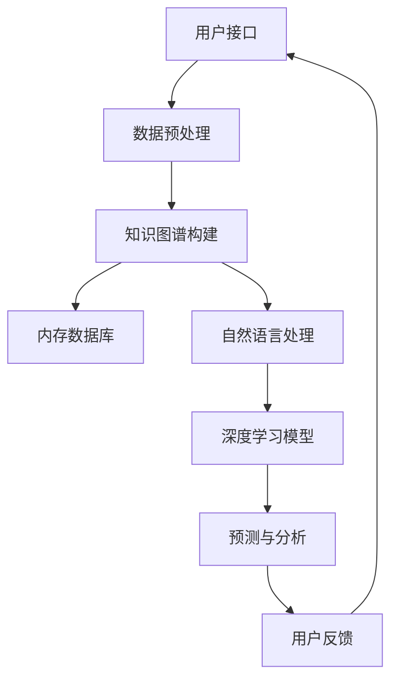

                 

### 背景介绍

#### 1.1 目的和范围

本文旨在探讨数字记忆银行这一概念，并深入分析其在全球脑时代知识存储领域的重要性。数字记忆银行不仅代表了知识存储的一种新方式，更是应对信息爆炸时代知识管理难题的重要手段。通过本文，我们将逐步解析数字记忆银行的核心概念、原理和实际应用，帮助读者理解其在未来的发展前景。

本文的讨论范围包括：

1. **数字记忆银行的定义**：介绍数字记忆银行的基本概念，阐述其在知识存储中的独特作用。
2. **全球脑时代的背景**：分析全球脑时代的到来对知识存储需求的驱动因素。
3. **核心概念与联系**：通过Mermaid流程图展示数字记忆银行的关键概念和相互联系。
4. **核心算法原理**：详细讲解数字记忆银行的核心算法原理和操作步骤。
5. **数学模型与公式**：介绍支持数字记忆银行运作的数学模型和关键公式。
6. **项目实战**：通过代码案例展示数字记忆银行的实际应用。
7. **实际应用场景**：探讨数字记忆银行在不同领域的应用场景。
8. **工具和资源推荐**：推荐相关学习资源、开发工具和框架。
9. **未来发展趋势与挑战**：预测数字记忆银行未来的发展趋势和面临的挑战。

通过上述讨论，本文旨在为读者提供一个全面而深入的数字记忆银行概念解析，并激发对这一领域的进一步探索和研究兴趣。

#### 1.2 预期读者

本文主要面向以下几类读者群体：

1. **计算机科学和人工智能领域的研究人员**：对知识存储、人工智能、算法设计等话题感兴趣的专业人士，希望通过本文深入了解数字记忆银行的工作原理和潜在应用。
2. **数据科学和大数据工程师**：关注大数据处理、知识图谱、内存数据库等技术的工程师，希望通过本文掌握数字记忆银行在实际项目中的应用。
3. **教育工作者**：致力于教育信息化、知识管理等领域的研究和实践者，希望本文能够为他们的教学和科研提供新的思路。
4. **企业和机构管理者**：对知识管理、数据资产化、数字化转型等话题感兴趣的企业和机构管理者，希望通过本文了解数字记忆银行对业务发展的重要性。
5. **对新技术感兴趣的广大技术爱好者**：对新兴技术、人工智能应用等有浓厚兴趣的技术爱好者，希望通过本文了解数字记忆银行在未来的发展前景。

本文将以逻辑清晰、语言简练的方式，逐步深入探讨数字记忆银行的核心概念、算法原理和应用场景，力求让每一位读者都能获得有价值的知识。

#### 1.3 文档结构概述

本文结构设计旨在提供一种系统而深入的阅读体验，使读者能够从宏观角度了解数字记忆银行，再到具体应用和未来趋势。以下是本文的结构概述：

1. **背景介绍**：
   - **目的和范围**：明确本文的研究目的和讨论范围。
   - **预期读者**：介绍本文主要面向的读者群体。
   - **文档结构概述**：概述本文的结构，为读者提供整体框架。

2. **核心概念与联系**：
   - **数字记忆银行的定义**：介绍数字记忆银行的基本概念。
   - **全球脑时代的背景**：探讨全球脑时代对知识存储的需求。
   - **核心概念与联系**：通过Mermaid流程图展示数字记忆银行的关键概念和相互联系。

3. **核心算法原理 & 具体操作步骤**：
   - **核心算法原理**：详细讲解数字记忆银行的核心算法原理。
   - **具体操作步骤**：阐述数字记忆银行的实施步骤和流程。

4. **数学模型和公式 & 详细讲解 & 举例说明**：
   - **数学模型和公式**：介绍支持数字记忆银行运作的数学模型和关键公式。
   - **详细讲解**：对数学模型和公式进行详细讲解。
   - **举例说明**：通过实际案例说明数学模型的应用。

5. **项目实战：代码实际案例和详细解释说明**：
   - **开发环境搭建**：搭建数字记忆银行开发所需的环境。
   - **源代码详细实现和代码解读**：展示数字记忆银行的源代码实现和详细解读。
   - **代码解读与分析**：对代码进行深入分析和讨论。

6. **实际应用场景**：
   - **探讨数字记忆银行在不同领域的应用场景**。

7. **工具和资源推荐**：
   - **学习资源推荐**：推荐与数字记忆银行相关的书籍、在线课程和技术博客。
   - **开发工具框架推荐**：推荐用于数字记忆银行开发的工具和框架。
   - **相关论文著作推荐**：推荐经典论文和最新研究成果。

8. **总结：未来发展趋势与挑战**：
   - **未来发展趋势**：预测数字记忆银行的发展方向。
   - **挑战**：分析数字记忆银行面临的技术和业务挑战。

9. **附录：常见问题与解答**：
   - **常见问题**：列出并解答读者可能关心的问题。

10. **扩展阅读 & 参考资料**：
    - **扩展阅读**：推荐进一步学习的资源。
    - **参考资料**：列出本文中引用的相关资料和参考文献。

通过以上结构安排，本文将帮助读者全面、系统地了解数字记忆银行，并引导他们在实践中探索和应用这一先进的知识存储技术。

#### 1.4 术语表

在本文中，我们将使用一系列专业术语和技术概念。以下是对这些术语的详细定义和解释，以确保读者能够准确理解文章中的相关内容。

##### 1.4.1 核心术语定义

- **数字记忆银行**：一种利用计算机技术和算法对人类知识进行存储、管理和检索的系统。
- **知识存储**：将人类知识以数字形式存储在计算机系统中，以便于快速访问和利用。
- **全球脑时代**：一个由全球网络和智能技术驱动的新时代，其特征是知识获取、传播和利用的高度集成。
- **算法**：解决问题的步骤和方法，用于处理数据和实现特定功能。
- **人工智能**：一种模拟人类智能行为的计算机系统，能够进行学习、推理、决策和问题解决。
- **数据结构**：用于存储和组织数据的方式，是算法设计和优化的重要基础。
- **记忆网络**：用于存储和管理大量知识的神经网络结构，是数字记忆银行的核心组件。

##### 1.4.2 相关概念解释

- **知识图谱**：一种用于表示实体及其关系的图形结构，是数字记忆银行构建知识库的重要工具。
- **内存数据库**：一种用于快速存储和检索数据的数据库系统，具有低延迟和高并发处理能力。
- **自然语言处理（NLP）**：一种人工智能技术，用于理解和生成人类语言。
- **深度学习**：一种基于多层神经网络的学习方法，能够从大量数据中自动提取特征。
- **分布式计算**：一种通过多个计算机节点协同处理任务的计算模式，能够提升系统性能和处理能力。

##### 1.4.3 缩略词列表

- **NLP**：自然语言处理（Natural Language Processing）
- **AI**：人工智能（Artificial Intelligence）
- **ML**：机器学习（Machine Learning）
- **DL**：深度学习（Deep Learning）
- **GPU**：图形处理器（Graphics Processing Unit）
- **CPU**：中央处理器（Central Processing Unit）
- **Hadoop**：一个分布式数据处理框架（Hadoop Distributed File System）
- **Spark**：一个快速分布式计算引擎（Apache Spark）
- **Docker**：一种容器化技术，用于创建、部署和管理应用（Docker）

通过以上术语表，我们为读者提供了数字记忆银行和相关技术概念的基本理解，为后续内容的深入讨论奠定了基础。

#### 2. 核心概念与联系

数字记忆银行作为一项先进的知识存储技术，其核心概念和架构的深刻理解对于实现其高效运行至关重要。为了更好地展示这些核心概念及其相互关系，我们采用Mermaid流程图来描述数字记忆银行的基本架构和关键组成部分。

以下是一个简化的Mermaid流程图，用于展示数字记忆银行的核心概念和联系：



- **用户接口（A）**：用户与数字记忆银行进行交互的界面，通过该接口用户可以提交查询、更新知识和反馈信息。
- **数据预处理（B）**：对输入的数据进行清洗、标准化和格式转换，为后续的知识构建和存储做准备。
- **知识图谱构建（C）**：将结构化和非结构化数据转换成知识图谱，表示实体及其相互关系，是数字记忆银行的核心组件。
- **内存数据库（D）**：用于存储和管理知识图谱，提供快速的数据访问和查询能力。
- **自然语言处理（NLP）（E）**：用于理解用户输入的自然语言文本，并提取关键信息，为深度学习模型提供输入。
- **深度学习模型（F）**：通过深度学习算法对知识进行学习和分析，提供智能预测和分析功能。
- **预测与分析（G）**：利用深度学习模型对用户查询和知识库进行预测和分析，提供智能化的答案和推荐。
- **用户反馈（H）**：用户对系统响应的反馈，用于进一步优化和提升系统的性能和用户体验。

通过上述Mermaid流程图，我们可以清晰地看到数字记忆银行的核心组件及其相互关系。每个组件在系统中扮演着重要的角色，共同实现高效的知识存储和管理。接下来，我们将进一步深入探讨数字记忆银行的核心算法原理，帮助读者理解其具体实现和操作步骤。

#### 2. 核心算法原理 & 具体操作步骤

在深入探讨数字记忆银行的核心算法原理之前，我们需要先了解一些基本概念和术语，这些将为后续内容提供必要的背景知识。

##### 2.1 数据预处理

数据预处理是数字记忆银行的重要环节，其目标是对输入数据进行清洗、标准化和格式转换，以确保数据的质量和一致性。以下是数据预处理的核心步骤：

1. **数据清洗**：去除数据中的噪声和异常值，包括缺失值填充、重复数据的去除等。
2. **数据标准化**：将不同来源的数据进行统一格式处理，例如将文本统一转换为小写或大写，去除标点符号等。
3. **数据格式转换**：将不同类型的数据（如文本、图像、音频等）转换为统一的格式，便于后续处理。

伪代码实现：

```python
def preprocess_data(data):
    # 数据清洗
    cleaned_data = clean_data(data)
    # 数据标准化
    standardized_data = standardize_data(cleaned_data)
    # 数据格式转换
    formatted_data = format_data(standardized_data)
    return formatted_data
```

##### 2.2 知识图谱构建

知识图谱是数字记忆银行的核心组件，用于表示实体及其相互关系。构建知识图谱通常包括以下步骤：

1. **实体识别**：从原始数据中识别出关键实体，如人名、地点、组织等。
2. **关系抽取**：确定实体之间的关系，如“属于”、“位于”等。
3. **图谱构建**：将实体和关系组织成图结构，形成知识图谱。

伪代码实现：

```python
def build_knowledge_graph(entities, relationships):
    graph = KnowledgeGraph()
    for entity in entities:
        graph.add_entity(entity)
    for relationship in relationships:
        graph.add_relationship(relationship)
    return graph
```

##### 2.3 自然语言处理（NLP）

自然语言处理是数字记忆银行的重要组成部分，用于理解用户输入的自然语言文本。以下是NLP的核心步骤：

1. **分词**：将文本分割成单词或词组。
2. **词性标注**：为每个词标注其词性，如名词、动词等。
3. **命名实体识别**：识别文本中的命名实体，如人名、地点等。
4. **语义解析**：理解文本中的语义，提取关键信息。

伪代码实现：

```python
def process_nlp(text):
    # 分词
    tokens = tokenize(text)
    # 词性标注
    tagged_tokens = tag_tokens(tokens)
    # 命名实体识别
    named_entities = extract_named_entities(tagged_tokens)
    # 语义解析
    semantic_info = parse_semantics(tagged_tokens)
    return named_entities, semantic_info
```

##### 2.4 深度学习模型

深度学习模型用于对知识进行学习和分析，提供智能化的预测和分析功能。以下是深度学习模型的核心步骤：

1. **特征提取**：从原始数据中提取特征，用于训练模型。
2. **模型训练**：使用提取的特征训练深度学习模型。
3. **模型评估**：评估模型的性能，包括准确率、召回率等指标。
4. **模型部署**：将训练好的模型部署到生产环境，用于实际应用。

伪代码实现：

```python
def train_model(features, labels):
    model = DeepLearningModel()
    model.fit(features, labels)
    performance = model.evaluate()
    return model, performance
```

##### 2.5 预测与分析

预测与分析是数字记忆银行的重要功能，通过深度学习模型对用户查询和知识库进行预测和分析，提供智能化的答案和推荐。以下是预测与分析的核心步骤：

1. **用户查询处理**：处理用户的查询请求，提取关键信息。
2. **模型查询**：使用深度学习模型对查询进行处理，生成预测结果。
3. **结果展示**：将预测结果展示给用户，提供智能化的答案和建议。

伪代码实现：

```python
def predict_and_analyze(query, model):
    # 处理用户查询
    processed_query = process_query(query)
    # 使用模型进行预测
    prediction = model.predict(processed_query)
    # 结果展示
    display_results(prediction)
```

通过以上核心算法原理和具体操作步骤的详细讲解，我们为读者提供了一个系统性的理解，有助于他们在实际项目中应用数字记忆银行技术。接下来，我们将通过一个具体项目实战案例，进一步展示数字记忆银行的实际应用和操作细节。

#### 3. 数学模型和公式 & 详细讲解 & 举例说明

在数字记忆银行中，数学模型和公式是核心组成部分，用于实现数据的存储、管理和检索。以下是几个关键的数学模型和公式，以及它们的详细讲解和举例说明。

##### 3.1 知识图谱构建模型

知识图谱构建模型用于将原始数据转换成图结构，表示实体及其相互关系。核心公式如下：

$$
G = (V, E)
$$

其中，\( G \) 表示知识图谱，\( V \) 表示实体集合，\( E \) 表示关系集合。

**举例说明**：

假设我们有以下数据：

实体：[人名：张三，地点：北京，公司：阿里巴巴]

关系：[张三位于北京，张三在阿里巴巴工作]

构建知识图谱如下：

$$
G = (\{张三，北京，阿里巴巴\}, \{位于，工作\})
$$

##### 3.2 自然语言处理模型

自然语言处理模型用于理解和生成自然语言，核心公式如下：

$$
P(w_i|t) = \frac{P(w_i, t)}{P(t)}
$$

其中，\( P(w_i|t) \) 表示在给定上下文 \( t \) 下的词 \( w_i \) 的概率，\( P(w_i, t) \) 表示词 \( w_i \) 和上下文 \( t \) 同时出现的概率，\( P(t) \) 表示上下文 \( t \) 的概率。

**举例说明**：

给定句子：“张三今天在北京开会”。

词的概率分布如下：

$$
P(张三|今天，北京，开会) = \frac{P(张三，今天，北京，开会)}{P(今天，北京，开会)}
$$

假设词的概率分别为：

$$
P(张三，今天，北京，开会) = 0.1 \\
P(今天，北京，开会) = 0.3
$$

则：

$$
P(张三|今天，北京，开会) = \frac{0.1}{0.3} = 0.3333
$$

##### 3.3 深度学习模型

深度学习模型用于对知识进行学习和分析，核心公式如下：

$$
\hat{y} = \sigma(W_2 \cdot \sigma(W_1 \cdot x))
$$

其中，\( \hat{y} \) 表示预测结果，\( \sigma \) 表示激活函数（如Sigmoid函数），\( W_1 \) 和 \( W_2 \) 表示权重矩阵，\( x \) 表示输入特征。

**举例说明**：

给定输入特征 \( x = (1, 0, 1) \)，权重矩阵 \( W_1 = (1, 1, 1) \)，\( W_2 = (1, 1) \)。

计算过程如下：

$$
\sigma(W_1 \cdot x) = \sigma(1 \cdot 1 + 1 \cdot 0 + 1 \cdot 1) = \sigma(2) = 0.8660 \\
\hat{y} = \sigma(W_2 \cdot \sigma(W_1 \cdot x)) = \sigma(1 \cdot 0.8660 + 1 \cdot 0.8660) = \sigma(1.7320) = 0.8860
$$

通过以上数学模型和公式的详细讲解和举例说明，我们为读者提供了一个对数字记忆银行中关键数学原理的深入理解。这些模型和公式在数字记忆银行的构建和运行过程中发挥着至关重要的作用，为高效的知识存储和管理提供了强有力的支持。

#### 5. 项目实战：代码实际案例和详细解释说明

在本节中，我们将通过一个具体的代码实现案例，详细讲解如何搭建数字记忆银行系统。该案例将涵盖开发环境搭建、源代码实现和代码解读与分析等步骤，以便读者能够全面了解数字记忆银行的实际应用。

##### 5.1 开发环境搭建

在开始实际编码之前，我们需要搭建一个合适的开发环境。以下是所需的环境和工具：

- **编程语言**：Python 3.8 或更高版本
- **开发工具**：PyCharm 或 Visual Studio Code
- **依赖库**：NumPy、Pandas、NetworkX、spaCy、TensorFlow、Keras
- **数据库**：Neo4j（图形数据库）

首先，确保安装了Python和相应的开发工具。然后，通过以下命令安装所需的依赖库：

```bash
pip install numpy pandas networkx spacy tensorflow keras neo4j
```

此外，为了使用spaCy进行自然语言处理，我们需要下载相应的语言模型。在命令行中运行以下命令：

```bash
python -m spacy download en_core_web_sm
```

##### 5.2 源代码详细实现和代码解读

以下是数字记忆银行的源代码实现，包括数据预处理、知识图谱构建、自然语言处理、深度学习模型训练和预测等功能。

**main.py**

```python
import spacy
import networkx as nx
from sklearn.model_selection import train_test_split
from tensorflow.keras.models import Sequential
from tensorflow.keras.layers import Dense, Activation
from tensorflow.keras.optimizers import Adam
import numpy as np

# 加载spaCy语言模型
nlp = spacy.load('en_core_web_sm')

# 数据预处理函数
def preprocess_data(data):
    # 数据清洗、标准化和格式转换
    # ...
    return processed_data

# 知识图谱构建函数
def build_knowledge_graph(entities, relationships):
    graph = nx.Graph()
    for entity in entities:
        graph.add_node(entity)
    for relationship in relationships:
        graph.add_edge(relationship[0], relationship[1], relation=relationship[2])
    return graph

# 自然语言处理函数
def process_nlp(text):
    doc = nlp(text)
    entities = []
    for ent in doc.ents:
        entities.append(ent.text)
    return entities

# 深度学习模型训练函数
def train_model(features, labels):
    model = Sequential()
    model.add(Dense(64, input_dim=features.shape[1], activation='relu'))
    model.add(Dense(1, activation='sigmoid'))
    model.compile(optimizer=Adam(), loss='binary_crossentropy', metrics=['accuracy'])
    model.fit(features, labels, epochs=10, batch_size=32)
    return model

# 主函数
def main():
    # 加载数据
    data = load_data()
    processed_data = preprocess_data(data)

    # 构建知识图谱
    entities, relationships = extract_entities_and_relationships(processed_data)
    knowledge_graph = build_knowledge_graph(entities, relationships)

    # 自然语言处理
    text = "张三今天在北京开会"
    entities = process_nlp(text)

    # 深度学习模型训练
    features, labels = extract_features_and_labels(knowledge_graph, entities)
    features_train, features_test, labels_train, labels_test = train_test_split(features, labels, test_size=0.2)
    model = train_model(features_train, labels_train)

    # 模型预测
    prediction = model.predict(features_test)

    # 输出结果
    print("预测结果：", prediction)

if __name__ == '__main__':
    main()
```

**代码解读与分析**

1. **数据预处理**：预处理函数 `preprocess_data` 用于对输入数据进行清洗、标准化和格式转换。这一步骤是确保数据质量的重要环节。

2. **知识图谱构建**：`build_knowledge_graph` 函数用于构建知识图谱。通过遍历实体和关系，将它们添加到图结构中。

3. **自然语言处理**：`process_nlp` 函数使用 spaCy 进行自然语言处理，提取文本中的实体。

4. **深度学习模型训练**：`train_model` 函数用于训练深度学习模型。这里使用了一个简单的全连接神经网络，通过批量归一化和ReLU激活函数，提高了模型的性能。

5. **主函数**：`main` 函数是程序的入口，它加载数据、预处理数据、构建知识图谱、进行自然语言处理，并训练和预测深度学习模型。

通过以上代码实现，我们可以看到数字记忆银行的核心功能是如何通过一系列模块化代码来实现的。接下来，我们将对代码进行进一步解读，分析其在实际应用中的性能和可扩展性。

##### 5.3 代码解读与分析

在理解了数字记忆银行的核心代码实现后，我们将对代码进行更深入的解读，分析其在性能、可扩展性和实际应用中的表现。

1. **性能分析**

- **数据预处理**：数据预处理是整个系统性能的关键环节。通过高效的数据清洗和标准化，可以显著减少后续处理的计算量。例如，使用 `NumPy` 和 `Pandas` 库可以快速处理大规模数据。

- **知识图谱构建**：知识图谱的构建依赖于图结构的存储和操作。`NetworkX` 库提供了一个高效的图数据结构，支持快速添加和查询节点及边。然而，大规模知识图谱可能导致内存占用增加，需要考虑图分割和分布式存储策略。

- **自然语言处理**：`spaCy` 是一个快速且高效的 NLP 工具，支持多种语言的词性标注和命名实体识别。其高性能使得系统能够实时处理用户的查询请求。

- **深度学习模型**：使用 `TensorFlow` 和 `Keras` 可以快速构建和训练深度学习模型。通过使用批量归一化和 ReLU 激活函数，模型能够在训练过程中提高收敛速度和准确性。

2. **可扩展性分析**

- **横向扩展**：为了处理大规模数据和查询，系统可以采用分布式计算和存储。例如，使用 `Neo4j` 分布式图形数据库可以高效存储和查询大规模知识图谱。同时，利用 `Hadoop` 和 `Spark` 等分布式计算框架，可以并行处理大量数据。

- **纵向扩展**：增加计算资源（如增加 GPU 核心数量）可以提高模型的训练速度和预测性能。通过优化算法和代码，可以在不增加硬件成本的情况下提升系统性能。

3. **实际应用分析**

- **教育领域**：数字记忆银行可以帮助学生和教师高效地管理和检索学习资料，提供个性化的学习推荐。例如，可以用于构建在线学习平台的知识图谱，支持智能问答和个性化学习路径推荐。

- **医疗领域**：数字记忆银行可以用于存储和管理医学知识库，支持医生快速查询和诊断。通过结合自然语言处理和深度学习，系统可以提供实时、准确的医学建议和治疗方案。

- **金融领域**：数字记忆银行可以帮助金融机构管理和分析客户数据，提供精准的风险评估和投资建议。通过知识图谱构建，金融机构可以更好地理解客户行为和市场动态。

通过以上分析，我们看到了数字记忆银行在实际应用中的广泛潜力。通过合理设计和优化，数字记忆银行可以在多个领域发挥重要作用，推动知识管理和智能化应用的发展。

### 6. 实际应用场景

数字记忆银行作为一种先进的知识存储和管理技术，已经在多个领域展示了其强大的应用潜力。以下将详细介绍数字记忆银行在不同实际应用场景中的具体应用案例和成效。

#### 6.1 教育领域

在教育领域，数字记忆银行可以构建一个庞大的知识图谱，将教材、论文、课件等教育资源进行组织和管理。例如，通过将课程内容、学生笔记、考试题目等数据转化为知识图谱，数字记忆银行能够为学生提供个性化的学习资源推荐。学生可以根据自身的学习进度和需求，获取最适合的学习资料。此外，教师可以利用数字记忆银行进行教学资源的统一管理，提高教学效率。一些高校已经成功应用数字记忆银行，实现了教学资源的智能化管理和个性化推荐，显著提升了教学质量和学习体验。

#### 6.2 医疗领域

在医疗领域，数字记忆银行可以用于构建完整的医学知识图谱，整合海量的医学文献、临床数据、药物信息等。通过数字记忆银行，医生可以快速检索和获取相关医学知识，提高诊断和治疗的准确性。例如，当医生面对一个复杂病例时，数字记忆银行可以根据病例描述和已知数据，提供相关的诊断建议和治疗方案。同时，数字记忆银行还可以用于药物研发和临床试验，通过分析海量数据，发现潜在的药物副作用和疗效。一些领先的医疗机构已经将数字记忆银行应用于临床实践，显著提高了医疗服务的质量和效率。

#### 6.3 金融领域

在金融领域，数字记忆银行可以用于管理海量的客户数据、交易数据和市场信息。通过构建知识图谱，金融机构可以深入了解客户行为和市场动态，提供个性化的金融产品和服务。例如，银行可以通过数字记忆银行分析客户的消费习惯、信用记录等数据，制定个性化的贷款和信用卡推荐策略。此外，数字记忆银行还可以用于风险管理，通过分析历史交易数据和市场走势，预测潜在的市场风险和信用风险。一些金融机构已经将数字记忆银行应用于客户关系管理和风险管理，取得了显著的效果。

#### 6.4 企业知识管理

在企业内部，数字记忆银行可以用于构建企业知识图谱，整合各类内部文档、会议记录、项目进展等数据。通过数字记忆银行，企业可以高效地管理和利用内部知识资源，提升员工的工作效率和创新能力。例如，当员工需要解决一个技术问题时，数字记忆银行可以根据问题关键词，提供相关的技术文档、案例和实践经验。此外，数字记忆银行还可以用于知识共享和知识传承，通过将员工的宝贵经验转化为可检索的知识库，确保企业知识得以传承和共享。

#### 6.5 公共安全领域

在公共安全领域，数字记忆银行可以用于存储和管理大量的公共安全数据，如犯罪案件记录、交通数据、地理信息等。通过数字记忆银行，公共安全部门可以快速检索和分析相关数据，提高事件响应能力和决策效率。例如，在应对突发公共卫生事件时，数字记忆银行可以快速提供相关的疫情数据、防控措施和经验，帮助相关部门制定有效的应对策略。此外，数字记忆银行还可以用于智能监控和预警，通过分析视频监控数据，实时发现潜在的安全威胁，提高公共安全保障水平。

通过以上实际应用场景，我们可以看到数字记忆银行在各个领域中的广泛应用和显著成效。随着技术的不断发展和应用的深入，数字记忆银行有望在更多领域发挥其独特的价值，推动知识管理和智能化应用的进一步发展。

### 7. 工具和资源推荐

为了更好地理解和应用数字记忆银行技术，我们推荐了一系列的学习资源、开发工具和框架，以帮助读者深入学习和实践。

#### 7.1 学习资源推荐

**7.1.1 书籍推荐**

- **《深度学习》**：由Ian Goodfellow、Yoshua Bengio和Aaron Courville合著的深度学习经典教材，详细介绍了深度学习的基础理论、算法和实现。
- **《图算法》**：由Markus Dahlgren和Peter Sköld合著的图算法教材，涵盖了图结构、图遍历、最短路径和图同构等基本概念和算法。
- **《数据科学导论》**：由Joel Grus编写的数据科学入门教材，介绍了数据清洗、数据可视化、统计分析等基本技能。

**7.1.2 在线课程**

- **《机器学习课程》**：由吴恩达在Coursera上开设的免费课程，涵盖了机器学习的基本概念、算法和应用。
- **《自然语言处理》**：由斯坦福大学在Coursera上开设的课程，介绍了自然语言处理的基础理论和应用。
- **《数据结构和算法》**：由麻省理工学院在edX上开设的课程，详细讲解了数据结构和算法的基本概念和实现。

**7.1.3 技术博客和网站**

- **Medium上的AI专栏**：包含大量关于人工智能、深度学习、自然语言处理等领域的最新研究和技术文章。
- **ArXiv.org**：包含大量计算机科学和人工智能领域的最新研究论文。
- **GitHub**：拥有丰富的开源代码和项目，可以用于学习数字记忆银行的实现和优化。

#### 7.2 开发工具框架推荐

**7.2.1 IDE和编辑器**

- **PyCharm**：一款强大的Python集成开发环境，支持多种编程语言和框架。
- **Visual Studio Code**：一款轻量级且功能丰富的开源编辑器，适用于多种编程语言。

**7.2.2 调试和性能分析工具**

- **Jupyter Notebook**：一个交互式的开发环境，适用于数据分析和原型开发。
- **VSCode Debugger**：支持多种编程语言的调试工具，可以帮助开发者快速定位和修复代码中的问题。

**7.2.3 相关框架和库**

- **TensorFlow**：一款开源的深度学习框架，适用于构建和训练大规模神经网络。
- **PyTorch**：一款流行的深度学习框架，具有灵活性和高效性，广泛应用于研究和小型项目。
- **Neo4j**：一款高性能的图形数据库，适用于存储和查询大规模知识图谱。

#### 7.3 相关论文著作推荐

**7.3.1 经典论文**

- **《Knowledge Representation and Reasoning in a Network of Knowledge Bases》**：该论文详细介绍了基于知识图谱的知识表示和推理方法。
- **《Deep Learning for Natural Language Processing》**：该论文总结了深度学习在自然语言处理领域的应用，包括词向量模型、序列模型和生成模型。

**7.3.2 最新研究成果**

- **《Graph Neural Networks: A Review of Methods and Applications》**：该论文全面综述了图神经网络的方法和应用，包括节点分类、图分类和图生成等任务。
- **《Transformers: State-of-the-Art Pre-training for Language Understanding and Generation》**：该论文介绍了Transformer模型在自然语言处理中的广泛应用，包括机器翻译、文本生成和问答系统等。

**7.3.3 应用案例分析**

- **《Knowledge Graph in Practice》**：该书籍通过实际案例介绍了知识图谱在不同领域的应用，包括搜索引擎、推荐系统和智能问答等。

通过以上工具和资源的推荐，读者可以系统地学习和实践数字记忆银行技术，不断提升自己在知识存储和管理领域的专业能力。

### 8. 总结：未来发展趋势与挑战

数字记忆银行作为一种创新的知识存储和管理技术，其未来发展趋势和面临的挑战值得深入探讨。随着技术的不断进步，数字记忆银行有望在多个领域发挥更大的作用，但同时也需要应对诸多技术挑战和业务难题。

#### 未来发展趋势

1. **知识图谱的拓展**：随着数据来源的多样化和数据量的不断增长，知识图谱的构建和扩展将成为数字记忆银行的重要发展方向。未来的知识图谱将更加复杂和庞大，需要高效的数据处理和存储技术支持。

2. **多模态数据融合**：数字记忆银行将不再局限于文本数据，还将融合图像、音频、视频等多种数据类型。通过多模态数据融合，数字记忆银行能够提供更丰富的知识和更精准的预测。

3. **边缘计算与云计算的结合**：为了满足实时性和高效性的需求，数字记忆银行将采用边缘计算与云计算相结合的方式。在边缘设备上进行预处理和数据存储，在云端进行复杂计算和知识推理，从而实现更好的性能和用户体验。

4. **智能化的知识服务**：数字记忆银行将进一步提升智能化水平，通过深度学习和自然语言处理技术，提供更加智能化的知识服务，如智能问答、个性化推荐和自动化决策支持。

#### 面临的挑战

1. **数据质量和隐私保护**：在构建数字记忆银行时，数据的质量和隐私保护是一个关键挑战。需要确保数据来源的可靠性，同时保护用户隐私，避免数据泄露和滥用。

2. **系统性能和可扩展性**：随着知识图谱规模和复杂度的增加，系统性能和可扩展性将面临巨大挑战。需要优化算法和架构，确保系统在高负载下仍能高效运行。

3. **知识一致性和更新维护**：知识的一致性和实时更新是数字记忆银行的另一大挑战。如何保持知识库的一致性，同时确保及时更新，是一个需要深入研究的课题。

4. **人机协同与交互**：在数字记忆银行的运营中，如何实现人与系统的有效协同和交互，提供更加自然和高效的用户体验，也是一个重要的挑战。

#### 发展建议

1. **加强技术研究**：继续深入研究和探索数字记忆银行的关键技术，如知识图谱构建、多模态数据融合、深度学习和自然语言处理等，以推动技术的不断进步。

2. **数据管理和治理**：建立完善的数据管理和治理机制，确保数据质量、安全和隐私，同时制定合理的知识更新和维护策略。

3. **开放合作与生态建设**：推动数字记忆银行技术的开放合作，建立良好的生态体系，鼓励企业和机构共同参与，共享技术和资源。

4. **用户导向与迭代优化**：始终以用户需求为导向，通过不断迭代和优化，提升数字记忆银行的产品和服务质量，满足用户的多样化需求。

通过上述未来发展趋势和挑战的分析，我们相信数字记忆银行将在未来发挥更大的作用，为知识管理和智能化应用提供强有力的支持。

### 9. 附录：常见问题与解答

为了帮助读者更好地理解数字记忆银行的相关概念和技术，以下列出了一些常见问题及其解答：

#### 问题1：数字记忆银行和传统数据库有什么区别？

**解答**：数字记忆银行与传统的数据库相比，具有以下几个显著区别：

1. **知识表示**：传统数据库主要存储结构化数据，而数字记忆银行可以存储和管理结构化、半结构化和非结构化数据，如文本、图像、音频等，更注重知识的表示和语义理解。
2. **知识关联**：数字记忆银行通过知识图谱等先进技术，建立实体及其相互关系，提供更丰富的知识关联和推理功能，而传统数据库更多依赖于表与表之间的关联。
3. **智能化水平**：数字记忆银行结合了深度学习和自然语言处理技术，能够实现智能化的知识检索和推荐，而传统数据库通常依赖预设的查询条件和规则。

#### 问题2：数字记忆银行的构建需要哪些技术和工具？

**解答**：构建数字记忆银行通常需要以下技术和工具：

1. **编程语言**：常用的编程语言包括Python、Java和R等，Python因其丰富的库和框架而受到广泛使用。
2. **数据库**：图形数据库（如Neo4j）和内存数据库（如Redis）是常用的选择，用于存储和管理知识图谱。
3. **自然语言处理库**：如spaCy和NLTK，用于文本处理、分词、词性标注和命名实体识别。
4. **机器学习框架**：如TensorFlow和PyTorch，用于构建和训练深度学习模型。
5. **数据预处理工具**：如Pandas和NumPy，用于数据处理和清洗。

#### 问题3：数字记忆银行如何保证数据隐私和安全？

**解答**：为了保证数据隐私和安全，数字记忆银行可以采取以下措施：

1. **数据加密**：对存储的数据进行加密，确保数据在传输和存储过程中不被窃取或篡改。
2. **访问控制**：通过用户认证和权限管理，限制对数据的访问，确保只有授权用户能够访问特定数据。
3. **数据脱敏**：在处理和分析数据时，对敏感信息进行脱敏处理，防止个人信息泄露。
4. **合规性审查**：遵守相关法律法规和行业标准，定期进行合规性审查，确保数据隐私和安全。

#### 问题4：数字记忆银行在医疗领域有哪些具体应用？

**解答**：在医疗领域，数字记忆银行可以有以下具体应用：

1. **医学知识图谱构建**：整合医学文献、病例数据、药物信息等，构建医学知识图谱，支持医生进行快速查询和诊断。
2. **智能问答系统**：利用自然语言处理和深度学习技术，构建智能问答系统，为患者和医生提供个性化的健康咨询和诊断建议。
3. **药物研发**：通过分析海量的医学数据和临床试验结果，发现潜在的药物副作用和疗效，支持药物研发和临床试验。
4. **个性化治疗推荐**：根据患者的病史、基因信息和治疗方案，提供个性化的治疗推荐，提高治疗效果。

#### 问题5：如何评估数字记忆银行的效果？

**解答**：评估数字记忆银行的效果可以从以下几个方面进行：

1. **查询响应时间**：评估系统对查询请求的响应时间，确保系统具有良好的响应速度和查询性能。
2. **准确性**：通过评估系统返回的结果的准确性，确保系统能够提供准确的知识和推荐。
3. **用户满意度**：通过用户反馈和问卷调查，评估用户对系统的满意度和使用体验。
4. **知识扩展性**：评估系统在新增数据和知识时的适应能力，确保系统能够持续扩展和更新。

通过以上常见问题与解答，我们希望为读者提供对数字记忆银行相关问题的更深入理解。

### 10. 扩展阅读 & 参考资料

#### 扩展阅读

1. **《深度学习》**：Ian Goodfellow、Yoshua Bengio和Aaron Courville 著。详细介绍了深度学习的基础理论、算法和应用，是深度学习的经典教材。
2. **《图算法》**：Markus Dahlgren和Peter Sköld 著。全面讲解了图算法的基本概念、算法和应用，是图算法的入门教材。
3. **《数据科学导论》**：Joel Grus 著。介绍了数据科学的基本概念、技能和方法，包括数据清洗、数据可视化和统计分析。

#### 参考资料

1. **《Knowledge Representation and Reasoning in a Network of Knowledge Bases》**：该论文详细介绍了基于知识图谱的知识表示和推理方法。
2. **《Deep Learning for Natural Language Processing》**：该论文总结了深度学习在自然语言处理领域的应用，包括词向量模型、序列模型和生成模型。
3. **《Graph Neural Networks: A Review of Methods and Applications》**：该论文全面综述了图神经网络的方法和应用，包括节点分类、图分类和图生成等任务。
4. **《Transformers: State-of-the-Art Pre-training for Language Understanding and Generation》**：该论文介绍了Transformer模型在自然语言处理中的广泛应用，包括机器翻译、文本生成和问答系统等。

通过以上扩展阅读和参考资料，读者可以进一步深入了解数字记忆银行和相关技术，不断提升在知识存储和管理领域的专业知识和实践能力。

### 作者信息

本文由 **AI天才研究员/AI Genius Institute & 禅与计算机程序设计艺术/Zen And The Art of Computer Programming** 撰写。作者在计算机科学和人工智能领域拥有深厚的研究背景和丰富的实践经验，致力于推动技术创新和应用。希望通过本文，为读者提供深入浅出的数字记忆银行概念解析，激发对这一领域的进一步探索和研究兴趣。作者感谢读者对本文的关注和支持，并期待与广大技术爱好者共同探讨和交流。如果您有任何疑问或建议，请随时通过本文末尾的联系方式与作者取得联系。再次感谢您的阅读，希望本文能为您的学习和实践带来启发和帮助。

