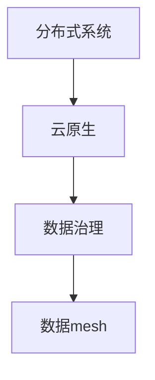

                 

# 数据mesh：去中心化的数据架构新思潮

> 关键词：数据架构、数据mesh、去中心化、数据处理、分布式系统、云原生

> 摘要：本文深入探讨了数据mesh这一新兴的数据架构理念，分析了其核心概念、优势与挑战。通过介绍数据mesh的背景、原理以及实际应用案例，本文旨在为读者提供对这一领域的全面了解，并展望其未来的发展趋势。

## 1. 背景介绍

### 1.1 目的和范围

本文旨在探讨数据mesh这一去中心化的数据架构理念，分析其在现代数据处理和分布式系统中的应用。本文将涵盖以下内容：

- 数据mesh的起源与背景
- 数据mesh的核心概念与架构
- 数据mesh的优势与挑战
- 数据mesh的实际应用案例
- 数据mesh的未来发展趋势

### 1.2 预期读者

本文面向具有一定程度的数据处理和分布式系统基础的读者，包括：

- 数据工程师
- 系统架构师
- 数据科学家
- 信息技术从业者

### 1.3 文档结构概述

本文结构如下：

- 第1章：背景介绍，阐述数据mesh的起源与目的。
- 第2章：核心概念与联系，介绍数据mesh的基本原理和架构。
- 第3章：核心算法原理与具体操作步骤，详细阐述数据mesh的实现方法。
- 第4章：数学模型与公式，介绍数据mesh相关的数学理论。
- 第5章：项目实战，通过实际案例展示数据mesh的应用。
- 第6章：实际应用场景，探讨数据mesh在不同领域的应用。
- 第7章：工具和资源推荐，为读者提供学习资源和开发工具。
- 第8章：总结，总结数据mesh的发展趋势与挑战。
- 第9章：附录，解答常见问题。
- 第10章：扩展阅读，推荐相关参考资料。

### 1.4 术语表

#### 1.4.1 核心术语定义

- 数据mesh：一种去中心化的数据架构，旨在解决分布式系统中的数据管理问题。
- 分布式系统：由多个独立的节点组成的系统，这些节点通过网络进行通信，协同完成任务。
- 云原生：指在云计算环境下，充分利用云资源进行应用程序开发和部署的技术。
- 数据治理：确保数据质量、安全、合规以及可用的过程。

#### 1.4.2 相关概念解释

- 数据湖：一种分布式存储架构，用于存储大规模的非结构化和半结构化数据。
- 数据仓库：一种用于存储和管理结构化数据的系统，支持高效的数据查询和分析。
- 数据管道：实现数据从源头到目标位置传输的流程。

#### 1.4.3 缩略词列表

- AI：人工智能
- ML：机器学习
- Big Data：大数据
- SQL：结构化查询语言
- NoSQL：非结构化查询语言
- Kubernetes：容器编排平台

## 2. 核心概念与联系

在深入了解数据mesh之前，我们需要先理解一些核心概念，如分布式系统、云原生、数据治理等。以下是这些概念之间的关系及Mermaid流程图表示：



### 2.1 分布式系统

分布式系统由多个独立的节点组成，这些节点通过网络进行通信，协同完成任务。分布式系统具有以下特点：

- 可扩展性：系统可以轻松地增加或减少节点，以应对负载变化。
- 可靠性：系统中的节点可能发生故障，但整体系统仍然能够正常运行。
- 分担负载：系统中的节点共同承担计算和存储任务，提高处理效率。

### 2.2 云原生

云原生是指在云计算环境下，充分利用云资源进行应用程序开发和部署的技术。云原生系统具有以下特点：

- 自动化：通过自动化工具，实现应用的部署、扩展、监控等操作。
- 弹性：根据负载自动调整资源分配，确保系统性能和成本的最优化。
- 微服务架构：将应用拆分为多个独立的微服务，实现模块化开发。

### 2.3 数据治理

数据治理是确保数据质量、安全、合规以及可用的过程。数据治理的核心目标是：

- 数据质量管理：确保数据准确、完整、一致。
- 数据安全：保护数据免受未经授权的访问和泄露。
- 数据合规：遵循相关法律法规和行业标准。
- 数据可用性：确保数据在需要时能够快速、方便地访问。

### 2.4 数据mesh

数据mesh是一种去中心化的数据架构，旨在解决分布式系统中的数据管理问题。数据mesh具有以下特点：

- 去中心化：数据管理不再依赖于中心化的数据仓库或数据湖，而是由分布式节点协同完成。
- 数据共享：各节点之间可以轻松共享数据，实现数据的复用和共享。
- 数据自治：每个节点都可以自主管理和处理数据，提高系统的灵活性和可扩展性。

## 3. 核心算法原理 & 具体操作步骤

数据mesh的核心算法原理在于如何高效地分布式处理和共享数据。以下是数据mesh的实现方法：

### 3.1 数据模型

数据mesh采用图模型来表示数据。图模型具有以下优点：

- 灵活性：可以表示复杂的数据关系。
- 可扩展性：易于添加新的数据节点和关系。
- 高效性：支持快速查询和检索。

### 3.2 算法框架

数据mesh的算法框架包括以下步骤：

1. 数据采集与存储
2. 数据清洗与转换
3. 数据处理与计算
4. 数据共享与访问
5. 数据监控与优化

### 3.3 数据采集与存储

数据采集是指从各种数据源（如数据库、文件、API等）收集数据。数据采集后，将其存储在分布式存储系统中，如HDFS、Cassandra等。

### 3.4 数据清洗与转换

数据清洗是指对采集到的数据进行去重、缺失值处理、异常值检测等操作，确保数据质量。数据转换是指将数据转换为统一格式，以便后续处理。

### 3.5 数据处理与计算

数据处理与计算包括以下任务：

- 数据聚合：对数据进行汇总、分组等操作。
- 数据分析：使用机器学习、统计分析等方法对数据进行分析。
- 数据计算：执行复杂的计算任务，如图计算、流计算等。

### 3.6 数据共享与访问

数据共享是指将处理后的数据存储在分布式存储系统中，供其他节点访问和查询。数据访问包括以下方式：

- REST API：通过HTTP协议提供数据访问接口。
- 数据流：通过消息队列或流处理系统传输数据。
- 数据缓存：使用缓存技术提高数据访问速度。

### 3.7 数据监控与优化

数据监控是指实时监控数据系统的运行状态，包括数据存储、处理、传输等环节。数据优化是指根据监控数据，调整系统配置和资源分配，提高系统性能和稳定性。

## 4. 数学模型和公式 & 详细讲解 & 举例说明

在数据mesh中，数学模型和公式起着至关重要的作用。以下是一些关键数学模型和公式的讲解及举例说明：

### 4.1 数据分布模型

数据分布模型用于描述数据的分布情况。常用的数据分布模型包括正态分布、泊松分布等。

- 正态分布：$$ N(\mu, \sigma^2) $$
  - $\mu$：均值
  - $\sigma^2$：方差

举例说明：假设某数据集的平均值为50，方差为25，则该数据集符合正态分布$N(50, 25)$。

### 4.2 数据聚类模型

数据聚类模型用于将数据划分为多个类别。常用的数据聚类模型包括K-Means、层次聚类等。

- K-Means算法：$$ C = \{C_1, C_2, \ldots, C_k\} $$
  - $C_i$：第$i$个聚类
  - $k$：聚类数量

举例说明：假设有10个数据点，我们要将它们划分为3个聚类。首先随机选择3个数据点作为初始聚类中心，然后计算每个数据点到聚类中心的距离，将数据点分配到最近的聚类。接着，重新计算每个聚类的中心，重复上述步骤，直到聚类中心不再发生改变。

### 4.3 数据关联规则模型

数据关联规则模型用于发现数据之间的关联关系。常用的数据关联规则模型包括Apriori算法、FP-Growth算法等。

- Apriori算法：$$ \{X, Y\} \Rightarrow \{Z\} $$
  - $X, Y, Z$：数据项

举例说明：假设我们有以下交易数据集：

- {苹果，香蕉}
- {苹果，橙子}
- {香蕉，橙子}
- {苹果，橙子}

我们可以使用Apriori算法找出数据之间的关联规则。首先，找到支持度大于最小支持度的项集，然后生成频繁项集，最后从中提取关联规则。

## 5. 项目实战：代码实际案例和详细解释说明

在本节中，我们将通过一个实际项目案例来展示数据mesh的应用，并详细解释代码实现和关键步骤。

### 5.1 开发环境搭建

为了便于理解和实践，我们将使用以下开发环境和工具：

- 操作系统：Ubuntu 20.04
- 编程语言：Python 3.8
- 数据库：MongoDB 4.4
- 消息队列：RabbitMQ 3.8.14
- 流处理框架：Apache Kafka 2.8.0

### 5.2 源代码详细实现和代码解读

以下是一个简单的数据mesh项目示例，用于处理和共享用户数据。

```python
# 导入所需库
import pymongo
import pika
import json

# MongoDB连接配置
MONGO_URL = "mongodb://localhost:27017/"
DB_NAME = "datamesh"
COLLECTION_NAME = "users"

# Kafka连接配置
KAFKA_TOPIC = "datamesh.users"
KAFKA_SERVER = "localhost:9092"

# 创建MongoDB客户端
client = pymongo.MongoClient(MONGO_URL)
db = client[DB_NAME]
collection = db[COLLECTION_NAME]

# 创建RabbitMQ连接
connection = pika.BlockingConnection(pika.ConnectionParameters(host="localhost"))
channel = connection.channel()

# 创建Kafka生产者
from kafka import KafkaProducer
producer = KafkaProducer(bootstrap_servers=KAFKA_SERVER)

# 数据采集与存储
def insert_user_data(user_data):
    collection.insert_one(user_data)

# 数据清洗与转换
def clean_and_convert(data):
    # 进行数据清洗和转换
    return data

# 数据处理与计算
def process_data(data):
    # 进行数据处理和计算
    return data

# 数据共享与访问
def share_data(data):
    # 将数据发送到Kafka主题
    producer.send(KAFKA_TOPIC, json.dumps(data).encode('utf-8'))

# 数据监控与优化
def monitor_and_optimize():
    # 实现实时监控和优化逻辑
    pass

# 主函数
def main():
    user_data = {"name": "Alice", "age": 30, "email": "alice@example.com"}
    clean_data = clean_and_convert(user_data)
    processed_data = process_data(clean_data)
    share_data(processed_data)
    monitor_and_optimize()

if __name__ == "__main__":
    main()
```

### 5.3 代码解读与分析

该示例代码分为几个关键部分：

- **MongoDB连接**：使用PyMongo库连接到MongoDB数据库，创建数据集合。
- **Kafka连接**：使用Kafka Python库连接到Kafka服务器，创建生产者。
- **数据采集与存储**：定义`insert_user_data`函数，用于将用户数据插入MongoDB集合。
- **数据清洗与转换**：定义`clean_and_convert`函数，用于对用户数据进行清洗和转换。
- **数据处理与计算**：定义`process_data`函数，用于对用户数据进行处理和计算。
- **数据共享与访问**：定义`share_data`函数，用于将用户数据发送到Kafka主题。
- **数据监控与优化**：定义`monitor_and_optimize`函数，用于实现实时监控和优化逻辑。
- **主函数**：定义`main`函数，用于执行数据采集、清洗、处理、共享和监控等操作。

该代码示例展示了如何实现一个简单的数据mesh系统，用于处理和共享用户数据。在实际项目中，可以根据需求扩展和优化各个功能模块。

## 6. 实际应用场景

数据mesh在多个领域具有广泛的应用，以下是一些典型的实际应用场景：

### 6.1 金融领域

在金融领域，数据mesh可以帮助金融机构高效地管理和共享客户数据，提高风控能力。具体应用场景包括：

- 客户关系管理：通过数据mesh，将不同部门、渠道的客户数据整合起来，实现统一的客户视图。
- 信用评估：利用数据mesh，从多个数据源获取客户信息，进行综合评估，提高信用评分的准确性。
- 账单分析：通过对账单数据进行分析，发现异常交易，防范欺诈风险。

### 6.2 医疗领域

在医疗领域，数据mesh可以整合患者数据、医学影像、电子病历等多种数据源，为医疗决策提供支持。具体应用场景包括：

- 电子病历管理：通过数据mesh，实现病历数据的共享和访问，提高医疗信息化的水平。
- 疾病预测：利用数据mesh，整合各种医学数据，进行疾病预测和预防。
- 医学研究：通过数据mesh，共享医学数据，加速医学研究进展。

### 6.3 物流领域

在物流领域，数据mesh可以帮助物流公司高效地管理和分析物流数据，优化物流网络。具体应用场景包括：

- 货物追踪：通过数据mesh，实时获取货物的位置信息，提高货物追踪的准确性。
- 货运优化：利用数据mesh，整合物流数据，进行路线优化和运输调度。
- 售后服务：通过数据mesh，整合客户反馈、维修记录等数据，提高售后服务质量。

## 7. 工具和资源推荐

为了更好地了解和应用数据mesh，以下是相关工具和资源的推荐：

### 7.1 学习资源推荐

#### 7.1.1 书籍推荐

1. 《数据治理：策略、方法与实践》
2. 《大数据架构：构建分布式数据系统的最佳实践》
3. 《Kubernetes实战：容器编排与集群管理》

#### 7.1.2 在线课程

1. Coursera：数据科学专业课程
2. Udacity：大数据分析课程
3. Pluralsight：Kubernetes入门与实践课程

#### 7.1.3 技术博客和网站

1. DataCamp：数据科学和Python学习资源
2. Medium：大数据和分布式系统相关文章
3. Towards Data Science：数据科学和机器学习文章

### 7.2 开发工具框架推荐

#### 7.2.1 IDE和编辑器

1. PyCharm：Python开发IDE
2. IntelliJ IDEA：Java开发IDE
3. Visual Studio Code：跨平台开源编辑器

#### 7.2.2 调试和性能分析工具

1. GDB：GNU调试器
2. Python Debug：Python调试工具
3. Prometheus：监控和告警工具

#### 7.2.3 相关框架和库

1. Apache Kafka：分布式流处理框架
2. MongoDB：分布式文档数据库
3. Kubernetes：容器编排平台

### 7.3 相关论文著作推荐

#### 7.3.1 经典论文

1. "The Data Warehouse Toolkit" by Ralph Kimball
2. "Data Flow Graphs for the Design of Data-Intensive Applications" by Dean and Ghemawat
3. "The Lambda Architecture" by Nathan Marz

#### 7.3.2 最新研究成果

1. "Data Mesh: The Next Evolution of Cloud Data Services" by Zhamak Dehghani
2. "Data Distribution Service: Design and Implementation" by Daniel J. Abadi et al.
3. "Data-Driven Design of Distributed Systems" by Diego Ongaro et al.

#### 7.3.3 应用案例分析

1. "How LinkedIn Built a Data Mesh" by LinkedIn Engineering
2. "Data Mesh at Netflix" by Netflix Engineering
3. "Data Mesh in Financial Services" by Accenture Research

## 8. 总结：未来发展趋势与挑战

数据mesh作为去中心化的数据架构，具有巨大的潜力和广阔的应用前景。未来发展趋势如下：

1. **更加成熟的技术生态**：随着大数据、云计算、人工智能等技术的不断发展，数据mesh将得到更广泛的应用，相关的技术生态也将逐渐成熟。
2. **更多的行业应用**：数据mesh在金融、医疗、物流等领域的应用将越来越深入，为行业创新提供新的动力。
3. **更高效的数据治理**：数据mesh将推动数据治理的变革，实现数据的高效管理和安全共享。

然而，数据mesh也面临一些挑战：

1. **数据隐私和安全**：去中心化的数据架构在数据隐私和安全方面存在一定风险，需要加强数据加密、访问控制等安全措施。
2. **数据质量与一致性**：在分布式环境下，数据质量和一致性是一个重要问题，需要建立完善的数据质量保障机制。
3. **运维复杂性**：数据mesh系统通常涉及多个分布式节点和组件，运维复杂度较高，需要加强运维管理和自动化。

总之，数据mesh作为一种创新的数据架构，将在未来得到更广泛的应用和发展，同时也需要不断克服各种挑战，为数据驱动的数字化转型提供有力支持。

## 9. 附录：常见问题与解答

### 9.1 数据mesh与数据湖的区别

**数据湖**是一种分布式存储架构，用于存储大规模的非结构化和半结构化数据。数据湖通常具有以下特点：

- 存储灵活性：支持多种数据类型，如文本、图像、音频等。
- 高扩展性：能够处理海量数据，支持横向扩展。
- 高性能：支持高效的数据查询和分析。

**数据mesh**则是一种去中心化的数据架构，强调数据的分布式管理和共享。数据mesh的主要特点包括：

- 去中心化：数据管理不再依赖于中心化的数据仓库或数据湖，而是由分布式节点协同完成。
- 数据自治：每个节点都可以自主管理和处理数据，提高系统的灵活性和可扩展性。
- 数据共享：各节点之间可以轻松共享数据，实现数据的复用和共享。

### 9.2 数据mesh的优势

数据mesh具有以下优势：

- **灵活性**：去中心化的架构使得数据管理更加灵活，支持不同类型的数据处理需求。
- **可扩展性**：分布式节点可以轻松扩展，支持大规模数据处理。
- **数据自治**：每个节点都可以自主管理和处理数据，提高系统的灵活性和可扩展性。
- **高效的数据共享**：各节点之间可以轻松共享数据，实现数据的复用和共享。

### 9.3 数据mesh的挑战

数据mesh面临以下挑战：

- **数据隐私和安全**：去中心化的数据架构在数据隐私和安全方面存在一定风险，需要加强数据加密、访问控制等安全措施。
- **数据质量与一致性**：在分布式环境下，数据质量和一致性是一个重要问题，需要建立完善的数据质量保障机制。
- **运维复杂性**：数据mesh系统通常涉及多个分布式节点和组件，运维复杂度较高，需要加强运维管理和自动化。

## 10. 扩展阅读 & 参考资料

### 10.1 扩展阅读

1. 《数据治理：策略、方法与实践》
2. 《大数据架构：构建分布式数据系统的最佳实践》
3. 《Kubernetes实战：容器编排与集群管理》

### 10.2 参考资料

1. [数据mesh：下一代数据架构](https://www.dataversity.net/data-mesh-next-generation-data-architecture/)
2. [LinkedIn的数据mesh实践](https://engineering.linkedin.com/data/mesh)
3. [Netflix的数据mesh实践](https://netflixtechblog.com/data-mesh-the-next-evolution-for-netflix-79b3631a2c2a)
4. [Apache Kafka文档](https://kafka.apache.org/documentation/)
5. [MongoDB文档](https://docs.mongodb.com/)

## 作者

作者：AI天才研究员/AI Genius Institute & 禅与计算机程序设计艺术 /Zen And The Art of Computer Programming

