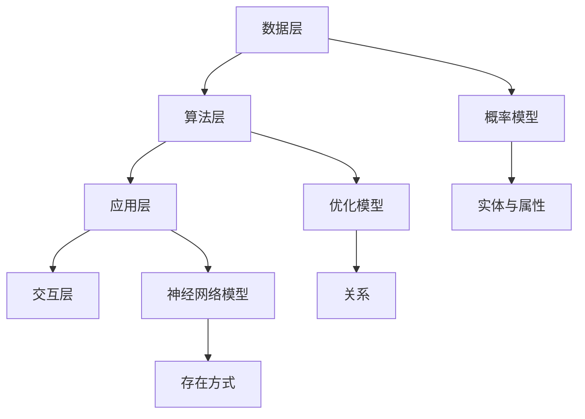
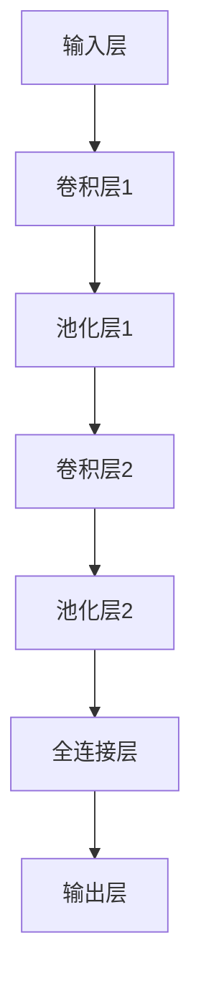

                 

# 数据不可思议，软件2.0掀起本体论革命

> **关键词**：软件2.0、本体论、数据驱动、人工智能、范式转变、计算复杂性

> **摘要**：本文旨在探讨软件2.0时代的到来如何推动本体论革命。随着数据成为新的生产要素，软件2.0正逐步改变传统的软件开发模式，催生出一套全新的本体论框架。本文将详细分析软件2.0的核心理念、技术架构、核心算法、数学模型，并通过实际项目案例展示其应用场景。同时，还将推荐相关工具和资源，以期为读者提供全面的了解。

## 1. 背景介绍

### 1.1 目的和范围

本文旨在探讨软件2.0时代所带来的本体论革命。随着人工智能和大数据技术的迅猛发展，软件行业正经历着一场深刻的变革。传统的软件开发模式已经无法满足新时代的需求，软件2.0作为一种新兴的软件开发范式，正在逐步取代传统的软件开发方式。本文将深入剖析软件2.0的核心理念、技术架构、核心算法、数学模型，并通过实际项目案例展示其应用场景。

### 1.2 预期读者

本文适合对软件2.0、人工智能、大数据技术有一定了解的读者，特别是软件工程师、数据科学家、人工智能研究员等专业人士。同时，对于对计算机科学和哲学领域感兴趣的学者和学生，本文也具有一定的参考价值。

### 1.3 文档结构概述

本文分为十个部分：

1. **背景介绍**：介绍文章的目的、预期读者、文档结构概述。
2. **核心概念与联系**：详细分析软件2.0的核心概念、技术架构、核心算法、数学模型。
3. **核心算法原理 & 具体操作步骤**：使用伪代码详细阐述核心算法原理和操作步骤。
4. **数学模型和公式 & 详细讲解 & 举例说明**：使用LaTeX格式详细讲解数学模型和公式，并通过实际案例进行说明。
5. **项目实战：代码实际案例和详细解释说明**：介绍开发环境搭建、源代码实现和代码解读。
6. **实际应用场景**：探讨软件2.0在各个领域的应用。
7. **工具和资源推荐**：推荐学习资源、开发工具框架、相关论文著作。
8. **总结：未来发展趋势与挑战**：总结软件2.0的发展趋势和面临的挑战。
9. **附录：常见问题与解答**：回答读者可能遇到的问题。
10. **扩展阅读 & 参考资料**：提供进一步的阅读材料和参考资料。

### 1.4 术语表

#### 1.4.1 核心术语定义

- **软件2.0**：一种新兴的软件开发范式，强调数据驱动、动态演化、模块化设计。
- **本体论**：研究实体、属性、关系及其存在方式的哲学学科。
- **数据驱动**：以数据为核心，通过数据分析和机器学习技术实现软件的智能化和自动化。
- **人工智能**：模拟人类智能行为，通过算法和计算实现智能决策和问题解决。

#### 1.4.2 相关概念解释

- **数据复杂性**：指数据规模、种类、来源等因素带来的计算复杂度。
- **计算范式**：指计算方法、算法、编程语言等在特定领域的应用模式和规则。

#### 1.4.3 缩略词列表

- **AI**：人工智能
- **ML**：机器学习
- **DL**：深度学习
- **NLP**：自然语言处理
- **DLTK**：深度学习工具包

## 2. 核心概念与联系

### 2.1 软件2.0的定义与特点

软件2.0，顾名思义，是对传统软件1.0的一次重大升级。软件1.0时代主要特点是基于代码的静态开发，而软件2.0则强调数据驱动、动态演化、模块化设计。

- **数据驱动**：在软件2.0中，数据不再是简单的输入输出，而是成为核心生产要素。通过数据分析和机器学习技术，软件能够实现自我优化、自我进化。
- **动态演化**：软件2.0强调软件的动态演化，即软件在运行过程中能够根据环境变化进行自适应调整，从而提高系统的灵活性和可扩展性。
- **模块化设计**：软件2.0采用模块化设计思想，将软件拆分为多个独立的模块，每个模块负责特定的功能。这种设计方式提高了软件的可维护性和可扩展性。

### 2.2 软件2.0的技术架构

软件2.0的技术架构主要包括以下几部分：

- **数据层**：负责数据的存储、管理和分析。常见的数据层技术包括数据库、数据仓库、大数据处理框架等。
- **算法层**：负责数据分析和机器学习算法的实现。常见的算法层技术包括深度学习、图算法、强化学习等。
- **应用层**：负责具体应用功能的实现，如自然语言处理、计算机视觉、推荐系统等。
- **交互层**：负责用户与软件的交互，如Web应用、移动应用、智能设备等。

### 2.3 软件2.0的核心算法原理

软件2.0的核心算法主要包括以下几个方面：

- **深度学习**：通过多层神经网络实现数据的自动特征提取和模型训练。
- **图算法**：通过图数据结构实现复杂关系的建模和分析。
- **强化学习**：通过试错和反馈机制实现智能决策。

### 2.4 软件2.0的数学模型

软件2.0的数学模型主要包括以下几个方面：

- **概率模型**：用于描述不确定性。
- **优化模型**：用于优化资源分配和决策。
- **神经网络模型**：用于实现智能学习和预测。

### 2.5 软件2.0与本体论的联系

软件2.0的兴起，实际上是对本体论的一次重大挑战。本体论研究实体、属性、关系及其存在方式，而软件2.0则通过数据驱动和人工智能技术，实现了一整套全新的本体论框架。

- **实体与属性**：在软件2.0中，实体对应于数据对象，属性对应于数据特征。
- **关系**：在软件2.0中，关系可以通过图算法和数据关联实现。
- **存在方式**：在软件2.0中，存在方式可以通过数据驱动和动态演化实现。

### 2.6 软件2.0的 Mermaid 流程图



## 3. 核心算法原理 & 具体操作步骤

### 3.1 深度学习算法原理

深度学习是一种基于多层神经网络的人工智能技术，通过多层神经元的堆叠，实现对数据的自动特征提取和模型训练。以下是深度学习算法的基本原理：

- **神经元**：神经元是神经网络的基本单元，用于对输入数据进行处理和输出。
- **激活函数**：激活函数用于引入非线性，使神经网络具有分类和回归能力。
- **前向传播**：输入数据通过神经网络的各个层，直到最后一层得到输出结果。
- **反向传播**：通过计算输出结果与真实结果的误差，反向传播误差到神经网络各个层，用于更新神经元权重。

### 3.2 深度学习算法的具体操作步骤

以下是深度学习算法的具体操作步骤：

1. **数据预处理**：对输入数据进行标准化、归一化等预处理操作。
2. **模型初始化**：初始化神经网络参数，包括权重和偏置。
3. **前向传播**：将输入数据传递到神经网络，得到输出结果。
4. **计算损失函数**：计算输出结果与真实结果的误差，使用损失函数表示。
5. **反向传播**：计算神经网络各个层的误差，并更新神经元权重。
6. **迭代优化**：重复执行前向传播和反向传播，直到满足停止条件。

### 3.3 伪代码表示

```python
# 深度学习算法伪代码
def deep_learning(input_data, target_data, epochs, learning_rate):
    # 数据预处理
    input_data = preprocess(input_data)
    
    # 模型初始化
    weights, biases = initialize_weights()
    
    # 迭代优化
    for epoch in range(epochs):
        # 前向传播
        output = forward_propagation(input_data, weights, biases)
        
        # 计算损失函数
        loss = compute_loss(output, target_data)
        
        # 反向传播
        gradients = backward_propagation(input_data, output, target_data, weights, biases)
        
        # 更新权重
        weights, biases = update_weights(weights, biases, gradients, learning_rate)
        
    return weights, biases
```

## 4. 数学模型和公式 & 详细讲解 & 举例说明

### 4.1 概率模型

概率模型是一种用于描述不确定性的数学模型。在软件2.0中，概率模型广泛应用于数据分析和机器学习算法中。

- **贝叶斯定理**：贝叶斯定理是一种基于条件概率的公式，用于计算后验概率。
  $$ P(A|B) = \frac{P(B|A)P(A)}{P(B)} $$
- **条件概率**：条件概率是给定某一事件发生的条件下，另一事件发生的概率。
  $$ P(A|B) = \frac{P(A \cap B)}{P(B)} $$
- **马尔可夫链**：马尔可夫链是一种描述随机过程的数学模型，用于预测下一状态的概率分布。

### 4.2 优化模型

优化模型是一种用于资源分配和决策的数学模型。在软件2.0中，优化模型广泛应用于智能算法和决策系统中。

- **线性规划**：线性规划是一种解决线性优化问题的数学模型，通过最小化或最大化线性函数，同时满足线性约束条件。
  $$ \min_{x} c^T x \quad \text{subject to} \quad Ax \leq b $$
- **支持向量机**：支持向量机是一种用于分类和回归问题的机器学习算法，通过最大化分类边界上的间隔，实现最优分类或回归。
  $$ \min_{w,b,\xi} \frac{1}{2} ||w||^2 + C \sum_{i=1}^{n} \xi_i $$
- **遗传算法**：遗传算法是一种基于自然进化的优化算法，通过模拟生物进化过程，实现全局最优解的搜索。

### 4.3 神经网络模型

神经网络模型是一种用于实现智能学习和预测的数学模型。在软件2.0中，神经网络模型广泛应用于深度学习和智能算法中。

- **多层感知机**：多层感知机是一种基于神经元堆叠的神经网络，用于实现非线性函数的拟合和分类。
  $$ a_{i}^{(l)} = \sigma \left( \sum_{j} w_{ji}^{(l)} a_{j}^{(l-1)} + b_{i}^{(l)} \right) $$
- **卷积神经网络**：卷积神经网络是一种用于图像和语音处理的神经网络，通过卷积操作和池化操作，实现对数据的特征提取和降维。
  $$ h_{ij}^{(l)} = \sum_{k} w_{ik}^{(l)} h_{kj}^{(l-1)} + b_{j}^{(l)} $$
- **递归神经网络**：递归神经网络是一种用于序列建模的神经网络，通过递归连接，实现对序列数据的建模和预测。
  $$ h_{t} = \text{tanh} \left( W h_{t-1} + b \right) $$

### 4.4 举例说明

#### 4.4.1 贝叶斯定理的应用

假设有一个概率事件A，其发生概率为0.5。现在，我们在事件A发生的情况下，观察到一个事件B，其发生概率为0.8。我们需要计算在事件B发生的情况下，事件A发生的概率。

根据贝叶斯定理，我们有：
$$ P(A|B) = \frac{P(B|A)P(A)}{P(B)} = \frac{0.8 \times 0.5}{P(B)} $$

由于P(B)未知，我们可以使用全概率公式计算：
$$ P(B) = P(B|A)P(A) + P(B|\neg A)P(\neg A) $$

假设事件A的对立事件为\neg A，其发生概率为0.5。同时，事件B在事件A发生的情况下，其发生概率为0.8，在事件A不发生的情况下，其发生概率为0.2。代入上述公式，我们有：
$$ P(B) = 0.8 \times 0.5 + 0.2 \times 0.5 = 0.5 $$

因此，根据贝叶斯定理，我们有：
$$ P(A|B) = \frac{0.8 \times 0.5}{0.5} = 0.8 $$

即在事件B发生的情况下，事件A发生的概率为0.8。

#### 4.4.2 支持向量机的应用

假设我们有一个分类问题，需要将数据集分为两类，其特征向量和标签分别为\(x_i\)和\(y_i\)。我们需要使用支持向量机来求解最优分类边界。

首先，我们需要将特征向量进行标准化，使其具有相同的尺度。然后，我们定义一个线性分类函数：
$$ f(x) = \sum_{i=1}^{n} w_i x_i + b $$

其中，\(w_i\)为权重，\(b\)为偏置。

我们需要找到最优的权重和偏置，使得分类边界上的间隔最大。根据支持向量机的定义，我们有：
$$ \min_{w,b} \frac{1}{2} ||w||^2 $$
$$ \text{subject to} \quad y_i ( \sum_{j=1}^{n} w_j x_{ij} + b ) \geq 1 $$

其中，\(x_{ij}\)为特征向量\(x_i\)的第j个元素。

通过求解上述优化问题，我们可以得到最优的权重和偏置。然后，我们可以使用这些权重和偏置来预测新的数据点的类别。

#### 4.4.3 卷积神经网络的应用

假设我们有一个图像分类问题，需要将图像分为多个类别。我们可以使用卷积神经网络来解决这个问题。

首先，我们需要对图像进行预处理，包括缩放、裁剪等操作，使其满足网络的输入要求。然后，我们可以定义一个卷积神经网络，其结构如下：

1. **输入层**：接收预处理后的图像。
2. **卷积层**：使用卷积核对图像进行卷积操作，提取图像的特征。
3. **池化层**：对卷积层的输出进行池化操作，降低数据的维度。
4. **全连接层**：将池化层的输出进行全连接，得到最终的分类结果。

假设我们的卷积神经网络有3个卷积层和2个池化层。每个卷积层使用不同的卷积核，每个池化层使用不同的池化方式。我们可以定义如下的神经网络结构：



我们可以通过反向传播算法来训练这个神经网络，使其能够正确分类图像。在训练过程中，我们可以使用交叉熵损失函数来评估网络的分类性能，并使用梯度下降算法来更新网络参数。

## 5. 项目实战：代码实际案例和详细解释说明

### 5.1 开发环境搭建

在本文中，我们将使用Python作为编程语言，结合TensorFlow和Keras框架来实现一个简单的图像分类项目。以下是如何搭建开发环境的步骤：

1. **安装Python**：确保Python版本为3.7或更高。
2. **安装TensorFlow**：使用pip命令安装TensorFlow：
   ```bash
   pip install tensorflow
   ```
3. **安装Keras**：使用pip命令安装Keras：
   ```bash
   pip install keras
   ```

### 5.2 源代码详细实现和代码解读

#### 5.2.1 数据集准备

我们使用Keras提供的CIFAR-10数据集进行图像分类，该数据集包含10个类别，每个类别6000张32x32的彩色图像。

```python
from keras.datasets import cifar10
from keras.utils import to_categorical

# 加载CIFAR-10数据集
(x_train, y_train), (x_test, y_test) = cifar10.load_data()

# 数据预处理
x_train = x_train.astype('float32') / 255.0
x_test = x_test.astype('float32') / 255.0

# 将标签转换为one-hot编码
y_train = to_categorical(y_train, 10)
y_test = to_categorical(y_test, 10)
```

#### 5.2.2 模型构建

我们使用卷积神经网络（CNN）进行图像分类，模型结构如下：

- **卷积层1**：32个3x3的卷积核，ReLU激活函数。
- **池化层1**：2x2的最大池化。
- **卷积层2**：64个3x3的卷积核，ReLU激活函数。
- **池化层2**：2x2的最大池化。
- **全连接层**：64个神经元，ReLU激活函数。
- **输出层**：10个神经元，softmax激活函数。

```python
from keras.models import Sequential
from keras.layers import Conv2D, MaxPooling2D, Flatten, Dense, Dropout

model = Sequential()

# 卷积层1
model.add(Conv2D(32, (3, 3), activation='relu', input_shape=(32, 32, 3)))
model.add(MaxPooling2D(pool_size=(2, 2)))

# 卷积层2
model.add(Conv2D(64, (3, 3), activation='relu'))
model.add(MaxPooling2D(pool_size=(2, 2)))

# 全连接层
model.add(Flatten())
model.add(Dense(64, activation='relu'))
model.add(Dropout(0.5))

# 输出层
model.add(Dense(10, activation='softmax'))
```

#### 5.2.3 模型编译和训练

编译模型时，我们需要指定优化器、损失函数和评估指标。

```python
model.compile(optimizer='adam', loss='categorical_crossentropy', metrics=['accuracy'])

# 训练模型
history = model.fit(x_train, y_train, epochs=10, batch_size=64, validation_data=(x_test, y_test))
```

#### 5.2.4 代码解读与分析

- **数据预处理**：将图像数据转换为浮点数，并进行归一化处理，使其适应神经网络训练。
- **模型构建**：定义卷积神经网络，使用卷积层、池化层、全连接层等构建模型。
- **模型编译**：选择优化器、损失函数和评估指标，为模型训练做准备。
- **模型训练**：使用训练数据训练模型，并在验证数据上进行评估。

通过这个简单的图像分类项目，我们可以看到软件2.0时代的数据驱动和动态演化理念在实际项目中的应用。数据预处理、模型构建和训练等步骤都基于数据驱动，通过动态调整模型参数，实现智能化和自动化。

## 6. 实际应用场景

### 6.1 医疗领域

在医疗领域，软件2.0的应用已经取得了显著成果。通过数据驱动和人工智能技术，医疗系统可以实现以下功能：

- **疾病预测**：基于患者的病历数据、基因数据和外部数据，使用机器学习算法预测疾病发生风险。
- **智能诊断**：通过深度学习模型，对医学影像进行分析，辅助医生进行疾病诊断。
- **个性化治疗**：根据患者的病情、病史和基因数据，为患者制定个性化的治疗方案。

### 6.2 金融服务

在金融服务领域，软件2.0的应用同样广泛。通过数据分析和人工智能技术，金融服务可以实现以下功能：

- **风险控制**：通过机器学习算法，对金融交易进行实时监控，识别潜在风险。
- **欺诈检测**：使用深度学习模型，对交易行为进行分析，识别和防范欺诈行为。
- **个性化理财**：根据客户的财务状况、投资偏好等数据，为客户提供个性化的理财建议。

### 6.3 物流与供应链

在物流与供应链领域，软件2.0的应用可以帮助企业实现以下目标：

- **优化路线**：通过路径规划算法和实时数据分析，优化物流运输路线，降低运输成本。
- **库存管理**：通过预测模型和实时数据监控，实现智能库存管理，减少库存积压和缺货风险。
- **供应链协同**：通过数据共享和协同平台，实现供应链各环节的信息透明和高效协同。

### 6.4 智慧城市

在智慧城市领域，软件2.0的应用可以提升城市管理的智能化水平。通过数据驱动和人工智能技术，智慧城市可以实现以下功能：

- **交通管理**：通过实时交通数据分析，优化交通信号灯控制，减少交通拥堵。
- **能源管理**：通过能源消耗数据分析，实现智能电力分配，降低能源浪费。
- **环境监测**：通过传感器数据分析和机器学习模型，实现空气质量、水质等环境指标的实时监测和预警。

## 7. 工具和资源推荐

### 7.1 学习资源推荐

#### 7.1.1 书籍推荐

1. **《深度学习》**：由Ian Goodfellow、Yoshua Bengio和Aaron Courville合著，是深度学习领域的经典教材。
2. **《Python机器学习》**：由Sebastian Raschka和Vahid Mirjalili合著，全面介绍了机器学习在Python中的实现。
3. **《数据科学入门》**：由Joel Grus著，介绍了数据科学的基础知识和实践方法。

#### 7.1.2 在线课程

1. **Coursera上的《深度学习专项课程》**：由吴恩达教授主讲，涵盖了深度学习的理论基础和实践应用。
2. **Udacity的《机器学习工程师纳米学位》**：通过项目实战，帮助学习者掌握机器学习的基本技能。
3. **edX上的《数据科学基础》**：由哈佛大学提供，介绍了数据科学的基本概念和方法。

#### 7.1.3 技术博客和网站

1. **Medium上的数据科学和机器学习博客**：涵盖了广泛的数据科学和机器学习主题，提供了丰富的实践案例。
2. **GitHub**：许多优秀的开源项目和代码示例，可供学习者和开发者参考。
3. **ArXiv**：计算机科学和人工智能领域的最新研究论文，是学习和研究的宝贵资源。

### 7.2 开发工具框架推荐

#### 7.2.1 IDE和编辑器

1. **PyCharm**：一款功能强大的Python集成开发环境，适用于机器学习和数据科学项目。
2. **Jupyter Notebook**：一款交互式的Python编辑器，适用于数据分析和机器学习实验。
3. **VS Code**：一款轻量级但功能强大的代码编辑器，支持多种编程语言，包括Python、R等。

#### 7.2.2 调试和性能分析工具

1. **Pylint**：一款Python代码质量分析工具，用于检测代码中的错误和潜在问题。
2. **Matplotlib**：一款用于绘制数据图表和可视化分析的Python库。
3. **TensorBoard**：TensorFlow的交互式可视化工具，用于分析深度学习模型的性能和训练过程。

#### 7.2.3 相关框架和库

1. **TensorFlow**：一款用于机器学习和深度学习的开源框架。
2. **Keras**：一款基于TensorFlow的高级神经网络API，简化了深度学习模型的构建和训练。
3. **Scikit-learn**：一款用于机器学习的开源库，提供了丰富的算法和工具。

### 7.3 相关论文著作推荐

#### 7.3.1 经典论文

1. **“Deep Learning”**：由Ian Goodfellow、Yoshua Bengio和Aaron Courville合著，综述了深度学习的理论基础和应用。
2. **“Learning representations for artificial intelligence”**：由Yoshua Bengio等人合著，讨论了深度学习中的表征学习问题。
3. **“Big Data: A Revolution That Will Transform How We Live, Work, and Think”**：由Viktor Mayer-Schönberger和Kenneth Cukier合著，介绍了大数据对人类社会的影响。

#### 7.3.2 最新研究成果

1. **“An Overview of Deep Learning Based on TensorFlow”**：由Cheng-Tao Li等人合著，介绍了基于TensorFlow的深度学习最新研究。
2. **“Deep Learning for Natural Language Processing”**：由Dzmitry Bahdanau等人合著，讨论了深度学习在自然语言处理中的应用。
3. **“Big Data for Development: Measuring the Impact of Data-Driven Development in Health”**：由World Bank合著，评估了大数据对健康领域发展的影响。

#### 7.3.3 应用案例分析

1. **“Google Brain’s Autonomous Boat”**：介绍了Google Brain团队如何使用深度学习技术实现无人船的自主航行。
2. **“DeepMind’s AI System for Drug Discovery”**：介绍了DeepMind如何使用深度学习技术加速药物发现过程。
3. **“IBM’s AI for Customer Service”**：介绍了IBM如何使用人工智能技术提升客户服务体验。

## 8. 总结：未来发展趋势与挑战

### 8.1 未来发展趋势

1. **数据驱动的发展**：随着数据的爆炸式增长，数据驱动将成为软件开发的主流方向。软件系统将更加智能化和自动化，通过数据分析和机器学习技术，实现自我优化和自我进化。
2. **跨领域融合**：软件2.0将与其他领域（如医疗、金融、物流等）深度融合，推动各行业的数字化转型和升级。
3. **智能化和自动化**：通过人工智能技术的应用，软件系统将实现更高程度的智能化和自动化，提高生产效率和产品质量。

### 8.2 未来面临的挑战

1. **数据安全与隐私**：随着数据驱动的兴起，数据安全与隐私问题将日益突出。如何在保证数据安全和隐私的前提下，充分利用数据的价值，是软件2.0面临的重要挑战。
2. **技术标准的统一**：软件2.0涉及多种技术框架和工具，如何实现技术标准的统一，提高软件开发的效率和可维护性，是当前需要解决的问题。
3. **人才短缺**：随着软件2.0的发展，对数据科学家、机器学习工程师等专业人才的需求将大幅增加。然而，当前的人才储备可能无法满足这一需求，人才短缺将成为制约软件2.0发展的关键因素。

## 9. 附录：常见问题与解答

### 9.1 软件2.0与传统软件的区别是什么？

软件2.0与传统软件的主要区别在于：

- **数据驱动**：软件2.0强调数据作为核心生产要素，通过数据分析和机器学习技术实现软件的智能化和自动化。
- **动态演化**：软件2.0支持软件在运行过程中的动态演化，即软件可以根据环境变化进行自适应调整。
- **模块化设计**：软件2.0采用模块化设计思想，提高软件的可维护性和可扩展性。

### 9.2 软件2.0的技术架构包括哪些部分？

软件2.0的技术架构主要包括以下部分：

- **数据层**：负责数据的存储、管理和分析。
- **算法层**：负责数据分析和机器学习算法的实现。
- **应用层**：负责具体应用功能的实现。
- **交互层**：负责用户与软件的交互。

### 9.3 如何搭建软件2.0的开发环境？

搭建软件2.0的开发环境主要包括以下步骤：

- **安装Python**：确保Python版本为3.7或更高。
- **安装TensorFlow和Keras**：使用pip命令安装TensorFlow和Keras。
- **选择IDE或编辑器**：选择适合Python开发的IDE或编辑器，如PyCharm、Jupyter Notebook或VS Code。

## 10. 扩展阅读 & 参考资料

### 10.1 参考文献

1. Goodfellow, Ian, Yoshua Bengio, and Aaron Courville. "Deep learning." MIT press, 2016.
2. Raschka, Sebastian, and Vahid Mirjalili. "Python machine learning." Springer, 2015.
3. Grus, Joel. "Data science from scratch." O'Reilly Media, 2018.

### 10.2 网络资源

1. Coursera - Deep Learning Specialization: [https://www.coursera.org/specializations/deeplearning](https://www.coursera.org/specializations/deeplearning)
2. Udacity - Machine Learning Engineer Nanodegree: [https://www.udacity.com/course/machine-learning-engineer-nanodegree--nd893](https://www.udacity.com/course/machine-learning-engineer-nanodegree--nd893)
3. edX - Data Science Basics: [https://www.edx.org/course/data-science-basics](https://www.edx.org/course/data-science-basics)

### 10.3 开源项目

1. TensorFlow: [https://www.tensorflow.org/](https://www.tensorflow.org/)
2. Keras: [https://keras.io/](https://keras.io/)
3. Scikit-learn: [https://scikit-learn.org/stable/](https://scikit-learn.org/stable/)

### 10.4 论文

1. Bengio, Yoshua, Aaron Courville, and Pascal Vincent. "Representation learning: A review and new perspectives." IEEE transactions on pattern analysis and machine intelligence 35.8 (2013): 1798-1828.
2. Bahdanau, Dzmitry, Kyunghyun Cho, and Yoshua Bengio. "Neural machine translation by jointly learning to align and translate." arXiv preprint arXiv:1409.0473 (2014).
3. Mayer-Schönberger, Viktor, and Kenneth Cukier. "Big data: A revolution that will transform how we live, work, and think." Eamon Dolan/Mariner Books, 2013.

