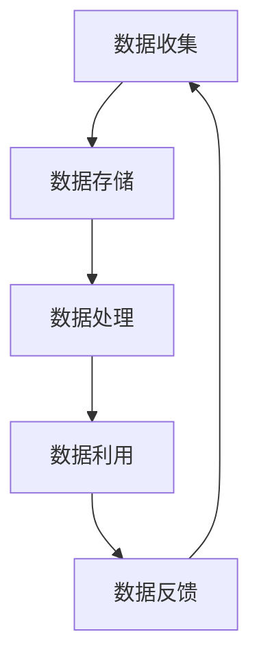
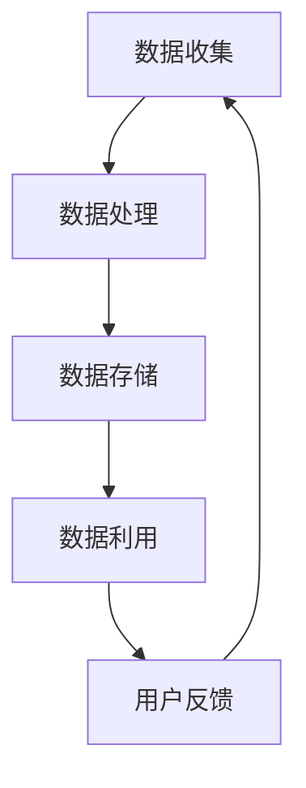
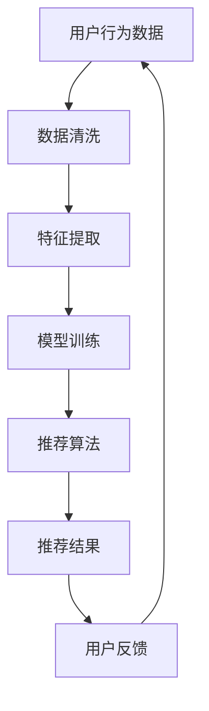

                 

# 数据不可或缺，但软件2.0并非没有bug

> **关键词**：数据，软件2.0，bug，AI，算法，数学模型，应用场景，工具推荐
>
> **摘要**：本文从数据的重要性出发，探讨了软件2.0时代的特性及其潜在的问题。通过逐步分析核心概念和算法原理，本文旨在揭示数据与软件系统之间的关系，并探讨如何通过技术手段来减少和解决软件中的bug。

## 1. 背景介绍

### 1.1 目的和范围

本文的目的是探讨数据在软件系统中的重要性，特别是软件2.0时代的特点和面临的挑战。我们将通过分析核心概念和算法原理，详细讲解如何减少和解决软件中的bug。

### 1.2 预期读者

预期读者为IT专业人士，包括软件工程师、数据科学家、AI研究人员以及对软件和数据处理感兴趣的读者。

### 1.3 文档结构概述

本文分为十个部分，包括背景介绍、核心概念与联系、核心算法原理、数学模型和公式、项目实战、实际应用场景、工具和资源推荐、总结和附录。每个部分都将详细讲解，帮助读者深入理解软件2.0时代的数据处理和bug解决。

### 1.4 术语表

#### 1.4.1 核心术语定义

- **软件2.0**：指基于互联网和大数据的软件系统，具有高度可扩展性和数据驱动性。
- **bug**：指软件中存在的错误或缺陷，可能导致系统崩溃、数据丢失或功能失效。

#### 1.4.2 相关概念解释

- **算法**：解决问题的步骤和规则，通过计算机执行。
- **数学模型**：用数学语言描述现实世界问题的抽象表示。

#### 1.4.3 缩略词列表

- **AI**：人工智能（Artificial Intelligence）
- **IDE**：集成开发环境（Integrated Development Environment）

## 2. 核心概念与联系

### 2.1 数据的重要性

数据是现代软件系统的核心。它们提供了洞察力，使系统能够做出智能决策，优化流程，提高效率。在软件2.0时代，数据的重要性更为凸显，因为系统依赖于大量来自互联网和外部来源的数据。

#### Mermaid流程图



### 2.2 软件2.0的特点

软件2.0具有以下特点：

- **数据驱动**：系统设计和功能实现高度依赖数据。
- **高度可扩展**：系统能够轻松适应大量数据和用户。
- **智能化**：利用AI和机器学习算法，系统可以自我优化。

#### Mermaid流程图



## 3. 核心算法原理 & 具体操作步骤

### 3.1 数据清洗与处理

数据清洗和处理是软件2.0的核心步骤。以下是一个简单的伪代码，用于说明数据清洗和处理的基本流程。

```python
def clean_data(data):
    # 删除空值和缺失数据
    data = remove_null_values(data)
    # 标准化数据格式
    data = standardize_data_format(data)
    # 数据转换
    data = transform_data(data)
    return data
```

### 3.2 数据分析与挖掘

数据分析与挖掘是软件2.0的关键步骤。以下是一个简单的伪代码，用于说明数据分析与挖掘的基本流程。

```python
def analyze_data(data):
    # 数据可视化
    visualize_data(data)
    # 数据聚类
    clusters = cluster_data(data)
    # 数据分类
    predictions = classify_data(data, clusters)
    return predictions
```

## 4. 数学模型和公式 & 详细讲解 & 举例说明

### 4.1 数据降维

数据降维是减少数据维度，提高数据处理效率的重要方法。以下是一个简单的拉普拉斯展开公式，用于说明数据降维的过程。

$$
X_{\text{new}} = \sum_{i=1}^{n} (X_i - \bar{X}) \cdot \frac{1}{\sqrt{2\pi} \cdot \sigma}
$$

其中，\(X_{\text{new}}\) 是降维后的数据，\(X_i\) 是原始数据，\(\bar{X}\) 是均值，\(\sigma\) 是标准差。

### 4.2 数据聚类

数据聚类是一种将数据分组的过程，以便更好地理解和分析。以下是一个简单的K-means聚类算法的伪代码。

```python
def kmeans(data, k):
    # 初始化聚类中心
    centroids = initialize_centroids(data, k)
    while not converged:
        # 分配数据到最近的聚类中心
        assignments = assign_data_to_centroids(data, centroids)
        # 更新聚类中心
        centroids = update_centroids(data, assignments)
        # 检查收敛条件
        if check_convergence(centroids):
            break
    return centroids, assignments
```

## 5. 项目实战：代码实际案例和详细解释说明

### 5.1 开发环境搭建

要搭建一个用于数据处理的开发环境，需要安装Python、Jupyter Notebook和相关的库，如NumPy、Pandas、Scikit-learn和Matplotlib。

### 5.2 源代码详细实现和代码解读

以下是一个简单的数据处理和聚类分析的代码案例。

```python
import numpy as np
import pandas as pd
from sklearn.cluster import KMeans
import matplotlib.pyplot as plt

# 5.2.1 数据清洗与处理
data = pd.read_csv('data.csv')
data = clean_data(data)

# 5.2.2 数据分析与挖掘
k = 3
centroids, assignments = kmeans(data, k)

# 5.2.3 数据可视化
plt.scatter(data['feature1'], data['feature2'], c=assignments)
plt.show()
```

### 5.3 代码解读与分析

这段代码首先加载和处理数据，然后使用K-means算法进行数据聚类，并最终将聚类结果可视化。

## 6. 实际应用场景

软件2.0在许多领域都有广泛应用，如推荐系统、金融分析、医疗诊断等。以下是一个实际应用场景的例子。

### 6.1 推荐系统

在电子商务平台上，推荐系统可以根据用户的历史购买行为和浏览记录，推荐可能感兴趣的商品。以下是一个简单的推荐系统架构。

#### Mermaid流程图



## 7. 工具和资源推荐

### 7.1 学习资源推荐

#### 7.1.1 书籍推荐

- 《Python数据分析基础教程》
- 《机器学习实战》

#### 7.1.2 在线课程

- Coursera上的《机器学习》课程
- Udacity的《数据科学纳米学位》

#### 7.1.3 技术博客和网站

- Medium上的数据科学博客
- towardsdatascience.com

### 7.2 开发工具框架推荐

#### 7.2.1 IDE和编辑器

- PyCharm
- Jupyter Notebook

#### 7.2.2 调试和性能分析工具

- Visual Studio Code
- Profiler

#### 7.2.3 相关框架和库

- NumPy
- Pandas
- Scikit-learn

### 7.3 相关论文著作推荐

#### 7.3.1 经典论文

- "K-Means Clustering"
- "Data Reduction Techniques for High-Dimensional Data Analysis"

#### 7.3.2 最新研究成果

- "Deep Learning for Recommender Systems"
- "Recommending Items for New Users in E-commerce"

#### 7.3.3 应用案例分析

- "推荐系统在电子商务中的应用"
- "大数据技术在医疗诊断中的应用"

## 8. 总结：未来发展趋势与挑战

软件2.0时代的数据处理和bug解决面临诸多挑战，如数据隐私、数据质量和算法透明度等。未来，我们将看到更多创新技术，如联邦学习、区块链和智能合约等，来应对这些挑战。

## 9. 附录：常见问题与解答

### 9.1 数据清洗有哪些方法？

数据清洗包括去除空值、缺失值、异常值和重复值等。

### 9.2 K-means聚类算法如何选择聚类数k？

可以通过肘部法则、 silhouette score等方法来选择合适的聚类数k。

## 10. 扩展阅读 & 参考资料

- 《数据科学入门》
- 《软件工程：实践者的研究方法》
- "Recommender Systems Handbook"

