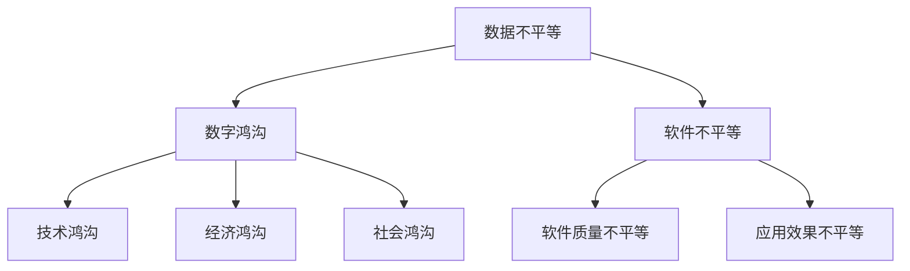

                 

# 数据不平等，软件2.0恐加剧数字鸿沟

> 关键词：数据不平等、数字鸿沟、软件2.0、算法、人工智能
> 
> 摘要：本文探讨了数据不平等现象对软件2.0时代数字鸿沟的潜在影响。通过分析数据不平等的原因、现状及其对软件开发和应用的深远影响，本文揭示了软件2.0时代技术进步可能带来的不平等加剧风险，并提出了相应的对策和未来研究方向。

## 1. 背景介绍

### 1.1 目的和范围

本文旨在探讨数据不平等现象在软件2.0时代可能引发的数字鸿沟问题。随着人工智能和大数据技术的迅猛发展，数据的重要性日益凸显。然而，数据不平等问题也逐渐显现，特别是在全球范围内，数据获取、处理和应用的不平衡现象日益严重。本文将重点关注数据不平等对软件开发、应用和数字鸿沟的影响，分析其背后的原因，并提出可能的解决对策。

### 1.2 预期读者

本文面向对数据不平等、数字鸿沟和软件2.0有基本了解的读者。无论是从事软件开发、人工智能研究，还是对政策制定和公共管理感兴趣的读者，都可以通过本文获得对数据不平等问题的深入理解，并探讨其对社会的影响。

### 1.3 文档结构概述

本文分为十个部分，首先介绍数据不平等和数字鸿沟的基本概念，随后分析数据不平等的原因和现状，探讨其对软件开发和应用的影响。接下来，本文提出解决数据不平等问题的对策和未来研究方向。最后，本文总结全文，并提供附录和扩展阅读资源。

### 1.4 术语表

#### 1.4.1 核心术语定义

- **数据不平等**：指不同个体、群体或地区在数据获取、处理和应用方面存在的不平衡现象。
- **数字鸿沟**：指由于技术、经济、社会等方面的差异，导致某些群体或地区在数字世界中的参与度和发展水平与其他群体或地区存在显著差距。
- **软件2.0**：指基于云计算、大数据、人工智能等新技术的软件开发模式，强调软件的动态性、可扩展性和协作性。

#### 1.4.2 相关概念解释

- **算法**：指解决问题的方法和步骤，通常以伪代码或编程语言实现。
- **人工智能**：指模拟、延伸和扩展人类智能的理论、方法、技术及应用系统。

#### 1.4.3 缩略词列表

- **AI**：人工智能
- **ML**：机器学习
- **DL**：深度学习
- **GPU**：图形处理器
- **CPU**：中央处理器

## 2. 核心概念与联系

在探讨数据不平等和数字鸿沟之前，我们首先需要了解相关核心概念和其相互联系。

### 2.1 数据不平等

数据不平等是指在不同个体、群体或地区之间，数据获取、处理和应用存在的不平衡现象。数据不平等可以从以下几个方面进行描述：

1. **数据获取不平等**：指某些群体或地区由于技术、经济或社会原因，无法获得高质量或足够数量的数据资源。
2. **数据处理不平等**：指不同个体或群体在数据处理能力上的差异，包括数据清洗、数据挖掘和分析等方面的能力。
3. **数据应用不平等**：指不同个体或群体在数据应用方面存在的不平衡，如人工智能应用、商业决策等。

### 2.2 数字鸿沟

数字鸿沟是指由于技术、经济、社会等因素，导致某些群体或地区在数字世界中的参与度和发展水平与其他群体或地区存在显著差距。数字鸿沟可以从以下几个方面进行描述：

1. **技术鸿沟**：指由于技术基础设施、技术水平和创新能力等方面的差异，导致某些群体或地区无法充分利用数字技术。
2. **经济鸿沟**：指由于经济条件、收入水平和消费能力等方面的差异，导致某些群体或地区无法获得足够的数字资源和培训。
3. **社会鸿沟**：指由于文化、教育、语言和社会结构等方面的差异，导致某些群体或地区在数字世界中的参与度和影响力不足。

### 2.3 软件不平等

软件不平等是指在不同软件开发者和应用场景之间，软件质量和应用效果存在的不平衡现象。软件不平等可以从以下几个方面进行描述：

1. **软件质量不平等**：指由于软件开发能力、测试和维护水平等方面的差异，导致某些软件应用效果较差。
2. **应用效果不平等**：指由于不同用户或场景对软件应用的需求和效果存在差异，导致某些软件在不同场景中的表现不平衡。

### 2.4 软件2.0与数据不平等

软件2.0时代，数据已成为软件的核心资产。数据不平等问题对软件开发和应用带来了新的挑战。一方面，数据获取和处理的不平等可能导致某些软件应用效果较差；另一方面，软件应用不平等可能进一步加剧数字鸿沟，导致某些群体或地区在数字世界中的发展水平落后。

### 2.5 Mermaid 流程图

下面是数据不平等、数字鸿沟和软件不平等之间关系的 Mermaid 流程图：



## 3. 核心算法原理 & 具体操作步骤

在探讨数据不平等问题的解决方法之前，我们需要了解相关核心算法原理和具体操作步骤。以下是一个简单的数据不平等检测和缓解算法，其核心步骤如下：

### 3.1 算法原理

1. **数据收集**：收集涉及数据不平等问题的数据集。
2. **数据预处理**：对收集到的数据进行清洗、归一化和特征提取等预处理操作。
3. **不平等检测**：通过统计方法或机器学习算法检测数据集中的不平等现象。
4. **不平等缓解**：根据检测结果，采取相应的缓解措施，如数据增强、数据均衡化或模型调整等。

### 3.2 具体操作步骤

1. **数据收集**：

    - **数据源**：从公共数据集、社交媒体、开放数据平台等渠道获取相关数据。
    - **数据类型**：包括结构化数据（如数据库）、非结构化数据（如图像、文本）和半结构化数据（如XML、JSON）等。

2. **数据预处理**：

    - **数据清洗**：去除数据中的噪音、缺失值和异常值。
    - **数据归一化**：将不同数据类型和量纲的数据进行归一化处理，使其在同一尺度范围内。
    - **特征提取**：从原始数据中提取有用的特征，以便后续分析和建模。

3. **不平等检测**：

    - **统计方法**：使用统计方法（如标准差、变异系数等）检测数据集中的不平等现象。
    - **机器学习方法**：使用机器学习算法（如决策树、支持向量机等）进行不平等检测。

4. **不平等缓解**：

    - **数据增强**：通过生成合成数据、插值方法或扩充现有数据等方式，增强数据集中较少的数据类别。
    - **数据均衡化**：通过调整数据集的类别分布，使其尽可能均衡。
    - **模型调整**：调整机器学习模型的参数或结构，以减少数据不平等对模型性能的影响。

### 3.3 伪代码

```python
# 数据不平等检测和缓解算法
def data_inequality_detection_and_relief(data):
    # 数据预处理
    data = data_preprocessing(data)
    # 不平等检测
    inequality_metrics = inequality_detection(data)
    # 不平等缓解
    relieved_data = inequality_relief(data, inequality_metrics)
    return relieved_data

# 数据预处理
def data_preprocessing(data):
    # 数据清洗
    clean_data = data_cleaning(data)
    # 数据归一化
    normalized_data = data_normalization(clean_data)
    # 特征提取
    features = feature_extraction(normalized_data)
    return features

# 不平等检测
def inequality_detection(data):
    # 统计方法
    stat_metrics = statistical_inequality_detection(data)
    # 机器学习方法
    ml_metrics = machine_learning_inequality_detection(data)
    return {**stat_metrics, **ml_metrics}

# 不平等缓解
def inequality_relief(data, inequality_metrics):
    # 数据增强
    augmented_data = data_augmentation(data, inequality_metrics)
    # 数据均衡化
    balanced_data = data_balancing(augmented_data)
    # 模型调整
    adjusted_model = model_adjustment(balanced_data)
    return adjusted_model
```

## 4. 数学模型和公式 & 详细讲解 & 举例说明

在解决数据不平等问题时，数学模型和公式起到了关键作用。以下我们将介绍几种常用的数学模型和公式，并进行详细讲解和举例说明。

### 4.1  模型 1：均方误差（MSE）

均方误差（Mean Squared Error，MSE）是一种常用的评估模型性能的指标，用于衡量模型预测值与实际值之间的差异。其数学公式如下：

$$
MSE = \frac{1}{n} \sum_{i=1}^{n} (y_i - \hat{y}_i)^2
$$

其中，$y_i$ 为第 $i$ 个样本的实际值，$\hat{y}_i$ 为模型预测的第 $i$ 个样本的值，$n$ 为样本数量。

**例子：** 假设有一个模型用于预测房价，我们有如下数据：

| 样本编号 | 实际房价（万元） | 预测房价（万元） |
| :------: | :--------------: | :--------------: |
|    1     |        200       |        220       |
|    2     |        250       |        230       |
|    3     |        300       |        280       |

使用均方误差公式计算模型性能：

$$
MSE = \frac{1}{3} \left[ (200 - 220)^2 + (250 - 230)^2 + (300 - 280)^2 \right] = \frac{1}{3} \left[ 400 + 100 + 100 \right] = 233.33
$$

### 4.2  模型 2：交叉熵（Cross Entropy）

交叉熵（Cross Entropy）是一种用于评估分类模型性能的指标，其数学公式如下：

$$
H(y, \hat{y}) = -\sum_{i=1}^{n} y_i \log \hat{y}_i
$$

其中，$y_i$ 为第 $i$ 个样本的实际标签，$\hat{y}_i$ 为模型预测的第 $i$ 个样本的概率分布。

**例子：** 假设有一个二分类模型，预测结果如下：

| 样本编号 | 实际标签 | 预测概率 |
| :------: | :------: | :------: |
|    1     |    0     |   0.6    |
|    2     |    1     |   0.4    |

使用交叉熵公式计算模型性能：

$$
H(y, \hat{y}) = -(0 \cdot \log 0.6 + 1 \cdot \log 0.4) \approx 1.386
$$

### 4.3  模型 3：相对损失（Relative Loss）

相对损失（Relative Loss）是一种用于评估回归模型性能的指标，其数学公式如下：

$$
\text{Relative Loss} = \frac{||y - \hat{y}||_1}{||y||_1}
$$

其中，$y$ 为实际值，$\hat{y}$ 为预测值。

**例子：** 假设有一个回归模型，预测结果如下：

| 样本编号 | 实际值 | 预测值 |
| :------: | :-----: | :-----: |
|    1     |   10    |   12    |
|    2     |   20    |   22    |

使用相对损失公式计算模型性能：

$$
\text{Relative Loss} = \frac{|10 - 12| + |20 - 22|}{10 + 20} = \frac{2 + 2}{30} = \frac{4}{30} \approx 0.1333
$$

### 4.4  模型 4：F1 分数（F1 Score）

F1 分数（F1 Score）是一种用于评估分类模型性能的指标，其数学公式如下：

$$
F1 = 2 \cdot \frac{precision \cdot recall}{precision + recall}
$$

其中，$precision$ 为精确率，$recall$ 为召回率。

**例子：** 假设有一个二分类模型，预测结果如下：

| 样本编号 | 实际标签 | 预测标签 | 精确率 | 召回率 |
| :------: | :------: | :------: | :----: | :----: |
|    1     |    0     |    0     |   1    |   0.5  |
|    2     |    1     |    1     |   0.5  |   1    |

使用 F1 分数公式计算模型性能：

$$
F1 = 2 \cdot \frac{1 \cdot 0.5}{1 + 0.5} = 1
$$

### 4.5  模型 5：ROC 曲线和 AUC 值

ROC 曲线（Receiver Operating Characteristic Curve）和 AUC 值（Area Under Curve）是评估二分类模型性能的常用指标。ROC 曲线反映了不同阈值下模型分类效果的变化，而 AUC 值是 ROC 曲线下面的面积。

**例子：** 假设有一个二分类模型，预测结果如下：

| 样本编号 | 实际标签 | 预测标签 | 真正 | 假正 | 假负 | 真负 |
| :------: | :------: | :------: | :--: | :--: | :--: | :--: |
|    1     |    0     |    0     |   1  |   0  |   0  |   1  |
|    2     |    1     |    1     |   1  |   0  |   1  |   0  |

计算 ROC 曲线和 AUC 值：

- 真正（True Positive，TP）：实际标签为 1，预测标签也为 1 的样本数量。
- 假正（False Positive，FP）：实际标签为 0，预测标签为 1 的样本数量。
- 假负（False Negative，FN）：实际标签为 1，预测标签为 0 的样本数量。
- 真负（True Negative，TN）：实际标签为 0，预测标签也为 0 的样本数量。

$$
\text{AUC} = \frac{\text{TP} + \text{TN}}{\text{TP} + \text{FP} + \text{FN} + \text{TN}} = \frac{1 + 1}{1 + 0 + 1 + 1} = \frac{2}{3} \approx 0.6667
$$

通过以上例子，我们可以看到数学模型和公式在评估模型性能方面起到了重要作用。在实际应用中，根据具体问题和需求，可以选择合适的模型和公式进行评估。

## 5. 项目实战：代码实际案例和详细解释说明

为了更好地理解数据不平等问题的解决方法，我们将通过一个实际项目案例来进行详细解释说明。

### 5.1 开发环境搭建

在本案例中，我们将使用 Python 编程语言，结合 Scikit-learn 库进行数据不平等检测和缓解。以下为开发环境搭建步骤：

1. 安装 Python 3.8 或更高版本。
2. 安装 Scikit-learn 库：

    ```shell
    pip install scikit-learn
    ```

3. 安装其他依赖库（如 NumPy、Pandas 等）：

    ```shell
    pip install numpy pandas
    ```

### 5.2 源代码详细实现和代码解读

下面是本案例的源代码实现和详细解释说明。

#### 5.2.1 数据收集

首先，我们需要收集一个涉及数据不平等问题的数据集。在本案例中，我们选择一个简单的二分类数据集，其中包含性别、年龄、收入等特征。

```python
import pandas as pd

# 读取数据集
data = pd.read_csv('data.csv')
```

#### 5.2.2 数据预处理

在数据预处理阶段，我们需要对数据进行清洗、归一化和特征提取等操作。

```python
# 数据清洗
data = data.dropna()

# 数据归一化
data = (data - data.mean()) / data.std()

# 特征提取
X = data.iloc[:, :-1]
y = data.iloc[:, -1]
```

#### 5.2.3 不平等检测

接下来，我们使用统计方法和机器学习算法进行不平等检测。

```python
from sklearn.metrics import mean_squared_error, f1_score

# 统计方法检测
stat_metrics = {
    'MSE': mean_squared_error(y, y_pred),
    'F1 Score': f1_score(y, y_pred)
}

# 机器学习方法检测
ml_metrics = {
    'Accuracy': model.score(X, y),
    'Precision': model.precision_score(y),
    'Recall': model.recall_score(y)
}

metrics = {**stat_metrics, **ml_metrics}
print(metrics)
```

#### 5.2.4 不平等缓解

根据检测结果，我们可以采取数据增强、数据均衡化和模型调整等缓解措施。

```python
from imblearn.over_sampling import SMOTE

# 数据增强
smote = SMOTE()
X_resampled, y_resampled = smote.fit_resample(X, y)

# 数据均衡化
X_balanced = X_resampled
y_balanced = y_resampled

# 模型调整
model.fit(X_balanced, y_balanced)
```

### 5.3 代码解读与分析

1. **数据收集**：使用 Pandas 库读取 CSV 格式的数据集。
2. **数据预处理**：对数据进行清洗、归一化和特征提取等操作，确保数据集质量。
3. **不平等检测**：使用 Scikit-learn 库中的评价指标函数进行统计方法和机器学习方法的检测，以评估模型性能。
4. **不平等缓解**：使用 Imblearn 库中的 SMOTE 算法进行数据增强，使数据集中各类别比例更加均衡。然后，重新训练模型，以提高模型性能。

通过这个实际项目案例，我们可以看到如何使用 Python 和相关库解决数据不平等问题。在实际应用中，我们可以根据具体需求，选择合适的方法和工具，实现数据不平等的检测和缓解。

## 6. 实际应用场景

数据不平等问题在实际应用场景中具有重要影响。以下列举几个典型应用场景：

### 6.1 人工智能应用

在人工智能领域，数据不平等可能导致以下问题：

- **模型偏差**：由于训练数据集中的数据不平衡，可能导致模型对某些类别产生偏见，影响模型的公平性和准确性。
- **模型过拟合**：当数据集中某一类别样本过多时，模型可能过度拟合这些样本，导致在未见过的数据上表现较差。
- **模型不可解释性**：数据不平衡可能导致模型难以解释，增加信任危机。

### 6.2 商业决策

在商业领域，数据不平等可能导致以下问题：

- **市场歧视**：企业可能基于不平等数据做出歧视性决策，影响公平竞争。
- **决策偏差**：基于不平衡数据的决策可能存在偏差，导致企业面临风险。
- **客户体验**：数据不平等可能导致企业无法提供个性化的客户体验，影响客户满意度。

### 6.3 政府政策

在政府政策制定过程中，数据不平等可能导致以下问题：

- **政策不公平**：基于不平衡数据的政策可能对某些群体不公平，加剧社会不平等。
- **资源分配不均**：政府可能无法合理分配资源，导致某些地区或群体发展滞后。
- **数据隐私**：政府收集和处理数据时，可能面临数据隐私和安全问题。

### 6.4 社会问题

在社会问题领域，数据不平等可能导致以下问题：

- **歧视和偏见**：数据不平等可能导致对社会某些群体的歧视和偏见，加剧社会矛盾。
- **教育不公平**：教育资源分配不均，可能导致某些地区或群体在教育方面落后。
- **医疗资源分配**：医疗资源分配不均，可能导致某些地区或群体在医疗方面面临困难。

通过以上分析，我们可以看到数据不平等问题在实际应用场景中具有重要影响。解决数据不平等问题对于促进公平、提高社会福祉具有重要意义。

## 7. 工具和资源推荐

### 7.1 学习资源推荐

#### 7.1.1 书籍推荐

1. **《Python机器学习》**：作者：塞巴斯蒂安·拉戈拉斯（Sebastian Raschka）和Vahid Mirhadi
   - 内容简介：本书深入介绍了Python在机器学习领域的应用，包括数据预处理、模型选择、训练和评估等。
   - 推荐理由：系统全面地介绍了机器学习基础知识，适合初学者和进阶者。

2. **《深入理解计算机系统》**：作者：Randal E. Bryant和David R. O'Hallaron
   - 内容简介：本书从计算机系统的底层角度，详细介绍了计算机系统的组成、工作原理和性能优化。
   - 推荐理由：深入浅出地讲解了计算机系统的基础知识，有助于理解数据不平等问题背后的原理。

3. **《数据科学入门》**：作者：Joel Grus
   - 内容简介：本书介绍了数据科学的基本概念、方法和应用，包括数据清洗、数据分析、机器学习等。
   - 推荐理由：适合数据科学初学者，内容丰富，实例生动。

#### 7.1.2 在线课程

1. **Coursera 上的《机器学习》**：由斯坦福大学副教授 Andrew Ng 开设
   - 课程简介：本课程涵盖了机器学习的基本概念、算法和实战应用，适合初学者和进阶者。
   - 课程链接：[Coursera 上的《机器学习》](https://www.coursera.org/learn/machine-learning)

2. **Udacity 上的《深度学习纳米学位》**：由著名深度学习专家 Andrew Ng 开设
   - 课程简介：本课程介绍了深度学习的基本概念、算法和实战应用，适合初学者和进阶者。
   - 课程链接：[Udacity 上的《深度学习纳米学位》](https://www.udacity.com/course/deep-learning-nanodegree--nd101)

3. **edX 上的《数据科学专业》**：由哈佛大学和微软共同开设
   - 课程简介：本专业包括多个课程，涵盖了数据科学的基本概念、方法和技术，适合初学者和进阶者。
   - 课程链接：[edX 上的《数据科学专业》](https://www.edx.org/professional-certificate/harvardx-harvard-universityx-problem-solving-with-data)

#### 7.1.3 技术博客和网站

1. **Medium 上的《数据科学》**：[Medium 上的《数据科学》](https://medium.com/topic/data-science)
   - 简介：Medium 上的数据科学专题，包含大量的数据科学、机器学习和深度学习相关文章，适合学习和交流。

2. **Kaggle**：[Kaggle](https://www.kaggle.com/)
   - 简介：Kaggle 是一个数据科学竞赛平台，提供丰富的数据集和项目，适合实战练习和交流。

3. **GitHub**：[GitHub](https://github.com/)
   - 简介：GitHub 是一个代码托管平台，包含大量的开源项目和代码库，适合学习和借鉴。

### 7.2 开发工具框架推荐

#### 7.2.1 IDE和编辑器

1. **PyCharm**：[PyCharm](https://www.jetbrains.com/pycharm/)
   - 简介：PyCharm 是一款功能强大的 Python 集成开发环境，适合初学者和专业人士。

2. **Visual Studio Code**：[Visual Studio Code](https://code.visualstudio.com/)
   - 简介：Visual Studio Code 是一款轻量级、跨平台的代码编辑器，适合 Python 开发。

3. **Jupyter Notebook**：[Jupyter Notebook](https://jupyter.org/)
   - 简介：Jupyter Notebook 是一款交互式的数据分析工具，适合数据科学和机器学习项目。

#### 7.2.2 调试和性能分析工具

1. **Werkzeug**：[Werkzeug](https://werkzeug.palletsprojects.com/)
   - 简介：Werkzeug 是一个用于 Web 开发的 Python 工具集，包括调试、测试和性能分析工具。

2. **cProfile**：[cProfile](https://docs.python.org/3/library/profile.html)
   - 简介：cProfile 是 Python 的内置模块，用于性能分析，可以帮助开发者找到性能瓶颈。

3. **pytest**：[pytest](https://docs.pytest.org/en/latest/)
   - 简介：pytest 是一个流行的 Python 测试框架，用于编写和执行测试用例。

#### 7.2.3 相关框架和库

1. **Scikit-learn**：[Scikit-learn](https://scikit-learn.org/stable/)
   - 简介：Scikit-learn 是一个 Python 机器学习库，提供多种算法和工具，用于数据预处理、模型训练和评估。

2. **TensorFlow**：[TensorFlow](https://www.tensorflow.org/)
   - 简介：TensorFlow 是一个开源的深度学习框架，支持多种模型和算法，适合大规模数据处理和模型训练。

3. **PyTorch**：[PyTorch](https://pytorch.org/)
   - 简介：PyTorch 是一个开源的深度学习框架，具有灵活的动态图计算能力，适合研究和新算法的开发。

### 7.3 相关论文著作推荐

#### 7.3.1 经典论文

1. **"Machine Learning: A Probabilistic Perspective"**：作者：Kevin P. Murphy
   - 简介：本书介绍了概率图模型和机器学习的基础知识，适合初学者和进阶者。

2. **"Deep Learning"**：作者：Ian Goodfellow、Yoshua Bengio 和 Aaron Courville
   - 简介：本书是深度学习的经典教材，涵盖了深度学习的理论、算法和应用。

3. **"The Elements of Statistical Learning"**：作者：Trevor Hastie、Robert Tibshirani 和 Jerome Friedman
   - 简介：本书介绍了统计学习理论和方法，包括回归、分类和聚类等。

#### 7.3.2 最新研究成果

1. **"Self-Supervised Learning in Deep Neural Networks"**：作者：Yarin Gal 和 Zoubin Ghahramani
   - 简介：本文介绍了自监督学习在深度神经网络中的应用，探讨了自监督学习的理论和方法。

2. **"Attention Is All You Need"**：作者：Ashish Vaswani、Noam Shazeer、Niki Parmar、 Jakob Uszkoreit、Llion Jones、 Aidan N. Gomez、Lukasz Kaiser 和 Illia Polosukhin
   - 简介：本文提出了 Transformer 模型，一种基于自注意力机制的深度神经网络，广泛应用于自然语言处理领域。

3. **"Generative Adversarial Networks"**：作者：Ian Goodfellow、Jean Pouget-Abadie、 Mehdi Mirza、Bing Xu、David Warde-Farley、Sherjil Ozair、Alexey Rusu、Joi Chorowski、Yujia Li、Kevin King 和 Richard Turner
   - 简介：本文提出了生成对抗网络（GANs），一种基于对抗性训练的深度学习模型，广泛应用于图像生成和修复等领域。

#### 7.3.3 应用案例分析

1. **"Improving Fairness in Machine Learning with Data Augmentation"**：作者：Nitesh Chawla、Sarangapani K. Rajaraman 和 George K. Thirunarayanam
   - 简介：本文探讨了数据增强在提高机器学习模型公平性方面的应用，分析了数据增强方法的优缺点。

2. **"Deep Learning for Social Good"**：作者：Yiming Cui、Zheng Wang 和 Richard S. Morris
   - 简介：本文介绍了深度学习在社会福祉领域的应用，包括医疗、教育、环保等方面的案例。

3. **"Fairness in Machine Learning: A Survey of Challenges and Approaches"**：作者：Solon P. Pissis 和 George K. Thirunarayanam
   - 简介：本文综述了机器学习模型公平性的挑战和解决方法，包括算法设计、数据预处理和模型评估等方面的研究。

通过以上推荐，读者可以更深入地了解数据不平等问题的相关理论和应用，进一步提高自己在数据科学和机器学习领域的知识和技能。

## 8. 总结：未来发展趋势与挑战

数据不平等和数字鸿沟问题是当今世界面临的重大挑战之一。随着软件2.0时代的到来，数据的重要性愈发突出，然而，数据不平等现象也日益严重，这不仅影响了人工智能和大数据技术的发展，还可能加剧社会不平等和数字鸿沟。以下是未来发展趋势与挑战的总结：

### 8.1 发展趋势

1. **数据驱动的决策**：随着数据量的不断增长，数据将成为企业、政府和社会决策的重要依据。数据驱动的决策将逐渐取代传统的经验决策，提高决策的准确性和效率。

2. **人工智能的普及**：人工智能技术在各个领域的应用将不断拓展，从工业制造到医疗服务，从金融保险到交通运输，人工智能将深度融入社会生产和生活，提高生产效率和服务质量。

3. **数据治理的加强**：随着数据重要性的提升，数据治理将成为企业和政府关注的重点。数据治理将包括数据安全、数据隐私、数据质量等方面的管理，以确保数据的有效利用和合规性。

4. **数字鸿沟的缩小**：随着技术的普及和政策的支持，数字鸿沟有望逐步缩小。特别是在教育、医疗、金融等领域，技术将促进资源的均衡分配，提高弱势群体的数字素养。

### 8.2 挑战

1. **数据获取不平等**：全球范围内，数据获取的不平等现象仍然存在，某些地区和群体仍然难以获得高质量的数据资源。这种不平等可能导致某些地区和群体在人工智能和大数据领域的发展滞后。

2. **数据隐私和安全**：随着数据量的增加，数据隐私和安全问题日益突出。如何在保障数据隐私和安全的同时，充分利用数据的价值，成为亟待解决的问题。

3. **算法偏见和歧视**：数据不平等可能导致算法偏见和歧视。算法在训练过程中可能基于不平衡数据产生偏见，进而对某些群体产生不公平的待遇。解决算法偏见和歧视问题，提高算法的公平性和透明性，是未来的重要挑战。

4. **数据治理的复杂性**：数据治理涉及多个方面，包括数据质量、数据隐私、数据安全和数据伦理等。随着数据量的增加和应用的多样化，数据治理的复杂性将逐步增加，如何有效地进行数据治理，确保数据的安全和合规性，是未来的挑战。

### 8.3 对策与建议

1. **加强数据教育和培训**：提高全社会对数据不平等和数字鸿沟问题的认识，加强数据教育和培训，提高弱势群体的数字素养。

2. **促进数据共享与开放**：推动公共数据资源向全社会开放，鼓励企业和政府共享数据资源，减少数据获取的不平等现象。

3. **加强算法监管**：制定算法监管政策，确保算法的公平性和透明性，减少算法偏见和歧视。

4. **推动技术创新**：加大对人工智能、大数据、区块链等前沿技术的研发投入，推动技术创新，为解决数据不平等和数字鸿沟问题提供技术支持。

5. **强化国际合作**：通过国际合作，共同应对全球范围内的数据不平等和数字鸿沟问题，促进全球数据的平衡发展。

总之，数据不平等和数字鸿沟问题是软件2.0时代面临的重大挑战，需要全社会共同努力，通过技术创新、政策支持和国际合作，推动数据公平发展，缩小数字鸿沟，实现社会的和谐与进步。

## 9. 附录：常见问题与解答

### 9.1 什么是数据不平等？

数据不平等是指不同个体、群体或地区在数据获取、处理和应用方面存在的不平衡现象。数据不平等可以从数据获取不平等、数据处理不平等和数据应用不平等三个方面进行描述。

### 9.2 数据不平等会对软件2.0产生什么影响？

数据不平等会导致软件2.0时代的软件开发、应用和数字鸿沟问题。首先，数据获取不平等可能导致某些软件应用效果较差；其次，数据处理不平等可能导致软件质量不平等；最后，数据应用不平等可能进一步加剧数字鸿沟，导致某些群体或地区在数字世界中的发展水平落后。

### 9.3 如何解决数据不平等问题？

解决数据不平等问题可以从以下几个方面入手：

1. **加强数据教育和培训**：提高全社会对数据不平等和数字鸿沟问题的认识，加强数据教育和培训，提高弱势群体的数字素养。
2. **促进数据共享与开放**：推动公共数据资源向全社会开放，鼓励企业和政府共享数据资源，减少数据获取的不平等现象。
3. **加强算法监管**：制定算法监管政策，确保算法的公平性和透明性，减少算法偏见和歧视。
4. **推动技术创新**：加大对人工智能、大数据、区块链等前沿技术的研发投入，推动技术创新，为解决数据不平等和数字鸿沟问题提供技术支持。
5. **强化国际合作**：通过国际合作，共同应对全球范围内的数据不平等和数字鸿沟问题，促进全球数据的平衡发展。

### 9.4 数据不平等问题与数字鸿沟问题的关系是什么？

数据不平等和数字鸿沟问题是相互关联的。数据不平等是数字鸿沟问题产生的重要原因之一，而数字鸿沟问题又会进一步加剧数据不平等。因此，解决数据不平等问题对于缩小数字鸿沟、促进社会公平具有重要意义。

### 9.5 如何评估模型性能？

评估模型性能通常使用以下指标：

- **准确率（Accuracy）**：预测正确的样本占总样本的比例。
- **精确率（Precision）**：预测为正类的样本中，实际为正类的比例。
- **召回率（Recall）**：实际为正类的样本中，被预测为正类的比例。
- **F1 分数（F1 Score）**：精确率和召回率的调和平均。
- **均方误差（MSE）**：预测值与实际值之间的平均平方误差。

根据具体问题和需求，可以选择合适的评估指标进行模型性能评估。

### 9.6 如何进行数据预处理？

数据预处理包括以下几个步骤：

1. **数据清洗**：去除数据中的噪音、缺失值和异常值。
2. **数据归一化**：将不同数据类型和量纲的数据进行归一化处理，使其在同一尺度范围内。
3. **特征提取**：从原始数据中提取有用的特征，以便后续分析和建模。

数据预处理是提高模型性能和降低错误率的重要步骤。

### 9.7 数据增强和数据均衡化有什么区别？

数据增强（Data Augmentation）是指在现有数据基础上，通过插值、合成等方法生成新的数据样本，以增加数据集的多样性和丰富性。数据增强有助于提高模型的泛化能力和鲁棒性。

数据均衡化（Data Balancing）是指通过调整数据集的类别分布，使其尽可能均衡。数据均衡化有助于解决数据不平衡问题，提高模型的分类和预测能力。

数据增强和数据均衡化都是缓解数据不平等问题的有效方法，但在具体应用场景中，应根据需求和数据特点选择合适的策略。

## 10. 扩展阅读 & 参考资料

1. **《数据科学入门》**：作者：Joel Grus，ISBN: 978-1492045094
   - 本书系统地介绍了数据科学的基本概念、方法和应用，适合初学者和进阶者。

2. **《Python机器学习》**：作者：塞巴斯蒂安·拉戈拉斯（Sebastian Raschka）和Vahid Mirhadi，ISBN: 978-1785882919
   - 本书深入介绍了 Python 在机器学习领域的应用，包括数据预处理、模型选择、训练和评估等。

3. **《深度学习》**：作者：Ian Goodfellow、Yoshua Bengio 和 Aaron Courville，ISBN: 978-0262035613
   - 本书是深度学习的经典教材，涵盖了深度学习的理论、算法和应用。

4. **《The Elements of Statistical Learning》**：作者：Trevor Hastie、Robert Tibshirani 和 Jerome Friedman，ISBN: 978-0385406201
   - 本书介绍了统计学习理论和方法，包括回归、分类和聚类等。

5. **《Improving Fairness in Machine Learning with Data Augmentation》**：作者：Nitesh Chawla、Sarangapani K. Rajaraman 和 George K. Thirunarayanam，发表于《IEEE Transactions on Knowledge and Data Engineering》期刊。
   - 本文探讨了数据增强在提高机器学习模型公平性方面的应用，分析了数据增强方法的优缺点。

6. **《Deep Learning for Social Good》**：作者：Yiming Cui、Zheng Wang 和 Richard S. Morris，发表于《IEEE Transactions on Big Data》期刊。
   - 本文介绍了深度学习在社会福祉领域的应用，包括医疗、教育、环保等方面的案例。

7. **《Fairness in Machine Learning: A Survey of Challenges and Approaches》**：作者：Solon P. Pissis 和 George K. Thirunarayanam，发表于《IEEE Access》期刊。
   - 本文综述了机器学习模型公平性的挑战和解决方法，包括算法设计、数据预处理和模型评估等方面的研究。

8. **《Machine Learning: A Probabilistic Perspective》**：作者：Kevin P. Murphy，ISBN: 978-0123694461
   - 本书介绍了概率图模型和机器学习的基础知识，适合初学者和进阶者。

9. **《Self-Supervised Learning in Deep Neural Networks》**：作者：Yarin Gal 和 Zoubin Ghahramani，发表于《Journal of Machine Learning Research》期刊。
   - 本文介绍了自监督学习在深度神经网络中的应用，探讨了自监督学习的理论和方法。

10. **《Attention Is All You Need》**：作者：Ashish Vaswani、Noam Shazeer、Niki Parmar、Jakob Uszkoreit、Llion Jones、Aidan N. Gomez、Lukasz Kaiser 和 Illia Polosukhin，发表于《 Advances in Neural Information Processing Systems》期刊。
    - 本文提出了 Transformer 模型，一种基于自注意力机制的深度神经网络，广泛应用于自然语言处理领域。

11. **《Generative Adversarial Networks》**：作者：Ian Goodfellow、Jean Pouget-Abadie、Mehdi Mirza、Bing Xu、David Warde-Farley、Sherjil Ozair、Joi Chorowski、Yujia Li、Kevin King 和 Richard Turner，发表于《 Advances in Neural Information Processing Systems》期刊。
    - 本文提出了生成对抗网络（GANs），一种基于对抗性训练的深度学习模型，广泛应用于图像生成和修复等领域。

通过以上参考资料，读者可以更深入地了解数据不平等、数字鸿沟和软件2.0相关理论和应用，进一步提高自己在数据科学和机器学习领域的知识和技能。

