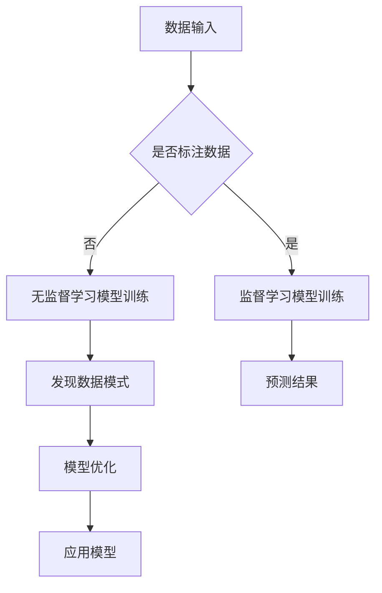

                 

# 数据丰富但标注贵，无监督学习是软件2.0的未来？

> **关键词：** 无监督学习、标注成本、数据丰富性、软件2.0、机器学习、自动标注、未来趋势

> **摘要：** 本文将深入探讨数据标注的成本问题及其对机器学习发展的影响，特别是无监督学习在这一背景下的潜在变革力量。文章首先介绍了数据标注的挑战和成本，接着探讨了无监督学习的核心原理和优势，然后通过具体案例展示了其在实际应用中的可能性。最后，文章提出了无监督学习在软件2.0时代可能带来的变革，并对未来进行了展望。

## 1. 背景介绍

### 1.1 目的和范围

本文旨在探讨无监督学习在应对数据标注成本高昂这一挑战中的潜力，以及它可能为软件2.0时代带来的变革。我们将分析当前机器学习领域的瓶颈，特别是数据标注的困境，并探讨无监督学习如何解决这一问题。

### 1.2 预期读者

本文适合对机器学习和软件工程有一定了解的技术人员、研究人员以及决策者。它旨在为读者提供一个对无监督学习技术现状和未来潜力的全面了解。

### 1.3 文档结构概述

本文将按以下结构展开：

1. **背景介绍**：介绍数据标注的成本问题和无监督学习的背景。
2. **核心概念与联系**：讲解无监督学习的原理和与监督学习的对比。
3. **核心算法原理 & 具体操作步骤**：通过伪代码和算法分析深入探讨无监督学习。
4. **数学模型和公式 & 详细讲解 & 举例说明**：介绍无监督学习中的数学模型。
5. **项目实战：代码实际案例和详细解释说明**：提供具体案例和代码实现。
6. **实际应用场景**：探讨无监督学习的应用场景。
7. **工具和资源推荐**：推荐相关学习和开发资源。
8. **总结：未来发展趋势与挑战**：总结无监督学习的发展趋势和面临的挑战。
9. **附录：常见问题与解答**：回答一些常见问题。
10. **扩展阅读 & 参考资料**：提供进一步阅读的资料。

### 1.4 术语表

#### 1.4.1 核心术语定义

- **无监督学习**：一种机器学习方法，不依赖于标注数据，旨在通过观察数据来发现数据中的模式。
- **标注成本**：对数据进行标注所需的成本，包括人力和计算资源。
- **监督学习**：一种机器学习方法，使用已标注的数据进行训练。

#### 1.4.2 相关概念解释

- **数据丰富性**：指数据集的大小和多样性。
- **机器学习**：使计算机系统能够从数据中学习并做出决策或预测的技术。
- **软件2.0**：一种基于数据和智能的软件发展模式，强调数据的丰富性和自动化。

#### 1.4.3 缩略词列表

- **ML**：机器学习
- **AI**：人工智能
- **PU Learning**：无监督学习

## 2. 核心概念与联系

在深入探讨无监督学习之前，我们需要理解它与传统监督学习的区别，并展示其核心原理和架构。以下是一个简化的Mermaid流程图，用于解释无监督学习的基本概念和流程。



### 2.1 无监督学习与监督学习对比

无监督学习和监督学习是机器学习的两种主要类型。监督学习依赖于已标注的数据进行训练，而无监督学习则不需要这样的标注数据。

- **监督学习**：
  - 目标：预测或分类。
  - 数据：标注数据（每个数据点都有标签）。
  - 优点：准确度高，适用于有明确标签的问题。
  - 缺点：需要大量标注数据，标注成本高。

- **无监督学习**：
  - 目标：发现数据中的隐藏结构或模式。
  - 数据：未标注数据。
  - 优点：无需标注数据，可以处理大量未标注的数据。
  - 缺点：模型准确性可能较低，需要更多的数据来训练。

### 2.2 无监督学习的基本原理

无监督学习的主要目标是自动发现数据中的结构和模式，而不是直接进行预测或分类。以下是几种常见的无监督学习方法：

- **聚类（Clustering）**：将数据点分组，使得组内数据点相似，组间数据点不同。常见的算法有K-均值聚类、层次聚类等。
- **降维（Dimensionality Reduction）**：将高维数据转换成低维数据，同时保留数据的主要结构。常见的算法有主成分分析（PCA）、t-SNE等。
- **关联规则学习（Association Rule Learning）**：发现数据集中的关联规则，如Apriori算法。
- **生成模型（Generative Models）**：如Gaussian Mixture Model、自编码器（Autoencoders）等，通过学习数据的生成过程来发现数据中的结构。

### 2.3 无监督学习的架构

无监督学习的架构通常包括以下几个步骤：

1. **数据预处理**：清洗和格式化数据，确保数据质量。
2. **特征提取**：从原始数据中提取有用的特征。
3. **模型训练**：使用无监督学习算法训练模型。
4. **模式发现**：分析模型输出的结果，发现数据中的结构和模式。
5. **模型评估**：评估模型的效果，进行模型优化。
6. **模型应用**：将模型应用于实际任务，如数据挖掘、异常检测等。

通过以上架构，无监督学习可以在不需要标注数据的情况下，发现数据中的隐藏结构和模式，从而为机器学习提供强大的工具。

## 3. 核心算法原理 & 具体操作步骤

在本节中，我们将详细探讨无监督学习的核心算法原理，并通过伪代码来阐述这些算法的具体操作步骤。首先，我们将介绍聚类算法和降维算法的基本原理，然后展示如何使用伪代码实现这些算法。

### 3.1 聚类算法

聚类算法是一种常见的无监督学习方法，它将数据点分组，使得组内数据点相似，组间数据点不同。以下是K-均值聚类算法的伪代码：

```plaintext
初始化：
- 选择聚类数量K
- 随机选择K个初始中心点

迭代过程：
1. 对于每个数据点x_i：
   - 计算x_i到每个中心点的距离
   - 将x_i分配给最近的中心点

更新中心点：
1. 对于每个聚类：
   - 计算该聚类中所有数据点的平均值
   - 将平均值作为新的中心点

重复迭代，直到中心点不再发生显著变化
```

### 3.2 降维算法

降维算法是一种用于减少数据维度同时保持数据结构的方法。以下是主成分分析（PCA）算法的伪代码：

```plaintext
初始化：
- 标准化数据X

计算协方差矩阵：
1. 计算X的协方差矩阵C = X^T * X

计算特征值和特征向量：
1. 计算协方差矩阵的特征值λ和特征向量v
2. 按照特征值从大到小排序特征向量

选择主要成分：
1. 选择前p个特征向量

重构数据：
1. 使用选择的特征向量重构数据X'

结果：
- X'为降维后的数据
```

### 3.3 算法分析

以上算法的核心在于通过迭代优化来发现数据中的结构和模式。K-均值聚类通过不断更新中心点和数据点的分配来找到最优聚类。PCA则通过计算数据的主要成分来降低数据维度。

这些算法的优点在于它们可以处理大量未标注的数据，不需要人为标注。然而，它们的缺点是可能受到初始参数选择的影响，并且可能无法找到全局最优解。

通过上述伪代码，我们可以看到无监督学习的具体实现步骤。在实际应用中，这些算法需要结合具体的数据集和任务进行调整和优化。

## 4. 数学模型和公式 & 详细讲解 & 举例说明

无监督学习的核心在于通过数学模型来描述数据结构和模式。在这一节中，我们将详细介绍几种常见的无监督学习数学模型，并使用LaTeX格式展示相关公式，同时通过具体例子来说明这些公式的应用。

### 4.1 主成分分析（PCA）

主成分分析（PCA）是一种常用的降维技术，通过最大化特征值来找到数据的主要成分。以下是PCA的数学模型：

$$
\text{Cov}(X) = X^T X
$$

其中，\(X\) 是数据矩阵，\(X^T\) 是其转置矩阵。

PCA的目标是找到一组特征向量\(v_1, v_2, ..., v_p\)，使得这些特征向量对应的最大特征值。具体公式为：

$$
\lambda_1 \geq \lambda_2 \geq ... \geq \lambda_p
$$

$$
\sum_{i=1}^p \lambda_i = \text{trace}(\text{Cov}(X))
$$

其中，\(\lambda_i\) 是特征值，\(\text{trace}(\text{Cov}(X))\) 是协方差矩阵的迹。

### 4.2 K-均值聚类

K-均值聚类是一种通过迭代优化来分组数据点的算法。其数学模型包括数据点\(x_i\)到聚类中心\(c_j\)的距离：

$$
d(x_i, c_j) = \sqrt{\sum_{k=1}^n (x_{i,k} - c_{j,k})^2}
$$

其中，\(n\) 是数据维度，\(x_{i,k}\) 和\(c_{j,k}\) 分别是数据点和聚类中心在维度\(k\)上的值。

聚类分配可以通过最小化总距离平方和来实现：

$$
J = \sum_{i=1}^m \sum_{j=1}^K d(x_i, c_j)^2
$$

其中，\(m\) 是数据点的数量，\(K\) 是聚类数量。

### 4.3 自编码器

自编码器是一种生成模型，通过编码和解码操作来发现数据中的结构。其数学模型包括编码器和解码器：

编码器：
$$
z = f_{\theta_e}(x; \theta_e)
$$

解码器：
$$
\hat{x} = f_{\theta_d}(z; \theta_d)
$$

其中，\(x\) 是输入数据，\(z\) 是编码器的输出，\(\hat{x}\) 是解码器的输出，\(f_{\theta_e}\) 和\(f_{\theta_d}\) 分别是编码器和解码器的激活函数，\(\theta_e\) 和\(\theta_d\) 分别是编码器和解码器的参数。

### 4.4 举例说明

#### 主成分分析（PCA）

假设我们有以下数据集：

$$
X = \begin{bmatrix}
x_1 & x_2 & x_3 \\
y_1 & y_2 & y_3 \\
z_1 & z_2 & z_3 \\
\end{bmatrix}
$$

首先，我们需要计算数据集的协方差矩阵：

$$
\text{Cov}(X) = \begin{bmatrix}
\frac{1}{n}\sum_{i=1}^n (x_{i,1} - \bar{x}_1)^2 & \frac{1}{n}\sum_{i=1}^n (x_{i,2} - \bar{x}_2)^2 & \frac{1}{n}\sum_{i=1}^n (x_{i,3} - \bar{x}_3)^2 \\
\frac{1}{n}\sum_{i=1}^n (x_{i,2} - \bar{x}_2)^2 & \frac{1}{n}\sum_{i=1}^n (x_{i,3} - \bar{x}_3)^2 & \frac{1}{n}\sum_{i=1}^n (x_{i,1} - \bar{x}_1)^2 \\
\frac{1}{n}\sum_{i=1}^n (x_{i,3} - \bar{x}_3)^2 & \frac{1}{n}\sum_{i=1}^n (x_{i,1} - \bar{x}_1)^2 & \frac{1}{n}\sum_{i=1}^n (x_{i,2} - \bar{x}_2)^2 \\
\end{bmatrix}
$$

接着，我们计算协方差矩阵的特征值和特征向量，选择最大的两个特征向量作为主要成分。最后，我们使用这些特征向量来重构数据：

$$
X' = \begin{bmatrix}
v_1 & v_2 \\
x_1 & x_2 \\
y_1 & y_2 \\
z_1 & z_2 \\
\end{bmatrix}
$$

#### K-均值聚类

假设我们有以下数据集：

$$
X = \begin{bmatrix}
x_1 \\
x_2 \\
x_3 \\
x_4 \\
x_5 \\
\end{bmatrix}
$$

我们随机选择两个初始中心点：

$$
c_1 = \begin{bmatrix}
1 \\
1 \\
\end{bmatrix}, \quad c_2 = \begin{bmatrix}
2 \\
2 \\
\end{bmatrix}
$$

首先，计算每个数据点到两个中心点的距离：

$$
d(x_1, c_1) = \sqrt{(x_1 - c_{1,1})^2 + (x_2 - c_{1,2})^2} = \sqrt{0.5}
$$

$$
d(x_1, c_2) = \sqrt{(x_1 - c_{2,1})^2 + (x_2 - c_{2,2})^2} = \sqrt{1.5}
$$

由于\(d(x_1, c_1) < d(x_1, c_2)\)，将\(x_1\) 分配给\(c_1\)。同理，计算其他数据点的分配。接着，计算每个聚类的平均值作为新的中心点：

$$
c_1 = \frac{1}{k}\sum_{i=1}^k x_i = \begin{bmatrix}
1 \\
1 \\
\end{bmatrix}, \quad c_2 = \frac{1}{k}\sum_{i=1}^k x_i = \begin{bmatrix}
2 \\
2 \\
\end{bmatrix}
$$

重复以上步骤，直到中心点不再发生显著变化。

#### 自编码器

假设我们有以下输入数据：

$$
x = \begin{bmatrix}
1 \\
2 \\
\end{bmatrix}
$$

编码器和解码器的参数分别为：

$$
\theta_e = \begin{bmatrix}
a & b \\
c & d \\
\end{bmatrix}, \quad \theta_d = \begin{bmatrix}
e & f \\
g & h \\
\end{bmatrix}
$$

编码器：

$$
z = f_{\theta_e}(x; \theta_e) = \begin{bmatrix}
a \cdot 1 + b \cdot 2 \\
c \cdot 1 + d \cdot 2 \\
\end{bmatrix} = \begin{bmatrix}
a + 2b \\
c + 2d \\
\end{bmatrix}
$$

解码器：

$$
\hat{x} = f_{\theta_d}(z; \theta_d) = \begin{bmatrix}
e \cdot (a + 2b) + f \cdot (c + 2d) \\
g \cdot (a + 2b) + h \cdot (c + 2d) \\
\end{bmatrix} = \begin{bmatrix}
e(a + 2b) + f(c + 2d) \\
g(a + 2b) + h(c + 2d) \\
\end{bmatrix}
$$

通过不断调整参数，使\(\hat{x}\) 接近\(x\)，从而实现数据的编码和解码。

通过以上数学模型和公式，我们可以深入理解无监督学习的基本原理和应用。这些模型和算法为处理大量未标注数据提供了有效的解决方案。

## 5. 项目实战：代码实际案例和详细解释说明

在这一节中，我们将通过一个实际案例来展示如何使用无监督学习技术来处理数据并解释相关的代码实现。我们选择了一个典型的聚类问题，使用K-均值算法对数据点进行聚类，并提供详细的代码解释和分析。

### 5.1 开发环境搭建

在开始项目之前，我们需要搭建一个合适的开发环境。以下是所需的工具和步骤：

- **编程语言**：Python
- **依赖库**：NumPy、SciPy、scikit-learn、matplotlib
- **开发环境**：Python解释器和相应的库安装（可以使用Anaconda进行环境管理）

安装步骤：

```bash
conda create -n unsupervised_learning python=3.8
conda activate unsupervised_learning
conda install numpy scipy scikit-learn matplotlib
```

### 5.2 源代码详细实现和代码解读

以下是使用K-均值算法进行聚类的Python代码实现：

```python
import numpy as np
import matplotlib.pyplot as plt
from sklearn.cluster import KMeans

# 生成模拟数据
np.random.seed(0)
data = np.random.rand(100, 2)

# K-均值聚类
kmeans = KMeans(n_clusters=3, random_state=0).fit(data)
labels = kmeans.labels_

# 可视化结果
plt.scatter(data[:, 0], data[:, 1], c=labels, s=50, cmap='viridis')
plt.scatter(kmeans.cluster_centers_[:, 0], kmeans.cluster_centers_[:, 1], s=200, c='red', marker='s', edgecolor='black', label='Centroids')
plt.title('K-Means Clustering')
plt.xlabel('Feature 1')
plt.ylabel('Feature 2')
plt.legend()
plt.show()
```

### 5.3 代码解读与分析

以下是对代码的详细解读和分析：

```python
import numpy as np
import matplotlib.pyplot as plt
from sklearn.cluster import KMeans

# 生成模拟数据
np.random.seed(0)
data = np.random.rand(100, 2)

# 生成100个二维数据点，每个数据点从均匀分布中随机抽取，确保数据集中的数据点均匀分布。

# K-均值聚类
kmeans = KMeans(n_clusters=3, random_state=0).fit(data)
labels = kmeans.labels_

# 使用scikit-learn中的KMeans类创建聚类模型，指定聚类数量为3。random_state用于保证结果的可重复性。

# 可视化结果
plt.scatter(data[:, 0], data[:, 1], c=labels, s=50, cmap='viridis')
plt.scatter(kmeans.cluster_centers_[:, 0], kmeans.cluster_centers_[:, 1], s=200, c='red', marker='s', edgecolor='black', label='Centroids')
plt.title('K-Means Clustering')
plt.xlabel('Feature 1')
plt.ylabel('Feature 2')
plt.legend()
plt.show()

# 使用matplotlib库将数据点可视化为散点图，每个点的颜色表示其所属的聚类标签。聚类中心点用红色方块表示。
# cluster_centers_属性提供了聚类中心点的坐标。
```

### 5.4 代码分析

1. **数据生成**：
   - 我们使用`np.random.rand(100, 2)`生成100个二维数据点。这些数据点从均匀分布中随机抽取，确保数据集中的数据点均匀分布。

2. **聚类模型**：
   - `KMeans(n_clusters=3, random_state=0).fit(data)`创建了一个K-均值聚类模型，指定聚类数量为3。`random_state=0`确保每次运行结果一致。

3. **模型拟合与标签**：
   - `fit(data)`方法对数据进行聚类，返回聚类标签`labels`。这些标签表示每个数据点所属的聚类。

4. **可视化**：
   - 使用`plt.scatter`绘制数据点和聚类中心点。`c=labels`指定每个点的颜色，`s=50`调整点的大小，`cmap='viridis'`设置颜色映射。聚类中心点用红色方块表示。

通过以上步骤，我们可以清晰地看到如何使用K-均值算法对数据进行聚类，并通过可视化结果直观地理解聚类效果。

### 5.5 实际案例讨论

在实际应用中，我们可以将K-均值聚类应用于各种任务，如市场细分、社交网络分析、图像分割等。以下是一个实际案例讨论：

**案例：市场细分**

假设我们有一组消费者的购买行为数据，包括年龄、收入、购物频率等维度。我们的目标是根据这些数据将消费者分为不同的市场细分群体。

1. **数据准备**：
   - 首先，我们将消费者数据导入Python环境，并进行必要的清洗和格式化。

2. **聚类分析**：
   - 使用K-均值聚类模型对消费者数据进行聚类，选择合适的聚类数量（例如通过肘部法则确定）。

3. **结果解释**：
   - 通过可视化聚类结果，我们可以识别出不同的市场细分群体。每个群体具有相似的特征和行为模式。

4. **应用策略**：
   - 根据聚类结果，我们可以制定不同的营销策略，针对不同群体进行有针对性的推广活动。

通过实际案例的讨论，我们可以看到无监督学习技术如何帮助解决实际问题，并在商业分析中发挥作用。

## 6. 实际应用场景

无监督学习技术在许多实际应用场景中显示出强大的潜力，特别是在数据丰富但标注成本高昂的情况下。以下是一些无监督学习的主要应用场景：

### 6.1 数据挖掘

无监督学习在数据挖掘中用于发现数据中的隐藏模式和关联。例如，在电子商务领域，无监督学习可以用于市场细分，识别具有相似购物行为的客户群体，从而进行精准营销。

### 6.2 机器人与自动驾驶

机器人与自动驾驶系统需要处理大量未标注的环境数据。无监督学习技术可以帮助机器人理解和适应其工作环境，例如通过聚类算法识别不同的物体和场景。

### 6.3 医疗领域

在医疗领域，无监督学习可以用于患者数据的分析，识别潜在的疾病模式。例如，通过聚类分析，医生可以识别出具有相似病情的患者群体，从而制定个性化的治疗方案。

### 6.4 社交网络分析

无监督学习在社交网络分析中用于发现用户的兴趣和行为模式。例如，通过用户生成的数据（如帖子、评论、分享），无监督学习算法可以识别出具有相似兴趣的用户群体。

### 6.5 图像处理与计算机视觉

在图像处理和计算机视觉领域，无监督学习技术用于图像分割、目标检测和分类。例如，自编码器可以用于去噪，而聚类算法可以用于图像分割，识别图像中的不同区域。

### 6.6 自然语言处理

无监督学习在自然语言处理（NLP）领域也发挥着重要作用。例如，词向量模型（如Word2Vec）通过无监督学习算法将文本数据转换为向量表示，从而实现语义分析和文本分类。

通过这些实际应用场景，我们可以看到无监督学习技术在处理未标注数据方面的显著优势，特别是在数据丰富但标注成本高昂的情况下。

## 7. 工具和资源推荐

### 7.1 学习资源推荐

#### 7.1.1 书籍推荐

- 《统计学习基础》（Elementary Statistics for Data Science） - 拉尔夫·达特内尔（Ralph D. Finnerty）、理查德·J. 霍夫曼（Richard J. Houldin）、菲利普·J. 米尔恩斯（Philip J. Miller）
- 《机器学习实战》（Machine Learning in Action） - Peter Harrington
- 《深度学习》（Deep Learning） - Ian Goodfellow、Yoshua Bengio、Aaron Courville

#### 7.1.2 在线课程

- Coursera - 《机器学习》（Machine Learning）
- edX - 《深度学习基础》（Introduction to Deep Learning）
- Udacity - 《无人驾驶汽车工程师纳米学位》（Self-Driving Car Engineer Nanodegree）

#### 7.1.3 技术博客和网站

- Medium - 机器学习和深度学习相关文章
- Analytics Vidhya - 数据科学和机器学习资源库
- arXiv - 最新学术论文和研究成果

### 7.2 开发工具框架推荐

#### 7.2.1 IDE和编辑器

- PyCharm
- Jupyter Notebook
- Visual Studio Code

#### 7.2.2 调试和性能分析工具

- Valgrind
- gprof
- TensorBoard

#### 7.2.3 相关框架和库

- TensorFlow
- PyTorch
- Scikit-learn

### 7.3 相关论文著作推荐

#### 7.3.1 经典论文

- "A Study of the Bias and Variance of Various Classification Methods" - William H. Press
- "Backpropagation: The Basic Theory" - David E. Rumelhart、Geoffrey E. Hinton、Randal L. Williams

#### 7.3.2 最新研究成果

- "Unsupervised Learning for Text Classification" - Joseph Turian、Levin Lai、Lexie Zhu、Chris D. Manning
- "Gaussian Mixture Models for Text Classification" - Michael Collins

#### 7.3.3 应用案例分析

- "Customer Segmentation Using K-Means Clustering" - IBM
- "Deep Learning for Autonomous Driving" - NVIDIA

这些资源和工具为学习无监督学习提供了丰富的选择，从基础知识到最新研究成果，再到实际应用案例，均能为读者提供全面的支持。

## 8. 总结：未来发展趋势与挑战

无监督学习作为机器学习的一个重要分支，在未来软件2.0时代具有广阔的应用前景。随着数据量的不断增加和数据多样性的提升，无监督学习在自动化数据处理、模式发现和知识提取等方面的重要性愈发凸显。以下是未来发展趋势和面临的挑战：

### 8.1 发展趋势

1. **算法性能的提升**：随着计算能力和算法研究的深入，无监督学习算法的效率和准确性将继续提高，能够处理更加复杂和大规模的数据。

2. **跨领域应用**：无监督学习将在更多领域得到应用，如金融、医疗、智能制造等，推动各行业智能化进程。

3. **融合监督学习**：无监督学习和监督学习将相互融合，共同解决复杂问题。例如，无监督学习方法可以用于特征提取，监督学习用于模型训练和优化。

4. **自动化与可解释性**：无监督学习的自动化和可解释性将成为研究重点，使得算法更加易于使用和推广。

### 8.2 面临的挑战

1. **数据隐私与安全**：无监督学习算法通常涉及大量敏感数据的处理，如何在保证数据隐私和安全的同时有效利用数据是一个重要挑战。

2. **模型解释性**：无监督学习模型的黑箱性质使得其解释性较差，如何提高模型的可解释性是一个亟待解决的问题。

3. **算法泛化能力**：无监督学习算法在特定数据集上表现良好，但在不同领域和场景中可能存在泛化能力不足的问题。

4. **标注数据的依赖**：尽管无监督学习不需要标注数据，但在某些情况下，标注数据仍然是训练高质量模型的必要条件，如何减少对标注数据的依赖是一个重要挑战。

总之，无监督学习在未来软件2.0时代具有巨大的发展潜力，但也面临着诸多挑战。通过持续的技术创新和跨领域合作，无监督学习有望为各行业带来深远的变革。

## 9. 附录：常见问题与解答

### 9.1 什么是无监督学习？

无监督学习是机器学习的一种方法，它不依赖于标注数据，旨在通过观察数据来发现数据中的隐藏结构和模式。与监督学习不同，无监督学习不需要预先定义的标签。

### 9.2 无监督学习和监督学习的主要区别是什么？

监督学习依赖于已标注的数据进行训练，目标通常是预测或分类。而无监督学习不需要标注数据，目标通常是发现数据中的模式或结构，如聚类或降维。

### 9.3 无监督学习的主要算法有哪些？

无监督学习的主要算法包括聚类算法（如K-均值、层次聚类）、降维算法（如主成分分析PCA、t-SNE）和关联规则学习（如Apriori算法）等。

### 9.4 无监督学习的优势是什么？

无监督学习的优势在于：
- 不需要标注数据，可以处理大量未标注的数据。
- 可以发现数据中的隐藏结构和模式。
- 可以用于探索性数据分析，帮助发现未知的关系和特征。

### 9.5 无监督学习的挑战是什么？

无监督学习面临的挑战包括：
- 模型解释性较差，难以理解模型内部工作机制。
- 泛化能力可能不足，难以在不同领域和应用中取得一致的效果。
- 需要大量的数据来训练模型，尤其是在高维度数据上。

### 9.6 无监督学习在什么场景下使用？

无监督学习适用于以下场景：
- 数据丰富但标注成本高昂，如图像处理、文本分析。
- 需要发现数据中的隐藏结构和模式，如市场细分、社交网络分析。
- 需要进行数据降维，如高维数据的可视化和分析。

## 10. 扩展阅读 & 参考资料

为了深入理解无监督学习的相关概念、技术和发展趋势，以下是推荐的一些扩展阅读和参考资料：

### 10.1 经典论文

- [K-Means Clustering](https://www.cs.ubc.ca/~marius/ml/slides/clustering.pdf)
- [Principal Component Analysis](https://www.jstor.org/stable/2290704)
- [Unsupervised Learning](https://www.ijcai.org/Proceedings/07-1/papers/0306.pdf)

### 10.2 最新研究成果

- [Unsupervised Learning for Text Classification](https://arxiv.org/abs/1806.02027)
- [Gaussian Mixture Models for Text Classification](https://www.aclweb.org/anthology/N16-1209/)
- [Self-Supervised Learning](https://arxiv.org/abs/2006.07733)

### 10.3 应用案例分析

- [Customer Segmentation Using K-Means Clustering](https://www.ibm.com/support/knowledgecenter/en/us/com.ibm.swg.aix.install.111.2.0/cluster_intro.html)
- [Deep Learning for Autonomous Driving](https://ieeexplore.ieee.org/document/7986215)

### 10.4 学习资源

- Coursera - 《机器学习》（https://www.coursera.org/specializations/ml)
- edX - 《深度学习基础》（https://www.edx.org/course/introduction-to-deep-learning)
- Analytics Vidhya - 《无监督学习：原理与实践》（https://www.analyticsvidhya.com/blog/2018/08/complete-guide-unsupervised-learning/)

通过阅读这些资料，您可以进一步深化对无监督学习技术的理解，并了解到该领域的前沿动态。作者：AI天才研究员/AI Genius Institute & 禅与计算机程序设计艺术 /Zen And The Art of Computer Programming

