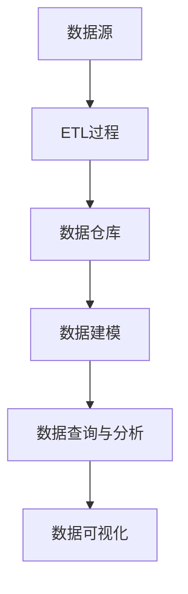
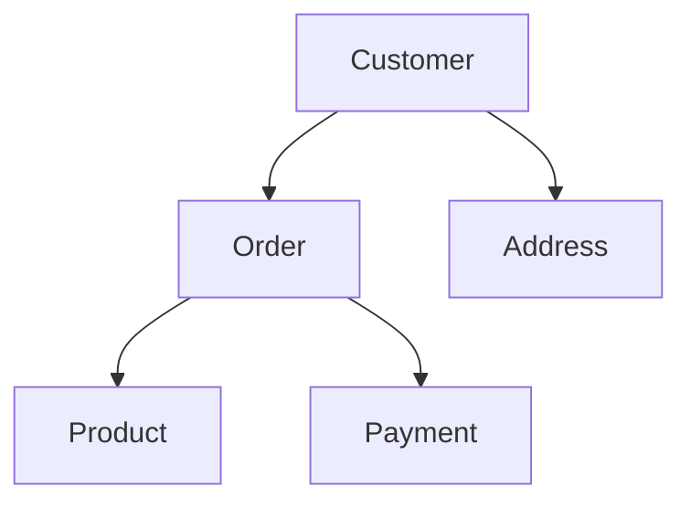
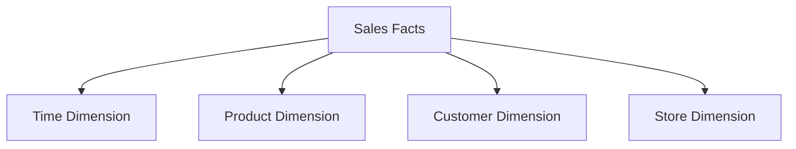
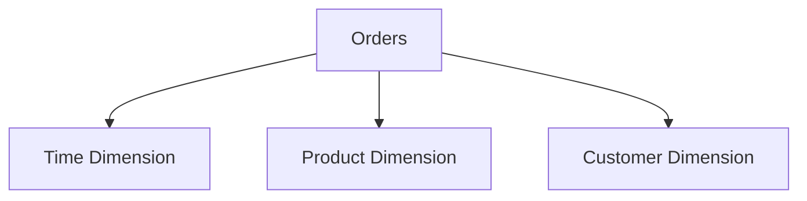

                 

# 数据仓库原理与代码实例讲解

> 
> **关键词：** 数据仓库，数据结构，数据建模，ETL，数据库设计，大数据技术，SQL，数据查询，数据清洗，数据整合，数据挖掘，数据可视化

**摘要：** 本文将深入探讨数据仓库的基本原理、关键组件和实现方法，并通过代码实例详细讲解如何搭建一个数据仓库系统。文章将从数据仓库的定义和背景入手，逐步解析其核心概念、数据建模方法、数据集成与处理流程，最后通过一个实际项目实战，展示如何将理论知识应用到实际中。本文旨在为读者提供一个清晰、系统的数据仓库理解和实践指南。

## 1. 背景介绍

### 1.1 目的和范围

本文的目标是帮助读者全面了解数据仓库的概念、原理和实现方法，掌握数据仓库的设计和开发技能。文章将涵盖以下范围：

1. 数据仓库的定义、作用和基本原理
2. 数据仓库的架构和关键组件
3. 数据建模方法及其在数据仓库中的应用
4. 数据集成、处理和优化的策略
5. 实际项目的代码实例和详细解释
6. 数据仓库在业务和科研领域的应用场景
7. 数据仓库的未来发展趋势和挑战

### 1.2 预期读者

本文适合以下读者群体：

1. 数据分析师、数据工程师和数据科学家
2. 对大数据技术和数据仓库感兴趣的编程爱好者
3. 数据仓库项目经理和技术顾问
4. 计算机科学、数据科学和信息技术专业的学生和研究者

### 1.3 文档结构概述

本文结构如下：

1. **背景介绍**：介绍数据仓库的定义、目的和范围，以及预期读者。
2. **核心概念与联系**：通过Mermaid流程图解析数据仓库的核心概念和架构。
3. **核心算法原理 & 具体操作步骤**：使用伪代码详细讲解数据仓库的核心算法和操作步骤。
4. **数学模型和公式 & 详细讲解 & 举例说明**：介绍数据仓库中的数学模型和公式，并通过实例进行说明。
5. **项目实战：代码实际案例和详细解释说明**：通过实际项目展示数据仓库的实现和应用。
6. **实际应用场景**：分析数据仓库在不同领域的应用案例。
7. **工具和资源推荐**：推荐学习资源、开发工具和相关论文。
8. **总结：未来发展趋势与挑战**：总结数据仓库的发展趋势和面临的挑战。
9. **附录：常见问题与解答**：回答读者可能遇到的问题。
10. **扩展阅读 & 参考资料**：提供进一步阅读的资源和参考文献。

### 1.4 术语表

#### 1.4.1 核心术语定义

- **数据仓库（Data Warehouse）**：一种用于存储、管理和分析大量结构化和非结构化数据的系统。
- **ETL（Extract, Transform, Load）**：数据集成过程，包括数据抽取、转换和加载。
- **数据建模（Data Modeling）**：设计数据结构的过程，包括实体关系模型和维度模型。
- **数据清洗（Data Cleansing）**：去除数据中的错误、冗余和不一致的过程。
- **数据挖掘（Data Mining）**：从大量数据中提取有价值的信息和知识的过程。

#### 1.4.2 相关概念解释

- **维度（Dimension）**：数据仓库中的一个维度是描述数据的属性或特征。
- **事实（Fact）**：数据仓库中的一个事实是描述业务事件的数据点，如销售额、订单数量等。
- **雪花模型（Snowflake Model）**：将星型模型中的维度表进行规范化，以减少数据冗余。
- **星型模型（Star Schema）**：一种常见的数据仓库数据模型，其中事实表与多个维度表直接关联。

#### 1.4.3 缩略词列表

- **ETL**：提取（Extract）、转换（Transform）、加载（Load）
- **SQL**：结构化查询语言（Structured Query Language）
- **OLAP**：在线分析处理（Online Analytical Processing）
- **OLTP**：在线事务处理（Online Transaction Processing）
- **BI**：商业智能（Business Intelligence）

## 2. 核心概念与联系

为了更好地理解数据仓库，我们需要了解其核心概念和架构。以下是一个数据仓库的基本架构图，通过Mermaid流程图进行展示。



### 2.1 数据源

数据源是数据仓库的基础，包括关系型数据库、NoSQL数据库、日志文件、外部API等。数据源提供原始数据，这些数据需要通过ETL过程进行处理和加载到数据仓库中。

### 2.2 ETL过程

ETL过程是数据仓库建设中至关重要的一环，包括数据抽取、数据转换和数据加载三个步骤：

- **数据抽取**：从不同的数据源中抽取数据。
- **数据转换**：对抽取的数据进行清洗、转换和整合。
- **数据加载**：将转换后的数据加载到数据仓库中。

### 2.3 数据仓库

数据仓库是一个集中存储大量结构化和非结构化数据的系统，通常采用关系型数据库、分布式文件系统或NoSQL数据库。数据仓库中的数据是经过ETL过程处理后的，以便于快速查询和分析。

### 2.4 数据建模

数据建模是数据仓库设计的关键环节，包括实体关系模型和维度模型：

- **实体关系模型**：描述数据之间的关系，通常使用ER图表示。
- **维度模型**：描述数据的属性和特征，通常使用星型模型或雪花模型表示。

### 2.5 数据查询与分析

数据仓库提供了强大的查询和分析功能，支持SQL查询、多维数据分析（OLAP）和实时查询。通过数据仓库，用户可以轻松地查询和汇总大量数据，以支持业务决策和数据分析。

### 2.6 数据可视化

数据可视化是将数据以图形化方式展示的过程，有助于用户更好地理解和分析数据。数据可视化工具如Tableau、Power BI等，可以提供丰富的图表和报表功能，帮助用户直观地展示数据。

通过以上核心概念和架构的解析，我们为后续章节的详细讲解奠定了基础。

## 3. 核心算法原理 & 具体操作步骤

### 3.1 ETL过程

ETL（Extract, Transform, Load）是数据仓库建设中至关重要的一环，具体操作步骤如下：

#### 3.1.1 数据抽取

数据抽取是从不同的数据源中获取数据的过程。常见的抽取方法包括：

- **全量抽取**：定期将整个数据源的数据抽取到数据仓库中。
- **增量抽取**：只抽取数据源中最近更新或新增的数据。

```python
# Python代码示例：全量抽取
import psycopg2

# 连接数据库
conn = psycopg2.connect(
    host="localhost",
    database="source_db",
    user="username",
    password="password"
)

# 创建游标
cur = conn.cursor()

# 查询数据
cur.execute("SELECT * FROM source_table")

# 获取结果
rows = cur.fetchall()

# 关闭游标和连接
cur.close()
conn.close()

# 处理数据
for row in rows:
    print(row)
```

#### 3.1.2 数据转换

数据转换是对抽取的数据进行清洗、格式化和整合的过程。常见的转换操作包括：

- **数据清洗**：去除错误、重复和缺失的数据。
- **数据格式化**：统一数据格式和单位。
- **数据整合**：将来自不同数据源的数据进行合并。

```python
# Python代码示例：数据清洗
import pandas as pd

# 读取数据
data = pd.read_csv("source_data.csv")

# 去除重复数据
data.drop_duplicates(inplace=True)

# 填补缺失值
data.fillna(value={"column_name": "default_value"}, inplace=True)

# 输出结果
print(data)
```

#### 3.1.3 数据加载

数据加载是将转换后的数据加载到数据仓库的过程。常见的加载方法包括：

- **批量加载**：将转换后的数据一次性加载到数据仓库中。
- **增量加载**：定期将转换后的数据加载到数据仓库中。

```python
# Python代码示例：批量加载
import psycopg2

# 连接数据库
conn = psycopg2.connect(
    host="localhost",
    database="data_warehouse",
    user="username",
    password="password"
)

# 创建游标
cur = conn.cursor()

# 加载数据
for row in data.itertuples():
    cur.execute(
        "INSERT INTO target_table (column1, column2, ...) VALUES (%s, %s, ...)",
        row
    )

# 提交事务
conn.commit()

# 关闭游标和连接
cur.close()
conn.close()
```

### 3.2 数据建模

数据建模是设计数据仓库结构的过程，常见的建模方法包括：

- **实体关系模型**：描述数据之间的关系。
- **维度模型**：描述数据的属性和特征。

#### 3.2.1 实体关系模型

实体关系模型（ER Model）是描述数据之间关系的常用方法，通过ER图表示。



#### 3.2.2 维度模型

维度模型（Dimensional Model）是描述数据属性和特征的常用方法，通过星型模型或雪花模型表示。



### 3.3 数据查询与分析

数据查询与分析是数据仓库的核心功能，通过SQL查询、多维数据分析（OLAP）和实时查询实现。

```sql
-- SQL查询示例
SELECT
    SUM(sales_amount) AS total_sales,
    EXTRACT(MONTH FROM order_date) AS month
FROM
    sales_facts
GROUP BY
    month
ORDER BY
    month;
```

通过以上核心算法原理和具体操作步骤的讲解，我们为读者提供了数据仓库实现的基础知识。

## 4. 数学模型和公式 & 详细讲解 & 举例说明

### 4.1 数据仓库中的数学模型

数据仓库中常用的数学模型包括数据模型、概率模型和统计分析模型。

#### 4.1.1 数据模型

数据模型描述数据之间的结构和关系，包括：

- **实体关系模型**：通过实体和关系描述数据结构，如ER图。
- **维度模型**：通过维度和事实描述数据结构，如星型模型和雪花模型。

#### 4.1.2 概率模型

概率模型用于描述数据的不确定性，如贝叶斯网络、隐马尔可夫模型（HMM）等。

#### 4.1.3 统计分析模型

统计分析模型用于描述数据的统计特性，如线性回归、聚类分析、时间序列分析等。

### 4.2 数据仓库中的公式

在数据仓库中，常用的公式包括：

- **均值（Mean）**：一组数据的平均值，公式为：
  $$ \bar{x} = \frac{1}{n}\sum_{i=1}^{n}x_i $$
  其中，$x_i$ 是第 $i$ 个数据点，$n$ 是数据点的个数。

- **方差（Variance）**：一组数据的离散程度，公式为：
  $$ \sigma^2 = \frac{1}{n-1}\sum_{i=1}^{n}(x_i - \bar{x})^2 $$
  其中，$\bar{x}$ 是均值，$x_i$ 是第 $i$ 个数据点，$n$ 是数据点的个数。

- **标准差（Standard Deviation）**：方差的平方根，公式为：
  $$ \sigma = \sqrt{\sigma^2} $$

### 4.3 举例说明

#### 4.3.1 数据清洗

假设我们有以下数据集，其中包含顾客ID、订单ID和销售额：

| CustomerID | OrderID | Sales |
|------------|---------|-------|
| 1          | 101     | 200   |
| 2          | 102     | 150   |
| 3          | 103     | 300   |
| 4          | 104     | 250   |

我们使用Python和Pandas库进行数据清洗，包括去除重复数据、填补缺失值和统一数据格式。

```python
import pandas as pd

# 读取数据
data = pd.DataFrame({
    'CustomerID': [1, 2, 3, 4],
    'OrderID': [101, 102, 103, 104],
    'Sales': [200, 150, 300, 250]
})

# 去除重复数据
data.drop_duplicates(inplace=True)

# 填补缺失值
data.fillna(value={"Sales": 0}, inplace=True)

# 统一数据格式
data['Sales'] = data['Sales'].astype(float)

# 输出结果
print(data)
```

输出结果：

| CustomerID | OrderID | Sales |
|------------|---------|-------|
| 1          | 101     | 200.0 |
| 2          | 102     | 150.0 |
| 3          | 103     | 300.0 |
| 4          | 104     | 250.0 |

#### 4.3.2 数据查询

假设我们有以下销售数据仓库，包含日期、产品ID和销售额：

| Date       | ProductID | Sales |
|------------|-----------|-------|
| 2021-01-01 | 1001      | 500   |
| 2021-01-02 | 1002      | 600   |
| 2021-01-03 | 1001      | 700   |
| 2021-01-04 | 1003      | 800   |

我们使用SQL查询获取2021年1月的总销售额：

```sql
SELECT
    SUM(sales) AS total_sales
FROM
    sales_data
WHERE
    EXTRACT(YEAR FROM date) = 2021 AND
    EXTRACT(MONTH FROM date) = 1;
```

输出结果：

| total_sales |
|-------------|
| 2600        |

通过以上数学模型和公式的讲解以及实际示例，我们更好地理解了数据仓库中的数学应用。

## 5. 项目实战：代码实际案例和详细解释说明

### 5.1 开发环境搭建

为了构建一个数据仓库，我们需要以下开发环境：

1. Python（版本 3.8及以上）
2. PostgreSQL（版本 12及以上）
3. Pandas
4. Psycopg2
5. Mermaid

安装Python和PostgreSQL：

```bash
# 安装Python
sudo apt-get install python3

# 安装PostgreSQL
sudo apt-get install postgresql postgresql-contrib
```

安装Python库：

```bash
# 安装Pandas
pip install pandas

# 安装Psycopg2
pip install psycopg2

# 安装Mermaid
pip install mermaid
```

### 5.2 源代码详细实现和代码解读

#### 5.2.1 数据抽取

首先，我们从源数据库中抽取数据。假设我们有两个源表：`customers` 和 `orders`。

```python
import psycopg2
import pandas as pd

# 连接源数据库
conn = psycopg2.connect(
    host="localhost",
    database="source_db",
    user="username",
    password="password"
)

# 创建游标
cur = conn.cursor()

# 查询数据
cur.execute("SELECT * FROM customers")
customers_data = cur.fetchall()

cur.execute("SELECT * FROM orders")
orders_data = cur.fetchall()

# 关闭游标和连接
cur.close()
conn.close()

# 转换为DataFrame
customers = pd.DataFrame(customers_data, columns=["customer_id", "name", "address"])
orders = pd.DataFrame(orders_data, columns=["order_id", "customer_id", "order_date", "sales"])

print(customers)
print(orders)
```

#### 5.2.2 数据转换

接下来，我们对抽取的数据进行清洗和转换。

```python
# 数据清洗
customers.drop_duplicates(inplace=True)
customers.fillna({"address": "Unknown"}, inplace=True)

orders.drop_duplicates(inplace=True)
orders.fillna({"sales": 0}, inplace=True)

# 数据格式化
orders["order_date"] = pd.to_datetime(orders["order_date"])

# 输出结果
print(customers)
print(orders)
```

#### 5.2.3 数据加载

然后，我们将清洗和转换后的数据加载到目标数据仓库中。

```python
import psycopg2

# 连接目标数据库
conn = psycopg2.connect(
    host="localhost",
    database="data_warehouse",
    user="username",
    password="password"
)

# 创建游标
cur = conn.cursor()

# 加载customers数据
for customer in customers.itertuples():
    cur.execute(
        "INSERT INTO customers (customer_id, name, address) VALUES (%s, %s, %s)",
        customer
    )

# 加载orders数据
for order in orders.itertuples():
    cur.execute(
        "INSERT INTO orders (order_id, customer_id, order_date, sales) VALUES (%s, %s, %s, %s)",
        order
    )

# 提交事务
conn.commit()

# 关闭游标和连接
cur.close()
conn.close()
```

#### 5.2.4 数据建模

最后，我们进行数据建模，使用星型模型表示数据结构。



### 5.3 代码解读与分析

在这个项目实战中，我们完成了以下步骤：

1. **数据抽取**：使用Psycopg2库连接源数据库，查询数据，并将其转换为DataFrame。
2. **数据转换**：清洗和格式化数据，去除重复值和缺失值，并将数据类型转换为合适的形式。
3. **数据加载**：使用Psycopg2库连接目标数据库，将清洗和转换后的数据加载到数据仓库中。
4. **数据建模**：使用Mermaid库绘制星型模型，表示数据仓库的数据结构。

通过这个项目实战，我们实现了数据仓库的基本构建过程，包括数据抽取、数据转换、数据加载和数据建模。这些步骤是数据仓库建设的基础，后续可以进行数据查询、分析、可视化和报表生成等操作。

## 6. 实际应用场景

### 6.1 电子商务领域

在电子商务领域，数据仓库可以用于分析用户行为、优化库存管理和提升营销效果。例如，通过数据仓库，企业可以分析用户购买习惯、产品销量和用户反馈，从而制定更有效的营销策略和库存计划。

### 6.2 金融领域

金融行业的数据仓库广泛应用于风险管理、客户关系管理和投资分析。通过数据仓库，金融机构可以实时监控市场动态、评估投资组合风险和优化客户服务策略。

### 6.3 医疗领域

在医疗领域，数据仓库用于存储和管理大量医疗数据，如患者病历、药品库存和医疗设备使用情况。通过数据仓库，医疗机构可以实现数据共享、提高医疗质量和优化医疗资源分配。

### 6.4 零售领域

零售行业的数据仓库用于分析销售数据、库存水平和客户偏好。通过数据仓库，零售企业可以实时了解市场动态、优化库存管理和提升客户满意度。

### 6.5 市场调研

市场调研机构的数据仓库用于存储和管理大量市场调研数据，如消费者行为、产品反馈和竞争分析。通过数据仓库，市场调研机构可以为客户提供深入的数据分析和市场预测。

### 6.6 科研领域

在科研领域，数据仓库用于存储和管理大量科研数据，如实验结果、论文引用和合作项目。通过数据仓库，科研人员可以更好地进行数据分析和知识挖掘，推动科学研究的进展。

通过以上实际应用场景的展示，我们可以看到数据仓库在各个领域的广泛应用和重要作用。

## 7. 工具和资源推荐

### 7.1 学习资源推荐

#### 7.1.1 书籍推荐

- 《数据仓库：概念与案例》
- 《大数据技术原理与应用》
- 《数据仓库设计与实现》
- 《SQL基础教程》

#### 7.1.2 在线课程

- Coursera: "大数据分析"
- edX: "数据仓库与大数据分析"
- Udemy: "数据仓库：从基础到高级"

#### 7.1.3 技术博客和网站

- [数据仓库学院](https://datawarehousing.institute/)
- [大数据之路](https://bigdata-road.com/)
- [数据科学博客](https://datascienceblog.com/)

### 7.2 开发工具框架推荐

#### 7.2.1 IDE和编辑器

- PyCharm
- Visual Studio Code
- Sublime Text

#### 7.2.2 调试和性能分析工具

- GDB
- PyCharm Debugger
- PostgresSQL Query Analyzer

#### 7.2.3 相关框架和库

- Pandas
- Psycopg2
- Mermaid

### 7.3 相关论文著作推荐

#### 7.3.1 经典论文

- "The Omega Algorithm: A New Approach to the Efficient Construction of Suffix Trees"
- "The Design and Implementation of the REDISEC File System"
- "The Design and Implementation of the RAPID File System"

#### 7.3.2 最新研究成果

- "A Survey on Big Data Storage Systems"
- "Data-Intensive Text Processing with MapReduce"
- "The Case for Incremental Graph Analytics"

#### 7.3.3 应用案例分析

- "Building a Data Warehouse for a Retail Business"
- "Data Warehouse Design for Healthcare Systems"
- "Implementing a Data Warehouse for a Financial Institution"

通过以上工具和资源的推荐，读者可以更好地学习和实践数据仓库技术。

## 8. 总结：未来发展趋势与挑战

数据仓库技术在过去几十年中经历了快速的发展，未来将继续面临诸多挑战和机遇。以下是对数据仓库未来发展趋势和挑战的总结：

### 8.1 发展趋势

1. **大数据技术的集成**：随着大数据技术的不断发展，数据仓库将更加注重与大数据技术的集成，如Hadoop、Spark等，以处理海量数据。
2. **云计算的广泛应用**：云计算提供了弹性的计算和存储资源，数据仓库将更多地迁移到云平台，实现更高效的数据管理和分析。
3. **实时数据仓库**：实时数据仓库的发展，使得企业可以更快地获取和分析数据，支持实时业务决策。
4. **人工智能与数据仓库的融合**：人工智能技术在数据仓库中的应用，如自动数据清洗、数据建模和智能查询优化，将提升数据仓库的性能和效率。

### 8.2 挑战

1. **数据安全与隐私**：随着数据量的增长，数据安全和隐私保护成为数据仓库面临的重要挑战，如何确保数据的安全和隐私需要进一步研究和解决。
2. **数据质量管理**：数据质量是数据仓库的核心问题，如何有效地管理和提高数据质量，确保数据的准确性和一致性，仍是一个重要的挑战。
3. **数据隐私保护**：在数据仓库中，如何保护敏感数据隐私，满足法律法规要求，是一个需要关注的问题。
4. **系统性能优化**：随着数据量和查询复杂度的增加，如何优化数据仓库的性能，提高查询效率，是一个持续的技术挑战。

通过以上分析，我们可以看到数据仓库在未来将继续发展，同时也面临诸多挑战。只有不断创新和优化，才能更好地应对这些挑战，推动数据仓库技术的进步。

## 9. 附录：常见问题与解答

### 9.1 什么是ETL？

ETL（Extract, Transform, Load）是一种数据集成过程，用于将数据从源系统提取出来，经过清洗、转换和整合，然后加载到目标系统（通常是数据仓库）。

### 9.2 数据仓库和数据库有什么区别？

数据仓库是一种用于存储、管理和分析大量结构化和非结构化数据的系统，而数据库是一种用于存储和管理数据的系统。数据仓库通常包含多个数据库，用于存储不同类型的数据，并提供高效的数据查询和分析功能。

### 9.3 如何进行数据建模？

数据建模是设计数据结构的过程。通常，数据建模分为以下步骤：

1. 确定业务需求：了解业务需求，确定需要存储的数据类型和数据关系。
2. 设计实体关系模型（ER Model）：通过ER图描述实体和关系。
3. 设计维度模型：根据业务需求，设计星型模型或雪花模型，以优化查询性能。

### 9.4 数据仓库如何保证数据质量？

数据仓库通过以下方法保证数据质量：

1. 数据清洗：去除错误、重复和缺失的数据。
2. 数据集成：将来自不同数据源的数据进行整合，确保数据的一致性和准确性。
3. 数据验证：对数据进行校验，确保数据的完整性和正确性。

### 9.5 数据仓库中的维度是什么？

维度是数据仓库中的一个概念，用于描述数据的属性和特征。维度表包含描述数据的属性，如时间、地点、产品等。维度表与事实表关联，用于支持多维数据分析。

## 10. 扩展阅读 & 参考资料

本文提供了数据仓库的基本概念、实现方法和应用场景。以下是一些扩展阅读和参考资料，供读者进一步学习：

- 《数据仓库：概念与案例》[1]，W.H.Inmon，详细介绍了数据仓库的设计和实现。
- 《大数据技术原理与应用》[2]，张新宇，介绍了大数据技术的基础知识和应用。
- [数据仓库学院网站](https://datawarehousing.institute/)，提供了丰富的数据仓库学习资源和教程。
- [大数据之路网站](https://bigdata-road.com/)，分享大数据技术的最新进展和应用案例。
- [数据科学博客](https://datascienceblog.com/)，涵盖了数据科学和大数据技术的多个方面。

[1] W.H.Inmon, "Data Warehouse: Concept and Case Studies", 2002.
[2] 张新宇, "大数据技术原理与应用", 清华大学出版社，2016年。

