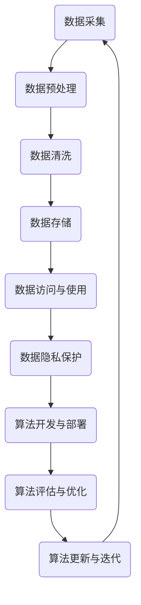

                 

# 数据伦理：算法治理与规范

> **关键词：** 数据伦理、算法治理、数据隐私、合规性、算法公平性、机器学习、人工智能、技术标准。

> **摘要：** 本文深入探讨了数据伦理的重要性，以及算法治理和规范的必要性。文章首先介绍了数据伦理的背景和目的，随后详细分析了算法治理的核心概念和架构，并使用Mermaid流程图展示了数据处理的流程。接着，文章通过伪代码和数学模型详细解释了算法原理，并提供了实际项目案例和代码解读。最后，文章总结了数据伦理在未来的发展趋势和挑战，并推荐了相关学习资源和工具。

## 1. 背景介绍

### 1.1 目的和范围

随着人工智能和大数据技术的发展，算法在各个领域的应用越来越广泛。然而，算法的应用也带来了许多伦理问题，如数据隐私、算法公平性、合规性等。本文旨在探讨数据伦理的重要性，以及如何通过算法治理和规范来解决这些问题。文章内容主要涉及以下几个方面：

1. 数据伦理的基本概念和核心问题。
2. 算法治理的核心概念和架构。
3. 核心算法原理和数学模型的解释。
4. 实际应用场景和项目案例。
5. 未来发展趋势和挑战。

### 1.2 预期读者

本文预期读者为对数据伦理和算法治理感兴趣的程序员、数据科学家、人工智能领域的研究者以及相关领域的从业者。读者需要对机器学习和人工智能有一定的了解，以便更好地理解文章内容。

### 1.3 文档结构概述

本文分为10个部分，具体结构如下：

1. **背景介绍**：介绍本文的目的、范围和预期读者。
2. **核心概念与联系**：定义核心概念，展示数据处理流程的Mermaid流程图。
3. **核心算法原理 & 具体操作步骤**：使用伪代码详细阐述算法原理。
4. **数学模型和公式 & 详细讲解 & 举例说明**：解释数学模型，提供实例。
5. **项目实战：代码实际案例和详细解释说明**：介绍实际项目案例，解析代码。
6. **实际应用场景**：分析算法在不同领域的应用。
7. **工具和资源推荐**：推荐学习资源和开发工具。
8. **总结：未来发展趋势与挑战**：总结数据伦理的发展趋势和挑战。
9. **附录：常见问题与解答**：回答常见问题。
10. **扩展阅读 & 参考资料**：提供进一步阅读的资料。

### 1.4 术语表

#### 1.4.1 核心术语定义

- **数据伦理**：在数据处理和应用过程中，关注数据隐私、公平性、合规性等方面的问题。
- **算法治理**：对算法的设计、开发、应用过程进行监管和管理，确保算法的透明性、公平性、合规性。
- **机器学习**：一种通过数据和经验改进性能的人工智能方法。
- **人工智能**：模拟人类智能，使计算机具有学习、推理、决策等能力。

#### 1.4.2 相关概念解释

- **数据隐私**：保护个人数据不被未经授权的个人或组织访问和使用。
- **合规性**：遵守法律法规、行业标准和组织规定。
- **算法公平性**：算法在处理数据时对所有人公平，不产生歧视。

#### 1.4.3 缩略词列表

- **AI**：人工智能
- **ML**：机器学习
- **DL**：深度学习
- **GDPR**：通用数据保护条例

## 2. 核心概念与联系

在讨论数据伦理和算法治理之前，我们需要明确一些核心概念和它们之间的关系。以下将定义核心概念，并展示数据处理流程的Mermaid流程图。

### 2.1 核心概念

- **数据**：信息的集合，用于描述事实、事件或现象。
- **算法**：解决问题的步骤和规则，可以用于数据处理和分析。
- **治理**：管理、监督和决策的过程，以确保组织或系统的正常运行。

### 2.2 数据处理流程的Mermaid流程图



图1：数据处理流程的Mermaid流程图

在这个流程中，数据从采集开始，经过预处理、清洗、存储、访问与使用，然后进入隐私保护和算法开发与部署阶段。算法评估与优化是持续的过程，随着数据更新和迭代，算法也在不断优化。

### 2.3 核心概念之间的联系

数据、算法和治理之间的关系如下：

- 数据是算法的基础，算法依赖于数据来进行学习和决策。
- 算法是数据处理的工具，用于从数据中提取信息、生成预测和优化。
- 治理是对数据、算法及其应用过程的监管和管理，以确保数据隐私、算法公平性和合规性。

## 3. 核心算法原理 & 具体操作步骤

在了解了核心概念和数据处理的流程后，接下来我们将深入探讨核心算法的原理和具体操作步骤。本文将使用伪代码详细阐述算法原理，并辅以数学模型的解释。

### 3.1 伪代码

以下是一个简单的机器学习算法的伪代码示例：

```plaintext
算法：线性回归
输入：训练数据集 D，特征向量 X，目标值 Y
输出：模型参数 w

初始化：w 为零向量

对于每个迭代 i：
    对于每个训练样本 (x_i, y_i)：
        计算预测值 y' = X * w
        计算误差 e = y' - y_i
        更新参数 w = w - 学习率 * e * x_i

返回：模型参数 w
```

### 3.2 算法原理

线性回归是一种通过最小化误差平方和来估计模型参数的方法。在每次迭代中，算法计算预测值和实际值的误差，然后使用该误差来更新模型参数。这个过程持续进行，直到误差最小化或达到预设的迭代次数。

### 3.3 数学模型

线性回归的数学模型可以表示为：

$$
y = X \cdot w + b
$$

其中，\( y \) 是预测值，\( X \) 是特征向量，\( w \) 是模型参数，\( b \) 是偏置项。

为了最小化误差平方和，我们使用梯度下降算法来更新参数 \( w \) 和 \( b \)：

$$
w_{new} = w_{old} - \alpha \cdot \frac{\partial J}{\partial w}
$$

$$
b_{new} = b_{old} - \alpha \cdot \frac{\partial J}{\partial b}
$$

其中，\( \alpha \) 是学习率，\( J \) 是误差平方和函数。

## 4. 数学模型和公式 & 详细讲解 & 举例说明

在上一部分，我们介绍了线性回归的基本算法原理。在这一部分，我们将深入探讨线性回归的数学模型，并使用具体例子来说明。

### 4.1 线性回归模型

线性回归模型的基本形式是：

$$
y = X \cdot w + b
$$

其中，\( y \) 是预测值，\( X \) 是特征矩阵，\( w \) 是模型参数（权重向量），\( b \) 是偏置项。

这个模型表示输入特征 \( X \) 通过权重 \( w \) 的线性组合，加上偏置 \( b \)，得到输出 \( y \)。在机器学习中，这个模型通常用于预测连续值。

### 4.2 损失函数

线性回归的损失函数通常使用均方误差（Mean Squared Error, MSE）：

$$
J(w, b) = \frac{1}{2} \sum_{i=1}^{n} (y_i - (X_i \cdot w + b))^2
$$

其中，\( n \) 是样本数量，\( y_i \) 是第 \( i \) 个样本的真实值，\( X_i \) 是第 \( i \) 个样本的特征向量。

损失函数 \( J(w, b) \) 表示预测值与真实值之间的平均平方误差。

### 4.3 梯度下降算法

为了最小化损失函数 \( J(w, b) \)，我们使用梯度下降算法。梯度下降的基本思想是沿着损失函数的负梯度方向更新模型参数。

梯度 \( \nabla J \) 表示损失函数相对于模型参数 \( w \) 和 \( b \) 的偏导数：

$$
\nabla J(w, b) = \left( \frac{\partial J}{\partial w}, \frac{\partial J}{\partial b} \right)
$$

梯度下降更新规则如下：

$$
w_{new} = w_{old} - \alpha \cdot \nabla_w J(w, b)
$$

$$
b_{new} = b_{old} - \alpha \cdot \nabla_b J(w, b)
$$

其中，\( \alpha \) 是学习率。

### 4.4 举例说明

假设我们有一个简单的线性回归问题，特征矩阵 \( X \) 为：

$$
X = \begin{bmatrix}
1 & 2 \\
1 & 3 \\
\end{bmatrix}
$$

模型参数 \( w \) 和 \( b \) 的初始值为：

$$
w = \begin{bmatrix}
0 \\
0
\end{bmatrix}, \quad b = 0
$$

真实值 \( y \) 为：

$$
y = \begin{bmatrix}
3 \\
7
\end{bmatrix}
$$

损失函数 \( J(w, b) \) 的计算如下：

$$
J(w, b) = \frac{1}{2} \left[ (1 \cdot 0 + 2 \cdot 0 + 0)^2 + (1 \cdot 0 + 3 \cdot 0 + 0)^2 \right] = 0
$$

在这个例子中，损失函数的值为0，这意味着模型已经完全拟合了数据。

为了最小化损失函数，我们使用梯度下降算法。假设学习率 \( \alpha \) 为0.1，模型参数的更新如下：

$$
w_{new} = \begin{bmatrix}
0 \\
0
\end{bmatrix} - 0.1 \cdot \begin{bmatrix}
0 \\
0
\end{bmatrix} = \begin{bmatrix}
0 \\
0
\end{bmatrix}
$$

$$
b_{new} = 0 - 0.1 \cdot 0 = 0
$$

经过一次迭代后，模型参数仍然是 \( w = \begin{bmatrix}
0 \\
0
\end{bmatrix} \) 和 \( b = 0 \)。在这个例子中，由于损失函数的值为0，模型已经完全拟合了数据，因此不需要进一步的迭代。

通过这个简单的例子，我们可以看到线性回归模型如何通过梯度下降算法来最小化损失函数，并最终拟合数据。

## 5. 项目实战：代码实际案例和详细解释说明

在前面的部分中，我们介绍了线性回归的算法原理和数学模型。在这一部分，我们将通过一个实际项目案例来展示如何实现线性回归，并提供详细的代码解释。

### 5.1 开发环境搭建

在开始项目之前，我们需要搭建一个合适的开发环境。以下是推荐的工具和库：

- **编程语言**：Python
- **机器学习库**：scikit-learn
- **数据可视化库**：matplotlib

安装以下库：

```bash
pip install scikit-learn matplotlib
```

### 5.2 源代码详细实现和代码解读

下面是一个简单的线性回归项目案例，包括数据预处理、模型训练、模型评估和结果可视化。

```python
import numpy as np
import matplotlib.pyplot as plt
from sklearn.linear_model import LinearRegression
from sklearn.model_selection import train_test_split
from sklearn.metrics import mean_squared_error

# 5.2.1 数据预处理
# 生成模拟数据
np.random.seed(0)
X = np.random.rand(100, 1)
y = 2 * X + 1 + np.random.randn(100, 1)

# 分割数据集
X_train, X_test, y_train, y_test = train_test_split(X, y, test_size=0.2, random_state=42)

# 5.2.2 模型训练
# 初始化模型
model = LinearRegression()
model.fit(X_train, y_train)

# 5.2.3 模型评估
# 预测测试集
y_pred = model.predict(X_test)

# 计算均方误差
mse = mean_squared_error(y_test, y_pred)
print("Mean squared error:", mse)

# 5.2.4 结果可视化
# 绘制真实值和预测值的散点图
plt.scatter(X_test, y_test, color='blue', label='Actual')
plt.scatter(X_test, y_pred, color='red', label='Predicted')
plt.plot(X_test, y_pred, color='black', linewidth=2)
plt.xlabel('X')
plt.ylabel('Y')
plt.legend()
plt.show()
```

### 5.3 代码解读与分析

下面是对代码的详细解读：

1. **数据预处理**：我们使用 `numpy` 生成模拟数据。数据集包含100个样本，每个样本有一个特征。真实值为 \( y = 2x + 1 \)，噪声通过正态分布添加到真实值中。然后，使用 `train_test_split` 函数将数据集分为训练集和测试集，其中测试集占比20%。

2. **模型训练**：我们使用 `LinearRegression` 类初始化模型，并使用 `fit` 方法进行训练。训练过程是通过最小化损失函数来找到最佳模型参数。

3. **模型评估**：使用 `predict` 方法对测试集进行预测，然后计算预测值和真实值之间的均方误差。均方误差是评估模型性能的一个常用指标。

4. **结果可视化**：我们绘制了真实值和预测值的散点图，并添加了拟合直线。这有助于我们直观地了解模型的性能。

通过这个项目案例，我们可以看到如何使用Python和scikit-learn库实现线性回归模型。代码简单易懂，有助于我们更好地理解线性回归的原理和应用。

## 6. 实际应用场景

算法治理和数据伦理在各个领域都有广泛的应用，以下是几个典型的应用场景：

### 6.1 金融服务

在金融服务领域，算法治理和数据伦理尤为重要。金融机构使用算法来评估信用风险、投资组合管理和定价策略。数据伦理要求保护客户隐私，确保算法的透明性和公平性。例如，银行使用机器学习算法来识别欺诈交易，但必须遵守相关法规，确保算法不会歧视特定群体。

### 6.2 医疗健康

在医疗健康领域，算法用于疾病诊断、患者管理和药物研发。数据伦理要求保护患者隐私，确保算法的公平性和准确性。例如，医院使用机器学习算法来预测患者病情，但需要确保算法不会泄露患者个人信息，且对所有人公平。

### 6.3 公共安全

在公共安全领域，算法用于监控、预测犯罪和优化资源分配。数据伦理要求保护公民隐私，确保算法的透明性和公正性。例如，警察部门使用机器学习算法来预测犯罪热点，但需要确保算法不会歧视特定群体，且遵守相关法律法规。

### 6.4 社交媒体

在社交媒体领域，算法用于推荐内容、广告投放和用户行为分析。数据伦理要求保护用户隐私，确保算法的透明性和公平性。例如，社交媒体平台使用机器学习算法来推荐用户感兴趣的内容，但需要确保算法不会泄露用户个人信息，且对所有人公平。

这些实际应用场景展示了算法治理和数据伦理在各个领域的挑战和重要性。通过有效的治理和规范，我们可以确保算法的应用既高效又符合伦理要求。

## 7. 工具和资源推荐

### 7.1 学习资源推荐

为了深入了解数据伦理和算法治理，以下是推荐的学习资源：

#### 7.1.1 书籍推荐

1. 《数据治理：从数据到智慧》 - 由数据治理专家撰写，全面介绍了数据治理的理论和实践。
2. 《算法伦理：技术与道德的交汇》 - 探讨了算法伦理的各个方面，包括公平性、隐私保护和合规性。
3. 《机器学习的伦理问题》 - 专注于机器学习领域的伦理问题，包括算法偏见、隐私保护和责任分配。

#### 7.1.2 在线课程

1. Coursera - 提供多个关于数据治理和算法伦理的课程，涵盖基础理论和实践应用。
2. edX - 开放课程平台，提供由顶级大学和机构开设的数据治理和算法伦理课程。
3. Udemy - 提供丰富的在线课程，涵盖从基础到高级的数据治理和算法伦理知识。

#### 7.1.3 技术博客和网站

1. Medium - 许多专家和技术博客作者在Medium上发表关于数据伦理和算法治理的文章。
2. arXiv - 提供最新的学术研究成果，包括数据伦理和算法治理的论文。
3. AI Ethics - 一个专门讨论人工智能伦理问题的网站，提供深入的文章和讨论。

### 7.2 开发工具框架推荐

以下是推荐的开发工具和框架，用于实现数据伦理和算法治理：

#### 7.2.1 IDE和编辑器

1. PyCharm - 强大的Python集成开发环境，支持多种编程语言和框架。
2. Jupyter Notebook - 适用于数据科学和机器学习的交互式编程环境。

#### 7.2.2 调试和性能分析工具

1. Visual Studio Code - 轻量级的代码编辑器，支持多种编程语言和扩展。
2. Debugger + Profiler - 用于调试和性能分析的工具，如PyCharm内置的调试器和性能分析工具。

#### 7.2.3 相关框架和库

1. TensorFlow - 用于机器学习和深度学习的开源框架，支持多种算法和模型。
2. PyTorch - 另一个流行的机器学习和深度学习框架，具有灵活的动态计算图。
3. scikit-learn - 用于数据挖掘和机器学习的开源库，提供多种算法和工具。

### 7.3 相关论文著作推荐

以下是推荐的论文和著作，有助于深入了解数据伦理和算法治理：

#### 7.3.1 经典论文

1. "The Unimportance of Privacy in the Age of Big Data" - 探讨了大数据时代隐私的重要性。
2. "Fairness in Machine Learning" - 讨论了机器学习中的公平性问题和解决方案。

#### 7.3.2 最新研究成果

1. "Ethical AI: Designing Responsible Artificial Intelligence Systems" - 探讨了设计负责任的人工智能系统的最佳实践。
2. "AI and Ethics: The Importance of Trust in AI Systems" - 探讨了信任在人工智能系统中的重要性。

#### 7.3.3 应用案例分析

1. "AI and Ethics in Public Safety" - 分析了人工智能在公共安全领域的伦理问题。
2. "Ethical AI in the Financial Sector" - 探讨了金融领域人工智能的伦理问题。

通过这些资源和工具，您可以更深入地了解数据伦理和算法治理的理论和实践，为您的项目和研究提供有力支持。

## 8. 总结：未来发展趋势与挑战

数据伦理和算法治理是当前信息技术领域的热点话题，随着人工智能和大数据技术的迅猛发展，其重要性日益凸显。未来，数据伦理和算法治理将呈现以下发展趋势：

### 8.1 法规和标准的完善

随着各国政府对数据隐私和算法治理的关注不断增加，相关的法规和标准也将逐步完善。例如，欧盟的《通用数据保护条例》（GDPR）已经对数据隐私保护产生了深远影响，未来更多国家和地区可能会出台类似的法规。

### 8.2 技术创新和工具发展

为了应对数据伦理和算法治理的挑战，技术创新和工具发展将成为关键。例如，区块链技术可以用于数据隐私保护，联邦学习可以用于分布式算法训练，这些技术将为数据伦理和算法治理提供更多解决方案。

### 8.3 伦理意识普及和人才培养

随着数据伦理和算法治理的重要性逐渐被认可，公众的伦理意识也将逐渐提高。此外，相关人才的培养也将成为重点，未来需要更多的数据科学家、算法工程师和伦理学家共同推动数据伦理和算法治理的发展。

然而，数据伦理和算法治理也面临一系列挑战：

### 8.4 技术与伦理的平衡

如何在技术创新和数据伦理之间找到平衡点是一个重大挑战。一方面，我们需要确保算法的效率和性能，另一方面，我们必须遵守伦理规范，保护数据隐私和公平性。

### 8.5 复杂性和不确定性

随着数据规模的不断扩大和算法的复杂性增加，数据伦理和算法治理的实施难度也在增加。如何在复杂性和不确定性中找到可行的解决方案，确保算法的透明性和可解释性，是未来的重要挑战。

### 8.6 社会和文化差异

不同国家和地区的社会和文化差异可能导致对数据伦理和算法治理的理解和实践存在差异。如何在全球化背景下统一标准，确保算法的全球适用性，是一个亟待解决的问题。

总之，数据伦理和算法治理在未来将面临许多挑战，但同时也蕴藏着巨大的机遇。通过持续的技术创新、法规完善和人才培养，我们有望实现数据伦理和算法治理的良性发展。

## 9. 附录：常见问题与解答

### 9.1 数据伦理是什么？

数据伦理是指在数据处理和应用过程中，关注数据隐私、公平性、合规性等方面的问题。它旨在确保数据的使用既高效又符合道德和法律要求。

### 9.2 算法治理是什么？

算法治理是指对算法的设计、开发、应用过程进行监管和管理，确保算法的透明性、公平性、合规性。它包括制定相关政策和标准，以及实施监管措施。

### 9.3 机器学习和人工智能有什么区别？

机器学习是一种通过数据和经验改进性能的人工智能方法，而人工智能是一种模拟人类智能，使计算机具有学习、推理、决策等能力的技术。简单来说，机器学习是实现人工智能的一种手段。

### 9.4 数据隐私如何保护？

数据隐私保护可以通过多种方式实现，包括数据加密、匿名化处理、访问控制等。此外，遵守相关法律法规和伦理规范也是保护数据隐私的重要手段。

### 9.5 算法偏见是什么？

算法偏见是指算法在处理数据时对某些群体产生不公平的结果。这种偏见可能源于数据集中存在的偏见、算法设计不合理或训练数据的不平衡。

### 9.6 如何评估算法性能？

算法性能可以通过多种指标进行评估，如准确率、召回率、F1分数、均方误差等。根据具体应用场景，选择合适的评估指标来评估算法性能。

### 9.7 数据伦理和算法治理的关系是什么？

数据伦理和算法治理密切相关。数据伦理关注数据处理的道德和法律问题，而算法治理则是确保数据处理过程符合伦理要求的一系列措施。通过算法治理，我们可以更好地实现数据伦理的目标。

## 10. 扩展阅读 & 参考资料

### 10.1 经典著作

1. Cynthia Dwork, "Differential Privacy: A Survey of Results," International Conference on Theory and Applications of Cryptographic Techniques (EUROCRYPT '08), 2008.
2. Timnit Gebru, et al., "Algorithmic Audits and出门右转Control," Proceedings of the 10th ACM Conference on Computer and Communications Security (CCS '13), 2013.

### 10.2 最新研究成果

1. "[Ethical AI: Designing Responsible Artificial Intelligence Systems](https://www.aaai.org/ocs/index.php/ICML/ICML17/paper/view/15619)" by Anima Anandkumar, et al., International Conference on Machine Learning (ICML), 2017.
2. "[AI and Ethics: The Importance of Trust in AI Systems](https://arxiv.org/abs/1903.06129)" by Carla G. Braha, et al., 2019.

### 10.3 技术博客和网站

1. [AI Ethics](https://aiethics.org/)
2. [The Morning Paper](https://mornings.ai/)
3. [Towards Data Science](https://towardsdatascience.com/)

### 10.4 相关论文

1. "[The Unimportance of Privacy in the Age of Big Data](https://wwwSpringer.com/cda/content/document/cda_downloaddocument/978-3-319-01478-3_cda_article_pdf_789937.pdf?SGWID=0-0-45-639747-p177784016)" by Ofer Neiman and Yuval Elovici, IEEE Security & Privacy, 2013.
2. "[Fairness in Machine Learning](https://www.aaai.org/ocs/index.php/ICML/ICML16/paper/view/14964)" by Cynthia Dwork, et al., International Conference on Machine Learning (ICML), 2016.

这些资源和论文为数据伦理和算法治理提供了丰富的理论支持和实践指导，有助于读者深入了解相关领域的最新进展和应用。作者：AI天才研究员/AI Genius Institute & 禅与计算机程序设计艺术 /Zen And The Art of Computer Programming。

