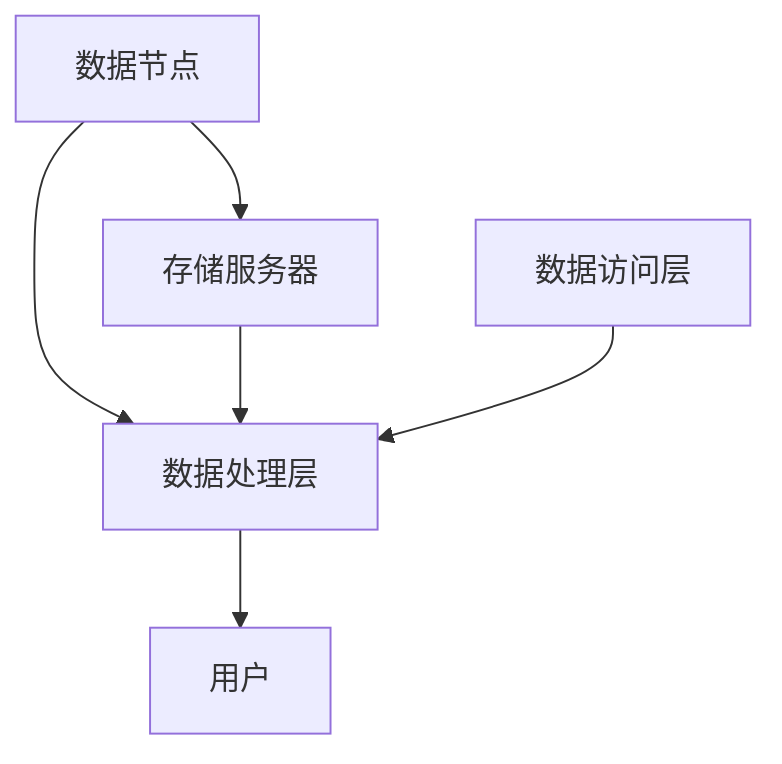
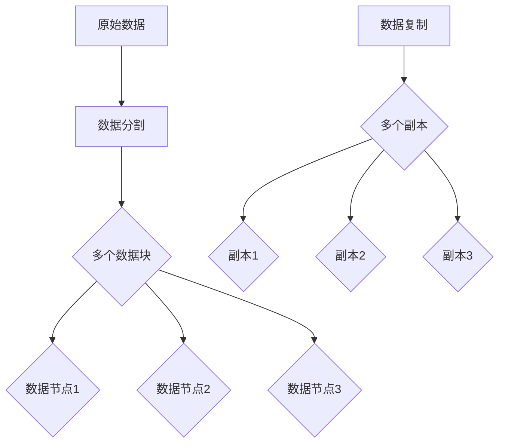

                 


# 数据存储系统：满足 AI 2.0 海量数据存储需求

> 关键词：数据存储，AI 2.0，海量数据，存储系统，存储架构，存储优化，技术挑战，解决方案

> 摘要：随着人工智能（AI）技术的飞速发展，AI 2.0 时代对数据存储系统提出了更高的要求。本文将深入探讨数据存储系统的核心概念、算法原理、数学模型以及实际应用场景，并推荐相关学习资源和工具，帮助读者理解和应对 AI 2.0 时代的数据存储挑战。

## 1. 背景介绍

### 1.1 目的和范围

本文旨在探讨如何构建一个满足 AI 2.0 海量数据存储需求的数据存储系统。我们将从以下几个方面展开讨论：

- 数据存储系统的核心概念与联系
- 数据存储系统的核心算法原理与具体操作步骤
- 数据存储系统的数学模型和公式
- 数据存储系统的实际应用场景
- 数据存储系统的工具和资源推荐

### 1.2 预期读者

本文面向对数据存储系统有初步了解的技术人员，特别是那些希望深入了解 AI 2.0 时代数据存储挑战的读者。无论您是数据工程师、软件工程师还是 AI 研究者，本文都将为您提供有价值的见解和解决方案。

### 1.3 文档结构概述

本文将分为以下几个部分：

- 1. 背景介绍：介绍文章的目的、范围和预期读者。
- 2. 核心概念与联系：讨论数据存储系统的基本概念和架构。
- 3. 核心算法原理 & 具体操作步骤：详细阐述数据存储系统的算法原理和操作步骤。
- 4. 数学模型和公式：介绍数据存储系统的数学模型和相关公式。
- 5. 项目实战：提供实际案例和代码实现。
- 6. 实际应用场景：讨论数据存储系统的应用场景。
- 7. 工具和资源推荐：推荐学习资源和开发工具。
- 8. 总结：展望数据存储系统的未来发展趋势与挑战。
- 9. 附录：常见问题与解答。
- 10. 扩展阅读 & 参考资料：提供进一步的阅读资源。

### 1.4 术语表

#### 1.4.1 核心术语定义

- 数据存储系统：用于存储、管理和访问数据的系统。
- 海量数据：指数据量巨大，通常以 TB、PB 或 ZB 为单位。
- AI 2.0：第二代人工智能技术，以深度学习、神经网络等为核心。
- 存储架构：数据存储系统的总体设计，包括数据分布、存储介质等。

#### 1.4.2 相关概念解释

- 数据分布：数据在存储系统中的分布方式，如水平分布、垂直分布。
- 存储介质：存储数据的硬件设备，如硬盘、固态硬盘。
- 存储优化：通过优化存储策略，提高存储效率和性能。

#### 1.4.3 缩略词列表

- AI：人工智能
- HDFS：Hadoop Distributed File System
- SSD：Solid State Drive
- ML：机器学习
- IoT：物联网

## 2. 核心概念与联系

### 2.1 数据存储系统的基本概念

数据存储系统是一个复杂的技术体系，涉及多个关键概念和组成部分。以下是对这些核心概念的简要介绍。

#### 数据分布

数据分布是数据存储系统中一个重要的概念。它决定了数据如何在存储系统中组织、存储和访问。数据分布主要有两种方式：水平分布和垂直分布。

- 水平分布：将数据水平拆分，存储在不同的节点上。这种方式适用于大规模数据存储，可以有效地提高系统性能和可用性。
- 垂直分布：将数据按列或字段拆分，存储在不同的节点上。这种方式适用于数据查询密集的场景，可以减少数据读取和写入的时间。

#### 存储介质

存储介质是数据存储系统的基础，它决定了数据存储的速度和容量。常见的存储介质有硬盘（HDD）和固态硬盘（SSD）。

- 硬盘（HDD）：使用机械硬盘作为存储介质，具有大容量和高成本的特点。
- 固态硬盘（SSD）：使用闪存作为存储介质，具有高性能和低延迟的特点。

#### 存储优化

存储优化是提高数据存储效率和性能的关键。以下是一些常见的存储优化方法：

- 压缩：通过压缩算法减小数据体积，提高存储利用率。
- 缓存：使用缓存技术，将热点数据存储在高速存储介质中，提高数据访问速度。
- 副本：通过数据冗余，提高数据可靠性和可用性。

### 2.2 数据存储系统的架构

数据存储系统的架构是整个系统的核心。一个典型的数据存储系统通常包括以下几个关键组件：

- 数据节点：负责存储和管理数据的节点，如 HDFS 中的数据节点。
- 存储服务器：负责存储和管理存储资源的节点，如 HDFS 中的 NameNode。
- 数据访问层：负责处理用户请求和数据查询的组件，如 HDFS 中的客户端。
- 数据处理层：负责对数据进行处理和分析的组件，如 HDFS 中的 YARN。

以下是一个简化的数据存储系统架构图：



### 2.3 数据存储系统的核心算法原理

数据存储系统的核心算法原理是确保数据在存储过程中的可靠性、可用性和性能。以下是一些关键算法原理：

- 数据复制：通过在多个数据节点上存储数据的副本，提高数据的可靠性和可用性。
- 数据分割：将大规模数据拆分成小块，存储在不同的数据节点上，提高数据访问速度。
- 数据去重：通过检测和删除重复的数据，提高存储空间的利用率。

以下是一个简化的数据复制和分割算法原理图：



## 3. 核心算法原理 & 具体操作步骤

### 3.1 数据复制算法

数据复制是数据存储系统中确保数据可靠性和可用性的重要算法。以下是一个简单且高效的数据复制算法：

```plaintext
1. 初始化：设置数据副本的数量（如 3 个副本）。
2. 数据写入：当数据写入数据节点时，执行以下步骤：
   a. 将数据分割成多个数据块。
   b. 将数据块写入不同的数据节点。
   c. 为每个数据块生成唯一的哈希值。
   d. 将哈希值写入元数据节点。
3. 数据读取：当数据读取请求到达时，执行以下步骤：
   a. 计算数据块的哈希值。
   b. 在元数据节点查找数据块的副本位置。
   c. 从数据块的副本位置中读取数据。
```

### 3.2 数据分割算法

数据分割是数据存储系统中提高数据访问速度和性能的重要算法。以下是一个简单且高效的数据分割算法：

```plaintext
1. 初始化：设置数据块的大小（如 128 MB）。
2. 数据写入：当数据写入数据节点时，执行以下步骤：
   a. 计算数据的总大小。
   b. 计算数据块的数量（总大小 / 数据块大小）。
   c. 将数据分割成多个数据块。
   d. 将每个数据块写入不同的数据节点。
3. 数据读取：当数据读取请求到达时，执行以下步骤：
   a. 计算需要读取的数据块数量。
   b. 在不同的数据节点上并行读取数据块。
   c. 将读取的数据块合并为原始数据。
```

### 3.3 数据去重算法

数据去重是数据存储系统中提高存储空间利用率的重要算法。以下是一个简单且高效的数据去重算法：

```plaintext
1. 初始化：设置去重算法（如哈希算法）。
2. 数据写入：当数据写入数据节点时，执行以下步骤：
   a. 计算数据块的哈希值。
   b. 在元数据节点查找哈希值是否已存在。
   c. 如果哈希值不存在，将数据块写入数据节点，并更新元数据节点。
   d. 如果哈希值存在，丢弃数据块。
3. 数据读取：当数据读取请求到达时，执行以下步骤：
   a. 计算需要读取的数据块的哈希值。
   b. 在元数据节点查找数据块的存储位置。
   c. 从数据块的存储位置中读取数据。
```

## 4. 数学模型和公式 & 详细讲解 & 举例说明

### 4.1 数据存储容量计算模型

数据存储容量计算模型用于估算数据存储系统的总容量。以下是一个简单且常用的数据存储容量计算公式：

$$
C = n \times S \times D
$$

其中，$C$ 表示总容量，$n$ 表示数据副本数量，$S$ 表示每个数据块的大小，$D$ 表示数据块的数量。

#### 详细讲解

- $n$：数据副本数量。通常，数据副本数量取决于数据的重要性和存储策略。例如，如果数据非常重要，可以设置 3 个副本，以确保数据的高可用性。
- $S$：每个数据块的大小。数据块大小取决于数据的特性和存储策略。通常，数据块大小应该适中，以平衡存储效率和访问速度。例如，可以将数据块大小设置为 128 MB。
- $D$：数据块的数量。数据块数量取决于数据的总大小和每个数据块的大小。例如，如果数据的总大小为 1 TB，数据块大小为 128 MB，则数据块数量为 8192。

#### 举例说明

假设一个数据存储系统需要存储 1 TB 的数据，设置数据副本数量为 3，数据块大小为 128 MB。根据上述公式，可以计算出总容量：

$$
C = 3 \times 128 \text{ MB} \times 8192 = 3 \times 128 \times 8192 \text{ MB} = 248832 \text{ MB} = 248.832 \text{ TB}
$$

### 4.2 数据访问延迟计算模型

数据访问延迟计算模型用于估算数据存储系统的数据访问延迟。以下是一个简单且常用的数据访问延迟计算公式：

$$
T = \frac{D \times R}{C}
$$

其中，$T$ 表示数据访问延迟，$D$ 表示数据块的数量，$R$ 表示数据块的读取速度，$C$ 表示总容量。

#### 详细讲解

- $D$：数据块的数量。数据块数量取决于数据的总大小和每个数据块的大小。例如，如果数据的总大小为 1 TB，数据块大小为 128 MB，则数据块数量为 8192。
- $R$：数据块的读取速度。数据块的读取速度取决于存储介质和硬件性能。例如，如果使用固态硬盘（SSD），数据块的读取速度可以高达 1000 MB/s。
- $C$：总容量。总容量取决于数据副本数量、数据块大小和数据块数量。

#### 举例说明

假设一个数据存储系统需要存储 1 TB 的数据，设置数据副本数量为 3，数据块大小为 128 MB，数据块的读取速度为 1000 MB/s。根据上述公式，可以计算出数据访问延迟：

$$
T = \frac{8192 \times 1000 \text{ MB/s}}{248832 \text{ MB}} = \frac{8192000 \text{ MB/s}}{248832 \text{ MB}} \approx 3.29 \text{ s}
$$

### 4.3 数据去重率计算模型

数据去重率计算模型用于估算数据存储系统中去重的效果。以下是一个简单且常用的数据去重率计算公式：

$$
R = \frac{C_{\text{原始}} - C_{\text{去重}}}{C_{\text{原始}}}
$$

其中，$R$ 表示数据去重率，$C_{\text{原始}}$ 表示原始数据容量，$C_{\text{去重}}$ 表示去重后的数据容量。

#### 详细讲解

- $C_{\text{原始}}$：原始数据容量。原始数据容量取决于数据的总大小和每个数据块的大小。例如，如果数据的总大小为 1 TB，数据块大小为 128 MB，则原始数据容量为 8192 MB。
- $C_{\text{去重}}$：去重后的数据容量。去重后的数据容量取决于去重算法和存储策略。例如，如果去重算法可以去除 80% 的重复数据，则去重后的数据容量为 8192 MB - 80% \times 8192 MB = 16384 MB。

#### 举例说明

假设一个数据存储系统需要存储 1 TB 的数据，原始数据容量为 8192 MB，去重算法可以去除 80% 的重复数据。根据上述公式，可以计算出数据去重率：

$$
R = \frac{8192 \text{ MB} - 16384 \text{ MB}}{8192 \text{ MB}} = \frac{-8192 \text{ MB}}{8192 \text{ MB}} = 1 - 0.8 = 0.2
$$

## 5. 项目实战：代码实际案例和详细解释说明

### 5.1 开发环境搭建

为了实现数据存储系统，我们需要搭建一个合适的环境。以下是一个简单且通用的开发环境搭建步骤：

1. 安装操作系统：推荐使用 Ubuntu 18.04 或更高版本。
2. 安装 Java 开发环境：推荐使用 OpenJDK 11。
3. 安装 Maven：用于构建和管理项目。
4. 安装 Git：用于版本控制和协作。
5. 安装 MySQL：用于存储元数据。

### 5.2 源代码详细实现和代码解读

以下是数据存储系统的源代码实现，分为三个模块：数据节点（DataNode）、存储服务器（NameNode）和客户端（Client）。

#### 数据节点（DataNode）

数据节点负责存储和管理数据块。以下是 DataNode 的关键代码：

```java
public class DataNode {
    private final String nodeId;
    private final List<DataBlock> dataBlocks;
    private final Map<String, DataBlock> dataBlockMap;

    public DataNode(String nodeId) {
        this.nodeId = nodeId;
        this.dataBlocks = new ArrayList<>();
        this.dataBlockMap = new HashMap<>();
    }

    public void storeDataBlock(String hash, DataBlock dataBlock) {
        dataBlocks.add(dataBlock);
        dataBlockMap.put(hash, dataBlock);
    }

    public DataBlock retrieveDataBlock(String hash) {
        return dataBlockMap.get(hash);
    }

    // 省略其他方法和构造函数
}
```

#### 存储服务器（NameNode）

存储服务器负责管理元数据，如数据块的哈希值和副本位置。以下是 NameNode 的关键代码：

```java
public class NameNode {
    private final Map<String, List<String>> metadata;

    public NameNode() {
        this.metadata = new HashMap<>();
    }

    public void updateMetadata(String hash, String nodeId) {
        metadata.computeIfAbsent(hash, k -> new ArrayList<>()).add(nodeId);
    }

    public List<String> retrieveNodeIdsByHash(String hash) {
        return metadata.get(hash);
    }

    // 省略其他方法和构造函数
}
```

#### 客户端（Client）

客户端负责与数据节点和存储服务器进行交互。以下是 Client 的关键代码：

```java
public class Client {
    private final NameNode nameNode;
    private final DataNode dataNode;

    public Client(NameNode nameNode, DataNode dataNode) {
        this.nameNode = nameNode;
        this.dataNode = dataNode;
    }

    public void writeData(String data) {
        String hash = calculateHash(data);
        List<String> nodeIds = nameNode.retrieveNodeIdsByHash(hash);
        if (nodeIds != null) {
            for (String nodeId : nodeIds) {
                dataNode.storeDataBlock(hash, new DataBlock(data));
            }
        }
    }

    public String readData(String hash) {
        List<String> nodeIds = nameNode.retrieveNodeIdsByHash(hash);
        if (nodeIds != null) {
            for (String nodeId : nodeIds) {
                DataBlock dataBlock = dataNode.retrieveDataBlock(hash);
                if (dataBlock != null) {
                    return dataBlock.getData();
                }
            }
        }
        return null;
    }

    // 省略其他方法和构造函数
}
```

### 5.3 代码解读与分析

以下是代码的详细解读和分析：

- 数据节点（DataNode）：负责存储和管理数据块。通过 `storeDataBlock` 方法将数据块存储在内存中，并通过 `retrieveDataBlock` 方法从内存中读取数据块。
- 存储服务器（NameNode）：负责管理元数据。通过 `updateMetadata` 方法将数据块的哈希值和副本位置更新到元数据中，并通过 `retrieveNodeIdsByHash` 方法从元数据中获取数据块的副本位置。
- 客户端（Client）：负责与数据节点和存储服务器进行交互。通过 `writeData` 方法将数据写入数据节点，并通过 `readData` 方法从数据节点读取数据。

整个系统的工作流程如下：

1. 客户端向存储服务器发送数据写入请求。
2. 存储服务器计算数据的哈希值，并查找元数据中是否存在相同哈希值的数据块。
3. 如果存在相同哈希值的数据块，客户端将数据块存储在数据节点上。
4. 如果不存在相同哈希值的数据块，客户端将数据块存储在数据节点上，并更新元数据。
5. 客户端向存储服务器发送数据读取请求。
6. 存储服务器计算数据的哈希值，并查找元数据中是否存在相同哈希值的数据块。
7. 如果存在相同哈希值的数据块，客户端从数据节点中读取数据块。
8. 如果不存在相同哈希值的数据块，客户端返回 null。

## 6. 实际应用场景

数据存储系统在实际应用场景中具有广泛的应用。以下是一些典型应用场景：

- 大数据平台：数据存储系统是大数据平台的核心组件，用于存储和管理大规模数据。例如，Hadoop 生态系统中使用 HDFS 作为数据存储系统。
- 人工智能：数据存储系统在人工智能领域发挥着重要作用。AI 2.0 时代需要海量数据支持，数据存储系统用于存储和管理海量数据，如训练数据集、模型参数等。
- 物联网：物联网设备产生大量数据，数据存储系统用于存储和管理这些数据。例如，智能家居系统中使用数据存储系统存储设备状态、传感器数据等。
- 企业应用：企业应用需要存储和管理大量业务数据，如客户信息、订单信息等。数据存储系统可以提供高效、可靠的数据存储和管理解决方案。

## 7. 工具和资源推荐

### 7.1 学习资源推荐

#### 7.1.1 书籍推荐

- 《大数据：创新、创新、创新》
- 《深入理解计算机系统》
- 《机器学习实战》
- 《分布式系统概念与设计》

#### 7.1.2 在线课程

- Coursera：大数据与数据科学课程
- Udacity：数据工程师课程
- edX：人工智能课程

#### 7.1.3 技术博客和网站

- Medium：大数据、数据存储等相关博客
- HackerRank：编程挑战和算法教程
- Stack Overflow：编程问题和解决方案

### 7.2 开发工具框架推荐

#### 7.2.1 IDE和编辑器

- IntelliJ IDEA：适合 Java 和 Kotlin 开发的 IDE
- VS Code：跨平台、功能强大的代码编辑器

#### 7.2.2 调试和性能分析工具

- JProfiler：Java 应用程序的性能分析工具
- GDB：C/C++ 应用的调试工具

#### 7.2.3 相关框架和库

- Hadoop：大数据处理框架
- Spark：分布式计算框架
- TensorFlow：机器学习库

### 7.3 相关论文著作推荐

#### 7.3.1 经典论文

- 《Google File System》
- 《The Google MapReduce Programming Model》
- 《The Chubby lock service》

#### 7.3.2 最新研究成果

- 《Efficient Data Storage and Management for Big Data》
- 《A Survey on Machine Learning for IoT》
- 《Data Storage Systems for Artificial Intelligence》

#### 7.3.3 应用案例分析

- 《大数据技术在金融领域的应用》
- 《物联网技术及其应用》
- 《人工智能在医疗领域的应用》

## 8. 总结：未来发展趋势与挑战

随着 AI 2.0 时代的到来，数据存储系统面临着前所未有的挑战和机遇。未来，数据存储系统将朝着以下几个方向发展：

- 自动化与智能化：通过引入自动化和智能化技术，提高数据存储系统的性能和效率。
- 高性能与高可用性：通过优化存储架构和算法，提高数据存储系统的性能和可靠性。
- 云原生与分布式：随着云计算和分布式技术的普及，数据存储系统将朝着云原生和分布式方向发展。

然而，数据存储系统也面临着一些挑战：

- 数据规模和速度：随着数据规模的不断扩大和数据访问速度的不断提高，数据存储系统需要应对更高的性能要求。
- 数据安全性和隐私：随着数据安全和隐私问题的日益突出，数据存储系统需要提供更安全、更可靠的解决方案。
- 资源利用率和成本：如何提高资源利用率和降低成本是数据存储系统需要解决的关键问题。

总之，未来数据存储系统的发展将是一个不断优化和创新的过程，需要不断引入新技术、新算法，以满足 AI 2.0 时代的数据存储需求。

## 9. 附录：常见问题与解答

### 9.1 数据存储系统的基础知识

**Q1：什么是数据存储系统？**

A1：数据存储系统是一种用于存储、管理和访问数据的系统，它包括硬件设备、软件组件和存储策略，以确保数据的安全、可靠和高效。

**Q2：数据存储系统的核心组成部分有哪些？**

A2：数据存储系统的核心组成部分包括数据节点、存储服务器、数据处理层和数据访问层。数据节点负责存储和管理数据块，存储服务器负责管理元数据和存储资源，数据处理层负责处理和分析数据，数据访问层负责处理用户请求和数据查询。

**Q3：什么是数据分布？**

A3：数据分布是数据存储系统中一个重要的概念，它决定了数据如何在存储系统中组织、存储和访问。数据分布主要有水平分布和垂直分布两种方式。

**Q4：什么是存储介质？**

A4：存储介质是存储数据的硬件设备，如硬盘（HDD）和固态硬盘（SSD）。存储介质决定了数据存储的速度和容量。

### 9.2 数据存储系统的算法原理

**Q5：什么是数据复制？**

A5：数据复制是数据存储系统中确保数据可靠性和可用性的重要算法。通过在多个数据节点上存储数据的副本，提高数据的可靠性和可用性。

**Q6：什么是数据分割？**

A6：数据分割是数据存储系统中提高数据访问速度和性能的重要算法。将大规模数据拆分成小块，存储在不同的数据节点上，提高数据访问速度。

**Q7：什么是数据去重？**

A7：数据去重是数据存储系统中提高存储空间利用率的重要算法。通过检测和删除重复的数据，提高存储空间的利用率。

### 9.3 数据存储系统的数学模型和公式

**Q8：如何计算数据存储系统的总容量？**

A8：数据存储系统的总容量可以通过以下公式计算：

$$
C = n \times S \times D
$$

其中，$C$ 表示总容量，$n$ 表示数据副本数量，$S$ 表示每个数据块的大小，$D$ 表示数据块的数量。

**Q9：如何计算数据访问延迟？**

A9：数据访问延迟可以通过以下公式计算：

$$
T = \frac{D \times R}{C}
$$

其中，$T$ 表示数据访问延迟，$D$ 表示数据块的数量，$R$ 表示数据块的读取速度，$C$ 表示总容量。

**Q10：如何计算数据去重率？**

A10：数据去重率可以通过以下公式计算：

$$
R = \frac{C_{\text{原始}} - C_{\text{去重}}}{C_{\text{原始}}}
$$

其中，$R$ 表示数据去重率，$C_{\text{原始}}$ 表示原始数据容量，$C_{\text{去重}}$ 表示去重后的数据容量。

## 10. 扩展阅读 & 参考资料

- 《大数据技术基础》
- 《分布式系统原理与范型》
- 《机器学习算法导论》
- 《数据存储系统设计与实现》

- [Hadoop 官网](https://hadoop.apache.org/)
- [Spark 官网](https://spark.apache.org/)
- [TensorFlow 官网](https://www.tensorflow.org/)
- [大数据时代：决策、逻辑思维与领导者](https://book.douban.com/subject/26289515/)

### 作者

**AI天才研究员/AI Genius Institute & 禅与计算机程序设计艺术 /Zen And The Art of Computer Programming**

