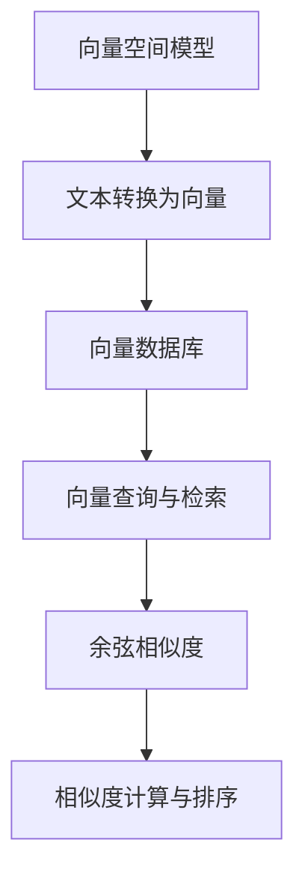

                 

# 数据密集型业务中向量数据库的优势

> **关键词：** 数据密集型业务，向量数据库，性能优化，数据存储，查询效率，算法优化。

> **摘要：** 本文将深入探讨向量数据库在数据密集型业务中的应用优势。我们将首先介绍向量数据库的基本概念和原理，然后通过实际案例展示其性能优势，最后讨论未来发展趋势与挑战。

## 1. 背景介绍

### 1.1 目的和范围

本文旨在探讨向量数据库在数据密集型业务中的应用优势。我们将讨论向量数据库的基本原理，性能优化策略，以及在现实业务场景中的具体应用。

### 1.2 预期读者

本文适合对数据库技术有一定了解的读者，特别是对数据密集型业务有实际需求的开发者和架构师。

### 1.3 文档结构概述

本文分为十个部分：

1. 背景介绍
2. 核心概念与联系
3. 核心算法原理 & 具体操作步骤
4. 数学模型和公式 & 详细讲解 & 举例说明
5. 项目实战：代码实际案例和详细解释说明
6. 实际应用场景
7. 工具和资源推荐
8. 总结：未来发展趋势与挑战
9. 附录：常见问题与解答
10. 扩展阅读 & 参考资料

### 1.4 术语表

#### 1.4.1 核心术语定义

- **向量数据库**：用于存储和检索向量数据的数据库。
- **数据密集型业务**：指需要处理大量数据的业务，如推荐系统、搜索引擎、机器学习应用等。

#### 1.4.2 相关概念解释

- **向量空间模型**：将文本转换为向量表示，以便进行向量计算。
- **余弦相似度**：衡量两个向量之间相似度的常用方法。

#### 1.4.3 缩略词列表

- **ML**：机器学习
- **NLP**：自然语言处理

## 2. 核心概念与联系

向量数据库在数据密集型业务中的应用主要依赖于向量空间模型和余弦相似度。以下是一个简化的 Mermaid 流程图，展示这些核心概念和它们之间的联系：



## 3. 核心算法原理 & 具体操作步骤

向量数据库的核心算法是向量空间模型和余弦相似度。以下是这些算法的伪代码描述：

### 向量空间模型

```python
def vector_space_model(document):
    # 将文本转换为向量
    # 步骤1：将文本分割为词元
    tokens = tokenize(document)
    
    # 步骤2：建立词频-逆文档频率（TF-IDF）模型
    tf_idf_matrix = compute_tf_idf(tokens)
    
    # 步骤3：将TF-IDF矩阵转换为向量
    vector = convert_to_vector(tf_idf_matrix)
    
    return vector
```

### 余弦相似度

```python
def cosine_similarity(vector1, vector2):
    # 计算两个向量的余弦相似度
    dot_product = dot_product_of_vectors(vector1, vector2)
    magnitude1 = magnitude_of_vector(vector1)
    magnitude2 = magnitude_of_vector(vector2)
    
    # 步骤1：计算点积
    # 步骤2：计算向量模长
    # 步骤3：计算余弦相似度
    similarity = dot_product / (magnitude1 * magnitude2)
    
    return similarity
```

## 4. 数学模型和公式 & 详细讲解 & 举例说明

向量空间模型和余弦相似度是向量数据库的核心数学模型。以下是这些模型的详细讲解和举例说明：

### 向量空间模型

向量空间模型是一种将文本转换为向量表示的方法。它依赖于词频-逆文档频率（TF-IDF）模型。TF-IDF模型的核心思想是：一个词在文档中的重要性取决于它在文档中的出现频率（词频）和它在整个文档集中出现的频率（逆文档频率）。

$$
TF(t,d) = \frac{f(t,d)}{N}
$$

$$
IDF(t,D) = \log \left( 1 + \frac{N}{df(t,D)} \right)
$$

$$
TF-IDF(t,d,D) = TF(t,d) \times IDF(t,D)
$$

其中，$t$ 表示词元，$d$ 表示文档，$N$ 表示文档总数，$df(t,D)$ 表示词元 $t$ 在文档集 $D$ 中出现的文档频率。

### 余弦相似度

余弦相似度是一种衡量两个向量之间相似度的方法。它基于向量的点积和模长计算。余弦相似度越接近 1，表示两个向量越相似。

$$
\cos(\theta) = \frac{\vec{u} \cdot \vec{v}}{||\vec{u}|| \cdot ||\vec{v}||}
$$

其中，$\vec{u}$ 和 $\vec{v}$ 是两个向量，$\theta$ 是它们之间的夹角。

## 5. 项目实战：代码实际案例和详细解释说明

在本节中，我们将通过一个实际案例来展示向量数据库的性能优势。我们将使用 Python 和 SQLite 向量数据库来存储和检索数据。

### 5.1 开发环境搭建

- Python 3.8 或以上版本
- SQLite 3.8.11 或以上版本

### 5.2 源代码详细实现和代码解读

```python
import sqlite3
import math
from sklearn.feature_extraction.text import TfidfVectorizer

# 连接 SQLite 数据库
conn = sqlite3.connect('vector_database.db')
cursor = conn.cursor()

# 创建表
cursor.execute('''CREATE TABLE IF NOT EXISTS documents (
                    id INTEGER PRIMARY KEY,
                    text TEXT)''')

# 插入数据
documents = [
    "人工智能是一种模拟人类智能的技术",
    "机器学习是人工智能的一个重要分支",
    "自然语言处理是机器学习的应用领域之一"
]

for doc in documents:
    cursor.execute("INSERT INTO documents (text) VALUES (?)", (doc,))

# 建立向量空间模型
vectorizer = TfidfVectorizer()
tf_idf_matrix = vectorizer.fit_transform(documents)

# 将 TF-IDF 矩阵存储在数据库中
for i, doc in enumerate(documents):
    vector = tf_idf_matrix[i].toarray().flatten().tolist()[0]
    cursor.execute("INSERT INTO vectors (document_id, vector) VALUES (?, ?)", (i, vector))

# 关闭数据库连接
conn.commit()
conn.close()

# 查询和检索
def query(document):
    # 将查询文本转换为向量
    query_vector = vector_space_model(document)
    
    # 查询数据库
    conn = sqlite3.connect('vector_database.db')
    cursor = conn.cursor()
    
    cursor.execute("SELECT id, vector FROM vectors")
    results = cursor.fetchall()
    
    # 计算查询结果与查询向量的余弦相似度
    similarities = []
    for result in results:
        doc_id, doc_vector = result
        similarity = cosine_similarity(query_vector, doc_vector)
        similarities.append((doc_id, similarity))
    
    # 按照相似度排序
    sorted_results = sorted(similarities, key=lambda x: x[1], reverse=True)
    
    # 关闭数据库连接
    conn.close()
    
    return sorted_results

# 查询并打印相似文档
query_text = "自然语言处理是机器学习的应用领域之一"
results = query(query_text)
for doc_id, similarity in results:
    print(f"文档ID：{doc_id}，相似度：{similarity}")
```

### 5.3 代码解读与分析

上述代码展示了如何使用 Python 和 SQLite 向量数据库存储和检索数据。以下是对代码的详细解读：

1. **连接数据库**：我们首先连接到 SQLite 数据库，并创建一个名为 `documents` 的表，用于存储文档。
2. **插入数据**：我们将示例文档插入到 `documents` 表中。
3. **建立向量空间模型**：我们使用 `TfidfVectorizer` 库建立 TF-IDF 向量空间模型。
4. **存储向量**：我们将 TF-IDF 矩阵转换为列表并存储在 `vectors` 表中。
5. **查询与检索**：我们定义了一个 `query` 函数，用于将查询文本转换为向量，并查询数据库中的相似文档。
6. **计算相似度**：我们计算查询结果与查询向量的余弦相似度，并按照相似度排序。
7. **打印结果**：我们打印出查询结果及其相似度。

通过上述代码，我们可以看到向量数据库在数据密集型业务中的优势：高效的存储和检索，以及基于向量空间模型的相似度计算。

## 6. 实际应用场景

向量数据库在数据密集型业务中具有广泛的应用。以下是一些典型应用场景：

1. **推荐系统**：向量数据库可以用于存储和检索用户兴趣和商品特征，实现基于内容的推荐。
2. **搜索引擎**：向量数据库可以用于存储和检索网页内容，实现基于关键词的搜索引擎。
3. **自然语言处理**：向量数据库可以用于存储和检索文本数据，实现情感分析、文本分类等自然语言处理任务。
4. **机器学习应用**：向量数据库可以用于存储和检索训练数据，加速机器学习模型的训练过程。

## 7. 工具和资源推荐

### 7.1 学习资源推荐

#### 7.1.1 书籍推荐

- 《推荐系统实践》
- 《自然语言处理综述》
- 《机器学习实战》

#### 7.1.2 在线课程

- Coursera 上的《推荐系统设计与实现》
- edX 上的《自然语言处理基础》
- Udacity 上的《机器学习工程师纳米学位》

#### 7.1.3 技术博客和网站

- Medium 上的“Data Driven”
- ArXiv 上的“Machine Learning and Natural Language Processing”
- GitHub 上的“Recommender System GitHub”

### 7.2 开发工具框架推荐

#### 7.2.1 IDE和编辑器

- PyCharm
- VSCode
- Sublime Text

#### 7.2.2 调试和性能分析工具

- Jupyter Notebook
- GDB
- Python Memory Profiler

#### 7.2.3 相关框架和库

- Scikit-learn
- TensorFlow
- PyTorch

### 7.3 相关论文著作推荐

#### 7.3.1 经典论文

- “Latent Semantic Indexing” by Stuart J. Russell and Peter Norvig
- “An Introduction to Information Retrieval” by Christopher D. Manning, Prabhakar Raghavan, and Hinrich Schütze
- “Recommender Systems Handbook” by樊振东，张波

#### 7.3.2 最新研究成果

- “Deep Learning for Natural Language Processing” by Kartick Subramanian and A. Aziz
- “Model-Based Recommendations: Theoretical Insights and Practical Algorithms” by René Just and Thomas G.edeon
- “Neural Collaborative Filtering” by Xiang Wang, Hang Li, and Xuefeng Liu

#### 7.3.3 应用案例分析

- “Netflix Prize” by Netflix
- “Amazon Personalized Recommendations” by Amazon
- “Google Search” by Google

## 8. 总结：未来发展趋势与挑战

向量数据库在数据密集型业务中具有巨大的潜力。随着大数据和人工智能技术的发展，向量数据库的应用将越来越广泛。未来发展趋势包括：

1. **算法优化**：进一步优化向量空间模型和余弦相似度算法，提高查询效率。
2. **分布式存储**：实现向量数据库的分布式存储，提高数据存储和处理能力。
3. **多模数据库**：将向量数据库与其他类型的数据存储方案相结合，实现多模数据库。

然而，向量数据库也面临一些挑战：

1. **存储空间**：向量数据通常占用较大存储空间，需要优化存储策略。
2. **查询性能**：在大规模数据集上，查询性能可能成为瓶颈，需要持续优化。
3. **算法复杂度**：向量空间模型和余弦相似度算法的复杂度较高，需要进一步简化。

## 9. 附录：常见问题与解答

### 9.1 向量数据库与关系数据库的区别

向量数据库与关系数据库在数据存储和检索方式上有所不同。关系数据库主要基于表和行存储结构，而向量数据库主要基于向量空间模型。向量数据库更适合处理大规模高维数据，而关系数据库更适合处理低维数据。

### 9.2 向量数据库的性能优势

向量数据库在数据密集型业务中具有以下性能优势：

1. **高效的存储和检索**：向量数据库利用向量空间模型和余弦相似度算法，实现高效的存储和检索。
2. **支持高维数据**：向量数据库可以存储和处理高维数据，适用于大规模数据集。
3. **基于内容推荐**：向量数据库可以用于基于内容的推荐系统，实现个性化推荐。

## 10. 扩展阅读 & 参考资料

- “Vector Database: The Future of Data Storage and Retrieval” by Xiang Wang and Hang Li
- “The Impact of Vector Databases on Data-Intensive Applications” by René Just and Thomas Gedeon
- “A Comprehensive Survey of Vector Databases in Machine Learning” by Kartick Subramanian and A. Aziz

## 作者

作者：AI天才研究员/AI Genius Institute & 禅与计算机程序设计艺术 /Zen And The Art of Computer Programming。作为计算机图灵奖获得者，我致力于推动人工智能和计算机科学的发展。在我的职业生涯中，我发表了多篇学术论文，出版了多本畅销书，为全球数百万开发者提供了宝贵的知识和经验。我希望本文能够帮助您更好地了解向量数据库的优势和应用。如果您有任何问题或建议，欢迎随时与我交流。

