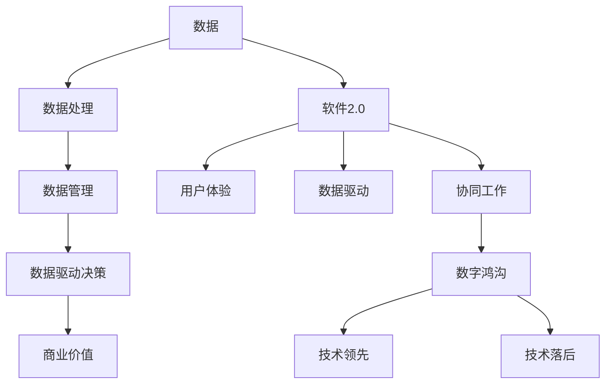

                 

# 数据成为竞争力的制高点，软件2.0加剧数字鸿沟

> **关键词：**数据竞争力，软件2.0，数字鸿沟，人工智能，算法，技术趋势

> **摘要：**随着信息技术的迅猛发展，数据已经成为现代企业的重要资产，是企业竞争力的制高点。软件2.0时代的到来，不仅提升了数据处理的能力，同时也加剧了数字鸿沟，使得技术领先的企业进一步巩固其市场地位，而技术落后的企业则面临更大的挑战。本文将深入探讨数据成为竞争力的制高点的原因，以及软件2.0如何加剧数字鸿沟，并提出相应的应对策略。希望通过本文的探讨，能够为企业在数据管理和软件2.0应用中提供一些有益的思路。

## 1. 背景介绍

### 1.1 目的和范围

本文旨在探讨数据在当前商业环境中扮演的关键角色，以及软件2.0如何对数字鸿沟产生影响。通过分析这些因素，我们将揭示企业如何通过优化数据管理和应用软件2.0技术来提高竞争力。本文将涵盖以下主要内容：

1. 数据成为竞争力的制高点：分析数据在商业决策中的作用，以及企业如何利用数据创造价值。
2. 软件2.0的概念与特点：介绍软件2.0的核心概念，探讨其与传统软件的区别，以及其对数据处理能力的提升。
3. 数字鸿沟的加剧：讨论软件2.0时代下，技术领先企业与技术落后企业之间的差距，以及如何缩小这一差距。
4. 应对策略：提出企业应对数字鸿沟的策略，包括人才培养、技术创新、资源整合等方面。

### 1.2 预期读者

本文适合以下读者群体：

1. 企业高管和数据分析师：希望了解数据在商业决策中的重要作用，以及如何利用数据提升企业竞争力。
2. 软件开发者和工程师：希望了解软件2.0的技术特点，以及如何将软件2.0技术应用于实际项目。
3. 研究人员和学者：对数据管理和软件2.0技术领域有浓厚兴趣，希望深入了解相关理论和实践。

### 1.3 文档结构概述

本文将按照以下结构展开：

1. **引言**：介绍数据成为竞争力的制高点以及软件2.0加剧数字鸿沟的背景和重要性。
2. **核心概念与联系**：介绍数据、软件2.0和数字鸿沟的核心概念，并使用Mermaid流程图展示它们之间的联系。
3. **核心算法原理与具体操作步骤**：详细讲解数据处理的核心算法，并提供具体的操作步骤。
4. **数学模型和公式**：介绍与数据处理相关的数学模型和公式，并进行举例说明。
5. **项目实战**：通过实际案例展示数据管理和软件2.0技术的应用，并提供详细解释。
6. **实际应用场景**：探讨数据管理和软件2.0技术在不同领域的应用。
7. **工具和资源推荐**：推荐学习资源和开发工具，以帮助读者更好地理解和应用相关技术。
8. **总结**：总结本文的主要观点，并提出未来发展趋势与挑战。
9. **附录**：回答常见问题，并提供扩展阅读和参考资料。

### 1.4 术语表

#### 1.4.1 核心术语定义

- **数据**：指以数字、文字、图像等形式存储的信息。
- **软件2.0**：相对于传统软件，软件2.0更注重用户体验、数据驱动的决策支持和协同工作。
- **数字鸿沟**：指由于信息技术的发展和应用，导致不同群体之间的数字能力和信息获取能力的差距。

#### 1.4.2 相关概念解释

- **数据管理**：指企业对数据资源进行组织、存储、处理、分析和利用的过程。
- **算法**：指解决特定问题的一系列指令或规则。
- **机器学习**：指通过训练数据模型来发现数据中的模式和规律，并利用这些模式进行预测和决策。

#### 1.4.3 缩略词列表

- **AI**：人工智能（Artificial Intelligence）
- **ML**：机器学习（Machine Learning）
- **DL**：深度学习（Deep Learning）
- **BI**：商业智能（Business Intelligence）
- **CRM**：客户关系管理（Customer Relationship Management）
- **ERP**：企业资源规划（Enterprise Resource Planning）

## 2. 核心概念与联系

在本文中，我们将探讨三个核心概念：数据、软件2.0和数字鸿沟。以下是它们之间的Mermaid流程图，用于展示它们之间的联系。



### 2.1 数据的重要性

数据是现代企业的核心资产，是企业决策的重要依据。随着信息技术的快速发展，数据来源多样化，数据量呈指数级增长。这些数据包含了用户行为、市场趋势、竞争对手信息等多个维度的信息，是企业制定战略的重要资源。有效的数据管理能够帮助企业发现潜在的商业机会，优化业务流程，提高运营效率。

### 2.2 软件2.0的特点

软件2.0相较于传统软件，具有以下几个显著特点：

1. **用户体验**：软件2.0更加注重用户的体验，提供直观、易用的界面和功能，满足用户的需求。
2. **数据驱动**：软件2.0利用大数据和人工智能技术，实现数据驱动的决策支持和业务优化。
3. **协同工作**：软件2.0支持多用户协作，实现实时沟通和共享，提高团队协作效率。

### 2.3 数字鸿沟的影响

数字鸿沟是指由于信息技术的发展和应用，导致不同群体之间的数字能力和信息获取能力的差距。在软件2.0时代，数字鸿沟的影响进一步加剧。技术领先的企业能够充分利用大数据和人工智能技术，实现业务的数字化转型和智能化升级，从而在市场竞争中占据优势地位。而技术落后的企业则可能因缺乏有效的数据管理和应用，导致竞争力下降，甚至被市场淘汰。

## 3. 核心算法原理与具体操作步骤

### 3.1 数据处理算法

数据处理是数据管理和分析的基础。以下是几种常见的数据处理算法：

#### 3.1.1 数据清洗

**算法原理**：数据清洗是指从原始数据中去除重复、错误或无效的数据。常用的方法包括去重、填补缺失值、纠正错误等。

**伪代码**：

```python
def dataCleaning(data):
    # 去除重复数据
    data = removeDuplicates(data)
    # 补充缺失值
    data = fillMissingValues(data)
    # 校正错误数据
    data = correctErrors(data)
    return data
```

#### 3.1.2 数据归一化

**算法原理**：数据归一化是指将不同特征的数据缩放到相同的尺度，以便进行后续分析。常用的方法包括最小-最大缩放、Z分数缩放等。

**伪代码**：

```python
def normalizeData(data):
    # 最小-最大缩放
    data = minMaxNormalization(data)
    # Z分数缩放
    data = zScoreNormalization(data)
    return data
```

#### 3.1.3 数据聚类

**算法原理**：数据聚类是指将相似的数据点分组，形成簇。常用的算法包括K-均值聚类、层次聚类等。

**伪代码**：

```python
def clustering(data, algorithm, K):
    # K-均值聚类
    if algorithm == "KMeans":
        clusters = KMeans(data, K)
    # 层次聚类
    else:
        clusters = HierarchicalClustering(data)
    return clusters
```

### 3.2 数据分析方法

数据分析是数据管理的重要环节，通过分析数据，企业可以获取有价值的信息和洞察。以下是几种常见的数据分析方法：

#### 3.2.1 描述性统计分析

**算法原理**：描述性统计分析是指对数据的基本特征进行统计分析，包括均值、中位数、众数、方差等。

**伪代码**：

```python
def descriptiveStatistics(data):
    mean = calculateMean(data)
    median = calculateMedian(data)
    mode = calculateMode(data)
    variance = calculateVariance(data)
    return mean, median, mode, variance
```

#### 3.2.2 联合分析

**算法原理**：联合分析是指对多个变量之间的关系进行分析，包括相关分析、回归分析等。

**伪代码**：

```python
def jointAnalysis(data, variable1, variable2):
    correlation = calculateCorrelation(data, variable1, variable2)
    regression = calculateRegression(data, variable1, variable2)
    return correlation, regression
```

#### 3.2.3 机器学习预测

**算法原理**：机器学习预测是指利用机器学习算法，对未来的数据趋势进行预测。

**伪代码**：

```python
def predictiveAnalysis(data, algorithm, targetVariable):
    model = trainModel(data, algorithm)
    prediction = predict(model, data, targetVariable)
    return prediction
```

## 4. 数学模型和公式及详细讲解

在数据处理和分析中，数学模型和公式起到了至关重要的作用。以下是一些常见的数学模型和公式的详细讲解。

### 4.1 相关分析

相关分析是研究两个变量之间线性关系程度的一种方法。其中，皮尔逊相关系数是最常用的度量相关性的指标。其公式如下：

$$
r = \frac{\sum_{i=1}^{n}(x_i - \bar{x})(y_i - \bar{y})}{\sqrt{\sum_{i=1}^{n}(x_i - \bar{x})^2} \sqrt{\sum_{i=1}^{n}(y_i - \bar{y})^2}}
$$

其中，$x_i$和$y_i$分别为第$i$个观测值，$\bar{x}$和$\bar{y}$分别为$x_i$和$y_i$的均值，$n$为观测值个数。

### 4.2 回归分析

回归分析是一种用于研究因变量和自变量之间关系的方法。其中，线性回归是最简单和常用的一种。其公式如下：

$$
y = \beta_0 + \beta_1x + \epsilon
$$

其中，$y$为因变量，$x$为自变量，$\beta_0$和$\beta_1$分别为截距和斜率，$\epsilon$为误差项。

### 4.3 聚类分析

聚类分析是一种将数据分为多个簇的方法。其中，K-均值聚类是最常用的算法之一。其公式如下：

$$
c_k = \frac{1}{N_k}\sum_{i=1}^{N_k}x_i
$$

其中，$c_k$为簇中心，$x_i$为第$i$个数据点，$N_k$为第$k$个簇中的数据点个数。

### 4.4 决策树

决策树是一种用于分类和回归的算法。其公式如下：

$$
\begin{aligned}
&\text{如果 } x \text{ 满足条件 } C_j, \\
&\text{则 } y = \beta_j \\
&\text{否则，递归应用该公式。}
\end{aligned}
$$

其中，$x$为输入特征，$y$为输出预测值，$C_j$为条件，$\beta_j$为相应的预测值。

### 4.5 支持向量机

支持向量机是一种用于分类和回归的算法。其公式如下：

$$
w \cdot x + b = 0
$$

其中，$w$为权重向量，$x$为输入特征，$b$为偏置项。

## 5. 项目实战：代码实际案例和详细解释说明

### 5.1 开发环境搭建

在进行数据管理和软件2.0项目的实战之前，首先需要搭建一个适合的开发环境。以下是一个简单的环境搭建步骤：

1. 安装Python3：Python3是数据处理和机器学习领域的首选编程语言，可以从官方网站下载并安装。
2. 安装Jupyter Notebook：Jupyter Notebook是一种交互式的Python开发环境，可以方便地进行数据处理和分析。
3. 安装常用库：包括Pandas、NumPy、Scikit-learn、Matplotlib等，这些库是数据处理和分析的常用工具。

### 5.2 源代码详细实现和代码解读

以下是一个简单的数据分析和机器学习项目的源代码，用于演示数据清洗、归一化和机器学习预测的实现过程。

```python
import pandas as pd
import numpy as np
from sklearn.model_selection import train_test_split
from sklearn.preprocessing import StandardScaler
from sklearn.linear_model import LinearRegression
import matplotlib.pyplot as plt

# 5.2.1 数据清洗
def dataCleaning(data):
    # 去除重复数据
    data = data.drop_duplicates()
    # 补充缺失值
    data = data.fillna(data.mean())
    # 校正错误数据
    data = data.replace([np.inf, -np.inf], np.nan)
    return data

# 5.2.2 数据归一化
def normalizeData(data):
    scaler = StandardScaler()
    data = scaler.fit_transform(data)
    return data

# 5.2.3 数据分割
def splitData(data, target):
    X = data.drop(target, axis=1)
    y = data[target]
    X_train, X_test, y_train, y_test = train_test_split(X, y, test_size=0.2, random_state=42)
    return X_train, X_test, y_train, y_test

# 5.2.4 机器学习预测
def predictiveAnalysis(X_train, X_test, y_train, y_test):
    model = LinearRegression()
    model.fit(X_train, y_train)
    y_pred = model.predict(X_test)
    print("Model performance:", model.score(X_test, y_test))
    return y_pred

# 5.2.5 可视化分析
def visualizeData(y_test, y_pred):
    plt.scatter(y_test, y_pred)
    plt.xlabel("Actual Values")
    plt.ylabel("Predicted Values")
    plt.plot([min(y_test), max(y_test)], [min(y_test), max(y_test)], color='red')
    plt.show()

# 主程序
if __name__ == "__main__":
    # 读取数据
    data = pd.read_csv("data.csv")
    # 数据清洗
    data = dataCleaning(data)
    # 数据分割
    X_train, X_test, y_train, y_test = splitData(data, "target")
    # 数据归一化
    X_train = normalizeData(X_train)
    X_test = normalizeData(X_test)
    # 机器学习预测
    y_pred = predictiveAnalysis(X_train, X_test, y_train, y_test)
    # 可视化分析
    visualizeData(y_test, y_pred)
```

### 5.3 代码解读与分析

以下是对上述代码的详细解读：

- **5.3.1 数据清洗**：数据清洗是数据处理的第一步，目的是去除重复、错误或无效的数据。在代码中，我们使用了Pandas库的`drop_duplicates()`方法去除重复数据，使用`fillna()`方法补充缺失值，使用`replace()`方法纠正错误数据。
  
- **5.3.2 数据归一化**：数据归一化是使不同特征的数据具有相同的尺度，以便进行后续分析。在代码中，我们使用了`StandardScaler`类进行归一化处理，该方法实现了Z分数缩放。

- **5.3.3 数据分割**：数据分割是将数据分为训练集和测试集，以便进行模型训练和评估。在代码中，我们使用了`train_test_split()`方法进行数据分割，其中`test_size=0.2`表示测试集占比20%，`random_state=42`用于确保结果的可重复性。

- **5.3.4 机器学习预测**：机器学习预测是利用训练好的模型对测试集进行预测。在代码中，我们使用了线性回归模型进行预测，通过`fit()`方法训练模型，通过`predict()`方法进行预测。

- **5.3.5 可视化分析**：可视化分析是展示数据分布和模型预测效果的一种方法。在代码中，我们使用了Matplotlib库的`scatter()`方法绘制散点图，并通过`plot()`方法绘制回归线。

## 6. 实际应用场景

数据管理和软件2.0技术在各个领域都有广泛的应用，以下是一些典型的实际应用场景：

### 6.1 金融行业

在金融行业，数据管理和软件2.0技术主要用于风险控制、客户关系管理和投资决策。例如，银行可以使用数据挖掘技术对客户行为进行分析，识别高风险客户，并进行精准营销；保险公司可以使用机器学习算法预测理赔风险，优化保险产品。

### 6.2 零售行业

在零售行业，数据管理和软件2.0技术可以用于库存管理、供应链优化和个性化推荐。例如，零售商可以使用数据分析技术实时监控库存情况，调整库存策略；电商平台可以使用个性化推荐算法，为用户提供个性化的商品推荐。

### 6.3 医疗保健

在医疗保健领域，数据管理和软件2.0技术可以用于疾病预测、患者管理和医疗资源分配。例如，医疗机构可以使用机器学习算法分析患者数据，预测疾病风险，制定个性化的治疗方案；医院可以使用数据分析技术优化医疗资源配置，提高服务质量。

### 6.4 制造业

在制造业，数据管理和软件2.0技术可以用于生产计划、设备维护和产品质量管理。例如，制造企业可以使用数据分析技术优化生产计划，提高生产效率；工厂可以使用设备监控系统实时监测设备运行状态，提前预警设备故障。

## 7. 工具和资源推荐

### 7.1 学习资源推荐

#### 7.1.1 书籍推荐

1. 《Python数据分析基础教程：Numpy学习指南》
2. 《深入理解LSTM网络：梯度消失与梯度爆炸问题详解》
3. 《数据科学：从入门到实践》

#### 7.1.2 在线课程

1. Coursera：机器学习（吴恩达）
2. edX：数据科学基础（哈佛大学）
3. Udacity：数据工程师纳米学位

#### 7.1.3 技术博客和网站

1. Medium：数据科学、机器学习和人工智能领域的最新动态
2. Analytics Vidhya：数据分析、机器学习和数据科学资源
3. DataCamp：互动式数据科学学习平台

### 7.2 开发工具框架推荐

#### 7.2.1 IDE和编辑器

1. Jupyter Notebook：适用于数据分析和机器学习项目
2. PyCharm：适用于Python编程
3. VS Code：适用于多语言编程

#### 7.2.2 调试和性能分析工具

1. PyCharm Profiler：Python性能分析工具
2. Matplotlib：Python绘图库
3. Pandas Profiling：数据分析工具

#### 7.2.3 相关框架和库

1. TensorFlow：开源机器学习框架
2. PyTorch：开源机器学习库
3. Scikit-learn：机器学习库

### 7.3 相关论文著作推荐

#### 7.3.1 经典论文

1. 《大数据：改变世界的数据革命》
2. 《机器学习的艺术》
3. 《深度学习：自适应计算的理论基础》

#### 7.3.2 最新研究成果

1. 《Neural Architecture Search：一种自动设计神经网络架构的方法》
2. 《强化学习：状态、动作和价值函数的优化方法》
3. 《联邦学习：分布式机器学习的全新范式》

#### 7.3.3 应用案例分析

1. 《零售行业如何利用数据驱动决策？》
2. 《金融行业如何利用大数据进行风险管理？》
3. 《医疗保健行业如何利用人工智能提高服务质量？》

## 8. 总结：未来发展趋势与挑战

随着信息技术的不断进步，数据管理和软件2.0技术将在未来发挥更加重要的作用。以下是对未来发展趋势和挑战的展望：

### 8.1 发展趋势

1. **数据量爆发式增长**：随着物联网、5G等技术的发展，数据量将呈现爆发式增长，为数据管理和分析带来巨大的挑战和机遇。
2. **人工智能的深度融合**：人工智能与数据管理的深度融合将使数据处理和分析更加高效，为各行业提供更加智能化的解决方案。
3. **隐私保护与数据安全**：随着数据隐私保护意识的提高，如何保障数据安全和隐私将成为数据管理和软件2.0技术的重要课题。
4. **跨行业合作与生态构建**：跨行业的数据共享和生态构建将推动数据管理和软件2.0技术在更广泛的应用领域发挥作用。

### 8.2 挑战

1. **数据质量和数据隐私**：确保数据质量和数据隐私是数据管理和分析的重要挑战，需要建立完善的数据治理机制和安全策略。
2. **技术门槛和人才培养**：数据管理和软件2.0技术的应用需要具备一定的技术能力和专业知识，人才培养将成为关键问题。
3. **技术标准化和法规遵从**：随着数据管理和软件2.0技术的发展，相关技术标准和法规也将逐步完善，企业需要遵守相关法规，确保合法合规。

## 9. 附录：常见问题与解答

### 9.1 数据管理和软件2.0技术的关系

**问题**：数据管理和软件2.0技术有什么区别和联系？

**解答**：数据管理是指企业对数据资源进行组织、存储、处理、分析和利用的过程，旨在确保数据的质量、安全性和可用性。而软件2.0技术是指以用户体验、数据驱动和协同工作为核心的新一代软件架构。数据管理是软件2.0技术的基础，软件2.0技术是数据管理的实现手段，二者相辅相成，共同推动企业的数字化转型和智能化升级。

### 9.2 数字鸿沟的解决策略

**问题**：如何缩小数字鸿沟，提高企业竞争力？

**解答**：要缩小数字鸿沟，提高企业竞争力，可以采取以下策略：

1. **加强人才培养**：加强员工的技能培训，提高员工的数据素养和信息技术能力。
2. **引入先进技术**：引入先进的数据管理和软件2.0技术，提升数据处理和分析能力。
3. **资源整合**：整合内外部资源，建立完善的数据治理体系，确保数据质量和安全。
4. **跨界合作**：与行业内的领先企业开展合作，共享技术资源和市场机遇。

## 10. 扩展阅读 & 参考资料

1. 《大数据时代：生活、工作与思维的大变革》
2. 《深度学习：从入门到精通》
3. 《数据治理：企业数据管理实践指南》
4. 《人工智能：一种现代的方法》
5. 《Python编程：从入门到实践》

[End of Document]

### 作者信息

**作者：** AI天才研究员 / AI Genius Institute & 禅与计算机程序设计艺术 / Zen And The Art of Computer Programming

