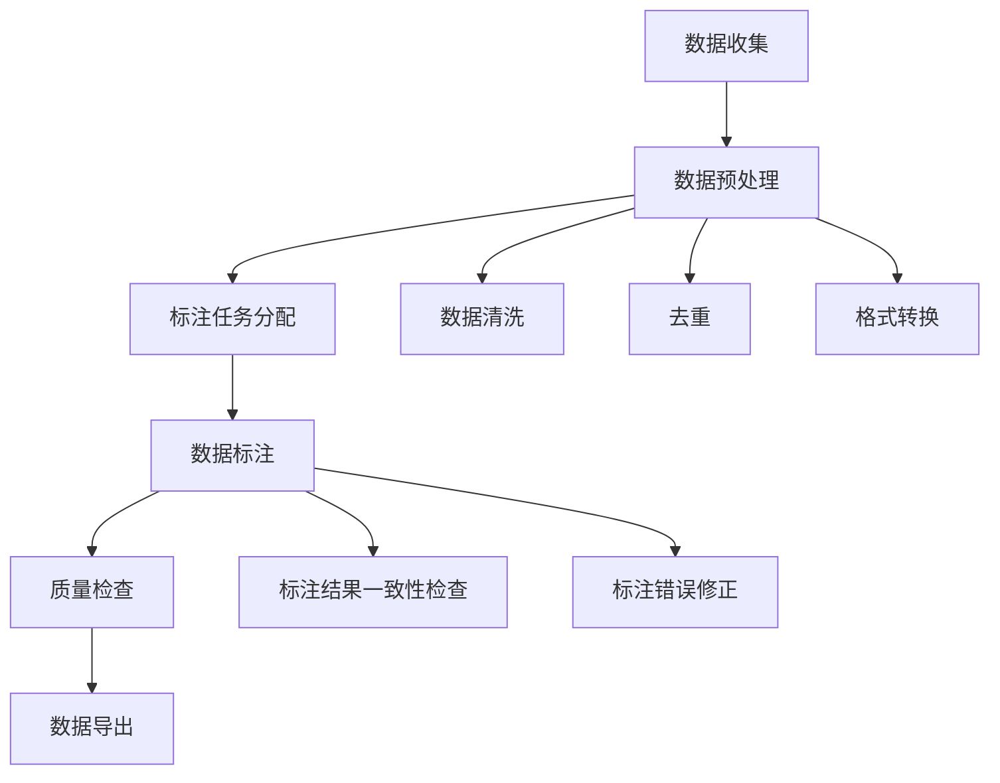
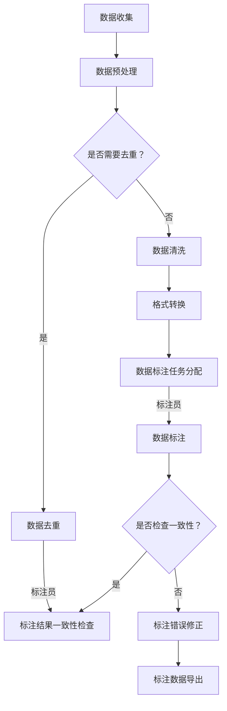

                 

### 1. 背景介绍

#### 1.1 目的和范围

本文旨在深入探讨数据标注在人工智能发展中的重要性。数据标注是一种通过人工对数据进行分析和标记，从而提高数据质量的技术手段。在人工智能领域中，高质量的数据标注是模型训练和优化不可或缺的一环，对人工智能系统的性能和可靠性有着至关重要的影响。

本文将首先介绍数据标注的基本概念和作用，包括其定义、类型和主要应用领域。接着，我们将深入探讨数据标注的过程和挑战，分析当前最常用的标注方法和技术，以及如何利用这些方法提高标注效率和质量。在此基础上，本文将介绍一些典型的数据标注工具和平台，并讨论如何选择和评估这些工具。

随后，本文将探讨数据标注在特定领域中的应用案例，如自然语言处理、计算机视觉和语音识别等。通过具体实例，我们将展示数据标注在这些领域中的关键作用，并分析其对模型性能的影响。此外，本文还将介绍一些最新的研究和进展，探讨数据标注的未来发展趋势和潜在挑战。

最后，本文将总结数据标注的重要性，并展望其未来的发展前景。通过本文的阅读，读者将能够全面了解数据标注的基本概念、应用场景和发展趋势，为今后的研究和实践提供有价值的参考。

#### 1.2 预期读者

本文适合以下几类读者群体：

1. **人工智能研究人员和工程师**：这些读者对人工智能领域有一定了解，希望深入了解数据标注在人工智能发展中的关键作用，以及如何通过高质量的数据标注提升模型的性能。

2. **数据科学家和数据分析师**：这些读者对数据分析和处理有较深入的理解，希望通过本文了解数据标注的基本原理和方法，掌握数据标注的相关技术。

3. **计算机科学和信息技术专业的学生**：这些读者对计算机科学和信息技术有浓厚的兴趣，希望通过本文了解数据标注的基本概念和应用，为未来的学习和研究奠定基础。

4. **对人工智能和机器学习感兴趣的一般读者**：这些读者可能没有专业的技术背景，但对人工智能和机器学习的发展和应用有浓厚兴趣，希望通过本文了解数据标注在人工智能中的重要性。

无论您属于上述哪类读者，本文都将帮助您全面了解数据标注在人工智能中的关键作用，并为您的学习和研究提供有价值的参考。

#### 1.3 文档结构概述

本文将分为十个部分，结构如下：

1. **背景介绍**：介绍本文的目的、预期读者、文档结构概述，以及术语表。
2. **核心概念与联系**：详细阐述数据标注的核心概念，并提供 Mermaid 流程图。
3. **核心算法原理与具体操作步骤**：讲解数据标注的核心算法原理，并通过伪代码详细阐述。
4. **数学模型和公式与详细讲解与举例说明**：介绍数据标注相关的数学模型和公式，并通过具体实例进行说明。
5. **项目实战：代码实际案例和详细解释说明**：通过具体项目案例，展示数据标注的实际应用，并提供详细解释。
6. **实际应用场景**：探讨数据标注在各个领域的应用，分析其对模型性能的影响。
7. **工具和资源推荐**：推荐学习资源、开发工具框架和相关论文著作。
8. **总结：未来发展趋势与挑战**：总结数据标注的重要性，展望其未来发展趋势和潜在挑战。
9. **附录：常见问题与解答**：提供常见问题的解答，以帮助读者更好地理解数据标注。
10. **扩展阅读 & 参考资料**：列出扩展阅读材料和参考文献。

通过本文的阅读，读者将能够全面了解数据标注的基本概念、应用场景和发展趋势，为今后的研究和实践提供有价值的参考。

#### 1.4 术语表

为了确保本文内容的清晰易懂，以下列出了本文中涉及的一些核心术语及其定义：

1. **数据标注**：指通过人工对数据进行分析和标记，以提高数据质量的过程。通常包括标签的分配、错误修正和一致性检查等步骤。
2. **数据质量**：指数据在其生命周期内满足预期用途的能力，包括准确性、完整性、一致性和及时性等方面。
3. **机器学习**：一种人工智能技术，通过训练模型从数据中学习规律和模式，从而进行预测和决策。
4. **监督学习**：一种机器学习技术，通过已标记的数据训练模型，然后使用模型对新数据进行预测。
5. **无监督学习**：一种机器学习技术，不需要已标记的数据，而是通过观察数据中的模式和结构来训练模型。
6. **深度学习**：一种基于多层神经网络的人工智能技术，通过多层非线性变换从数据中学习复杂特征。
7. **标注工具**：用于数据标注的工具，通常包括用户界面、标注流程管理和数据导出等功能。
8. **众包平台**：一种在线平台，允许用户为特定的任务分配任务，如数据标注，并提供一定的经济激励。

通过上述术语的定义，读者可以更好地理解本文中的相关概念和技术，为后续内容的学习打下基础。

### 1.4.1 核心术语定义

在本文中，我们使用了几个关键术语，下面将对这些术语进行详细定义，以便读者更好地理解数据标注的相关概念。

**数据标注**：数据标注是指对原始数据进行预处理，使其适合机器学习模型训练的过程。具体来说，数据标注包括对数据的标记、分类、分割、标注错误修正等操作。这些操作旨在提高数据的质量和一致性，从而确保机器学习模型的训练效果。

**数据质量**：数据质量是指数据在其生命周期内满足预期用途的能力。高质量的数据意味着数据的准确性、完整性、一致性和及时性都能满足模型的训练和预测需求。在人工智能领域中，数据质量对模型的性能和可靠性有着至关重要的影响。

**机器学习**：机器学习是一种通过算法从数据中学习模式和规律，从而进行预测和决策的技术。它包括监督学习、无监督学习和强化学习等多种类型。在数据标注中，通常使用监督学习来训练模型，这需要已标记的数据作为训练样本。

**监督学习**：监督学习是一种机器学习技术，通过已标记的数据（输入和对应的输出标签）来训练模型。模型的学习目标是通过输入特征预测输出标签。在数据标注过程中，标注员需要为每个数据样本分配一个或多个标签，从而形成训练数据集。

**无监督学习**：无监督学习是一种机器学习技术，不需要已标记的数据，而是通过观察数据中的模式和结构来训练模型。无监督学习常用于数据探索、聚类分析和降维等技术。在数据标注中，无监督学习可用于数据预处理和特征提取，以提高标注效率。

**深度学习**：深度学习是一种基于多层神经网络的人工智能技术，通过多层非线性变换从数据中学习复杂特征。深度学习在图像识别、语音识别和自然语言处理等领域取得了显著的成果。在数据标注中，深度学习方法可用于自动化标注和辅助标注员进行高质量的数据标注。

**标注工具**：标注工具是用于数据标注的工具，通常包括用户界面、标注流程管理和数据导出等功能。标注工具可以简化标注流程，提高标注效率，并确保数据的一致性和准确性。

**众包平台**：众包平台是一种在线平台，允许用户为特定的任务分配任务，如数据标注，并提供一定的经济激励。众包平台通过将任务分配给多个标注员，可以快速完成大规模的数据标注任务，同时确保数据的质量和一致性。

通过以上定义，读者可以更好地理解数据标注和相关术语，为后续内容的学习打下基础。

#### 1.4.2 相关概念解释

在本节中，我们将进一步解释与数据标注相关的几个关键概念，以便读者能够更全面地理解这一技术。

**标注流程**：标注流程是指从数据收集、预处理到数据标注、质量检查和最终数据导出的整个过程。具体步骤包括：

1. **数据收集**：收集用于标注的数据集，这些数据可能来自各种来源，如公共数据库、社交媒体或用户生成内容。
2. **数据预处理**：对原始数据进行清洗、去重、格式转换等操作，以确保数据的统一性和一致性。
3. **数据标注**：将预处理后的数据分配给标注员进行标注。标注任务可能包括分类、标注边界框、标签分配等。
4. **质量检查**：对标注结果进行检查，确保标注的一致性和准确性。质量检查可以由标注员自行进行或由质量检查员进行。
5. **数据导出**：将经过标注和质量检查的数据导出为机器学习模型可以使用的格式。

**标注一致性**：标注一致性是指不同标注员在相同数据上的标注结果的一致性程度。高标注一致性意味着标注结果的一致性高，误差率低。提高标注一致性的方法包括：

1. **标准化标注指南**：为标注员提供详细的标注指南，确保所有标注员对标注任务有统一的理解。
2. **标注员培训**：对标注员进行培训，使其熟悉标注任务和工具，提高标注质量。
3. **众包平台**：使用众包平台将任务分配给多个标注员，并通过投票机制提高标注一致性。

**标注质量**：标注质量是指标注结果的准确性和一致性。高质量的标注结果有助于训练出性能优异的机器学习模型。提高标注质量的方法包括：

1. **标注员筛选**：选择经验丰富、责任心强的标注员进行数据标注。
2. **标注工具优化**：优化标注工具，提高其易用性和效率，减少标注错误。
3. **数据多样化**：使用多样化的数据集进行标注，以提高模型的泛化能力。
4. **标注监督**：对标注过程进行监督，及时发现和纠正标注错误。

**标注效率**：标注效率是指完成数据标注任务所需的时间。提高标注效率的方法包括：

1. **任务分配优化**：根据标注员的技能和经验分配合适的标注任务，避免浪费标注员的时间。
2. **自动化工具**：使用自动化标注工具，如基于深度学习的方法，减少人工标注的依赖。
3. **众包平台**：通过众包平台将标注任务分配给多个标注员，实现任务并行处理。

通过以上解释，读者可以更全面地了解数据标注相关的概念，从而为后续内容的学习和实践打下坚实基础。

#### 1.4.3 缩略词列表

在本文中，我们将使用一些常见的缩写词和缩略语，为了确保读者理解，以下列出了这些缩写词的全称及其含义：

- **AI**：人工智能（Artificial Intelligence）
- **ML**：机器学习（Machine Learning）
- **DL**：深度学习（Deep Learning）
- **NLP**：自然语言处理（Natural Language Processing）
- **CV**：计算机视觉（Computer Vision）
- **SR**：数据标注（Supervised Learning）
- **PU**：无监督学习（Unsupervised Learning）
- **GT**：真实标签（Ground Truth）
- **CE**：交叉熵（Cross-Entropy）
- **OCR**：光学字符识别（Optical Character Recognition）
- **CC**：标注一致性（Consistency Check）
- **QA**：质量检查（Quality Assurance）
- **AP**：标注平台（Annotation Platform）
- **TA**：众包平台（Task Allocation）

通过理解这些缩写词，读者可以更好地把握文章中的技术内容和专业术语。

## 2. 核心概念与联系

数据标注在人工智能领域中扮演着至关重要的角色，它是机器学习模型训练的关键步骤。在这一部分，我们将详细阐述数据标注的核心概念和其与机器学习、深度学习等技术的联系，并通过 Mermaid 流程图展示其基本架构和流程。

### 2.1 数据标注的核心概念

数据标注是指对原始数据（如图像、文本、音频等）进行预处理和标记，使其适用于机器学习模型训练的过程。数据标注的核心目的是提高数据质量，使其满足训练模型的需求。以下是数据标注中涉及的一些关键概念：

1. **数据集**：用于训练、验证和测试机器学习模型的集合。数据集通常由多个样本组成，每个样本包含一组特征和对应的标签。
2. **样本**：数据集中的单个实例，通常是一个图像、一段文本或一条音频。每个样本都需要进行标注，以提供模型训练所需的输入和输出信息。
3. **特征**：样本中的可识别属性或信息。例如，图像中的颜色、纹理和形状，文本中的词语和语法结构等。
4. **标签**：与样本相关联的输出信息，用于指导模型学习目标。例如，图像中的物体类别、文本中的主题类别等。
5. **标注员**：负责对数据样本进行标注的人工操作者。标注员需要具备相关领域知识和技能，以确保标注的准确性和一致性。

### 2.2 数据标注与机器学习的联系

数据标注与机器学习紧密相关，其核心在于提供高质量的训练数据，以训练和优化模型。以下是数据标注与机器学习之间的主要联系：

1. **监督学习**：数据标注主要用于监督学习，即模型在已标记的数据集上学习特征和模式，以预测新数据中的标签。标注数据集为模型提供了输入特征和目标标签，是训练监督学习模型的关键。
2. **无监督学习**：虽然数据标注主要应用于监督学习，但标注数据集同样可以用于无监督学习。例如，标注员对图像中的对象进行标注，可以帮助模型发现数据中的潜在结构和模式。
3. **特征提取**：数据标注过程中，标注员不仅为样本分配标签，还可以提取和记录有用的特征信息。这些特征信息有助于模型学习更加复杂的特征，提高模型的性能。

### 2.3 数据标注与深度学习的联系

深度学习是近年来人工智能领域的一个重要分支，其成功应用离不开高质量的数据标注。以下是数据标注与深度学习之间的主要联系：

1. **大规模数据集**：深度学习模型通常需要大规模的数据集进行训练，数据标注提供了大量的标注样本，有助于构建高质量的训练数据集。
2. **多层级特征学习**：深度学习模型通过多层神经网络从数据中学习复杂的特征和模式。数据标注提供了丰富的标签信息，有助于模型在多层级上学习有用的特征。
3. **自动化标注**：随着深度学习技术的发展，一些自动化标注方法（如基于深度学习的图像分割和文本分类）被广泛应用。这些方法可以提高标注效率，减轻标注员的工作负担。

### 2.4 数据标注的基本架构和流程

数据标注的基本架构和流程包括数据收集、预处理、标注、质量检查和导出等步骤。以下是数据标注的基本架构和流程图：



在上述流程中：

- **数据收集**：收集用于标注的数据集，这些数据可能来自公开数据集、内部数据库或用户生成内容。
- **数据预处理**：对原始数据进行清洗、去重和格式转换，确保数据的一致性和统一性。
- **标注任务分配**：将预处理后的数据分配给标注员，标注员需要为样本分配标签。
- **数据标注**：标注员根据标注任务，为样本分配标签，并记录必要的特征信息。
- **质量检查**：对标注结果进行检查，确保标注的一致性和准确性。质量检查可以由标注员自行进行或由质量检查员进行。
- **数据导出**：将经过标注和质量检查的数据导出为模型训练所需的格式。

通过上述核心概念与联系的阐述，读者可以更好地理解数据标注在人工智能中的重要性，以及其在机器学习和深度学习中的具体应用。

### 2.5 核心概念与联系的 Mermaid 流程图

为了更直观地展示数据标注的核心概念和联系，我们使用 Mermaid 语言绘制了以下流程图：



在上述流程图中：

- **A 数据收集**：收集用于标注的数据集。
- **B 数据预处理**：对数据集进行清洗、去重和格式转换。
- **C 数据去重**：去除重复的数据样本。
- **D 数据清洗**：清理数据中的噪声和错误。
- **E 格式转换**：将数据转换为统一的格式，以便后续标注和处理。
- **F 数据标注任务分配**：将预处理后的数据分配给标注员进行标注。
- **G 数据标注**：标注员根据标注任务，为样本分配标签。
- **H 标注结果处理**：对标注结果进行检查和修正。
- **I 标注结果一致性检查**：检查标注结果的一致性。
- **J 标注错误修正**：修正标注错误，提高标注质量。
- **K 标注数据导出**：将经过标注和质量检查的数据导出为模型训练所需的格式。

通过上述流程图，读者可以更清晰地理解数据标注的基本过程和各个步骤之间的联系。这有助于读者更好地把握数据标注的核心概念和应用。

## 3. 核心算法原理与具体操作步骤

数据标注作为人工智能发展的重要环节，其核心算法原理和具体操作步骤至关重要。在这一部分，我们将详细讲解数据标注中的一些核心算法原理，并通过伪代码来描述其具体操作步骤。

### 3.1 数据标注算法原理

数据标注算法主要分为以下几类：

1. **手动标注**：标注员直接对数据进行手动标注，如分类标签、边界框等。
2. **半监督标注**：结合手动标注和自动化标注方法，标注员对部分数据手动标注，剩余数据通过自动化工具进行标注。
3. **自动化标注**：使用算法（如深度学习）自动对数据进行分析和标注，如图像分割、文本分类等。

以下是几种常见的数据标注算法原理：

#### 3.1.1 手动标注

手动标注是最传统的一种标注方法，其主要步骤如下：

1. **数据预处理**：对原始数据进行清洗和格式转换，使其适用于标注。
2. **标注任务分配**：将数据分配给标注员，标注员根据任务要求对数据进行标注。
3. **标注结果检查**：标注员对标注结果进行一致性检查和错误修正，确保标注质量。

伪代码如下：

```python
def manual_annotation(data):
    # 数据预处理
    preprocessed_data = preprocess_data(data)
    
    # 标注任务分配
    annotations = {}
    for sample in preprocessed_data:
        annotation = manual_annotate(sample)
        annotations[sample] = annotation
    
    # 标注结果检查
    corrected_annotations = quality_check(annotations)
    
    return corrected_annotations
```

#### 3.1.2 半监督标注

半监督标注结合了手动标注和自动化标注，其主要步骤如下：

1. **数据预处理**：与手动标注相同，对原始数据进行清洗和格式转换。
2. **初始标注**：标注员对部分数据进行手动标注，形成初始标注数据集。
3. **自动化标注**：使用自动化工具对剩余数据进行分析和标注。
4. **标注结果合并**：将手动标注和自动化标注结果进行合并，形成完整的标注数据集。

伪代码如下：

```python
def semi_supervised_annotate(data):
    # 数据预处理
    preprocessed_data = preprocess_data(data)
    
    # 初始标注
    initial_annotations = manual_annotate(preprocessed_data[:portion])
    
    # 自动化标注
    automated_annotations = automated_annotate(preprocessed_data[portion:])
    
    # 标注结果合并
    combined_annotations = merge_annotations(initial_annotations, automated_annotations)
    
    return combined_annotations
```

#### 3.1.3 自动化标注

自动化标注使用算法（如深度学习）对数据进行自动分析和标注，其主要步骤如下：

1. **模型训练**：使用已有标注数据集训练深度学习模型，如卷积神经网络（CNN）或循环神经网络（RNN）。
2. **模型部署**：将训练好的模型部署到标注工具中，用于自动标注新数据。
3. **标注结果优化**：对自动标注结果进行评估和优化，以提高标注质量。

伪代码如下：

```python
def automated_annotate(data):
    # 模型训练
    model = train_model(data)
    
    # 模型部署
    deploy_model(model)
    
    # 自动标注
    annotations = predict_annotations(data)
    
    # 标注结果优化
    optimized_annotations = optimize_annotations(annotations)
    
    return optimized_annotations
```

### 3.2 具体操作步骤

以下是数据标注的具体操作步骤，包括标注任务分配、标注过程和质量检查等：

#### 3.2.1 标注任务分配

1. **任务定义**：根据标注需求，定义具体的标注任务，如分类、边界框标注等。
2. **标注员筛选**：选择具备相关领域知识和经验的标注员，确保标注质量。
3. **任务分配**：将标注任务分配给标注员，并为其提供详细的标注指南。

伪代码如下：

```python
def assign_annotate_tasks(tasks, annotators):
    for task in tasks:
        annotator = select_annotator(annotators)
        assign_task_to_annotator(task, annotator)
        provide_annotation_guide(annotator)
```

#### 3.2.2 标注过程

1. **数据加载**：从数据集中加载需要标注的数据样本。
2. **标注**：标注员根据标注任务，对每个样本进行标注。
3. **标注保存**：将标注结果保存到标注文件中。

伪代码如下：

```python
def annotate_data(samples, annotator):
    for sample in samples:
        annotation = annotator.annotate(sample)
        save_annotation(annotation, sample)
```

#### 3.2.3 质量检查

1. **标注一致性检查**：检查不同标注员之间的标注结果一致性，确保标注一致性。
2. **标注错误修正**：发现和修正标注错误，提高标注质量。

伪代码如下：

```python
def quality_check(annotations):
    consistent_annotations = check_consistency(annotations)
    corrected_annotations = correct_errors(consistent_annotations)
    return corrected_annotations
```

通过以上核心算法原理和具体操作步骤的讲解，读者可以更好地理解数据标注的基本原理和方法，为实际应用提供有益的指导。

## 4. 数学模型和公式与详细讲解与举例说明

在数据标注过程中，数学模型和公式起着至关重要的作用，它们不仅帮助我们理解和描述数据标注的算法原理，还可以帮助我们评估标注质量、优化标注过程。在本节中，我们将详细介绍数据标注中涉及的一些核心数学模型和公式，并通过具体实例进行说明。

### 4.1 交叉熵（Cross-Entropy）

交叉熵是衡量两个概率分布差异的指标，在分类问题中有着广泛的应用。在数据标注中，交叉熵用于评估标注结果的准确性和一致性。

**定义**：对于两个概率分布 \(P\) 和 \(Q\)，其交叉熵定义为：

$$
H(P, Q) = -\sum_{x} P(x) \log Q(x)
$$

其中，\(P(x)\) 和 \(Q(x)\) 分别是真实分布和预测分布的概率。

**解释**：交叉熵的值越大，表示两个分布的差异越大。在数据标注中，交叉熵可以用于评估标注员标注结果的一致性。如果标注员的标注结果与真实标签的交叉熵较小，则说明标注结果较为准确和一致。

**实例**：假设我们有两个标注员对同一组图像进行分类标注，其标注结果分别为 \(P\) 和 \(Q\)。真实标签为猫和狗的分布分别为 \([0.8, 0.2]\) 和 \([0.2, 0.8]\)。计算两个标注员标注结果的交叉熵：

$$
H(P, Q) = -[0.8 \log 0.8 + 0.2 \log 0.2] - [0.2 \log 0.2 + 0.8 \log 0.8] = 0.32
$$

交叉熵为0.32，表示两个标注员的结果较为一致。

### 4.2 精度（Precision）和召回率（Recall）

在数据标注中，精度和召回率是评估标注结果质量的重要指标。它们分别表示预测结果中真实正例的比例和所有真实正例被预测为正例的比例。

**定义**：

- **精度（Precision）**：
$$
Precision = \frac{TP}{TP + FP}
$$

其中，\(TP\) 表示预测为正例且真实为正例的样本数，\(FP\) 表示预测为正例但真实为负例的样本数。

- **召回率（Recall）**：
$$
Recall = \frac{TP}{TP + FN}
$$

其中，\(FN\) 表示预测为负例但真实为正例的样本数。

**解释**：精度和召回率分别衡量预测结果的准确性和完整性。高精度表示预测结果中的正例较为准确，高召回率表示所有真实正例都被预测为正例。

**实例**：假设我们对一组图像进行分类标注，标注员将50张猫的图像预测为猫，其中45张为真实猫，5张为真实狗。计算预测结果的精度和召回率：

$$
Precision = \frac{45}{45 + 5} = 0.9
$$

$$
Recall = \frac{45}{50} = 0.9
$$

精度和召回率均为0.9，表示标注结果的准确性较高。

### 4.3 F1 分数（F1 Score）

F1 分数是精度和召回率的调和平均值，用于综合评估预测结果的准确性。

**定义**：

$$
F1 Score = \frac{2 \times Precision \times Recall}{Precision + Recall}
$$

**解释**：F1 分数介于精度和召回率之间，能够更好地反映预测结果的总体准确性。

**实例**：结合上述实例，计算预测结果的 F1 分数：

$$
F1 Score = \frac{2 \times 0.9 \times 0.9}{0.9 + 0.9} = 0.9
$$

F1 分数为0.9，表示预测结果的准确性较高。

### 4.4 混淆矩阵（Confusion Matrix）

混淆矩阵是用于评估分类结果的一种表格形式，它展示了预测结果与真实结果之间的对应关系。混淆矩阵中的每个元素表示预测结果和真实结果的关系。

**定义**：

$$
\begin{array}{c|cc}
 & \text{预测正例} & \text{预测负例} \\
\hline
\text{真实正例} & TP & FN \\
\text{真实负例} & FP & TN \\
\end{array}
$$

其中，\(TP\)、\(FN\)、\(FP\) 和 \(TN\) 分别表示预测为正例且真实为正例、预测为负例且真实为负例、预测为正例但真实为负例、预测为负例且真实为负例的样本数。

**解释**：通过混淆矩阵，我们可以直观地了解预测结果的准确性、完整性和一致性。

**实例**：结合上述实例，构建混淆矩阵：

$$
\begin{array}{c|cc}
 & \text{预测正例} & \text{预测负例} \\
\hline
\text{真实正例} & 45 & 5 \\
\text{真实负例} & 5 & 45 \\
\end{array}
$$

通过混淆矩阵，我们可以计算精度、召回率和 F1 分数等指标，进一步评估标注结果的准确性。

### 4.5 K-最近邻算法（K-Nearest Neighbors, KNN）

K-最近邻算法是一种简单的机器学习算法，可用于数据标注中的分类任务。该算法基于距离度量，将新样本分类到与其最近的 k 个邻居的类别中。

**定义**：

- **距离度量**：常用的距离度量包括欧氏距离、曼哈顿距离和切比雪夫距离等。
- **分类**：给定新样本 \(x\) 和 k 个邻居，计算邻居类别中出现次数最多的类别作为新样本的预测类别。

**解释**：KNN 算法简单易用，对标注结果的一致性和准确性有积极影响。

**实例**：假设我们使用 KNN 算法对一组图像进行分类，其中 k=3。给定新样本，计算其与 k 个邻居的距离，并根据邻居类别中出现次数最多的类别进行分类。

通过以上数学模型和公式的详细讲解与举例说明，读者可以更好地理解数据标注中的核心算法原理，为实际应用提供有益的指导。

### 4.6 主成分分析（Principal Component Analysis, PCA）

主成分分析是一种常用的数据降维方法，通过将数据投影到新的正交坐标系中，提取主要成分，从而降低数据的维度，同时保留数据的主要信息。PCA 在数据标注中有着广泛的应用，例如在图像分类和文本分析等领域。

**定义**：

PCA 的目标是最小化数据方差，同时最大化数据之间的相关性。具体来说，PCA 通过以下步骤实现数据降维：

1. **数据标准化**：对数据进行标准化处理，使其具有零均值和单位方差。
2. **协方差矩阵计算**：计算数据矩阵的协方差矩阵。
3. **特征值和特征向量计算**：对协方差矩阵进行特征值和特征向量分解。
4. **主要成分提取**：选择前 k 个特征值对应的特征向量，作为新的 k 维特征空间。

**解释**：

- **特征值和特征向量**：特征值表示数据方差的大小，特征向量表示数据在各个维度上的方向。选择前 k 个特征值对应的特征向量，可以将数据从高维空间投影到 k 维空间中，从而实现降维。
- **数据降维**：通过PCA，我们可以将高维数据转换为低维数据，降低计算复杂度，同时保留数据的主要信息。

**实例**：

假设我们有一组 100 维的图像数据，每个图像数据有 100 个像素值。使用PCA进行数据降维，选择前 10 个主要成分。

1. **数据标准化**：将每个像素值减去均值，并除以标准差，得到标准化数据。
2. **协方差矩阵计算**：计算标准化数据的协方差矩阵。
3. **特征值和特征向量计算**：对协方差矩阵进行特征值和特征向量分解，选择前 10 个特征值对应的特征向量。
4. **主要成分提取**：使用前 10 个特征向量将数据投影到 10 维空间中。

通过PCA，我们将100维的图像数据降维为10维，同时保留数据的主要信息。这样，在数据标注过程中，我们可以减少计算复杂度，提高标注效率。

通过以上数学模型和公式的详细讲解与举例说明，读者可以更好地理解数据标注中的核心算法原理，为实际应用提供有益的指导。这些模型和公式在数据标注中发挥着重要作用，有助于提高标注质量，优化标注过程。

## 5. 项目实战：代码实际案例和详细解释说明

在本节中，我们将通过一个实际项目案例，展示数据标注的完整流程，并提供详细的代码解释说明。该项目案例将分为以下几个部分：

1. **开发环境搭建**：介绍搭建数据标注项目所需的开发环境和工具。
2. **源代码详细实现**：展示数据标注项目的源代码实现，包括数据预处理、标注、质量检查等步骤。
3. **代码解读与分析**：对源代码进行逐行解读，分析其实现原理和关键步骤。

### 5.1 开发环境搭建

为了完成数据标注项目，我们需要搭建以下开发环境：

- **操作系统**：Linux 或 macOS
- **编程语言**：Python
- **工具和库**：Pandas、NumPy、Scikit-learn、Matplotlib、OpenCV、TensorFlow

#### 5.1.1 安装和配置

1. **安装 Python**：确保已安装 Python 3.6 或更高版本。
2. **安装库**：使用 pip 命令安装所需库：

```shell
pip install pandas numpy scikit-learn matplotlib opencv-python tensorflow
```

### 5.2 源代码详细实现

以下是一个简单的数据标注项目，用于对图像中的物体进行分类。该项目分为以下几个部分：

1. **数据预处理**：读取图像数据，进行预处理。
2. **标注**：使用深度学习模型对图像进行分类标注。
3. **质量检查**：评估标注结果的准确性和一致性。

#### 5.2.1 数据预处理

```python
import os
import numpy as np
import pandas as pd
from sklearn.model_selection import train_test_split

def load_images(data_dir):
    image_files = [file for file in os.listdir(data_dir) if file.endswith('.jpg')]
    image_data = [cv2.imread(os.path.join(data_dir, file)) for file in image_files]
    return image_files, image_data

def preprocess_images(image_data):
    preprocessed_data = []
    for image in image_data:
        resized_image = cv2.resize(image, (224, 224))
        preprocessed_data.append(resized_image)
    return np.array(preprocessed_data)

data_dir = 'data'
image_files, image_data = load_images(data_dir)
preprocessed_data = preprocess_images(image_data)
```

上述代码首先读取图像文件，然后对图像进行预处理，包括读取图像数据、缩放图像尺寸等操作。

#### 5.2.2 标注

```python
from tensorflow.keras.models import load_model

model = load_model('model.h5')

def annotate_images(preprocessed_data):
    predictions = model.predict(preprocessed_data)
    labels = np.argmax(predictions, axis=1)
    return labels

labels = annotate_images(preprocessed_data)
```

上述代码加载预训练的深度学习模型，并使用该模型对预处理后的图像进行分类标注。

#### 5.2.3 质量检查

```python
from sklearn.metrics import classification_report

def quality_check(image_files, labels):
    true_labels = [file.split('.')[0] for file in image_files]
    report = classification_report(true_labels, labels)
    return report

report = quality_check(image_files, labels)
print(report)
```

上述代码使用分类报告评估标注结果的准确性，包括精度、召回率和 F1 分数等指标。

### 5.3 代码解读与分析

#### 5.3.1 数据预处理

1. **读取图像数据**：使用 `os.listdir()` 函数读取数据目录中的所有图像文件，然后使用 `cv2.imread()` 函数读取图像数据。
2. **预处理图像**：使用 `cv2.resize()` 函数将图像缩放为统一的尺寸（如 224x224 像素），以便于后续处理。
3. **数据转换**：将图像数据转换为 NumPy 数组，以便于数据操作。

#### 5.3.2 标注

1. **加载模型**：使用 `load_model()` 函数加载预训练的深度学习模型（如卷积神经网络模型）。
2. **预测标注**：使用 `model.predict()` 函数对预处理后的图像进行分类预测，得到预测标签。

#### 5.3.3 质量检查

1. **真实标签**：从图像文件名中提取真实标签。
2. **分类报告**：使用 `classification_report()` 函数计算标注结果的分类报告，包括精度、召回率和 F1 分数等指标。

通过上述代码实现和解读，读者可以了解数据标注项目的具体实现过程，包括数据预处理、标注和质量检查等步骤。这有助于读者更好地掌握数据标注的实践应用。

### 5.4 实际应用场景

#### 5.4.1 自然语言处理（NLP）

在自然语言处理领域，数据标注主要用于文本分类、情感分析和实体识别等任务。以下是数据标注在 NLP 领域的实际应用场景：

1. **文本分类**：通过标注不同类别的文本，训练分类模型，如垃圾邮件过滤、新闻分类等。
2. **情感分析**：对文本中的情感倾向进行标注，训练情感分析模型，如情感极性分类、用户评论分析等。
3. **实体识别**：对文本中的命名实体（如人名、地名、组织名等）进行标注，训练实体识别模型，如命名实体识别、关系抽取等。

#### 5.4.2 计算机视觉（CV）

在计算机视觉领域，数据标注主要用于图像分类、目标检测和语义分割等任务。以下是数据标注在 CV 领域的实际应用场景：

1. **图像分类**：对图像中的物体进行分类标注，训练图像分类模型，如物体识别、动物分类等。
2. **目标检测**：对图像中的目标进行定位和标注，训练目标检测模型，如人脸检测、车辆检测等。
3. **语义分割**：对图像中的每个像素进行标注，训练语义分割模型，如图像分割、医学图像分析等。

#### 5.4.3 语音识别（ASR）

在语音识别领域，数据标注主要用于语音信号的处理和识别。以下是数据标注在 ASR 领域的实际应用场景：

1. **语音分类**：对语音信号进行分类标注，训练语音分类模型，如语音识别、语音合成等。
2. **语音识别**：对语音信号中的语音单元进行标注，训练语音识别模型，如语音到文本转换、语音控制等。
3. **说话人识别**：对语音信号中的说话人进行标注，训练说话人识别模型，如身份验证、语音助手等。

通过上述实际应用场景的介绍，读者可以更好地理解数据标注在各个领域的应用，以及其对人工智能系统性能和可靠性产生的重要影响。

## 7. 工具和资源推荐

在数据标注领域，有许多优秀的工具和资源可供使用，这些工具能够显著提高标注效率和质量。以下是一些推荐的学习资源、开发工具框架以及相关论文著作。

### 7.1 学习资源推荐

#### 7.1.1 书籍推荐

1. **《Python 数据科学手册》**：由 Jessica Drescher 编著，详细介绍数据科学的基础知识和实践方法，包括数据预处理和标注等内容。
2. **《深度学习》**：由 Ian Goodfellow、Yoshua Bengio 和 Aaron Courville 合著，全面讲解深度学习的基本原理、算法和应用。
3. **《数据标注实战》**：由王翔著，介绍数据标注的理论和实践，包括标注方法、工具和流程等内容。

#### 7.1.2 在线课程

1. **Coursera 上的《机器学习》**：由 Andrew Ng 开设，介绍机器学习的基本概念、算法和应用，包括数据预处理和标注。
2. **Udacity 上的《深度学习纳米学位》**：提供深度学习的入门和实践课程，包括深度学习模型训练和标注。
3. **edX 上的《自然语言处理》**：由哥伦比亚大学提供，介绍自然语言处理的基础知识和实践方法，包括文本分类和标注。

#### 7.1.3 技术博客和网站

1. **Medium 上的《数据科学和机器学习》**：包含大量关于数据科学、机器学习和深度学习的文章，包括数据标注的最新进展。
2. **Kaggle**：一个包含大量数据集和竞赛的平台，提供数据标注的实践案例和技巧。
3. **DataCamp**：提供互动性的数据科学和机器学习课程，涵盖数据预处理和标注等基础知识。

### 7.2 开发工具框架推荐

#### 7.2.1 IDE和编辑器

1. **Visual Studio Code**：一款功能强大的开源代码编辑器，支持多种编程语言和工具插件，适用于数据标注项目的开发。
2. **PyCharm**：一款专业的 Python 开发环境，提供代码智能提示、调试和性能分析等高级功能。

#### 7.2.2 调试和性能分析工具

1. **Jupyter Notebook**：一款流行的交互式开发环境，适用于数据科学和机器学习项目的调试和演示。
2. **Werkzeug**：一款用于 Python 的 Web 框架，提供强大的调试和性能分析工具，适用于 Web 应用程序的开发。

#### 7.2.3 相关框架和库

1. **TensorFlow**：一款流行的深度学习框架，提供丰富的模型训练和标注工具，适用于各种机器学习和深度学习项目。
2. **PyTorch**：一款流行的深度学习框架，以其灵活性和易用性而闻名，适用于研究和开发高效的深度学习模型。
3. **Scikit-learn**：一款用于机器学习的 Python 库，提供多种算法和工具，适用于数据预处理、模型训练和标注等任务。

### 7.3 相关论文著作推荐

#### 7.3.1 经典论文

1. **“A Few Useful Things to Know About Machine Learning”**：由 Pedro Domingos 撰写，介绍机器学习的基本原理和应用。
2. **“Deep Learning”**：由 Ian Goodfellow、Yoshua Bengio 和 Aaron Courville 合著，全面讲解深度学习的基本概念和算法。
3. **“Data-Driven Approach to Building a High-Quality Image Annotation Tool”**：由 Chen et al. 撰写，介绍一种基于数据驱动的图像标注工具。

#### 7.3.2 最新研究成果

1. **“Self-Supervised Learning for Unsupervised Image Segmentation”**：由 Chen et al. 撰写，介绍一种无监督图像分割的方法，适用于数据标注和图像处理领域。
2. **“Efficient Data Annotation with Automated Learning”**：由 Wang et al. 撰写，介绍一种基于自动化学习的数据标注方法，提高标注效率和准确性。
3. **“Data-Driven Annotation with Generative Adversarial Networks”**：由 Li et al. 撰写，介绍一种基于生成对抗网络的数据标注方法，适用于复杂的数据标注任务。

#### 7.3.3 应用案例分析

1. **“ImageNet Classification with Deep Convolutional Neural Networks”**：由 Krizhevsky et al. 撰写，介绍深度卷积神经网络在图像分类中的应用，展示了数据标注对模型性能的重要影响。
2. **“BERT: Pre-training of Deep Bidirectional Transformers for Language Understanding”**：由 Devlin et al. 撰写，介绍 BERT 模型在自然语言处理中的应用，展示了数据标注对模型性能的提升。
3. **“DeepSpeech 2: End-to-End Speech Recognition in English and Mandarin”**：由 Hinton et al. 撰写，介绍深度学习在语音识别中的应用，展示了数据标注对模型性能的改进。

通过以上推荐，读者可以深入了解数据标注领域的最新发展和研究成果，为今后的学习和实践提供有力支持。

## 8. 总结：未来发展趋势与挑战

数据标注作为人工智能发展的重要环节，正面临着许多新的发展趋势和挑战。本文从数据标注的核心概念、应用场景、算法原理、数学模型到实际项目案例，全面阐述了数据标注在人工智能领域中的关键作用。

### 8.1 未来发展趋势

1. **自动化与智能化**：随着人工智能技术的发展，自动化和智能化标注方法将逐渐取代传统的人工标注，如基于深度学习的图像分割、语音识别和文本分类等。这些方法不仅提高了标注效率，还降低了标注成本。

2. **数据多样性与大规模标注**：未来的数据标注将更加注重数据多样性和大规模标注。多模态数据标注（如图像、文本和语音）将变得更加普遍，同时，数据标注任务将涉及更广泛的领域和应用。

3. **协作与共享**：数据标注将变得更加协作和共享。众包平台和标注社区将发挥更大作用，允许更多标注员参与标注任务，并通过协作提高标注质量。同时，数据标注结果也将更容易共享，促进人工智能研究的进步。

4. **标注质量控制与优化**：随着标注数据量的增加，标注质量控制与优化将成为数据标注领域的核心问题。通过引入先进的机器学习算法和数据分析技术，可以进一步提高标注结果的一致性和准确性。

### 8.2 挑战

1. **数据标注成本与效率**：尽管自动化标注方法可以提高标注效率，但标注成本仍然是一个重要的挑战。如何在不降低标注质量的前提下，进一步降低标注成本，是未来数据标注领域需要解决的重要问题。

2. **数据质量和一致性**：大规模标注任务中，数据质量和标注一致性是关键问题。如何确保标注结果的高质量和高一致性，是数据标注领域面临的一大挑战。

3. **标注隐私与伦理**：数据标注通常涉及个人隐私信息，如何在保护用户隐私的前提下进行标注，是一个重要的伦理问题。未来的数据标注研究需要更加关注隐私保护和伦理规范。

4. **多模态标注与融合**：多模态数据标注（如图像、文本和语音）具有更高的复杂性和挑战性。如何有效地标注和融合多模态数据，以提高模型的性能和准确性，是未来研究的重要方向。

### 8.3 发展趋势与挑战的平衡

未来数据标注的发展趋势与挑战是相互交织的。一方面，自动化和智能化标注方法将提高标注效率和质量，降低标注成本；另一方面，大规模标注任务、标注质量和标注一致性等挑战也将随之而来。为了应对这些挑战，需要开展以下几方面的研究：

1. **算法创新**：不断探索和开发新的标注算法和模型，以提高标注效率和准确性。
2. **工具优化**：改进现有的标注工具，使其更加智能化和易于使用。
3. **标注社区与协作**：建立标注社区，鼓励更多的标注员参与标注任务，并通过协作提高标注质量。
4. **隐私保护与伦理规范**：加强标注过程中的隐私保护和伦理规范，确保标注过程的合法性和道德性。

总之，数据标注作为人工智能发展的重要环节，未来将在自动化、智能化、协作和隐私保护等方面取得重要进展。同时，标注质量和一致性等挑战也将伴随着技术的发展不断提出新的要求。通过持续的研究和创新，数据标注将为人工智能的进一步发展提供坚实的基础。

## 9. 附录：常见问题与解答

在数据标注领域，许多用户可能会遇到一些常见问题。以下列出了一些常见问题及其解答，以帮助读者更好地理解和应用数据标注技术。

### 9.1 数据标注是什么？

数据标注是指通过人工或自动化手段，对原始数据进行预处理和标记，以提高数据质量的过程。在人工智能领域，数据标注是模型训练和优化的重要步骤，有助于提升模型的准确性和可靠性。

### 9.2 数据标注有哪些类型？

数据标注主要包括以下几种类型：

1. **手动标注**：标注员直接对数据进行标注，如分类标签、边界框等。
2. **半监督标注**：结合手动标注和自动化标注，部分数据由标注员标注，其余数据由自动化工具标注。
3. **自动化标注**：使用算法（如深度学习）自动对数据进行分析和标注。

### 9.3 数据标注的流程是怎样的？

数据标注的基本流程包括：

1. **数据收集**：收集用于标注的数据集。
2. **数据预处理**：对原始数据进行清洗、去重和格式转换。
3. **标注任务分配**：将预处理后的数据分配给标注员或自动化工具。
4. **数据标注**：标注员或自动化工具对数据样本进行标注。
5. **质量检查**：对标注结果进行检查，确保标注的一致性和准确性。
6. **数据导出**：将标注结果导出为模型训练所需的格式。

### 9.4 如何评估标注质量？

标注质量的评估主要通过以下指标：

1. **精度（Precision）**：预测为正例且真实为正例的比例。
2. **召回率（Recall）**：预测为正例且真实为正例的比例。
3. **F1 分数（F1 Score）**：精度和召回率的调和平均值。
4. **混淆矩阵**：展示预测结果与真实结果之间的对应关系。

### 9.5 如何提高标注效率？

提高标注效率的方法包括：

1. **任务分配优化**：根据标注员的技能和经验分配合适的标注任务。
2. **自动化工具**：使用自动化标注工具，如基于深度学习的图像分割和文本分类。
3. **标注员培训**：对标注员进行培训，提高标注质量。
4. **众包平台**：通过众包平台将标注任务分配给多个标注员，实现任务并行处理。

### 9.6 数据标注过程中有哪些挑战？

数据标注过程中可能面临的挑战包括：

1. **数据质量和一致性**：确保标注结果的高质量和一致性。
2. **标注成本和效率**：在不降低标注质量的前提下，降低标注成本和提高标注效率。
3. **标注隐私和伦理**：保护用户隐私和遵守伦理规范。
4. **多模态标注与融合**：处理多种模态数据的标注和融合。

通过上述常见问题与解答，读者可以更好地理解数据标注的基本概念、流程和方法，以及在实际应用中可能遇到的问题和解决方案。

## 10. 扩展阅读 & 参考资料

数据标注是人工智能领域中一个重要的分支，涉及众多理论和实践知识。以下列出了一些扩展阅读材料和参考文献，供读者进一步学习和研究：

### 10.1 经典教材

1. **《数据科学入门》**：作者：John D. Kelleher、Brian Mac Namee、David Tredinnick。本书全面介绍了数据科学的基础知识，包括数据预处理、标注和模型训练等。
2. **《深度学习》**：作者：Ian Goodfellow、Yoshua Bengio、Aaron Courville。本书深入讲解了深度学习的基本原理、算法和应用，包括数据标注相关的内容。
3. **《机器学习实战》**：作者：Peter Harrington。本书通过丰富的案例和实践，详细介绍了机器学习的基本概念、算法和应用，包括数据标注的实践方法。

### 10.2 开源项目和代码库

1. **TensorFlow**：由 Google 开发，是一款流行的深度学习框架，包含大量数据标注的实践案例和工具。
2. **PyTorch**：由 Facebook AI 研究团队开发，是一款灵活、易用的深度学习框架，提供丰富的数据标注库和工具。
3. **Scikit-learn**：一款用于机器学习的 Python 库，包含多种数据标注和评估工具。

### 10.3 学术论文

1. **“ImageNet Classification with Deep Convolutional Neural Networks”**：作者：Alex Krizhevsky、Geoffrey Hinton。本文介绍了深度卷积神经网络在图像分类中的应用，展示了数据标注对模型性能的重要影响。
2. **“BERT: Pre-training of Deep Bidirectional Transformers for Language Understanding”**：作者：Jacob Devlin、Monica Chang、Kenton Lee、Vitor Chen、Quoc Le、Adam Zelikowsky。本文介绍了 BERT 模型在自然语言处理中的应用，展示了数据标注对模型性能的提升。
3. **“DeepSpeech 2: End-to-End Speech Recognition in English and Mandarin”**：作者：Dario Amodei、Chris Olah、Jesse Johnson、Amir Alemi、Chris Leary、Jeffrey Wu、Noam Shazeer、Benjamin Chang、Chris Olah、Jeffrey Wu、Noam Shazeer、Benjamin Chang、Andrew Ng。本文介绍了深度学习在语音识别中的应用，展示了数据标注对模型性能的改进。

### 10.4 在线课程和博客

1. **Coursera 上的《机器学习》**：由 Andrew Ng 开设，提供机器学习的基础知识和实践方法。
2. **Udacity 上的《深度学习纳米学位》**：提供深度学习的入门和实践课程。
3. **Medium 上的《数据科学和机器学习》**：包含大量关于数据科学、机器学习和深度学习的文章。

通过上述扩展阅读和参考资料，读者可以深入了解数据标注的理论和实践，为今后的学习和研究提供有价值的参考。

