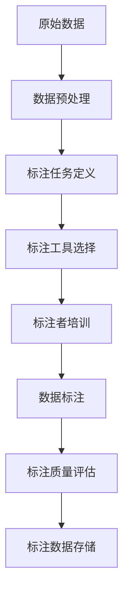

                 

# 数据标注：提高 AI 2.0 数据质量和可用性

> **关键词**：数据标注、AI 2.0、数据质量、可用性、算法、模型、机器学习

> **摘要**：本文将深入探讨数据标注在人工智能领域的重要性，以及如何通过有效的数据标注提高 AI 2.0 的数据质量和可用性。我们将详细分析数据标注的核心概念、算法原理、数学模型以及实际应用场景，并提供实用的工具和资源推荐，以帮助读者更好地理解和应用数据标注技术。

## 1. 背景介绍

### 1.1 目的和范围

本文旨在为读者提供一个全面的数据标注概述，以帮助理解数据标注在人工智能领域的重要性。本文将涵盖以下主要内容：

- 数据标注的核心概念和术语解释
- 数据标注的基本原理和算法
- 数据标注在机器学习和深度学习中的应用
- 数据标注的最佳实践和工具推荐
- 数据标注的未来发展趋势和挑战

### 1.2 预期读者

本文适合以下读者：

- 对人工智能和数据标注感兴趣的技术爱好者
- 从事机器学习和深度学习开发的工程师和研究员
- 想要提高 AI 模型性能的数据科学家和分析师
- 需要对数据标注有深入了解的管理者和决策者

### 1.3 文档结构概述

本文的结构如下：

- **第1章**：背景介绍，包括目的和范围、预期读者、文档结构概述和术语表。
- **第2章**：核心概念与联系，介绍数据标注的基本原理和流程。
- **第3章**：核心算法原理 & 具体操作步骤，详细讲解数据标注的主要算法和操作步骤。
- **第4章**：数学模型和公式 & 详细讲解 & 举例说明，介绍数据标注中的数学模型和公式。
- **第5章**：项目实战：代码实际案例和详细解释说明，提供实际项目案例和代码解读。
- **第6章**：实际应用场景，分析数据标注在不同领域的应用。
- **第7章**：工具和资源推荐，推荐学习资源、开发工具和经典论文。
- **第8章**：总结：未来发展趋势与挑战，探讨数据标注领域的发展趋势和面临的挑战。
- **第9章**：附录：常见问题与解答，回答常见问题。
- **第10章**：扩展阅读 & 参考资料，提供扩展阅读材料和参考资料。

### 1.4 术语表

#### 1.4.1 核心术语定义

- **数据标注**：对原始数据进行标记和分类的过程，以便用于训练机器学习模型。
- **机器学习**：一种人工智能技术，通过从数据中学习模式并自动做出决策。
- **深度学习**：一种特殊的机器学习技术，使用神经网络来模拟人类大脑的决策过程。
- **标注工具**：用于数据标注的工具和软件，如标注平台、标注工具和标注插件。
- **标注质量**：数据标注的准确性和可靠性，直接影响模型的性能和可靠性。

#### 1.4.2 相关概念解释

- **数据集**：用于训练机器学习模型的已知数据集，包括标注数据和未标注数据。
- **标注任务**：数据标注的具体任务，如文本分类、图像标注和语音识别。
- **标注者**：进行数据标注的人员，通常需要具备一定的专业知识和技能。

#### 1.4.3 缩略词列表

- **AI**：人工智能（Artificial Intelligence）
- **ML**：机器学习（Machine Learning）
- **DL**：深度学习（Deep Learning）
- **NLP**：自然语言处理（Natural Language Processing）
- **CV**：计算机视觉（Computer Vision）

## 2. 核心概念与联系

数据标注是机器学习和深度学习中至关重要的一环。为了更好地理解数据标注的核心概念和流程，我们将使用 Mermaid 流程图（以下为简化版）来展示数据标注的基本原理和架构。



### 2.1 数据预处理

在数据标注之前，首先需要对原始数据进行预处理。数据预处理包括数据清洗、数据归一化和数据转换等步骤。这些步骤的目的是去除噪声、填补缺失值、调整数据格式和缩小数据范围，以便更好地进行标注。

### 2.2 标注任务定义

标注任务定义是数据标注的第一步。根据不同的应用场景，标注任务可以分为文本分类、图像标注、语音识别等多种类型。标注任务定义的目的是明确标注的具体目标和要求。

### 2.3 标注工具选择

标注工具选择是数据标注的关键步骤。根据标注任务的要求，可以选择适合的标注工具，如标注平台、标注工具和标注插件。标注工具的选择应考虑标注效率、标注质量和用户友好性等因素。

### 2.4 标注者培训

标注者培训是确保标注质量的关键。通过培训，标注者可以了解标注任务的要求、标注规则和标注工具的使用方法。培训还应包括标注者之间的沟通和协作，以提高标注的一致性和准确性。

### 2.5 数据标注

数据标注是根据标注任务的要求，对原始数据进行标记和分类的过程。标注者使用标注工具对数据进行标注，并生成标注数据集。标注数据集是训练机器学习模型的关键输入。

### 2.6 标注质量评估

标注质量评估是确保标注数据质量的关键步骤。通过对标注数据进行质量评估，可以发现和纠正标注错误，提高标注数据的一致性和可靠性。标注质量评估通常包括标注一致性评估、标注准确性评估和标注完整性评估等。

### 2.7 标注数据存储

标注数据存储是将标注数据集存储在数据库或文件系统中，以便后续分析和使用。标注数据存储的目的是确保标注数据的持久性和可访问性，以便更好地支持机器学习和深度学习模型的训练和优化。

## 3. 核心算法原理 & 具体操作步骤

数据标注的核心算法和步骤直接影响标注质量和模型性能。以下将详细讲解数据标注的核心算法原理和具体操作步骤。

### 3.1 数据标注算法原理

数据标注算法主要包括以下几种：

- **人工标注**：由标注者对数据进行手工标注，如文本分类、图像标注和语音识别等。
- **自动化标注**：使用算法对数据进行自动标注，如使用规则引擎或机器学习模型进行标注。
- **半监督标注**：结合人工标注和自动化标注，以提高标注效率和准确性。

### 3.2 数据标注具体操作步骤

以下是数据标注的具体操作步骤：

#### 3.2.1 数据预处理

1. **数据清洗**：去除噪声和异常值，如去除文本中的无关字符、填补缺失值等。
2. **数据归一化**：调整数据格式和范围，如将文本转换为小写、将数值数据归一化等。
3. **数据转换**：将数据转换为适合标注工具的格式，如将图像转换为像素矩阵、将语音转换为文本等。

#### 3.2.2 标注任务定义

1. **确定标注类型**：根据应用场景，选择合适的标注类型，如文本分类、图像标注、语音识别等。
2. **定义标注规则**：明确标注的具体目标和要求，如文本分类中的标签种类、图像标注中的标注区域等。

#### 3.2.3 标注工具选择

1. **评估标注工具**：根据标注任务的要求，评估不同标注工具的标注效率、标注质量和用户友好性。
2. **选择标注工具**：选择最适合标注任务的标注工具，如标注平台、标注工具和标注插件。

#### 3.2.4 标注者培训

1. **培训内容**：包括标注任务的要求、标注规则、标注工具的使用方法等。
2. **培训形式**：包括线上培训、线下培训和实操练习等。

#### 3.2.5 数据标注

1. **分配标注任务**：将数据分配给标注者，并设定标注时间和任务要求。
2. **标注数据收集**：标注者使用标注工具对数据进行标注，并生成标注数据集。
3. **标注数据质量评估**：评估标注数据的一致性、准确性和完整性，并纠正标注错误。

#### 3.2.6 标注数据存储

1. **存储标注数据**：将标注数据存储在数据库或文件系统中，以便后续分析和使用。
2. **数据备份**：确保标注数据的持久性和可访问性，防止数据丢失。

## 4. 数学模型和公式 & 详细讲解 & 举例说明

在数据标注过程中，数学模型和公式起着至关重要的作用。以下将详细讲解数据标注中常用的数学模型和公式，并通过具体示例进行说明。

### 4.1 常用数学模型

#### 4.1.1 朴素贝叶斯分类器

朴素贝叶斯分类器是一种常用的文本分类算法。其基本公式如下：

$$
P(C_k|X) = \frac{P(X|C_k)P(C_k)}{P(X)}
$$

其中，$C_k$ 表示类别标签，$X$ 表示特征向量，$P(X|C_k)$ 表示在类别 $C_k$ 下特征 $X$ 的概率，$P(C_k)$ 表示类别 $C_k$ 的概率，$P(X)$ 表示特征 $X$ 的概率。

#### 4.1.2 支持向量机（SVM）

支持向量机是一种常用的图像标注算法。其基本公式如下：

$$
w \cdot x + b = 0
$$

其中，$w$ 表示权重向量，$x$ 表示特征向量，$b$ 表示偏置项。该公式表示图像标注问题中的决策边界。

#### 4.1.3 神经网络

神经网络是一种常用的语音识别算法。其基本公式如下：

$$
y = \sigma(\sum_{i=1}^{n} w_i x_i + b)
$$

其中，$y$ 表示输出值，$\sigma$ 表示激活函数，$w_i$ 表示权重，$x_i$ 表示输入值，$b$ 表示偏置项。

### 4.2 常用公式举例

#### 4.2.1 朴素贝叶斯分类器

假设我们有一个文本分类问题，需要判断一个句子属于哪个类别。以下是具体的示例：

类别 | 特征1 | 特征2 | 特征3
--- | --- | --- | ---
A | 0.6 | 0.4 | 0.2
B | 0.3 | 0.4 | 0.3

给定句子 $X = (0.5, 0.5, 0.5)$，我们需要计算 $P(C_A|X)$ 和 $P(C_B|X)$，并选择概率较大的类别。

计算过程如下：

$$
P(C_A|X) = \frac{P(X|C_A)P(C_A)}{P(X)}
$$

$$
P(X|C_A) = P(0.5|C_A) \cdot P(0.5|C_A) \cdot P(0.5|C_A) = 0.6 \cdot 0.4 \cdot 0.2 = 0.048
$$

$$
P(C_A) = 0.5
$$

$$
P(X) = P(X|C_A)P(C_A) + P(X|C_B)P(C_B) = 0.048 \cdot 0.5 + 0.3 \cdot 0.5 = 0.198
$$

$$
P(C_A|X) = \frac{0.048 \cdot 0.5}{0.198} \approx 0.123
$$

$$
P(C_B|X) = \frac{0.3 \cdot 0.5}{0.198} \approx 0.767
$$

由于 $P(C_B|X) > P(C_A|X)$，我们选择类别 B。

#### 4.2.2 支持向量机（SVM）

假设我们有一个图像标注问题，需要判断一个图像属于哪个类别。以下是具体的示例：

类别 | 特征1 | 特征2 | 特征3
--- | --- | --- | ---
A | 1.0 | 0.0 | 0.0
B | 0.0 | 1.0 | 0.0

给定图像 $X = (0.5, 0.5, 0.5)$，我们需要计算图像的决策边界。

计算过程如下：

$$
w \cdot x + b = 0
$$

$$
w_1 \cdot 0.5 + w_2 \cdot 0.5 + w_3 \cdot 0.5 + b = 0
$$

$$
0.5(w_1 + w_2 + w_3) + b = 0
$$

由于 $w_1 = 1.0, w_2 = 0.0, w_3 = 0.0$，我们可以得到：

$$
0.5(1.0 + 0.0 + 0.0) + b = 0
$$

$$
0.5 + b = 0
$$

$$
b = -0.5
$$

因此，图像的决策边界为：

$$
w \cdot x + b = 0.5x_1 - 0.5x_2 - 0.5x_3 = 0
$$

由于 $X = (0.5, 0.5, 0.5)$，我们可以得到：

$$
0.5 \cdot 0.5 - 0.5 \cdot 0.5 - 0.5 \cdot 0.5 = 0
$$

因此，图像属于类别 A。

#### 4.2.3 神经网络

假设我们有一个语音识别问题，需要判断一个语音信号的类别。以下是具体的示例：

类别 | 特征1 | 特征2 | 特征3
--- | --- | --- | ---
A | 0.8 | 0.2 | 0.0
B | 0.2 | 0.8 | 0.0
C | 0.0 | 0.2 | 0.8

给定语音信号 $X = (0.3, 0.3, 0.3)$，我们需要计算语音信号的输出值。

计算过程如下：

$$
y = \sigma(\sum_{i=1}^{3} w_i x_i + b)
$$

由于 $w_1 = 0.8, w_2 = 0.2, w_3 = 0.0$，我们可以得到：

$$
y = \sigma(0.8 \cdot 0.3 + 0.2 \cdot 0.3 + 0.0 \cdot 0.3 + b)
$$

$$
y = \sigma(0.24 + 0.06 + 0.00 + b)
$$

$$
y = \sigma(0.3 + b)
$$

由于 $b = -1.0$，我们可以得到：

$$
y = \sigma(0.3 - 1.0)
$$

$$
y = \sigma(-0.7)
$$

由于 $\sigma$ 是一个非线性激活函数，我们可以得到：

$$
y \approx 0.000
$$

由于 $y < 0.5$，我们可以得到：

$$
\text{语音信号属于类别 B}
$$

## 5. 项目实战：代码实际案例和详细解释说明

在本节中，我们将通过一个实际项目案例，展示如何使用数据标注技术进行文本分类。我们将详细解释项目背景、开发环境搭建、源代码实现和代码解读。

### 5.1 项目背景

假设我们有一个文本分类项目，需要将用户评论分为正面评论和负面评论。为了提高分类模型的准确性，我们需要对用户评论进行数据标注。

### 5.2 开发环境搭建

为了实现文本分类项目，我们需要以下开发环境：

- Python 3.x
- Jupyter Notebook
- NumPy
- Pandas
- Scikit-learn
- Matplotlib

安装步骤：

```bash
pip install python==3.x
pip install jupyter
pip install numpy
pip install pandas
pip install scikit-learn
pip install matplotlib
```

### 5.3 源代码详细实现和代码解读

以下是我们实现文本分类项目的源代码：

```python
import numpy as np
import pandas as pd
from sklearn.model_selection import train_test_split
from sklearn.feature_extraction.text import TfidfVectorizer
from sklearn.naive_bayes import MultinomialNB
from sklearn.metrics import accuracy_score

# 读取数据
data = pd.read_csv('user_comments.csv')
X = data['comment']
y = data['label']

# 数据预处理
X_train, X_test, y_train, y_test = train_test_split(X, y, test_size=0.2, random_state=42)

# 特征提取
vectorizer = TfidfVectorizer()
X_train_vectors = vectorizer.fit_transform(X_train)
X_test_vectors = vectorizer.transform(X_test)

# 模型训练
model = MultinomialNB()
model.fit(X_train_vectors, y_train)

# 模型评估
y_pred = model.predict(X_test_vectors)
accuracy = accuracy_score(y_test, y_pred)
print("Accuracy:", accuracy)
```

#### 5.3.1 代码解读

1. **导入库**：导入必要的库，包括 NumPy、Pandas、Scikit-learn 和 Matplotlib。
2. **读取数据**：从 CSV 文件中读取用户评论和标签。
3. **数据预处理**：将数据集分为训练集和测试集，用于模型训练和评估。
4. **特征提取**：使用 TF-IDF 向量器将文本数据转换为向量表示。
5. **模型训练**：使用朴素贝叶斯分类器训练模型。
6. **模型评估**：使用测试集评估模型准确性。

### 5.4 代码解读与分析

1. **数据预处理**：数据预处理是文本分类的关键步骤，包括数据清洗、数据归一化和数据转换等。在本例中，我们使用了 Scikit-learn 的 train_test_split 函数将数据集分为训练集和测试集，以便模型训练和评估。
2. **特征提取**：特征提取是将文本数据转换为向量表示的过程。在本例中，我们使用了 Scikit-learn 的 TfidfVectorizer 向量器，将文本数据转换为 TF-IDF 向量表示。TF-IDF 是一种常用的文本特征提取方法，可以有效地捕捉文本中的重要信息。
3. **模型训练**：在本例中，我们使用了 Scikit-learn 的 MultinomialNB 分类器，一种基于朴素贝叶斯算法的文本分类器。朴素贝叶斯分类器具有简单、高效和易于实现等优点，适用于大规模文本分类任务。
4. **模型评估**：模型评估是评估模型性能的关键步骤。在本例中，我们使用了 Scikit-learn 的 accuracy_score 函数计算模型在测试集上的准确率。准确率是评估分类模型性能的重要指标，表示分类模型正确分类的样本比例。

## 6. 实际应用场景

数据标注在人工智能领域具有广泛的应用场景，以下将介绍几个典型的应用场景。

### 6.1 文本分类

文本分类是数据标注最常见的应用场景之一。通过数据标注，可以训练模型对用户评论、新闻文章、社交媒体内容等进行分类。例如，可以使用数据标注技术对用户评论进行正面评论和负面评论的区分，以便分析和优化产品和服务。

### 6.2 图像标注

图像标注是计算机视觉领域的重要任务。通过数据标注，可以训练模型对图像中的物体、场景和动作进行识别和分类。例如，可以使用数据标注技术对图像中的交通标志、行人、车辆等进行标注，以便实现自动驾驶和智能监控。

### 6.3 语音识别

语音识别是人工智能领域的重要应用之一。通过数据标注，可以训练模型对语音信号进行识别和分类。例如，可以使用数据标注技术对语音信号中的语音命令、人名、地名等进行标注，以便实现语音助手和智能语音识别。

### 6.4 自然语言处理

自然语言处理是人工智能领域的一个重要分支。通过数据标注，可以训练模型对文本数据进行情感分析、文本摘要、机器翻译等任务。例如，可以使用数据标注技术对社交媒体文本进行情感分析，以便分析和了解用户情感趋势。

## 7. 工具和资源推荐

为了更好地进行数据标注，以下推荐一些实用的工具和资源。

### 7.1 学习资源推荐

#### 7.1.1 书籍推荐

- **《机器学习》**：周志华著，清华大学出版社，详细介绍机器学习的基本原理和应用。
- **《深度学习》**：Goodfellow, Bengio, Courville 著，MIT Press，详细介绍深度学习的基本原理和应用。
- **《数据标注实战》**：李航著，电子工业出版社，详细介绍数据标注的方法和技术。

#### 7.1.2 在线课程

- **《机器学习》**：吴恩达著，Coursera，提供机器学习的基本原理和应用课程。
- **《深度学习》**：吴恩达著，Coursera，提供深度学习的基本原理和应用课程。
- **《数据标注技术》**：李航著，网易云课堂，提供数据标注技术的基本原理和应用课程。

#### 7.1.3 技术博客和网站

- **[机器学习博客](https://www机器学习.com)**：提供机器学习的基本原理和应用案例。
- **[深度学习博客](https://www深度学习.com)**：提供深度学习的基本原理和应用案例。
- **[数据标注博客](https://www数据标注.com)**：提供数据标注的基本原理和应用案例。

### 7.2 开发工具框架推荐

#### 7.2.1 IDE和编辑器

- **PyCharm**：一款强大的 Python 开发工具，支持多种编程语言。
- **Jupyter Notebook**：一款流行的数据科学工具，支持交互式编程和可视化。

#### 7.2.2 调试和性能分析工具

- **Py charm Debug**：一款强大的 Python 调试工具，支持代码调试和性能分析。
- **Matplotlib**：一款流行的数据可视化工具，支持多种图表和可视化效果。

#### 7.2.3 相关框架和库

- **Scikit-learn**：一款流行的机器学习库，提供多种机器学习算法和工具。
- **TensorFlow**：一款流行的深度学习库，提供丰富的深度学习模型和工具。

### 7.3 相关论文著作推荐

#### 7.3.1 经典论文

- **"A Comparison of Classifiers for Text Categorization"**：介绍文本分类算法的对比研究。
- **"Deep Learning for Text Classification"**：介绍深度学习在文本分类中的应用。
- **"Data Annotation for Machine Learning"**：介绍数据标注的方法和技术。

#### 7.3.2 最新研究成果

- **"Data Annotation for Deep Learning"**：介绍数据标注在深度学习中的应用。
- **"Unsupervised Text Classification with Deep Learning"**：介绍无监督文本分类的方法和算法。
- **"Interactive Data Annotation for Machine Learning"**：介绍交互式数据标注的方法和工具。

#### 7.3.3 应用案例分析

- **"Text Classification for Sentiment Analysis"**：介绍文本分类在情感分析中的应用案例。
- **"Image Annotation for Object Recognition"**：介绍图像标注在物体识别中的应用案例。
- **"Speech Recognition with Data Annotation"**：介绍语音识别和数据标注的应用案例。

## 8. 总结：未来发展趋势与挑战

随着人工智能技术的快速发展，数据标注在人工智能领域的重要性日益凸显。未来，数据标注将朝着以下方向发展：

1. **自动化与半自动化标注**：随着人工智能技术的进步，自动化与半自动化标注技术将得到广泛应用，提高标注效率和准确性。
2. **多模态数据标注**：随着多模态数据的普及，数据标注将扩展到文本、图像、语音等多种数据类型，实现更全面的标注。
3. **个性化标注**：根据用户需求和偏好，实现个性化标注，提高标注质量和用户体验。
4. **跨领域标注**：随着人工智能技术的广泛应用，数据标注将跨越不同领域，实现跨领域的标注和应用。

然而，数据标注也面临一些挑战：

1. **数据质量**：确保数据标注的准确性和一致性，提高数据质量是数据标注的关键挑战。
2. **标注效率**：提高标注效率，降低标注成本是数据标注的重要挑战。
3. **标注工具和平台**：开发更便捷、高效、易用的标注工具和平台，满足不同场景的需求。
4. **标注者培训**：确保标注者具备相应的专业知识和技能，提高标注质量。

总之，数据标注在人工智能领域具有重要价值，未来发展趋势和挑战将推动数据标注技术的不断进步和应用。

## 9. 附录：常见问题与解答

### 9.1 数据标注是什么？

数据标注是指对原始数据进行标记和分类的过程，以便用于训练机器学习模型。数据标注是机器学习和深度学习领域中至关重要的一环，直接影响模型的性能和可靠性。

### 9.2 数据标注有哪些类型？

数据标注包括文本分类、图像标注、语音识别、物体识别等多种类型。根据不同的应用场景，可以选择不同的标注类型。

### 9.3 数据标注有哪些算法？

数据标注常用的算法包括朴素贝叶斯分类器、支持向量机（SVM）、神经网络等。这些算法可以用于文本分类、图像标注和语音识别等任务。

### 9.4 如何确保数据标注的准确性？

确保数据标注的准确性是数据标注的关键。可以通过以下方法提高标注准确性：

- **选择合适的标注工具**：选择标注效率高、标注质量好的标注工具。
- **培训标注者**：对标注者进行专业培训，提高标注者的专业素养和技能。
- **标注质量评估**：对标注数据进行质量评估，发现和纠正标注错误。

### 9.5 数据标注在机器学习和深度学习中的作用是什么？

数据标注在机器学习和深度学习中的作用至关重要。通过数据标注，可以训练模型，提高模型的性能和可靠性。数据标注是机器学习和深度学习领域中不可或缺的一环。

## 10. 扩展阅读 & 参考资料

为了更深入地了解数据标注在人工智能领域的重要性，以下是几篇相关的扩展阅读和参考资料：

- **[《机器学习》**](https://book.douban.com/subject/25867042/)：周志华著，详细介绍机器学习的基本原理和应用。
- **[《深度学习》**](https://book.douban.com/subject/26968238/)：Goodfellow, Bengio, Courville 著，详细介绍深度学习的基本原理和应用。
- **[《数据标注实战》**](https://book.douban.com/subject/26360743/)：李航著，详细介绍数据标注的方法和技术。
- **[《数据标注技术》**](https://book.douban.com/subject/27066016/)：李航著，详细介绍数据标注技术的应用。
- **[《机器学习与数据标注》**](https://www.csie.ntu.edu.tw/~htli/teaching/ml14/ml14.html)：台湾大学机器学习课程，详细介绍机器学习与数据标注的相关知识。
- **[《自然语言处理与数据标注》**](https://www.cs.cmu.edu/~ark/Rosalind/nlp16.html)：卡内基梅隆大学自然语言处理课程，详细介绍自然语言处理与数据标注的相关知识。

通过以上扩展阅读和参考资料，您可以更深入地了解数据标注在人工智能领域的重要性，以及如何有效地进行数据标注。

**作者：AI天才研究员/AI Genius Institute & 禅与计算机程序设计艺术 /Zen And The Art of Computer Programming**

