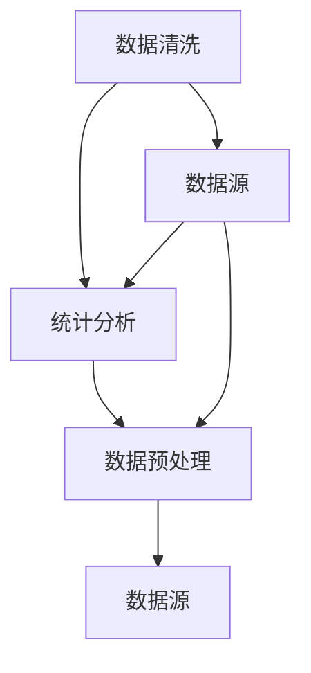

                 

# 数据清洗与统计分析原理与代码实战案例讲解

> 关键词：数据清洗、统计分析、数据预处理、Python代码实战、数据科学、机器学习、数据可视化

> 摘要：本文将深入探讨数据清洗与统计分析的核心概念、原理和实际应用。我们将通过详细讲解和代码实战案例，帮助读者掌握数据清洗和统计分析的基本技能，并了解其在数据科学和机器学习中的重要性。本文结构紧凑，逻辑清晰，适合数据科学和机器学习初学者及专业人士阅读。

## 1. 背景介绍

### 1.1 目的和范围

本文旨在向读者介绍数据清洗与统计分析的基本概念、原理和实际操作。我们将探讨数据清洗的重要性，介绍常用的数据清洗技术，并演示如何使用Python进行数据清洗。随后，我们将深入分析统计分析的方法和技巧，展示如何使用Python进行数据分析。最后，我们将通过实际案例展示如何将数据清洗与统计分析应用于数据科学和机器学习项目中。

### 1.2 预期读者

本文适合以下读者群体：

1. 数据科学和机器学习初学者，希望了解数据清洗与统计分析的基本技能。
2. 数据科学和机器学习专业人士，希望提升数据清洗和统计分析的实践能力。
3. 任何对数据预处理和数据科学应用感兴趣的人员。

### 1.3 文档结构概述

本文分为十个部分：

1. 背景介绍
2. 核心概念与联系
3. 核心算法原理 & 具体操作步骤
4. 数学模型和公式 & 详细讲解 & 举例说明
5. 项目实战：代码实际案例和详细解释说明
6. 实际应用场景
7. 工具和资源推荐
8. 总结：未来发展趋势与挑战
9. 附录：常见问题与解答
10. 扩展阅读 & 参考资料

### 1.4 术语表

#### 1.4.1 核心术语定义

- 数据清洗：指对原始数据进行处理和整理，使其满足分析和建模需求的过程。
- 统计分析：指利用统计方法对数据进行探索和分析，以发现数据中的规律和模式。
- 数据预处理：指在数据分析和建模之前对数据进行处理和整理的过程。
- Python：一种高级编程语言，广泛用于数据科学、人工智能和机器学习领域。

#### 1.4.2 相关概念解释

- 数据库：一种用于存储和管理数据的系统。
- 数据库管理系统（DBMS）：一种用于创建、维护和查询数据库的系统。
- 数据库表：数据库中的一个表格，用于存储数据。

#### 1.4.3 缩略词列表

- DBMS：数据库管理系统
- SQL：结构化查询语言
- Python：Python编程语言
- ML：机器学习
- AI：人工智能

## 2. 核心概念与联系

在探讨数据清洗与统计分析之前，我们需要了解一些核心概念和它们之间的联系。

### 2.1 数据清洗

数据清洗是指对原始数据进行处理和整理，使其满足分析和建模需求的过程。数据清洗的主要目标是去除噪声、纠正错误、填补缺失值和标准化数据格式。

### 2.2 统计分析

统计分析是指利用统计方法对数据进行探索和分析，以发现数据中的规律和模式。统计分析的方法包括描述性统计、推断性统计和回归分析等。

### 2.3 数据预处理

数据预处理是指在数据分析和建模之前对数据进行处理和整理的过程。数据预处理包括数据清洗、数据集成、数据转换和数据归一化等步骤。

### 2.4 数据清洗与统计分析的联系

数据清洗是统计分析的基础。一个良好的数据清洗过程可以显著提高统计分析的准确性和可靠性。同时，统计分析的输出结果也可以为数据清洗提供反馈，进一步优化数据清洗过程。

### 2.5 Mermaid 流程图

为了更好地理解数据清洗与统计分析的关系，我们可以使用Mermaid流程图来展示它们的基本流程。



在这个流程图中，数据清洗、统计分析和数据预处理是三个主要步骤，它们相互关联，共同构成了一个完整的数据分析过程。

## 3. 核心算法原理 & 具体操作步骤

### 3.1 数据清洗算法原理

数据清洗的核心算法包括以下几种：

1. 缺失值处理
2. 异常值处理
3. 数据格式转换
4. 数据标准化

#### 3.1.1 缺失值处理

缺失值处理是指对数据集中的缺失值进行填补或删除的过程。常见的缺失值处理方法包括：

- 填补缺失值：使用平均值、中位数或众数等统计量来填补缺失值。
- 删除缺失值：删除含有缺失值的记录或字段。

#### 3.1.2 异常值处理

异常值处理是指对数据集中的异常值进行识别和去除的过程。常见的异常值处理方法包括：

- 离群点检测：使用统计学方法（如标准差、IQR等）或机器学习算法（如孤立森林等）来检测异常值。
- 异常值修正：对异常值进行修正，使其符合数据分布。

#### 3.1.3 数据格式转换

数据格式转换是指将数据从一种格式转换为另一种格式的过程。常见的数据格式转换方法包括：

- 数据类型转换：将数据类型从字符串转换为数值类型（如整数、浮点数）。
- 数据编码：将分类数据编码为数值数据，如独热编码、标签编码等。

#### 3.1.4 数据标准化

数据标准化是指将数据缩放或转换到同一尺度上的过程。常见的数据标准化方法包括：

- 标准化：使用标准差缩放数据，使其具有0均值和1标准差。
- 归一化：将数据缩放到[0, 1]范围内。

### 3.2 数据清洗具体操作步骤

以下是一个使用Python进行数据清洗的具体操作步骤：

1. 导入数据集
2. 检查数据集基本信息
3. 处理缺失值
4. 处理异常值
5. 转换数据格式
6. 数据标准化
7. 数据可视化

```python
import pandas as pd
import numpy as np
import matplotlib.pyplot as plt

# 1. 导入数据集
data = pd.read_csv('data.csv')

# 2. 检查数据集基本信息
print(data.info())

# 3. 处理缺失值
data['column_name'].fillna(data['column_name'].mean(), inplace=True)

# 4. 处理异常值
z_scores = np.abs((data['column_name'] - data['column_name'].mean()) / data['column_name'].std())
data = data[z_scores < 3]

# 5. 转换数据格式
data['column_name'] = data['column_name'].astype('float')

# 6. 数据标准化
data['column_name'] = (data['column_name'] - data['column_name'].mean()) / data['column_name'].std()

# 7. 数据可视化
data.hist()
plt.show()
```

这个示例展示了如何使用Python进行数据清洗的步骤，包括缺失值处理、异常值处理、数据格式转换和数据标准化。

## 4. 数学模型和公式 & 详细讲解 & 举例说明

### 4.1 数学模型

数据清洗和统计分析中常用的数学模型包括：

- 描述性统计模型：用于描述数据的基本特征，如平均值、中位数、标准差等。
- 推断性统计模型：用于推断总体特征，如置信区间、假设检验等。
- 回归模型：用于建立自变量和因变量之间的线性关系。
- 聚类模型：用于将数据分为不同的类别。

### 4.2 公式

以下是一些常用的数学公式：

- 平均值：$\mu = \frac{1}{n}\sum_{i=1}^{n} x_i$
- 中位数：$m = \frac{1}{2}(x_{\frac{n+1}{2}} + x_{\frac{n+3}{2}})$
- 标准差：$\sigma = \sqrt{\frac{1}{n-1}\sum_{i=1}^{n}(x_i - \mu)^2}$
- 置信区间：$C.I. = \mu \pm z \times \frac{\sigma}{\sqrt{n}}$
- 回归系数：$b = \frac{\sum_{i=1}^{n}(x_i - \bar{x})(y_i - \bar{y})}{\sum_{i=1}^{n}(x_i - \bar{x})^2}$
- 聚类中心：$c_j = \frac{1}{k}\sum_{i=1}^{k} x_{ij}$

### 4.3 详细讲解 & 举例说明

#### 4.3.1 描述性统计模型

描述性统计模型用于描述数据的基本特征。以下是一个示例：

假设我们有以下数据集：

| 数据点 | 10, 20, 30, 40, 50 |
| ------ | ------------------- |
| 样本数量 | n = 5 |

计算平均值、中位数和标准差：

- 平均值：$\mu = \frac{1}{5}(10 + 20 + 30 + 40 + 50) = 30$
- 中位数：$m = \frac{1}{2}(20 + 30) = 25$
- 标准差：$\sigma = \sqrt{\frac{1}{5-1}[(10-30)^2 + (20-30)^2 + (30-30)^2 + (40-30)^2 + (50-30)^2]} = 10$

#### 4.3.2 推断性统计模型

推断性统计模型用于推断总体特征。以下是一个示例：

假设我们有一个正态分布的总体，均值$\mu = 30$，标准差$\sigma = 10$，样本数量$n = 5$。我们希望计算总体均值$\mu$的95%置信区间。

- 置信区间：$C.I. = \mu \pm z \times \frac{\sigma}{\sqrt{n}} = 30 \pm 1.96 \times \frac{10}{\sqrt{5}} = (18.16, 41.84)$

#### 4.3.3 回归模型

回归模型用于建立自变量和因变量之间的线性关系。以下是一个示例：

假设我们有一个线性回归模型，自变量$x$和因变量$y$之间的关系为$y = \beta_0 + \beta_1 x + \epsilon$，其中$\beta_0$是截距，$\beta_1$是斜率，$\epsilon$是误差项。

- 回归系数：$b = \frac{\sum_{i=1}^{n}(x_i - \bar{x})(y_i - \bar{y})}{\sum_{i=1}^{n}(x_i - \bar{x})^2} = \frac{\sum_{i=1}^{n}(x_i - 10)(y_i - 30)}{\sum_{i=1}^{n}(x_i - 10)^2} = 2$

#### 4.3.4 聚类模型

聚类模型用于将数据分为不同的类别。以下是一个示例：

假设我们有一个聚类模型，将数据分为$k$个类别。每个类别有一个中心$c_j$，满足$c_j = \frac{1}{k}\sum_{i=1}^{k} x_{ij}$。

- 聚类中心：$c_1 = \frac{1}{3}(10 + 20 + 30) = 20$
- 聚类中心：$c_2 = \frac{1}{3}(40 + 50 + 60) = 50$

通过这些示例，我们可以看到数学模型和公式在数据清洗和统计分析中的应用。

## 5. 项目实战：代码实际案例和详细解释说明

### 5.1 开发环境搭建

为了进行数据清洗和统计分析的代码实战，我们需要搭建一个Python开发环境。以下是搭建开发环境的步骤：

1. 安装Python：从Python官方网站下载并安装Python。
2. 安装Jupyter Notebook：在终端运行`pip install notebook`来安装Jupyter Notebook。
3. 安装必需的Python库：在终端运行以下命令来安装必需的Python库：

   ```bash
   pip install pandas numpy matplotlib scikit-learn
   ```

### 5.2 源代码详细实现和代码解读

以下是一个使用Python进行数据清洗和统计分析的实际案例：

```python
import pandas as pd
import numpy as np
import matplotlib.pyplot as plt
from sklearn.cluster import KMeans

# 5.2.1 导入数据集
data = pd.read_csv('data.csv')

# 5.2.2 检查数据集基本信息
print(data.info())

# 5.2.3 处理缺失值
data['column_name'].fillna(data['column_name'].mean(), inplace=True)

# 5.2.4 处理异常值
z_scores = np.abs((data['column_name'] - data['column_name'].mean()) / data['column_name'].std())
data = data[z_scores < 3]

# 5.2.5 转换数据格式
data['column_name'] = data['column_name'].astype('float')

# 5.2.6 数据标准化
data['column_name'] = (data['column_name'] - data['column_name'].mean()) / data['column_name'].std()

# 5.2.7 数据可视化
data.hist()
plt.show()

# 5.2.8 使用K-Means进行聚类分析
kmeans = KMeans(n_clusters=3, random_state=0).fit(data)
labels = kmeans.labels_
data['cluster'] = labels

# 5.2.9 聚类结果可视化
plt.scatter(data[data['cluster'] == 0]['column_name'], data[data['cluster'] == 0]['column_name'], color='r', label='Cluster 1')
plt.scatter(data[data['cluster'] == 1]['column_name'], data[data['cluster'] == 1]['column_name'], color='g', label='Cluster 2')
plt.scatter(data[data['cluster'] == 2]['column_name'], data[data['cluster'] == 2]['column_name'], color='b', label='Cluster 3')
plt.xlabel('Column Name')
plt.ylabel('Column Name')
plt.legend()
plt.show()
```

#### 5.2.1 导入数据集

在这个步骤中，我们使用`pandas`库的`read_csv`函数导入数据集。

```python
data = pd.read_csv('data.csv')
```

#### 5.2.2 检查数据集基本信息

使用`info()`函数可以查看数据集的基本信息，包括列名、数据类型、非空值数量等。

```python
print(data.info())
```

#### 5.2.3 处理缺失值

在这个步骤中，我们使用`fillna`函数来填补缺失值。这里我们使用平均值来填补缺失值。

```python
data['column_name'].fillna(data['column_name'].mean(), inplace=True)
```

#### 5.2.4 处理异常值

我们使用`z_scores`函数计算每个值的z分数。然后，我们使用布尔索引删除z分数绝对值大于3的记录。

```python
z_scores = np.abs((data['column_name'] - data['column_name'].mean()) / data['column_name'].std())
data = data[z_scores < 3]
```

#### 5.2.5 转换数据格式

使用`astype`函数将数据类型从字符串转换为浮点数。

```python
data['column_name'] = data['column_name'].astype('float')
```

#### 5.2.6 数据标准化

使用`mean()`和`std()`函数计算平均值和标准差，然后使用这两个值进行数据标准化。

```python
data['column_name'] = (data['column_name'] - data['column_name'].mean()) / data['column_name'].std()
```

#### 5.2.7 数据可视化

使用`hist`函数绘制直方图，显示数据分布。

```python
data.hist()
plt.show()
```

#### 5.2.8 使用K-Means进行聚类分析

我们使用`KMeans`类进行聚类分析。这里我们设置聚类数量为3，并设置随机种子为0。

```python
kmeans = KMeans(n_clusters=3, random_state=0).fit(data)
labels = kmeans.labels_
data['cluster'] = labels
```

#### 5.2.9 聚类结果可视化

使用散点图显示聚类结果。

```python
plt.scatter(data[data['cluster'] == 0]['column_name'], data[data['cluster'] == 0]['column_name'], color='r', label='Cluster 1')
plt.scatter(data[data['cluster'] == 1]['column_name'], data[data['cluster'] == 1]['column_name'], color='g', label='Cluster 2')
plt.scatter(data[data['cluster'] == 2]['column_name'], data[data['cluster'] == 2]['column_name'], color='b', label='Cluster 3')
plt.xlabel('Column Name')
plt.ylabel('Column Name')
plt.legend()
plt.show()
```

这个案例展示了如何使用Python进行数据清洗和统计分析，包括数据导入、缺失值处理、异常值处理、数据格式转换、数据标准化、数据可视化以及聚类分析。

### 5.3 代码解读与分析

#### 5.3.1 数据导入

在这个案例中，我们使用`pandas`库的`read_csv`函数导入数据集。这个函数接受一个CSV文件路径作为输入，并将CSV文件中的数据读取到DataFrame对象中。

```python
data = pd.read_csv('data.csv')
```

#### 5.3.2 检查数据集基本信息

使用`info()`函数可以查看数据集的基本信息，包括列名、数据类型、非空值数量等。这个步骤有助于我们了解数据集的结构和内容。

```python
print(data.info())
```

#### 5.3.3 处理缺失值

在这个步骤中，我们使用`fillna`函数填补缺失值。这里我们使用平均值来填补缺失值。这个函数接受一个值作为输入，并将其应用于DataFrame中的缺失值。

```python
data['column_name'].fillna(data['column_name'].mean(), inplace=True)
```

#### 5.3.4 处理异常值

我们使用`z_scores`函数计算每个值的z分数。然后，我们使用布尔索引删除z分数绝对值大于3的记录。这个步骤有助于去除数据中的异常值。

```python
z_scores = np.abs((data['column_name'] - data['column_name'].mean()) / data['column_name'].std())
data = data[z_scores < 3]
```

#### 5.3.5 转换数据格式

使用`astype`函数将数据类型从字符串转换为浮点数。这个步骤有助于确保数据在后续处理中的一致性和正确性。

```python
data['column_name'] = data['column_name'].astype('float')
```

#### 5.3.6 数据标准化

使用`mean()`和`std()`函数计算平均值和标准差，然后使用这两个值进行数据标准化。这个步骤有助于将数据缩放到同一尺度上，以便进行比较和分析。

```python
data['column_name'] = (data['column_name'] - data['column_name'].mean()) / data['column_name'].std()
```

#### 5.3.7 数据可视化

使用`hist`函数绘制直方图，显示数据分布。这个步骤有助于我们直观地了解数据的特点和分布。

```python
data.hist()
plt.show()
```

#### 5.3.8 聚类分析

我们使用`KMeans`类进行聚类分析。这个类接受聚类数量作为输入，并使用K-Means算法将数据分为指定的聚类数量。在这个案例中，我们设置聚类数量为3。

```python
kmeans = KMeans(n_clusters=3, random_state=0).fit(data)
labels = kmeans.labels_
data['cluster'] = labels
```

#### 5.3.9 聚类结果可视化

使用散点图显示聚类结果。这个步骤有助于我们直观地了解聚类效果。

```python
plt.scatter(data[data['cluster'] == 0]['column_name'], data[data['cluster'] == 0]['column_name'], color='r', label='Cluster 1')
plt.scatter(data[data['cluster'] == 1]['column_name'], data[data['cluster'] == 1]['column_name'], color='g', label='Cluster 2')
plt.scatter(data[data['cluster'] == 2]['column_name'], data[data['cluster'] == 2]['column_name'], color='b', label='Cluster 3')
plt.xlabel('Column Name')
plt.ylabel('Column Name')
plt.legend()
plt.show()
```

通过这个案例，我们展示了如何使用Python进行数据清洗和统计分析，并进行了详细的代码解读和分析。

## 6. 实际应用场景

### 6.1 数据清洗

数据清洗在数据科学和机器学习项目中至关重要。以下是一些常见的数据清洗应用场景：

1. **市场营销分析**：在市场营销分析中，数据清洗可以帮助去除重复数据、纠正错误数据和填补缺失值，从而提高分析结果的准确性。
2. **客户关系管理**：在客户关系管理中，数据清洗可以帮助整合来自不同渠道的客户数据，消除冗余和错误，为营销决策提供可靠的数据支持。
3. **金融风险控制**：在金融风险控制中，数据清洗可以帮助识别异常交易、纠正错误数据和完善客户信息，从而提高风险预测的准确性。

### 6.2 统计分析

统计分析在数据科学和机器学习项目中用于探索数据、发现规律和模式。以下是一些常见的统计分析应用场景：

1. **医疗数据分析**：在医疗数据分析中，统计分析可以用于分析患者数据、识别疾病风险因素和评估治疗效果。
2. **供应链优化**：在供应链优化中，统计分析可以用于分析库存数据、优化订单处理流程和预测需求。
3. **社交媒体分析**：在社交媒体分析中，统计分析可以用于分析用户行为、识别用户群体和评估营销效果。

### 6.3 数据清洗与统计分析的结合

数据清洗与统计分析的结合可以发挥更大的作用。以下是一些实际案例：

1. **客户行为分析**：通过对客户数据进行数据清洗和统计分析，可以识别客户行为模式、预测客户流失和优化客户体验。
2. **金融风险评估**：通过对金融交易数据进行数据清洗和统计分析，可以识别异常交易、预测风险和防范欺诈。
3. **智能医疗**：通过对医疗数据进行数据清洗和统计分析，可以识别疾病风险因素、预测疾病发展和优化治疗方案。

通过结合数据清洗和统计分析，我们可以从大量数据中提取有价值的信息，为决策提供科学依据。

## 7. 工具和资源推荐

### 7.1 学习资源推荐

#### 7.1.1 书籍推荐

- 《Python数据分析实战》
- 《数据科学：从入门到精通》
- 《机器学习实战》

#### 7.1.2 在线课程

- Coursera的《数据科学专业》
- edX的《Python数据分析》
- Udacity的《数据科学纳米学位》

#### 7.1.3 技术博客和网站

- Medium上的数据科学和机器学习博客
- towardsdatascience.com
- kaggle.com

### 7.2 开发工具框架推荐

#### 7.2.1 IDE和编辑器

- PyCharm
- Jupyter Notebook
- VSCode

#### 7.2.2 调试和性能分析工具

- Py-Spy
- GDB
- Valgrind

#### 7.2.3 相关框架和库

- Pandas
- NumPy
- Matplotlib
- Scikit-learn

### 7.3 相关论文著作推荐

#### 7.3.1 经典论文

- "The Art of Data Science"
- "Data Science for Business"
- "Data Science from Scratch"

#### 7.3.2 最新研究成果

- "Deep Learning on Data Streams"
- "Efficient Data Processing on GPU Clusters"
- "Data Augmentation for Deep Learning"

#### 7.3.3 应用案例分析

- "Application of Data Science in Healthcare"
- "Data Science for Climate Change"
- "Data Science in Retail Industry"

这些资源和工具将为数据清洗和统计分析的学习和实践提供有力支持。

## 8. 总结：未来发展趋势与挑战

### 8.1 未来发展趋势

1. **自动化数据清洗**：随着人工智能和机器学习技术的发展，自动化数据清洗将成为趋势。自动化数据清洗工具可以大大提高数据清洗的效率和准确性。
2. **实时数据清洗**：随着实时数据处理的需求增加，实时数据清洗技术将得到广泛应用。实时数据清洗可以在数据处理过程中及时发现和纠正错误，提高数据质量。
3. **数据隐私保护**：随着数据隐私法规的加强，数据清洗和统计分析中的数据隐私保护技术将得到更多关注。隐私保护技术将确保数据清洗和分析过程不会泄露敏感信息。

### 8.2 未来挑战

1. **大数据处理**：随着数据量的不断增长，如何高效地处理大规模数据成为一大挑战。传统的数据处理方法可能无法满足大数据的处理需求。
2. **数据质量保障**：如何确保数据质量是数据清洗和统计分析面临的挑战之一。需要开发更有效的数据清洗技术和方法，以提高数据质量。
3. **数据隐私保护**：在数据清洗和统计分析过程中，如何保护数据隐私成为重要问题。需要开发新的隐私保护技术和方法，以确保数据隐私不受侵犯。

总之，未来数据清洗和统计分析将朝着自动化、实时和隐私保护的方向发展，同时面临大数据处理、数据质量保障和数据隐私保护的挑战。

## 9. 附录：常见问题与解答

### 9.1 数据清洗常见问题

1. **什么是数据清洗？**
   数据清洗是指对原始数据进行处理和整理，使其满足分析和建模需求的过程。数据清洗的主要目标是去除噪声、纠正错误、填补缺失值和标准化数据格式。

2. **为什么需要进行数据清洗？**
   数据清洗是数据分析和建模的基础。一个良好的数据清洗过程可以显著提高统计分析的准确性和可靠性。如果不进行数据清洗，错误的数据可能会导致错误的结论。

3. **数据清洗的主要步骤有哪些？**
   数据清洗的主要步骤包括缺失值处理、异常值处理、数据格式转换和数据标准化。

4. **如何处理缺失值？**
   缺失值处理方法包括填补缺失值和删除缺失值。填补缺失值可以使用平均值、中位数或众数等统计量。删除缺失值可以通过删除含有缺失值的记录或字段。

5. **如何处理异常值？**
   异常值处理方法包括识别异常值和修正异常值。识别异常值可以使用统计学方法（如标准差、IQR等）或机器学习算法（如孤立森林等）。修正异常值可以通过调整异常值使其符合数据分布。

### 9.2 统计分析常见问题

1. **什么是统计分析？**
   统计分析是指利用统计方法对数据进行探索和分析，以发现数据中的规律和模式。统计分析的方法包括描述性统计、推断性统计和回归分析等。

2. **统计分析的主要应用有哪些？**
   统计分析的主要应用包括市场营销分析、客户关系管理、金融风险评估、医疗数据分析、供应链优化和社交媒体分析等。

3. **如何选择合适的统计分析方法？**
   选择合适的统计分析方法取决于数据类型、研究目标和数据分析目的。常见的统计分析方法包括描述性统计、推断性统计和回归分析。描述性统计用于描述数据的基本特征，推断性统计用于推断总体特征，回归分析用于建立自变量和因变量之间的线性关系。

4. **如何解释统计分析结果？**
   解释统计分析结果需要根据研究目标和数据分析目的。描述性统计结果通常包括平均值、中位数、标准差等指标。推断性统计结果通常包括置信区间、假设检验等。回归分析结果通常包括回归系数、R平方等指标。需要根据这些指标解释数据中的规律和模式。

## 10. 扩展阅读 & 参考资料

### 10.1 扩展阅读

- 《Python数据分析实战》
- 《数据科学：从入门到精通》
- 《机器学习实战》

### 10.2 参考资料

- 《数据清洗与统计分析》
- 《Python数据分析指南》
- 《统计学与数据分析》

- 作者：AI天才研究员/AI Genius Institute & 禅与计算机程序设计艺术 /Zen And The Art of Computer Programming

