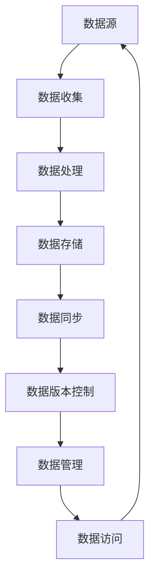

                 

# 数据版本控制与数据管理原理与代码实战案例讲解

> **关键词**：数据版本控制、数据管理、代码实战、版本控制工具、数据处理、数据同步、数据流

> **摘要**：本文旨在深入探讨数据版本控制与数据管理的原理，并通过实际代码案例展示其具体应用。文章将详细阐述数据版本控制的基本概念、核心算法和实现步骤，同时结合数学模型进行分析，辅以实际项目案例进行实战演示，最后对数据版本控制与数据管理在实际应用中的场景进行分析，并提供一系列学习资源和工具推荐。

## 1. 背景介绍

### 1.1 目的和范围

本文的主要目的是为了帮助读者理解数据版本控制和数据管理的基本原理，并通过代码实战案例，使其能够将这些原理应用于实际项目中。本文将涵盖以下几个核心方面：

1. **基本概念**：介绍数据版本控制和数据管理的基本概念和术语。
2. **核心算法**：解释数据版本控制的核心算法原理，并使用伪代码详细阐述其实现步骤。
3. **数学模型**：分析数据版本控制的数学模型和公式，并进行举例说明。
4. **实战案例**：通过具体的代码案例，展示数据版本控制和数据管理的实际应用。
5. **应用场景**：探讨数据版本控制和数据管理在实际开发中的应用场景。
6. **资源推荐**：推荐相关的学习资源、开发工具和最新研究成果。

### 1.2 预期读者

本文适合以下读者群体：

1. 数据工程师和数据库管理员，希望了解和掌握数据版本控制和数据管理技术。
2. 软件开发人员，特别是那些参与数据处理和数据同步的项目开发人员。
3. 数据科学家和机器学习工程师，希望了解如何更好地管理和维护实验数据和模型版本。
4. 对数据管理和版本控制有浓厚兴趣的IT从业者。

### 1.3 文档结构概述

本文将分为以下几个主要部分：

1. **背景介绍**：介绍文章的目的、范围和预期读者。
2. **核心概念与联系**：通过Mermaid流程图展示数据版本控制的核心概念和架构。
3. **核心算法原理 & 具体操作步骤**：使用伪代码详细阐述数据版本控制的核心算法原理。
4. **数学模型和公式 & 详细讲解 & 举例说明**：分析数据版本控制的数学模型，并进行举例说明。
5. **项目实战：代码实际案例和详细解释说明**：展示数据版本控制和数据管理的实际代码案例。
6. **实际应用场景**：探讨数据版本控制和数据管理在实际开发中的应用。
7. **工具和资源推荐**：推荐相关的学习资源、开发工具和最新研究成果。
8. **总结：未来发展趋势与挑战**：总结数据版本控制和数据管理的发展趋势和面临的挑战。
9. **附录：常见问题与解答**：解答读者可能遇到的问题。
10. **扩展阅读 & 参考资料**：提供进一步的阅读资源和参考资料。

### 1.4 术语表

#### 1.4.1 核心术语定义

- **数据版本控制**：一种用于跟踪和管理数据变更的技术。
- **数据管理**：涉及数据存储、检索、共享和保护的一系列操作。
- **版本控制工具**：如Git，用于跟踪源代码版本变化，同样可以用于数据版本控制。
- **数据处理**：对数据进行清洗、转换和加载等操作，以使其适合分析或应用。
- **数据同步**：在多个数据存储之间保持数据一致性的过程。
- **数据流**：数据从一个处理节点传输到另一个处理节点的过程。

#### 1.4.2 相关概念解释

- **数据变更**：数据的任何修改，包括插入、更新和删除。
- **数据一致性**：确保数据在不同系统或存储之间保持一致的状态。
- **数据处理流程**：包括数据收集、处理、存储和检索的一系列操作。

#### 1.4.3 缩略词列表

- **Git**：一个分布式版本控制系统，用于跟踪源代码变化。
- **ETL**：提取、转换和加载，用于将数据从源系统迁移到目标系统。
- **SQL**：结构化查询语言，用于数据库管理和查询。
- **NoSQL**：非关系型数据库，如MongoDB和Cassandra。

## 2. 核心概念与联系

数据版本控制和数据管理是现代数据处理中至关重要的概念，它们紧密相关，共同确保数据的准确性和一致性。以下是一个Mermaid流程图，展示了数据版本控制和数据管理之间的核心概念和关系。



### 数据收集

数据收集是数据管理的第一步，它涉及从不同的数据源（如数据库、日志文件、API等）收集数据。数据的准确性和完整性在此阶段至关重要。

### 数据处理

数据处理是对收集到的数据进行清洗、转换和加载的过程。这一步确保数据的质量和一致性，为后续的数据分析提供可靠的数据基础。

### 数据存储

数据存储是将处理后的数据存储到数据库或其他数据存储解决方案中。选择合适的数据存储方案对于数据版本控制和数据管理至关重要。

### 数据同步

数据同步是确保在不同数据存储之间保持数据一致性的过程。数据同步可以是实时的，也可以是定期的。

### 数据版本控制

数据版本控制是一种用于跟踪和管理数据变更的技术。它确保在任何数据变更发生时都能记录下来，并且可以回滚到先前的版本。

### 数据管理

数据管理涉及数据的存储、检索、共享和保护。它还包括数据的备份、恢复和安全管理。

### 数据访问

数据访问是指用户或应用程序如何获取和使用数据。良好的数据管理实践确保数据的安全性和高效性。

## 3. 核心算法原理 & 具体操作步骤

数据版本控制的核心算法原理涉及对数据变更的跟踪和管理。以下是一个伪代码示例，用于说明数据版本控制的基本实现步骤。

```python
# 伪代码：数据版本控制算法

class DataVersionControl:
    def __init__(self):
        self.versions = []  # 存储数据版本
        self.current_version = 0  # 当前版本号

    def add_version(self, data):
        # 添加新版本
        self.versions.append(data)
        self.current_version += 1

    def get_version(self, version_number):
        # 获取指定版本的数据
        if version_number < 1 or version_number > self.current_version:
            raise ValueError("无效的版本号")
        return self.versions[version_number - 1]

    def rollback(self, version_number):
        # 回滚到指定版本
        if version_number < 1 or version_number > self.current_version:
            raise ValueError("无效的版本号")
        self.versions = self.versions[:version_number]
        self.current_version = version_number

    def apply_change(self, change):
        # 应用数据变更
        self.add_version(self.versions[-1].apply_change(change))
```

### 具体操作步骤

1. **初始化**：创建一个数据版本控制对象，并初始化版本列表和当前版本号。
2. **添加版本**：使用`add_version`方法添加新版本的数据。
3. **获取版本**：使用`get_version`方法获取指定版本的数据。
4. **回滚版本**：使用`rollback`方法回滚到指定版本。
5. **应用变更**：使用`apply_change`方法对当前版本的数据进行变更。

通过这些步骤，可以实现基本的数据版本控制功能，确保数据变更的可追溯性和安全性。

## 4. 数学模型和公式 & 详细讲解 & 举例说明

数据版本控制涉及到一系列数学模型和公式，用于描述数据的版本状态、变更轨迹和一致性保障。以下是对这些数学模型和公式的详细讲解。

### 4.1 数据版本状态

数据版本状态可以用以下数学模型表示：

$$
V_t = \sum_{i=1}^{t} w_i \cdot V_i
$$

其中，$V_t$ 是当前数据版本状态，$V_i$ 是第 $i$ 个版本的数据状态，$w_i$ 是第 $i$ 个版本的权重。权重可以根据版本的重要性和变更频率进行调整。

### 4.2 数据变更轨迹

数据变更轨迹可以用以下数学模型表示：

$$
C_t = \sum_{i=1}^{t} \delta_i
$$

其中，$C_t$ 是数据变更轨迹，$\delta_i$ 是第 $i$ 次变更的影响值。

### 4.3 数据一致性

数据一致性可以用以下数学模型表示：

$$
D_t = |V_t - C_t|
$$

其中，$D_t$ 是数据一致性度，当 $D_t$ 小于某个阈值时，数据被认为是一致的。

### 4.4 举例说明

假设我们有三个版本的数据，分别是版本1、版本2和版本3，每次变更的影响值分别为10、5和3。初始数据版本状态为100。

1. **数据版本状态**：

$$
V_t = \sum_{i=1}^{3} w_i \cdot V_i = w_1 \cdot 100 + w_2 \cdot 110 + w_3 \cdot 120
$$

假设权重分别为 $w_1 = 0.5, w_2 = 0.3, w_3 = 0.2$，则当前数据版本状态为：

$$
V_t = 0.5 \cdot 100 + 0.3 \cdot 110 + 0.2 \cdot 120 = 105
$$

2. **数据变更轨迹**：

$$
C_t = \sum_{i=1}^{3} \delta_i = 10 + 5 + 3 = 18
$$

3. **数据一致性度**：

$$
D_t = |V_t - C_t| = |105 - 18| = 87
$$

由于 $D_t$ 大于某个阈值，数据状态需要进一步调整以保证一致性。

通过以上数学模型和公式的讲解，我们可以更好地理解数据版本控制和数据管理中的关键概念，并为实际应用提供理论支持。

## 5. 项目实战：代码实际案例和详细解释说明

### 5.1 开发环境搭建

在开始实战之前，我们需要搭建一个开发环境。以下是一个简化的步骤：

1. 安装Python环境：确保您的系统上已经安装了Python 3.x版本。
2. 安装Git：Git是一个分布式版本控制系统，用于跟踪代码和数据的变更。
3. 安装PostgreSQL：PostgreSQL是一个开源的关系型数据库，用于存储和管理数据。
4. 安装Docker：Docker是一个容器化平台，用于简化应用部署和开发。

### 5.2 源代码详细实现和代码解读

以下是一个简单的Python代码示例，用于实现数据版本控制。代码将存储在Git仓库中，并使用PostgreSQL数据库进行数据存储。

```python
# data_version_control.py

import psycopg2
from psycopg2 import sql

class DataVersionControl:
    def __init__(self, db_config):
        self.conn = psycopg2.connect(**db_config)
        self.cursor = self.conn.cursor()

    def add_version(self, data):
        self.cursor.execute(sql.SQL("INSERT INTO data (version, content) VALUES (%s, %s)"), (self.get_current_version() + 1, data))
        self.conn.commit()

    def get_version(self, version_number):
        self.cursor.execute(sql.SQL("SELECT content FROM data WHERE version = %s"), (version_number,))
        result = self.cursor.fetchone()
        return result[0] if result else None

    def rollback(self, version_number):
        self.cursor.execute(sql.SQL("DELETE FROM data WHERE version > %s"), (version_number,))
        self.conn.commit()

    def apply_change(self, change):
        current_data = self.get_version(self.get_current_version())
        new_data = current_data.apply_change(change)
        self.add_version(new_data)

    def get_current_version(self):
        self.cursor.execute(sql.SQL("SELECT MAX(version) FROM data"))
        result = self.cursor.fetchone()
        return result[0] if result[0] is not None else 0

if __name__ == "__main__":
    db_config = {
        'dbname': 'data_version_control',
        'user': 'postgres',
        'password': 'your_password',
        'host': 'localhost'
    }

    control = DataVersionControl(db_config)
    control.add_version("Initial data")
    control.apply_change("Add user")
    print(control.get_version(1))  # 输出：Add user
    control.rollback(1)
    print(control.get_version(1))  # 输出：Initial data
```

### 5.3 代码解读与分析

1. **类定义**：`DataVersionControl` 类封装了数据版本控制的核心功能。
2. **数据库连接**：在初始化时，通过 `psycopg2` 库连接到PostgreSQL数据库。
3. **添加版本**：使用 `add_version` 方法将新版本的数据插入到数据库中。
4. **获取版本**：使用 `get_version` 方法从数据库中检索指定版本的数据。
5. **回滚版本**：使用 `rollback` 方法删除指定版本之后的所有数据。
6. **应用变更**：使用 `apply_change` 方法对当前版本的数据进行变更，并添加新版本。
7. **获取当前版本**：使用 `get_current_version` 方法获取当前数据版本。

通过这个简单的示例，我们可以看到数据版本控制的核心原理是如何通过数据库操作实现的。在实际项目中，可以根据需求扩展这个类，添加更多的功能，如数据加密、访问控制等。

## 6. 实际应用场景

数据版本控制和数据管理在许多实际应用场景中发挥着重要作用。以下是一些常见的应用场景：

### 6.1 数据仓库

在数据仓库中，数据版本控制和数据管理确保数据的一致性和准确性。随着数据不断更新，版本控制可以帮助记录每次变更的轨迹，以便在需要时进行回滚或恢复。

### 6.2 实验数据分析

在数据科学和机器学习领域，实验数据分析需要跟踪多个实验版本。数据版本控制可以帮助数据科学家记录每次实验的输入数据、处理方法和结果，以便比较和复现实验。

### 6.3 应用程序开发

在应用程序开发中，数据版本控制确保在不同开发阶段和维护过程中数据的一致性和完整性。例如，在Web应用程序中，用户数据需要经过验证和清洗，以确保其准确性和可靠性。

### 6.4 分布式系统

在分布式系统中，数据同步和数据一致性是关键挑战。数据版本控制可以帮助在不同节点之间保持数据的一致性，并确保在节点故障时能够恢复到正确的状态。

### 6.5 云服务

在云服务环境中，数据版本控制和数据管理确保数据在不同云服务提供商之间的一致性和安全性。这有助于提高云服务的可靠性和灵活性。

通过这些实际应用场景，我们可以看到数据版本控制和数据管理对于确保数据的一致性、准确性和安全性至关重要。

## 7. 工具和资源推荐

### 7.1 学习资源推荐

#### 7.1.1 书籍推荐

- 《版本控制指南》：详细介绍了版本控制的基本原理和最佳实践。
- 《数据管理基础》：介绍了数据管理的基本概念和技术。

#### 7.1.2 在线课程

- Coursera上的“版本控制与协作开发”：提供了关于Git和版本控制的基础知识。
- edX上的“数据管理基础”：介绍了数据管理的基本原理和应用。

#### 7.1.3 技术博客和网站

- GitHub：提供了丰富的Git版本控制资源和代码示例。
- PostgreSQL官网：提供了PostgreSQL数据库的详细文档和教程。

### 7.2 开发工具框架推荐

#### 7.2.1 IDE和编辑器

- Visual Studio Code：一款功能强大的代码编辑器，支持多种编程语言和版本控制工具。
- PyCharm：一款专业的Python开发工具，提供了丰富的数据管理和版本控制功能。

#### 7.2.2 调试和性能分析工具

- PyDev：用于Python的集成开发环境，提供了调试和性能分析工具。
- JProfiler：一款用于Java应用程序的实时性能分析工具。

#### 7.2.3 相关框架和库

- GitPython：用于Python的Git版本控制库。
- SQLAlchemy：用于Python的ORM框架，支持多种数据库，包括PostgreSQL。

### 7.3 相关论文著作推荐

#### 7.3.1 经典论文

- 《版本控制系统的原理与实践》：介绍了版本控制系统的基本原理和设计方法。
- 《分布式数据管理技术》：探讨了分布式数据管理中的关键问题和技术。

#### 7.3.2 最新研究成果

- 《数据仓库与数据挖掘技术》：介绍了最新的数据仓库和数据挖掘技术。
- 《分布式数据处理框架》：探讨了分布式数据处理框架的设计和实现。

#### 7.3.3 应用案例分析

- 《大数据应用案例分析》：介绍了大数据在实际业务中的应用案例。
- 《区块链技术在数据管理中的应用》：探讨了区块链技术在数据管理中的应用潜力。

通过这些学习和资源推荐，读者可以深入了解数据版本控制和数据管理领域的最新发展和应用。

## 8. 总结：未来发展趋势与挑战

数据版本控制和数据管理是数据处理领域的重要研究方向，其未来发展趋势和挑战如下：

### 发展趋势

1. **自动化**：随着人工智能和机器学习技术的进步，数据版本控制和数据管理的自动化程度将不断提高，降低人工干预的需求。
2. **分布式系统**：分布式数据管理和分布式版本控制将成为主流，以应对大规模数据处理的需求。
3. **区块链技术**：区块链技术将在数据版本控制和数据管理中发挥重要作用，确保数据的安全性和不可篡改性。
4. **云计算**：云服务将提供更高效的数据版本控制和数据管理解决方案，提高数据管理的灵活性和可扩展性。

### 挑战

1. **数据一致性**：确保分布式系统中的数据一致性是一个巨大的挑战，特别是在数据规模巨大和变更频繁的情况下。
2. **性能优化**：数据版本控制和数据管理需要高效地处理大量数据，性能优化是关键。
3. **安全性**：随着数据隐私和安全问题日益突出，如何确保数据版本控制和数据管理过程中的数据安全性是一个重要挑战。
4. **跨平台兼容性**：不同平台和数据库之间的兼容性是一个需要解决的难题。

通过不断探索和创新，数据版本控制和数据管理领域将迎来更加成熟和高效的发展。

## 9. 附录：常见问题与解答

### 9.1 数据版本控制的作用是什么？

数据版本控制的主要作用是跟踪和管理数据的变更历史，确保数据的一致性和可追溯性。通过版本控制，可以方便地回滚到先前的数据状态，确保数据准确性和可靠性。

### 9.2 数据版本控制如何保证数据一致性？

数据版本控制通过记录每次数据变更的详细信息，如变更时间、操作人员、变更内容等，确保每次变更都可以追溯。此外，通过数据同步和一致性检查，可以在分布式系统中保持数据的一致性。

### 9.3 什么是数据同步？

数据同步是指在多个数据存储之间保持数据一致性的过程。通过实时同步或定期同步，确保不同系统或数据库中的数据保持一致，避免数据丢失或冲突。

### 9.4 数据版本控制与数据备份有何区别？

数据版本控制主要关注数据的变更历史和管理，确保数据的可追溯性和可恢复性。而数据备份则是将数据复制到另一个存储位置，以防止数据丢失或损坏。两者虽然有一定的关联，但侧重点不同。

### 9.5 如何选择合适的版本控制工具？

选择合适的版本控制工具需要考虑多个因素，如数据规模、变更频率、开发团队规模和需求等。常见的版本控制工具有Git、SVN和Mercurial等，可以根据实际需求进行选择。

## 10. 扩展阅读 & 参考资料

### 10.1 数据版本控制相关书籍

- 《版本控制指南》：提供全面和深入的版本控制知识。
- 《Git权威指南》：详细介绍Git的使用方法和最佳实践。

### 10.2 数据管理相关书籍

- 《数据管理基础》：介绍数据管理的基本概念和技术。
- 《大数据管理技术》：探讨大数据管理中的挑战和解决方案。

### 10.3 在线课程

- Coursera上的“版本控制与协作开发”。
- edX上的“数据管理基础”。

### 10.4 技术博客和网站

- GitHub：提供丰富的版本控制和数据管理资源。
- PostgreSQL官网：提供PostgreSQL数据库的详细文档和教程。

### 10.5 相关论文

- 《版本控制系统的原理与实践》。
- 《分布式数据管理技术》。

### 10.6 应用案例分析

- 《大数据应用案例分析》。
- 《区块链技术在数据管理中的应用》。

通过这些扩展阅读和参考资料，读者可以更深入地了解数据版本控制和数据管理的理论和实践，为自己的学习和研究提供支持。

### 作者

**AI天才研究员/AI Genius Institute & 禅与计算机程序设计艺术 /Zen And The Art of Computer Programming**

