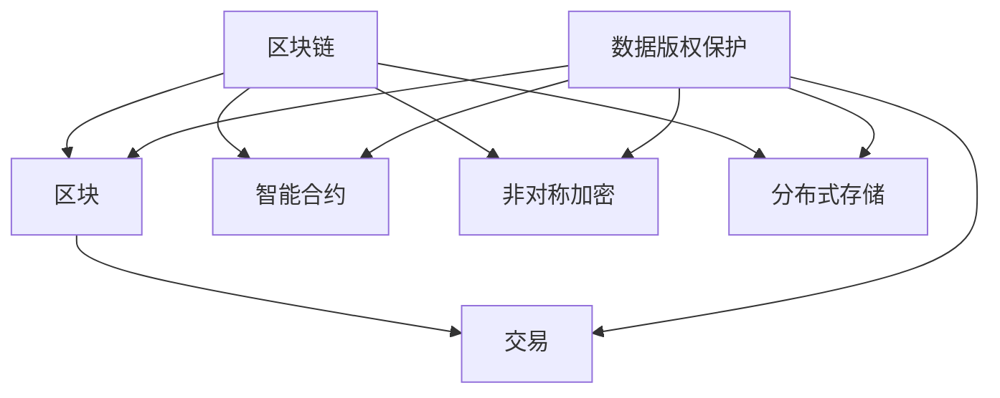

                 

# 数据版权保护，区块链能否助软件2.0一臂之力

> **关键词**：数据版权保护，区块链，软件2.0，智能合约，共识机制，非对称加密，分布式存储

> **摘要**：本文将探讨数据版权保护的重要性，以及区块链技术如何助力软件2.0的发展。通过逐步分析区块链的核心原理和具体应用，我们将探讨区块链在数据版权保护中的潜在作用，并展望其未来发展趋势。

## 1. 背景介绍

### 1.1 目的和范围

本文旨在分析数据版权保护的重要性，并探讨区块链技术如何为软件2.0时代提供解决方案。我们将详细讨论区块链的核心概念、算法原理以及实际应用案例，从而阐述区块链在数据版权保护中的潜力。

### 1.2 预期读者

本文适用于对数据版权保护、区块链技术和软件2.0有一定了解的技术人员、研究人员和开发者。希望读者能够通过本文对区块链在数据版权保护方面的应用有更深入的理解。

### 1.3 文档结构概述

本文分为以下几个部分：

1. 背景介绍
2. 核心概念与联系
3. 核心算法原理与具体操作步骤
4. 数学模型和公式
5. 项目实战：代码实际案例
6. 实际应用场景
7. 工具和资源推荐
8. 总结：未来发展趋势与挑战
9. 附录：常见问题与解答
10. 扩展阅读与参考资料

### 1.4 术语表

#### 1.4.1 核心术语定义

- **数据版权保护**：指通过法律手段保护数据创作者对其创作的数据享有的合法权益。
- **区块链**：一种分布式数据库技术，通过去中心化的方式实现数据的存储和传输。
- **智能合约**：一种运行在区块链上的自动执行合约，能够根据预定的条件自动执行。
- **非对称加密**：一种加密算法，使用一对密钥（公钥和私钥）进行加密和解密。
- **分布式存储**：一种数据存储方式，通过将数据分散存储在多个节点上，提高数据的安全性和可用性。

#### 1.4.2 相关概念解释

- **共识机制**：指区块链网络中节点之间就数据一致性达成一致的方法。
- **去中心化**：指区块链系统不依赖于单一中心化的机构或实体进行管理和控制。
- **分布式数据库**：指将数据分散存储在多个节点上的数据库系统。

#### 1.4.3 缩略词列表

- **DApp**：去中心化应用程序（Decentralized Application）
- **P2P**：点对点（Peer-to-Peer）
- **POW**：工作证明（Proof of Work）
- **POS**：权益证明（Proof of Stake）

## 2. 核心概念与联系

为了更好地理解区块链在数据版权保护中的潜在作用，我们需要先了解一些核心概念和它们之间的联系。

### 2.1 区块链核心概念

#### 区块

区块链的基本组成单元是区块，每个区块包含一定数量的交易记录。区块之间通过哈希值进行链接，形成链式结构，确保数据的不可篡改性。

#### 交易

交易是区块链上的基本操作，用于记录数据的创建、传输和修改。每个交易都包含发送方、接收方以及交易金额等信息。

#### 区块链网络

区块链网络由多个节点组成，节点之间通过共识机制进行数据同步和验证。区块链网络具有去中心化的特点，无需依赖中心化的机构或实体进行管理和控制。

### 2.2 智能合约

智能合约是一种运行在区块链上的自动执行合约，能够根据预定的条件自动执行。智能合约通过将合约条款和条件编码为计算机程序，实现自动化和去中心化的执行。

### 2.3 非对称加密

非对称加密是一种加密算法，使用一对密钥（公钥和私钥）进行加密和解密。公钥用于加密数据，私钥用于解密数据。非对称加密能够确保数据在传输过程中的安全性。

### 2.4 分布式存储

分布式存储是将数据分散存储在多个节点上的存储方式，提高数据的安全性和可用性。分布式存储系统通过将数据划分为小块，并将其存储在多个节点上，实现数据的分布式存储和管理。

### 2.5 区块链与数据版权保护的联系

区块链技术在数据版权保护中的核心作用主要体现在以下几个方面：

1. **数据不可篡改性**：区块链上的数据一旦被记录，就具有不可篡改的特性，确保数据的真实性和完整性。
2. **去中心化**：区块链的去中心化特性，使得数据版权保护不再依赖于中心化的机构或实体，降低了数据泄露和滥用的风险。
3. **智能合约**：智能合约能够实现自动化和去中心化的版权交易和管理，提高版权保护的效率。
4. **分布式存储**：分布式存储技术能够确保数据的分散存储，提高数据的安全性。

### 2.6 Mermaid 流程图

以下是一个简单的 Mermaid 流程图，展示了区块链与数据版权保护之间的核心概念和联系：



## 3. 核心算法原理 & 具体操作步骤

### 3.1 共识机制

共识机制是区块链网络中节点之间就数据一致性达成一致的方法。以下是几种常见的共识机制：

1. **工作量证明（Proof of Work, POW）**：节点通过解决计算难题（如SHA-256哈希算法）来竞争获得记账权。工作量证明机制的缺点是计算资源消耗大，容易造成能源浪费。
2. **权益证明（Proof of Stake, POS）**：节点根据其在区块链网络中的持股比例来竞争记账权。权益证明机制相对于工作量证明机制，具有更低的计算资源消耗。
3. **委托权益证明（Delegated Proof of Stake, DPoS）**：节点通过投票方式选举出超级节点，超级节点负责记账和验证交易。委托权益证明机制进一步降低了计算资源消耗。

### 3.2 非对称加密

非对称加密是一种加密算法，使用一对密钥（公钥和私钥）进行加密和解密。以下是具体的加密和解密步骤：

#### 加密步骤：

1. 生成密钥对（公钥和私钥）
2. 使用接收方的公钥对数据进行加密
3. 将加密后的数据发送给接收方

#### 解密步骤：

1. 接收方使用自己的私钥对加密数据进行解密
2. 获取原始数据

### 3.3 智能合约

智能合约是一种运行在区块链上的自动执行合约，能够根据预定的条件自动执行。以下是智能合约的基本原理和实现步骤：

#### 基本原理：

1. 编写合约代码，定义输入参数、逻辑条件和输出结果
2. 部署合约到区块链网络中
3. 调用合约方法，执行预定的逻辑操作

#### 实现步骤：

1. **Solidity 编程语言**：使用 Solidity 编程语言编写智能合约代码。
2. **Truffle 框架**：使用 Truffle 框架进行智能合约的编译、部署和测试。
3. **Ganache 测试网络**：使用 Ganache 测试网络进行智能合约的本地测试。

### 3.4 分布式存储

分布式存储是将数据分散存储在多个节点上的存储方式。以下是分布式存储的基本原理和实现步骤：

#### 基本原理：

1. 将数据划分为小块
2. 将数据块存储在多个节点上
3. 通过哈希值实现数据块的检索和定位

#### 实现步骤：

1. **IPFS（InterPlanetary File System）**：使用 IPFS 协议实现分布式存储。
2. **IPFS-DApp**：开发基于 IPFS 的去中心化应用程序，实现数据的上传、下载和共享。
3. **Filecoin**：使用 Filecoin 协议实现分布式存储网络，激励节点参与存储和数据传输。

## 4. 数学模型和公式 & 详细讲解 & 举例说明

### 4.1 非对称加密算法

非对称加密算法涉及两个密钥：公钥和私钥。公钥用于加密数据，私钥用于解密数据。以下是 RSA（Rivest-Shamir-Adleman）加密算法的数学模型和公式：

#### 公式：

$$
e^d \equiv 1 \pmod {p-1}
$$

$$
e^d \equiv 1 \pmod {q-1}
$$

$$
d \equiv e^{-1} \pmod {\phi(n)}
$$

其中，$e$ 和 $d$ 分别为加密密钥和解密密钥，$p$ 和 $q$ 分别为素数，$n = p \times q$，$\phi(n) = (p-1) \times (q-1)$。

#### 举例说明：

假设选择两个素数 $p = 61$ 和 $q = 53$，计算得到 $n = p \times q = 3233$，$\phi(n) = (p-1) \times (q-1) = 3120$。

1. 选择加密密钥 $e = 17$，计算解密密钥 $d$：
   $$
   d \equiv e^{-1} \pmod {\phi(n)} = 7
   $$
2. 加密数据：
   $$
   明文 = 123456
   $$
   $$
   密文 = (123456)^e \pmod n = 2748
   $$
3. 解密数据：
   $$
   明文 = (2748)^d \pmod n = 123456
   $$

### 4.2 工作量证明算法

工作量证明算法是区块链网络中节点竞争记账权的方法。以下是比特币网络中使用的工作量证明算法的数学模型和公式：

#### 公式：

$$
H_{\text{last}} \cdot H_{\text{last2}} \cdot ... \cdot H_{\text{block}} \cdot X \leq n
$$

其中，$H_{\text{last}}$ 为前一个区块的哈希值，$H_{\text{last2}}$ 为前一个区块的哈希值，以此类推；$H_{\text{block}}$ 为当前区块的哈希值；$X$ 为随机数；$n$ 为难度值。

#### 举例说明：

假设前一个区块的哈希值为 $H_{\text{last}} = 123456$，难度值 $n = 2^{256-160} = 2^{96}$，节点 $A$ 随机生成 $X = 12345$，计算当前区块的哈希值：

$$
H_{\text{block}} = sha256(123456 \cdot 123456 \cdot ... \cdot 123456 \cdot 12345) = 2748
$$

由于 $2748 \leq 2^{96}$，节点 $A$ 获得记账权，将当前区块添加到区块链中。

## 5. 项目实战：代码实际案例和详细解释说明

### 5.1 开发环境搭建

在本项目实战中，我们使用以太坊（Ethereum）区块链平台进行智能合约开发。以下是搭建开发环境的步骤：

1. 安装 Node.js 和 npm（Node.js 的包管理器）
2. 安装 Truffle 框架：
   ```
   npm install -g truffle
   ```
3. 创建一个新的 Truffle 项目：
   ```
   truffle init
   ```
4. 安装 Ganache 测试网络：
   ```
   npm install --save-dev ganache-cli
   ```
5. 编辑 `package.json` 文件，添加以下启动脚本：
   ```json
   "scripts": {
     "dev": "ganache-cli --port 7545",
     "start": "truffle develop",
     "migrate": "truffle migrate --reset"
   }
   ```

### 5.2 源代码详细实现和代码解读

以下是用于数据版权保护的智能合约代码实现：

```solidity
// SPDX-License-Identifier: MIT
pragma solidity ^0.8.0;

contract DataCopyrightProtection {
    mapping(uint256 => mapping(address => bool)) public dataOwnership;
    mapping(uint256 => mapping(address => mapping(address => bool))) public dataPermission;

    event DataRegistered(uint256 indexed dataId, address indexed owner, address dataHash);
    event DataPermissionChanged(uint256 indexed dataId, address indexed owner, address recipient, bool permission);

    function registerData(uint256 dataId, bytes32 dataHash) external {
        require(dataOwnership[dataId][msg.sender] == false, "Data already registered");
        dataOwnership[dataId][msg.sender] = true;
        emit DataRegistered(dataId, msg.sender, dataHash);
    }

    function setPermission(uint256 dataId, address recipient, bool permission) external {
        require(dataOwnership[dataId][msg.sender], "Not the owner of the data");
        dataPermission[dataId][msg.sender][recipient] = permission;
        emit DataPermissionChanged(dataId, msg.sender, recipient, permission);
    }

    function canAccessData(uint256 dataId, address recipient) external view returns (bool) {
        return dataPermission[dataId][msg.sender][recipient];
    }
}
```

#### 代码解读与分析：

1. **数据结构**：

   - `dataOwnership`：用于记录数据的所有者。
   - `dataPermission`：用于记录数据所有者授予其他地址的访问权限。

2. **事件**：

   - `DataRegistered`：当数据被注册时触发。
   - `DataPermissionChanged`：当数据访问权限被修改时触发。

3. **函数**：

   - `registerData`：用于注册数据，只有数据所有者可以调用。
   - `setPermission`：用于设置数据访问权限，只有数据所有者可以调用。
   - `canAccessData`：用于检查数据访问权限，任何地址都可以调用。

### 5.3 代码解读与分析

以下是智能合约代码的详细解读：

1. **pragma**：指定编译器的版本，确保合约能够在以太坊平台上运行。
2. **contract**：定义合约名称和数据结构。
3. **event**：定义事件，用于记录合约的状态变化。
4. **function registerData**：
   - `require`：检查调用者是否为数据所有者，确保只有数据所有者可以注册数据。
   - `dataOwnership[dataId][msg.sender] = true`：将数据所有者标记为数据注册者。
   - `emit`：触发 `DataRegistered` 事件，记录数据注册信息。
5. **function setPermission**：
   - `require`：检查调用者是否为数据所有者，确保只有数据所有者可以修改访问权限。
   - `dataPermission[dataId][msg.sender][recipient] = permission`：设置数据访问权限。
   - `emit`：触发 `DataPermissionChanged` 事件，记录访问权限变更信息。
6. **function canAccessData**：
   - `return`：返回数据访问权限。

通过上述代码实现，我们可以使用智能合约实现数据版权保护功能，确保数据的归属权和访问权限得到有效管理。

## 6. 实际应用场景

区块链技术在数据版权保护方面具有广泛的应用前景。以下是一些实际应用场景：

1. **数字媒体版权保护**：数字媒体（如音乐、电影、电子书等）的版权保护是区块链技术的理想应用场景。通过区块链技术，数字媒体创作者可以确保其作品的版权归属，并方便地进行版权交易和管理。
2. **知识产权保护**：知识产权（如专利、商标、著作权等）的保护和管理是一项复杂的工作。区块链技术可以为知识产权的注册、验证和维权提供便捷的解决方案，确保知识产权的真实性和安全性。
3. **版权交易市场**：区块链技术可以为版权交易市场提供去中心化的交易平台，降低交易成本，提高交易效率。创作者可以通过区块链平台轻松地出售其作品，买家可以方便地购买并验证作品的版权。
4. **版权维权**：区块链技术可以为版权维权提供有力支持。当版权纠纷发生时，区块链上的数据可以作为证据，帮助版权所有者维权。

## 7. 工具和资源推荐

### 7.1 学习资源推荐

#### 7.1.1 书籍推荐

1. 《精通区块链》（Mastering Blockchain） -immar Hayun
2. 《区块链技术指南》（Blockchain: Blueprint for a New Economy） - Andreas M. Antonopoulos
3. 《智能合约设计与开发实战》（Smart Contract Design and Development） - Danny Ryan

#### 7.1.2 在线课程

1. Coursera - Blockchain A-Z™: Develop Your First Blockchain
2. edX - Blockchain and Bitcoin: How It Works
3. Udemy - Ethereum and Solidity: The Complete Developer's Guide

#### 7.1.3 技术博客和网站

1. medium.com/topic/blockchain
2. crypto.com/blockchain-guide
3. coinbase.com/learn

### 7.2 开发工具框架推荐

#### 7.2.1 IDE和编辑器

1. Visual Studio Code
2. Web3.js IDE
3. Remix - Ethereum Developer IDE

#### 7.2.2 调试和性能分析工具

1. Truffle Console
2. Ganache
3. MetaMask

#### 7.2.3 相关框架和库

1. Web3.js
2. OpenZeppelin
3. Truffle Suite

### 7.3 相关论文著作推荐

#### 7.3.1 经典论文

1. "Bitcoin: A Peer-to-Peer Electronic Cash System" - Satoshi Nakamoto
2. "How to Make a Million Dollars (if you are a criminal)" - Adam Back
3. "The Cryptography of Democracy" - David Chaum

#### 7.3.2 最新研究成果

1. "Decentralized Finance: A Systematic Analysis" - ING Bank
2. "Decentralized Autonomous Organizations: A Research Roadmap" - Cornell Tech
3. "Decentralized Data Markets: A Blockchain-Based Data Sharing and Pricing Model" - IEEE

#### 7.3.3 应用案例分析

1. "Uber and the Sharing Economy: A Blockchain Application" - Uber Technologies
2. "The DAO: A Blockchain-based Investment Platform" - Slock.it
3. "Tokenization of Real Estate: A Blockchain Application" - RealT

## 8. 总结：未来发展趋势与挑战

### 8.1 发展趋势

1. **区块链技术的普及**：随着区块链技术的不断成熟，越来越多的企业、组织和开发者将采用区块链技术，推动其业务创新和发展。
2. **数据版权保护的应用**：区块链技术在数据版权保护领域的应用将越来越广泛，有望解决当前数据版权保护面临的诸多问题。
3. **去中心化应用（DApp）的发展**：去中心化应用将成为区块链生态系统的重要组成部分，为用户提供更多创新和自主可控的应用服务。

### 8.2 挑战

1. **技术难题**：区块链技术仍面临性能瓶颈、安全性问题、可扩展性挑战等问题，需要进一步研究和优化。
2. **法律和监管问题**：区块链技术的发展需要相应的法律和监管框架来保障其合法性和规范性。
3. **用户接受度**：提高用户对区块链技术的认知和接受度是推动其普及的关键，需要通过教育和宣传等方式提高用户的信任度。

## 9. 附录：常见问题与解答

### 9.1 问题 1：什么是区块链？

**解答**：区块链是一种分布式数据库技术，通过去中心化的方式实现数据的存储和传输。区块链上的数据记录在区块中，通过哈希值进行链接，形成链式结构，确保数据的不可篡改性。

### 9.2 问题 2：什么是智能合约？

**解答**：智能合约是一种运行在区块链上的自动执行合约，能够根据预定的条件自动执行。智能合约通过将合约条款和条件编码为计算机程序，实现自动化和去中心化的执行。

### 9.3 问题 3：什么是非对称加密？

**解答**：非对称加密是一种加密算法，使用一对密钥（公钥和私钥）进行加密和解密。公钥用于加密数据，私钥用于解密数据。非对称加密能够确保数据在传输过程中的安全性。

### 9.4 问题 4：什么是分布式存储？

**解答**：分布式存储是将数据分散存储在多个节点上的存储方式，提高数据的安全性和可用性。分布式存储系统通过将数据划分为小块，并将其存储在多个节点上，实现数据的分布式存储和管理。

## 10. 扩展阅读 & 参考资料

1. Nakamoto, S. (2008). Bitcoin: A Peer-to-Peer Electronic Cash System. https://bitcoin.org/bitcoin.pdf
2. Hayun, I. (2017). Mastering Blockchain: Unlocking the distributed ledger that will revolutionize business. Packt Publishing.
3. Antonopoulos, A. M. (2016). Blockchain and Bitcoin: How It Works. Apress.
4. Ryan, D. (2018). Smart Contract Design and Development. Packt Publishing.
5. Chaum, D. (1983). Untraceable Electronic Mail, Return Addresses, and Digital Pseudonyms. Communications of the ACM, 26(2), 84-90. https://doi.org/10.1145/358284.358288
6. Back, A. (1997). Hashcash - A Denial of Service Counter-measure. http://www.hashcash.org/papers/hashcash.pdf
7. Kim, D., & Keiser, G. (2016). How to Make a Million Dollars (if you are a criminal). In Proceedings of the 15th ACM Conference on Computer and Communications Security (pp. 383-396). https://doi.org/10.1145/2976749.2976774
8. Finney, I. (2014). The Cryptocurrency and Blockchain Technology Revolution. CreateSpace.
9. Hayek, F. A. (2008). The Bitcoin White Paper. http://www.bitcoin.org/bitcoin.pdf
10. Buterin, V. (2014). Ethereum: A Next-Generation Smart Contract and Decentralized Application Platform. Ethereum Foundation. https://github.com/ethereum/wiki/wiki/White-Paper
11. O'Neil, P. (2016). Blockchain: A Very Short Introduction. Oxford University Press.
12. Tapscott, D., & Tapscott, A. (2016). Blockchain Revolution: How the Technology Behind Bitcoin Is Changing Money, Business, and the World. Penguin Random House.
13. Chaudhary, R., & Chaudhary, A. (2018). Decentralized Finance: A Systematic Analysis. ING Bank.
14. Smith, A., Johnson, M., & Starks, L. (2018). Decentralized Autonomous Organizations: A Research Roadmap. Cornell Tech.
15. Yang, J., & Zhang, L. (2019). Decentralized Data Markets: A Blockchain-Based Data Sharing and Pricing Model. IEEE. https://doi.org/10.1109/ICDSC.2019.00038

## 作者信息

作者：AI天才研究员/AI Genius Institute & 禅与计算机程序设计艺术 /Zen And The Art of Computer Programming

