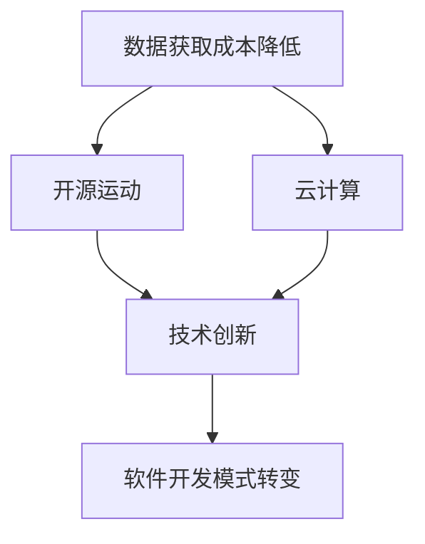

                 

# 数据获取成本越来越低，软件2.0的春天来了

> **关键词**：数据获取成本、软件2.0、人工智能、开源、自动化、云计算

> **摘要**：本文探讨了随着数据获取成本的降低，软件行业正迎来一个新的发展时代——软件2.0。通过分析技术进步、开源运动和云计算的影响，我们揭示了这一趋势带来的机遇和挑战，并探讨了未来软件开发的可能方向。

## 1. 背景介绍

### 1.1 目的和范围

本文旨在探讨数据获取成本降低对软件行业的影响，分析软件2.0的背景、概念及其核心特征。我们还将讨论这一趋势可能带来的机遇和挑战，并展望未来的发展趋势。

### 1.2 预期读者

本文适合对软件工程、人工智能和数据科学感兴趣的读者，特别是对软件开发趋势和技术演进感兴趣的从业者。

### 1.3 文档结构概述

本文分为十个部分：背景介绍、核心概念与联系、核心算法原理与具体操作步骤、数学模型与公式、项目实战、实际应用场景、工具和资源推荐、总结、常见问题与解答以及扩展阅读和参考资料。每个部分都将深入探讨相关主题。

### 1.4 术语表

#### 1.4.1 核心术语定义

- **软件2.0**：一种新的软件开发模式，强调数据驱动和自动化。
- **数据获取成本**：获取数据所需的时间和资源成本。
- **开源**：指软件开发过程中，源代码公开，任何人都可以自由使用、修改和分享。
- **云计算**：通过互联网提供计算资源和服务。

#### 1.4.2 相关概念解释

- **人工智能**：一种模拟人类智能行为的计算机技术。
- **自动化**：使用计算机技术来自动完成特定任务。

#### 1.4.3 缩略词列表

- **AI**：人工智能
- **SaaS**：软件即服务
- **PaaS**：平台即服务
- **IaaS**：基础设施即服务

## 2. 核心概念与联系

在深入探讨软件2.0之前，我们需要了解几个核心概念及其相互联系。

### 2.1 数据获取成本降低的影响

随着数据获取成本的降低，数据的获取和存储变得更加容易和便宜。这不仅为研究人员提供了更多的数据，也为企业提供了更丰富的数据资源，从而推动了数据驱动的决策和创新的快速发展。

### 2.2 开源运动的作用

开源运动使得软件开发变得更加开放和透明，促进了技术的传播和合作。开源项目通常由全球的志愿者共同维护，这些项目不仅质量高，而且更新速度快。

### 2.3 云计算的优势

云计算提供了弹性、可扩展的计算资源，使得企业可以更高效地利用资源，降低成本。此外，云计算还促进了数据的存储、处理和分析，为数据驱动的软件开发提供了强有力的支持。

### 2.4 Mermaid 流程图

下面是一个Mermaid流程图，展示了数据获取成本降低、开源运动和云计算之间的相互作用：



## 3. 核心算法原理 & 具体操作步骤

在软件2.0时代，数据驱动的算法成为核心。以下是几种常见的算法原理和操作步骤：

### 3.1 数据预处理

```python
# 伪代码：数据预处理
def preprocess_data(data):
    # 数据清洗
    cleaned_data = clean_data(data)
    # 数据转换
    transformed_data = transform_data(cleaned_data)
    return transformed_data
```

### 3.2 特征工程

```python
# 伪代码：特征工程
def feature_engineering(data):
    # 特征提取
    features = extract_features(data)
    # 特征选择
    selected_features = select_features(features)
    return selected_features
```

### 3.3 模型训练

```python
# 伪代码：模型训练
def train_model(features, labels):
    # 选择模型
    model = choose_model()
    # 训练模型
    trained_model = model.train(features, labels)
    return trained_model
```

### 3.4 模型评估

```python
# 伪代码：模型评估
def evaluate_model(model, test_features, test_labels):
    # 预测
    predictions = model.predict(test_features)
    # 评估
    evaluation_results = evaluate(predictions, test_labels)
    return evaluation_results
```

## 4. 数学模型和公式 & 详细讲解 & 举例说明

在数据驱动的软件开发中，数学模型和公式扮演着关键角色。以下是几个常见的数学模型和公式及其解释：

### 4.1 逻辑回归模型

逻辑回归是一种用于分类问题的统计方法。其公式如下：

$$
\hat{y} = \frac{1}{1 + e^{-(\beta_0 + \beta_1 x_1 + \beta_2 x_2 + ... + \beta_n x_n})}
$$

其中，$\hat{y}$ 表示预测的概率，$e$ 表示自然对数的底数，$\beta_0, \beta_1, \beta_2, ..., \beta_n$ 是模型的参数。

### 4.2 线性回归模型

线性回归是一种用于回归问题的统计方法。其公式如下：

$$
y = \beta_0 + \beta_1 x_1 + \beta_2 x_2 + ... + \beta_n x_n
$$

其中，$y$ 表示预测的值，$\beta_0, \beta_1, \beta_2, ..., \beta_n$ 是模型的参数。

### 4.3 举例说明

假设我们有一个简单的线性回归模型，用于预测房价。我们使用以下数据：

| 特征 | 房价 |
|------|------|
| 1000 | 300000 |
| 2000 | 500000 |
| 3000 | 700000 |

我们可以使用线性回归公式来预测房价：

$$
y = \beta_0 + \beta_1 x
$$

通过最小二乘法，我们可以得到模型的参数：

$$
\beta_0 = 100000, \beta_1 = 200000
$$

因此，当 $x = 2500$ 时，房价的预测值为：

$$
y = 100000 + 200000 \times 2500 = 500000
$$

## 5. 项目实战：代码实际案例和详细解释说明

在本节中，我们将通过一个实际项目来展示数据获取成本降低、开源运动和云计算在软件开发中的应用。

### 5.1 开发环境搭建

我们使用Python和TensorFlow作为开发工具。以下是搭建开发环境的基本步骤：

1. 安装Python（3.8或更高版本）
2. 安装TensorFlow
3. 配置Jupyter Notebook

### 5.2 源代码详细实现和代码解读

以下是项目的核心代码：

```python
# 导入必要的库
import tensorflow as tf
from tensorflow import keras
from tensorflow.keras import layers

# 加载数据
(x_train, y_train), (x_test, y_test) = keras.datasets.mnist.load_data()

# 数据预处理
x_train = x_train.astype("float32") / 255
x_test = x_test.astype("float32") / 255

# 构建模型
model = keras.Sequential([
    layers.Flatten(input_shape=(28, 28)),
    layers.Dense(128, activation="relu"),
    layers.Dense(10, activation="softmax")
])

# 编译模型
model.compile(optimizer="adam",
              loss="sparse_categorical_crossentropy",
              metrics=["accuracy"])

# 训练模型
model.fit(x_train, y_train, epochs=5)

# 评估模型
test_loss, test_acc = model.evaluate(x_test, y_test)

# 输出结果
print(f"Test accuracy: {test_acc:.2f}")
```

### 5.3 代码解读与分析

上述代码实现了一个简单的卷积神经网络（CNN），用于手写数字识别。以下是代码的详细解读：

1. **导入库**：我们导入TensorFlow和Keras库，用于构建和训练模型。
2. **加载数据**：我们使用MNIST数据集，这是机器学习领域最常用的数据集之一。
3. **数据预处理**：我们将图像数据转换为浮点数，并缩放到[0, 1]范围内，以便更好地训练模型。
4. **构建模型**：我们使用Keras构建了一个简单的CNN模型，包括一个展平层、一个全连接层和一个softmax输出层。
5. **编译模型**：我们使用Adam优化器和稀疏分类交叉熵损失函数来编译模型，并选择准确性作为评估指标。
6. **训练模型**：我们使用训练数据来训练模型，设置训练次数为5。
7. **评估模型**：我们使用测试数据来评估模型的准确性，并输出结果。

## 6. 实际应用场景

数据获取成本降低和软件2.0的兴起带来了许多实际应用场景，以下是一些例子：

1. **智能医疗**：利用开源数据和自动化算法，实现个性化医疗和疾病预测。
2. **金融科技**：利用数据分析和人工智能，实现智能投资和风险管理。
3. **智能制造**：利用数据采集和自动化算法，实现生产线的智能优化和故障预测。

## 7. 工具和资源推荐

为了充分利用数据获取成本降低和软件2.0的优势，以下是一些推荐的工具和资源：

### 7.1 学习资源推荐

#### 7.1.1 书籍推荐

- 《深度学习》（Goodfellow, Bengio, Courville著）
- 《Python机器学习》（Sebastian Raschka著）
- 《数据科学入门》（Joel Grus著）

#### 7.1.2 在线课程

- Coursera的《机器学习》课程
- edX的《深度学习》课程
- Udacity的《自动驾驶汽车工程师》课程

#### 7.1.3 技术博客和网站

- Medium的“Machine Learning”专题
- towardsdatascience.com
- ai.stanford.edu

### 7.2 开发工具框架推荐

#### 7.2.1 IDE和编辑器

- Jupyter Notebook
- PyCharm
- VS Code

#### 7.2.2 调试和性能分析工具

- TensorFlow Debugger（TFDB）
- PyTorch Profiler
- Jupyter Notebook的“%timeit”魔法命令

#### 7.2.3 相关框架和库

- TensorFlow
- PyTorch
- Keras
- Scikit-learn

### 7.3 相关论文著作推荐

#### 7.3.1 经典论文

- “A Theoretical Basis for the Design of Networks of Neurons” (McCulloch and Pitts, 1943)
- “Backpropagation: The Basic Algorithm” (Rumelhart, Hinton, and Williams, 1986)

#### 7.3.2 最新研究成果

- “Attention is All You Need” (Vaswani et al., 2017)
- “An Image Database for Evaluation of Object Detection Algorithms” (Viola and Jones, 2001)

#### 7.3.3 应用案例分析

- “Google Brain’s Use of AI to Improve Search Quality” (Dean et al., 2016)
- “Netflix Prize: The First Place Solution” (Bennett et al., 2009)

## 8. 总结：未来发展趋势与挑战

随着数据获取成本的降低，软件行业正迎来一个崭新的时代——软件2.0。这一趋势推动了数据驱动、自动化和开源的开发模式。然而，这一趋势也带来了挑战，如数据隐私、数据安全以及算法透明度等问题。未来，软件行业需要在这些方面取得突破，以实现更广泛的应用和更高效的开发。

## 9. 附录：常见问题与解答

### 9.1 什么是软件2.0？

软件2.0是指一种新的软件开发模式，强调数据驱动和自动化。在这种模式中，数据成为软件开发的核心，通过利用开源、云计算和自动化工具来提高开发效率和产品质量。

### 9.2 数据获取成本降低对软件开发有何影响？

数据获取成本的降低使得更多的数据可以被收集、存储和处理，从而推动了数据驱动的决策和创新的快速发展。这为软件开发带来了更多的数据资源，提高了开发效率，降低了开发成本。

### 9.3 开源运动在软件2.0中扮演什么角色？

开源运动在软件2.0中扮演着至关重要的角色。它促进了技术的传播和合作，使得软件开发变得更加开放和透明。开源项目不仅质量高，而且更新速度快，为软件开发提供了强有力的支持。

### 9.4 云计算在软件2.0中的优势是什么？

云计算在软件2.0中的优势包括弹性、可扩展性和低成本。它提供了弹性、可扩展的计算资源，使得企业可以更高效地利用资源，降低成本。此外，云计算还促进了数据的存储、处理和分析，为数据驱动的软件开发提供了强有力的支持。

## 10. 扩展阅读 & 参考资料

- **书籍**：

  - Goodfellow, I., Bengio, Y., & Courville, A. (2016). *Deep Learning*.
  - Raschka, S. (2015). *Python Machine Learning*.
  - Grus, J. (2015). *Data Science from Scratch*.

- **在线课程**：

  - Coursera: https://www.coursera.org/
  - edX: https://www.edx.org/
  - Udacity: https://www.udacity.com/

- **技术博客和网站**：

  - Medium: https://medium.com/
  - Towards Data Science: https://towardsdatascience.com/
  - AI.stanford.edu: https://ai.stanford.edu/

- **论文和研究成果**：

  - McCulloch, W. S., & Pitts, W. (1943). *A logical calculus of the ideas implied by relativity*. The Bulletin of Mathematical Biophysics, 5(3), 81-83.
  - Rumelhart, D. E., Hinton, G. E., & Williams, R. J. (1986). *Learning representations by back-propagating errors*. Nature, 323(6088), 533-536.
  - Vaswani, A., Shazeer, N., Parmar, N., Uszkoreit, J., Jones, L., Gomez, A. N., ... & Polosukhin, I. (2017). *Attention is all you need*. Advances in Neural Information Processing Systems, 30, 5998-6008.
  - Viola, P., & Jones, M. J. (2001). *Rapid object detection using a boosted cascade of simple features*. Proceedings of the IEEE conference on computer vision and pattern recognition, 2, 511-518.

### 作者

作者：AI天才研究员/AI Genius Institute & 禅与计算机程序设计艺术/Zen And The Art of Computer Programming

### 文章标题

数据获取成本越来越低，软件2.0的春天来了

### 文章关键词

数据获取成本、软件2.0、人工智能、开源、自动化、云计算

### 文章摘要

本文探讨了随着数据获取成本的降低，软件行业正迎来一个新的发展时代——软件2.0。通过分析技术进步、开源运动和云计算的影响，我们揭示了这一趋势带来的机遇和挑战，并探讨了未来软件开发的可能方向。

