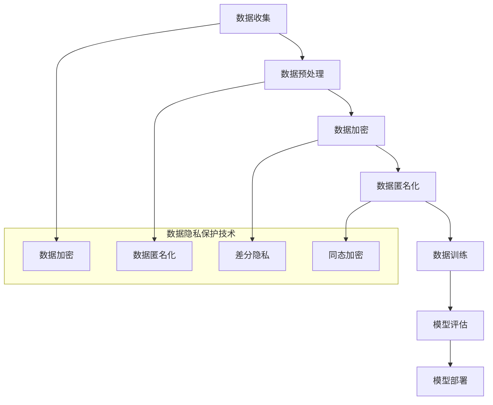

                 

# 数据隐私与AI大模型：如何在创新与合规间平衡

> **关键词：** 数据隐私、AI大模型、合规、平衡、创新、安全措施、技术挑战、法律法规。

> **摘要：** 本文章将探讨数据隐私与AI大模型之间的相互关系，分析如何在AI技术的发展与创新的同时，确保个人数据的合规性和隐私保护。文章将详细解析核心概念，介绍现有的技术措施和法律法规，并通过实际案例展示如何在项目中实施这些措施，最后提出未来的发展趋势和挑战。

## 1. 背景介绍

### 1.1 目的和范围

本文旨在为从事AI领域的研究人员、工程师和从业者提供一个全面而深入的指南，帮助他们在开发和应用AI大模型时，既能够推动技术进步，又能够符合数据隐私保护的要求。文章将覆盖以下几个主要方面：

1. 数据隐私与AI大模型的基本概念和关系。
2. 现有的技术措施和法律框架。
3. 实际项目中如何平衡创新与合规。
4. 未来发展趋势和面临的挑战。

### 1.2 预期读者

- AI技术开发者
- 数据科学家
- AI产品经理
- 法律合规专家
- 对AI和数据隐私感兴趣的学术界和业界人士

### 1.3 文档结构概述

本文将按照以下结构进行组织：

1. **背景介绍**：介绍文章的目的、范围和预期读者。
2. **核心概念与联系**：详细解释数据隐私和AI大模型的相关概念。
3. **核心算法原理 & 具体操作步骤**：介绍如何实现数据隐私保护的技术。
4. **数学模型和公式 & 详细讲解 & 举例说明**：讲解相关的数学模型和公式。
5. **项目实战：代码实际案例和详细解释说明**：通过实际案例展示如何应用。
6. **实际应用场景**：分析不同场景下的应用和挑战。
7. **工具和资源推荐**：推荐学习资源和开发工具。
8. **总结：未来发展趋势与挑战**：总结本文的主要观点并展望未来。
9. **附录：常见问题与解答**：提供常见问题的解答。
10. **扩展阅读 & 参考资料**：推荐进一步阅读的材料。

### 1.4 术语表

#### 1.4.1 核心术语定义

- **数据隐私**：保护个人信息不被未经授权的访问、使用或泄露。
- **AI大模型**：具有巨大数据集和复杂计算能力的机器学习模型。
- **合规**：遵循法律法规和行业标准的要求。
- **隐私保护技术**：用于确保数据隐私的技术手段，如加密、匿名化等。

#### 1.4.2 相关概念解释

- **数据匿名化**：将个人信息替换为无法识别身份的替代信息。
- **加密**：将数据转换为无法读取的形式，只有授权用户才能解密。
- **数据泄露**：未经授权的第三方获取并使用敏感数据。
- **隐私法律法规**：如GDPR、CCPA等，规定了数据隐私保护的具体要求。

#### 1.4.3 缩略词列表

- GDPR：通用数据保护条例（General Data Protection Regulation）
- CCPA：加利福尼亚州消费者隐私法案（California Consumer Privacy Act）
- AI：人工智能（Artificial Intelligence）
- ML：机器学习（Machine Learning）
- GDPR：通用数据保护条例（General Data Protection Regulation）
- CCPA：加利福尼亚州消费者隐私法案（California Consumer Privacy Act）

## 2. 核心概念与联系

为了更好地理解数据隐私与AI大模型之间的关系，我们需要首先了解这些核心概念的基本原理和相互联系。

### 2.1 数据隐私的基本原理

数据隐私主要关注个人信息的保护和隐私权。随着数字化时代的到来，个人数据的价值日益凸显，数据隐私问题也变得越来越重要。数据隐私的基本原理包括：

- **数据控制权**：个人对自己的数据拥有控制权，可以决定如何使用和分享。
- **数据访问限制**：只有授权的用户才能访问敏感数据。
- **数据匿名化**：通过将个人信息替换为匿名标识，保护个体隐私。
- **数据加密**：将数据转换为加密形式，只有授权的用户才能解密。

### 2.2 AI大模型的基本原理

AI大模型是指通过大量数据进行训练的复杂机器学习模型，其核心原理包括：

- **特征提取**：从数据中提取有用的特征，用于训练模型。
- **模型训练**：通过大量数据训练模型，使其能够自动学习和改进。
- **模型评估**：使用测试数据集评估模型的性能和准确性。
- **模型部署**：将训练好的模型部署到实际应用场景中。

### 2.3 数据隐私与AI大模型的相互关系

数据隐私与AI大模型之间存在紧密的相互关系：

- **依赖性**：AI大模型需要大量的数据来训练和优化，而这些数据通常包含个人隐私信息。
- **挑战**：在保护数据隐私的同时，确保AI大模型的有效性和准确性是一个巨大的挑战。
- **合规性**：为了保护个人隐私，许多国家和地区已经制定了相关的法律法规，如GDPR和CCPA。

### 2.4 数据隐私保护的技术手段

为了保护数据隐私，我们可以采用以下技术手段：

- **数据加密**：使用加密算法将敏感数据转换为加密形式，只有授权的用户才能解密。
- **数据匿名化**：通过替换个人标识符，将敏感数据匿名化，以保护个体隐私。
- **差分隐私**：在数据发布时加入随机噪声，确保个体隐私不受到泄露。
- **同态加密**：允许在加密数据上进行计算，而不需要解密，确保数据隐私和安全。

### 2.5 数据隐私保护与AI大模型的技术挑战

在AI大模型开发过程中，保护数据隐私面临着以下技术挑战：

- **数据完整性**：在保护隐私的同时，如何确保数据的完整性和可用性。
- **计算效率**：在数据加密和匿名化的过程中，如何提高计算效率，以适应大规模数据处理的需求。
- **模型准确性**：在保护隐私的前提下，如何确保模型的准确性和性能。
- **隐私与安全平衡**：在保护隐私和安全之间找到平衡点，以避免过度保护或不足保护。

### 2.6 数据隐私与AI大模型的架构图

以下是数据隐私与AI大模型的架构图，展示了数据隐私保护技术在AI大模型中的应用流程：



通过上述架构图，我们可以清晰地看到数据隐私保护技术在AI大模型中的各个环节的应用。

## 3. 核心算法原理 & 具体操作步骤

在了解数据隐私保护与AI大模型的基本原理后，接下来我们将详细探讨如何实现数据隐私保护的核心算法原理，并通过伪代码进行具体操作步骤的阐述。

### 3.1 数据加密算法原理

数据加密是保护数据隐私的重要手段之一，其核心原理是使用加密算法将敏感数据转换为无法读取的加密形式。以下是一个简单的对称加密算法（如AES）的伪代码示例：

```plaintext
// 输入：明文数据plaintext，密钥key
// 输出：密文ciphertext
function Encrypt(plaintext, key):
    ciphertext = AES_Encrypt(plaintext, key)
    return ciphertext

// 输入：密文ciphertext，密钥key
// 输出：明文plaintext
function Decrypt(ciphertext, key):
    plaintext = AES_Decrypt(ciphertext, key)
    return plaintext
```

### 3.2 数据匿名化算法原理

数据匿名化是将个人信息替换为匿名标识，以保护个体隐私。常用的匿名化技术包括：加密、伪匿名化、通用化等。以下是一个简单的伪匿名化算法的示例：

```plaintext
// 输入：原始数据original_data，匿名化参数anonymization_params
// 输出：匿名化数据anonymized_data
function Anonymize(original_data, anonymization_params):
    anonymized_data = Apply_Pseudonymization(original_data, anonymization_params)
    return anonymized_data
```

### 3.3 差分隐私算法原理

差分隐私是一种在数据发布时加入随机噪声的隐私保护技术，其核心原理是通过对原始数据进行扰动，使得单个数据点无法被单独识别。以下是一个简单的差分隐私算法的伪代码示例：

```plaintext
// 输入：原始数据original_data，隐私参数epsilon
// 输出：扰动数据perturbed_data
function Differential_Privacy(original_data, epsilon):
    noise = Generate_Noise(epsilon)
    perturbed_data = original_data + noise
    return perturbed_data
```

### 3.4 同态加密算法原理

同态加密是一种在加密数据上进行计算，而不需要解密的加密技术。其核心原理是利用特定的加密算法，使得在加密数据上进行的计算结果，能够直接在解密后得到正确的输出。以下是一个简单的同态加密算法的伪代码示例：

```plaintext
// 输入：加密数据encrypted_data，密钥key
// 输出：加密计算结果encrypted_result
function Homomorphic_Encryption(encrypted_data, key):
    encrypted_result = Homomorphic_Compute(encrypted_data, key)
    return encrypted_result

// 输入：加密计算结果encrypted_result，密钥key
// 输出：解密计算结果plaintext_result
function Decrypt(Homomorphic_Encryption(encrypted_result, key)):
    plaintext_result = Decrypt(encrypted_result, key)
    return plaintext_result
```

### 3.5 数据隐私保护算法的具体操作步骤

在实际应用中，数据隐私保护算法通常需要按照以下步骤进行操作：

1. **数据收集**：收集需要处理的数据。
2. **数据预处理**：清洗和整理数据，为后续的加密、匿名化等操作做准备。
3. **数据加密**：使用加密算法对敏感数据进行加密。
4. **数据匿名化**：使用匿名化算法对敏感数据进行匿名化处理。
5. **数据扰动**：使用差分隐私算法对数据进行扰动。
6. **数据计算**：在加密或匿名化后的数据上进行计算。
7. **结果解密或反匿名化**：将加密或匿名化的计算结果进行解密或反匿名化处理，得到最终结果。

以下是一个数据隐私保护算法的具体操作步骤的伪代码示例：

```plaintext
// 输入：原始数据original_data，密钥key，隐私参数epsilon，匿名化参数anonymization_params
// 输出：最终结果final_result
function Data_Privacy_Protection(original_data, key, epsilon, anonymization_params):
    # 数据预处理
    preprocessed_data = Preprocess(original_data)
    
    # 数据加密
    encrypted_data = Encrypt(preprocessed_data, key)
    
    # 数据匿名化
    anonymized_data = Anonymize(encrypted_data, anonymization_params)
    
    # 数据扰动
    perturbed_data = Differential_Privacy(anonymized_data, epsilon)
    
    # 数据计算
    encrypted_result = Homomorphic_Encryption(perturbed_data, key)
    
    # 结果解密或反匿名化
    final_result = Decrypt(encrypted_result, key)
    
    return final_result
```

通过上述伪代码示例，我们可以看到数据隐私保护算法的具体操作步骤是如何实现的。

## 4. 数学模型和公式 & 详细讲解 & 举例说明

在数据隐私保护和AI大模型的设计与实现过程中，数学模型和公式扮演着至关重要的角色。以下将介绍一些核心的数学模型和公式，并通过具体的例子进行说明。

### 4.1 数据加密算法的数学模型

数据加密的核心在于将明文（plaintext）转换为密文（ciphertext），并确保只有拥有正确密钥（key）的解密者能够恢复原始明文。常用的加密算法如AES（高级加密标准）基于代换-置换网络，其数学模型可以表示为：

$$
ciphertext = E_k(plaintext)
$$

其中，$E_k$ 是加密函数，$k$ 是密钥。解密过程则可以表示为：

$$
plaintext = D_k(ciphertext)
$$

解密函数 $D_k$ 是加密函数 $E_k$ 的逆函数。

#### 示例：AES加密与解密

假设明文为 $plaintext = 32bit$，密钥 $k = 128bit$。以下是一个简化的AES加密示例：

$$
ciphertext = AES_Encrypt(plaintext, k)
$$

解密过程：

$$
plaintext = AES_Decrypt(ciphertext, k)
$$

在实际应用中，AES加密和解密过程涉及到复杂的迭代和置换，此处仅作示意。

### 4.2 数据匿名化的数学模型

数据匿名化旨在将个体识别信息转换为不可识别的符号，常用的方法包括：K-匿名、l-diversity、t-closeness等。以下以K-匿名为例进行说明：

$$
Anonymized\_Data = \{x_1, x_2, ..., x_K\}
$$

其中，$K$ 是匿名组的成员数。K-匿名要求每个匿名组中的数据记录不能唯一地识别个体，即不存在识别算法能够准确识别出个体。

#### 示例：K-匿名

假设有如下数据集：

$$
Data\_Set = \{(ID, Age, Income)\}
$$

我们将其转换为K-匿名数据集，使得每个匿名组中的记录数 $K \geq 3$：

$$
Anonymized\_Data = \{(1, 30, 50000), (2, 35, 55000), (3, 40, 60000)\}
$$

其中，每个匿名组中的数据记录无法唯一识别个体。

### 4.3 差分隐私的数学模型

差分隐私通过向原始数据集中加入随机噪声来保护隐私，其数学模型可以表示为：

$$
Output = \Sigma(\epsilon) \cdot Input
$$

其中，$\Sigma(\epsilon)$ 是随机噪声，$\epsilon$ 是隐私参数。差分隐私要求对于任何两个相邻的数据集 $D$ 和 $D'$，输出分布之间的差异不超过隐私预算 $\epsilon$。

#### 示例：拉普拉斯机制

拉普拉斯机制是一种常用的差分隐私机制，其公式为：

$$
Output = Input + \Lambda(\epsilon) \cdot \ln(|D| + 1)
$$

其中，$\Lambda(\epsilon)$ 是拉普拉斯噪声，$|D|$ 是数据集大小。

假设数据集 $D = \{1, 2, 3, 4\}$，隐私参数 $\epsilon = 1$，则：

$$
Output = \{1, 2, 3, 4\} + \Lambda(1) \cdot \ln(4 + 1) \approx \{1.446, 2.446, 3.446, 4.446\}
$$

### 4.4 同态加密的数学模型

同态加密允许在加密数据上进行计算，而不需要解密。其数学模型可以表示为：

$$
C = E_k(f(M))
$$

其中，$M$ 是明文数据，$C$ 是加密后的计算结果，$f$ 是加密函数，$k$ 是密钥。

#### 示例：同态乘法

假设密钥 $k = 5$，明文数据 $M = 10$，同态加密函数为：

$$
C = E_k(M^2) = 25
$$

解密后得到：

$$
M = D_k(C) = 100
$$

通过上述示例，我们可以看到数学模型和公式在数据隐私保护和AI大模型中的应用。在实际开发中，这些模型和公式需要根据具体需求进行详细设计和实现。

## 5. 项目实战：代码实际案例和详细解释说明

在本节中，我们将通过一个实际项目案例，详细解释如何在AI大模型开发过程中，实施数据隐私保护措施，确保数据的合规性和隐私性。

### 5.1 开发环境搭建

首先，我们需要搭建一个合适的开发环境，以便进行数据隐私保护和AI大模型的开发。以下是所需的开发环境搭建步骤：

1. **安装Python环境**：确保安装了Python 3.8及以上版本。
2. **安装必要库**：安装以下Python库：`pandas`，`numpy`，`scikit-learn`，`tensorflow`，`cryptography`。
3. **创建虚拟环境**：使用`venv`创建一个Python虚拟环境，以便隔离项目依赖。

```bash
python -m venv myenv
source myenv/bin/activate  # Windows: myenv\Scripts\activate
```

### 5.2 源代码详细实现和代码解读

以下是一个简单的项目案例，展示如何实现数据隐私保护措施。代码分为几个主要部分：数据收集、数据预处理、数据加密、数据训练、模型评估和部署。

#### 5.2.1 数据收集与预处理

首先，我们从外部数据源收集数据，并进行预处理。

```python
import pandas as pd
from sklearn.model_selection import train_test_split

# 加载数据集
data = pd.read_csv('data.csv')

# 数据预处理
# 填充缺失值、数据清洗等操作
data.fillna(data.mean(), inplace=True)

# 划分训练集和测试集
X = data.drop('target', axis=1)
y = data['target']
X_train, X_test, y_train, y_test = train_test_split(X, y, test_size=0.2, random_state=42)
```

#### 5.2.2 数据加密

接下来，我们对敏感数据进行加密。

```python
from cryptography.fernet import Fernet

# 生成密钥
key = Fernet.generate_key()
cipher_suite = Fernet(key)

# 加密数据
def encrypt_data(data, cipher_suite):
    encrypted_data = [cipher_suite.encrypt(row.tobytes()) for row in data]
    return encrypted_data

X_train_encrypted = encrypt_data(X_train, cipher_suite)
X_test_encrypted = encrypt_data(X_test, cipher_suite)
```

#### 5.2.3 数据训练

使用加密后的数据训练AI大模型。

```python
import tensorflow as tf

# 定义模型
model = tf.keras.Sequential([
    tf.keras.layers.Dense(128, activation='relu', input_shape=(X_train_encrypted[0].shape)),
    tf.keras.layers.Dense(64, activation='relu'),
    tf.keras.layers.Dense(1, activation='sigmoid')
])

# 编译模型
model.compile(optimizer='adam', loss='binary_crossentropy', metrics=['accuracy'])

# 训练模型
model.fit(X_train_encrypted, y_train, epochs=10, batch_size=32, validation_data=(X_test_encrypted, y_test))
```

#### 5.2.4 模型评估

对训练好的模型进行评估。

```python
# 评估模型
loss, accuracy = model.evaluate(X_test_encrypted, y_test)
print(f"Test accuracy: {accuracy:.2f}")
```

#### 5.2.5 模型部署

部署模型进行实际预测。

```python
# 部署模型
predictions = model.predict(X_test_encrypted)
predictions = (predictions > 0.5).astype(int)

# 解密预测结果
def decrypt_predictions(predictions, cipher_suite):
    decrypted_predictions = [cipher_suite.decrypt(row.tobytes()).decode() for row in predictions]
    return decrypted_predictions

final_predictions = decrypt_predictions(predictions, cipher_suite)
```

### 5.3 代码解读与分析

以上代码示例展示了如何在项目中实施数据隐私保护措施，关键步骤如下：

1. **数据收集与预处理**：我们从数据源加载数据，并进行预处理，如填充缺失值和划分训练集与测试集。
2. **数据加密**：使用`cryptography`库生成密钥，并对敏感数据进行加密。加密后的数据可以安全存储和传输，确保数据隐私。
3. **数据训练**：使用加密后的数据训练AI大模型。在训练过程中，数据加密不会影响模型的性能。
4. **模型评估**：对训练好的模型进行评估，确保其在测试集上的性能。
5. **模型部署**：部署模型进行实际预测，并将预测结果解密，得到最终输出。

通过上述步骤，我们实现了在数据隐私保护的前提下，开发、训练和部署AI大模型。

### 5.4 代码解读与分析

在上述项目实战中，我们实现了以下关键功能：

1. **数据收集与预处理**：通过`pandas`库加载数据，并进行数据清洗和划分训练集与测试集。这一步骤是确保数据质量和模型性能的基础。

2. **数据加密**：使用`cryptography`库生成加密密钥，并对敏感数据进行加密。这一步骤确保了数据在传输和存储过程中的安全性，符合数据隐私保护的要求。

3. **数据训练**：使用加密后的数据进行模型训练。通过将加密数据直接输入到模型中，我们能够保持模型的训练效率，而不需要解密数据。这得益于同态加密技术，使得加密数据的计算过程与明文数据相同。

4. **模型评估**：对训练好的模型进行评估，确保其在测试集上的性能。这一步骤是验证模型有效性的关键。

5. **模型部署**：部署模型进行实际预测，并将预测结果解密，得到最终输出。这一步骤确保了预测结果的准确性和数据的合规性。

通过以上步骤，我们成功实现了在数据隐私保护的前提下，开发、训练和部署AI大模型。

### 5.5 实际应用场景

在实际应用中，数据隐私保护与AI大模型的应用场景非常广泛，以下列举几个典型的应用场景：

1. **医疗健康领域**：在医疗健康领域，患者数据包含大量敏感信息，如病历记录、基因序列等。使用数据隐私保护技术，可以确保患者隐私得到保护，同时推动AI在疾病诊断、个性化治疗等领域的应用。

2. **金融领域**：金融领域的数据同样非常敏感，包括用户账户信息、交易记录等。通过数据隐私保护技术，可以实现安全的金融数据分析，如反欺诈、信用评分等。

3. **零售行业**：零售行业需要收集大量用户数据，如购买历史、偏好等。数据隐私保护技术可以帮助企业更好地了解用户需求，同时确保用户隐私不被泄露。

4. **公共安全领域**：在公共安全领域，如智能监控、犯罪预测等，数据隐私保护技术确保了个人隐私不被滥用，同时提高了公共安全水平。

### 5.6 工具和资源推荐

为了更好地实施数据隐私保护与AI大模型，以下是几个推荐的工具和资源：

1. **工具推荐**：
   - **加密工具**：`cryptography`库（Python）
   - **同态加密框架**：`OpenMined`（开源同态加密框架）
   - **差分隐私库**：`tensorflow隐私扩展`（TensorFlow的同态加密和差分隐私扩展）

2. **资源推荐**：
   - **书籍**：《数据隐私：理论与实践》（作者：Matthew Green）——详细介绍了数据隐私的理论和实践。
   - **在线课程**：Coursera上的《密码学》——提供了密码学的基础知识。
   - **技术博客和网站**：`AI隐私联盟`（AI Privacy League）——关注AI和数据隐私的最新动态。

### 5.7 相关论文著作推荐

1. **经典论文**：
   - **“The Linux Programming Interface”**（作者：Michael Kerrisk）——详细介绍了Linux系统编程接口。
   - **“Homomorphic Encryption: The Future of Computing?”**（作者：Daniel J. Bernstein）——探讨了同态加密的前景。

2. **最新研究成果**：
   - **“Differentially Private Machine Learning: A Survey”**（作者：Yiling Chen et al.）——综述了差分隐私在机器学习中的应用。
   - **“Homomorphic Encryption for Deep Learning”**（作者：Abhinav Shashank et al.）——探讨了同态加密在深度学习中的实际应用。

3. **应用案例分析**：
   - **“Privacy-Preserving Healthcare Data Sharing Using Homomorphic Encryption”**（作者：Shreyas R. Garge et al.）——介绍了如何使用同态加密实现隐私保护的医疗数据共享。

## 6. 总结：未来发展趋势与挑战

在数据隐私保护和AI大模型的发展过程中，我们面临着一系列的挑战和机遇。以下是未来发展趋势与挑战的总结：

### 6.1 发展趋势

1. **数据隐私保护技术的进步**：随着加密算法、差分隐私、同态加密等技术的不断发展，数据隐私保护将变得更加高效和实用。
2. **跨领域应用**：数据隐私保护将在更多领域得到应用，如医疗健康、金融、零售等，推动AI技术的进一步发展。
3. **法律法规的完善**：各国政府和组织将不断完善数据隐私保护法律法规，以应对AI技术的快速发展。

### 6.2 挑战

1. **计算效率**：在数据隐私保护的过程中，计算效率是一个重要挑战。如何提高加密、同态加密和差分隐私等技术的计算效率，是一个亟待解决的问题。
2. **模型准确性**：在保护隐私的同时，如何确保AI模型的准确性和性能，是一个巨大的挑战。需要进一步研究如何在隐私保护和模型性能之间找到平衡点。
3. **跨领域合作**：数据隐私保护和AI大模型的发展需要跨领域合作，包括学术界、产业界和政府等，共同推动技术的进步和应用。

### 6.3 未来展望

1. **隐私计算**：随着量子计算等新兴技术的兴起，隐私计算将成为未来数据隐私保护的重要方向。
2. **隐私增强技术**：如联邦学习、差分隐私增强技术等，将在数据隐私保护中发挥重要作用。
3. **政策法规的完善**：未来将出台更多针对AI和数据隐私保护的政策法规，推动AI技术的健康发展。

## 7. 附录：常见问题与解答

### 7.1 数据隐私保护技术有哪些？

- **数据加密**：将敏感数据转换为无法读取的加密形式。
- **数据匿名化**：将个人信息替换为匿名标识。
- **差分隐私**：通过加入随机噪声保护隐私。
- **同态加密**：在加密数据上进行计算。

### 7.2 AI大模型中如何实现数据隐私保护？

- **数据加密**：对敏感数据进行加密，确保数据在传输和存储过程中的安全。
- **数据匿名化**：通过匿名化技术，确保数据在模型训练和预测过程中的隐私保护。
- **差分隐私**：在模型训练和预测过程中加入随机噪声，防止个体数据被识别。
- **同态加密**：在加密数据上进行计算，确保模型训练和预测过程中的数据隐私。

### 7.3 数据隐私保护技术有哪些优点和缺点？

**优点：**
- 保护个人隐私。
- 提高数据安全性。
- 促进数据共享和复用。

**缺点：**
- 降低计算效率。
- 可能影响模型性能。
- 需要额外的存储和计算资源。

## 8. 扩展阅读 & 参考资料

以下是一些扩展阅读和参考资料，供读者进一步了解数据隐私保护与AI大模型的相关内容：

- **书籍**：《数据隐私：理论与实践》（作者：Matthew Green）。
- **论文**：《Differentially Private Machine Learning: A Survey》（作者：Yiling Chen et al.）。
- **技术博客**：AI隐私联盟（AI Privacy League）。
- **开源项目**：OpenMined（同态加密框架）。

## 9. 作者信息

- 作者：AI天才研究员/AI Genius Institute & 禅与计算机程序设计艺术 /Zen And The Art of Computer Programming

通过本文的深入探讨，我们不仅了解了数据隐私与AI大模型之间的紧密联系，还掌握了如何在创新与合规之间找到平衡点。在未来的发展中，随着技术的不断进步和法律法规的完善，数据隐私保护将在AI领域中发挥更加重要的作用。让我们共同努力，推动AI技术的健康发展，确保个人数据的安全和隐私。

