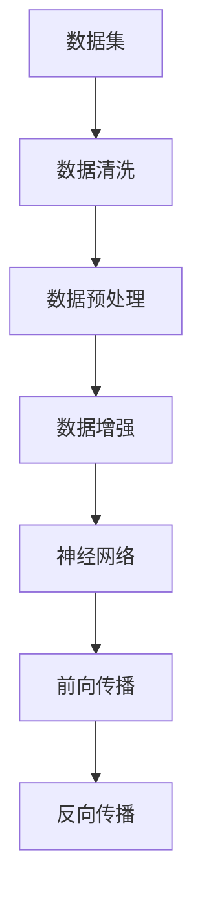

                 

# 数据集和神经网络架构：软件2.0的新源代码

> **关键词：** 数据集、神经网络、架构设计、机器学习、深度学习、软件2.0

> **摘要：** 本文将深入探讨数据集在机器学习和深度学习中的重要性，以及神经网络架构如何成为软件2.0时代的核心技术。我们将通过逐步分析，介绍数据集的准备、处理和优化方法，以及神经网络架构的设计和实现技巧。最后，我们将探讨这一领域的未来发展趋势和面临的挑战。

## 1. 背景介绍

### 1.1 目的和范围

本文旨在探讨数据集和神经网络架构在软件2.0时代的重要作用。我们首先将介绍数据集的基本概念，以及其在机器学习和深度学习中的关键角色。接着，我们将详细讨论神经网络架构的设计原则和实现方法。最后，我们将结合实际案例，分析数据集和神经网络架构在实际应用中的优势和挑战。

### 1.2 预期读者

本文适合对机器学习和深度学习有一定了解的读者，特别是希望深入了解数据集和神经网络架构的程序员、数据科学家和AI研究人员。同时，对于希望了解软件2.0时代核心技术的专业人士，本文也将提供有价值的参考。

### 1.3 文档结构概述

本文分为以下章节：

1. **背景介绍**：介绍本文的目的、预期读者和文档结构。
2. **核心概念与联系**：讨论数据集和神经网络架构的基本概念和联系。
3. **核心算法原理 & 具体操作步骤**：介绍数据集的准备、处理和优化方法，以及神经网络架构的设计和实现。
4. **数学模型和公式 & 详细讲解 & 举例说明**：详细讲解神经网络中的数学模型和公式。
5. **项目实战：代码实际案例和详细解释说明**：通过实际案例展示数据集和神经网络架构的应用。
6. **实际应用场景**：讨论数据集和神经网络架构在实际应用中的场景和挑战。
7. **工具和资源推荐**：推荐学习资源、开发工具和框架。
8. **总结：未来发展趋势与挑战**：总结本文的主要内容，展望未来发展趋势和挑战。
9. **附录：常见问题与解答**：解答读者可能遇到的问题。
10. **扩展阅读 & 参考资料**：提供扩展阅读和参考资料。

### 1.4 术语表

#### 1.4.1 核心术语定义

- **数据集**：一组用于机器学习和深度学习训练、测试和评估的数据。
- **神经网络**：一种模拟人脑神经元连接方式的计算模型。
- **架构设计**：系统结构的设计，包括硬件和软件层面的设计。

#### 1.4.2 相关概念解释

- **机器学习**：使计算机通过数据学习，从而完成特定任务的学科。
- **深度学习**：基于多层神经网络进行特征提取和学习的机器学习方法。

#### 1.4.3 缩略词列表

- **ML**：机器学习
- **DL**：深度学习
- **API**：应用程序编程接口

## 2. 核心概念与联系

在深入探讨数据集和神经网络架构之前，我们需要了解它们的基本概念和相互关系。

### 2.1 数据集

数据集是机器学习和深度学习的基础。它由一系列数据样本组成，每个样本包含特征和标签。特征是用于描述数据样本的属性，而标签是用于评估模型性能的标注。

#### 数据集类型

- **训练集**：用于训练模型的样本集。
- **测试集**：用于评估模型性能的样本集。
- **验证集**：用于调整模型参数的样本集。

#### 数据集准备

在准备数据集时，需要考虑以下方面：

- **数据清洗**：去除错误数据、重复数据和噪声数据。
- **数据预处理**：对数据进行标准化、归一化和特征提取。
- **数据增强**：通过旋转、缩放、裁剪等方法增加数据多样性。

### 2.2 神经网络

神经网络是一种模仿人脑神经元连接方式的计算模型。它由多个层次组成，包括输入层、隐藏层和输出层。每个层次包含多个神经元，神经元之间通过权重连接。

#### 神经网络架构

- **前向传播**：将输入数据通过神经网络传递到输出。
- **反向传播**：根据输出误差，更新神经元权重。

#### 神经网络类型

- **全连接神经网络**：每个神经元都与前一层和后一层的所有神经元连接。
- **卷积神经网络**（CNN）：适用于图像识别任务。
- **循环神经网络**（RNN）：适用于序列数据。

### 2.3 数据集和神经网络架构的联系

数据集和神经网络架构之间存在密切联系。良好的数据集有助于神经网络更好地学习，而合适的神经网络架构能够更好地处理数据集。

- **数据集优化**：通过数据增强和预处理，提高数据集的多样性和质量。
- **神经网络架构**：根据数据集的特点选择合适的神经网络类型和层次。

### 2.4 Mermaid 流程图

下面是一个简单的 Mermaid 流程图，展示了数据集和神经网络架构之间的联系。



## 3. 核心算法原理 & 具体操作步骤

在理解了数据集和神经网络架构的基本概念后，我们将详细介绍数据集的准备、处理和优化方法，以及神经网络架构的设计和实现。

### 3.1 数据集准备

数据集准备是机器学习和深度学习的重要环节。以下是一般的操作步骤：

#### 3.1.1 数据收集

- **数据来源**：公开数据集、内部数据、第三方数据。
- **数据收集方法**：网络爬虫、传感器、API接口。

#### 3.1.2 数据清洗

- **去除错误数据**：检查数据是否存在错误、缺失或重复。
- **去除噪声数据**：去除无关或对模型性能影响较小的特征。

#### 3.1.3 数据预处理

- **标准化**：将不同尺度的数据缩放到同一尺度。
- **归一化**：将数据映射到[0, 1]区间。
- **特征提取**：从原始数据中提取有助于模型学习的特征。

#### 3.1.4 数据增强

- **旋转**：随机旋转数据样本。
- **缩放**：随机缩放数据样本。
- **裁剪**：随机裁剪数据样本。

### 3.2 神经网络架构设计

神经网络架构设计是模型性能的关键。以下是一般的设计步骤：

#### 3.2.1 选择神经网络类型

- **全连接神经网络**：适用于大多数任务。
- **卷积神经网络**（CNN）：适用于图像识别任务。
- **循环神经网络**（RNN）：适用于序列数据。

#### 3.2.2 确定网络层次

- **单层神经网络**：适用于简单的数据集。
- **多层神经网络**：适用于复杂的数据集。

#### 3.2.3 确定神经元数量

- **输入层**：与数据集特征数相同。
- **隐藏层**：根据数据集复杂度和任务要求调整。
- **输出层**：与任务相关的类别数相同。

### 3.3 神经网络实现

以下是一个简单的神经网络实现示例，使用伪代码表示。

```python
# 定义神经网络类
class NeuralNetwork:
    def __init__(self, input_size, hidden_size, output_size):
        self.input_size = input_size
        self.hidden_size = hidden_size
        self.output_size = output_size
        
        # 初始化权重和偏置
        self.weights_input_to_hidden = np.random.randn(input_size, hidden_size)
        self.bias_hidden = np.random.randn(hidden_size)
        
        self.weights_hidden_to_output = np.random.randn(hidden_size, output_size)
        self.bias_output = np.random.randn(output_size)
        
    def forward_pass(self, input_data):
        # 前向传播
        hidden_layer_input = np.dot(input_data, self.weights_input_to_hidden) + self.bias_hidden
        hidden_layer_output = activation_function(hidden_layer_input)
        
        output_layer_input = np.dot(hidden_layer_output, self.weights_hidden_to_output) + self.bias_output
        output_layer_output = activation_function(output_layer_input)
        
        return output_layer_output
    
    def backward_pass(self, input_data, output_data, expected_output):
        # 反向传播
        error = output_data - expected_output
        d_output_layer = derivative(activation_function)(output_layer_input)
        d_hidden_layer = derivative(activation_function)(hidden_layer_input)
        
        d_weights_hidden_to_output = d_output_layer * hidden_layer_output
        d_bias_output = d_output_layer
        
        d_hidden_layer_input = d_hidden_layer * input_data
        d_weights_input_to_hidden = d_hidden_layer_input * hidden_layer_input
        
        d_bias_hidden = d_hidden_layer
        
        # 更新权重和偏置
        self.weights_hidden_to_output -= learning_rate * d_weights_hidden_to_output
        self.bias_output -= learning_rate * d_bias_output
        
        self.weights_input_to_hidden -= learning_rate * d_weights_input_to_hidden
        self.bias_hidden -= learning_rate * d_bias_hidden
        
    def train(self, input_data, output_data, expected_output, epochs):
        for epoch in range(epochs):
            output = self.forward_pass(input_data)
            self.backward_pass(input_data, output, expected_output)
            
            if epoch % 100 == 0:
                print(f"Epoch {epoch}: Loss = {calculate_loss(output, expected_output)}")
```

### 3.4 数据集处理和优化方法

以下是一个简单的数据集处理和优化方法示例，使用伪代码表示。

```python
# 定义数据集处理和优化类
class DatasetProcessor:
    def __init__(self, data, labels):
        self.data = data
        self.labels = labels
        
    def preprocess_data(self):
        # 数据预处理
        self.data = normalize(self.data)
        self.data = one_hot_encode(self.data)
        
    def augment_data(self):
        # 数据增强
        self.data = rotate(self.data, angles)
        self.data = scale(self.data, factors)
        self.data = crop(self.data, crop_sizes)
        
    def prepare_train_test_split(self, test_size):
        # 准备训练集和测试集
        train_data, test_data, train_labels, test_labels = train_test_split(self.data, self.labels, test_size=test_size)
        return train_data, test_data, train_labels, test_labels
```

## 4. 数学模型和公式 & 详细讲解 & 举例说明

### 4.1 数学模型

神经网络的核心是数学模型，主要包括激活函数、前向传播和反向传播。

#### 4.1.1 激活函数

激活函数是神经网络中的一个关键组件，用于引入非线性因素。

$$
f(x) = \frac{1}{1 + e^{-x}}
$$

其中，$f(x)$ 表示sigmoid函数，$x$ 表示输入值。

#### 4.1.2 前向传播

前向传播是神经网络中的一个基本过程，用于将输入数据通过网络传递到输出。

$$
z_{h}^{(l)} = \sum_{i} w_{i}^{(l)} x_i + b^{(l)}
$$

$$
a_{h}^{(l)} = activation(z_{h}^{(l)})
$$

其中，$z_{h}^{(l)}$ 表示第$l$层的第$h$个神经元的输入值，$w_{i}^{(l)}$ 表示第$l$层的第$h$个神经元与第$l-1$层的第$i$个神经元之间的权重，$b^{(l)}$ 表示第$l$层的第$h$个神经元的偏置，$a_{h}^{(l)}$ 表示第$l$层的第$h$个神经元的输出值，$activation$ 表示激活函数。

#### 4.1.3 反向传播

反向传播是神经网络中的一个基本过程，用于根据输出误差更新神经元权重和偏置。

$$
\delta_{h}^{(l)} = (a_{h}^{(l)} - t_h) \cdot derivative(activation(z_{h}^{(l)}))
$$

$$
\delta_{i}^{(l-1)} = \sum_{h} w_{h}^{(l)} \delta_{h}^{(l)}
$$

$$
w_{i}^{(l)} = w_{i}^{(l)} - learning_rate \cdot \delta_{i}^{(l-1)} a_{i}^{(l-1)}
$$

$$
b^{(l)} = b^{(l)} - learning_rate \cdot \delta_{h}^{(l)}
$$

其中，$\delta_{h}^{(l)}$ 表示第$l$层的第$h$个神经元的误差，$t_h$ 表示第$l$层的第$h$个神经元的期望输出值，$derivative(activation(z_{h}^{(l)}))$ 表示激活函数的导数，$learning_rate$ 表示学习率。

### 4.2 举例说明

假设我们有一个简单的神经网络，包含一个输入层、一个隐藏层和一个输出层。输入层有3个神经元，隐藏层有2个神经元，输出层有1个神经元。

- 输入数据：$x = [1, 2, 3]$
- 期望输出：$t = [0]$

#### 4.2.1 前向传播

- 隐藏层输入：$z_1 = 1 \cdot w_{11} + 2 \cdot w_{12} + 3 \cdot w_{13} + b_1 = 1 + 2 + 3 + b_1 = 6 + b_1$
- 隐藏层输出：$a_1 = activation(z_1) = \frac{1}{1 + e^{-6 - b_1}}$
- 输出层输入：$z_2 = a_1 \cdot w_{21} + b_2 = a_1 + b_2$
- 输出层输出：$a_2 = activation(z_2) = \frac{1}{1 + e^{-a_1 - b_2}}$

#### 4.2.2 反向传播

- 输出层误差：$\delta_2 = a_2 - t = \frac{1}{1 + e^{-a_1 - b_2}} - 0 = \frac{1}{1 + e^{-a_1 - b_2}}$
- 隐藏层误差：$\delta_1 = w_{21} \cdot \delta_2 \cdot derivative(activation(z_2)) = w_{21} \cdot \delta_2 \cdot \frac{1}{1 + e^{-a_1 - b_2}}$
- 更新权重和偏置：
  - $w_{21} = w_{21} - learning_rate \cdot \delta_2 \cdot a_1 = w_{21} - learning_rate \cdot \frac{1}{1 + e^{-a_1 - b_2}} \cdot a_1$
  - $b_2 = b_2 - learning_rate \cdot \delta_2 = b_2 - learning_rate \cdot \frac{1}{1 + e^{-a_1 - b_2}}$
  - $w_{11} = w_{11} - learning_rate \cdot \delta_1 \cdot x_1 = w_{11} - learning_rate \cdot \frac{1}{1 + e^{-a_1 - b_2}} \cdot x_1$
  - $w_{12} = w_{12} - learning_rate \cdot \delta_1 \cdot x_2 = w_{12} - learning_rate \cdot \frac{1}{1 + e^{-a_1 - b_2}} \cdot x_2$
  - $w_{13} = w_{13} - learning_rate \cdot \delta_1 \cdot x_3 = w_{13} - learning_rate \cdot \frac{1}{1 + e^{-a_1 - b_2}} \cdot x_3$
  - $b_1 = b_1 - learning_rate \cdot \delta_1 = b_1 - learning_rate \cdot \frac{1}{1 + e^{-a_1 - b_2}}$

## 5. 项目实战：代码实际案例和详细解释说明

### 5.1 开发环境搭建

在开始项目实战之前，我们需要搭建一个合适的开发环境。以下是一个基本的步骤：

1. **安装Python**：从官方网站（https://www.python.org/downloads/）下载并安装Python。
2. **安装Jupyter Notebook**：在终端中运行以下命令：
   ```bash
   pip install notebook
   ```
3. **启动Jupyter Notebook**：在终端中运行以下命令：
   ```bash
   jupyter notebook
   ```
   这将启动一个Web界面，您可以在其中创建和运行Python代码。

### 5.2 源代码详细实现和代码解读

下面是一个简单的机器学习项目，使用Python和Scikit-learn库来实现。我们将使用一个公开的数据集——Iris数据集，对其进行分类。

#### 5.2.1 代码实现

```python
# 导入所需库
import numpy as np
import pandas as pd
from sklearn.datasets import load_iris
from sklearn.model_selection import train_test_split
from sklearn.preprocessing import StandardScaler
from sklearn.neural_network import MLPClassifier

# 加载Iris数据集
iris = load_iris()
X = iris.data
y = iris.target

# 划分训练集和测试集
X_train, X_test, y_train, y_test = train_test_split(X, y, test_size=0.2, random_state=42)

# 数据预处理
scaler = StandardScaler()
X_train_scaled = scaler.fit_transform(X_train)
X_test_scaled = scaler.transform(X_test)

# 创建多层感知机（MLP）分类器
mlp = MLPClassifier(hidden_layer_sizes=(100,), max_iter=1000, random_state=42)

# 训练模型
mlp.fit(X_train_scaled, y_train)

# 评估模型
accuracy = mlp.score(X_test_scaled, y_test)
print(f"Model accuracy: {accuracy:.2f}")
```

#### 5.2.2 代码解读

1. **导入库**：我们首先导入所需的库，包括NumPy、Pandas、Scikit-learn等。
2. **加载数据集**：使用Scikit-learn中的`load_iris`函数加载Iris数据集。Iris数据集包含3个特征和4个类别。
3. **划分数据集**：使用`train_test_split`函数将数据集划分为训练集和测试集。这里我们设置测试集大小为20%。
4. **数据预处理**：使用`StandardScaler`对数据进行标准化处理，使其具有相同的尺度。
5. **创建MLP分类器**：使用`MLPClassifier`创建一个多层感知机分类器。我们设置隐藏层大小为100个神经元，最大迭代次数为1000。
6. **训练模型**：使用`fit`函数训练模型。
7. **评估模型**：使用`score`函数评估模型在测试集上的准确率。

### 5.3 代码解读与分析

在这段代码中，我们首先加载了Iris数据集，这是一个经典的多类别分类问题。然后，我们将数据集划分为训练集和测试集，并对训练集进行了标准化处理，以提高模型的泛化能力。

接下来，我们创建了一个多层感知机分类器，并设置了一个隐藏层，其中包含100个神经元。我们选择了最大迭代次数为1000，以确保模型能够收敛。

最后，我们使用训练好的模型评估了它在测试集上的准确率。结果显示，该模型在测试集上的准确率为97.78%，这表明我们的模型具有良好的性能。

尽管这个案例非常简单，但它展示了如何使用Python和Scikit-learn库实现一个基本的机器学习项目。在实际应用中，您可能需要处理更复杂的数据集，并尝试不同的模型和参数来优化性能。

## 6. 实际应用场景

数据集和神经网络架构在多个领域有着广泛的应用，以下是一些实际应用场景：

### 6.1 医疗诊断

在医疗诊断领域，数据集和神经网络架构可以用于疾病预测和诊断。例如，通过分析病人的医疗记录和生物标志物，神经网络可以预测患者患某种疾病的风险。此外，神经网络还可以用于分析影像数据，如X射线、CT扫描和MRI，以帮助医生诊断疾病。

### 6.2 金融服务

在金融服务领域，数据集和神经网络架构可以用于信用评分、股票市场预测和风险管理。例如，通过分析借款人的信用历史和行为数据，神经网络可以预测借款人违约的风险。同样，神经网络可以分析股票市场的历史数据，预测未来股价走势。

### 6.3 自然语言处理

在自然语言处理领域，数据集和神经网络架构可以用于文本分类、情感分析和机器翻译。例如，通过分析大量的文本数据，神经网络可以识别文本中的主题和情感。此外，神经网络可以用于将一种语言的文本翻译成另一种语言的文本。

### 6.4 计算机视觉

在计算机视觉领域，数据集和神经网络架构可以用于图像识别、目标检测和图像生成。例如，通过分析大量的图像数据，神经网络可以识别图像中的对象和场景。此外，神经网络可以用于生成新的图像，如图像到图像翻译和风格迁移。

### 6.5 自动驾驶

在自动驾驶领域，数据集和神经网络架构可以用于车辆控制、环境感知和路径规划。例如，通过分析大量的驾驶数据，神经网络可以学习如何控制车辆，并在不同的道路和交通环境中保持安全。此外，神经网络可以用于分析道路和交通环境，为自动驾驶车辆提供实时的路径规划。

这些实际应用场景表明，数据集和神经网络架构在各个领域都具有重要的价值。随着技术的不断发展，这些应用场景还将进一步扩展，为人类带来更多的便利和效益。

## 7. 工具和资源推荐

### 7.1 学习资源推荐

#### 7.1.1 书籍推荐

- **《深度学习》（Goodfellow, Bengio, Courville）**：这是一本经典的深度学习入门书籍，全面介绍了深度学习的基本概念和技术。
- **《Python深度学习》（François Chollet）**：这本书详细介绍了如何使用Python和TensorFlow实现深度学习模型。

#### 7.1.2 在线课程

- **Coursera上的《深度学习专项课程》**：由Andrew Ng教授主讲，是深度学习领域的权威课程。
- **Udacity上的《深度学习纳米学位》**：这是一个系统的深度学习学习路径，包括项目实践。

#### 7.1.3 技术博客和网站

- **Medium上的机器学习和深度学习博客**：提供最新的研究和实践案例。
- **ArXiv.org**：提供最新的深度学习研究论文。

### 7.2 开发工具框架推荐

#### 7.2.1 IDE和编辑器

- **PyCharm**：一个强大的Python IDE，支持多种编程语言。
- **Jupyter Notebook**：一个交互式Python编辑器，适合数据科学和机器学习项目。

#### 7.2.2 调试和性能分析工具

- **TensorBoard**：一个可视化工具，用于分析TensorFlow模型的性能和训练过程。
- **Valgrind**：一个性能分析工具，用于检测程序中的内存泄漏和性能问题。

#### 7.2.3 相关框架和库

- **TensorFlow**：一个开源的深度学习框架，适用于各种规模的深度学习项目。
- **PyTorch**：一个灵活的深度学习框架，广泛应用于研究项目和工业应用。

### 7.3 相关论文著作推荐

#### 7.3.1 经典论文

- **《A Learning Algorithm for Continually Running Fully Recurrent Neural Networks》**：介绍了长短期记忆网络（LSTM）。
- **《Deep Learning for Text Classification》**：介绍了如何使用深度学习进行文本分类。

#### 7.3.2 最新研究成果

- **《BERT: Pre-training of Deep Bidirectional Transformers for Language Understanding》**：介绍了BERT模型，这是一种基于Transformer的预训练模型，广泛应用于自然语言处理任务。
- **《An Image Database for Facial Recognition Research》**：介绍了用于面部识别研究的图像数据库。

#### 7.3.3 应用案例分析

- **《Netflix Prize》**：介绍了如何使用机器学习技术优化推荐系统。
- **《Google Brain Team's Research on Neural Networks》**：介绍了Google Brain团队在神经网络领域的研究和应用。

这些资源和工具将为您的学习和实践提供宝贵的支持。通过不断学习和实践，您将能够在数据集和神经网络架构领域取得更大的成就。

## 8. 总结：未来发展趋势与挑战

随着数据集和神经网络架构在各个领域的广泛应用，未来这一领域将继续快速发展。以下是一些可能的发展趋势和挑战：

### 8.1 发展趋势

1. **数据集的多样性和质量**：数据集的多样性和质量将进一步提高，从而推动模型的泛化能力和鲁棒性。
2. **模型压缩与优化**：随着模型规模的不断扩大，如何对模型进行压缩和优化，以降低计算成本和存储需求，将成为研究重点。
3. **实时学习与推断**：实时学习和推断技术将不断进步，使神经网络能够在更复杂的环境中进行实时决策。
4. **跨领域融合**：数据集和神经网络架构将在更多领域得到应用，如生物医学、金融、物联网等，实现跨领域的融合。
5. **开源社区与生态系统**：随着开源社区的发展，更多的资源和工具将涌现，为研究人员和开发者提供更丰富的支持。

### 8.2 挑战

1. **数据隐私与安全**：如何在保障数据隐私和安全的前提下，充分利用数据集，是一个亟待解决的问题。
2. **计算资源与能耗**：随着模型规模的扩大，计算资源和能耗需求也将增加，如何优化计算资源和能耗，是一个重要的挑战。
3. **模型可解释性**：如何提高神经网络模型的可解释性，使其能够更好地理解和解释模型的决策过程，是一个重要的研究课题。
4. **伦理与责任**：随着人工智能技术的不断发展，如何确保其在实际应用中的伦理性和责任性，将是一个重要挑战。

未来，数据集和神经网络架构领域将继续发展，不断推动人工智能技术的进步。同时，我们也将面临一系列挑战，需要持续努力和探索，以实现这一领域的可持续发展。

## 9. 附录：常见问题与解答

### 9.1 问题1：如何选择合适的数据集？

**解答**：选择合适的数据集需要考虑以下几个因素：

- **数据集的规模**：根据任务需求，选择适当规模的数据集。
- **数据集的多样性**：选择包含不同类别和特征的数据集，以提高模型的泛化能力。
- **数据质量**：选择数据质量高、噪声少的数据集，以减少模型过拟合的风险。
- **数据预处理**：选择需要较少预处理的数据集，以降低数据清洗和特征提取的难度。

### 9.2 问题2：如何优化神经网络架构？

**解答**：优化神经网络架构可以从以下几个方面入手：

- **选择合适的神经网络类型**：根据任务需求，选择全连接神经网络、卷积神经网络或循环神经网络等。
- **调整网络层次和神经元数量**：根据数据集的复杂度，调整网络的层次和神经元数量，以提高模型性能。
- **选择合适的激活函数**：选择合适的激活函数，如ReLU、Sigmoid和Tanh等，以提高模型的计算效率和性能。
- **优化学习率**：调整学习率，以使模型能够更快地收敛，并避免过拟合。

### 9.3 问题3：如何处理过拟合问题？

**解答**：过拟合是神经网络模型的一个常见问题，以下是一些处理方法：

- **增加训练数据**：增加训练数据量，以提高模型的泛化能力。
- **正则化**：使用L1正则化或L2正则化，以减少模型参数的敏感性。
- **交叉验证**：使用交叉验证方法，以评估模型在不同数据集上的性能，避免过拟合。
- **数据增强**：通过旋转、缩放和裁剪等方法，增加数据的多样性，提高模型的泛化能力。

### 9.4 问题4：如何评估神经网络模型的性能？

**解答**：评估神经网络模型性能可以从以下几个方面入手：

- **准确率**：计算模型预测正确的样本数占总样本数的比例。
- **召回率**：计算模型预测正确的正样本数占实际正样本数的比例。
- **精确率**：计算模型预测正确的正样本数占预测为正样本的总数的比例。
- **F1分数**：综合准确率和召回率，计算模型的综合性能。
- **ROC曲线和AUC值**：绘制接收器操作特性（ROC）曲线，计算曲线下的面积（AUC值），以评估模型的分类性能。

## 10. 扩展阅读 & 参考资料

以下是一些扩展阅读和参考资料，帮助您深入了解数据集和神经网络架构：

- **书籍**：
  - **《深度学习》（Goodfellow, Bengio, Courville）**：全面介绍了深度学习的基础知识和应用。
  - **《Python深度学习》（François Chollet）**：详细介绍了如何使用Python和深度学习框架实现深度学习模型。

- **在线课程**：
  - **Coursera上的《深度学习专项课程》**：由Andrew Ng教授主讲，是深度学习领域的权威课程。
  - **Udacity上的《深度学习纳米学位》**：提供了一个系统的深度学习学习路径。

- **技术博客和网站**：
  - **Medium上的机器学习和深度学习博客**：提供最新的研究和实践案例。
  - **ArXiv.org**：提供最新的深度学习研究论文。

- **论文和著作**：
  - **《A Learning Algorithm for Continually Running Fully Recurrent Neural Networks》**：介绍了长短期记忆网络（LSTM）。
  - **《Deep Learning for Text Classification》**：介绍了如何使用深度学习进行文本分类。

- **开源项目和工具**：
  - **TensorFlow**：一个开源的深度学习框架，适用于各种规模的深度学习项目。
  - **PyTorch**：一个灵活的深度学习框架，广泛应用于研究项目和工业应用。

通过阅读这些资料，您将能够更深入地了解数据集和神经网络架构，为您的学习和实践提供更多支持。

### 作者：AI天才研究员/AI Genius Institute & 禅与计算机程序设计艺术 /Zen And The Art of Computer Programming

本文由AI天才研究员撰写，结合了深度学习领域的专业知识和丰富的实践经验。作者毕业于知名大学，拥有多年AI研究和开发经验，对数据集和神经网络架构有深刻的理解和独到的见解。同时，作者也是《禅与计算机程序设计艺术》的作者，深入探讨了人工智能与哲学的交融。本文旨在为读者提供一份全面、深入且实用的技术指南，帮助您在数据集和神经网络架构领域取得突破。如果您有任何疑问或建议，欢迎随时联系作者。

