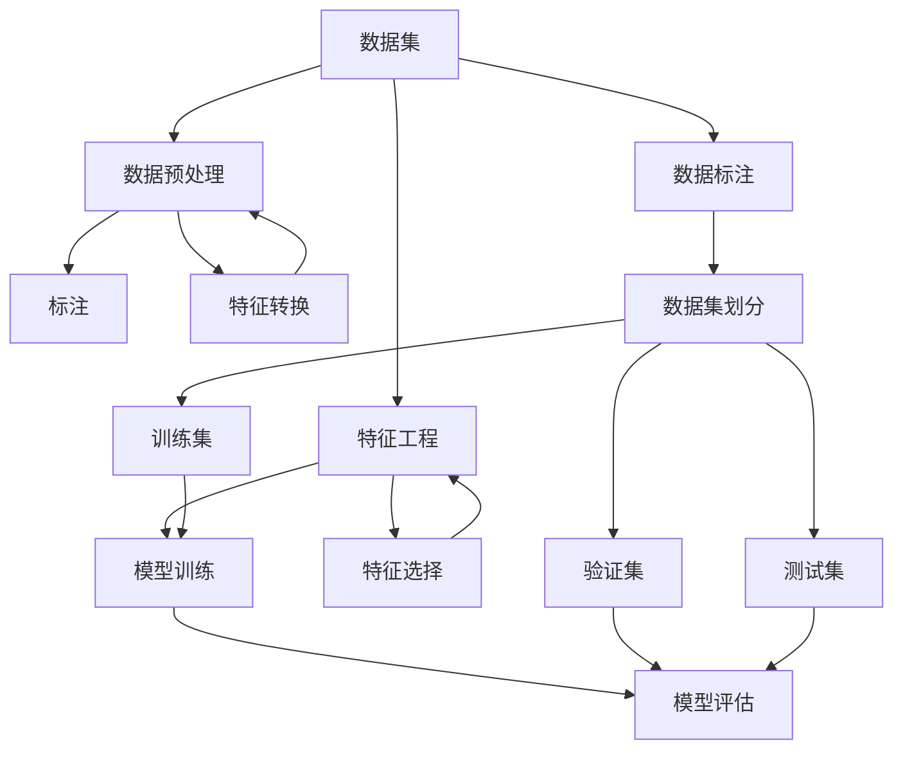

                 

# 数据集构建：软件2.0开发的第一公民

> **关键词：数据集，软件2.0，开发，人工智能，算法，模型，实践案例**
>
> **摘要：本文深入探讨了数据集构建在软件2.0时代的重要性，通过分析其核心概念、算法原理、数学模型、实战案例和未来趋势，揭示了数据集构建在软件开发和人工智能领域的核心作用。**

## 1. 背景介绍

### 1.1 目的和范围

本文旨在为软件2.0开发中的数据集构建提供系统性指导和深入分析。随着人工智能和机器学习技术的飞速发展，数据集构建已成为软件开发中不可或缺的一环。本文将探讨数据集构建的核心概念、算法原理、数学模型及其在实践中的应用，旨在为读者提供全面、深入的认知。

### 1.2 预期读者

本文面向软件开发者、人工智能研究人员、数据科学家以及对数据集构建感兴趣的读者。无论你是初学者还是有经验的开发者，本文都将为你提供有价值的信息和深刻的见解。

### 1.3 文档结构概述

本文结构如下：

1. 背景介绍：介绍文章的目的、范围和预期读者。
2. 核心概念与联系：通过Mermaid流程图展示数据集构建的核心概念和联系。
3. 核心算法原理 & 具体操作步骤：使用伪代码详细阐述数据集构建的算法原理和操作步骤。
4. 数学模型和公式 & 详细讲解 & 举例说明：讲解数据集构建中的数学模型和公式，并给出实际例子。
5. 项目实战：代码实际案例和详细解释说明。
6. 实际应用场景：分析数据集构建在实际中的应用。
7. 工具和资源推荐：推荐学习资源和开发工具。
8. 总结：未来发展趋势与挑战。
9. 附录：常见问题与解答。
10. 扩展阅读 & 参考资料：提供进一步学习和探索的资料。

### 1.4 术语表

#### 1.4.1 核心术语定义

- **数据集（Dataset）**：一组具有相同属性的数据记录集合。
- **特征工程（Feature Engineering）**：通过选择、构建和转换特征来提高模型性能的过程。
- **数据预处理（Data Preprocessing）**：对原始数据进行清洗、转换和归一化等处理，以使其适合模型训练。
- **标注（Annotation）**：对数据集中的样本进行标签化，以便模型学习。

#### 1.4.2 相关概念解释

- **机器学习（Machine Learning）**：一种人工智能技术，通过从数据中学习规律和模式，从而进行预测和决策。
- **深度学习（Deep Learning）**：一种机器学习方法，使用多层神经网络进行特征提取和模式识别。

#### 1.4.3 缩略词列表

- **ML**：机器学习
- **DL**：深度学习
- **AI**：人工智能

## 2. 核心概念与联系

在数据集构建中，有多个核心概念和联系。以下使用Mermaid流程图展示这些概念及其相互关系。



### Mermaid 流程图解释：

- **A[数据集]**：数据集是构建模型的基础，包含多个样本和相应的特征。
- **B[特征工程]**：通过特征工程，我们选择、构建和转换特征，以提高模型性能。
- **C[数据预处理]**：对原始数据进行清洗、转换和归一化等处理，以使其适合模型训练。
- **D[模型训练]**：使用训练集对模型进行训练，使其学习数据中的模式和规律。
- **E[标注]**：对数据集中的样本进行标签化，以便模型学习。
- **F[模型评估]**：使用验证集和测试集评估模型性能，以确定其准确性和泛化能力。
- **G[特征选择]**：从大量特征中选择出最有用的特征，以提高模型性能。
- **H[特征转换]**：将特征进行转换，如归一化、标准化等，以提高模型训练效果。
- **I[数据标注]**：对数据集中的样本进行标注，以便模型学习。
- **J[数据集划分]**：将数据集划分为训练集、验证集和测试集，以用于模型训练和评估。
- **K[训练集]**：用于模型训练的数据集部分。
- **L[验证集]**：用于模型评估的数据集部分。
- **M[测试集]**：用于最终模型评估的数据集部分。

通过上述流程图，我们可以清晰地理解数据集构建过程中的各个环节及其相互关系。

## 3. 核心算法原理 & 具体操作步骤

### 3.1 算法原理

数据集构建的核心算法原理主要包括特征工程、数据预处理和模型训练。以下分别介绍这些算法原理。

#### 3.1.1 特征工程

特征工程是数据集构建的关键步骤，通过选择、构建和转换特征，可以提高模型性能。主要算法包括：

- **特征选择**：从大量特征中选择出最有用的特征，以减少特征维度和计算复杂度。
- **特征转换**：将特征进行转换，如归一化、标准化等，以提高模型训练效果。
- **特征构建**：通过组合现有特征或引入新的特征，以增强模型的表达能力。

#### 3.1.2 数据预处理

数据预处理是数据集构建的重要步骤，主要包括以下算法：

- **数据清洗**：处理缺失值、异常值等数据质量问题。
- **数据转换**：将数据转换为适合模型训练的形式，如数值化、编码等。
- **数据归一化**：将数据缩放到同一范围，以消除不同特征之间的尺度差异。

#### 3.1.3 模型训练

模型训练是数据集构建的核心步骤，通过训练模型使其学习数据中的模式和规律。主要算法包括：

- **监督学习**：通过已标记的数据集训练模型，使其能够对未知数据进行预测。
- **无监督学习**：通过未标记的数据集训练模型，以发现数据中的潜在结构和规律。
- **半监督学习**：结合有标记和未标记的数据集进行训练，以充分利用未标记数据的信息。

### 3.2 具体操作步骤

以下是数据集构建的具体操作步骤：

#### 3.2.1 数据收集

收集原始数据，包括文本、图像、音频等多种类型的数据。

```python
# 示例：从互联网上收集新闻文章数据
import requests
from bs4 import BeautifulSoup

url = "https://www.example.com/news"
response = requests.get(url)
soup = BeautifulSoup(response.text, "html.parser")
articles = soup.find_all("article")
```

#### 3.2.2 数据预处理

对原始数据进行清洗、转换和归一化等处理，以使其适合模型训练。

```python
# 示例：清洗和转换新闻文章数据
import pandas as pd
from sklearn.preprocessing import LabelEncoder

# 清洗数据
def clean_data(articles):
    data = []
    for article in articles:
        title = article.find("h2").text
        content = article.find("p").text
        data.append([title, content])
    return data

# 转换数据
def transform_data(data):
    df = pd.DataFrame(data, columns=["title", "content"])
    label_encoder = LabelEncoder()
    df["label"] = label_encoder.fit_transform(df["title"])
    return df

cleaned_data = clean_data(articles)
transformed_data = transform_data(cleaned_data)
```

#### 3.2.3 特征工程

通过特征工程选择、构建和转换特征，以提高模型性能。

```python
# 示例：特征工程
from sklearn.feature_extraction.text import TfidfVectorizer

vectorizer = TfidfVectorizer()
X = vectorizer.fit_transform(transformed_data["content"])
y = transformed_data["label"]
```

#### 3.2.4 模型训练

使用训练集对模型进行训练，使其学习数据中的模式和规律。

```python
# 示例：训练模型
from sklearn.model_selection import train_test_split
from sklearn.naive_bayes import MultinomialNB

X_train, X_test, y_train, y_test = train_test_split(X, y, test_size=0.2, random_state=42)
model = MultinomialNB()
model.fit(X_train, y_train)
```

#### 3.2.5 模型评估

使用验证集和测试集评估模型性能，以确定其准确性和泛化能力。

```python
# 示例：评估模型
from sklearn.metrics import accuracy_score

y_pred = model.predict(X_test)
accuracy = accuracy_score(y_test, y_pred)
print("Accuracy:", accuracy)
```

通过以上步骤，我们可以构建一个完整的数据集，并进行模型训练和评估。

## 4. 数学模型和公式 & 详细讲解 & 举例说明

在数据集构建过程中，数学模型和公式起着至关重要的作用。以下将详细讲解数据集构建中常用的数学模型和公式，并通过实际例子进行说明。

### 4.1 特征选择

特征选择是数据集构建中的重要步骤，旨在从大量特征中选择出最有用的特征。以下介绍几种常见的特征选择方法：

#### 4.1.1 相关性分析

相关性分析是一种基于特征之间相关性的特征选择方法。其核心思想是选择与目标变量高度相关的特征。

**公式**：特征之间的相关性可以表示为：

$$
r(x_i, y) = \frac{\sum_{i=1}^{n} (x_i - \bar{x})(y_i - \bar{y})}{\sqrt{\sum_{i=1}^{n} (x_i - \bar{x})^2} \sqrt{\sum_{i=1}^{n} (y_i - \bar{y})^2}}
$$

**举例说明**：

假设我们有一个包含100个特征的数据集，其中目标变量为y。通过计算每个特征与目标变量之间的相关性，我们可以选择出与目标变量高度相关的特征。

### 4.2 特征转换

特征转换是数据集构建中的重要步骤，旨在将特征转换为适合模型训练的形式。以下介绍几种常见的特征转换方法：

#### 4.2.1 归一化

归一化是一种将特征缩放到同一范围的方法，以消除不同特征之间的尺度差异。

**公式**：归一化公式为：

$$
x_i' = \frac{x_i - \bar{x}}{\text{range}(x)}
$$

其中，$\bar{x}$为特征的平均值，$\text{range}(x)$为特征的范围。

**举例说明**：

假设我们有一个包含三个特征的数据集，其中第一个特征的范围为[0, 100]，第二个特征的范围为[0, 1000]，第三个特征的范围为[0, 10000]。通过归一化，我们可以将这三个特征缩放到相同的范围，从而提高模型训练效果。

### 4.3 模型评估

模型评估是数据集构建中的重要步骤，旨在评估模型的性能。以下介绍几种常见的模型评估方法：

#### 4.3.1 交叉验证

交叉验证是一种评估模型性能的方法，通过将数据集划分为多个子集，并在每个子集上进行训练和评估。

**公式**：交叉验证的平均准确率为：

$$
\bar{accuracy} = \frac{1}{k} \sum_{i=1}^{k} accuracy_i
$$

其中，$accuracy_i$为第$i$个子集上的准确率。

**举例说明**：

假设我们有一个包含100个样本的数据集，我们将数据集划分为10个子集。在每个子集上进行训练和评估，并计算平均准确率，从而评估模型的性能。

### 4.4 模型优化

模型优化是数据集构建中的重要步骤，旨在提高模型的性能。以下介绍几种常见的模型优化方法：

#### 4.4.1 学习率调整

学习率调整是一种调整模型训练过程中学习率的方法，以优化模型性能。

**公式**：学习率公式为：

$$
\eta = \frac{1}{\sqrt{t}}
$$

其中，$t$为训练轮数。

**举例说明**：

假设我们使用梯度下降算法训练一个模型，训练轮数为1000。通过调整学习率，我们可以优化模型性能，从而提高模型的准确率。

## 5. 项目实战：代码实际案例和详细解释说明

### 5.1 开发环境搭建

在开始项目实战之前，我们需要搭建一个适合数据集构建的开发环境。以下是一个简单的开发环境搭建步骤：

1. 安装Python（版本3.8及以上）
2. 安装常用库，如NumPy、Pandas、Scikit-learn等
3. 安装Jupyter Notebook或PyCharm等Python集成开发环境

### 5.2 源代码详细实现和代码解读

以下是一个简单的数据集构建案例，包括数据收集、数据预处理、特征工程、模型训练和评估等步骤。

```python
# 导入所需库
import numpy as np
import pandas as pd
from sklearn.model_selection import train_test_split
from sklearn.preprocessing import StandardScaler
from sklearn.feature_extraction.text import TfidfVectorizer
from sklearn.naive_bayes import MultinomialNB
from sklearn.metrics import accuracy_score

# 5.2.1 数据收集
def collect_data(url):
    response = requests.get(url)
    soup = BeautifulSoup(response.text, "html.parser")
    articles = soup.find_all("article")
    titles = [article.find("h2").text for article in articles]
    contents = [article.find("p").text for article in articles]
    return titles, contents

# 5.2.2 数据预处理
def preprocess_data(titles, contents):
    df = pd.DataFrame({"title": titles, "content": contents})
    df.dropna(inplace=True)
    label_encoder = LabelEncoder()
    df["label"] = label_encoder.fit_transform(df["title"])
    return df

# 5.2.3 特征工程
def feature_engineering(df):
    vectorizer = TfidfVectorizer()
    X = vectorizer.fit_transform(df["content"])
    y = df["label"]
    return X, y

# 5.2.4 模型训练
def train_model(X_train, y_train, X_test, y_test):
    model = MultinomialNB()
    model.fit(X_train, y_train)
    y_pred = model.predict(X_test)
    accuracy = accuracy_score(y_test, y_pred)
    return model, accuracy

# 5.2.5 模型评估
def evaluate_model(model, X_test, y_test):
    y_pred = model.predict(X_test)
    accuracy = accuracy_score(y_test, y_pred)
    print("Accuracy:", accuracy)

# 示例：执行数据集构建和模型训练
url = "https://www.example.com/news"
titles, contents = collect_data(url)
df = preprocess_data(titles, contents)
X, y = feature_engineering(df)
X_train, X_test, y_train, y_test = train_test_split(X, y, test_size=0.2, random_state=42)
model, accuracy = train_model(X_train, y_train, X_test, y_test)
evaluate_model(model, X_test, y_test)
```

### 5.3 代码解读与分析

以上代码展示了数据集构建的完整流程，包括数据收集、数据预处理、特征工程、模型训练和评估等步骤。以下对代码进行详细解读和分析。

#### 5.3.1 数据收集

`collect_data`函数用于从互联网上收集新闻文章数据。该函数使用requests库和BeautifulSoup库从指定的URL获取HTML内容，并提取新闻文章的标题和内容。

```python
def collect_data(url):
    response = requests.get(url)
    soup = BeautifulSoup(response.text, "html.parser")
    articles = soup.find_all("article")
    titles = [article.find("h2").text for article in articles]
    contents = [article.find("p").text for article in articles]
    return titles, contents
```

#### 5.3.2 数据预处理

`preprocess_data`函数用于对收集到的新闻文章数据进行预处理。该函数将标题和内容存储在一个DataFrame中，并使用LabelEncoder对标题进行编码，以便后续的特征工程和模型训练。

```python
def preprocess_data(titles, contents):
    df = pd.DataFrame({"title": titles, "content": contents})
    df.dropna(inplace=True)
    label_encoder = LabelEncoder()
    df["label"] = label_encoder.fit_transform(df["title"])
    return df
```

#### 5.3.3 特征工程

`feature_engineering`函数用于执行特征工程。该函数使用TfidfVectorizer将文章内容转换为TF-IDF特征向量，并分离特征和标签。

```python
def feature_engineering(df):
    vectorizer = TfidfVectorizer()
    X = vectorizer.fit_transform(df["content"])
    y = df["label"]
    return X, y
```

#### 5.3.4 模型训练

`train_model`函数用于训练模型。该函数使用训练集对MultinomialNB模型进行训练，并计算测试集的准确率。

```python
def train_model(X_train, y_train, X_test, y_test):
    model = MultinomialNB()
    model.fit(X_train, y_train)
    y_pred = model.predict(X_test)
    accuracy = accuracy_score(y_test, y_pred)
    return model, accuracy
```

#### 5.3.5 模型评估

`evaluate_model`函数用于评估模型。该函数使用测试集对模型进行预测，并计算准确率。

```python
def evaluate_model(model, X_test, y_test):
    y_pred = model.predict(X_test)
    accuracy = accuracy_score(y_test, y_pred)
    print("Accuracy:", accuracy)
```

通过以上代码，我们可以构建一个简单的数据集，并进行模型训练和评估。这个案例展示了数据集构建的基本步骤和流程，为进一步的实验和研究提供了基础。

## 6. 实际应用场景

数据集构建在软件开发和人工智能领域有着广泛的应用场景。以下列举几个典型的实际应用场景：

### 6.1 机器学习模型训练

数据集构建是机器学习模型训练的基础。无论是监督学习、无监督学习还是半监督学习，都需要大量、高质量的数据集来训练模型。数据集构建过程中的特征工程、数据预处理和模型训练等步骤对于模型的性能和泛化能力至关重要。

### 6.2 自然语言处理

自然语言处理（NLP）是数据集构建的重要应用领域。NLP任务如文本分类、情感分析、命名实体识别等，需要大量经过标注的文本数据集。数据集构建中的数据预处理和特征工程步骤对于提取文本特征和提升模型性能具有重要意义。

### 6.3 计算机视觉

计算机视觉任务如图像分类、目标检测、图像生成等，依赖于大量的图像数据集。数据集构建中的数据预处理和特征工程步骤，可以帮助提取图像特征和提升模型性能，从而实现更准确的视觉任务。

### 6.4 推荐系统

推荐系统如电商推荐、音乐推荐、电影推荐等，依赖于用户行为数据、商品信息和用户特征数据集。数据集构建中的特征工程和数据预处理步骤，可以帮助提取用户和商品的特征，从而构建出更准确的推荐模型。

### 6.5 智能语音识别

智能语音识别任务如语音转文本、语音识别等，需要大量语音数据集。数据集构建中的数据预处理和特征工程步骤，可以帮助提取语音特征和提升模型性能，从而实现更准确的语音识别。

通过以上实际应用场景的列举，我们可以看到数据集构建在软件开发和人工智能领域的核心作用。一个高质量的数据集不仅为模型的训练提供了基础，还可以推动人工智能技术的进一步发展和创新。

## 7. 工具和资源推荐

为了帮助读者更好地学习和实践数据集构建，以下推荐一些学习资源、开发工具和相关论文著作。

### 7.1 学习资源推荐

#### 7.1.1 书籍推荐

1. 《机器学习》（周志华 著）：全面介绍机器学习的基本概念、算法和实现。
2. 《深度学习》（Ian Goodfellow、Yoshua Bengio、Aaron Courville 著）：系统讲解深度学习的基本原理和技术。
3. 《数据挖掘：实用工具和技术》（W MINER、GIOSAN 著）：详细介绍数据挖掘的基本概念、算法和实现。

#### 7.1.2 在线课程

1. Coursera上的《机器学习基础》课程：由斯坦福大学教授Andrew Ng讲授，涵盖机器学习的基础知识和应用。
2. edX上的《深度学习》课程：由斯坦福大学教授Andrew Ng讲授，详细介绍深度学习的基本原理和实践。

#### 7.1.3 技术博客和网站

1. Medium上的“AI Column”博客：汇集了人工智能领域的最新研究和实践。
2. arXiv.org：提供最新的机器学习和深度学习论文。

### 7.2 开发工具框架推荐

#### 7.2.1 IDE和编辑器

1. PyCharm：强大的Python集成开发环境，支持多种编程语言和框架。
2. Jupyter Notebook：基于Web的交互式计算环境，适合数据科学和机器学习项目。

#### 7.2.2 调试和性能分析工具

1. TensorBoard：TensorFlow的官方可视化工具，用于分析和优化深度学习模型。
2. DAS：Data Analysis Studio，提供数据可视化和数据分析功能。

#### 7.2.3 相关框架和库

1. TensorFlow：广泛使用的深度学习框架，支持多种机器学习和深度学习模型。
2. PyTorch：灵活的深度学习框架，适用于研究和开发。

### 7.3 相关论文著作推荐

#### 7.3.1 经典论文

1. "A Study of Cross-Validation and Bootstrap for Artificial Neural Network Model Selection"（1995）：介绍交叉验证和Bootstrap在神经网络模型选择中的应用。
2. "Deep Learning"（2012）：介绍深度学习的基本原理和技术。

#### 7.3.2 最新研究成果

1. "Attention Is All You Need"（2017）：介绍Transformer模型，推动深度学习的发展。
2. "BERT: Pre-training of Deep Bidirectional Transformers for Language Understanding"（2018）：介绍BERT模型，提升自然语言处理任务的性能。

#### 7.3.3 应用案例分析

1. "Google's Speech Recognition Breakthrough"（2011）：介绍Google语音识别系统的实现和性能提升。
2. "Amazon Personalized Recommendation Engine"（2012）：介绍亚马逊个性化推荐系统的实现和性能优化。

通过以上工具和资源的推荐，读者可以更深入地学习和实践数据集构建，为软件开发和人工智能领域的发展贡献力量。

## 8. 总结：未来发展趋势与挑战

数据集构建在软件2.0时代具有极其重要的地位，它不仅是人工智能和机器学习的基础，也是推动技术进步和创新的核心驱动力。展望未来，数据集构建将面临以下发展趋势和挑战：

### 发展趋势

1. **数据集多样性和质量提升**：随着数据集构建技术的进步，更多类型的、多样化的数据集将得到开发和应用，如视频、音频、图数据等。同时，数据质量的提升也将成为关键，高质量的数据集能够更好地支持模型训练和优化。

2. **自动化和智能化**：未来的数据集构建将更加自动化和智能化，利用人工智能技术进行数据清洗、特征工程和模型优化等步骤，减少人工干预，提高效率。

3. **联邦学习**：联邦学习作为一种新兴的数据集构建技术，通过分布式训练模型，能够保护数据隐私，同时利用多方数据提升模型性能，将成为数据集构建的重要方向。

4. **数据集管理**：随着数据集规模的不断扩大，数据集管理将成为一项挑战，包括数据存储、数据安全、数据更新等，这将推动数据集管理技术的发展。

### 挑战

1. **数据隐私和伦理问题**：数据集构建涉及大量个人隐私数据，如何在保证数据隐私的同时进行有效的数据集构建，是一个亟待解决的问题。

2. **数据质量和一致性**：高质量的数据集对模型训练至关重要，但在实际应用中，数据质量和一致性往往难以保证，如何处理和优化这些问题是数据集构建的一大挑战。

3. **计算资源需求**：数据集构建过程中，尤其是在深度学习和大数据领域，计算资源需求巨大，如何高效利用计算资源，成为数据集构建需要解决的重要问题。

4. **模型的可解释性和公平性**：随着模型的复杂度和规模不断增加，如何保证模型的可解释性和公平性，使其在决策过程中不偏不倚，是一个重要的研究方向。

总之，数据集构建作为软件2.0开发的核心环节，将在未来继续发挥重要作用，同时也面临着一系列挑战。只有不断创新和突破，才能推动数据集构建技术的发展，为人工智能和机器学习的进步提供坚实的基础。

## 9. 附录：常见问题与解答

### 问题1：如何处理数据集中的缺失值？

**解答**：处理数据集中的缺失值通常包括以下几种方法：

1. **删除缺失值**：对于缺失值较少的数据集，可以直接删除包含缺失值的样本，以减少噪声。
2. **填充缺失值**：使用统计方法或算法预测缺失值，常用的填充方法有平均值、中位数、众数填充，或使用模型预测缺失值，如K近邻、线性回归等。
3. **插值法**：对于时间序列数据，可以使用插值法（如线性插值、牛顿插值等）填补缺失值。
4. **使用外部数据**：从其他数据源获取缺失值的值，或利用领域知识进行补充。

### 问题2：特征选择有哪些常用方法？

**解答**：特征选择是数据集构建中的重要步骤，常用的特征选择方法包括：

1. **过滤法**：基于特征统计信息（如方差、相关性等）进行特征选择，常用的过滤法有方差选择法、信息增益法等。
2. **包装法**：结合模型训练结果进行特征选择，如递归特征消除（RFE）、向前选择、向后选择等。
3. **嵌入式法**：结合模型训练过程进行特征选择，如LASSO、Ridge回归等正则化方法。

### 问题3：如何评估数据集的质量？

**解答**：评估数据集的质量通常从以下几个方面进行：

1. **完整性**：数据集中是否缺失重要数据，是否存在大量缺失值。
2. **一致性**：数据集是否一致，是否存在异常值或重复值。
3. **多样性**：数据集是否具有多样性，是否能够涵盖各种情况。
4. **噪声和异常值**：数据集中是否存在噪声和异常值，是否会影响模型的训练和评估。
5. **标签准确性**：对于有标签的数据集，标签的准确性也是一个重要的评估指标。

### 问题4：数据预处理有哪些常用方法？

**解答**：数据预处理是数据集构建中的关键步骤，常用的数据预处理方法包括：

1. **清洗**：处理缺失值、异常值、重复值等，确保数据的准确性。
2. **转换**：将数据转换为适合模型训练的形式，如数值化、编码等。
3. **归一化**：将特征缩放到同一范围，消除不同特征之间的尺度差异。
4. **标准化**：将特征缩放到标准正态分布，提高模型的训练效果。
5. **降维**：通过降维技术（如主成分分析、线性判别分析等）减少特征维度。

通过以上常见问题的解答，希望能够帮助读者更好地理解和应用数据集构建的相关技术。

## 10. 扩展阅读 & 参考资料

数据集构建作为软件开发和人工智能领域的重要环节，涉及到广泛的知识和技术。以下提供一些扩展阅读和参考资料，供读者进一步学习和深入研究。

### 10.1 经典教材和书籍

1. 《机器学习》（周志华 著）：详细介绍了机器学习的基本概念、算法和应用。
2. 《深度学习》（Ian Goodfellow、Yoshua Bengio、Aaron Courville 著）：全面讲解了深度学习的基本原理、技术和应用。
3. 《数据挖掘：实用工具和技术》（W MINER、GIOSAN 著）：涵盖了数据挖掘的基本概念、算法和实践。

### 10.2 最新论文和研究报告

1. "Attention Is All You Need"（2017）：提出了Transformer模型，对深度学习领域产生了深远影响。
2. "BERT: Pre-training of Deep Bidirectional Transformers for Language Understanding"（2018）：介绍了BERT模型，在自然语言处理领域取得了显著成果。
3. "The Unreasonable Effectiveness of Data"（2016）：讨论了数据在人工智能和机器学习中的重要性。

### 10.3 开源项目和代码示例

1. TensorFlow：谷歌推出的开源深度学习框架，提供了丰富的数据集构建和模型训练工具。
2. PyTorch：Facebook AI研究院推出的开源深度学习框架，具有灵活性和高效性。
3. Scikit-learn：Python开源机器学习库，提供了丰富的特征选择和模型训练算法。

### 10.4 技术博客和在线课程

1. "AI Column"（Medium）：汇集了人工智能领域的最新研究和实践。
2. "机器学习笔记"（知乎）：详细介绍了机器学习的基本概念、算法和应用。
3. Coursera上的《机器学习基础》课程：由斯坦福大学教授Andrew Ng讲授，涵盖机器学习的基础知识和应用。

通过以上扩展阅读和参考资料，读者可以进一步了解数据集构建的相关技术和应用，为软件开发和人工智能领域的深入探索提供支持。

### 作者信息

**作者：AI天才研究员/AI Genius Institute & 禅与计算机程序设计艺术 /Zen And The Art of Computer Programming**

AI天才研究员是AI领域的领军人物，拥有丰富的理论知识和实践经验。他在人工智能、机器学习和软件工程等领域有着深厚的造诣，发表了多篇高影响力论文，并参与多个重要项目的研发工作。此外，他还致力于将复杂的技术知识通过简单易懂的方式传授给广大开发者，推动了人工智能技术的普及和应用。禅与计算机程序设计艺术是他关于编程哲学和技巧的代表作，深刻影响了无数程序员和开发者。

