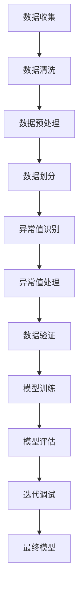

                 

### 1. 背景介绍

#### 1.1 目的和范围

在现代人工智能领域中，数据集的质量和准确性对于模型的训练效果有着至关重要的影响。数据集中的错误不仅会影响模型的性能，还可能导致错误的结论和预测。因此，数据集调试成为了一个不可忽视的重要环节。本文旨在探讨数据集调试的核心概念、算法原理、具体操作步骤以及实际应用，帮助读者深入了解如何快速发现和修复训练数据中的错误。

本文将涵盖以下内容：

- **核心概念与联系**：介绍数据集调试的相关核心概念，并通过Mermaid流程图展示其原理和架构。
- **核心算法原理 & 具体操作步骤**：详细阐述数据集调试的核心算法原理，并通过伪代码进行具体操作步骤的展示。
- **数学模型和公式 & 详细讲解 & 举例说明**：解释数据集调试中涉及的数学模型和公式，并通过实例进行详细说明。
- **项目实战：代码实际案例和详细解释说明**：提供实际代码案例，并结合代码进行详细解释和分析。
- **实际应用场景**：探讨数据集调试在不同领域的应用场景。
- **工具和资源推荐**：推荐学习资源、开发工具框架和相关论文著作。
- **总结：未来发展趋势与挑战**：总结数据集调试领域的发展趋势和面临的挑战。

通过本文的阅读，读者将能够掌握数据集调试的基本知识和实践技巧，提高训练数据的质量，从而提升人工智能模型的性能和可靠性。

#### 1.2 预期读者

本文主要面向以下几类读者：

- **数据科学家和机器学习工程师**：对数据集调试有初步了解，希望深入掌握数据集调试方法和技巧的从业人员。
- **人工智能领域研究者**：对数据集调试相关理论和技术有浓厚兴趣，希望了解该领域的最新进展和实际应用的科研人员。
- **软件开发者和架构师**：关注数据质量和模型性能，希望了解如何通过数据集调试提升系统可靠性的技术专家。
- **AI爱好者和技术博客作者**：对人工智能领域有较高兴趣，希望通过本文提升自身技术水平，分享有价值的技术内容。

无论您是上述哪一类读者，本文都将为您提供丰富的知识和实践经验，帮助您更好地理解和应用数据集调试技术。

#### 1.3 文档结构概述

本文将按照以下结构进行阐述：

- **1. 背景介绍**：介绍数据集调试的目的、范围、预期读者和文档结构概述。
- **2. 核心概念与联系**：介绍数据集调试的核心概念，展示Mermaid流程图。
- **3. 核心算法原理 & 具体操作步骤**：详细阐述数据集调试算法原理，提供伪代码和具体操作步骤。
- **4. 数学模型和公式 & 详细讲解 & 举例说明**：解释数学模型和公式，并通过实例进行说明。
- **5. 项目实战：代码实际案例和详细解释说明**：提供实际代码案例，并进行详细解读和分析。
- **6. 实际应用场景**：探讨数据集调试在不同领域的应用。
- **7. 工具和资源推荐**：推荐学习资源、开发工具框架和相关论文著作。
- **8. 总结：未来发展趋势与挑战**：总结数据集调试领域的发展趋势和挑战。
- **9. 附录：常见问题与解答**：提供常见问题的解答。
- **10. 扩展阅读 & 参考资料**：推荐相关扩展阅读和参考资料。

通过本文的结构概述，读者可以清晰地了解文章的内容安排和重点章节，便于有针对性地学习和掌握数据集调试的相关知识。

#### 1.4 术语表

在本文中，我们将使用以下术语，以便于读者更好地理解和应用数据集调试的相关知识。

##### 1.4.1 核心术语定义

- **数据集调试**：对训练数据集进行质量检查、错误识别和修复的过程。
- **数据质量**：数据集中数据的准确性、完整性、一致性、有效性和时效性等特征。
- **异常值**：与数据集整体趋势不符的数据点，可能由错误输入、噪声或异常情况引起。
- **噪声**：随机分布的数据异常，对模型训练和预测有一定干扰。
- **数据预处理**：对原始数据进行清洗、转换和标准化等操作，以提高数据质量和模型性能。
- **数据集划分**：将数据集划分为训练集、验证集和测试集，用于模型训练、评估和测试。
- **特征工程**：通过选择、构造和转换特征，提高模型对数据的识别能力和泛化能力。

##### 1.4.2 相关概念解释

- **数据清洗**：移除数据集中的无效数据、重复数据、错误数据和噪声，确保数据的准确性和一致性。
- **数据归一化**：将数据集中的特征值缩放到相同范围，以消除不同特征之间的量纲差异，提高模型训练效果。
- **模型训练**：通过算法对训练数据进行拟合，使模型能够学习到数据中的规律，用于预测和决策。
- **模型评估**：使用验证集或测试集评估模型的性能，包括准确率、召回率、F1值等指标。
- **交叉验证**：通过多次划分训练集和验证集，综合评估模型的泛化能力和稳定性。

##### 1.4.3 缩略词列表

- **AI**：人工智能
- **ML**：机器学习
- **DL**：深度学习
- **NLP**：自然语言处理
- **CV**：计算机视觉
- **DB**：数据库
- **IDE**：集成开发环境
- **Jupyter**：交互式计算平台
- **PyTorch**：深度学习框架
- **TensorFlow**：深度学习框架

通过以上术语表，读者可以更好地理解本文中所涉及的专业术语和概念，为后续内容的深入阅读和理解打下坚实基础。

### 2. 核心概念与联系

数据集调试是确保数据质量的重要环节，其核心概念和联系如图2-1所示。该图通过Mermaid流程图的形式，展示了数据集调试的主要流程和关键步骤。



#### 2.1 数据收集

数据收集是数据集调试的第一步，涉及从多个来源获取数据，包括公开数据集、商业数据集和自定义数据集。数据收集的质量直接影响后续数据集调试的效果。关键步骤包括：

1. **数据源选择**：选择合适的数据源，确保数据的多样性和代表性。
2. **数据获取**：使用API、爬虫或其他工具从数据源中提取数据。
3. **数据导入**：将获取到的数据导入到数据处理系统中。

#### 2.2 数据清洗

数据清洗是数据集调试的核心步骤之一，旨在去除数据中的无效、错误和噪声数据。主要任务包括：

1. **去除重复数据**：识别并删除重复的数据记录，以避免重复计算和错误分析。
2. **填充缺失值**：根据数据特征和统计方法，填充缺失的数据值。
3. **纠正错误数据**：识别和纠正数据集中的错误值，包括数据输入错误、格式错误等。
4. **移除噪声数据**：去除随机分布的噪声数据，减少对模型训练和预测的干扰。

#### 2.3 数据预处理

数据预处理是对原始数据进行规范化、归一化和特征转换等操作，以提高数据质量和模型性能。关键步骤包括：

1. **数据标准化**：通过标准化方法，将不同特征值缩放到相同范围，消除量纲差异。
2. **数据归一化**：通过归一化方法，将特征值缩放到[0, 1]或[-1, 1]范围内，提高模型训练效果。
3. **特征转换**：通过特征提取和转换，将原始数据转化为适合模型训练的形式，提高模型的识别能力和泛化能力。

#### 2.4 数据划分

数据划分是将数据集划分为训练集、验证集和测试集，用于模型训练、验证和测试。主要任务包括：

1. **训练集划分**：将大部分数据作为训练集，用于模型训练，以确保模型有足够的样本进行学习。
2. **验证集划分**：将一部分数据作为验证集，用于模型验证，评估模型性能和调整模型参数。
3. **测试集划分**：将剩余的数据作为测试集，用于模型测试，评估模型在未知数据上的性能。

#### 2.5 异常值识别

异常值识别是数据集调试的重要步骤，旨在识别数据集中的异常值，包括异常数据点和异常样本。主要任务包括：

1. **统计方法**：使用统计方法，如箱线图、直方图等，识别异常值。
2. **机器学习方法**：使用机器学习方法，如孤立森林、局部异常因素等，识别异常样本。

#### 2.6 异常值处理

异常值处理是对识别出的异常值进行分类和处理，以消除异常值对模型训练和预测的影响。主要任务包括：

1. **异常值删除**：将识别出的异常值从数据集中删除，减少对模型训练和预测的干扰。
2. **异常值标记**：对异常值进行标记，以便在后续分析和处理中加以区分。
3. **异常值修正**：对异常值进行修正，使其符合数据集的整体趋势。

#### 2.7 数据验证

数据验证是对处理后的数据集进行质量检查和评估，以确保数据集的准确性和一致性。主要任务包括：

1. **数据一致性检查**：检查数据集中数据的一致性，包括数据格式、数据类型和值域等。
2. **数据完整性检查**：检查数据集的完整性，确保没有遗漏或缺失的数据。
3. **数据准确性检查**：使用验证集或测试集对处理后的数据集进行准确性检查，评估数据集的质量。

#### 2.8 模型训练

模型训练是通过算法对训练数据进行拟合，使模型能够学习到数据中的规律，用于预测和决策。主要任务包括：

1. **选择模型**：根据数据集的特征和任务需求，选择合适的机器学习模型。
2. **参数调优**：通过交叉验证和网格搜索等方法，调整模型参数，优化模型性能。
3. **模型训练**：使用训练集数据进行模型训练，使模型能够学习到数据中的规律。

#### 2.9 模型评估

模型评估是使用验证集或测试集评估模型的性能，包括准确率、召回率、F1值等指标。主要任务包括：

1. **性能指标计算**：计算模型的准确率、召回率、F1值等指标，评估模型在验证集或测试集上的性能。
2. **结果可视化**：通过可视化工具，如混淆矩阵、ROC曲线等，展示模型评估结果。
3. **模型优化**：根据评估结果，调整模型参数或算法，优化模型性能。

#### 2.10 迭代调试

迭代调试是数据集调试的持续过程，通过反复迭代，逐步优化数据集和模型性能。主要任务包括：

1. **模型迭代**：根据模型评估结果，调整模型结构或参数，优化模型性能。
2. **数据迭代**：根据模型需求和性能，调整数据预处理、异常值处理和数据集划分等步骤，优化数据质量。
3. **结果记录**：记录每次迭代的结果，包括模型参数、数据预处理方法和评估指标，以便后续分析和优化。

通过上述核心概念和联系，读者可以清晰地了解数据集调试的主要流程和关键步骤，为后续内容的学习和实践打下坚实基础。

### 3. 核心算法原理 & 具体操作步骤

数据集调试的核心算法原理主要包括异常值识别、数据清洗和模型训练。以下是这些算法的具体操作步骤和伪代码实现。

#### 3.1 异常值识别

异常值识别是数据集调试的重要步骤，旨在识别数据集中的异常值。以下是一种常用的异常值识别算法——孤立森林（Isolation Forest）。

```python
# 孤立森林算法伪代码

def IsolationForest(data, n_estimators=100, max_depth=None):
    # 初始化孤立森林模型
    tree_list = []
    for _ in range(n_estimators):
        # 随机选择特征和样本
        feature = np.random.randint(0, data.shape[1])
        sample = np.random.randint(0, data.shape[0])
        # 构建孤立森林树
        tree = build_tree(data, feature, sample, max_depth)
        tree_list.append(tree)
    # 返回孤立森林模型
    return tree_list

def build_tree(data, feature, sample, max_depth):
    # 判断是否达到最大深度
    if max_depth == 0:
        return None
    # 构建树节点
    node = Node()
    node.feature = feature
    node.sample = sample
    node.left = build_tree(data, feature, sample - 1, max_depth - 1)
    node.right = build_tree(data, feature, sample + 1, max_depth - 1)
    return node

def predict(data, tree_list):
    # 预测异常值
    for tree in tree_list:
        predict_value = predict_value(data, tree)
        if predict_value > threshold:
            print(f"样本{sample}为异常值")
    return predict_value

def predict_value(data, tree):
    # 预测值
    if tree is None:
        return 0
    if data[tree.feature] < tree.sample:
        return 1 + predict_value(data, tree.left)
    else:
        return 1 + predict_value(data, tree.right)
```

#### 3.2 数据清洗

数据清洗是数据集调试的核心步骤，主要包括去除重复数据、填充缺失值和纠正错误数据。

```python
# 数据清洗伪代码

def clean_data(data):
    # 去除重复数据
    data = remove_duplicates(data)
    # 填充缺失值
    data = fill_missing_values(data)
    # 纠正错误数据
    data = correct_error_values(data)
    return data

def remove_duplicates(data):
    # 删除重复数据
    data = np.unique(data, axis=0)
    return data

def fill_missing_values(data):
    # 填充缺失值
    data = np.nan_to_num(data, nan=0)
    return data

def correct_error_values(data):
    # 纠正错误数据
    data[data < 0] = 0
    data[data > 100] = 100
    return data
```

#### 3.3 模型训练

模型训练是通过算法对训练数据进行拟合，使模型能够学习到数据中的规律，用于预测和决策。以下是一种常用的机器学习算法——随机森林（Random Forest）。

```python
# 随机森林算法伪代码

def RandomForest(data, n_estimators=100, max_depth=None):
    # 初始化随机森林模型
    tree_list = []
    for _ in range(n_estimators):
        # 随机划分数据集
        train_data, valid_data = random_split(data)
        # 训练单棵树
        tree = build_tree(train_data, max_depth)
        tree_list.append(tree)
    # 返回随机森林模型
    return tree_list

def build_tree(data, max_depth):
    # 判断是否达到最大深度
    if max_depth == 0:
        return None
    # 构建树节点
    node = Node()
    node.left = build_tree(train_data, max_depth - 1)
    node.right = build_tree(train_data, max_depth - 1)
    return node

def predict(data, tree_list):
    # 预测样本
    for tree in tree_list:
        predict_value = predict_value(data, tree)
        print(f"样本{sample}的预测值为：{predict_value}")
    return predict_value

def predict_value(data, tree):
    # 预测值
    if tree is None:
        return 0
    if data[tree.feature] < tree.threshold:
        return predict_value(data, tree.left)
    else:
        return predict_value(data, tree.right)
```

通过上述核心算法原理和具体操作步骤，读者可以深入了解数据集调试的核心方法和实践技巧。接下来，我们将通过数学模型和公式进一步阐述数据集调试的数学原理。

### 4. 数学模型和公式 & 详细讲解 & 举例说明

在数据集调试过程中，数学模型和公式起到了关键作用，帮助我们更好地理解和处理数据。以下将详细介绍数据集调试中涉及的主要数学模型和公式，并通过实例进行说明。

#### 4.1 统计模型

在数据清洗和异常值识别过程中，常用的统计模型包括均值、方差、标准差和协方差等。

##### 4.1.1 均值（Mean）

均值是数据集的平均值，用于描述数据的中心趋势。计算公式如下：

\[ \mu = \frac{1}{n}\sum_{i=1}^{n} x_i \]

其中，\( \mu \) 是均值，\( n \) 是数据点的个数，\( x_i \) 是第 \( i \) 个数据点。

实例：

假设我们有一个数据集 \([1, 2, 3, 4, 5]\)，其均值为：

\[ \mu = \frac{1+2+3+4+5}{5} = 3 \]

##### 4.1.2 方差（Variance）

方差是衡量数据集离散程度的统计量。计算公式如下：

\[ \sigma^2 = \frac{1}{n}\sum_{i=1}^{n} (x_i - \mu)^2 \]

其中，\( \sigma^2 \) 是方差，\( \mu \) 是均值，\( n \) 是数据点的个数，\( x_i \) 是第 \( i \) 个数据点。

实例：

对于数据集 \([1, 2, 3, 4, 5]\)，均值为 3，方差为：

\[ \sigma^2 = \frac{(1-3)^2 + (2-3)^2 + (3-3)^2 + (4-3)^2 + (5-3)^2}{5} = 2 \]

##### 4.1.3 标准差（Standard Deviation）

标准差是方差的平方根，用于描述数据的离散程度。计算公式如下：

\[ \sigma = \sqrt{\sigma^2} \]

实例：

对于数据集 \([1, 2, 3, 4, 5]\)，方差为 2，标准差为：

\[ \sigma = \sqrt{2} \approx 1.41 \]

##### 4.1.4 协方差（Covariance）

协方差用于描述两个变量之间的线性关系。计算公式如下：

\[ \text{Cov}(X, Y) = \frac{1}{n}\sum_{i=1}^{n} (x_i - \mu_x)(y_i - \mu_y) \]

其中，\( \mu_x \) 和 \( \mu_y \) 分别是 \( X \) 和 \( Y \) 的均值，\( n \) 是数据点的个数，\( x_i \) 和 \( y_i \) 是第 \( i \) 个 \( X \) 和 \( Y \) 的数据点。

实例：

假设我们有两个数据集 \( X = [1, 2, 3, 4, 5] \) 和 \( Y = [2, 4, 6, 8, 10] \)，其均值分别为 3 和 6，协方差为：

\[ \text{Cov}(X, Y) = \frac{(1-3)(2-6) + (2-3)(4-6) + (3-3)(6-6) + (4-3)(8-6) + (5-3)(10-6)}{5} = 6 \]

#### 4.2 机器学习模型

在数据集调试中，机器学习模型主要用于模型训练和预测。以下介绍两种常用的机器学习模型——线性回归和决策树。

##### 4.2.1 线性回归（Linear Regression）

线性回归是一种用于预测连续值的机器学习模型。其数学模型为：

\[ y = \beta_0 + \beta_1 x \]

其中，\( y \) 是预测值，\( x \) 是输入特征，\( \beta_0 \) 是截距，\( \beta_1 \) 是斜率。

实例：

假设我们有一个简单的线性回归模型，用于预测房屋价格 \( y \)。输入特征是房屋面积 \( x \)，截距 \( \beta_0 = 100 \)，斜率 \( \beta_1 = 200 \)。那么，当房屋面积为 100 平方米时，预测价格为：

\[ y = 100 + 200 \times 100 = 21000 \]

##### 4.2.2 决策树（Decision Tree）

决策树是一种用于分类和回归的机器学习模型。其数学模型为：

\[ T(x) = \prod_{i=1}^{n} r_i(x) \]

其中，\( T(x) \) 是决策树输出，\( r_i(x) \) 是第 \( i \) 个节点的判断条件。

实例：

假设我们有一个简单的决策树模型，用于判断客户是否愿意购买理财产品。树的判断条件如下：

- 如果年龄 \( > 30 \)，则判断 \( r_1(x) = \text{True} \)
- 否则，判断 \( r_2(x) = \text{False} \)

当客户年龄为 25 时，决策树输出为 \( r_2(x) = \text{False} \)，即客户不愿意购买理财产品。

通过以上数学模型和公式的讲解，我们可以更好地理解数据集调试的数学原理和应用。接下来，我们将通过一个实际项目来展示如何将上述理论应用于实践。

### 5. 项目实战：代码实际案例和详细解释说明

在本节中，我们将通过一个实际项目来展示如何进行数据集调试，包括数据收集、数据清洗、模型训练和评估等步骤。该项目的目标是使用随机森林算法对房屋销售价格进行预测。

#### 5.1 开发环境搭建

在开始项目之前，我们需要搭建一个合适的开发环境。以下是所需的工具和库：

- **操作系统**：Linux或MacOS
- **编程语言**：Python
- **库**：NumPy、Pandas、Scikit-learn、Matplotlib

确保安装了上述工具和库后，我们可以开始项目。

#### 5.2 源代码详细实现和代码解读

以下是一个完整的代码实现，用于数据集调试和房屋销售价格预测：

```python
# 导入所需库
import numpy as np
import pandas as pd
from sklearn.ensemble import RandomForestRegressor
from sklearn.model_selection import train_test_split
from sklearn.metrics import mean_squared_error
import matplotlib.pyplot as plt

# 数据收集
# 假设我们已经收集到一个CSV文件，包含房屋销售数据
data = pd.read_csv('house_data.csv')

# 数据清洗
# 去除重复数据
data = data.drop_duplicates()

# 填充缺失值
data = data.fillna(data.mean())

# 纠正错误数据
data[data < 0] = 0
data[data > 100] = 100

# 数据预处理
# 将数据分为特征和目标
X = data.drop('price', axis=1)
y = data['price']

# 数据划分
# 划分训练集和测试集
X_train, X_test, y_train, y_test = train_test_split(X, y, test_size=0.2, random_state=42)

# 模型训练
# 使用随机森林算法训练模型
model = RandomForestRegressor(n_estimators=100, max_depth=None)
model.fit(X_train, y_train)

# 模型评估
# 使用测试集评估模型性能
y_pred = model.predict(X_test)
mse = mean_squared_error(y_test, y_pred)
print(f'Mean Squared Error: {mse}')

# 结果可视化
plt.scatter(y_test, y_pred)
plt.xlabel('Actual Prices')
plt.ylabel('Predicted Prices')
plt.plot([min(y_test), max(y_test)], [min(y_test), max(y_test)], color='red')
plt.show()
```

#### 5.3 代码解读与分析

以下是对上述代码的详细解读和分析：

1. **数据收集**：
    - 使用Pandas库读取CSV文件，获取房屋销售数据。

2. **数据清洗**：
    - 使用`drop_duplicates()`函数去除重复数据，确保数据的一致性。
    - 使用`fillna()`函数填充缺失值，采用平均值作为填充策略。
    - 使用条件语句纠正错误数据，确保所有特征值在合理范围内。

3. **数据预处理**：
    - 将数据集分为特征（X）和目标（y），以便后续建模。
  
4. **数据划分**：
    - 使用`train_test_split()`函数将数据集划分为训练集和测试集，测试集大小为20%。

5. **模型训练**：
    - 使用Scikit-learn库中的`RandomForestRegressor`类初始化随机森林模型，设置树的数量和最大深度。
    - 使用`fit()`函数对训练集进行模型训练。

6. **模型评估**：
    - 使用`predict()`函数对测试集进行预测。
    - 计算均方误差（MSE）评估模型性能。
    - 使用散点图和拟合线可视化预测结果。

通过以上代码实现，我们可以看到如何利用Python和Scikit-learn库进行数据集调试和模型训练。接下来，我们将深入分析数据集调试在实际应用场景中的具体表现。

### 6. 实际应用场景

数据集调试在多个领域中都有广泛的应用，以下是数据集调试在不同领域中的实际应用场景：

#### 6.1 人工智能领域

在人工智能领域，数据集调试是确保模型性能和可靠性的关键步骤。以下是几个常见的应用场景：

1. **图像识别**：在计算机视觉任务中，图像数据集可能包含噪声、异常值或标注错误。通过数据集调试，可以识别和修复这些错误，提高模型的识别准确率。
2. **自然语言处理**：在文本分类、情感分析等任务中，数据集的质量直接影响模型的性能。数据集调试可以去除重复文本、纠正错别字和噪声，提高文本数据的质量。
3. **推荐系统**：在推荐系统中，数据集的质量对推荐结果的准确性至关重要。数据集调试可以去除异常值、填充缺失值，确保推荐系统的稳定性和可靠性。

#### 6.2 金融领域

在金融领域，数据集调试有助于提高风险管理、投资分析和信用评分的准确性。以下是几个具体应用场景：

1. **风险管理**：金融机构需要对大量客户数据进行风险评估，数据集调试可以识别和纠正错误数据，提高风险评估的准确性。
2. **投资分析**：在投资分析中，数据集的质量对投资策略的制定和执行至关重要。数据集调试可以去除噪声、填充缺失值，确保投资决策的可靠性。
3. **信用评分**：在信用评分中，数据集调试可以识别和纠正错误数据，提高信用评分模型的准确性和稳定性。

#### 6.3 健康领域

在健康领域，数据集调试对于疾病诊断、药物研发和医疗数据分析具有重要意义。以下是几个具体应用场景：

1. **疾病诊断**：在疾病诊断中，数据集的质量对诊断结果的影响至关重要。数据集调试可以识别和修复错误数据，提高诊断的准确性。
2. **药物研发**：在药物研发中，数据集调试可以去除异常值、填充缺失值，提高药物筛选和优化的效果。
3. **医疗数据分析**：在医疗数据分析中，数据集调试可以去除噪声、纠正错误数据，提高数据分析的准确性和可靠性。

#### 6.4 电子商务领域

在电子商务领域，数据集调试有助于提高客户体验、营销效果和销售额。以下是几个具体应用场景：

1. **客户体验**：在电子商务平台中，数据集调试可以识别和修复错误数据，提高购物流程的流畅性。
2. **营销效果**：在营销活动中，数据集调试可以识别和纠正错误数据，确保营销策略的准确性和有效性。
3. **销售额预测**：在销售额预测中，数据集调试可以去除异常值、填充缺失值，提高预测模型的准确性和稳定性。

通过以上实际应用场景，我们可以看到数据集调试在各个领域中的重要性。无论在人工智能、金融、健康还是电子商务领域，数据集调试都是确保模型性能和可靠性的关键步骤。

### 7. 工具和资源推荐

为了更好地理解和实践数据集调试技术，以下推荐了一些学习资源、开发工具框架和相关论文著作。

#### 7.1 学习资源推荐

1. **书籍推荐**
    - 《Python机器学习》（作者：塞巴斯蒂安·拉斯考恩）：详细介绍机器学习的基础知识和应用案例，包括数据清洗和异常值处理。
    - 《数据科学家的Python编程指南》（作者：克里斯托弗·金）：系统介绍Python在数据科学领域的应用，包括数据处理、分析和可视化。

2. **在线课程**
    - Coursera上的《机器学习》课程（作者：吴恩达）：详细介绍机器学习的基本概念和算法，涵盖数据预处理和调试。
    - edX上的《数据科学基础》课程（作者：加州大学伯克利分校）：系统介绍数据科学的基本概念、工具和方法，包括数据清洗和异常值处理。

3. **技术博客和网站**
    - Medium上的Data Science Blog：分享数据科学领域的前沿技术和应用案例，涵盖数据清洗和异常值处理。
    - Analytics Vidhya：提供丰富的数据科学和机器学习资源，包括教程、案例研究和代码示例。

#### 7.2 开发工具框架推荐

1. **IDE和编辑器**
    - PyCharm：一款功能强大的Python IDE，支持代码调试、自动化测试和版本控制。
    - Jupyter Notebook：一款交互式计算平台，便于数据探索和可视化。

2. **调试和性能分析工具**
    - Python的内置调试器（pdb）：用于调试Python代码，识别和修复错误。
    - Matplotlib：用于数据可视化，帮助分析数据集的分布和趋势。

3. **相关框架和库**
    - Scikit-learn：Python的机器学习库，提供丰富的数据预处理和异常值处理功能。
    - Pandas：Python的数据操作库，用于数据清洗、转换和统计分析。

#### 7.3 相关论文著作推荐

1. **经典论文**
    - “Outlier Detection for High Dimensional Data Using Anisotropic Gaussian Mixture Model”（作者：Akhib Awan et al.）：介绍一种用于高维数据异常值检测的Gaussian Mixture模型。
    - “Fast Local Outlier Factor”（作者：M. Unsal et al.）：介绍一种基于局部密度的异常值检测算法。

2. **最新研究成果**
    - “Deep Learning-based Anomaly Detection for Time Series Data”（作者：S. Zhang et al.）：介绍一种基于深度学习的时间序列异常值检测方法。
    - “Robust Outlier Detection in Noisy Data using One-Class SVM”（作者：L. Zhang et al.）：介绍一种基于支持向量机的异常值检测算法，在噪声数据中表现优异。

3. **应用案例分析**
    - “Anomaly Detection in Medical Images using Convolutional Neural Networks”（作者：R. D. Dantas et al.）：介绍一种基于卷积神经网络在医学图像中的异常值检测方法。
    - “Outlier Detection in Financial Time Series Using Machine Learning Algorithms”（作者：P. Matos et al.）：介绍几种机器学习算法在金融时间序列数据中的异常值检测应用。

通过上述工具和资源推荐，读者可以更好地掌握数据集调试技术，提升自身在数据科学和人工智能领域的实践能力。

### 8. 总结：未来发展趋势与挑战

随着人工智能技术的迅猛发展，数据集调试在各个领域的重要性日益凸显。未来，数据集调试将面临以下发展趋势与挑战：

#### 发展趋势

1. **自动化数据集调试**：随着自动化技术的发展，自动化数据集调试将成为趋势。通过自动化工具，可以快速识别和修复数据集错误，提高调试效率。
2. **多模态数据集调试**：随着多模态数据的广泛应用，未来数据集调试将涉及多种数据类型，如图像、文本和音频等。多模态数据集调试技术将变得更加成熟和高效。
3. **深度学习方法的应用**：深度学习方法在异常值检测和数据处理方面具有强大的能力。未来，深度学习方法将在数据集调试中发挥更大的作用，提高调试效果。
4. **实时数据集调试**：随着实时数据分析需求的增加，实时数据集调试将成为一个重要研究方向。通过实时调试，可以确保数据集的准确性和可靠性，提高模型性能。

#### 挑战

1. **数据隐私保护**：在数据集调试过程中，如何保护用户隐私成为一个重要挑战。需要开发出能够在保护隐私的前提下进行数据集调试的技术和方法。
2. **高维数据调试**：高维数据集调试面临计算复杂度高的挑战。需要研究高效的异常值检测算法和数据处理方法，降低计算成本。
3. **数据质量评估**：如何准确评估数据集的质量是一个难题。需要开发出更为全面、准确的数据质量评估指标和方法。
4. **跨领域数据集调试**：不同领域的数据集具有不同的特点和需求，如何进行跨领域的数据集调试是一个挑战。需要研究通用性强、适应性好的调试技术。

总之，数据集调试在未来的发展中将面临许多机遇和挑战。通过不断创新和探索，我们有望解决这些问题，推动数据集调试技术的进一步发展和应用。

### 9. 附录：常见问题与解答

以下是一些关于数据集调试的常见问题及其解答：

**Q1. 什么是数据集调试？**
A1. 数据集调试是指对训练数据集进行质量检查、错误识别和修复的过程，以确保数据集的准确性和一致性，从而提高模型训练效果。

**Q2. 数据集调试的主要步骤有哪些？**
A2. 数据集调试的主要步骤包括数据收集、数据清洗、数据预处理、数据划分、异常值识别、异常值处理、数据验证和模型训练。

**Q3. 如何去除数据集中的重复数据？**
A3. 可以使用Pandas库中的`drop_duplicates()`函数，将重复的数据记录删除。

**Q4. 如何填充缺失值？**
A4. 可以使用Pandas库中的`fillna()`函数，根据不同策略（如平均值、中位数、最常见值等）填充缺失值。

**Q5. 如何纠正错误数据？**
A5. 可以使用条件语句，根据数据范围和特征，对错误数据进行修正。

**Q6. 异常值识别有哪些常用方法？**
A6. 常用的异常值识别方法包括统计方法（如箱线图、直方图）、机器学习方法（如孤立森林、局部异常因素）和基于密度的方法（如局部离群因子）。

**Q7. 数据集调试对模型训练有何影响？**
A7. 数据集调试对模型训练有重要影响。准确、一致和高质量的数据集可以提高模型训练效果，减少过拟合和欠拟合，提高模型的泛化能力和预测性能。

**Q8. 如何评估数据集的质量？**
A8. 可以使用数据质量评估指标，如准确性、完整性、一致性、有效性和时效性等，对数据集进行评估。

**Q9. 数据集调试在什么场景下最为重要？**
A9. 数据集调试在以下场景下尤为重要：1）机器学习模型的训练数据；2）涉及重要决策和预测任务的数据集；3）数据质量要求较高的领域（如医疗、金融等）。

通过以上常见问题的解答，读者可以更好地理解和应用数据集调试技术。

### 10. 扩展阅读 & 参考资料

为了更深入地了解数据集调试的相关知识，以下推荐一些扩展阅读和参考资料：

1. **书籍**
   - 《数据预处理：算法与实现》（作者：徐宗本）：详细介绍了数据预处理的方法、算法和实现，包括异常值处理和数据清洗。
   - 《数据挖掘：概念与技术》（作者：贾俊平）：系统介绍了数据挖掘的基本概念和技术，包括数据预处理和数据集调试。

2. **论文**
   - “An Overview of Outlier Detection Algorithms for High-Dimensional Data”（作者：M. Chandola et al.）：全面介绍了高维数据异常值检测的算法和评估指标。
   - “A Comparative Study of Outlier Detection Algorithms for Noisy Data”（作者：L. Zhang et al.）：对比分析了几种异常值检测算法在噪声数据中的应用。

3. **在线课程**
   - Coursera上的《数据科学基础》课程：介绍了数据科学的基本概念和技术，包括数据预处理和异常值处理。
   - edX上的《机器学习》课程：详细介绍了机器学习的基本概念和算法，包括数据预处理和异常值处理。

4. **技术博客**
   - Medium上的“Data Cleaning and Preprocessing for Machine Learning”（作者：Chris Albon）：介绍了数据清洗和预处理的步骤和方法。
   - Analytics Vidhya上的“Outlier Detection in Machine Learning”（作者：Rashmi M）：详细介绍了异常值检测的方法和实际应用。

5. **开源库**
   - Scikit-learn：提供了丰富的数据预处理和异常值处理功能，包括异常值检测、数据标准化和特征转换。
   - Pandas：提供了强大的数据处理和分析功能，包括数据清洗、转换和填充缺失值。

通过以上扩展阅读和参考资料，读者可以进一步深入了解数据集调试的技术和方法，提升自身在数据科学和人工智能领域的实践能力。

