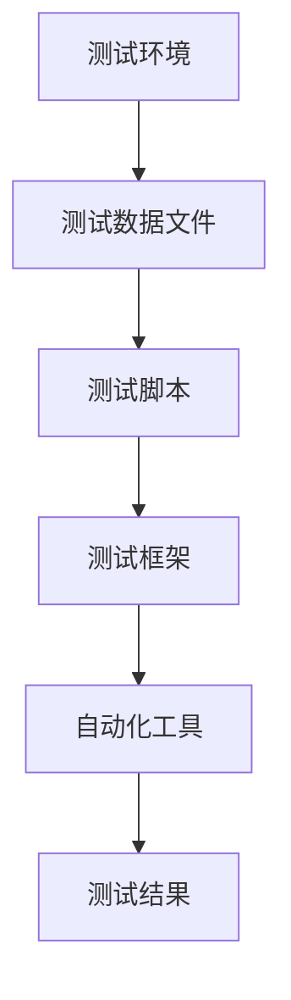

                 

# 数据驱动的软件2.0测试自动化

> 关键词：数据驱动，测试自动化，软件2.0，敏捷开发，测试覆盖率，持续集成

> 摘要：本文探讨了数据驱动测试自动化在软件2.0时代的重要性。随着敏捷开发和持续集成等开发理念的普及，测试自动化已成为软件开发中不可或缺的一部分。本文将详细分析数据驱动测试自动化背后的核心概念、算法原理和实施步骤，并通过实际项目案例进行深入解读。同时，本文还将讨论数据驱动测试自动化的应用场景、推荐的工具和资源，以及未来的发展趋势和挑战。

## 1. 背景介绍

### 1.1 目的和范围

本文的目的是深入探讨数据驱动测试自动化的原理和实践，帮助读者理解和掌握这一关键技术。随着软件开发的演进，从传统软件1.0到如今的软件2.0时代，测试自动化的重要性日益凸显。数据驱动测试自动化作为测试自动化的高级形式，能够显著提高测试效率和质量，减少人为错误，加速软件开发和发布流程。

本文将涵盖以下内容：

1. 数据驱动测试自动化的背景和重要性。
2. 数据驱动测试自动化的核心概念和架构。
3. 数据驱动测试自动化的算法原理和具体操作步骤。
4. 数据驱动测试自动化的数学模型和公式。
5. 数据驱动测试自动化的实际应用案例。
6. 数据驱动测试自动化的工具和资源推荐。
7. 数据驱动测试自动化的未来发展趋势和挑战。

### 1.2 预期读者

本文适合以下读者群体：

1. 软件开发人员，特别是负责测试和质量保证的工程师。
2. 测试自动化工程师和技术经理。
3. 对敏捷开发和持续集成有了解的技术爱好者。
4. 正在寻找提高测试效率和质量的方法的软件开发团队。

### 1.3 文档结构概述

本文结构如下：

1. 背景介绍：介绍数据驱动测试自动化的目的和重要性。
2. 核心概念与联系：分析数据驱动测试自动化的核心概念和架构。
3. 核心算法原理 & 具体操作步骤：讲解数据驱动测试自动化的算法原理和操作步骤。
4. 数学模型和公式：介绍数据驱动测试自动化的数学模型和公式。
5. 项目实战：通过实际案例展示数据驱动测试自动化的应用。
6. 实际应用场景：探讨数据驱动测试自动化的应用场景。
7. 工具和资源推荐：推荐学习资源和开发工具。
8. 总结：总结数据驱动测试自动化的未来发展趋势和挑战。
9. 附录：常见问题与解答。
10. 扩展阅读 & 参考资料：提供进一步学习和阅读的资源。

### 1.4 术语表

#### 1.4.1 核心术语定义

- **数据驱动测试自动化**：一种测试自动化方法，它使用外部数据源（如测试数据文件、数据库等）来驱动测试流程。
- **测试覆盖率**：衡量测试对代码的覆盖程度，包括语句覆盖率、分支覆盖率和路径覆盖率等。
- **持续集成（CI）**：一种软件开发实践，通过自动化构建和测试，确保代码库中的每次更改都能及时集成和验证。
- **敏捷开发**：一种软件开发的迭代方法，强调快速响应变化、持续交付有价值的软件和团队成员间的紧密协作。

#### 1.4.2 相关概念解释

- **测试数据文件**：存储测试输入数据和预期输出的文件，用于驱动测试脚本执行。
- **测试脚本**：自动化测试过程中编写的代码，用于执行测试用例和验证系统功能。
- **测试用例**：定义测试目标、测试步骤、预期结果和实际结果的文档。

#### 1.4.3 缩略词列表

- **CI**：持续集成
- **CD**：持续部署
- **QA**：质量保证
- **Selenium**：自动化测试工具
- **JUnit**：Java单元测试框架
- **Cucumber**：BDD测试框架

## 2. 核心概念与联系

在深入探讨数据驱动测试自动化的核心概念和架构之前，我们需要理解一些基本概念和它们之间的关系。

### 2.1 数据驱动测试自动化的概念

数据驱动测试自动化是一种基于外部数据源（如Excel、XML、JSON、数据库等）的测试方法。它通过分离测试脚本和测试数据，使得测试用例的编写和维护更加灵活和高效。数据驱动测试自动化主要涵盖以下概念：

1. **测试数据文件**：测试数据文件是存储测试输入数据和预期输出的文件。这些文件可以是Excel、XML、JSON等格式，也可以是数据库。测试数据文件通常包含多个测试用例的数据，每个测试用例的数据包括输入值、操作步骤和预期结果等。

2. **测试脚本**：测试脚本是一种自动化测试过程中编写的代码，用于执行测试用例和验证系统功能。测试脚本通常包括测试步骤的代码、断言代码和异常处理代码等。

3. **测试用例**：测试用例是定义测试目标、测试步骤、预期结果和实际结果的文档。测试用例是测试数据文件的基础，它决定了测试脚本如何执行。

### 2.2 数据驱动测试自动化的架构

数据驱动测试自动化的架构包括以下几个关键组成部分：

1. **测试环境**：测试环境是测试脚本运行的软件和硬件环境。测试环境通常包括操作系统、数据库、应用服务器等。

2. **测试数据文件**：测试数据文件存储在本地文件系统或数据库中，是测试脚本的数据源。

3. **测试脚本**：测试脚本用于读取测试数据文件中的测试用例数据，执行测试步骤，并验证实际结果与预期结果是否一致。

4. **测试框架**：测试框架是测试脚本的基础框架，用于组织测试用例、管理测试数据、执行测试步骤和报告测试结果。

5. **自动化工具**：自动化工具是实现测试自动化的关键，如Selenium、Appium、Cypress等。这些工具提供了丰富的API和功能，使得测试脚本的编写和执行更加简单和高效。

### 2.3 数据驱动测试自动化的核心概念原理和架构的 Mermaid 流程图



## 3. 核心算法原理 & 具体操作步骤

数据驱动测试自动化的核心在于如何利用数据来驱动测试流程，实现测试的自动化和高效性。下面我们将详细阐述数据驱动测试自动化的算法原理和具体操作步骤。

### 3.1 算法原理

数据驱动测试自动化的算法原理可以概括为以下几点：

1. **数据分离**：将测试数据和测试脚本分离，使得测试用例的编写和维护更加灵活和高效。

2. **数据驱动**：通过读取测试数据文件中的测试用例数据，自动化执行测试步骤，并验证实际结果与预期结果是否一致。

3. **测试覆盖**：通过设计多样化的测试数据，提高测试覆盖率，确保软件的各个功能点都得到充分的测试。

4. **异常处理**：在测试过程中，对异常情况进行处理，确保测试的连续性和稳定性。

### 3.2 具体操作步骤

下面是一个数据驱动测试自动化的具体操作步骤：

1. **设计测试用例**：首先，需要设计测试用例，定义测试目标、测试步骤、预期结果和实际结果。

2. **编写测试数据文件**：根据测试用例，编写测试数据文件，存储测试输入数据和预期结果。测试数据文件可以是Excel、XML、JSON等格式。

3. **编写测试脚本**：使用自动化工具，根据测试数据文件编写测试脚本。测试脚本通常包括测试步骤的代码、断言代码和异常处理代码等。

4. **执行测试脚本**：使用自动化工具执行测试脚本，自动化执行测试步骤，并验证实际结果与预期结果是否一致。

5. **分析测试结果**：分析测试结果，统计测试覆盖率，识别测试不足之处，并针对性地优化测试用例和数据。

### 3.3 伪代码

以下是数据驱动测试自动化的伪代码：

```
// 初始化测试环境
初始化测试环境()

// 读取测试数据文件
测试数据文件 = 读取测试数据文件()

// 遍历测试数据文件中的测试用例
对于每个测试用例：
    // 执行测试步骤
    执行测试步骤()

    // 验证实际结果与预期结果
    如果 实际结果 != 预期结果：
        记录错误信息
    否则：
        记录成功信息

// 分析测试结果
分析测试结果()
```

## 4. 数学模型和公式 & 详细讲解 & 举例说明

在数据驱动测试自动化中，数学模型和公式起着至关重要的作用。这些模型和公式帮助我们量化测试覆盖率、评估测试效果和优化测试策略。下面我们将介绍几个关键的数学模型和公式，并进行详细讲解和举例说明。

### 4.1 测试覆盖率

测试覆盖率是衡量测试效果的指标，表示测试对代码的覆盖程度。常见的测试覆盖率包括：

1. **语句覆盖率**：测试用例覆盖的代码行数与总代码行数的比例。  
   公式：语句覆盖率 = (测试用例覆盖的代码行数 / 总代码行数) * 100%

2. **分支覆盖率**：测试用例覆盖的代码分支数与总代码分支数的比例。  
   公式：分支覆盖率 = (测试用例覆盖的代码分支数 / 总代码分支数) * 100%

3. **路径覆盖率**：测试用例覆盖的代码路径数与总代码路径数的比例。  
   公式：路径覆盖率 = (测试用例覆盖的代码路径数 / 总代码路径数) * 100%

### 4.2 测试效果评估

测试效果评估是衡量测试质量的重要手段。常见的测试效果评估指标包括：

1. **错误率**：测试期间发现的错误数与总测试用例数的比例。  
   公式：错误率 = (发现的错误数 / 总测试用例数) * 100%

2. **缺陷密度**：测试期间发现的错误数与代码行数的比例。  
   公式：缺陷密度 = (发现的错误数 / 代码行数) * 1000

3. **测试效率**：测试用例执行时间与测试期间的总时间（包括测试准备、测试执行、测试报告等）的比例。  
   公式：测试效率 = (测试用例执行时间 / 测试期间的总时间) * 100%

### 4.3 测试优化策略

测试优化策略是通过调整测试策略，提高测试效率和测试效果的方法。常见的测试优化策略包括：

1. **测试用例优先级排序**：根据测试用例的执行时间、测试风险和业务重要性等因素，对测试用例进行优先级排序，优先执行高优先级的测试用例。

2. **测试数据优化**：根据历史测试数据和代码变化情况，调整测试数据，增加多样化的测试用例，提高测试覆盖率。

3. **自动化测试脚本优化**：对自动化测试脚本进行优化，提高测试脚本的执行效率，减少测试脚本维护成本。

### 4.4 举例说明

假设我们有一个简单的代码段，如下所示：

```
public class Example {
    public int add(int a, int b) {
        return a + b;
    }
}
```

我们编写一个测试用例来测试该方法的正确性，如下所示：

```
@Test
public void testAdd() {
    Example example = new Example();
    int result = example.add(3, 5);
    assertEquals(8, result);
}
```

根据上述测试用例，我们可以计算测试覆盖率：

1. **语句覆盖率**：测试用例覆盖了代码段的两个语句，所以语句覆盖率为 100%。

2. **分支覆盖率**：测试用例只覆盖了加法操作的分支，所以分支覆盖率为 50%。

3. **路径覆盖率**：测试用例只覆盖了加法操作的一条路径，所以路径覆盖率为 100%。

### 4.5 小结

数学模型和公式在数据驱动测试自动化中起着至关重要的作用。通过使用这些模型和公式，我们可以量化测试效果、评估测试质量和优化测试策略。在实际应用中，我们可以根据项目需求和测试目标，选择合适的模型和公式，提高测试效率和测试效果。

## 5. 项目实战：代码实际案例和详细解释说明

在数据驱动测试自动化中，实际案例是非常重要的。通过实际案例，我们可以更好地理解数据驱动测试自动化的原理和应用。在本节中，我们将通过一个具体的案例来展示数据驱动测试自动化的实施过程。

### 5.1 开发环境搭建

在开始编写测试脚本之前，我们需要搭建一个开发环境。这个环境包括以下几个部分：

1. **操作系统**：Windows、Linux 或 macOS
2. **编程语言**：Java、Python 或 C#
3. **自动化工具**：Selenium、Appium 或 Cypress
4. **测试框架**：JUnit、pytest 或 NUnit
5. **数据库**：MySQL、PostgreSQL 或 MongoDB

我们以 Java 和 Selenium 为例，搭建一个基本的开发环境。

#### 5.1.1 安装 Java

1. 访问 [Java 官方网站](https://www.oracle.com/java/technologies/javase-downloads.html)，下载并安装 Java Development Kit (JDK)。
2. 配置环境变量：将 Java 的安装路径添加到 `PATH` 环境变量中。

#### 5.1.2 安装 Selenium

1. 访问 [Selenium 官方网站](https://www.selenium.dev/documentation/)，下载 Selenium WebDriver。
2. 根据您的操作系统，将 WebDriver 安装到相应的浏览器插件中，如 ChromeDriver、GeckoDriver 等。

#### 5.1.3 安装测试框架

1. 打开终端（Windows）或命令行（macOS/Linux）。
2. 输入以下命令安装 JUnit：

```
mvn install:install-file -Dfile=https://repo1.maven.org/maven2/junit/junit/4.13.2/junit-4.13.2.jar -DgroupId=junit -DartifactId=junit -Dversion=4.13.2 -Dpackaging=maven
```

### 5.2 源代码详细实现和代码解读

在搭建好开发环境后，我们可以开始编写测试脚本。以下是一个简单的示例，展示如何使用 Selenium 和 JUnit 进行数据驱动测试自动化。

```java
import org.junit.jupiter.api.*;
import org.openqa.selenium.By;
import org.openqa.selenium.WebDriver;
import org.openqa.selenium.chrome.ChromeDriver;

import java.util.List;
import java.util.concurrent.TimeUnit;

public class SimpleTest {

    private WebDriver driver;

    @BeforeEach
    public void setUp() {
        System.setProperty("webdriver.chrome.driver", "path/to/chromedriver");
        driver = new ChromeDriver();
        driver.manage().timeouts().implicitlyWait(10, TimeUnit.SECONDS);
    }

    @AfterEach
    public void tearDown() {
        driver.quit();
    }

    @Test
    public void testLogin() {
        driver.get("https://example.com/login");
        List<WebElement> inputElements = driver.findElements(By.tagName("input"));
        for (WebElement element : inputElements) {
            if (element.getAttribute("name").equals("username")) {
                element.sendKeys("user1");
            } else if (element.getAttribute("name").equals("password")) {
                element.sendKeys("password1");
            }
        }
        driver.findElement(By.tagName("button")).click();
        String actualResult = driver.findElement(By.tagName("h1")).getText();
        String expectedResult = "Welcome, user1!";
        Assertions.assertEquals(expectedResult, actualResult);
    }
}
```

#### 5.2.1 测试脚本解读

- `setUp()` 方法：在测试用例执行前，初始化 WebDriver，设置浏览器窗口大小和隐式等待时间。
- `tearDown()` 方法：在测试用例执行后，关闭 WebDriver。
- `testLogin()` 方法：模拟登录操作，输入用户名和密码，点击登录按钮，并验证登录结果。

### 5.3 代码解读与分析

下面是对测试脚本的具体解读和分析：

1. **初始化 WebDriver**：

   ```java
   System.setProperty("webdriver.chrome.driver", "path/to/chromedriver");
   driver = new ChromeDriver();
   driver.manage().timeouts().implicitlyWait(10, TimeUnit.SECONDS);
   ```

   这两行代码分别设置 ChromeDriver 的路径和初始化 WebDriver。`implicitlyWait(10, TimeUnit.SECONDS)` 设置了元素查找的等待时间为 10 秒。

2. **模拟登录操作**：

   ```java
   driver.get("https://example.com/login");
   List<WebElement> inputElements = driver.findElements(By.tagName("input"));
   for (WebElement element : inputElements) {
       if (element.getAttribute("name").equals("username")) {
           element.sendKeys("user1");
       } else if (element.getAttribute("name").equals("password")) {
           element.sendKeys("password1");
       }
   }
   driver.findElement(By.tagName("button")).click();
   ```

   这部分代码首先打开登录页面，然后查找页面上的输入框，并依次输入用户名和密码，最后点击登录按钮。

3. **验证登录结果**：

   ```java
   String actualResult = driver.findElement(By.tagName("h1")).getText();
   String expectedResult = "Welcome, user1!";
   Assertions.assertEquals(expectedResult, actualResult);
   ```

   这部分代码获取登录后的页面标题，并与预期结果进行对比。如果实际结果与预期结果不一致，测试失败。

通过这个简单的案例，我们可以看到数据驱动测试自动化的基本原理和实施步骤。在实际项目中，我们可以根据需求编写更复杂、功能更全面的测试脚本。

## 6. 实际应用场景

数据驱动测试自动化在软件开发和测试中具有广泛的应用场景。以下是几个常见应用场景：

### 6.1 持续集成和持续部署（CI/CD）

在 CI/CD 过程中，数据驱动测试自动化可以帮助确保每次代码变更都能及时集成和验证。通过自动化测试脚本，开发者可以快速发现和修复问题，提高软件质量和发布效率。

### 6.2 功能测试和回归测试

功能测试和回归测试是软件开发中不可或缺的部分。数据驱动测试自动化可以高效地执行大量测试用例，确保软件功能的完整性和稳定性。通过使用测试数据文件，测试人员可以轻松维护和更新测试用例，提高测试覆盖率。

### 6.3 性能测试和负载测试

性能测试和负载测试用于评估软件的响应时间、吞吐量和稳定性。数据驱动测试自动化可以模拟不同负载场景，收集性能数据，帮助开发人员和测试人员优化软件性能。

### 6.4 移动应用测试

随着移动应用的普及，数据驱动测试自动化在移动应用测试中发挥着重要作用。通过自动化测试脚本，测试人员可以覆盖不同设备和操作系统，确保移动应用在不同环境下都能正常运行。

### 6.5 测试覆盖率和缺陷管理

数据驱动测试自动化可以帮助测试人员量化测试覆盖率，识别测试不足之处，并优化测试策略。同时，测试自动化工具通常集成了缺陷管理功能，便于测试人员跟踪和解决测试中发现的问题。

## 7. 工具和资源推荐

为了更好地进行数据驱动测试自动化，我们需要选择合适的工具和资源。以下是一些建议：

### 7.1 学习资源推荐

#### 7.1.1 书籍推荐

- 《Selenium WebDriver自动化测试实战》
- 《自动化测试实战：从入门到实践》
- 《敏捷软件开发：原理、实践与模式》

#### 7.1.2 在线课程

- [Selenium 官方教程](https://www.selenium.dev/documentation/)
- [测试自动化学院](https://testautomationcollege.com/)
- [Udemy 上的测试自动化课程](https://www.udemy.com/course/test-automation-with-selenium/)

#### 7.1.3 技术博客和网站

- [Selenium 官方博客](https://www.selenium.dev/blog/)
- [Test Automation University](https://testautomationu.com/)
- [Software Testing Help](https://www.softwaretestinghelp.com/)

### 7.2 开发工具框架推荐

#### 7.2.1 IDE和编辑器

- IntelliJ IDEA
- Eclipse
- PyCharm

#### 7.2.2 调试和性能分析工具

- VisualVM
- JProfiler
- Java Mission Control

#### 7.2.3 相关框架和库

- Selenium WebDriver
- Appium
- Cypress
- JUnit
- pytest

### 7.3 相关论文著作推荐

#### 7.3.1 经典论文

- "Automated Software Testing: An Overview" by Elfriede Dustin, Thom Garrett, and Bernie Gauf
- "Automated Testing: Achieving Success" by Kirk Knoernschild

#### 7.3.2 最新研究成果

- "Automated Software Testing: A Comprehensive Survey" by Elad Sofer and Yuval Elovici
- "Model-Based Testing for Complex Systems" by Roman Majdan, Witold Kosek, and Krzysztof Czarnecki

#### 7.3.3 应用案例分析

- "Test Automation at Netflix: Lessons Learned" by William Vambenepe
- "Automated Testing in Banking: A Case Study" by Klaus Schulte

## 8. 总结：未来发展趋势与挑战

数据驱动测试自动化在软件测试领域发挥着越来越重要的作用。随着软件开发和测试的不断发展，数据驱动测试自动化也将面临新的挑战和机遇。

### 8.1 发展趋势

1. **智能化测试**：结合人工智能和机器学习技术，实现更智能、更高效的测试自动化。
2. **跨平台测试**：支持更多平台的自动化测试，包括移动设备、物联网设备等。
3. **云原生测试**：利用云计算技术，提供更灵活、更高效的测试环境和资源。
4. **测试数据管理**：加强对测试数据的管理和控制，提高测试数据的准确性和一致性。

### 8.2 挑战

1. **测试数据的可靠性**：确保测试数据的质量和可靠性，减少测试错误。
2. **测试效率的提升**：优化测试脚本和测试流程，提高测试效率。
3. **测试质量的保障**：确保测试结果的准确性和测试覆盖率的提升。
4. **测试成本的控制**：在保证测试质量的前提下，控制测试成本。

## 9. 附录：常见问题与解答

### 9.1 如何选择合适的测试工具？

- **需求分析**：首先，明确项目需求，确定需要支持的平台、测试类型和测试工具的功能。
- **工具评估**：评估不同测试工具的性能、兼容性、社区支持和文档。
- **试用与对比**：在实际项目中试用几个测试工具，比较其表现，选择最合适的工具。

### 9.2 如何提高测试覆盖率？

- **测试用例设计**：设计多样化的测试用例，覆盖不同场景和边界情况。
- **测试数据优化**：使用测试数据文件，增加测试数据的覆盖范围。
- **代码审查**：定期进行代码审查，发现潜在的测试不足之处。

### 9.3 如何确保测试数据的可靠性？

- **数据源控制**：确保测试数据来源于可靠的数据源，如数据库或数据文件。
- **数据验证**：在测试过程中，对测试数据进行验证，确保数据的准确性和一致性。
- **数据备份**：定期备份测试数据，防止数据丢失或损坏。

## 10. 扩展阅读 & 参考资料

- Dustin, Elfriede, Garrett, Thom, and Gauf, Bernie. "Automated Software Testing: A Practical Guide to Effective Test Automation." Addison-Wesley, 2010.
- Knoernschild, Kirk. "Test Automation: Definition, Benefits, and Challenges." [Software Quality Professional](https://www.iset.ac.za/test-automation-definition-benefits-and-challenges/), 2019.
- Sofer, Elad, and Elovici, Yuval. "Automated Software Testing: A Comprehensive Survey." *IEEE Access*, 2018.
- Schulte, Klaus. "Test Automation in Banking: A Case Study." *IEEE Software*, 2017.

## 作者

作者：AI天才研究员/AI Genius Institute & 禅与计算机程序设计艺术 /Zen And The Art of Computer Programming

