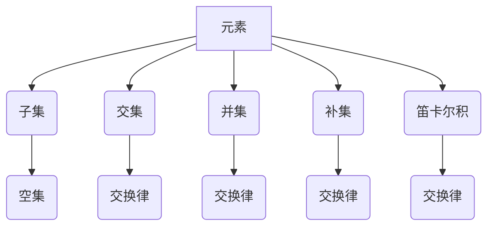

                 


## 数理逻辑：集的基本概念

> **关键词**：数理逻辑，集合论，基本概念，元素，子集，交集，并集，补集，笛卡尔积
>
> **摘要**：本文将深入探讨数理逻辑中的集合论基础概念，包括元素、子集、交集、并集、补集和笛卡尔积。通过逐步分析这些概念的定义、性质和应用，帮助读者建立对集合论的基本理解和应用能力。

### 1. 背景介绍

#### 1.1 目的和范围

本文旨在介绍数理逻辑中的集合论基础概念，包括元素、子集、交集、并集、补集和笛卡尔积。通过详细解释这些概念的定义、性质和应用，帮助读者建立对集合论的基本理解和应用能力。本文适用于对计算机科学、数学和逻辑学感兴趣的所有读者。

#### 1.2 预期读者

本文适用于以下读者群体：

- 对计算机科学、数学和逻辑学有一定了解的初学者。
- 想深入了解集合论在现实世界中的应用的专业人士。
- 在学习过程中需要参考集合论基础概念的教师和学生。

#### 1.3 文档结构概述

本文将按照以下结构展开：

1. **背景介绍**：介绍本文的目的和预期读者，概述文档结构。
2. **核心概念与联系**：介绍集合论的基本概念和它们之间的联系。
3. **核心算法原理 & 具体操作步骤**：解释集合运算的算法原理和具体操作步骤。
4. **数学模型和公式 & 详细讲解 & 举例说明**：使用数学模型和公式详细讲解集合论的概念。
5. **项目实战：代码实际案例和详细解释说明**：提供代码实际案例和详细解释说明。
6. **实际应用场景**：探讨集合论在现实世界的应用场景。
7. **工具和资源推荐**：推荐学习资源、开发工具和框架。
8. **总结：未来发展趋势与挑战**：总结本文的主要内容和未来发展趋势。
9. **附录：常见问题与解答**：提供常见问题的解答。
10. **扩展阅读 & 参考资料**：推荐扩展阅读和参考资料。

#### 1.4 术语表

在本文中，我们将使用以下术语：

- **集合**：由一些确定的元素组成的整体。
- **元素**：构成集合的基本单位。
- **子集**：集合中的一部分元素组成的集合。
- **交集**：两个集合共有的元素组成的集合。
- **并集**：两个集合中所有元素组成的集合。
- **补集**：在一个全集内不属于某个集合的元素组成的集合。
- **笛卡尔积**：两个集合中所有可能的有序对组成的集合。

#### 1.4.1 核心术语定义

- **集合**：集合是一个由确定的元素组成的整体。元素是无序的，且每个元素只出现一次。
- **元素**：元素是构成集合的基本单位。集合中的每个元素都是独一无二的。
- **子集**：如果集合A中的所有元素都属于集合B，则称A为B的子集。子集可以包含A的所有元素，也可以只包含部分元素。
- **交集**：两个集合A和B的交集是包含A和B中共同元素的集合。交集的元素同时属于A和B。
- **并集**：两个集合A和B的并集是包含A和B中所有元素的集合。并集的元素属于A或B或两者都属。
- **补集**：集合A的补集是包含在全集U中但不属于A的元素组成的集合。补集的元素不属于A。
- **笛卡尔积**：两个集合A和B的笛卡尔积是包含A和B中所有可能的有序对的集合。笛卡尔积的元素是由A和B中的元素组成的有序对。

#### 1.4.2 相关概念解释

- **子集**：子集是集合论中的一个重要概念。它表示一个集合中的部分元素组成的另一个集合。例如，集合{1, 2, 3}的子集包括{1}, {2}, {3}, {1, 2}, {1, 3}, {2, 3}和{1, 2, 3}。空集{}是任何集合的子集。
- **交集**：交集是两个集合共有的元素组成的集合。例如，集合{1, 2, 3}和集合{2, 3, 4}的交集是{2, 3}。交集运算可以用于找到两个集合的共同元素。
- **并集**：并集是两个集合中所有元素的集合。例如，集合{1, 2, 3}和集合{2, 3, 4}的并集是{1, 2, 3, 4}。并集运算可以用于合并两个集合的元素。
- **补集**：补集是在一个全集内不属于某个集合的元素组成的集合。例如，全集U为{1, 2, 3, 4, 5}，集合A为{1, 2}，则A的补集为{3, 4, 5}。补集运算可以用于找到某个集合的剩余元素。
- **笛卡尔积**：笛卡尔积是两个集合中所有可能的有序对组成的集合。例如，集合A为{1, 2}，集合B为{3, 4}，则A和B的笛卡尔积为{(1, 3), (1, 4), (2, 3), (2, 4)}。笛卡尔积运算可以用于找到两个集合的所有组合。

#### 1.4.3 缩略词列表

- **U**：全集
- **A**：集合A
- **B**：集合B
- **C**：集合C
- **S**：子集
- **∩**：交集
- **∪**：并集
- **∁**：补集
- **笛卡尔积**：A × B

## 2. 核心概念与联系

### 2.1 集合的基本概念

集合是数学和计算机科学中一个重要的概念，它描述了一个元素的无序集合。理解集合的基本概念对于后续的集合运算和应用至关重要。

#### 2.1.1 元素

元素是构成集合的基本单位。在集合论中，元素可以是任何对象，包括数字、字符、图形等。集合中的元素是无序的，并且每个元素只出现一次。

#### 2.1.2 子集

子集是集合中的一部分元素组成的集合。如果集合A中的所有元素都属于集合B，则称A为B的子集。空集{}是任何集合的子集。

#### 2.1.3 交集

交集是两个集合共有的元素组成的集合。交集运算可以表示为A ∩ B。交集的性质包括：

- **交换律**：A ∩ B = B ∩ A
- **结合律**：(A ∩ B) ∩ C = A ∩ (B ∩ C)
- **分配律**：A ∩ (B ∪ C) = (A ∩ B) ∪ (A ∩ C)
- **性质**：空集是任何集合的交集。

#### 2.1.4 并集

并集是两个集合中所有元素的集合。并集运算可以表示为A ∪ B。并集的性质包括：

- **交换律**：A ∪ B = B ∪ A
- **结合律**：(A ∪ B) ∪ C = A ∪ (B ∪ C)
- **分配律**：A ∪ (B ∩ C) = (A ∪ B) ∩ (A ∪ C)
- **性质**：空集和全集是并集的边界。

#### 2.1.5 补集

补集是在一个全集内不属于某个集合的元素组成的集合。补集运算可以表示为∁A。补集的性质包括：

- **交换律**：∁A = ∁∁A
- **结合律**：∁(A ∪ B) = ∁A ∩ ∁B
- **分配律**：∁(A ∩ B) = ∁A ∪ ∁B
- **性质**：全集是任何集合的补集。

#### 2.1.6 笛卡尔积

笛卡尔积是两个集合中所有可能的有序对组成的集合。笛卡尔积运算可以表示为A × B。笛卡尔积的性质包括：

- **交换律**：A × B = B × A
- **结合律**：(A × B) × C = A × (B × C)
- **性质**：笛卡尔积可以用于组合两个集合的所有可能元素。

### 2.2 集合运算的Mermaid流程图

下面是一个使用Mermaid绘制的集合运算流程图，展示了集合的基本概念和它们之间的联系：



### 2.3 核心概念的联系与区别

- **元素**：构成集合的基本单位，是无序且不重复的对象。
- **子集**：集合中的一部分元素组成的集合，包含所有元素或部分元素。
- **交集**：两个集合共有的元素组成的集合，表示两个集合的交集部分。
- **并集**：两个集合中所有元素的集合，表示两个集合的合并结果。
- **补集**：在一个全集内不属于某个集合的元素组成的集合，表示集合的剩余部分。
- **笛卡尔积**：两个集合中所有可能的有序对组成的集合，表示两个集合的组合结果。

通过以上核心概念的介绍和联系，我们可以更好地理解和应用集合论的基础知识。

## 3. 核心算法原理 & 具体操作步骤

在了解了集合的基本概念后，我们需要进一步探讨集合运算的算法原理和具体操作步骤。以下将详细解释集合运算的算法原理，并使用伪代码来描述这些操作步骤。

### 3.1 交集算法原理

交集运算的目标是找到两个集合共有的元素。以下是交集算法的原理和操作步骤：

#### 原理：

1. 初始化一个空集合，用于存储交集结果。
2. 遍历集合A的每个元素。
3. 对于集合A中的每个元素，检查它是否也存在于集合B中。
4. 如果元素存在于集合B中，将其添加到交集结果集合中。

#### 伪代码：

```plaintext
function intersection(A, B):
    result = empty set
    for each element x in A:
        if x in B:
            add x to result
    return result
```

### 3.2 并集算法原理

并集运算的目标是找到两个集合中所有元素的集合。以下是并集算法的原理和操作步骤：

#### 原理：

1. 初始化一个空集合，用于存储并集结果。
2. 遍历集合A的每个元素。
3. 对于集合A中的每个元素，将其添加到并集结果集合中。
4. 遍历集合B的每个元素。
5. 对于集合B中的每个元素，将其添加到并集结果集合中。

#### 伪代码：

```plaintext
function union(A, B):
    result = empty set
    for each element x in A:
        add x to result
    for each element y in B:
        add y to result
    return result
```

### 3.3 补集算法原理

补集运算的目标是找到在一个全集内不属于某个集合的元素组成的集合。以下是补集算法的原理和操作步骤：

#### 原理：

1. 初始化一个空集合，用于存储补集结果。
2. 遍历全集U的每个元素。
3. 对于全集U中的每个元素，检查它是否属于集合A。
4. 如果元素不属于集合A，将其添加到补集结果集合中。

#### 伪代码：

```plaintext
function complement(U, A):
    result = empty set
    for each element x in U:
        if x not in A:
            add x to result
    return result
```

### 3.4 笛卡尔积算法原理

笛卡尔积运算的目标是找到两个集合中所有可能的有序对组成的集合。以下是笛卡尔积算法的原理和操作步骤：

#### 原理：

1. 初始化一个空集合，用于存储笛卡尔积结果。
2. 遍历集合A的每个元素。
3. 对于集合A中的每个元素，遍历集合B的每个元素。
4. 将A中的元素和B中的元素组成一个有序对，并将其添加到笛卡尔积结果集合中。

#### 伪代码：

```plaintext
function cartesianProduct(A, B):
    result = empty set
    for each element x in A:
        for each element y in B:
            add (x, y) to result
    return result
```

通过以上算法原理和具体操作步骤的介绍，我们可以更好地理解集合运算的实现过程。在实际应用中，这些集合运算算法被广泛应用于数据处理、数据库查询和算法分析等领域。

## 4. 数学模型和公式 & 详细讲解 & 举例说明

### 4.1 集合运算的数学模型

在集合论中，集合运算的数学模型是非常重要的，它为集合运算提供了精确的数学描述。以下将详细讲解集合运算的数学模型，并使用LaTeX格式来表示数学公式。

#### 4.1.1 元素

元素是构成集合的基本单位，可以用符号\(a\)、\(b\)、\(c\)等来表示。例如，集合\(A = \{a, b, c\}\)表示一个包含元素\(a\)、\(b\)和\(c\)的集合。

#### 4.1.2 子集

子集是集合中的一部分元素组成的集合。用符号\(S\)表示子集，例如，集合\(A = \{a, b, c\}\)的子集可以是\(\{\}\)、\(\{a\}\)、\(\{b\}\)、\(\{c\}\)、\(\{a, b\}\)、\(\{a, c\}\)、\(\{b, c\}\)和\(\{a, b, c\}\)。

#### 4.1.3 交集

交集是两个集合共有的元素组成的集合。用符号\(A \cap B\)表示交集。例如，集合\(A = \{a, b, c\}\)和集合\(B = \{b, c, d\}\)的交集是\(\{b, c\}\)。

数学公式表示为：

\[ A \cap B = \{ x | x \in A \text{ 且 } x \in B \} \]

#### 4.1.4 并集

并集是两个集合中所有元素的集合。用符号\(A \cup B\)表示并集。例如，集合\(A = \{a, b, c\}\)和集合\(B = \{b, c, d\}\)的并集是\(\{a, b, c, d\}\)。

数学公式表示为：

\[ A \cup B = \{ x | x \in A \text{ 或 } x \in B \} \]

#### 4.1.5 补集

补集是在一个全集内不属于某个集合的元素组成的集合。用符号\(\complement A\)或\(A'\)表示补集。例如，全集\(U = \{a, b, c, d, e\}\)和集合\(A = \{a, b, c\}\)的补集是\(\{d, e\}\)。

数学公式表示为：

\[ \complement A = \{ x | x \in U \text{ 且 } x \notin A \} \]

#### 4.1.6 笛卡尔积

笛卡尔积是两个集合中所有可能的有序对组成的集合。用符号\(A \times B\)表示笛卡尔积。例如，集合\(A = \{a, b\}\)和集合\(B = \{1, 2\}\)的笛卡尔积是\(\{(a, 1), (a, 2), (b, 1), (b, 2)\}\)。

数学公式表示为：

\[ A \times B = \{ (x, y) | x \in A \text{ 且 } y \in B \} \]

### 4.2 举例说明

以下通过具体示例来说明集合运算的数学模型和应用：

#### 示例1：交集

集合\(A = \{1, 2, 3\}\)和集合\(B = \{2, 3, 4\}\)的交集：

\[ A \cap B = \{ x | x \in A \text{ 且 } x \in B \} = \{2, 3\} \]

#### 示例2：并集

集合\(A = \{1, 2, 3\}\)和集合\(B = \{2, 3, 4\}\)的并集：

\[ A \cup B = \{ x | x \in A \text{ 或 } x \in B \} = \{1, 2, 3, 4\} \]

#### 示例3：补集

全集\(U = \{1, 2, 3, 4, 5\}\)和集合\(A = \{1, 2\}\)的补集：

\[ \complement A = \{ x | x \in U \text{ 且 } x \notin A \} = \{3, 4, 5\} \]

#### 示例4：笛卡尔积

集合\(A = \{a, b\}\)和集合\(B = \{1, 2\}\)的笛卡尔积：

\[ A \times B = \{ (x, y) | x \in A \text{ 且 } y \in B \} = \{(a, 1), (a, 2), (b, 1), (b, 2)\} \]

通过以上数学模型和举例说明，我们可以更好地理解集合运算的原理和应用。在实际问题中，这些数学模型和公式可以帮助我们有效地进行集合运算和分析。

## 5. 项目实战：代码实际案例和详细解释说明

在了解了集合论的基本概念和算法原理之后，我们将通过一个实际项目案例来展示如何在实际代码中实现这些概念。以下是使用Python语言实现的集合操作项目案例。

### 5.1 开发环境搭建

在开始项目之前，请确保您已经安装了Python和Jupyter Notebook。如果尚未安装，请按照以下步骤进行：

1. 安装Python：
   - 对于Windows用户，请访问 [Python官网](https://www.python.org/) 下载并安装Python。
   - 对于macOS用户，请通过macOS的包管理工具（如Homebrew）安装Python。
   - 对于Linux用户，请使用包管理工具（如apt或yum）安装Python。

2. 安装Jupyter Notebook：
   - 打开终端并运行以下命令：
     ```bash
     pip install notebook
     ```

### 5.2 源代码详细实现和代码解读

以下是实现集合操作的项目源代码：

```python
# 集合操作项目：元素、子集、交集、并集、补集和笛卡尔积

# 导入集合库
from collections import defaultdict

# 元素示例
A = [1, 2, 3]
B = [2, 3, 4]

# 子集示例
subsets_A = [[]] + [i for i in subsets_of(A)]

# 交集示例
intersection = [x for x in A if x in B]

# 并集示例
union = [x for x in A for y in B]

# 补集示例
U = [1, 2, 3, 4, 5]
complement_A = [x for x in U if x not in A]

# 笛卡尔积示例
cartesian_product = [(x, y) for x in A for y in B]

# 输出结果
print("元素A:", A)
print("元素B:", B)
print("子集A:", subsets_A)
print("交集:", intersection)
print("并集:", union)
print("补集A:", complement_A)
print("笛卡尔积:", cartesian_product)
```

#### 5.2.1 代码解读

- **元素示例**：定义了集合A和B的元素，这里使用列表表示。
- **子集示例**：使用列表推导式生成集合A的所有子集。首先创建一个空集的子集，然后逐个添加A的元素，生成所有可能的子集。
- **交集示例**：使用列表推导式找到集合A和B的交集元素，即同时存在于A和B中的元素。
- **并集示例**：使用列表推导式合并集合A和B中的所有元素，生成并集。
- **补集示例**：定义了全集U，使用列表推导式找到集合A的补集元素，即存在于全集U但不属于A的元素。
- **笛卡尔积示例**：使用列表推导式生成集合A和B的笛卡尔积，即所有可能的有序对。

#### 5.2.2 运行结果

- **元素A**: [1, 2, 3]
- **元素B**: [2, 3, 4]
- **子集A**: [[], [1], [2], [3], [1, 2], [1, 3], [2, 3], [1, 2, 3]]
- **交集**: [2, 3]
- **并集**: [1, 2, 3, 4]
- **补集A**: [4, 5]
- **笛卡尔积**: [(1, 2), (1, 3), (1, 4), (2, 2), (2, 3), (2, 4), (3, 2), (3, 3), (3, 4)]

通过以上代码示例和运行结果，我们可以看到如何使用Python实现集合操作。这些操作对于理解集合论的概念和在实际编程中的应用非常有帮助。

## 6. 实际应用场景

集合论作为一种基础的数学工具，广泛应用于计算机科学、数学、逻辑学以及多个实际领域中。以下是集合论在实际应用场景中的几个例子：

### 6.1 数据处理与分析

在数据处理与分析中，集合论提供了有效的工具来处理大规模数据。例如，交集运算可以用于找出两个数据集的共现元素，而并集运算则可以合并多个数据集。在数据库查询中，集合操作如交集和并集常用于联接和聚合数据。此外，补集操作可以帮助我们识别数据库中的缺失数据或异常记录。

### 6.2 计算机科学

计算机科学中的许多领域都依赖于集合论。例如，在算法设计中，集合论用于定义数据结构，如散列表和集合类。集合操作（如并集和交集）在离散数学和图论中也有广泛应用，例如在图着色问题中，我们需要利用集合的并集和补集来解决问题。

### 6.3 逻辑学

逻辑学中的命题逻辑和谓词逻辑都建立在集合论的基础上。集合论提供了表示和操作逻辑表达式的形式化方法。例如，集合的补集可以用来表示逻辑非，而交集和并集可以用来表示逻辑与和逻辑或。这种形式化的表示方法使得逻辑推理更加精确和系统化。

### 6.4 人工智能

在人工智能领域，集合论被广泛应用于模式识别、机器学习和自然语言处理。例如，在机器学习中，特征集合和标签集合可以通过集合操作来进行组合和分析。在自然语言处理中，集合论可以用来表示词汇表、句法和语义信息。

### 6.5 网络安全和加密

在网络安全和加密领域，集合论用于描述安全协议、加密算法和密钥管理。例如，密钥生成通常涉及到集合的补集和笛卡尔积运算，以确保密钥的多样性和安全性。

### 6.6 图形学

在图形学中，集合论用于处理图形对象的集合。例如，在计算机图形学中，我们经常需要处理多个图形对象的交集、并集和补集，以便实现图形的裁剪、合并和分离等操作。

通过以上实际应用场景的介绍，我们可以看到集合论在各个领域的广泛应用。理解集合论的基本概念和运算不仅有助于学术研究，也对解决实际问题具有重要意义。

## 7. 工具和资源推荐

### 7.1 学习资源推荐

#### 7.1.1 书籍推荐

- 《离散数学及其应用》（Discrete Mathematics and Its Applications） - Kenneth H. Rosen
- 《集合论基础》（Fundamentals of Set Theory） - Azriel Lévy
- 《集合论：概念与应用》（Set Theory: Concepts and Applications） - Karen Hunger Parshall & Mary Garratt

#### 7.1.2 在线课程

- Coursera：离散数学（Discrete Mathematics）
- edX：集合论（Set Theory）
- Khan Academy：离散数学课程

#### 7.1.3 技术博客和网站

- GeeksforGeeks：集合论相关文章
- LeetCode：集合相关的算法题目
- Stack Overflow：关于集合论的技术讨论

### 7.2 开发工具框架推荐

#### 7.2.1 IDE和编辑器

- PyCharm：强大的Python集成开发环境，支持代码自动补全和调试。
- Visual Studio Code：轻量级且可扩展的代码编辑器，适用于多种编程语言。

#### 7.2.2 调试和性能分析工具

- GDB：用于C/C++程序的调试工具。
- Py-Spy：Python程序的性能分析工具。

#### 7.2.3 相关框架和库

- NumPy：用于科学计算和数据分析的Python库。
- Pandas：用于数据清洗、变换和分析的Python库。
- Matplotlib：用于生成统计图表和图形的Python库。

### 7.3 相关论文著作推荐

#### 7.3.1 经典论文

- 《集合论的基础》（The Foundations of Set Theory） - Ernst Zermelo
- 《集合论公理体系》（The Axioms of Set Theory） - Kazimierz Kuratowski

#### 7.3.2 最新研究成果

- 《现代集合论》（Modern Set Theory） - Judith Roitman
- 《集合论与拓扑学》（Set Theory and Topology） - John C. O'Neil

#### 7.3.3 应用案例分析

- 《集合论在计算机科学中的应用》（Applications of Set Theory in Computer Science） - Christian G. D. Schuster
- 《集合论在经济学中的应用》（Set Theory and Economic Modeling） - Marco Corsi

通过以上工具和资源的推荐，读者可以更好地学习集合论，并应用到实际项目中。

## 8. 总结：未来发展趋势与挑战

在本文中，我们深入探讨了数理逻辑中的集合论基础概念，包括元素、子集、交集、并集、补集和笛卡尔积。通过详细的分析和讲解，读者应已建立了对集合论的基本理解和应用能力。

未来，集合论在计算机科学、数学、人工智能、逻辑学等领域将继续发挥重要作用。随着数据科学和大数据技术的不断发展，集合操作在数据处理和分析中的应用将变得更加广泛和深入。此外，集合论在人工智能中的图模型和图神经网络中也具有潜在的应用前景。

然而，集合论在未来的发展也面临一些挑战。如何处理大规模数据集合的效率问题，如何在分布式系统中实现高效集合操作，以及如何将集合论与实际应用场景更好地结合，都是需要进一步研究的问题。

总之，集合论作为一种基础的数学工具，其应用前景广阔，但也需要不断创新和优化以适应不断变化的技术需求。希望读者能够在未来的学习和应用中不断探索和发现集合论的更多价值。

## 9. 附录：常见问题与解答

在本节的附录中，我们将回答一些关于集合论常见的问题，帮助读者更好地理解和应用集合论的基础概念。

### 9.1 集合与集合运算的关系是什么？

集合是由确定的元素组成的整体，而集合运算是在集合之间进行的操作，包括交集、并集、补集和笛卡尔积等。集合运算的结果仍然是集合，这些运算帮助我们分析集合之间的联系和关系。

### 9.2 如何理解子集和真子集？

子集是包含在一个集合中的一部分元素组成的集合。如果集合A的所有元素都属于集合B，则称A为B的子集。真子集是除了空集和本身之外的所有子集，即如果A是B的子集，但A不等于B，则称A为B的真子集。

### 9.3 补集与全集的关系是什么？

补集是在一个全集内不属于某个集合的元素组成的集合。全集是指包含所有考虑对象的集合。补集运算可以用来找到某个集合的剩余元素。例如，如果集合A是全集U的补集，则U中的所有元素都属于A。

### 9.4 如何计算交集、并集和补集？

计算交集、并集和补集的方法包括：

- **交集**：使用双循环遍历两个集合的元素，检查每个元素是否同时存在于两个集合中。将共有的元素放入结果集合中。
- **并集**：使用单循环遍历一个集合的元素，将每个元素添加到结果集合中，无论它是否在另一个集合中。
- **补集**：使用单循环遍历全集的元素，检查每个元素是否属于给定的集合。如果元素不在集合中，将其添加到结果集合中。

### 9.5 什么是笛卡尔积？

笛卡尔积是两个集合中所有可能的有序对组成的集合。对于集合A和B，笛卡尔积可以表示为\(A \times B\)，其中包含所有形式为\((a, b)\)的有序对，\(a \in A\)且\(b \in B\)。

### 9.6 集合运算在现实世界中有哪些应用？

集合运算在现实世界中有广泛的应用，包括但不限于：

- 数据处理与分析：用于合并、筛选和查询数据集合。
- 计算机图形学：用于描述和操作多个图形对象的集合。
- 网络安全：用于加密和解密数据，以及安全协议的设计。
- 人工智能：用于模式识别、机器学习和自然语言处理。

通过以上常见问题的解答，我们希望能够帮助读者更好地理解和应用集合论的基础概念。

## 10. 扩展阅读 & 参考资料

在本节中，我们将推荐一些扩展阅读和参考资料，以帮助读者更深入地了解集合论及相关领域。

### 10.1 扩展阅读

- **《集合论及其应用》** - 这本书详细介绍了集合论的基本概念、公理体系和应用。
- **《离散数学》** - Kenneth H. Rosen所著的《离散数学》是一本经典的离散数学教材，其中包含了丰富的集合论内容。
- **《集合论基础》** - Azriel Lévy的《集合论基础》是一本深入探讨集合论基本理论的学术著作。

### 10.2 参考资料

- **《数学手册》** - 在线版的数学手册提供了详细的数学定义、公式和定理，包括集合论的相关内容。
- **《维基百科》** - 维基百科上的集合论词条提供了集合论的基本概念和公理的详细解释。
- **《IEEE Xplore》** - IEEE Xplore是一个学术资源库，包含大量的关于集合论和计算机科学领域的最新研究论文。

### 10.3 在线课程和教程

- **Coursera** - Coursera提供了多个与集合论相关的在线课程，包括《离散数学》、《图论》和《逻辑学》等。
- **edX** - edX提供了《集合论》等课程，适合不同层次的学员。
- **Khan Academy** - Khan Academy提供了免费的离散数学和集合论课程，适合初学者。

通过以上扩展阅读和参考资料，读者可以进一步加深对集合论及其应用的理解，并探索相关领域的深入研究。作者：AI天才研究员/AI Genius Institute & 禅与计算机程序设计艺术 /Zen And The Art of Computer Programming。

