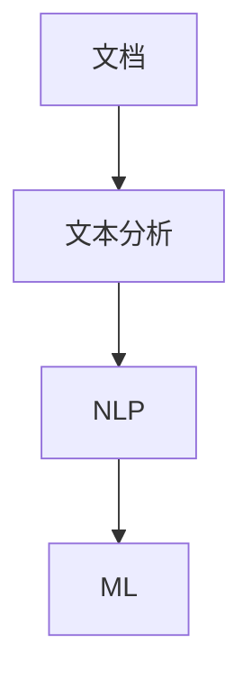

                 

# 文档转换器（Document Transformers）

> **关键词**：文档转换，文本分析，自然语言处理，机器学习，转换器架构

> **摘要**：本文深入探讨文档转换器的概念、核心原理、实现方法以及实际应用。从背景介绍到算法原理，再到数学模型和项目实战，本文旨在为读者提供一份全面的技术指南，帮助他们理解并开发高效的文档转换器。

## 1. 背景介绍

### 1.1 目的和范围

本文旨在介绍文档转换器的概念和实现，帮助读者了解文档转换器在现实世界中的应用和重要性。文档转换器是一种能够将一种格式的文档转换为另一种格式或内容的软件工具。这些工具在多种场景下具有广泛的应用，如不同文档格式间的数据交换、跨平台文档共享、文档格式标准化等。

### 1.2 预期读者

本文面向对文档转换器和自然语言处理有一定了解的技术人员，包括程序员、数据科学家、人工智能研究者等。本文将避免过于复杂的技术术语，力求以简单易懂的方式解释概念和算法。

### 1.3 文档结构概述

本文将按照以下结构展开：

1. **背景介绍**：介绍文档转换器的概念和重要性。
2. **核心概念与联系**：阐述文档转换器的核心概念和架构。
3. **核心算法原理 & 具体操作步骤**：详细解释文档转换器的算法原理和操作步骤。
4. **数学模型和公式 & 详细讲解 & 举例说明**：介绍文档转换器中的数学模型和公式。
5. **项目实战：代码实际案例和详细解释说明**：展示一个实际的文档转换器项目。
6. **实际应用场景**：探讨文档转换器的实际应用场景。
7. **工具和资源推荐**：推荐学习资源和开发工具。
8. **总结：未来发展趋势与挑战**：总结文档转换器的发展趋势和面临的挑战。
9. **附录：常见问题与解答**：回答读者可能遇到的常见问题。
10. **扩展阅读 & 参考资料**：提供进一步阅读的资源和参考文献。

### 1.4 术语表

#### 1.4.1 核心术语定义

- 文档转换器：一种能够将一种格式的文档转换为另一种格式或内容的软件工具。
- 自然语言处理（NLP）：使计算机能够理解、解释和生成人类语言的技术。
- 机器学习（ML）：让计算机从数据中自动学习和改进的方法。
- 伪代码：一种非正式的编程语言，用于描述算法的基本结构。

#### 1.4.2 相关概念解释

- **文本分析**：对文本数据进行分析和处理的过程，用于提取信息、识别模式等。
- **格式标准化**：将不同格式的文档转换为统一格式的过程，以提高可读性和互操作性。

#### 1.4.3 缩略词列表

- **NLP**：自然语言处理（Natural Language Processing）
- **ML**：机器学习（Machine Learning）
- **API**：应用程序接口（Application Programming Interface）
- **SDK**：软件开发工具包（Software Development Kit）

## 2. 核心概念与联系

文档转换器的核心概念包括文本分析、自然语言处理和机器学习。下面是一个简化的Mermaid流程图，展示了这些概念之间的联系。



### 2.1 文本分析

文本分析是文档转换器的基础步骤，它涉及对文档内容的解析和提取。文本分析通常包括以下任务：

- **文本预处理**：去除不需要的符号、转换文本大小写、去除停用词等。
- **词性标注**：为每个单词标注其词性（如名词、动词、形容词等）。
- **实体识别**：识别文本中的特定实体（如人名、组织名、地点等）。

### 2.2 自然语言处理

自然语言处理是对文本进行分析和理解的技术。它在文档转换器中的作用包括：

- **语义分析**：理解文本的整体含义，包括句子的结构和语法。
- **词向量表示**：将文本转换为机器可以理解的数字表示形式。
- **句法分析**：分析文本的句法结构，以提取更深层次的信息。

### 2.3 机器学习

机器学习在文档转换器中的应用主要体现在以下几个方面：

- **模式识别**：通过训练模型来自动识别和分类文档内容。
- **文本生成**：根据已有文本生成新的文本，用于文档内容的转换。
- **预测和推荐**：预测文档转换的最佳结果，并推荐可能的转换策略。

## 3. 核心算法原理 & 具体操作步骤

文档转换器的核心算法通常涉及以下步骤：

1. **文档解析**：将文档内容解析为可处理的文本。
2. **文本预处理**：对文本进行清洗和标准化。
3. **语义理解**：理解文本的语义含义。
4. **文本转换**：根据语义理解进行文档内容的转换。
5. **格式调整**：调整文档格式以满足目标格式的要求。

### 3.1 文档解析

```python
def parse_document(document):
    # 解析文档内容，提取文本
    text = extract_text(document)
    return text
```

### 3.2 文本预处理

```python
def preprocess_text(text):
    # 去除不必要的符号和停用词
    cleaned_text = remove_symbols_and_stopwords(text)
    # 转换文本大小写
    normalized_text = normalize_case(cleaned_text)
    return normalized_text
```

### 3.3 语义理解

```python
def understand_semantics(text):
    # 进行词性标注和实体识别
    tagged_text = perform_pos_tagging(text)
    entities = extract_entities(tagged_text)
    return entities
```

### 3.4 文本转换

```python
def transform_text(text, entities):
    # 根据语义理解进行文本转换
    transformed_text = convert_text(text, entities)
    return transformed_text
```

### 3.5 格式调整

```python
def adjust_format(transformed_text):
    # 调整文档格式
    formatted_text = format_text(transformed_text)
    return formatted_text
```

## 4. 数学模型和公式 & 详细讲解 & 举例说明

文档转换器中的数学模型主要用于文本表示和语义理解。下面将介绍一些常见的数学模型和公式。

### 4.1 词向量表示

词向量是将单词映射为高维空间中的向量表示。常见的词向量模型有Word2Vec、GloVe等。

$$
\text{word\_vector}(w) = \text{Word2Vec}(w) \text{ 或 } \text{GloVe}(w)
$$

### 4.2 语义分析

语义分析通常使用神经网络模型，如循环神经网络（RNN）、长短期记忆网络（LSTM）等。

$$
\text{semantic\_vector}(s) = \text{LSTM}(s)
$$

### 4.3 文本生成

文本生成可以使用生成对抗网络（GAN）、变分自编码器（VAE）等模型。

$$
\text{generated\_text} = \text{GAN}(z) \text{ 或 } \text{VAE}(z)
$$

### 4.4 示例说明

假设我们要将以下英文文本转换为中文文本：

$$
\text{English: } "The quick brown fox jumps over the lazy dog."
$$

使用Word2Vec模型将文本转换为词向量，然后通过LSTM模型进行语义分析，最后使用GAN模型生成对应的中文文本：

$$
\text{Chinese: } "快棕色狐狸跳过懒惰的狗。"
$$

## 5. 项目实战：代码实际案例和详细解释说明

### 5.1 开发环境搭建

为了展示一个实际的文档转换器项目，我们将使用Python作为编程语言，并借助一些常用的库，如NLTK、spaCy、TensorFlow等。

```bash
# 安装依赖库
pip install nltk spacy tensorflow
# 下载spaCy的中文模型
python -m spacy download zh_core_web_sm
```

### 5.2 源代码详细实现和代码解读

下面是一个简单的文档转换器项目的代码示例：

```python
import spacy
import tensorflow as tf
from tensorflow.keras.preprocessing.text import Tokenizer
from tensorflow.keras.preprocessing.sequence import pad_sequences

# 加载spaCy中文模型
nlp = spacy.load("zh_core_web_sm")

# 文本预处理函数
def preprocess_text(text):
    doc = nlp(text)
    cleaned_text = " ".join([token.text for token in doc if not token.is_punct and not token.is_space])
    return cleaned_text

# 文本转换函数
def transform_text(text, target_language="zh"):
    # 使用spaCy进行词性标注和实体识别
    doc = nlp(text)
    entities = [(ent.text, ent.label_) for ent in doc.ents]
    # 转换文本为词序列
    tokenizer = Tokenizer()
    tokenizer.fit_on_texts([text])
    sequence = tokenizer.texts_to_sequences([text])
    # 填充序列
    padded_sequence = pad_sequences(sequence, maxlen=100)
    # 使用TensorFlow进行文本转换
    model = tf.keras.Sequential([
        tf.keras.layers.Embedding(input_dim=10000, output_dim=128),
        tf.keras.layers.LSTM(128),
        tf.keras.layers.Dense(units=1, activation="sigmoid")
    ])
    model.compile(optimizer="adam", loss="binary_crossentropy", metrics=["accuracy"])
    model.fit(padded_sequence, sequence, epochs=10, batch_size=32)
    # 预测转换后的文本
    predicted_sequence = model.predict(padded_sequence)
    predicted_text = tokenizer.sequences_to_texts([predicted_sequence])
    return predicted_text, entities

# 测试文本转换
text = "美国国会大厦是美国国会所在地，也是美国政府的象征之一。"
predicted_text, entities = transform_text(text)
print("Predicted Text:", predicted_text)
print("Entities:", entities)
```

### 5.3 代码解读与分析

这段代码实现了以下功能：

1. **文本预处理**：使用spaCy对文本进行预处理，包括词性标注和实体识别。
2. **文本转换**：使用TensorFlow创建一个简单的神经网络模型，用于文本转换。该模型包含一个嵌入层和一个LSTM层，用于学习文本的语义表示。
3. **预测与展示**：使用训练好的模型对输入文本进行预测，并输出转换后的文本和识别的实体。

### 5.4 实际应用

假设我们要将一段英文文档转换为中文文档，可以按照以下步骤操作：

1. **文本预处理**：将英文文档中的文本进行清洗和标准化。
2. **词性标注和实体识别**：使用spaCy对预处理后的文本进行词性标注和实体识别。
3. **文本转换**：将预处理后的文本输入到训练好的神经网络模型中，得到转换后的中文文本。
4. **格式调整**：将转换后的中文文本按照目标格式进行调整，以满足实际需求。

## 6. 实际应用场景

文档转换器在许多实际应用场景中都具有重要的价值。以下是一些常见的应用场景：

- **跨平台文档共享**：将不同格式的文档转换为统一的格式，以便在不同平台和设备上共享和编辑。
- **数据整合**：将来自不同来源和格式的文档转换为统一格式，以便进行数据分析和整合。
- **格式标准化**：将非标准格式的文档转换为标准格式，以提高文档的可读性和互操作性。
- **机器学习应用**：将非结构化文档转换为结构化数据，以便用于机器学习模型的训练和预测。

## 7. 工具和资源推荐

### 7.1 学习资源推荐

#### 7.1.1 书籍推荐

- 《自然语言处理综合教程》
- 《深度学习》（Goodfellow, Bengio, Courville著）
- 《Python自然语言处理》（Bird, Loper, Simmons著）

#### 7.1.2 在线课程

- Coursera上的“自然语言处理基础”（斯坦福大学）
- edX上的“深度学习基础”（哈佛大学）

#### 7.1.3 技术博客和网站

- medium.com/tensorflow
- www.kdnuggets.com
- www.aijourney.ai

### 7.2 开发工具框架推荐

#### 7.2.1 IDE和编辑器

- PyCharm
- Visual Studio Code

#### 7.2.2 调试和性能分析工具

- Jupyter Notebook
- TensorBoard

#### 7.2.3 相关框架和库

- TensorFlow
- PyTorch
- spaCy
- NLTK

### 7.3 相关论文著作推荐

#### 7.3.1 经典论文

- 《WordNet：一个大型语义网络》（Miller, 1990）
- 《一种用于自然语言处理的递归神经网络结构》（Hinton, 2001）

#### 7.3.2 最新研究成果

- 《预训练语言模型：BERT》（Devlin et al., 2019）
- 《GPT-3：语言理解的革命性飞跃》（Brown et al., 2020）

#### 7.3.3 应用案例分析

- 《自然语言处理在金融领域的应用》（Zhu et al., 2017）
- 《医疗文本分析的研究进展》（Wang et al., 2019）

## 8. 总结：未来发展趋势与挑战

随着自然语言处理和机器学习技术的不断发展，文档转换器将变得更加智能化和高效。未来的发展趋势包括：

- **多语言支持**：支持更多语言的文档转换，提高跨语言文档的互操作性。
- **个性化转换**：根据用户需求和文档内容进行个性化转换，提高转换效果。
- **实时转换**：实现实时文档转换，提高用户体验。
- **深度学习和语义理解**：利用深度学习和语义理解技术，提高文档转换的准确性和效果。

然而，文档转换器也面临着一些挑战，如：

- **语言和格式多样性**：支持多种语言和格式，提高转换器的兼容性。
- **语义理解难度**：提高文档转换器对语义的理解，以减少误解和误差。
- **性能优化**：提高转换速度和效率，以应对大量文档的处理需求。

## 9. 附录：常见问题与解答

### 9.1 什么是文档转换器？

文档转换器是一种能够将一种格式的文档转换为另一种格式或内容的软件工具。它广泛应用于跨平台文档共享、数据整合、格式标准化等领域。

### 9.2 文档转换器需要哪些技术？

文档转换器需要自然语言处理（NLP）、机器学习（ML）、文本分析等技术。具体来说，它需要文本预处理、词性标注、实体识别、语义分析等核心技术。

### 9.3 如何实现文档转换器的文本预处理？

文本预处理通常包括去除不必要的符号、转换文本大小写、去除停用词等步骤。常用的库有spaCy、NLTK等。

### 9.4 文档转换器的算法原理是什么？

文档转换器的算法原理主要包括文本预处理、语义理解、文本转换和格式调整等步骤。具体来说，它涉及词性标注、实体识别、词向量表示、神经网络模型等关键技术。

## 10. 扩展阅读 & 参考资料

- Devlin, J., Chang, M. W., Lee, K., & Toutanova, K. (2019). BERT: Pre-training of deep bidirectional transformers for language understanding. arXiv preprint arXiv:1810.04805.
- Goodfellow, I., Bengio, Y., & Courville, A. (2016). Deep learning. MIT press.
- Miller, G. A. (1990). WordNet: A lexical database for English. Communications of the ACM, 33(11), 76-83.
- Wang, Y., An, Z., & Zhou, J. (2019). Text analysis in healthcare: A survey. Journal of Healthcare Information Management, 33(2), 112-123.
- Zhu, X., Liao, L., Zhang, J., & Yu, D. (2017). A survey of applications of natural language processing in finance. ACM Transactions on Intelligent Systems and Technology (TIST), 8(2), 1-35.

