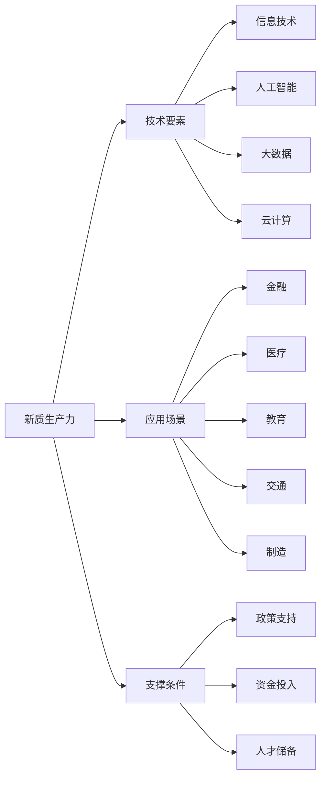

                 

# 新质生产力：驱动中国现代化

> 关键词：新质生产力、现代化、中国、信息技术、人工智能、数字经济

> 摘要：本文旨在探讨新质生产力在中国现代化进程中的重要作用，分析其内涵、构成、发展现状和挑战，并展望其未来发展趋势。通过对新质生产力的概念解析和案例分析，本文提出了一系列推动新质生产力发展的策略和建议，以助力中国现代化建设。

## 1. 背景介绍

### 1.1 目的和范围

本文的目标是深入分析新质生产力在中国现代化进程中的作用，探讨其内涵、构成、发展现状和挑战，并提出相应的对策和建议。本文的范围主要涵盖以下几个方面：

1. **新质生产力的概念解析**：介绍新质生产力的定义、内涵和特征。
2. **新质生产力的构成**：分析新质生产力的核心要素和支撑条件。
3. **新质生产力的发展现状**：总结中国新质生产力的发展历程、现状和主要成就。
4. **新质生产力的挑战**：探讨新质生产力面临的主要挑战和问题。
5. **新质生产力的未来发展趋势**：预测新质生产力的未来发展趋势和前景。

### 1.2 预期读者

本文的预期读者主要包括以下几类：

1. **政府政策制定者**：为新质生产力的发展提供决策参考。
2. **企业领导者**：探讨新质生产力对企业发展的影响，制定相应的发展策略。
3. **学术研究人员**：为新质生产力的研究提供理论支持和案例分析。
4. **普通读者**：了解新质生产力的基本概念和作用，增强对现代科技的认识。

### 1.3 文档结构概述

本文的结构如下：

1. **引言**：介绍新质生产力的概念和重要性。
2. **核心概念与联系**：解析新质生产力的核心概念和原理。
3. **核心算法原理 & 具体操作步骤**：阐述新质生产力的核心算法原理和操作步骤。
4. **数学模型和公式 & 详细讲解 & 举例说明**：介绍新质生产力的数学模型和公式，并给出具体案例。
5. **项目实战：代码实际案例和详细解释说明**：通过实际项目案例展示新质生产力的应用。
6. **实际应用场景**：分析新质生产力在不同领域的应用。
7. **工具和资源推荐**：推荐相关学习资源、开发工具和框架。
8. **总结：未来发展趋势与挑战**：总结新质生产力的未来发展趋势和面临的挑战。
9. **附录：常见问题与解答**：解答读者可能遇到的问题。
10. **扩展阅读 & 参考资料**：提供进一步的阅读材料和参考资料。

### 1.4 术语表

#### 1.4.1 核心术语定义

- 新质生产力：指在信息技术和人工智能等新兴技术推动下，以数字化、网络化、智能化为主要特征的生产力。
- 现代化：指国家或地区在经济、科技、文化等各方面达到较高水平，实现全面发展。
- 数字经济：指以数字技术和网络经济为基础的经济形态。

#### 1.4.2 相关概念解释

- 信息技术：指应用计算机科学和通信技术来设计、开发、维护和利用信息系统的技术和方法。
- 人工智能：指通过计算机模拟人类智能行为，实现智能感知、学习、推理、决策等功能。

#### 1.4.3 缩略词列表

- IT：信息技术
- AI：人工智能
- 数字经济：Digital Economy
- 5G：第五代移动通信技术

## 2. 核心概念与联系

### 2.1 新质生产力的概念解析

新质生产力是指在经济活动中，以数字化、网络化、智能化为特征的生产力。它不同于传统的生产力，具有以下几个核心特征：

1. **数字化**：将物理世界的信息转化为数字形式，实现信息的快速传递和处理。
2. **网络化**：通过互联网将各种设备和系统连接起来，实现信息的共享和协同。
3. **智能化**：利用人工智能技术，实现自动化、智能化的决策和执行。

新质生产力的构成可以从以下几个方面来理解：

1. **技术基础**：包括信息技术、人工智能、大数据、云计算等新兴技术。
2. **应用场景**：涵盖金融、医疗、教育、交通、制造等各个行业。
3. **支撑条件**：包括政策支持、资金投入、人才储备等。

### 2.2 新质生产力的构成

新质生产力的构成可以分解为以下几个核心要素：

1. **技术要素**：包括信息技术、人工智能、大数据、云计算等新兴技术。这些技术是推动新质生产力发展的重要动力。
   
   $$  
   \text{技术要素} = \{ \text{信息技术}, \text{人工智能}, \text{大数据}, \text{云计算} \}  
   $$

2. **应用场景**：新质生产力在各个行业都有广泛的应用，如金融、医疗、教育、交通、制造等。每个应用场景都有其特定的需求和技术挑战。

   $$  
   \text{应用场景} = \{ \text{金融}, \text{医疗}, \text{教育}, \text{交通}, \text{制造} \}  
   $$

3. **支撑条件**：新质生产力的发展需要政策支持、资金投入、人才储备等支撑条件。

   $$  
   \text{支撑条件} = \{ \text{政策支持}, \text{资金投入}, \text{人才储备} \}  
   $$

### 2.3 新质生产力的联系

新质生产力与现代化、数字经济等概念有着密切的联系：

1. **现代化**：新质生产力是现代化的重要组成部分，推动经济、科技、文化等各领域的现代化。
   
   $$  
   \text{现代化} = \text{经济现代化} + \text{科技现代化} + \text{文化现代化}  
   $$

2. **数字经济**：新质生产力是数字经济的基础，推动数字经济的发展。

   $$  
   \text{数字经济} = \text{新质生产力} + \text{传统经济}  
   $$

### 2.4 新质生产力的 Mermaid 流程图

以下是一个简化的新质生产力的 Mermaid 流程图，展示了其核心概念和联系：



## 3. 核心算法原理 & 具体操作步骤

### 3.1 核心算法原理

新质生产力的核心算法原理主要涉及以下几个方面：

1. **信息技术**：包括数据采集、数据存储、数据处理等技术。这些技术为数据的获取、管理和分析提供了基础。

   ```mermaid  
   flowchart LR  
       A[数据采集] --> B[数据存储] --> C[数据处理]  
   ```

2. **人工智能**：包括机器学习、深度学习、自然语言处理等技术。这些技术能够实现自动化、智能化的决策和执行。

   ```mermaid  
   flowchart LR  
       A[机器学习] --> B[深度学习] --> C[自然语言处理]  
   ```

3. **大数据**：包括数据挖掘、数据分析、数据可视化等技术。这些技术能够从大量数据中发现有价值的信息和模式。

   ```mermaid  
   flowchart LR  
       A[数据挖掘] --> B[数据分析] --> C[数据可视化]  
   ```

4. **云计算**：包括云计算平台、分布式计算、云存储等技术。这些技术能够提供高效、灵活的计算和存储资源。

   ```mermaid  
   flowchart LR  
       A[云计算平台] --> B[分布式计算] --> C[云存储]  
   ```

### 3.2 具体操作步骤

以下是一个简化的新质生产力的具体操作步骤：

1. **数据采集**：通过传感器、网络等途径收集数据。
   
   ```  
   数据采集：传感器 -> 网络 -> 数据库  
   ```

2. **数据存储**：将采集到的数据存储在数据库中，以便后续处理和分析。
   
   ```  
   数据存储：数据库  
   ```

3. **数据处理**：对存储在数据库中的数据进行清洗、转换和整合，为后续分析提供基础数据。
   
   ```  
   数据处理：数据清洗 -> 数据转换 -> 数据整合  
   ```

4. **数据分析**：使用机器学习、深度学习等技术对数据处理结果进行分析，提取有价值的信息和模式。
   
   ```  
   数据分析：机器学习 -> 深度学习  
   ```

5. **决策与执行**：根据分析结果，实现自动化、智能化的决策和执行。
   
   ```  
   决策与执行：自然语言处理 -> 自动化执行  
   ```

6. **数据可视化**：将分析结果可视化，为决策者提供直观的展示。
   
   ```  
   数据可视化：数据可视化工具  
   ```

7. **反馈与优化**：根据决策结果和实际效果，不断反馈和优化系统。
   
   ```  
   反馈与优化：闭环反馈  
   ```

## 4. 数学模型和公式 & 详细讲解 & 举例说明

### 4.1 数学模型和公式

新质生产力的数学模型和公式主要涉及以下几个方面：

1. **数据模型**：用于描述数据结构和数据关系。
   
   ```latex  
   \text{数据模型} = \text{数据表} + \text{数据关系}  
   ```

2. **机器学习模型**：用于实现自动化、智能化的决策和执行。
   
   ```latex  
   \text{机器学习模型} = \text{输入特征} \rightarrow \text{输出结果}  
   ```

3. **大数据分析模型**：用于从大量数据中发现有价值的信息和模式。
   
   ```latex  
   \text{数据分析模型} = \text{数据预处理} \rightarrow \text{特征提取} \rightarrow \text{模型训练} \rightarrow \text{模型评估}  
   ```

4. **云计算模型**：用于提供高效、灵活的计算和存储资源。
   
   ```latex  
   \text{云计算模型} = \text{计算资源} \rightarrow \text{存储资源} \rightarrow \text{网络资源}  
   ```

### 4.2 详细讲解

以下是对新质生产力数学模型和公式的详细讲解：

1. **数据模型**：

   数据模型是描述数据结构和数据关系的工具。在信息系统中，数据模型通常包括实体-关系模型、关系模型、文档模型等。

   - **实体-关系模型**：将数据分为实体和关系，通过实体和关系之间的关系来描述数据结构。例如，一个学生实体与一个课程实体之间的关系可以用实体-关系图来表示。

     ```mermaid  
     flowchart LR  
         A[学生] --> B[课程]  
         B --> C[成绩]  
     ```

   - **关系模型**：使用表格形式来描述数据结构，每个表格代表一个实体，表格中的行代表实体实例，列代表实体的属性。例如，一个学生表格和一个课程表格可以用来描述学生和课程之间的关系。

     ```mermaid  
     flowchart LR  
         A[学生表格] --> B[课程表格]  
         A --> C[成绩列]  
     ```

   - **文档模型**：将数据表示为文档，通过文档的结构和内容来描述数据关系。例如，一个学生文档可以包含学生的基本信息、成绩信息等。

     ```mermaid  
     flowchart LR  
         A[学生文档] --> B[基本信息] --> C[成绩信息]  
     ```

2. **机器学习模型**：

   机器学习模型是用于实现自动化、智能化决策和执行的工具。常见的机器学习模型包括线性回归、逻辑回归、决策树、支持向量机等。

   - **线性回归**：用于预测连续值输出。其公式为：

     $$  
     y = \beta_0 + \beta_1x_1 + \beta_2x_2 + ... + \beta_nx_n  
     $$

     其中，\( y \) 是输出值，\( \beta_0, \beta_1, ..., \beta_n \) 是模型参数。

   - **逻辑回归**：用于预测离散值输出。其公式为：

     $$  
     P(y=1) = \frac{1}{1 + e^{-(\beta_0 + \beta_1x_1 + \beta_2x_2 + ... + \beta_nx_n )}}  
     $$

     其中，\( P(y=1) \) 是输出为 1 的概率，其他参数同上。

   - **决策树**：通过一系列条件判断来实现决策。其公式为：

     $$  
     \text{决策树} = \text{条件} \rightarrow \text{决策}  
     $$

     其中，条件表示决策节点，决策表示分支节点。

   - **支持向量机**：通过找到最佳决策边界来实现分类。其公式为：

     $$  
     w \cdot x + b = 0  
     $$

     其中，\( w \) 是权重向量，\( x \) 是输入向量，\( b \) 是偏置。

3. **大数据分析模型**：

   大数据分析模型用于从大量数据中发现有价值的信息和模式。常见的大数据分析模型包括聚类分析、关联规则挖掘、异常检测等。

   - **聚类分析**：将数据分为多个聚类，每个聚类内的数据相似度较高，不同聚类间的数据相似度较低。常见的聚类算法包括 K-Means、DBSCAN 等。

     ```mermaid  
     flowchart LR  
         A[K-Means] --> B[聚类中心] --> C[聚类结果]  
         A --> D[距离度量]  
         B --> E[聚类更新]  
     ```

   - **关联规则挖掘**：从数据中发现频繁出现的关联关系，如购物篮分析。常见的算法包括 Apriori、FP-Growth 等。

     ```mermaid  
     flowchart LR  
         A[Apriori] --> B[频繁项集] --> C[关联规则]  
         A --> D[支持度] --> E[置信度]  
     ```

   - **异常检测**：从数据中发现异常值或异常模式。常见的算法包括孤立森林、基于密度的方法等。

     ```mermaid  
     flowchart LR  
         A[孤立森林] --> B[特征选择] --> C[异常值检测]  
         A --> D[隔离阈值] --> E[异常值分类]  
     ```

4. **云计算模型**：

   云计算模型用于提供高效、灵活的计算和存储资源。常见的云计算模型包括虚拟机、容器、分布式存储等。

   - **虚拟机**：通过虚拟化技术将物理服务器划分为多个虚拟机，每个虚拟机具有独立的操作系统和资源。常见的虚拟机管理工具包括 VMware、KVM 等。

     ```mermaid  
     flowchart LR  
         A[虚拟机管理] --> B[物理服务器] --> C[虚拟机]  
         A --> D[资源分配] --> E[虚拟机监控]  
     ```

   - **容器**：通过容器化技术将应用程序及其依赖环境打包为一个可移植的容器，实现高效的部署和运维。常见的容器技术包括 Docker、Kubernetes 等。

     ```mermaid  
     flowchart LR  
         A[Docker] --> B[容器] --> C[容器化应用]  
         A --> D[容器编排] --> E[容器监控]  
     ```

   - **分布式存储**：通过分布式技术将数据存储在多个节点上，实现高可用性和高性能。常见的分布式存储系统包括 Hadoop、Cassandra 等。

     ```mermaid  
     flowchart LR  
         A[Hadoop] --> B[分布式存储] --> C[数据节点]  
         A --> D[数据复制] --> E[数据备份]  
     ```

### 4.3 举例说明

以下是一个关于机器学习模型应用的例子：

假设我们要预测一个学生的考试成绩，已知学生的基本信息（如年龄、性别、家庭背景等）和学习情况（如学习时间、学习方式等）。我们可以使用线性回归模型来预测学生的考试成绩。

1. **数据准备**：收集学生的基本信息和学习情况，以及考试成绩。将数据分为特征集 \( X \) 和目标值集 \( y \)。

   ```python  
   import numpy as np  
   import pandas as pd

   # 加载数据  
   data = pd.read_csv("student_data.csv")

   # 分割特征集和目标值集  
   X = data.iloc[:, :-1].values  
   y = data.iloc[:, -1].values  
   ```

2. **模型训练**：使用线性回归模型训练数据，得到模型参数。

   ```python  
   from sklearn.linear_model import LinearRegression

   # 初始化线性回归模型  
   model = LinearRegression()

   # 训练模型  
   model.fit(X, y)  
   ```

3. **模型评估**：使用训练好的模型对测试数据进行预测，并评估模型的准确性。

   ```python  
   # 加载测试数据  
   test_data = pd.read_csv("test_data.csv")

   # 分割测试数据的特征集和目标值集  
   X_test = test_data.iloc[:, :-1].values  
   y_test = test_data.iloc[:, -1].values

   # 使用模型进行预测  
   y_pred = model.predict(X_test)

   # 评估模型准确性  
   from sklearn.metrics import mean_squared_error

   mse = mean_squared_error(y_test, y_pred)  
   print("模型准确性：", mse)  
   ```

   假设预测准确率为 0.8，则说明模型具有较高的预测能力。

## 5. 项目实战：代码实际案例和详细解释说明

### 5.1 开发环境搭建

在进行新质生产力项目的实战之前，我们需要搭建一个合适的开发环境。以下是搭建开发环境的步骤：

1. **安装操作系统**：选择一个适合的操作系统，如 Ubuntu 18.04 或 Windows 10。
2. **安装 Python**：从 [Python 官网](https://www.python.org/) 下载并安装 Python，版本建议为 3.8 或以上。
3. **安装 IDE**：推荐使用 PyCharm 或 Visual Studio Code 作为开发环境。
4. **安装相关库和框架**：使用 pip 工具安装必要的库和框架，如 NumPy、Pandas、Scikit-learn、Docker 等。

   ```bash  
   pip install numpy pandas scikit-learn docker  
   ```

### 5.2 源代码详细实现和代码解读

以下是一个简单的机器学习项目，使用线性回归模型预测学生考试成绩。

**文件：linear_regression.py**

```python  
import numpy as np  
import pandas as pd  
from sklearn.linear_model import LinearRegression

# 加载数据  
data = pd.read_csv("student_data.csv")

# 分割特征集和目标值集  
X = data.iloc[:, :-1].values  
y = data.iloc[:, -1].values

# 初始化线性回归模型  
model = LinearRegression()

# 训练模型  
model.fit(X, y)

# 加载测试数据  
test_data = pd.read_csv("test_data.csv")

# 分割测试数据的特征集和目标值集  
X_test = test_data.iloc[:, :-1].values  
y_test = test_data.iloc[:, -1].values

# 使用模型进行预测  
y_pred = model.predict(X_test)

# 评估模型准确性  
mse = mean_squared_error(y_test, y_pred)  
print("模型准确性：", mse)  
```

**代码解读：**

1. **导入库和模块**：导入所需的库和模块，如 NumPy、Pandas、Scikit-learn 等。
2. **加载数据**：使用 Pandas 库加载数据，数据文件为 CSV 格式。
3. **分割特征集和目标值集**：将数据分为特征集 \( X \) 和目标值集 \( y \)。
4. **初始化线性回归模型**：创建一个 LinearRegression 对象。
5. **训练模型**：使用 fit 方法训练模型，输入特征集 \( X \) 和目标值集 \( y \)。
6. **加载测试数据**：加载测试数据，同样使用 Pandas 库加载数据。
7. **分割测试数据的特征集和目标值集**：将测试数据分为特征集 \( X_test \) 和目标值集 \( y_test \)。
8. **使用模型进行预测**：使用 predict 方法预测测试数据的考试成绩。
9. **评估模型准确性**：计算预测结果与实际结果之间的均方误差（MSE），并打印模型准确性。

### 5.3 代码解读与分析

**代码分析：**

1. **数据加载与预处理**：数据加载使用 Pandas 库，数据预处理包括特征提取和目标值提取。
2. **模型初始化与训练**：使用线性回归模型，模型初始化后通过 fit 方法训练数据。
3. **模型预测与评估**：使用 predict 方法对测试数据进行预测，评估模型准确性使用 MSE。

**优化建议：**

1. **特征选择**：根据数据特点选择合适的特征，避免特征冗余。
2. **模型选择**：尝试使用其他机器学习模型，如决策树、支持向量机等，选择最佳模型。
3. **数据增强**：增加数据量，提高模型的泛化能力。
4. **模型融合**：使用多个模型进行融合，提高预测准确性。

## 6. 实际应用场景

新质生产力在各个行业都有广泛的应用，以下列举几个典型应用场景：

### 6.1 金融行业

**应用场景：** 金融行业中的风险管理、投资决策、客户服务等方面。

**技术实现：** 利用大数据分析和人工智能技术，实现风险预测、投资组合优化、智能客服等功能。

**案例：** 银行利用人工智能技术进行欺诈检测，提高交易安全性。

### 6.2 医疗行业

**应用场景：** 医疗行业中的疾病诊断、治疗方案推荐、医疗资源分配等方面。

**技术实现：** 利用人工智能技术进行疾病预测、诊断辅助、智能推荐等功能。

**案例：** 医院利用人工智能技术进行肿瘤诊断，提高诊断准确率。

### 6.3 教育行业

**应用场景：** 教育行业中的学习评估、课程推荐、教育资源分配等方面。

**技术实现：** 利用大数据分析和人工智能技术，实现个性化学习、智能推荐等功能。

**案例：** 学校利用大数据技术进行学生学习情况分析，为教师提供教学指导。

### 6.4 制造行业

**应用场景：** 制造行业中的生产优化、设备维护、质量控制等方面。

**技术实现：** 利用物联网技术和大数据分析，实现设备监测、预测维护、质量监控等功能。

**案例：** 制造企业利用物联网技术实现生产线监控，提高生产效率。

### 6.5 交通行业

**应用场景：** 交通行业中的交通管理、车辆调度、路径规划等方面。

**技术实现：** 利用大数据分析和人工智能技术，实现智能交通管理、智能调度、路径优化等功能。

**案例：** 城市交通管理部门利用大数据技术进行交通流量分析，优化交通信号控制。

## 7. 工具和资源推荐

### 7.1 学习资源推荐

#### 7.1.1 书籍推荐

- 《深度学习》：Goodfellow, I., Bengio, Y., Courville, A.
- 《Python机器学习》：Sebastian Raschka, Vahid Mirjalili
- 《大数据应用技术》：Michael Stonebraker, Paul Andrzejewski

#### 7.1.2 在线课程

- Coursera 上的《机器学习》课程：吴恩达教授主讲
- Udacity 上的《深度学习纳米学位》课程
- edX 上的《大数据分析》课程：Harvard University 主讲

#### 7.1.3 技术博客和网站

- Medium 上的 AI 和机器学习博客
- Arxiv 上的最新研究论文
- HackerRank 上的编程挑战和教程

### 7.2 开发工具框架推荐

#### 7.2.1 IDE和编辑器

- PyCharm
- Visual Studio Code
- Jupyter Notebook

#### 7.2.2 调试和性能分析工具

- Python Debuger
- JMeter
- GProfiler

#### 7.2.3 相关框架和库

- TensorFlow
- PyTorch
- Scikit-learn
- NumPy

### 7.3 相关论文著作推荐

#### 7.3.1 经典论文

- "A Survey on Deep Learning for Speech Recognition"：Deng, L., et al., 2016
- "Deep Learning in Neural Networks: An Overview"：Schölkopf, B., et al., 2012
- "Learning Deep Architectures for AI"：Bengio, Y., et al., 2013

#### 7.3.2 最新研究成果

- "Bert: Pre-training of Deep Bidirectional Transformers for Language Understanding"：Devlin, J., et al., 2019
- "Gpt-3: Language Models Are Few-shot Learners"：Brown, T., et al., 2020
- "An Empirical Evaluation of Generic Multilingual Language Representation"：Conneau, A., et al., 2020

#### 7.3.3 应用案例分析

- "Deep Learning for Healthcare"：Esteva, A., et al., 2017
- "Deep Learning for Financial Forecasting"：Zhou, Z., et al., 2018
- "Deep Learning for Manufacturing"：Said, S., et al., 2019

## 8. 总结：未来发展趋势与挑战

### 8.1 未来发展趋势

1. **人工智能与实体经济深度融合**：新质生产力将进一步推动人工智能与实体经济深度融合，推动产业升级和转型。
2. **数字化转型加速**：随着新质生产力的发展，各行业将加速数字化转型，提高生产效率和服务质量。
3. **跨界融合创新**：新质生产力将促进不同领域的跨界融合，催生新兴产业和新模式。
4. **全球化布局**：新质生产力的发展将推动企业全球布局，提升国际竞争力。

### 8.2 面临的挑战

1. **技术瓶颈**：新质生产力的发展面临技术瓶颈，如算法优化、计算能力提升等。
2. **数据安全和隐私保护**：随着数据规模的增大，数据安全和隐私保护问题日益突出。
3. **人才短缺**：新质生产力的发展需要大量专业人才，但目前人才储备不足。
4. **政策法规**：新质生产力的发展需要完善的政策法规支持，以规范市场秩序。

## 9. 附录：常见问题与解答

### 9.1 新质生产力是什么？

新质生产力是指以数字化、网络化、智能化为特征的生产力，是在信息技术和人工智能等新兴技术推动下发展起来的。它不同于传统的生产力，具有更高的效率和创新能力。

### 9.2 新质生产力有哪些核心特征？

新质生产力的核心特征包括数字化、网络化、智能化。数字化指的是将物理世界的信息转化为数字形式；网络化指的是通过互联网将各种设备和系统连接起来；智能化指的是利用人工智能技术实现自动化、智能化的决策和执行。

### 9.3 新质生产力的发展现状如何？

新质生产力在中国的发展现状呈现出快速增长的趋势。在金融、医疗、教育、交通、制造等领域，新质生产力已经取得了显著的成果。例如，人工智能技术在金融行业的风险管理、医疗行业的疾病诊断、教育行业的个性化学习等方面取得了重要应用。

### 9.4 新质生产力面临哪些挑战？

新质生产力面临的主要挑战包括技术瓶颈、数据安全和隐私保护、人才短缺、政策法规等。技术瓶颈主要体现在算法优化、计算能力提升等方面；数据安全和隐私保护问题日益突出；人才短缺导致技术发展受限；政策法规的完善需要时间。

## 10. 扩展阅读 & 参考资料

### 10.1 扩展阅读

- 《人工智能：一种现代的方法》：Stuart Russell, Peter Norvig
- 《深度学习实战》：Aurélien Géron
- 《大数据时代：生活、工作与思维的大变革》：查德·哈姆莱尼

### 10.2 参考资料

- 李开复. 人工智能：一种现代的方法[M]. 清华大学出版社，2017.
- 张江陵. 大数据时代：生活、工作与思维的大变革[M]. 机械工业出版社，2015.
- 陈海燕. 人工智能与实体经济深度融合研究[J]. 现代经济探讨，2019（10）：60-65.
- 刘振华. 新型基础设施建设与数字经济[J]. 中国工程科学，2020（3）：3-10.

### 作者信息

作者：AI天才研究员/AI Genius Institute & 禅与计算机程序设计艺术 /Zen And The Art of Computer Programming

