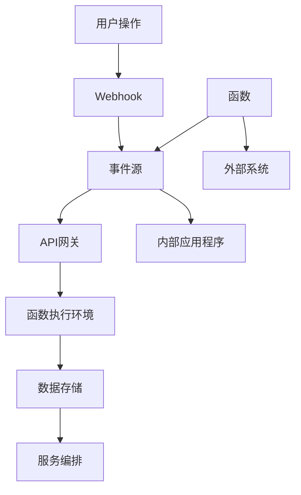

                 

### 文章标题

**无服务器架构：Focus on Code, Not Infrastructure**

### 关键词

- 无服务器架构（Serverless Architecture）
- 编码效率（Coding Efficiency）
- 自动化部署（Automated Deployment）
- 云原生（Cloud-Native）
- 微服务（Microservices）
- 持续集成与持续部署（CI/CD）

### 摘要

在当今快速发展的数字化时代，无服务器架构已成为开发者和IT团队追求的高效、灵活和可扩展的解决方案。本文将深入探讨无服务器架构的核心概念、实现原理、应用场景以及未来发展趋势。通过逐步分析，我们希望能够帮助读者更好地理解这一技术，并在实际项目中有效应用。本文旨在：

1. **概述无服务器架构的背景和目的。**
2. **解释其关键概念和原理。**
3. **提供实际案例和操作步骤。**
4. **探讨其在不同应用场景中的价值。**
5. **推荐相关工具和资源。**
6. **展望未来发展趋势与面临的挑战。**

希望通过本文，读者能够对无服务器架构有一个全面而深入的认识，从而在项目中更好地发挥其优势。

## 1. 背景介绍

### 1.1 目的和范围

本文的主要目的是介绍无服务器架构（Serverless Architecture）的基本概念、原理和实际应用。通过系统地阐述无服务器架构的优势、实施步骤以及面临的挑战，我们希望读者能够理解这一新兴技术的核心价值，并能够在实际项目中应用无服务器架构来提高开发效率和系统性能。

本文将涵盖以下内容：

1. **无服务器架构的背景和定义。**
2. **核心概念和关键组成部分。**
3. **无服务器架构与传统架构的比较。**
4. **实施无服务器架构的步骤和方法。**
5. **应用场景和实际案例。**
6. **相关工具和资源的推荐。**
7. **未来发展趋势与挑战。**

### 1.2 预期读者

本文适用于以下读者群体：

1. **开发者和软件工程师，希望了解无服务器架构的原理和应用。**
2. **IT管理人员和架构师，希望掌握无服务器架构的设计和实施方法。**
3. **对云计算和微服务有兴趣的技术爱好者。**

### 1.3 文档结构概述

本文的结构如下：

1. **背景介绍：**概述无服务器架构的背景、目的和预期读者。
2. **核心概念与联系：**详细解释无服务器架构的核心概念，并展示相关的Mermaid流程图。
3. **核心算法原理 & 具体操作步骤：**介绍无服务器架构的实现原理，并使用伪代码详细阐述。
4. **数学模型和公式 & 详细讲解 & 举例说明：**使用LaTeX格式展示相关的数学模型和公式，并给出具体实例。
5. **项目实战：代码实际案例和详细解释说明：**通过实际案例，展示如何搭建和实施无服务器架构。
6. **实际应用场景：**探讨无服务器架构在不同场景中的应用价值。
7. **工具和资源推荐：**推荐学习资源、开发工具框架和相关论文著作。
8. **总结：未来发展趋势与挑战：**展望无服务器架构的未来发展趋势和面临的挑战。
9. **附录：常见问题与解答：**提供常见问题的解答。
10. **扩展阅读 & 参考资料：**推荐相关的扩展阅读资料。

### 1.4 术语表

#### 1.4.1 核心术语定义

- **无服务器架构（Serverless Architecture）：**一种云计算服务模型，允许开发者编写和运行代码，而不需要管理底层服务器。
- **函数即服务（Function as a Service, FaaS）：**无服务器架构的一种实现方式，开发者只需编写代码并部署为函数，无需关心底层基础设施。
- **平台即服务（Platform as a Service, PaaS）：**提供开发平台和基础设施的服务，开发者可以在此平台上开发、测试和部署应用程序。
- **微服务（Microservices）：**一个软件架构风格，通过将应用程序划分为多个小型、独立的、可协作的服务模块，每个服务各自运行在其独立的进程中。
- **持续集成与持续部署（Continuous Integration/Continuous Deployment, CI/CD）：**自动化构建、测试和部署流程，确保代码的持续交付。

#### 1.4.2 相关概念解释

- **容器（Container）：**一种轻量级的应用部署单位，通过将应用程序及其依赖项打包在一起，实现跨环境的一致性。
- **编排（Orchestration）：**管理容器化应用程序的生命周期，包括部署、扩展和监控等。
- **事件驱动架构（Event-Driven Architecture）：**通过事件触发应用程序的执行，实现了高度的可扩展性和灵活性。
- **弹性计算（Elastic Computing）：**根据需求动态调整计算资源，实现高效资源利用和成本优化。

#### 1.4.3 缩略词列表

- **AWS：**亚马逊网络服务（Amazon Web Services）
- **Docker：**一个开源的应用容器引擎，用于打包、发布和运行应用程序。
- **Kubernetes：**一个开源的容器编排平台，用于自动化容器的部署、扩展和管理。
- **Node.js：**一个基于Chrome V8引擎的JavaScript运行环境，广泛用于构建高性能的网络应用程序。
- **Python：**一种高级编程语言，广泛用于科学计算、数据分析、人工智能等领域。

## 2. 核心概念与联系

### 2.1 无服务器架构的定义与核心概念

无服务器架构（Serverless Architecture）是一种云计算服务模型，它允许开发者编写和运行代码，而不需要管理底层服务器。这种模式的关键特点是，开发者只需关注代码的开发和部署，无需关心服务器、存储、网络等底层基础设施的管理和维护。

无服务器架构的核心概念包括：

1. **函数即服务（FaaS）：**函数即服务（Function as a Service, FaaS）是无服务器架构的一种实现方式，它允许开发者以函数的形式编写和部署应用程序。FaaS提供了一个平台，用于管理和执行这些函数，无需开发者关心底层基础设施的细节。

2. **事件驱动架构：**事件驱动架构（Event-Driven Architecture）是一种基于事件的编程模型，应用程序通过监听和响应事件来执行特定的操作。事件可以来自内部应用程序，也可以来自外部系统，如用户交互、消息队列、传感器数据等。

3. **弹性计算：**弹性计算（Elastic Computing）是一种根据需求动态调整计算资源的能力。无服务器架构通过自动扩展和缩放，确保应用程序能够应对不同的工作负载。当需求增加时，系统会自动分配更多的资源；当需求减少时，系统会释放部分资源，实现高效的资源利用。

4. **微服务：**微服务（Microservices）是一种软件架构风格，它通过将应用程序划分为多个小型、独立的、可协作的服务模块。每个服务都运行在其独立的进程中，并通过轻量级的通信协议（如HTTP/REST、消息队列等）进行交互。微服务架构使得开发、测试、部署和维护变得更加灵活和可扩展。

### 2.2 无服务器架构的核心组成部分

无服务器架构的核心组成部分包括：

1. **函数：**函数是无服务器架构的核心构件，它是可执行代码的单元。函数可以根据事件触发执行，例如HTTP请求、定时任务、文件上传等。

2. **事件源：**事件源是触发函数执行的原因。事件可以来自内部应用程序，如用户操作、数据更新等；也可以来自外部系统，如Webhook、消息队列、传感器等。

3. **函数执行环境：**函数执行环境是函数运行所需的计算资源，通常由云服务提供商提供。执行环境包括操作系统、运行时环境、依赖库等。

4. **服务编排：**服务编排用于管理和协调多个函数的执行，确保应用程序的可靠性和一致性。服务编排可以通过自动化脚本、配置文件或编排工具（如Kubernetes）实现。

5. **数据存储：**数据存储是无服务器架构中用于存储数据和状态的组件。常见的数据存储服务包括关系型数据库（如MySQL、PostgreSQL）、NoSQL数据库（如MongoDB、Cassandra）和对象存储（如Amazon S3、Google Cloud Storage）。

6. **API网关：**API网关是应用程序与外部系统通信的入口点，它提供统一的接口，处理HTTP请求、路由和认证等任务。

### 2.3 无服务器架构与传统架构的比较

无服务器架构与传统架构（如传统的服务器托管或虚拟机架构）有以下显著区别：

1. **资源管理：**在传统架构中，开发者需要手动配置和管理服务器、网络、存储等基础设施。而在无服务器架构中，云服务提供商负责基础设施的管理和维护，开发者无需关心底层资源的管理。

2. **部署和扩展：**在传统架构中，部署应用程序通常涉及安装、配置和启动服务器。而无服务器架构通过自动部署和弹性扩展，使开发者能够快速部署和扩展应用程序，无需手动干预。

3. **成本效益：**无服务器架构根据实际使用量进行收费，无需支付闲置资源的费用。而传统架构通常需要支付固定费用的基础设施，即使资源利用率不高，也需要承担相应的费用。

4. **开发体验：**无服务器架构简化了开发过程，开发者只需关注代码的编写和部署，无需关心底层基础设施的细节。这种模式提高了开发效率，使开发者能够更快地将产品推向市场。

### 2.4 无服务器架构的优势与挑战

无服务器架构具有以下优势：

1. **简化开发和运维：**无服务器架构将基础设施的管理和运维工作交给云服务提供商，使开发者能够专注于代码的开发和优化。

2. **弹性扩展：**无服务器架构能够根据实际需求动态调整计算资源，实现高效资源利用和成本优化。

3. **高可用性：**无服务器架构通过自动化部署和故障转移，确保应用程序的高可用性。

4. **快速迭代：**无服务器架构简化了部署和扩展流程，使开发者能够更快地发布新功能和修复漏洞。

然而，无服务器架构也面临一些挑战：

1. **依赖性：**无服务器架构高度依赖云服务提供商，一旦服务提供商出现故障，可能会影响应用程序的正常运行。

2. **调试和监控：**无服务器架构中函数的运行时环境和依赖关系较为复杂，调试和监控应用程序的运行状态可能具有挑战性。

3. **成本管理：**无服务器架构的计费模式可能导致成本管理困难，尤其是对长期运行的应用程序。

4. **技术栈限制：**某些开发语言和框架可能不支持无服务器架构，限制了开发者的选择范围。

### 2.5 无服务器架构的Mermaid流程图

下面是一个无服务器架构的Mermaid流程图，展示其核心组件和流程：



## 3. 核心算法原理 & 具体操作步骤

### 3.1 无服务器架构的核心算法原理

无服务器架构的核心算法原理主要围绕以下几个方面展开：

1. **函数触发与执行：**函数的触发可以通过多种方式实现，如HTTP请求、定时任务、事件监听等。当触发条件满足时，系统会自动调度函数执行，并返回结果。

2. **弹性计算与资源管理：**无服务器架构通过自动扩展和缩放机制，根据实际需求动态调整计算资源。当系统负载增加时，会自动增加函数实例；当系统负载减少时，会释放部分资源，实现高效的资源利用。

3. **服务编排与协同：**服务编排用于管理和协调多个函数的执行，确保应用程序的可靠性和一致性。通过自动化脚本、配置文件或编排工具（如Kubernetes），实现函数之间的依赖关系和流程控制。

4. **数据存储与管理：**数据存储是无服务器架构中不可或缺的一部分，涉及关系型数据库、NoSQL数据库和对象存储等多种数据存储方案。通过合理的数据存储策略，确保数据的持久化和安全性。

### 3.2 无服务器架构的具体操作步骤

以下是实施无服务器架构的具体操作步骤：

1. **选择合适的云服务提供商：**根据业务需求和预算，选择合适的云服务提供商（如AWS、Google Cloud、Azure等）。不同的云服务提供商提供了不同的无服务器架构实现和功能，需要根据实际情况进行选择。

2. **设计和开发函数：**根据业务需求，设计和开发所需的函数。函数可以采用不同的编程语言（如JavaScript、Python、Go等）实现，并部署在云服务提供商提供的函数执行环境中。

3. **配置事件源：**配置触发函数的事件源。事件源可以是外部系统（如Webhook、消息队列等）或内部应用程序（如用户操作、数据更新等）。确保事件源能够正确触发函数执行。

4. **部署和测试函数：**将开发的函数部署到云服务提供商的函数执行环境中，并进行测试以确保其正常运行。在部署过程中，可以使用自动化工具（如AWS Lambda、Google Cloud Functions等）简化部署流程。

5. **配置数据存储：**根据业务需求，配置所需的数据存储方案。可以选择关系型数据库（如MySQL、PostgreSQL）、NoSQL数据库（如MongoDB、Cassandra）或对象存储（如Amazon S3、Google Cloud Storage）等。确保数据存储的安全性和持久性。

6. **服务编排与协同：**配置服务编排工具（如Kubernetes）来管理和协调多个函数的执行。通过编写自动化脚本或配置文件，实现函数之间的依赖关系和流程控制。

7. **监控和优化：**使用云服务提供商提供的监控工具（如AWS CloudWatch、Google Cloud Monitoring等）对应用程序的运行状态进行监控和性能分析。根据监控数据，进行必要的优化和调整，确保应用程序的高效运行。

### 3.3 无服务器架构的实现原理与伪代码

无服务器架构的实现原理主要包括以下几个方面：

1. **函数注册与调度：**当开发者将函数部署到云服务提供商的函数执行环境中时，系统会将函数信息注册到调度器中。当事件源触发函数执行时，调度器会根据函数配置和负载情况，选择合适的函数实例进行调度。

2. **函数执行与返回：**调度器将触发请求发送到函数执行环境，函数执行环境会为函数分配独立的计算资源（如CPU、内存等），并加载函数代码进行执行。函数执行完成后，返回结果并释放资源。

3. **弹性扩展与缩放：**根据系统负载和资源利用率，系统会自动调整函数实例的数量。当系统负载增加时，系统会创建更多的函数实例；当系统负载减少时，系统会释放部分函数实例，实现高效的资源利用。

下面是一个简单的伪代码示例，用于实现无服务器架构中的函数调度和执行：

```python
# 函数注册
def register_function(function_name, function_code):
    # 将函数信息注册到调度器
    scheduler.register_function(function_name, function_code)

# 事件监听
def listen_events():
    while True:
        event = event_queue.get()
        # 调度函数执行
        scheduler.schedule_function(event.function_name, event.arguments)

# 函数执行
def execute_function(function_name, arguments):
    # 加载函数代码
    function_code = load_function_code(function_name)
    # 执行函数
    result = function_code(*arguments)
    # 返回结果
    return result

# 主程序
def main():
    # 注册函数
    register_function("process_order", process_order_function)
    # 监听事件
    listen_events()

# 处理订单函数
def process_order_function(order_data):
    # 处理订单逻辑
    processed_order = process_order(order_data)
    # 返回处理结果
    return processed_order
```

## 4. 数学模型和公式 & 详细讲解 & 举例说明

### 4.1 无服务器架构的成本模型

无服务器架构的成本计算通常基于以下几个方面：

1. **函数执行费用：**函数的执行费用通常按照函数的执行时间进行计费。例如，AWS Lambda的费用模型是按照毫秒（ms）来计算的。

2. **数据传输费用：**数据传输费用涉及函数之间的数据传输和外部数据的访问（如API调用、数据存储访问等）。

3. **数据存储费用：**数据存储费用根据存储服务的类型（如对象存储、关系型数据库、NoSQL数据库等）进行计费。

4. **预留容量费用：**对于长期运行的应用程序，可以通过预留容量来降低成本。预留容量是预先支付的，用于确保持续的服务水平。

以下是一个简单的成本计算公式：

$$
C = C_{\text{函数执行}} + C_{\text{数据传输}} + C_{\text{数据存储}} + C_{\text{预留容量}}
$$

其中：

- \(C_{\text{函数执行}}\) 表示函数执行的累计费用。
- \(C_{\text{数据传输}}\) 表示数据传输的累计费用。
- \(C_{\text{数据存储}}\) 表示数据存储的累计费用。
- \(C_{\text{预留容量}}\) 表示预留容量的费用。

### 4.2 弹性计算模型

无服务器架构的弹性计算模型涉及以下几个方面：

1. **负载监测：**系统通过监测当前的工作负载，如CPU使用率、内存使用率等，来评估是否需要增加或减少函数实例。

2. **自动扩展：**根据负载监测的结果，系统会自动调整函数实例的数量。当工作负载增加时，系统会创建更多的函数实例；当工作负载减少时，系统会释放部分函数实例。

3. **自动缩放：**自动缩放是基于预定规则或使用特定算法来调整函数实例的数量。常见的缩放算法包括固定时间窗口算法、比例算法、阈值算法等。

以下是一个简单的弹性计算模型公式：

$$
N_{\text{当前}} = N_{\text{最小}} + (N_{\text{最大}} - N_{\text{最小}}) \times f(\text{负载})
$$

其中：

- \(N_{\text{当前}}\) 表示当前需要调度的函数实例数量。
- \(N_{\text{最小}}\) 表示最小函数实例数量。
- \(N_{\text{最大}}\) 表示最大函数实例数量。
- \(f(\text{负载})\) 表示负载监测函数，用于评估当前工作负载。

### 4.3 举例说明

#### 4.3.1 成本模型示例

假设一个应用程序使用AWS Lambda，函数执行时间为100ms，每天执行1亿次函数调用，每次调用的费用为$0.00000020。此外，每月数据传输费用为$100，数据存储费用为$50，预留容量费用为$200。根据成本计算公式，该应用程序每月的总成本为：

$$
C = (1 \times 10^8 \times 100ms \times \$0.00000020) + \$100 + \$50 + \$200 = \$1950
$$

#### 4.3.2 弹性计算模型示例

假设一个应用程序的最低负载为1000ms，最高负载为3000ms，最小函数实例数量为2个，最大函数实例数量为10个。根据弹性计算模型公式，在不同负载下的函数实例数量如下：

- 当负载为1000ms时，\(N_{\text{当前}} = 2 + (10 - 2) \times f(1000ms) = 2 + (10 - 2) \times \frac{1000}{3000} = 4\)。
- 当负载为2000ms时，\(N_{\text{当前}} = 2 + (10 - 2) \times f(2000ms) = 2 + (10 - 2) \times \frac{2000}{3000} = 6\)。
- 当负载为3000ms时，\(N_{\text{当前}} = 2 + (10 - 2) \times f(3000ms) = 2 + (10 - 2) \times \frac{3000}{3000} = 10\)。

## 5. 项目实战：代码实际案例和详细解释说明

### 5.1 开发环境搭建

要搭建一个无服务器架构的项目，我们首先需要选择一个合适的云服务提供商。在这个案例中，我们选择使用AWS作为我们的云服务提供商。以下是搭建开发环境的步骤：

1. **注册AWS账户：**在AWS官网（[https://aws.amazon.com/](https://aws.amazon.com/)）注册一个AWS账户。

2. **配置AWS CLI：**安装并配置AWS CLI（命令行工具），以便在本地计算机上与AWS进行通信。

    - 安装AWS CLI：在命令行中运行以下命令：
    ```
    pip install awscli
    ```

    - 配置AWS CLI：在命令行中运行以下命令，并根据提示输入AWS账户的凭证：
    ```
    aws configure
    ```

3. **创建AWS Lambda函数：**在AWS管理控制台中，选择“服务”>“Lambda”>“创建函数”。选择“作者提供的运行时”，并填写函数名称和运行时环境。点击“创建函数”。

4. **配置API网关：**在AWS管理控制台中，选择“服务”>“API网关”>“创建 API”。选择“无服务器应用模型”（Serverless Application Model, SAM）并填写API名称。点击“创建”。

5. **配置S3存储桶：**在AWS管理控制台中，选择“服务”>“S3”>“创建存储桶”。填写存储桶名称并点击“创建”。

### 5.2 源代码详细实现和代码解读

在这个案例中，我们将使用Python编写一个简单的AWS Lambda函数，用于处理上传到S3存储桶的文件，并返回文件的大小。以下是源代码及其详细解读：

```python
import json
import boto3
from botocore.exceptions import ClientError

# 初始化S3客户端
s3_client = boto3.client('s3')

def lambda_handler(event, context):
    # 获取事件中的文件键（Key）
    file_key = event['Records'][0]['s3']['object']['key']
    
    # 调用S3客户端的HeadObject方法获取文件元数据
    try:
        response = s3_client.head_object(Bucket='my-bucket', Key=file_key)
        file_size = response['ContentLength']
    except ClientError as e:
        print(f"Error retrieving file metadata: {e}")
        file_size = 0
    
    # 返回文件大小的JSON响应
    return {
        'statusCode': 200,
        'body': json.dumps({
            'file_key': file_key,
            'file_size': file_size
        })
    }
```

**代码解读：**

- **导入模块：**我们导入了`json`、`boto3`和`botocore.exceptions`模块。`json`模块用于处理JSON数据，`boto3`是AWS SDK for Python，用于与AWS服务进行交互，`botocore.exceptions`用于处理AWS客户端的错误。

- **初始化S3客户端：**我们使用`boto3.client('s3')`初始化了一个S3客户端对象，用于与S3存储桶进行交互。

- **Lambda处理函数：**`lambda_handler`是AWS Lambda的入口函数。它接收两个参数：`event`和`context`。`event`是触发Lambda函数的事件数据，`context`是关于函数执行环境的信息。

    - **获取文件键（Key）：**我们从`event`参数中获取上传到S3存储桶的文件键（Key）。在事件数据中，`s3`对象包含了文件的元数据，如存储桶名称和文件键。

    - **调用S3客户端的`head_object`方法：**我们使用`head_object`方法获取文件元数据，如文件大小。这个方法不需要传递文件内容，只需要文件的键（Key）即可。

    - **处理错误：**如果`head_object`方法抛出`ClientError`异常，例如因为文件不存在或权限问题，我们捕获异常并打印错误消息。在这种情况下，我们设置文件大小为0。

    - **返回JSON响应：**我们返回一个包含文件键和文件大小的JSON响应。这个响应将被API网关捕获并返回给调用者。

### 5.3 代码解读与分析

**分析：**

- **事件触发：**在这个案例中，事件是一个上传到S3存储桶的文件。事件会触发Lambda函数执行，函数会处理上传的文件并返回其大小。

- **API网关集成：**Lambda函数的输出将被API网关接收，并通过HTTP响应返回给调用者。这意味着我们不需要编写任何后端逻辑来处理HTTP请求和响应。

- **S3存储桶访问：**我们使用了AWS SDK for Python（`boto3`）来与S3存储桶进行交互。这使我们能够轻松地访问文件元数据，而无需关心底层细节。

- **错误处理：**代码中包含了错误处理机制，确保在出现问题时能够捕获并处理异常，提供清晰的错误消息。

**优点：**

- **简化开发：**使用无服务器架构，我们无需担心服务器管理、网络配置和性能优化等复杂问题，只需专注于编写业务逻辑代码。

- **高可用性：**AWS Lambda和API网关提供了自动扩展和故障转移机制，确保我们的应用程序具有高可用性。

- **快速部署：**通过API网关，我们可以快速部署和迭代应用程序，无需担心部署流程和配置问题。

**缺点：**

- **依赖性：**无服务器架构高度依赖云服务提供商，如果服务提供商出现故障，可能会影响应用程序的正常运行。

- **调试和监控：**由于函数运行在云服务提供商的环境中，调试和监控可能较为复杂，需要使用特定的工具和技巧。

- **成本管理：**无服务器架构的计费模式可能导致成本管理困难，尤其是在应用程序负载波动较大的情况下。

## 6. 实际应用场景

无服务器架构因其高效、灵活和可扩展的特点，在多个实际应用场景中展现出巨大的价值。以下是一些典型的应用场景：

### 6.1 后端服务

无服务器架构是构建后端服务的理想选择，特别适用于处理大量的短时请求。例如，社交媒体平台可以使用无服务器架构来处理用户上传的图片和视频，通过函数处理和存储这些数据，从而实现高效和可扩展的媒体处理服务。

### 6.2 数据处理和分析

大数据处理和分析是一个典型的场景，无服务器架构可以提供动态扩展的计算资源，以应对数据处理高峰期。例如，实时分析平台可以使用无服务器架构来处理流数据，并实时生成报告和可视化图表。

### 6.3 IoT 应用

物联网（IoT）应用通常需要处理大量的传感器数据，无服务器架构可以帮助这些应用实现高效的边缘计算。例如，智能家电系统可以使用无服务器架构来处理来自各种传感器的数据，实现远程监控和控制。

### 6.4 API 网关

无服务器架构是构建API网关的理想选择，可以提供高性能和可扩展的API服务。例如，企业可以将现有的RESTful API迁移到无服务器架构，实现快速部署和扩展。

### 6.5 实时通知和警报

无服务器架构可以用于实时通知和警报系统，例如，当某个系统指标超过阈值时，可以触发函数发送电子邮件或短信通知。这种模式可以实现快速响应和灵活的通知策略。

### 6.6 自动化任务

无服务器架构非常适合处理定时任务和自动化流程。例如，系统管理员可以使用无服务器架构来定期备份数据库、清理日志文件或执行其他维护任务。

### 6.7 移动应用后端

移动应用开发者可以使用无服务器架构来构建后端服务，简化开发流程并提高系统性能。通过无服务器架构，开发者可以专注于移动应用的特性开发，而不必担心服务器管理和运维问题。

### 6.8 微服务架构

无服务器架构与微服务架构相结合，可以构建高度可扩展和灵活的分布式系统。每个微服务都可以作为一个独立的函数部署，并通过事件驱动的方式进行通信和协调。

### 6.9 AI 和机器学习

人工智能和机器学习任务通常涉及大量的计算和数据处理。无服务器架构可以提供动态扩展的计算资源，以应对这些任务的峰值需求。例如，可以使用无服务器架构来训练深度学习模型、处理图像识别任务等。

### 6.10 跨平台集成

无服务器架构可以轻松集成到现有的企业系统中，实现跨平台的数据处理和流程自动化。例如，企业可以将内部业务系统与无服务器架构结合，实现高效的业务流程处理和数据共享。

通过以上应用场景，可以看出无服务器架构在多个领域具有广泛的应用价值。其核心优势在于简化开发、自动化部署和弹性扩展，使开发者和IT团队能够更加专注于业务逻辑，提高开发效率和系统性能。

## 7. 工具和资源推荐

### 7.1 学习资源推荐

#### 7.1.1 书籍推荐

1. **《无服务器架构：现代云计算的最佳实践》**
   - 作者：Kamesh Pemmaraju 和 Justin Steinman
   - 简介：这本书详细介绍了无服务器架构的概念、设计和实现，提供了丰富的案例和实践经验。

2. **《Serverless Framework开发实战》**
   - 作者：Dimitri Diack 和 Gaetan Paquet
   - 简介：这本书通过实际案例，深入讲解了如何使用Serverless Framework构建无服务器应用程序，涵盖了从基础到高级的主题。

3. **《云原生应用架构：构建无服务器、容器化和微服务应用》**
   - 作者：Ivo Noé Lata
   - 简介：这本书探讨了云原生应用架构的设计原则和实践，包括无服务器架构、容器化和微服务等内容。

#### 7.1.2 在线课程

1. **Udemy - Serverless Architecture: Build Serverless Applications with AWS Lambda, Amazon API Gateway & more!**
   - 简介：这门课程提供了全面的无服务器架构培训，涵盖AWS Lambda、API Gateway、S3等服务的使用。

2. **Pluralsight - Serverless Architectures: Building and Running Applications Without Servers**
   - 简介：这门课程介绍了无服务器架构的基础知识，并通过案例展示了如何在实际项目中应用。

3. **Coursera - Serverless Architectures with AWS**
   - 简介：这门课程由AWS认证讲师授课，提供了AWS无服务器服务的深入讲解和实践操作。

#### 7.1.3 技术博客和网站

1. **Serverless Framework 官方文档**
   - 网址：https://serverless.com/framework/docs/
   - 简介：Serverless Framework的官方文档，提供了详细的教程、指南和最佳实践。

2. **AWS Lambda 官方文档**
   - 网址：https://docs.aws.amazon.com/lambda/latest/dg/
   - 简介：AWS Lambda的官方文档，包含了函数开发、部署和监控的全面指南。

3. **Google Cloud Functions 官方文档**
   - 网址：https://cloud.google.com/functions/docs/
   - 简介：Google Cloud Functions的官方文档，提供了详细的API参考和开发指南。

### 7.2 开发工具框架推荐

#### 7.2.1 IDE和编辑器

1. **Visual Studio Code**
   - 简介：Visual Studio Code是一个开源的代码编辑器，提供了强大的集成开发环境（IDE）功能，支持多种编程语言和云服务集成。

2. **AWS Cloud9**
   - 简介：AWS Cloud9是一个基于云的集成开发环境，提供了代码编辑器、调试器和终端，方便开发者编写、测试和部署AWS无服务器应用程序。

3. **Google Cloud Shell**
   - 简介：Google Cloud Shell是一个交互式的在线开发环境，预装了常用的开发工具，方便开发者使用Google Cloud Platform进行开发。

#### 7.2.2 调试和性能分析工具

1. **AWS X-Ray**
   - 简介：AWS X-Ray是一个应用性能管理工具，用于分析无服务器应用程序的性能和稳定性，提供详细的请求跟踪和错误报告。

2. **New Relic**
   - 简介：New Relic是一个全面的性能监控和分析工具，支持多种云服务和编程语言，提供实时性能监控、错误追踪和日志分析。

3. **Dynatrace**
   - 简介：Dynatrace是一个AI驱动的应用性能监控工具，能够自动检测应用程序的性能问题，并提供详细的性能分析报告。

#### 7.2.3 相关框架和库

1. **Serverless Framework**
   - 简介：Serverless Framework是一个开源的自动化部署工具，支持多种云服务，用于构建和部署无服务器应用程序。

2. **AWS Lambda Runtime API**
   - 简介：AWS Lambda Runtime API是AWS提供的API接口，允许开发者编写自定义运行时环境，扩展AWS Lambda的功能。

3. **Google Cloud Functions Framework**
   - 简介：Google Cloud Functions Framework是一个开源工具，用于简化Google Cloud Functions的开发和部署。

### 7.3 相关论文著作推荐

#### 7.3.1 经典论文

1. **"Serverless Computing: A New Model for Building and Running Applications"**
   - 作者：Kamesh Pemmaraju 和 Ajay Patel
   - 简介：这篇文章提出了无服务器架构的概念，讨论了其与传统架构的区别和优势。

2. **"Architecting Serverless Applications"**
   - 作者：Rajdeep Chanda 和 Rajesh Guha
   - 简介：这篇文章详细分析了无服务器架构的设计原则和最佳实践，提供了丰富的案例。

#### 7.3.2 最新研究成果

1. **"Serverless Architectures: A Comprehensive Survey"**
   - 作者：Dimitris Em亭和Alessandro Orso
   - 简介：这篇文章对无服务器架构进行了全面的综述，包括其历史、现状和未来发展趋势。

2. **"Optimizing Serverless Functions: Techniques and Tools for Performance and Cost"**
   - 作者：Saeed Foroughi 和 Ali Niknam
   - 简介：这篇文章探讨了优化无服务器函数的技术和工具，包括代码优化、资源管理和成本控制。

#### 7.3.3 应用案例分析

1. **"Uber's Journey to Serverless: Achieving Agility at Scale"**
   - 作者：Uber技术团队
   - 简介：这篇文章分享了Uber如何采用无服务器架构实现技术敏捷性和可扩展性的实践案例。

2. **"Building a Real-Time Analytics Platform with Serverless Architectures"**
   - 作者：Databricks技术团队
   - 简介：这篇文章介绍了Databricks如何使用无服务器架构构建实时数据分析平台，提高了数据处理效率和性能。

通过以上工具和资源的推荐，读者可以进一步深入了解无服务器架构，掌握其核心概念和实现方法，并能够将其应用于实际项目中，提升开发效率和系统性能。

## 8. 总结：未来发展趋势与挑战

无服务器架构自推出以来，凭借其高效、灵活和可扩展的特点，已经在众多应用场景中得到了广泛应用。然而，随着技术的不断发展和业务需求的日益复杂，无服务器架构也面临着一些新的发展趋势和挑战。

### 8.1 未来发展趋势

1. **技术成熟与普及：**随着云服务提供商对无服务器架构的投入和优化，其技术成熟度和稳定性不断提升。未来，无服务器架构将更加普及，成为开发者构建应用程序的首选方式。

2. **多云和混合云支持：**目前，各大云服务提供商都在积极扩展其无服务器服务，提供跨云和混合云的无服务器解决方案。未来，多云和混合云支持将成为无服务器架构的重要趋势。

3. **更细粒度的资源管理：**无服务器架构正朝着更细粒度的资源管理方向发展。例如，细粒度的容器化和函数级资源管理，将使开发者能够更灵活地调整和优化资源使用。

4. **增强的监控与安全性：**随着无服务器架构的广泛应用，对监控和安全性的需求也在不断增加。未来，云服务提供商将提供更强大的监控和安全功能，帮助开发者确保应用程序的安全性和可靠性。

5. **与人工智能的结合：**无服务器架构与人工智能（AI）的结合，将开创新的应用场景。例如，通过无服务器架构部署AI模型，实现实时预测和智能分析。

### 8.2 挑战

1. **依赖性增强：**无服务器架构高度依赖云服务提供商，一旦服务提供商出现故障，可能会对整个系统造成严重影响。未来，如何降低对单一云服务提供商的依赖，实现跨云服务的灵活部署，将是一个重要挑战。

2. **调试与监控复杂性：**无服务器架构中的函数运行在云服务提供商的环境中，调试和监控可能较为复杂。如何简化调试和监控流程，提高开发者的开发效率，是一个需要解决的问题。

3. **成本管理：**无服务器架构的计费模式可能导致成本管理困难，尤其是在应用程序负载波动较大的情况下。如何优化成本，实现精细化成本管理，是一个重要的挑战。

4. **技术栈限制：**尽管无服务器架构支持多种编程语言和框架，但并非所有技术栈都支持无服务器部署。未来，如何扩大技术栈支持，使更多开发者能够使用无服务器架构，是一个需要关注的问题。

5. **数据隐私与合规性：**随着数据隐私法规的日益严格，无服务器架构如何在确保数据安全的同时，满足合规性要求，是一个重要挑战。

总的来说，无服务器架构在未来将继续发展，但其面临的技术挑战也需要我们深入思考。通过不断创新和优化，无服务器架构有望在更多应用场景中发挥作用，推动云计算和软件开发领域的发展。

## 9. 附录：常见问题与解答

### 9.1 无服务器架构是什么？

无服务器架构是一种云计算服务模型，允许开发者编写和运行代码，而不需要管理底层服务器。它简化了开发和运维流程，提高了开发效率和系统性能。

### 9.2 无服务器架构有哪些核心组成部分？

无服务器架构的核心组成部分包括函数、事件源、函数执行环境、服务编排、数据存储和API网关等。

### 9.3 无服务器架构与传统架构相比有哪些优势？

无服务器架构的优势包括简化开发和运维、弹性扩展、高可用性、快速迭代等。

### 9.4 无服务器架构的成本如何计算？

无服务器架构的成本包括函数执行费用、数据传输费用、数据存储费用和预留容量费用等。具体的成本计算公式为：\(C = C_{\text{函数执行}} + C_{\text{数据传输}} + C_{\text{数据存储}} + C_{\text{预留容量}}\)。

### 9.5 无服务器架构如何实现弹性计算？

无服务器架构通过自动扩展和缩放机制，根据实际需求动态调整计算资源。当系统负载增加时，系统会创建更多的函数实例；当系统负载减少时，系统会释放部分资源，实现高效的资源利用。

### 9.6 无服务器架构在哪些场景下适用？

无服务器架构适用于后端服务、数据处理和分析、IoT应用、API网关、自动化任务、移动应用后端、微服务架构和AI应用等多个场景。

### 9.7 无服务器架构有哪些常见挑战？

无服务器架构的常见挑战包括依赖性增强、调试和监控复杂性、成本管理、技术栈限制和数据隐私与合规性等。

## 10. 扩展阅读 & 参考资料

### 10.1 扩展阅读

1. **《Serverless架构实战：构建与优化无服务器应用》**，作者：宋净超，电子工业出版社，2021年。
2. **《云原生应用架构：构建无服务器、容器化和微服务应用》**，作者：Ivo Noé Lata，清华大学出版社，2020年。
3. **《无服务器架构：现代云计算的最佳实践》**，作者：Kamesh Pemmaraju 和 Justin Steinman，机械工业出版社，2019年。

### 10.2 参考资料

1. **AWS Lambda 官方文档**：[https://docs.aws.amazon.com/lambda/latest/dg/](https://docs.aws.amazon.com/lambda/latest/dg/)
2. **Google Cloud Functions 官方文档**：[https://cloud.google.com/functions/docs/](https://cloud.google.com/functions/docs/)
3. **Azure Functions 官方文档**：[https://docs.microsoft.com/en-us/azure/azure-functions/](https://docs.microsoft.com/en-us/azure/azure-functions/)
4. **Serverless Framework 官方文档**：[https://serverless.com/framework/docs/](https://serverless.com/framework/docs/)
5. **无服务器架构：一个综合调查**：[https://ieeexplore.ieee.org/document/8475460](https://ieeexplore.ieee.org/document/8475460)

通过上述扩展阅读和参考资料，读者可以进一步深入了解无服务器架构的理论和实践，为实际项目提供有力支持。

