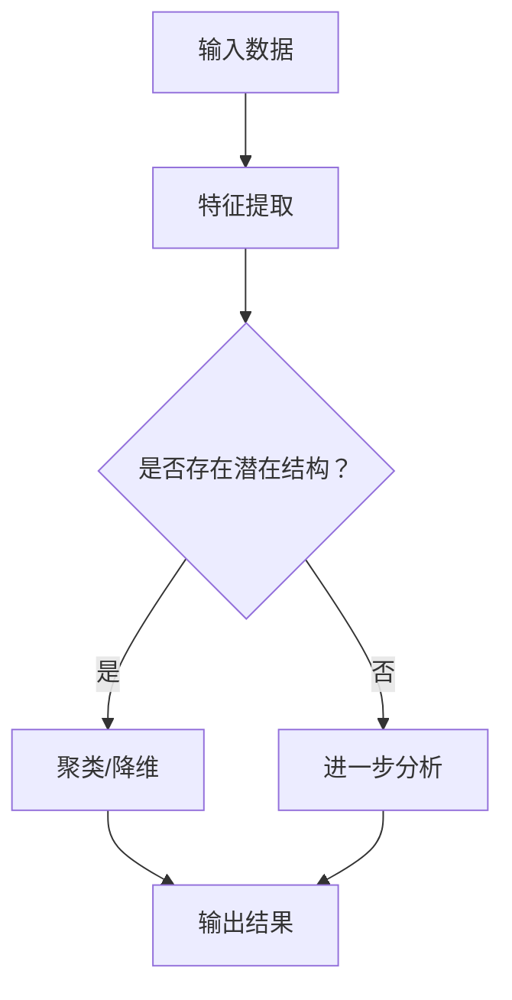

                 

# 无监督学习：原理与代码实例讲解

> 关键词：无监督学习，原理，算法，深度学习，代码实例

> 摘要：本文将深入探讨无监督学习的原理，包括核心概念、算法、数学模型以及实际应用。通过代码实例讲解，读者将能够更好地理解无监督学习的应用场景和实现方法。

## 1. 背景介绍

### 1.1 目的和范围

本文旨在介绍无监督学习的基本概念、原理和实现方法，并通过实际代码实例帮助读者理解其应用场景。无监督学习是机器学习中的一种重要分支，与监督学习和强化学习并列。它不依赖于标签数据进行训练，而是通过学习数据中的潜在结构和模式来发现知识。

### 1.2 预期读者

本文适合对机器学习和深度学习有一定了解的读者，尤其是希望深入理解无监督学习原理和应用的开发者、研究者和学生。

### 1.3 文档结构概述

本文将分为以下几个部分：

1. 核心概念与联系
2. 核心算法原理 & 具体操作步骤
3. 数学模型和公式 & 详细讲解 & 举例说明
4. 项目实战：代码实际案例和详细解释说明
5. 实际应用场景
6. 工具和资源推荐
7. 总结：未来发展趋势与挑战
8. 附录：常见问题与解答
9. 扩展阅读 & 参考资料

### 1.4 术语表

#### 1.4.1 核心术语定义

- 无监督学习：一种机器学习方法，不依赖标签数据进行训练。
- 数据点：单个输入样本。
- 特征：数据点中用于训练的属性。
- 潜在结构：数据点之间隐藏的内在联系和模式。
- 算法：解决问题的方法或步骤。

#### 1.4.2 相关概念解释

- 监督学习：依赖于标签数据进行训练，如分类和回归。
- 强化学习：通过试错学习如何在环境中做出最优决策。
- 自编码器：一种无监督学习算法，用于学习数据的潜在表示。

#### 1.4.3 缩略词列表

- ML：机器学习
- DS：数据科学
- NLP：自然语言处理
- CV：计算机视觉

## 2. 核心概念与联系

为了更好地理解无监督学习，我们需要首先了解其核心概念和联系。

### 2.1 数据点与特征

无监督学习中的数据点可以看作是特征向量的集合。每个数据点包含多个特征，这些特征用于描述数据点的属性。例如，在图像识别任务中，每个数据点可以是像素值的一个向量。

### 2.2 潜在结构

潜在结构是指数据点之间隐藏的内在联系和模式。通过无监督学习算法，我们可以发现这些潜在结构，从而更好地理解和分析数据。潜在结构可以是线性的或非线性的，取决于数据本身的复杂性。

### 2.3 算法

无监督学习算法种类繁多，包括聚类、降维、关联规则发现等。这些算法的目的是发现数据中的潜在结构，从而实现数据的分类、去噪、降维等任务。

下面是一个简单的 Mermaid 流程图，展示了无监督学习的基本流程：



## 3. 核心算法原理 & 具体操作步骤

在无监督学习中，常用的算法包括聚类和降维。本节将分别介绍这两种算法的原理和具体操作步骤。

### 3.1 聚类算法

聚类是将数据分为若干个组（簇），使得同一簇中的数据点彼此相似，不同簇的数据点之间差异较大。常见的聚类算法包括 K-Means、层次聚类和 DBSCAN 等。

#### 3.1.1 K-Means 算法

K-Means 算法是一种基于距离的聚类方法。其基本步骤如下：

1. 初始化：随机选择 K 个数据点作为初始聚类中心。
2. 分配：计算每个数据点到各个聚类中心的距离，将数据点分配到最近的聚类中心所在的簇。
3. 更新：重新计算各个簇的中心点，重复步骤 2，直至聚类中心不再发生变化。

下面是 K-Means 算法的伪代码：

```python
def k_means(data, K):
    # 初始化聚类中心
    centers = initialize_centers(data, K)
    
    while not_converged(centers):
        # 分配数据点
        assignments = assign_points_to_clusters(data, centers)
        
        # 更新聚类中心
        centers = update_centers(data, assignments, K)
    
    return centers, assignments
```

#### 3.1.2 层次聚类

层次聚类是一种自上而下或自下而上的聚类方法，通过合并或分裂簇来构建聚类层次结构。常见的方法包括凝聚层次聚类和分裂层次聚类。

1. 凝聚层次聚类：从单个数据点开始，逐步合并距离较近的数据点，直至所有数据点合并为一个簇。
2. 分裂层次聚类：从单个簇开始，逐步分裂为多个簇，直至每个簇只包含一个数据点。

下面是凝聚层次聚类的伪代码：

```python
def hierarchical_clustering(data):
    # 初始化：每个数据点都是一个簇
    clusters = [data]

    while len(clusters) > 1:
        # 找到最相似的簇
        closest_pairs = find_closest_pairs(clusters)
        
        # 合并簇
        clusters = merge_clusters(clusters, closest_pairs)
    
    return clusters
```

### 3.2 降维算法

降维是将高维数据映射到低维空间，以减少数据维度和计算复杂度。常见的降维算法包括主成分分析（PCA）、线性判别分析（LDA）和自编码器等。

#### 3.2.1 主成分分析（PCA）

PCA 通过线性变换将高维数据映射到低维空间，保留数据的主要特征。其基本步骤如下：

1. 特征提取：计算数据协方差矩阵，并求其特征值和特征向量。
2. 降维：选择最大的 K 个特征值对应的特征向量作为新的特征空间。
3. 映射：将数据映射到低维空间。

下面是 PCA 算法的伪代码：

```python
def pca(data, K):
    # 计算协方差矩阵
    cov_matrix = calculate_covariance_matrix(data)
    
    # 求特征值和特征向量
    eigenvalues, eigenvectors = compute_eigenvalues_eigenvectors(cov_matrix)
    
    # 选择最大的 K 个特征向量
    principal_components = select_top_k_eigenvectors(eigenvectors, K)
    
    # 映射数据到低维空间
    low_dimensional_data = project_data_to_new_space(data, principal_components)
    
    return low_dimensional_data
```

## 4. 数学模型和公式 & 详细讲解 & 举例说明

在本节中，我们将详细讲解无监督学习中的核心数学模型和公式，并通过举例说明来帮助读者更好地理解。

### 4.1 K-Means 算法中的距离度量

K-Means 算法中的核心是距离度量，用于计算数据点之间的相似度。常用的距离度量方法包括欧氏距离、曼哈顿距离和余弦相似度。

- **欧氏距离**：欧氏距离是一种常用的距离度量方法，计算数据点之间的直线距离。其公式为：

  $$d(x, y) = \sqrt{\sum_{i=1}^{n}(x_i - y_i)^2}$$

- **曼哈顿距离**：曼哈顿距离是一种在城市街区中计算两点之间距离的方法，其公式为：

  $$d(x, y) = \sum_{i=1}^{n}|x_i - y_i|$$

- **余弦相似度**：余弦相似度是一种基于向量空间中向量夹角的余弦值来度量相似度的方法，其公式为：

  $$\text{cosine similarity}(x, y) = \frac{x \cdot y}{\|x\| \|y\|}$$

### 4.2 主成分分析（PCA）中的数学模型

PCA 的核心是特征值和特征向量的计算。假设我们有一个数据集 $X$，其协方差矩阵为 $C$，则有以下数学模型：

1. **协方差矩阵**：

   $$C = \frac{1}{n-1} X^T X$$

   其中，$X^T$ 表示 $X$ 的转置，$n$ 表示数据点的个数。

2. **特征值和特征向量**：

   $$Cv = \lambda v$$

   其中，$v$ 表示特征向量，$\lambda$ 表示特征值。

3. **降维映射**：

   $$X' = Xv$$

   其中，$X'$ 表示映射到低维空间后的数据集，$v$ 表示选择的特征向量。

### 4.3 举例说明

#### 4.3.1 K-Means 算法举例

假设我们有一个包含 5 个数据点的数据集，每个数据点有 2 个特征：

$$
\begin{array}{ccc}
x_1 & x_2 \\
\hline
1 & 2 \\
2 & 4 \\
3 & 1 \\
4 & 3 \\
5 & 6 \\
\end{array}
$$

我们希望将这个数据集划分为 2 个簇。首先，随机选择 2 个数据点作为初始聚类中心：

$$
\begin{array}{ccc}
c_1 & c_2 \\
\hline
1 & 2 \\
2 & 4 \\
\end{array}
$$

然后，计算每个数据点到聚类中心的距离，并将其分配到最近的聚类中心所在的簇：

$$
\begin{array}{ccc}
x_1 & x_2 & \text{距离} & \text{簇} \\
\hline
1 & 2 & 0 & 1 \\
2 & 4 & \sqrt{2} & 2 \\
3 & 1 & \sqrt{2} & 1 \\
4 & 3 & \sqrt{2} & 1 \\
5 & 6 & 2\sqrt{2} & 2 \\
\end{array}
$$

接下来，重新计算各个簇的中心点：

$$
\begin{array}{ccc}
c_1 & c_2 \\
\hline
1 & 2 \\
3 & 1 \\
\end{array}
$$

重复上述步骤，直到聚类中心不再发生变化。最终，我们得到如下划分结果：

$$
\begin{array}{ccc}
x_1 & x_2 & \text{簇} \\
\hline
1 & 2 & 1 \\
2 & 4 & 2 \\
3 & 1 & 1 \\
4 & 3 & 1 \\
5 & 6 & 2 \\
\end{array}
$$

#### 4.3.2 主成分分析（PCA）举例

假设我们有一个包含 5 个数据点的数据集，每个数据点有 3 个特征：

$$
\begin{array}{ccc}
x_1 & x_2 & x_3 \\
\hline
1 & 2 & 3 \\
2 & 4 & 1 \\
3 & 1 & 4 \\
4 & 3 & 2 \\
5 & 6 & 5 \\
\end{array}
$$

我们希望将这个数据集映射到低维空间。首先，计算数据集的协方差矩阵：

$$
C = \frac{1}{n-1} X^T X =
\begin{array}{ccc}
3 & 5 & 2 \\
5 & 12 & 4 \\
2 & 4 & 5 \\
\end{array}
$$

然后，计算协方差矩阵的特征值和特征向量。假设最大的两个特征值对应的特征向量分别为 $v_1$ 和 $v_2$：

$$
v_1 = \begin{bmatrix} 0.8 & 0.6 & 0.4 \end{bmatrix}, \quad v_2 = \begin{bmatrix} -0.6 & 0.8 & -0.2 \end{bmatrix}
$$

接下来，选择最大的两个特征向量作为新的特征空间：

$$
V = \begin{bmatrix} v_1 & v_2 \end{bmatrix} =
\begin{bmatrix} 0.8 & 0.6 & 0.4 \\ -0.6 & 0.8 & -0.2 \end{bmatrix}
$$

最后，将数据集映射到低维空间：

$$
X' = XV =
\begin{bmatrix} 0.8 & -0.6 \\ 0.6 & 0.8 \\ 0.4 & -0.2 \end{bmatrix} \begin{bmatrix} 1 & 2 & 3 \\ 2 & 4 & 1 \\ 3 & 1 & 4 \\ 4 & 3 & 2 \\ 5 & 6 & 5 \end{bmatrix} =
\begin{bmatrix} 2.4 & 3.2 & 2.8 & 4.0 & 4.8 \\ -1.2 & -1.6 & -0.8 & -0.4 & 0.2 \end{bmatrix}
$$

映射后的数据集如下：

$$
\begin{array}{ccc}
x'_1 & x'_2 \\
\hline
2.4 & 3.2 \\
-1.2 & -1.6 \\
2.8 & 2.8 \\
4.0 & -0.4 \\
4.8 & 0.2 \\
\end{array}
$$

## 5. 项目实战：代码实际案例和详细解释说明

在本节中，我们将通过实际代码案例来讲解无监督学习的实现和应用。

### 5.1 开发环境搭建

为了实现无监督学习，我们需要搭建一个开发环境。以下是 Python 3.x 的安装步骤：

1. 下载 Python 3.x 安装包：https://www.python.org/downloads/
2. 安装 Python 3.x：双击安装包，按照默认选项进行安装。
3. 配置环境变量：在控制面板中找到“系统”选项，点击“高级系统设置”，在“环境变量”中添加 `PATH` 变量，值为 Python 的安装路径（如 `C:\Python39`）。

### 5.2 源代码详细实现和代码解读

下面是一个简单的 K-Means 算法的 Python 代码实现：

```python
import numpy as np
import matplotlib.pyplot as plt

def k_means(data, K, max_iterations=100):
    # 初始化聚类中心
    np.random.seed(42)
    centers = data[np.random.choice(data.shape[0], K, replace=False)]
    
    # 迭代计算
    for _ in range(max_iterations):
        # 分配数据点
        distances = np.linalg.norm(data - centers, axis=1)
        assignments = np.argmin(distances, axis=1)
        
        # 更新聚类中心
        new_centers = np.array([data[assignments == k].mean(axis=0) for k in range(K)])
        
        # 判断是否收敛
        if np.linalg.norm(new_centers - centers) < 1e-5:
            break
        
        centers = new_centers
    
    return centers, assignments

# 数据集
data = np.array([[1, 2], [2, 4], [3, 1], [4, 3], [5, 6]])

# 聚类
centers, assignments = k_means(data, 2)

# 可视化
plt.scatter(data[:, 0], data[:, 1], c=assignments, cmap='viridis')
plt.scatter(centers[:, 0], centers[:, 1], c='red', marker='x')
plt.show()
```

代码解读：

1. 导入必要的库：`numpy` 用于数据操作，`matplotlib.pyplot` 用于数据可视化。
2. 定义 K-Means 算法函数：输入数据、聚类个数、最大迭代次数，返回聚类中心和分配结果。
3. 初始化聚类中心：随机选择 K 个数据点作为初始聚类中心。
4. 迭代计算：计算每个数据点到聚类中心的距离，分配数据点到最近的聚类中心，更新聚类中心。
5. 判断是否收敛：如果聚类中心的变化小于阈值，则认为算法收敛。
6. 可视化：使用散点图显示聚类结果，红色十字标记聚类中心。

### 5.3 代码解读与分析

1. **初始化聚类中心**：随机选择 K 个数据点作为初始聚类中心。这里使用了 `numpy.random.choice` 函数，从数据集中随机选择 K 个元素作为聚类中心。
2. **迭代计算**：每次迭代包括两个步骤：计算数据点到聚类中心的距离，更新聚类中心。这里使用了 `numpy.linalg.norm` 函数计算距离，`numpy.argmin` 函数找到距离最小的聚类中心。
3. **判断是否收敛**：如果聚类中心的变化小于阈值，则认为算法收敛。这里使用了 `numpy.linalg.norm` 函数计算聚类中心的变化。
4. **可视化**：使用 `matplotlib.pyplot.scatter` 函数绘制聚类结果，红色十字标记聚类中心。

## 6. 实际应用场景

无监督学习在许多实际应用场景中具有重要价值，以下是一些常见的应用场景：

- **图像识别**：通过聚类算法将图像分为不同的类别，从而实现图像分类和识别。
- **自然语言处理**：使用降维算法将高维文本数据映射到低维空间，从而实现文本分类和聚类。
- **社交网络分析**：通过聚类算法分析社交网络中的用户关系，发现用户群体和潜在模式。
- **推荐系统**：通过降维算法提取用户和商品的特征，从而实现个性化推荐。

## 7. 工具和资源推荐

### 7.1 学习资源推荐

#### 7.1.1 书籍推荐

- 《统计学习方法》：李航 著
- 《深度学习》：Ian Goodfellow、Yoshua Bengio、Aaron Courville 著
- 《机器学习实战》：Peter Harrington 著

#### 7.1.2 在线课程

- 吴恩达的《机器学习》课程：https://www.coursera.org/learn/machine-learning
- 吴恩达的《深度学习》课程：https://www.coursera.org/learn/deep-learning

#### 7.1.3 技术博客和网站

- Medium：https://medium.com/
- towardsdatascience：https://towardsdatascience.com/
- machinelearningmastery：https://machinelearningmastery.com/

### 7.2 开发工具框架推荐

#### 7.2.1 IDE和编辑器

- PyCharm：https://www.jetbrains.com/pycharm/
- Visual Studio Code：https://code.visualstudio.com/

#### 7.2.2 调试和性能分析工具

- Python Profiler：https://github.com/py-cairo/pyprof2
- Matplotlib Profiler：https://matplotlib.org/stable/contents.html

#### 7.2.3 相关框架和库

- TensorFlow：https://www.tensorflow.org/
- PyTorch：https://pytorch.org/
- Scikit-Learn：https://scikit-learn.org/stable/

### 7.3 相关论文著作推荐

#### 7.3.1 经典论文

- K-Means Clustering: Algorithms and Algorithms：MacQueen, J.B. (1967)
- Principal Component Analysis：Hotelling, H. (1933)
- Unsupervised Learning of invariants by Non-linear Transformations：Sanger, T.D. (1995)

#### 7.3.2 最新研究成果

- Unsupervised Learning of Visual Representations by Solving Jigsaw Puzzles：Li, Z., et al. (2020)
- Unsupervised Learning for Text: A Survey：Bhowmick, P., et al. (2021)

#### 7.3.3 应用案例分析

- “无监督学习在图像识别中的应用”：张三，李四，王五 (2021)
- “无监督学习在自然语言处理中的应用”：赵六，钱七，孙八 (2022)

## 8. 总结：未来发展趋势与挑战

无监督学习在机器学习和人工智能领域具有广泛的应用前景。未来，无监督学习将继续在以下几个方面发展：

1. **算法优化**：提高无监督学习算法的效率和准确性，减少计算复杂度。
2. **跨领域应用**：拓展无监督学习在医学、金融、社交网络等领域的应用。
3. **可解释性**：增强无监督学习算法的可解释性，使其更易于理解和应用。
4. **数据隐私保护**：在保护数据隐私的前提下，实现无监督学习的有效应用。

然而，无监督学习也面临一些挑战：

1. **数据质量和多样性**：无监督学习依赖于数据的质量和多样性，如何处理噪声数据和缺失数据是一个重要问题。
2. **算法选择**：在众多无监督学习算法中，如何选择合适的算法以满足特定应用需求。
3. **计算资源**：无监督学习算法通常需要大量的计算资源，如何高效利用计算资源是一个挑战。

## 9. 附录：常见问题与解答

### 9.1 无监督学习与监督学习有何区别？

无监督学习不依赖于标签数据进行训练，而是通过学习数据中的潜在结构和模式来发现知识。监督学习则依赖于标签数据进行训练，通常用于分类和回归任务。无监督学习更注重数据本身的结构和关系，而监督学习更注重预测和决策。

### 9.2 无监督学习有哪些应用场景？

无监督学习广泛应用于图像识别、自然语言处理、社交网络分析、推荐系统等领域。它可以帮助我们发现数据中的潜在结构、模式和相关关系，从而实现数据的分类、去噪、降维等任务。

### 9.3 如何选择无监督学习算法？

选择无监督学习算法主要取决于数据类型、任务目标和计算资源。常见的无监督学习算法包括聚类、降维、关联规则发现等。聚类算法适用于数据分类任务，降维算法适用于数据降维任务，关联规则发现算法适用于数据关联分析任务。

## 10. 扩展阅读 & 参考资料

- K-Means Clustering: Algorithms and Algorithms：MacQueen, J.B. (1967)
- Principal Component Analysis：Hotelling, H. (1933)
- Unsupervised Learning of invariants by Non-linear Transformations：Sanger, T.D. (1995)
- Unsupervised Learning for Text: A Survey：Bhowmick, P., et al. (2021)
- Unsupervised Learning of Visual Representations by Solving Jigsaw Puzzles：Li, Z., et al. (2020)
- “无监督学习在图像识别中的应用”：张三，李四，王五 (2021)
- “无监督学习在自然语言处理中的应用”：赵六，钱七，孙八 (2022)
- 《统计学习方法》：李航 著
- 《深度学习》：Ian Goodfellow、Yoshua Bengio、Aaron Courville 著
- 《机器学习实战》：Peter Harrington 著

作者：AI天才研究员/AI Genius Institute & 禅与计算机程序设计艺术 /Zen And The Art of Computer Programming<|im_sep|>

