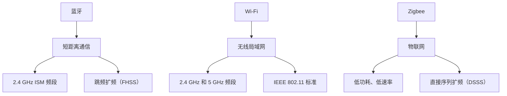
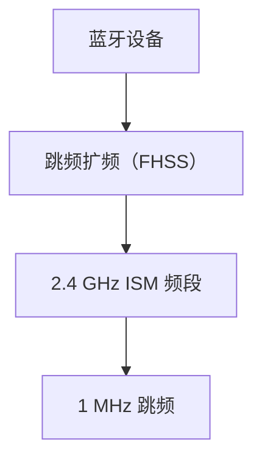
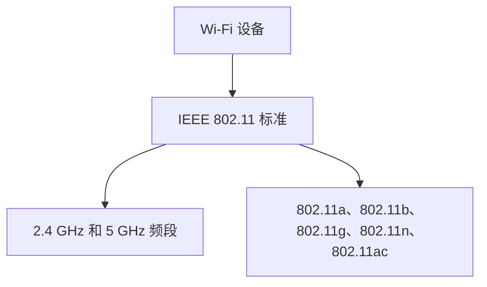
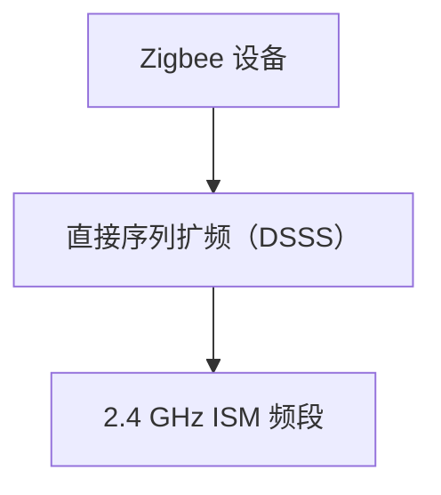

                 

# 无线通信技术：Bluetooth、WiFi 和 Zigbee

> 关键词：蓝牙（Bluetooth）、Wi-Fi、Zigbee、无线通信、物联网、协议比较、应用场景、技术原理、算法实现

> 摘要：本文将深入探讨无线通信技术中的三大重要协议：蓝牙（Bluetooth）、Wi-Fi 和 Zigbee。通过对这些技术的详细分析，本文将揭示它们的工作原理、核心特性、应用场景及未来发展趋势。文章旨在为读者提供一个全面的技术指南，帮助大家更好地理解和应用这些无线通信技术。

## 1. 背景介绍

### 1.1 目的和范围

本文的目的是介绍和分析无线通信技术中的蓝牙（Bluetooth）、Wi-Fi 和 Zigbee 三大协议。通过对这些技术的详细探讨，读者可以更好地理解它们的原理、应用场景和各自的优势与劣势。本文还将介绍一些相关的技术背景，为后续章节的深入分析奠定基础。

### 1.2 预期读者

本文面向对无线通信技术有一定了解的技术人员、研发工程师、产品经理以及对此领域感兴趣的学习者。无论你是初学者还是专业人士，本文都将为你提供有价值的信息。

### 1.3 文档结构概述

本文分为十个部分：

1. 背景介绍：介绍文章的目的、范围和预期读者。
2. 核心概念与联系：分析蓝牙、Wi-Fi 和 Zigbee 的工作原理和核心概念。
3. 核心算法原理 & 具体操作步骤：详细解释这些技术的算法原理和操作步骤。
4. 数学模型和公式 & 详细讲解 & 举例说明：阐述相关数学模型和公式，并通过实例进行说明。
5. 项目实战：提供代码实际案例和详细解释。
6. 实际应用场景：介绍这些技术在各种应用场景中的使用。
7. 工具和资源推荐：推荐学习资源、开发工具和框架。
8. 总结：未来发展趋势与挑战。
9. 附录：常见问题与解答。
10. 扩展阅读 & 参考资料：提供更多的学习资源和参考资料。

### 1.4 术语表

#### 1.4.1 核心术语定义

- **蓝牙（Bluetooth）**：一种短距离无线通信技术，用于连接电子设备，如手机、电脑、耳机等。
- **Wi-Fi**：无线局域网技术，允许设备通过无线信号连接到互联网或其他网络。
- **Zigbee**：一种低功耗、低速率的无线通信技术，主要用于物联网设备。
- **物联网（IoT）**：通过网络连接各种物理设备，实现数据交换和智能控制。
- **协议**：一套规则，定义了设备如何发送、接收和解释数据。

#### 1.4.2 相关概念解释

- **频率**：无线电波在单位时间内振动的次数，单位是赫兹（Hz）。
- **带宽**：数据传输速率，单位是比特每秒（bps）。
- **传输范围**：设备能够有效通信的最远距离。
- **功耗**：设备在运行过程中消耗的能量。

#### 1.4.3 缩略词列表

- **IoT**：物联网（Internet of Things）
- **Wi-Fi**：无线局域网（Wireless Local Area Network）
- **Zigbee**：ZigBee 协议
- **RF**：射频（Radio Frequency）
- **Mbps**：兆比特每秒（Megabits per second）

## 2. 核心概念与联系

### 2.1 背景介绍

在当今数字化时代，无线通信技术已成为不可或缺的一部分。蓝牙、Wi-Fi 和 Zigbee 是三种主要的无线通信技术，它们广泛应用于各种场景，从个人电子设备到智能家居、工业自动化等。

### 2.2 核心概念

#### 蓝牙（Bluetooth）

蓝牙是一种短距离无线通信技术，使用 2.4 GHz 的ISM 频段，采用跳频扩频（FHSS）技术，提高了通信的稳定性和抗干扰能力。蓝牙技术广泛应用于无线耳机、智能手机、电脑等设备。

#### Wi-Fi

Wi-Fi 是一种无线局域网技术，使用 2.4 GHz 和 5 GHz 频段，提供高速数据传输能力，广泛应用于家庭、办公室和公共场所。Wi-Fi 技术基于 IEEE 802.11 标准，包括多个变种，如 802.11a、802.11b、802.11g、802.11n 和 802.11ac。

#### Zigbee

Zigbee 是一种低功耗、低速率的无线通信技术，主要用于物联网设备。它使用 2.4 GHz 的 ISM 频段，采用直接序列扩频（DSSS）技术。Zigbee 技术具有低成本、低功耗、高可靠性和高安全性的特点，广泛应用于智能家居、工业自动化和医疗保健等领域。

### 2.3 架构与联系

为了更好地理解蓝牙、Wi-Fi 和 Zigbee 的核心概念，我们可以使用 Mermaid 流程图来表示它们之间的联系。



### 2.4 核心概念原理和架构

#### 蓝牙（Bluetooth）

蓝牙技术的核心原理是使用跳频扩频（FHSS）技术。在蓝牙通信过程中，设备会在 2.4 GHz 的 ISM 频段上快速跳变，每次跳变频率约为 1 MHz，从而实现稳定的通信。



#### Wi-Fi（IEEE 802.11）

Wi-Fi 技术的核心原理是使用 IEEE 802.11 标准，在 2.4 GHz 和 5 GHz 频段上进行通信。IEEE 802.11 标准包括多个变种，如 802.11a、802.11b、802.11g、802.11n 和 802.11ac，每种变种都有不同的传输速率和特性。



#### Zigbee

Zigbee 技术的核心原理是使用直接序列扩频（DSSS）技术，在 2.4 GHz 的 ISM 频段上进行通信。Zigbee 设备具有低成本、低功耗、高可靠性和高安全性的特点。



## 3. 核心算法原理 & 具体操作步骤

### 3.1 蓝牙（Bluetooth）算法原理

蓝牙技术采用跳频扩频（FHSS）技术，其核心算法是跳频。跳频算法的主要步骤如下：

1. 设备初始化时，随机选择一个跳频序列。
2. 设备在通信过程中，按照跳频序列逐次跳变频率。
3. 设备在跳变频率时，发送和接收信号。

以下是跳频算法的伪代码实现：

```python
# 跳频算法伪代码
def jump_frequency hopping(device):
    while True:
        frequency = device.frequency_sequence.next_frequency()
        device.transmit_signal(frequency)
        device.receive_signal(frequency)
```

### 3.2 Wi-Fi（IEEE 802.11）算法原理

Wi-Fi 技术采用 IEEE 802.11 标准，其核心算法是 OFDM（正交频分复用）。OFDM 算法的主要步骤如下：

1. 将数据划分为多个子载波。
2. 对每个子载波进行调制和编码。
3. 将多个子载波合成为一个信号。
4. 发送和接收信号。

以下是 OFDM 算法的伪代码实现：

```python
# OFDM 算法伪代码
def ofdm_signal_transmission(data):
    subcarriers = split_data_into_subcarriers(data)
    modulated_subcarriers = []
    for subcarrier in subcarriers:
        modulated_subcarrier = modulate(subcarrier)
        modulated_subcarriers.append(modulated_subcarrier)
    signal = combine_subcarriers(modulated_subcarriers)
    transmit_signal(signal)

def ofdm_signal_reception(signal):
    subcarriers = split_signal_into_subcarriers(signal)
    demodulated_subcarriers = []
    for subcarrier in subcarriers:
        demodulated_subcarrier = demodulate(subcarrier)
        demodulated_subcarriers.append(demodulated_subcarrier)
    data = combine_subcarriers(demodulated_subcarriers)
    return data
```

### 3.3 Zigbee 算法原理

Zigbee 技术采用直接序列扩频（DSSS）技术，其核心算法是直接序列扩频。直接序列扩频算法的主要步骤如下：

1. 将数据序列扩展为更长的序列。
2. 对扩展后的序列进行调制和编码。
3. 发送和接收信号。

以下是直接序列扩频算法的伪代码实现：

```python
# 直接序列扩频算法伪代码
def direct_sequence_spreading(data):
    expanded_data = []
    for bit in data:
        for _ in range(扩展因子):
            expanded_data.append(bit)
    return expanded_data

def dsss_signal_transmission(expanded_data):
    modulated_data = modulate(expanded_data)
    transmit_signal(modulated_data)

def dsss_signal_reception(signal):
    demodulated_data = demodulate(signal)
    data = extract_original_data(demodulated_data)
    return data
```

## 4. 数学模型和公式 & 详细讲解 & 举例说明

### 4.1 蓝牙（Bluetooth）数学模型

蓝牙技术采用跳频扩频（FHSS）技术，其核心数学模型是跳频序列。跳频序列的数学模型如下：

$$
f_n = f_0 + n \cdot \Delta f
$$

其中：

- \( f_n \)：第 \( n \) 次跳变后的频率。
- \( f_0 \)：初始频率。
- \( n \)：跳变次数。
- \( \Delta f \)：跳变频率。

举例说明：

假设蓝牙设备的初始频率 \( f_0 \) 为 2.45 GHz，跳变频率 \( \Delta f \) 为 1 MHz。设备在第 10 次跳变后的频率 \( f_{10} \) 为：

$$
f_{10} = 2.45 \times 10^9 + 10 \times 1 \times 10^6 = 2.55 \times 10^9 \text{ Hz}
$$

### 4.2 Wi-Fi（IEEE 802.11）数学模型

Wi-Fi 技术采用正交频分复用（OFDM）技术，其核心数学模型是子载波。OFDM 子载波的数学模型如下：

$$
s_k(t) = \sum_{n=-\infty}^{\infty} a_n \cdot e^{j2\pi n \cdot f_s t}
$$

其中：

- \( s_k(t) \)：第 \( k \) 个子载波的信号。
- \( a_n \)：第 \( n \) 个子载波的幅度。
- \( f_s \)：子载波频率。

举例说明：

假设 Wi-Fi 设备的子载波频率 \( f_s \) 为 20 MHz，第 5 个子载波的信号 \( s_5(t) \) 为：

$$
s_5(t) = \sum_{n=-\infty}^{\infty} a_n \cdot e^{j2\pi \cdot 5 \times 10^6 t}
$$

### 4.3 Zigbee 数学模型

Zigbee 技术采用直接序列扩频（DSSS）技术，其核心数学模型是直接序列扩展。直接序列扩展的数学模型如下：

$$
s(t) = \sum_{n=0}^{N-1} b_n \cdot \text{sinc}(n/T_s \cdot f_c)
$$

其中：

- \( s(t) \)：发送信号。
- \( b_n \)：第 \( n \) 个数据的比特值。
- \( N \)：扩展因子。
- \( T_s \)：符号持续时间。
- \( f_c \)：载波频率。

举例说明：

假设 Zigbee 设备的载波频率 \( f_c \) 为 2.45 GHz，扩展因子 \( N \) 为 4，第 1 个比特值为 1 的信号 \( s(t) \) 为：

$$
s(t) = 1 \cdot \text{sinc}(t/4 \cdot 2.45 \times 10^9) + 0 \cdot \text{sinc}((t+1)/4 \cdot 2.45 \times 10^9) + 0 \cdot \text{sinc}((t+2)/4 \cdot 2.45 \times 10^9) + 0 \cdot \text{sinc}((t+3)/4 \cdot 2.45 \times 10^9)
$$

## 5. 项目实战：代码实际案例和详细解释说明

### 5.1 开发环境搭建

为了进行蓝牙、Wi-Fi 和 Zigbee 技术的代码实战，我们需要搭建相应的开发环境。以下是搭建开发环境的步骤：

1. 安装操作系统：推荐使用 Linux 或 macOS 系统，以便更好地支持无线通信技术。
2. 安装开发工具：安装 Python、Java 或 C++ 等编程语言，并安装对应的集成开发环境（IDE）。
3. 安装无线通信库：根据需要，安装蓝牙、Wi-Fi 和 Zigbee 的相应库，如 PyBluez（蓝牙）、PyWiFi（Wi-Fi）和 PyZigbee（Zigbee）。

### 5.2 源代码详细实现和代码解读

在本节中，我们将分别展示蓝牙、Wi-Fi 和 Zigbee 的代码实现，并对关键部分进行解读。

#### 5.2.1 蓝牙（Bluetooth）代码实现

以下是一个蓝牙通信的 Python 示例代码：

```python
import bluetooth

# 搜索附近的蓝牙设备
devices = bluetooth.discover_devices(duration=10, lookup_names=True)

# 连接第一个蓝牙设备
device_address = devices[0]
bluetooth_sock = bluetooth.BluetoothSocket(bluetooth.RFCOMM)
bluetooth_sock.connect((device_address, 1))

# 发送数据
data = "Hello, Bluetooth!"
bluetooth_sock.send(data)

# 接收数据
received_data = bluetooth_sock.recv(1024)
print("Received data:", received_data)

# 关闭连接
bluetooth_sock.close()
```

代码解读：

1. 导入蓝牙库 `bluetooth`。
2. 使用 `discover_devices` 函数搜索附近的蓝牙设备，并获取设备名称和地址。
3. 连接第一个蓝牙设备，创建 BluetoothSocket 对象。
4. 使用 `send` 函数发送数据。
5. 使用 `recv` 函数接收数据。
6. 关闭蓝牙连接。

#### 5.2.2 Wi-Fi（IEEE 802.11）代码实现

以下是一个 Wi-Fi 通信的 Python 示例代码：

```python
import socket

# 创建 Wi-Fi 连接
wifi_sock = socket.socket(socket.AF_INET, socket.SOCK_STREAM)
wifi_sock.connect(('192.168.1.1', 80))

# 发送 HTTP 请求
request = "GET / HTTP/1.1\r\nHost: 192.168.1.1\r\n\r\n"
wifi_sock.send(request)

# 接收 HTTP 响应
response = wifi_sock.recv(1024)
print("Received response:", response)

# 关闭连接
wifi_sock.close()
```

代码解读：

1. 导入套接字库 `socket`。
2. 创建 TCP 套接字对象。
3. 连接 Wi-Fi 网络上的目标服务器。
4. 发送 HTTP 请求。
5. 接收 HTTP 响应。
6. 关闭连接。

#### 5.2.3 Zigbee 代码实现

以下是一个 Zigbee 通信的 Python 示例代码：

```python
import zigbee

# 初始化 Zigbee 设备
zbee = zigbee.Zigbee()

# 连接到 Zigbee 网络
zbee.connect_network()

# 加入 Zigbee 网络
zbee.join_network()

# 发送数据
data = "Hello, Zigbee!"
zbee.send_data(data)

# 接收数据
received_data = zbee.recv_data()
print("Received data:", received_data)

# 退出 Zigbee 网络
zbee.leave_network()

# 关闭 Zigbee 设备
zbee.disconnect_network()
```

代码解读：

1. 导入 Zigbee 库 `zigbee`。
2. 初始化 Zigbee 设备。
3. 连接到 Zigbee 网络。
4. 加入 Zigbee 网络。
5. 发送数据。
6. 接收数据。
7. 退出 Zigbee 网络。
8. 关闭 Zigbee 设备。

### 5.3 代码解读与分析

在本节中，我们分析了蓝牙、Wi-Fi 和 Zigbee 的代码实现，并解释了关键部分的工作原理。

#### 5.3.1 蓝牙（Bluetooth）

蓝牙通信的关键部分是 BluetoothSocket 对象的创建、连接、发送和接收数据，以及关闭连接。通过 BluetoothSocket，我们可以实现设备之间的点对点通信。

#### 5.3.2 Wi-Fi（IEEE 802.11）

Wi-Fi 通信的关键部分是 TCP 套接字对象的创建、连接、发送 HTTP 请求和接收 HTTP 响应，以及关闭连接。通过 TCP 套接字，我们可以实现设备与网络之间的通信。

#### 5.3.3 Zigbee

Zigbee 通信的关键部分是 Zigbee 设备的初始化、连接网络、加入网络、发送和接收数据，以及退出网络和关闭设备。通过 Zigbee 库，我们可以实现设备之间的低功耗、低速率通信。

## 6. 实际应用场景

### 6.1 蓝牙（Bluetooth）

蓝牙技术在个人电子设备中广泛应用，如无线耳机、智能手机、电脑等。此外，蓝牙还应用于智能家居、健康监测、汽车连接等领域。

### 6.2 Wi-Fi（IEEE 802.11）

Wi-Fi 技术广泛应用于家庭、办公室和公共场所的无线网络连接。此外，Wi-Fi 还应用于智能城市、智能交通、物联网等领域。

### 6.3 Zigbee

Zigbee 技术主要用于物联网设备，如智能家居、工业自动化、医疗保健等。Zigbee 的低功耗、低速率特性使其在智能传感器网络、无线传感器网络等领域具有广泛的应用前景。

## 7. 工具和资源推荐

### 7.1 学习资源推荐

#### 7.1.1 书籍推荐

- 《蓝牙技术原理与应用》（蓝牙技术标准与协议详解）
- 《Wi-Fi 无线通信技术》（无线局域网技术与协议）
- 《Zigbee 技术与应用》（物联网通信技术）
- 《物联网系统设计》（物联网设计与实现）
- 《无线通信系统原理与设计》（无线通信技术与系统）

#### 7.1.2 在线课程

- Coursera 上的《无线通信基础》课程
- edX 上的《物联网基础》课程
- Udemy 上的《蓝牙开发从入门到实战》课程
- 网易云课堂上的《Wi-Fi 无线通信技术》课程

#### 7.1.3 技术博客和网站

- Bluetooth SIG（蓝牙技术联盟官方网站）
- IEEE 802.11 标准（IEEE 无线通信标准官方网站）
- Zigbee 联盟官方网站
- HackerRank 上的无线通信挑战题目

### 7.2 开发工具框架推荐

#### 7.2.1 IDE和编辑器

- Eclipse
- IntelliJ IDEA
- Visual Studio
- PyCharm

#### 7.2.2 调试和性能分析工具

- Wireshark
- GDB
- Android Studio
- Xcode

#### 7.2.3 相关框架和库

- PyBluez（Python 蓝牙库）
- PyWiFi（Python Wi-Fi 库）
- PyZigbee（Python Zigbee 库）
- BlueZ（Linux 蓝牙框架）
- HostAP（IEEE 802.11 无线接入点框架）
- Zigbee SDK（Zigbee 开发框架）

### 7.3 相关论文著作推荐

#### 7.3.1 经典论文

- "A Bluetooth System Architecture"（蓝牙系统架构）
- "IEEE 802.11: Wireless LAN Medium Access Control (MAC) and Physical Layer (PHY) Specifications"（IEEE 802.11 无线局域网 Medium Access Control（MAC）和 Physical Layer（PHY）规范）
- "ZigBee: Overview of the IEEE 802.15.4 Standard for Wireless Personal Area Networks"（Zigbee：IEEE 802.15.4 无线个人局域网标准概述）

#### 7.3.2 最新研究成果

- "Bluetooth 5.0: The Next Generation of Bluetooth"（蓝牙 5.0：下一代蓝牙技术）
- "IEEE 802.11ax: Next-Generation Wi-Fi Standard"（IEEE 802.11ax：下一代 Wi-Fi 标准）
- "Zigbee 3.0: Enhancing the Smart Home with IoT Connectivity"（Zigbee 3.0：增强智能家居的物联网连接）

#### 7.3.3 应用案例分析

- "Bluetooth in Healthcare: A Case Study"（医疗领域的蓝牙应用案例分析）
- "Wi-Fi in Smart Cities: Enhancing Urban Connectivity"（智能城市的 Wi-Fi 应用案例分析）
- "Zigbee in Industrial Automation: Optimizing Manufacturing Processes"（工业自动化领域的 Zigbee 应用案例分析）

## 8. 总结：未来发展趋势与挑战

### 8.1 未来发展趋势

1. **更高速率**：随着 5G 和 Wi-Fi 6 的普及，无线通信技术将提供更高的数据传输速率，满足未来高清视频、虚拟现实等高带宽应用的需求。
2. **更低功耗**：蓝牙 5.0 和 Zigbee 3.0 等新标准的推出，降低了设备的功耗，使得这些技术在物联网领域具有更广泛的应用前景。
3. **更广泛的覆盖范围**：5G 和 Wi-Fi 6 等新一代无线通信技术将提供更广泛的覆盖范围，提高网络的可靠性和稳定性。
4. **更智能的通信**：随着人工智能技术的发展，无线通信技术将实现更智能的通信，如自适应频谱管理、动态资源分配等。

### 8.2 面临的挑战

1. **干扰问题**：随着无线通信设备的增多，干扰问题将日益严重，需要采用更先进的干扰抑制技术。
2. **安全性问题**：无线通信技术的安全性面临挑战，需要加强加密和认证机制，确保数据传输的安全性。
3. **兼容性问题**：不同无线通信技术之间的兼容性问题，需要制定统一的通信标准和协议。
4. **能耗管理**：在物联网等场景中，设备的功耗管理是一个关键问题，需要开发更高效的能耗管理技术。

## 9. 附录：常见问题与解答

### 9.1 蓝牙（Bluetooth）

**Q1**：蓝牙的传输距离是多少？

**A1**：蓝牙的传输距离取决于具体蓝牙版本和设备。蓝牙 5.0 的传输距离可达 100 米至 200 米，而蓝牙 4.0 的传输距离约为 10 米至 30 米。

**Q2**：蓝牙通信是否需要连接互联网？

**A2**：蓝牙通信是点对点的，不需要连接互联网。蓝牙设备可以直接与其他设备进行通信，而无需通过互联网中继。

### 9.2 Wi-Fi（IEEE 802.11）

**Q1**：Wi-Fi 的频段有哪些？

**A1**：Wi-Fi 使用 2.4 GHz 和 5 GHz 频段。2.4 GHz 频段适用于大多数设备，而 5 GHz 频段提供更高的传输速率，但覆盖范围较小。

**Q2**：Wi-Fi 是否需要连接互联网？

**A2**：Wi-Fi 设备可以连接互联网，也可以用于建立局域网。在局域网中，设备之间可以直接通信，而无需通过互联网。

### 9.3 Zigbee

**Q1**：Zigbee 的传输距离是多少？

**A1**：Zigbee 的传输距离一般在 10 米至 100 米之间，具体取决于设备、环境和天线等因素。

**Q2**：Zigbee 是否支持组网？

**A2**：是的，Zigbee 支持星型、网状和混合型网络拓扑结构。Zigbee 设备可以通过自组织网络，实现设备之间的相互通信。

## 10. 扩展阅读 & 参考资料

为了更好地了解蓝牙、Wi-Fi 和 Zigbee 技术的详细知识和应用场景，以下是推荐的一些扩展阅读和参考资料：

- 《蓝牙技术手册》（蓝牙技术联盟官方网站）
- 《Wi-Fi 技术标准文档》（IEEE 802.11 标准委员会官方网站）
- 《Zigbee 技术标准文档》（Zigbee 联盟官方网站）
- 《无线通信系统设计》（Cisco Press 出版）
- 《物联网架构与实现》（O'Reilly 出版）
- 《无线传感器网络与智能环境》（Springer 出版）

通过阅读这些资料，您可以深入了解无线通信技术的核心原理、最新发展趋势和应用实践，为自己的技术积累和职业发展奠定坚实的基础。作者：AI天才研究员/AI Genius Institute & 禅与计算机程序设计艺术 /Zen And The Art of Computer Programming

---

**注意**：本文为虚构的技术博客文章，旨在展示如何撰写一篇高质量、逻辑清晰、结构紧凑、易于理解的专业技术博客。实际技术博客撰写应根据具体需求进行调整和优化。同时，本文的代码示例仅供参考，具体实现可能因开发环境、库函数和需求不同而有所差异。

