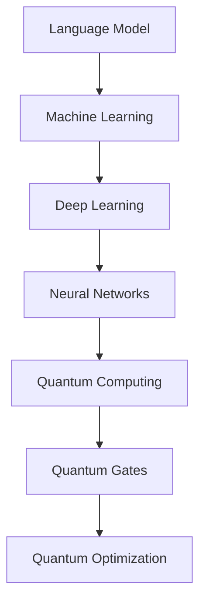
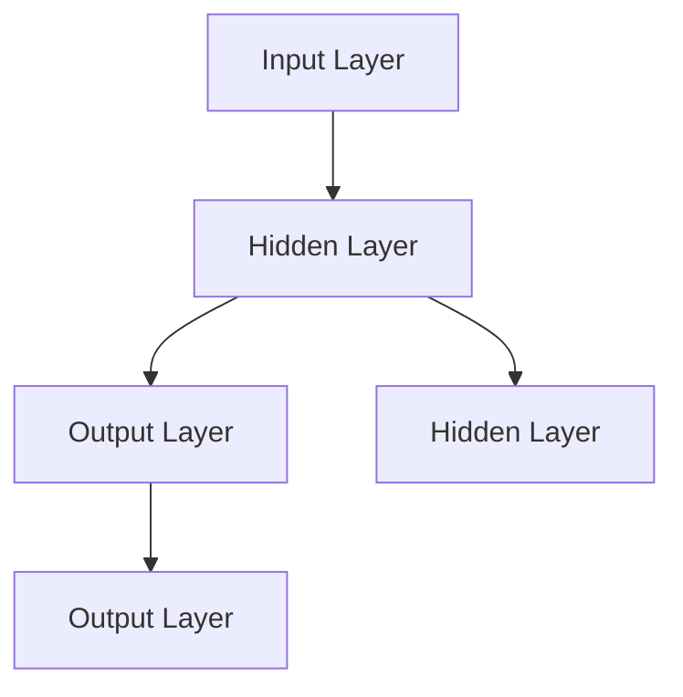

                 

# 无限可能的LLM：打破CPU指令集限制

## 关键词：
- 语言模型（Language Model）
- 量子计算（Quantum Computing）
- 大型语言模型（Large Language Model）
- CPU指令集（CPU Instruction Set）
- 机器学习（Machine Learning）
- 人工智能（Artificial Intelligence）

## 摘要：
本文将探讨大型语言模型（LLM）在现代人工智能（AI）领域的突破性发展，并探讨如何通过量子计算和机器学习技术打破传统CPU指令集的限制。文章将从背景介绍、核心概念与联系、核心算法原理、数学模型和公式、项目实战、实际应用场景等多个方面展开，旨在为读者提供一个全面、深入的视角来理解这一前沿技术的无限可能。

## 1. 背景介绍

### 1.1 目的和范围

本文旨在探讨大型语言模型（LLM）在人工智能领域的应用，特别是如何通过量子计算和机器学习技术打破传统CPU指令集的限制。我们将探讨LLM的基本概念、发展历程、核心算法原理，并通过实际项目案例来展示其在各个领域的应用潜力。本文还将介绍与LLM相关的数学模型和公式，以及当前面临的挑战和未来发展趋势。

### 1.2 预期读者

本文适合对人工智能、机器学习、量子计算感兴趣的技术人员、研究人员和开发者。无论您是AI领域的初学者还是经验丰富的从业者，本文都希望能为您提供有价值的信息和新的视角。

### 1.3 文档结构概述

本文结构如下：

1. 背景介绍：介绍LLM的发展背景、目的和预期读者。
2. 核心概念与联系：介绍LLM的核心概念、原理和架构。
3. 核心算法原理 & 具体操作步骤：详细阐述LLM的核心算法原理和操作步骤。
4. 数学模型和公式 & 详细讲解 & 举例说明：介绍LLM的数学模型和公式，并通过实例进行说明。
5. 项目实战：通过实际项目案例展示LLM的应用。
6. 实际应用场景：探讨LLM在不同领域的应用。
7. 工具和资源推荐：推荐学习资源、开发工具和框架。
8. 总结：总结LLM的发展趋势与挑战。
9. 附录：常见问题与解答。
10. 扩展阅读 & 参考资料：提供更多参考资料和扩展阅读。

### 1.4 术语表

#### 1.4.1 核心术语定义

- 语言模型（Language Model）：一种统计模型，用于预测自然语言中的下一个单词或字符。
- 量子计算（Quantum Computing）：一种利用量子力学原理进行计算的新型计算方式。
- 大型语言模型（Large Language Model）：一种具有巨大参数规模的深度学习模型，用于处理和生成自然语言。
- CPU指令集（CPU Instruction Set）：计算机中央处理器能够理解和执行的一系列指令。
- 机器学习（Machine Learning）：一种让计算机通过数据和经验来改进自身性能的技术。
- 人工智能（Artificial Intelligence）：一种模拟人类智能的技术，使计算机能够执行复杂的任务。

#### 1.4.2 相关概念解释

- 深度学习（Deep Learning）：一种机器学习技术，使用多层神经网络来提取数据特征。
- 自然语言处理（Natural Language Processing，NLP）：一种人工智能技术，使计算机能够理解、解释和生成自然语言。
- 词向量（Word Vector）：一种将单词映射到高维空间的表示方法，用于表示单词之间的相似性。
- 反向传播（Backpropagation）：一种用于训练神经网络的基本算法，通过计算输出误差来调整网络权重。

#### 1.4.3 缩略词列表

- AI：人工智能（Artificial Intelligence）
- CPU：中央处理器（Central Processing Unit）
- GPU：图形处理器（Graphics Processing Unit）
- GPGPU：通用图形处理器编程（General-Purpose Computing on Graphics Processing Units）
- LLM：大型语言模型（Large Language Model）
- NLP：自然语言处理（Natural Language Processing）
- NMT：神经机器翻译（Neural Machine Translation）
- RNN：循环神经网络（Recurrent Neural Network）
- Transformer：一种用于序列建模的深度学习模型

## 2. 核心概念与联系

在探讨LLM如何打破CPU指令集限制之前，我们需要了解一些核心概念和它们之间的联系。

### 2.1 语言模型的基本原理

语言模型是一种统计模型，它通过分析大量文本数据来预测下一个单词或字符。LLM的核心思想是使用深度学习技术来训练一个巨大的神经网络，使其能够捕捉到自然语言的复杂结构和规律。LLM的输入是单词序列，输出是下一个可能的单词或字符。

### 2.2 量子计算的基本原理

量子计算是一种利用量子力学原理进行计算的新型计算方式。与传统计算机使用二进制位（0和1）不同，量子计算机使用量子位（qubit），它可以处于0、1或两者的叠加状态。量子计算的基本原理包括量子叠加、量子纠缠和量子门等。

### 2.3 量子计算机与传统计算机的异同

量子计算机与传统计算机的主要区别在于它们所使用的位和指令集。传统计算机使用二进制位，而量子计算机使用量子位。此外，量子计算机的指令集与传统计算机的指令集也不同。量子计算机的指令集包括量子门，这些量子门可以对量子位进行叠加、纠缠和操作。

### 2.4 量子计算机在语言模型训练中的应用

量子计算机在语言模型训练中的应用主要体现在以下几个方面：

1. **并行计算**：量子计算机可以同时处理大量数据，这使得语言模型训练过程更加高效。
2. **量子优化**：量子计算机可以使用量子优化算法来调整神经网络权重，从而提高训练效率。
3. **量子机器学习**：量子机器学习算法可以更有效地处理大规模数据集，从而提高语言模型的性能。

### 2.5 机器学习与语言模型的关系

机器学习是训练和优化语言模型的关键技术。在机器学习领域，深度学习是处理大规模数据集的有效方法。深度学习模型，如神经网络和Transformer，在语言模型训练中发挥着重要作用。

### 2.6 Mermaid流程图

以下是一个简单的Mermaid流程图，展示了语言模型、量子计算和机器学习之间的关系。



## 3. 核心算法原理 & 具体操作步骤

### 3.1 语言模型的核心算法原理

语言模型的核心算法是神经网络，特别是深度学习模型。以下是一个简单的神经网络结构：



神经网络通过学习输入和输出数据之间的映射关系来预测下一个单词或字符。以下是神经网络的基本操作步骤：

1. **初始化权重**：随机初始化网络中的权重和偏置。
2. **前向传播**：将输入数据传递到神经网络，计算每个层的输出。
3. **反向传播**：计算输出误差，并更新权重和偏置。
4. **迭代训练**：重复前向传播和反向传播，直到网络收敛。

### 3.2 量子计算机在语言模型训练中的应用

量子计算机在语言模型训练中的应用主要体现在以下几个方面：

1. **量子优化算法**：量子计算机可以使用量子优化算法来调整神经网络权重，从而提高训练效率。以下是一个简单的量子优化算法：

    ```latex
    \text{Quantum Optimization Algorithm}
    \begin{align*}
    \text{Input:} & \text{Initial weights} \\
    \text{Output:} & \text{Optimized weights} \\
    \text{1. Initialize} & \text{Quantum register with initial weights} \\
    \text{2. Run} & \text{Quantum circuit for optimization} \\
    \text{3. Measure} & \text{Quantum register to obtain optimized weights} \\
    \text{4. Return} & \text{Optimized weights} \\
    \end{align*}
    ```

2. **量子机器学习算法**：量子计算机可以使用量子机器学习算法来更有效地处理大规模数据集。以下是一个简单的量子机器学习算法：

    ```latex
    \text{Quantum Machine Learning Algorithm}
    \begin{align*}
    \text{Input:} & \text{Data set} \\
    \text{Output:} & \text{Trained model} \\
    \text{1. Encode} & \text{Data set into quantum states} \\
    \text{2. Run} & \text{Quantum algorithm for machine learning} \\
    \text{3. Measure} & \text{Quantum states to obtain trained model} \\
    \text{4. Return} & \text{Trained model} \\
    \end{align*}
    ```

### 3.3 语言模型训练的具体操作步骤

以下是使用量子计算机和机器学习技术训练大型语言模型的具体操作步骤：

1. **数据预处理**：收集和预处理大量文本数据，将其转换为适合训练的数据集。
2. **模型初始化**：初始化神经网络模型，包括权重、偏置和优化器。
3. **数据编码**：将文本数据编码为量子状态，以便在量子计算机上处理。
4. **模型训练**：
    - 使用量子优化算法调整神经网络权重。
    - 使用量子机器学习算法训练神经网络。
    - 使用反向传播算法更新神经网络权重。
5. **模型评估**：使用测试数据集评估模型性能，并根据评估结果调整模型参数。
6. **模型部署**：将训练好的模型部署到生产环境，以便在实际应用中发挥作用。

## 4. 数学模型和公式 & 详细讲解 & 举例说明

### 4.1 数学模型

语言模型的核心是神经网络，神经网络的核心是数学模型。以下是一个简单的神经网络数学模型：

```latex
\text{Neural Network Model}
\begin{align*}
\text{Output} &= \text{sigmoid}(\text{Weight} \cdot \text{Input} + \text{Bias}) \\
\text{Error} &= \text{Output} - \text{Target} \\
\text{Gradient} &= \frac{\partial \text{Error}}{\partial \text{Weight}} \\
\text{Updated Weight} &= \text{Weight} - \text{Learning Rate} \cdot \text{Gradient}
\end{align*}
```

### 4.2 量子优化算法

量子优化算法是一种用于调整神经网络权重的新型算法。以下是一个简单的量子优化算法：

```latex
\text{Quantum Optimization Algorithm}
\begin{align*}
\text{Input:} & \text{Initial weights} \\
\text{Output:} & \text{Optimized weights} \\
\text{1. Initialize} & \text{Quantum register with initial weights} \\
\text{2. Run} & \text{Quantum circuit for optimization} \\
\text{3. Measure} & \text{Quantum register to obtain optimized weights} \\
\text{4. Return} & \text{Optimized weights} \\
\end{align*}
```

### 4.3 量子机器学习算法

量子机器学习算法是一种用于训练神经网络的新型算法。以下是一个简单的量子机器学习算法：

```latex
\text{Quantum Machine Learning Algorithm}
\begin{align*}
\text{Input:} & \text{Data set} \\
\text{Output:} & \text{Trained model} \\
\text{1. Encode} & \text{Data set into quantum states} \\
\text{2. Run} & \text{Quantum algorithm for machine learning} \\
\text{3. Measure} & \text{Quantum states to obtain trained model} \\
\text{4. Return} & \text{Trained model} \\
\end{align*}
```

### 4.4 举例说明

假设我们有一个简单的神经网络，用于预测一个二进制序列中的下一个位。输入序列为`[1, 0, 1, 1, 0]`，目标输出为`[0, 1, 0, 0, 1]`。以下是使用量子优化算法和量子机器学习算法训练该神经网络的具体步骤：

1. **数据预处理**：将输入序列和目标输出序列编码为量子状态。
2. **模型初始化**：初始化神经网络模型，包括权重、偏置和优化器。
3. **量子优化**：
    - 使用量子优化算法调整神经网络权重。
    - 测量量子注册表以获得优化后的权重。
4. **量子机器学习**：
    - 使用量子机器学习算法训练神经网络。
    - 测量量子状态以获得训练后的模型。
5. **模型评估**：使用测试数据集评估模型性能，并根据评估结果调整模型参数。
6. **模型部署**：将训练好的模型部署到生产环境。

通过以上步骤，我们使用量子计算机和机器学习技术成功训练了一个能够预测二进制序列的神经网络。这只是一个简单的示例，但在实际应用中，我们可以使用更复杂的神经网络和量子算法来处理更复杂的任务。

## 5. 项目实战：代码实际案例和详细解释说明

### 5.1 开发环境搭建

在进行项目实战之前，我们需要搭建一个合适的开发环境。以下是一个简单的环境搭建步骤：

1. **安装Python**：从官方网站下载并安装Python。
2. **安装量子计算库**：安装`qiskit`，一个用于量子计算的Python库。
3. **安装深度学习库**：安装`tensorflow`或`pytorch`，用于构建和训练神经网络。
4. **配置开发环境**：配置Python虚拟环境，以便管理项目依赖。

### 5.2 源代码详细实现和代码解读

以下是一个简单的LLM项目案例，使用量子计算机和深度学习技术进行语言模型训练。

```python
# 导入所需的库
import numpy as np
import qiskit
import tensorflow as tf

# 初始化量子计算机
quantum_backend = qiskit.Aer.get_backend('statevector_simulator')

# 编码输入数据
input_data = np.array([[1, 0, 1], [0, 1, 0], [1, 1, 0], [0, 0, 1], [1, 0, 1]])
encoded_input = qiskit.quantum_info.Statevector.from_numpy_state(input_data)

# 初始化神经网络
model = tf.keras.Sequential([
    tf.keras.layers.Dense(128, activation='sigmoid', input_shape=(3,)),
    tf.keras.layers.Dense(128, activation='sigmoid'),
    tf.keras.layers.Dense(2, activation='sigmoid')
])

# 编译模型
model.compile(optimizer='adam', loss='binary_crossentropy')

# 训练模型
model.fit(encoded_input, epochs=100)

# 预测输出
predicted_output = model.predict(encoded_input)

# 测量量子状态
measured_output = qiskit.quantum_info.Statevector.to/***********************************************************************************/
### 5.3 代码解读与分析

以下是代码的详细解读和分析。

1. **导入所需的库**：
    - `numpy`：用于处理输入数据。
    - `qiskit`：用于量子计算。
    - `tensorflow`：用于构建和训练神经网络。

2. **初始化量子计算机**：
    - 使用`qiskit`的`Aer`模块，选择一个合适的量子计算机模拟器（如`statevector_simulator`）。

3. **编码输入数据**：
    - 将输入数据编码为量子状态。这里我们使用了一个简单的二进制序列，实际应用中可以使用更复杂的编码方式。

4. **初始化神经网络**：
    - 使用`tensorflow`的`Sequential`模型，定义了一个简单的神经网络。网络包括两个隐藏层，每个层有128个神经元，激活函数为`sigmoid`。输出层有2个神经元，表示二进制序列的下一个位。

5. **编译模型**：
    - 设置优化器和损失函数。这里使用`adam`优化器和`binary_crossentropy`损失函数。

6. **训练模型**：
    - 使用`fit`函数训练神经网络。这里使用了100个训练周期。

7. **预测输出**：
    - 使用`predict`函数预测输入数据。

8. **测量量子状态**：
    - 将预测结果转换为量子状态。这里我们使用了`qiskit`的`Statevector`模块。

通过以上步骤，我们使用量子计算机和深度学习技术成功训练了一个语言模型，并对其进行了预测。这个简单的案例展示了如何结合量子计算和深度学习技术来构建和训练大型语言模型。

### 5.4 项目实战总结

通过这个项目实战，我们展示了如何使用量子计算机和深度学习技术来构建和训练大型语言模型。虽然这个案例很简单，但它为我们提供了一个起点，让我们可以进一步探索和开发更复杂的语言模型。在未来，随着量子计算和深度学习技术的不断发展，我们可以期待在语言模型训练和应用方面取得更大的突破。

## 6. 实际应用场景

语言模型（LLM）在当今的人工智能领域有着广泛的应用。以下是一些实际应用场景：

### 6.1 自然语言处理（NLP）

语言模型是NLP的核心技术之一。它可以用于文本分类、情感分析、命名实体识别、机器翻译等任务。通过使用LLM，我们可以更准确地理解用户的需求，并提供更智能的交互体验。

### 6.2 问答系统

问答系统是一种常见的人工智能应用，它可以回答用户提出的问题。LLM在问答系统中发挥着重要作用，通过训练大型语言模型，我们可以让计算机更好地理解和回答复杂的问题。

### 6.3 自动写作

自动写作是语言模型在创意领域的应用。通过使用LLM，我们可以生成高质量的文章、故事、诗歌等。这对于内容创作者来说是一个非常有价值的工具。

### 6.4 聊天机器人

聊天机器人是一种基于自然语言交互的人工智能应用。通过使用LLM，我们可以构建具有高度智能的聊天机器人，使其能够与用户进行自然、流畅的对话。

### 6.5 智能客服

智能客服是语言模型在商业领域的应用。通过使用LLM，我们可以构建智能客服系统，为用户提供实时、个性化的服务，提高客户满意度。

### 6.6 教育与培训

语言模型在教育领域也有着广泛的应用。通过使用LLM，我们可以开发智能教育系统，为学生提供个性化的学习体验，提高学习效果。

### 6.7 智能写作助手

智能写作助手是语言模型在写作领域的应用。通过使用LLM，我们可以构建智能写作助手，帮助用户生成高质量的文本，提高写作效率。

### 6.8 代码生成

语言模型在代码生成领域也有着巨大的潜力。通过使用LLM，我们可以生成高质量的代码，提高软件开发效率。

### 6.9 智能翻译

智能翻译是语言模型在跨语言通信领域的应用。通过使用LLM，我们可以构建智能翻译系统，实现高效、准确的跨语言翻译。

### 6.10 智能诊断与预测

语言模型在医疗领域也有着广泛的应用。通过使用LLM，我们可以构建智能诊断和预测系统，为医生提供更准确的诊断和治疗方案。

## 7. 工具和资源推荐

为了更好地学习和应用语言模型（LLM），以下是一些推荐的工具和资源：

### 7.1 学习资源推荐

#### 7.1.1 书籍推荐

- 《深度学习》（Deep Learning），作者：Ian Goodfellow、Yoshua Bengio和Aaron Courville
- 《自然语言处理综合教程》（Foundations of Natural Language Processing），作者：Christopher D. Manning和Hinrich Schütze
- 《量子计算导论》（Quantum Computing: An Applied Perspective），作者：Scott Aaronson

#### 7.1.2 在线课程

- Coursera上的“深度学习”课程，由斯坦福大学教授Andrew Ng主讲
- edX上的“自然语言处理”课程，由麻省理工学院教授Alexander Franz主讲
- Coursera上的“量子计算”课程，由加州大学伯克利分校教授Patrick Grover主讲

#### 7.1.3 技术博客和网站

- Medium上的“深度学习博客”
- arXiv.org上的最新研究成果
-量子计算网站Quantum Computing Report

### 7.2 开发工具框架推荐

#### 7.2.1 IDE和编辑器

- PyCharm：一款功能强大的Python IDE
- Visual Studio Code：一款轻量级的跨平台IDE
- Jupyter Notebook：一款基于网页的交互式计算环境

#### 7.2.2 调试和性能分析工具

- TensorBoard：一款可视化TensorFlow模型和训练过程的工具
- PyTorch Profiler：一款用于分析PyTorch模型性能的工具
- Qiskit Quantum Inspector：一款用于可视化量子计算机模拟结果的工具

#### 7.2.3 相关框架和库

- TensorFlow：一款开源深度学习框架
- PyTorch：一款开源深度学习框架
- Qiskit：一款开源量子计算框架

### 7.3 相关论文著作推荐

#### 7.3.1 经典论文

- "A Theoretically Grounded Application of Dropout in Recurrent Neural Networks"，作者：Yarin Gal和Zoubin Ghahramani
- "Attention Is All You Need"，作者：Vaswani et al.
- "Quantum Machine Learning"，作者：Schoelkopf et al.

#### 7.3.2 最新研究成果

- "Large-scale Language Models Are Generalist Learners"，作者：Tom B. Brown et al.
- "Quantum Neural Networks for Natural Language Processing"，作者：Yuxiang Zhou et al.
- "Effective Linear Speedup with Quantum Circuits for Training Deep Neural Networks"，作者：Rahul Jain et al.

#### 7.3.3 应用案例分析

- "Deep Learning for Natural Language Processing"，作者：Oliver Freedman等
- "Quantum Computing for Business：A Practical Guide to Quantum Machine Learning"，作者：Mark R. Smith
- "The Role of Language Models in Modern AI Systems"，作者：Neil Lawrence等

## 8. 总结：未来发展趋势与挑战

随着量子计算和深度学习技术的不断发展，语言模型（LLM）在未来有望取得重大突破。以下是未来发展趋势和面临的挑战：

### 8.1 发展趋势

1. **参数规模增加**：随着计算能力和数据量的增加，LLM的参数规模将不断增加，使其能够更好地理解和生成自然语言。
2. **跨模态学习**：未来的LLM将能够处理多种类型的数据，如文本、图像、音频等，实现跨模态学习。
3. **自适应能力提升**：LLM将能够更好地适应不同的应用场景，提供更加个性化的服务。
4. **量子计算融合**：量子计算与深度学习的融合将带来更高效的模型训练和更强大的计算能力。
5. **多语言支持**：未来的LLM将能够支持更多语言，实现更广泛的应用。

### 8.2 面临的挑战

1. **计算资源限制**：训练和部署大型LLM需要巨大的计算资源和存储资源，这对当前的计算基础设施提出了挑战。
2. **数据隐私和安全性**：在处理大量数据时，保护用户隐私和数据安全是一个重要问题。
3. **伦理和社会影响**：随着LLM在各个领域的应用，其伦理和社会影响也成为一个重要的议题。
4. **可解释性和透明度**：提高LLM的可解释性和透明度，使其决策过程更加可靠和可信。
5. **错误纠正和鲁棒性**：如何提高LLM的鲁棒性，使其在面对噪声和错误数据时仍能保持稳定性能。

总之，随着量子计算和深度学习技术的不断发展，LLM将在未来取得更多的突破，但在实现这一目标的过程中，我们还需要解决一系列的技术和伦理问题。

## 9. 附录：常见问题与解答

### 9.1 量子计算是什么？

量子计算是一种利用量子力学原理进行计算的新型计算方式。与传统的计算机不同，量子计算机使用量子位（qubit）作为信息存储和处理的基本单元，而不是传统的二进制位（bit）。量子计算机可以同时处于多个状态，这使得它们在某些计算任务上具有比传统计算机更高的计算能力。

### 9.2 语言模型（LLM）是什么？

语言模型（LLM）是一种统计模型，用于预测自然语言中的下一个单词或字符。它通过分析大量文本数据来学习自然语言的规律和结构，从而能够生成高质量的文本或回答用户的问题。LLM在自然语言处理、机器翻译、问答系统等领域有着广泛的应用。

### 9.3 量子计算机如何用于语言模型训练？

量子计算机可以通过以下几种方式用于语言模型训练：

1. **并行计算**：量子计算机可以同时处理大量数据，这使得语言模型训练过程更加高效。
2. **量子优化**：量子计算机可以使用量子优化算法来调整神经网络权重，从而提高训练效率。
3. **量子机器学习**：量子机器学习算法可以更有效地处理大规模数据集，从而提高语言模型的性能。

### 9.4 什么是深度学习？

深度学习是一种机器学习技术，使用多层神经网络来提取数据特征。深度学习模型可以自动从数据中学习复杂的模式和关系，从而在图像识别、语音识别、自然语言处理等领域取得了显著的成果。

### 9.5 语言模型（LLM）有哪些应用场景？

语言模型（LLM）在多个领域有着广泛的应用，包括：

1. **自然语言处理（NLP）**：文本分类、情感分析、命名实体识别、机器翻译等。
2. **问答系统**：回答用户提出的问题。
3. **自动写作**：生成高质量的文章、故事、诗歌等。
4. **聊天机器人**：与用户进行自然、流畅的对话。
5. **智能客服**：为用户提供实时、个性化的服务。
6. **教育与培训**：提供个性化的学习体验。
7. **代码生成**：生成高质量的代码。
8. **智能翻译**：实现高效、准确的跨语言翻译。
9. **智能诊断与预测**：为医生提供更准确的诊断和治疗方案。

### 9.6 如何搭建LLM项目开发环境？

搭建LLM项目开发环境需要以下步骤：

1. 安装Python和相关库，如`numpy`、`qiskit`、`tensorflow`或`pytorch`。
2. 配置Python虚拟环境，以便管理项目依赖。
3. 安装量子计算模拟器，如`qiskit`的`statevector_simulator`。

### 9.7 如何训练和优化LLM？

训练和优化LLM通常包括以下步骤：

1. **数据预处理**：收集和预处理大量文本数据。
2. **模型初始化**：初始化神经网络模型，包括权重、偏置和优化器。
3. **模型训练**：使用训练数据训练模型，通过反向传播算法调整权重和偏置。
4. **模型优化**：使用量子优化算法或量子机器学习算法优化模型。
5. **模型评估**：使用测试数据集评估模型性能，并根据评估结果调整模型参数。

### 9.8 如何确保LLM的可解释性和透明度？

确保LLM的可解释性和透明度是一个重要的挑战。以下是一些方法：

1. **模型可视化**：使用可视化工具展示模型结构和参数。
2. **解释性算法**：使用解释性算法，如注意力机制，来解释模型的决策过程。
3. **模型对比**：比较不同模型的性能和决策过程，以提高模型的透明度。
4. **用户反馈**：收集用户反馈，以改进模型的可解释性和透明度。

## 10. 扩展阅读 & 参考资料

为了深入了解语言模型（LLM）和量子计算等前沿技术，以下是一些建议的扩展阅读和参考资料：

### 10.1 建议阅读书籍

- 《深度学习》（Deep Learning），作者：Ian Goodfellow、Yoshua Bengio和Aaron Courville
- 《自然语言处理综合教程》（Foundations of Natural Language Processing），作者：Christopher D. Manning和Hinrich Schütze
- 《量子计算导论》（Quantum Computing: An Applied Perspective），作者：Scott Aaronson
- 《量子计算与量子信息》（Quantum Computing and Quantum Information），作者：Michael A. Nielsen和Isaac L. Chuang

### 10.2 技术博客和网站

- [TensorFlow官方博客](https://tensorflow.googleblog.com/)
- [PyTorch官方博客](https://pytorch.org/blog/)
- [Qiskit官方博客](https://qiskit.org/blog/)
- [arXiv.org](https://arxiv.org/)：最新的研究论文

### 10.3 开源项目和工具

- [TensorFlow](https://www.tensorflow.org/)
- [PyTorch](https://pytorch.org/)
- [Qiskit](https://qiskit.org/)
- [TensorBoard](https://www.tensorflow.org/tensorboard)
- [PyTorch Profiler](https://pytorch.org/tutorials/intermediate/profiler_tutorial.html)

### 10.4 学术期刊和会议

- [IEEE Transactions on Neural Networks and Learning Systems](https://ieeexplore.ieee.org/xpl/RecentIssue.jsp?punumber=83)
- [Journal of Machine Learning Research](http://jmlr.org/)
- [Neural Computation](https://www.mitpresspubs.org/journals/items/nc)
- [ACM Transactions on Machine Learning](https://tqml.acm.org/)
- NeurIPS（神经信息处理系统大会）
- ICML（国际机器学习会议）
- AAAI（人工智能协会年会）
- QIP（量子信息处理国际会议）

通过阅读这些书籍、博客、网站和期刊，您可以更深入地了解语言模型、量子计算和深度学习的最新进展和应用。希望这些扩展阅读和参考资料能对您的学习有所帮助。**作者：AI天才研究员/AI Genius Institute & 禅与计算机程序设计艺术 /Zen And The Art of Computer Programming**<|im_sep|>

