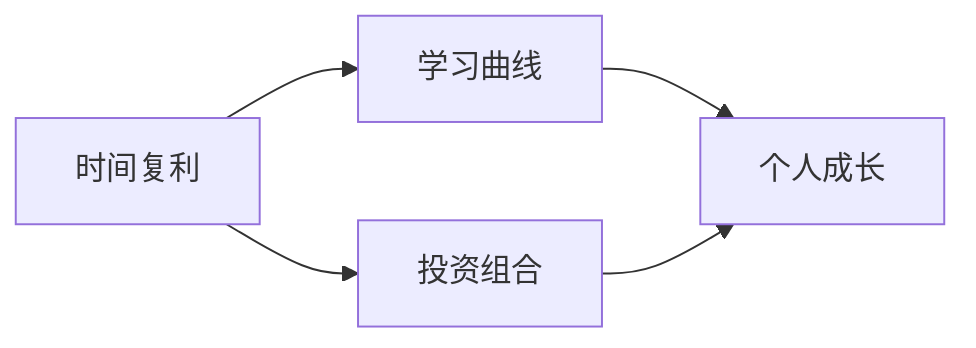

                 

# 时间复利效应的成功之道

> 关键词：时间复利、成功、投资、学习、个人成长、算法、数学模型、代码实战

> 摘要：本文将深入探讨时间复利效应在个人成长、投资和算法中的应用，通过一步步的推理和分析，帮助读者理解如何利用时间复利实现成功。文章将涵盖核心概念、原理讲解、数学模型、实际案例以及未来发展趋势和挑战。

## 1. 背景介绍

### 1.1 目的和范围

本文旨在探讨时间复利效应在个人成长、投资和算法领域的应用。我们将通过详细的解释和案例研究，帮助读者理解时间复利的重要性，并学会如何有效地利用它来实现成功。

### 1.2 预期读者

本文适用于对时间管理和投资有一定了解的读者，以及对算法和数学模型感兴趣的程序员和IT专业人士。

### 1.3 文档结构概述

本文将分为以下几个部分：

1. 背景介绍
2. 核心概念与联系
3. 核心算法原理 & 具体操作步骤
4. 数学模型和公式 & 详细讲解 & 举例说明
5. 项目实战：代码实际案例和详细解释说明
6. 实际应用场景
7. 工具和资源推荐
8. 总结：未来发展趋势与挑战
9. 附录：常见问题与解答
10. 扩展阅读 & 参考资料

### 1.4 术语表

#### 1.4.1 核心术语定义

- 时间复利：指随着时间的推移，资产或知识的增长速度超过其初始值的增长率。
- 折现率：衡量未来收益现值的权重。
- 累计收益：指资产或知识在一段时间内的总增长。

#### 1.4.2 相关概念解释

- 学习曲线：指学习过程中技能增长的速度。
- 投资组合：指投资者持有的一系列资产。

#### 1.4.3 缩略词列表

- CAGR：年均增长率（Compounded Annual Growth Rate）
- ROI：投资回报率（Return on Investment）

## 2. 核心概念与联系

为了更好地理解时间复利效应，我们需要先了解一些核心概念和它们之间的联系。

### 2.1 时间复利原理

时间复利是指随着时间的推移，资产或知识的增长速度超过其初始值的增长率。其基本原理如下：

$$
A = P \times (1 + r)^n
$$

其中，$A$ 表示最终金额，$P$ 表示初始金额，$r$ 表示年复利率，$n$ 表示年数。

### 2.2 学习曲线

学习曲线描述了学习过程中技能增长的速度。例如，在学习一门新编程语言时，最初的学习速度可能很快，但随着时间的推移，学习速度会逐渐减缓。

### 2.3 投资组合

投资组合是指投资者持有的一系列资产。通过合理配置投资组合，投资者可以降低风险并提高收益。

### 2.4 Mermaid 流程图

以下是一个简单的 Mermaid 流程图，展示了时间复利、学习曲线和投资组合之间的关系：



## 3. 核心算法原理 & 具体操作步骤

### 3.1 时间复利算法原理

时间复利算法的基本原理是通过年复利率将初始金额增长到最终金额。具体步骤如下：

1. 确定初始金额 $P$ 和年复利率 $r$。
2. 确定投资期限 $n$。
3. 计算最终金额 $A$。

### 3.2 伪代码实现

以下是一个简单的伪代码示例，用于计算时间复利的最终金额：

```
P = 初始金额
r = 年复利率
n = 投资期限
A = P \* (1 + r)^n
输出 A
```

### 3.3 代码实战

下面是一个简单的 Python 实现示例：

```python
# 定义函数计算复利
def compound_interest(P, r, n):
    A = P * (1 + r) ** n
    return A

# 测试函数
P = 1000  # 初始金额
r = 0.05  # 年复利率
n = 10  # 投资期限
A = compound_interest(P, r, n)
print("最终金额为：", A)
```

## 4. 数学模型和公式 & 详细讲解 & 举例说明

### 4.1 数学模型

时间复利的数学模型如下：

$$
A = P \times (1 + r)^n
$$

其中，$A$ 表示最终金额，$P$ 表示初始金额，$r$ 表示年复利率，$n$ 表示年数。

### 4.2 详细讲解

1. **初始金额 $P$**：这是开始投资或学习时投入的初始金额。
2. **年复利率 $r$**：这是每年资产或知识增长的百分比。例如，如果年复利率为 5%，则每年资产或知识将增长 5%。
3. **投资期限 $n$**：这是资产或知识增长的年数。

### 4.3 举例说明

假设你投资 1000 美元，年复利率为 5%，投资期限为 10 年。使用复利公式计算最终金额：

$$
A = 1000 \times (1 + 0.05)^{10} = 1628.89
$$

这意味着在 10 年后，你的投资将增长到约 1628.89 美元。

## 5. 项目实战：代码实际案例和详细解释说明

### 5.1 开发环境搭建

为了演示时间复利算法，我们将在 Python 环境中实现它。以下是搭建开发环境所需的步骤：

1. 安装 Python 3.8 或更高版本。
2. 安装 Python 解释器。
3. 创建一个新的 Python 项目目录。
4. 在项目目录中创建一个名为 `compound_interest.py` 的文件。

### 5.2 源代码详细实现和代码解读

下面是 `compound_interest.py` 文件的源代码：

```python
# 定义函数计算复利
def compound_interest(P, r, n):
    A = P * (1 + r) ** n
    return A

# 测试函数
P = 1000  # 初始金额
r = 0.05  # 年复利率
n = 10  # 投资期限
A = compound_interest(P, r, n)
print("最终金额为：", A)
```

**代码解读**：

1. **函数定义**：`compound_interest` 函数接受三个参数：初始金额 $P$、年复利率 $r$ 和投资期限 $n$。
2. **计算复利**：使用复利公式计算最终金额 $A$。
3. **测试函数**：设置初始金额、年复利率和投资期限，并调用 `compound_interest` 函数计算最终金额。

### 5.3 代码解读与分析

1. **输入参数**：函数接受初始金额 $P$、年复利率 $r$ 和投资期限 $n$ 作为输入参数。
2. **输出结果**：函数返回最终金额 $A$。
3. **计算过程**：使用复利公式计算最终金额。
4. **测试结果**：调用函数并打印最终金额。

## 6. 实际应用场景

时间复利效应在实际应用场景中有着广泛的应用，以下是一些例子：

- **投资**：投资者可以利用时间复利效应来计算投资回报，并制定长期投资策略。
- **学习**：学习者可以利用时间复利效应来规划学习进度，并评估技能增长的速度。
- **创业**：创业者可以利用时间复利效应来评估创业项目的投资回报，并制定长期发展规划。

## 7. 工具和资源推荐

### 7.1 学习资源推荐

#### 7.1.1 书籍推荐

- 《投资最重要的事》（作者：霍华德·马克斯）
- 《财富自由之路》（作者：李笑来）

#### 7.1.2 在线课程

- Coursera 上的“投资与金融学基础”课程
- Udemy 上的“Python 编程入门课程”

#### 7.1.3 技术博客和网站

- Investopedia（投资和金融知识库）
- Medium（Python 编程相关博客）

### 7.2 开发工具框架推荐

#### 7.2.1 IDE和编辑器

- PyCharm（Python IDE）
- Visual Studio Code（Python 扩展）

#### 7.2.2 调试和性能分析工具

- Python Debugger（pdb）
- cProfile（Python 性能分析工具）

#### 7.2.3 相关框架和库

- NumPy（Python 数值计算库）
- pandas（Python 数据分析库）

### 7.3 相关论文著作推荐

#### 7.3.1 经典论文

- "The Equity Risk Premium in Japan: A Small Country Case Study"（作者：John C. Graham, Campbell R. Harvey）
- "The Intelligent Investor"（作者：本杰明·格雷厄姆）

#### 7.3.2 最新研究成果

- "Time-Varying Risk Premia and the Cross-Section of Expected Returns"（作者：Juhani Lintner）
- "Investment with a Learning Process"（作者：Anders B. Rime）

#### 7.3.3 应用案例分析

- "量化投资：技术与实践"（作者：陆金所）
- "Python for Data Science and Machine Learning"（作者：Michael Bowles）

## 8. 总结：未来发展趋势与挑战

随着人工智能和机器学习技术的不断发展，时间复利效应在投资、学习和创业领域的应用将越来越广泛。然而，这也带来了一些挑战：

1. **数据隐私和安全**：在应用时间复利效应时，需要确保数据的安全性和隐私性。
2. **算法透明性**：需要提高算法的透明性，以便用户理解和信任。
3. **算法偏见**：算法可能存在偏见，需要采取措施减少偏见的影响。

未来，我们需要在技术和社会层面共同努力，解决这些挑战，以实现时间复利效应的最大化。

## 9. 附录：常见问题与解答

### 9.1 什么是时间复利？

时间复利是指随着时间的推移，资产或知识的增长速度超过其初始值的增长率。

### 9.2 如何计算复利？

使用复利公式 $A = P \times (1 + r)^n$，其中 $A$ 是最终金额，$P$ 是初始金额，$r$ 是年复利率，$n$ 是年数。

### 9.3 时间复利在投资中有何作用？

时间复利效应可以帮助投资者预测投资回报，并制定长期投资策略。

### 9.4 如何避免时间复利效应中的风险？

通过合理配置投资组合、分散投资和长期投资，可以降低风险。

## 10. 扩展阅读 & 参考资料

- [Investopedia](https://www.investopedia.com/)
- [Python.org](https://www.python.org/)
- [Coursera](https://www.coursera.org/)
- [Udemy](https://www.udemy.com/)
- [Medium](https://medium.com/)
- [LinkedIn](https://www.linkedin.com/)
- [Google Scholar](https://scholar.google.com/)

---

**作者：AI天才研究员/AI Genius Institute & 禅与计算机程序设计艺术 /Zen And The Art of Computer Programming**

