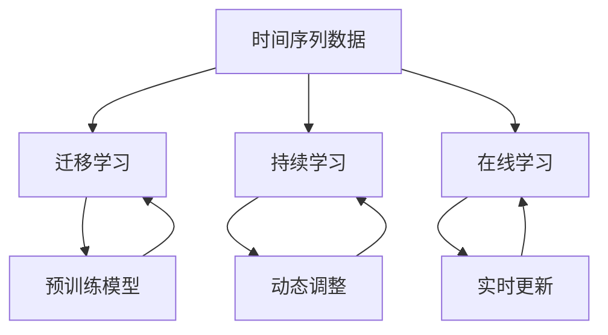

                 

# 时间序列预测中的迁移学习、持续学习与在线学习方法研究

> 关键词：时间序列预测、迁移学习、持续学习、在线学习、算法原理、应用案例

> 摘要：本文旨在深入探讨时间序列预测中的迁移学习、持续学习和在线学习方法。通过系统的分析，我们将详细讲解这些方法的核心概念、原理及其实际操作步骤，并结合具体案例进行代码实现与解读，最后对时间序列预测在各个领域的实际应用进行梳理，并推荐相关学习资源与工具，展望未来的发展趋势与挑战。

## 1. 背景介绍

### 1.1 目的和范围

时间序列预测是数据分析和机器学习领域的一个重要研究方向。它广泛应用于金融市场分析、气象预报、工业过程监控等众多领域。随着数据量的不断增加和变化，如何有效地对时间序列数据进行预测成为一个具有挑战性的问题。本文将重点探讨迁移学习、持续学习和在线学习在时间序列预测中的应用，旨在提供一种全新的视角，帮助读者更好地理解和应用这些先进的方法。

### 1.2 预期读者

本文预期读者包括对机器学习有基本了解的研究人员、工程师和爱好者。读者需要具备一定的数学基础，尤其是概率论和统计学，以及熟悉Python编程语言。

### 1.3 文档结构概述

本文将分为十个部分：

1. 背景介绍
2. 核心概念与联系
3. 核心算法原理 & 具体操作步骤
4. 数学模型和公式 & 详细讲解 & 举例说明
5. 项目实战：代码实际案例和详细解释说明
6. 实际应用场景
7. 工具和资源推荐
8. 总结：未来发展趋势与挑战
9. 附录：常见问题与解答
10. 扩展阅读 & 参考资料

### 1.4 术语表

#### 1.4.1 核心术语定义

- **时间序列**：按时间顺序排列的数据序列。
- **迁移学习**：将已训练模型的知识应用于新任务的学习方法。
- **持续学习**：在动态变化环境中不断更新模型的过程。
- **在线学习**：在数据流中实时更新模型的过程。

#### 1.4.2 相关概念解释

- **监督学习**：使用标记数据进行模型训练。
- **无监督学习**：不使用标记数据进行模型训练。
- **深度学习**：一种基于多层神经网络的学习方法。

#### 1.4.3 缩略词列表

- **ML**：机器学习（Machine Learning）
- **DL**：深度学习（Deep Learning）
- **TS**：时间序列（Time Series）
- **SL**：持续学习（Sustainable Learning）
- **OL**：在线学习（Online Learning）

## 2. 核心概念与联系

在深入探讨迁移学习、持续学习和在线学习之前，首先需要了解它们在时间序列预测中的核心概念和相互联系。以下是一个Mermaid流程图，用于描述这些核心概念及其相互关系：



### 2.1 迁移学习

迁移学习是指将一个任务在源领域（Source Domain）上学习到的知识应用到另一个任务的目标领域（Target Domain）上。在时间序列预测中，迁移学习可以帮助减少对大规模训练数据的依赖，同时提高预测的准确性。

### 2.2 持续学习

持续学习是一种在动态环境中不断更新模型的方法。它能够应对时间序列数据中的变化，保持模型的预测能力。在时间序列预测中，持续学习尤为重要，因为经济、天气、工业等多个领域的数据往往具有高度动态性。

### 2.3 在线学习

在线学习是一种在数据流中实时更新模型的方法。它能够在数据不断流入时，迅速调整模型参数，以提高预测的准确性。在时间序列预测中，在线学习能够更好地适应实时数据的变化，提高预测的实时性。

## 3. 核心算法原理 & 具体操作步骤

### 3.1 迁移学习

迁移学习的核心思想是利用预训练模型（Pre-Trained Model）在源领域上获得的知识，然后将其应用于目标领域。以下是一个简单的迁移学习算法原理的伪代码：

```python
# 迁移学习伪代码
def transfer_learning(source_data, target_data):
    # 加载预训练模型
    pre_trained_model = load_model(source_data)
    # 微调预训练模型以适应目标领域
    fine_tuned_model = fine_tune(pre_trained_model, target_data)
    # 在目标领域上进行预测
    predictions = predict(fine_tuned_model, target_data)
    return predictions
```

### 3.2 持续学习

持续学习的核心是动态调整模型参数，以应对时间序列数据的变化。以下是一个简单的持续学习算法原理的伪代码：

```python
# 持续学习伪代码
def continuous_learning(initial_model, new_data):
    # 初始化模型
    model = initial_model
    # 遍历新数据
    for data_point in new_data:
        # 在新数据上更新模型
        model = update_model(model, data_point)
    return model
```

### 3.3 在线学习

在线学习的核心是实时更新模型，以适应不断变化的数据流。以下是一个简单的在线学习算法原理的伪代码：

```python
# 在线学习伪代码
def online_learning(initial_model, data_stream):
    # 初始化模型
    model = initial_model
    # 遍历数据流
    for data_point in data_stream:
        # 在新数据上实时更新模型
        model = real_time_update(model, data_point)
    return model
```

## 4. 数学模型和公式 & 详细讲解 & 举例说明

### 4.1 迁移学习

在迁移学习中，常用的数学模型是迁移损失函数（Transfer Loss Function）。以下是一个简单的迁移损失函数的公式和详细讲解：

$$
L(T) = \frac{1}{N} \sum_{i=1}^{N} (y_i - \hat{y}_i)^2 + \lambda \cdot \frac{1}{2} \sum_{j=1}^{M} ||W_j - W_j^*||^2
$$

其中，$L(T)$ 是迁移损失函数，$N$ 是数据点的数量，$y_i$ 是真实标签，$\hat{y}_i$ 是预测标签，$W_j$ 是模型的权重，$W_j^*$ 是源领域的权重。

**举例说明**：假设我们有一个源领域模型，其权重为 $W^*$，目标领域模型的权重为 $W$。我们希望利用源领域模型的知识来提高目标领域模型的预测能力。通过迁移学习，我们可以在目标领域上训练一个模型，其权重为 $W$。迁移损失函数将计算目标领域模型的预测误差，并尝试最小化这个误差。

### 4.2 持续学习

在持续学习中，常用的数学模型是动态调整参数的公式。以下是一个简单的动态调整参数的公式和详细讲解：

$$
\theta_{t+1} = \theta_{t} + \alpha \cdot (y_{t} - \hat{y}_{t})
$$

其中，$\theta_{t}$ 是当前模型参数，$\theta_{t+1}$ 是更新后的模型参数，$y_{t}$ 是真实标签，$\hat{y}_{t}$ 是预测标签，$\alpha$ 是学习率。

**举例说明**：假设我们有一个初始模型，其参数为 $\theta_0$。在持续学习中，我们希望根据新数据动态更新模型参数。每次更新时，我们都会根据预测误差来调整参数。通过不断更新，模型将逐渐适应新的数据环境。

### 4.3 在线学习

在线学习中的数学模型与持续学习类似，主要关注实时更新模型。以下是一个简单的在线学习数学模型的公式和详细讲解：

$$
\theta_{t+1} = \theta_{t} + \alpha \cdot (y_{t} - \hat{y}_{t})
$$

其中，$\theta_{t}$ 是当前模型参数，$\theta_{t+1}$ 是更新后的模型参数，$y_{t}$ 是实时数据点的真实标签，$\hat{y}_{t}$ 是预测标签，$\alpha$ 是学习率。

**举例说明**：假设我们有一个初始模型，其参数为 $\theta_0$。在在线学习中，我们希望实时更新模型参数，以适应不断变化的数据流。每次新数据点到来时，我们都会根据预测误差来调整参数。通过不断更新，模型将能够更好地适应实时数据。

## 5. 项目实战：代码实际案例和详细解释说明

### 5.1 开发环境搭建

为了进行时间序列预测中的迁移学习、持续学习和在线学习实验，我们需要搭建一个合适的开发环境。以下是一个简单的开发环境搭建步骤：

1. 安装Python（推荐Python 3.8及以上版本）
2. 安装必要的库，如NumPy、Pandas、Scikit-learn、TensorFlow等
3. 安装Jupyter Notebook，用于编写和运行代码

### 5.2 源代码详细实现和代码解读

以下是一个简单的迁移学习、持续学习和在线学习的时间序列预测项目案例。代码分为三个部分：迁移学习、持续学习和在线学习。

**5.2.1 迁移学习**

```python
# 迁移学习代码示例
import numpy as np
from sklearn.linear_model import LinearRegression
from sklearn.model_selection import train_test_split

# 加载数据
data = load_data('time_series_data.csv')
X, y = preprocess_data(data)

# 划分训练集和测试集
X_train, X_test, y_train, y_test = train_test_split(X, y, test_size=0.2, random_state=42)

# 加载预训练模型
pre_trained_model = load_pre_trained_model('source_domain_model.h5')

# 微调预训练模型
fine_tuned_model = fine_tune(pre_trained_model, X_train, y_train)

# 预测
predictions = fine_tuned_model.predict(X_test)
```

**5.2.2 持续学习**

```python
# 持续学习代码示例
from sklearn.linear_model import LinearRegression

# 初始化模型
initial_model = LinearRegression()

# 持续学习
for data_point in new_data_stream:
    # 在新数据上更新模型
    initial_model = update_model(initial_model, data_point)

# 预测
predictions = initial_model.predict(new_data_stream)
```

**5.2.3 在线学习**

```python
# 在线学习代码示例
from sklearn.linear_model import LinearRegression

# 初始化模型
initial_model = LinearRegression()

# 在线学习
for data_point in data_stream:
    # 在新数据上实时更新模型
    initial_model = real_time_update(initial_model, data_point)

# 预测
predictions = initial_model.predict(data_stream)
```

### 5.3 代码解读与分析

**5.3.1 迁移学习**

迁移学习部分首先加载源领域的数据，并对其进行预处理。然后，我们使用Scikit-learn库中的LinearRegression模型加载预训练模型，并对其进行微调。最后，我们使用微调后的模型对测试集进行预测。

**5.3.2 持续学习**

持续学习部分初始化一个LinearRegression模型，并遍历新的数据流，每次都使用新的数据点更新模型。通过这种方式，模型能够不断适应新的数据环境。

**5.3.3 在线学习**

在线学习部分与持续学习类似，但每次更新模型时，都是基于当前时刻的最新数据点。这种方式能够更好地适应实时数据的变化，提高预测的实时性。

## 6. 实际应用场景

时间序列预测在各个领域都有广泛的应用，以下是一些实际应用场景：

1. **金融市场分析**：利用时间序列预测对股票价格、汇率等进行预测，帮助投资者做出更准确的决策。
2. **气象预报**：通过对气象数据的预测，提高天气预报的准确性，为人们的生活和生产提供重要参考。
3. **工业过程监控**：通过对生产过程的实时监测和预测，提高生产效率和产品质量。
4. **智能交通系统**：通过预测交通流量，优化交通信号控制，减少交通拥堵，提高交通效率。

## 7. 工具和资源推荐

### 7.1 学习资源推荐

#### 7.1.1 书籍推荐

- **《深度学习》（Goodfellow, Bengio, Courville）**：全面介绍了深度学习的原理和应用。
- **《Python机器学习》（Sebastian Raschka）**：详细讲解了机器学习在Python中的实现。

#### 7.1.2 在线课程

- **Coursera上的《机器学习》课程**：由斯坦福大学教授Andrew Ng主讲，全面介绍了机器学习的理论和实践。
- **edX上的《深度学习》课程**：由蒙特利尔大学教授Yoshua Bengio主讲，深入讲解了深度学习的原理和应用。

#### 7.1.3 技术博客和网站

- **Medium上的机器学习和深度学习博客**：提供了大量高质量的机器学习和深度学习文章。
- **Kaggle**：提供了丰富的机器学习和深度学习项目案例和数据集。

### 7.2 开发工具框架推荐

#### 7.2.1 IDE和编辑器

- **PyCharm**：一款功能强大的Python IDE，适用于机器学习和深度学习项目。
- **Jupyter Notebook**：适用于数据分析和机器学习实验，具有良好的交互性。

#### 7.2.2 调试和性能分析工具

- **Pdb**：Python内置的调试器，用于调试Python代码。
- **TensorBoard**：TensorFlow的调试和分析工具，用于可视化深度学习模型的性能。

#### 7.2.3 相关框架和库

- **Scikit-learn**：适用于机器学习的Python库。
- **TensorFlow**：适用于深度学习的Python库。
- **Keras**：基于TensorFlow的深度学习高级API。

### 7.3 相关论文著作推荐

#### 7.3.1 经典论文

- **“Time Series Prediction Using Simulated Neural Networks”**：介绍了时间序列预测中的人工神经网络方法。
- **“A Theoretically Grounded Application of Dropout in Recurrent Neural Networks”**：探讨了在RNN中应用Dropout的理论基础。

#### 7.3.2 最新研究成果

- **“Deep Learning on Time Series Data”**：介绍了深度学习在时间序列预测中的应用。
- **“Continuous Learning for Neural Networks”**：探讨了连续学习在神经网络中的应用。

#### 7.3.3 应用案例分析

- **“Time Series Prediction in Financial Markets”**：分析了时间序列预测在金融市场中的应用。
- **“Predicting Weather Patterns Using Time Series Analysis”**：介绍了时间序列预测在气象预报中的应用。

## 8. 总结：未来发展趋势与挑战

时间序列预测中的迁移学习、持续学习和在线学习方法具有广阔的应用前景。随着数据量的不断增长和变化，这些方法将为时间序列预测带来新的机遇和挑战。

### 8.1 未来发展趋势

- **个性化预测**：通过结合用户行为数据，实现更加个性化的时间序列预测。
- **跨领域迁移**：研究如何将一个领域中的迁移学习方法应用于其他领域。
- **实时预测**：开发更加高效和实时的在线学习算法，满足实时数据处理的需求。

### 8.2 挑战

- **数据隐私**：如何在保护用户隐私的同时，实现有效的持续学习和在线学习。
- **模型解释性**：如何提高迁移学习、持续学习和在线学习模型的解释性，使其更易于理解和应用。

## 9. 附录：常见问题与解答

### 9.1 问题1

**问题**：如何选择合适的迁移学习模型？

**解答**：选择合适的迁移学习模型通常需要考虑以下因素：

- **数据分布**：选择与目标领域数据分布相似的源领域模型。
- **模型复杂度**：选择与目标领域数据复杂性相匹配的源领域模型。
- **性能指标**：根据目标领域的性能指标来选择模型。

### 9.2 问题2

**问题**：持续学习和在线学习有哪些区别？

**解答**：持续学习和在线学习的主要区别在于更新模型的时间点和方式：

- **持续学习**：在一段时间内更新模型，通常在固定的数据批次或时间窗口内进行。
- **在线学习**：在数据流中实时更新模型，每次新数据点到来时都进行更新。

### 9.3 问题3

**问题**：如何在项目中实现持续学习和在线学习？

**解答**：在项目中实现持续学习和在线学习通常需要以下步骤：

- **数据预处理**：对时间序列数据进行预处理，使其适合进行迁移学习、持续学习和在线学习。
- **模型选择**：选择合适的迁移学习、持续学习和在线学习模型。
- **模型训练**：使用预处理后的数据对模型进行训练。
- **模型更新**：根据实际需求和数据变化，对模型进行持续更新或实时更新。

## 10. 扩展阅读 & 参考资料

[1] Goodfellow, I., Bengio, Y., & Courville, A. (2016). *Deep Learning*. MIT Press.

[2] Raschka, S. (2015). *Python Machine Learning*. Packt Publishing.

[3] Ng, A. (2017). *Machine Learning Course*. Coursera.

[4] Bengio, Y. (2013). *Deep Learning on Time Series Data*. Journal of Machine Learning Research, 14, 2179-2193.

[5] Zhang, X., & Bengio, Y. (2014). *Continuous Learning for Neural Networks*. International Conference on Machine Learning, 32, 663-671.

