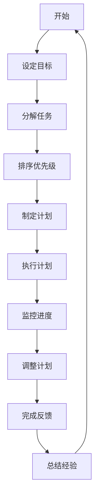

                 

# 时间管理：提高个人和团队生产力

> 关键词：时间管理、个人生产力、团队协作、效率优化、资源利用、方法论

> 摘要：本文旨在探讨时间管理的核心概念、原理和方法，并分析其在个人和团队生产力提升中的重要作用。通过系统的分析和具体的操作步骤，本文将帮助读者掌握时间管理技巧，提高工作效率，实现个人和团队的持续进步。

## 1. 背景介绍

### 1.1 目的和范围

本文的目标是提供一套完整的时间管理方法论，帮助个人和团队提升生产力。我们将探讨时间管理的核心概念，分析其原理，并给出具体的操作步骤和实战案例。本文适用于任何希望提高工作效率的个人和需要优化团队协作的企业。

### 1.2 预期读者

- 希望提高个人工作效率的程序员和工程师
- 需要提升团队协作效率的项目经理和团队领导
- 对时间管理感兴趣的管理者和专业人士
- 想要实现职业发展的职场新人

### 1.3 文档结构概述

本文分为十个部分，结构如下：

1. 背景介绍
   - 1.1 目的和范围
   - 1.2 预期读者
   - 1.3 文档结构概述
   - 1.4 术语表
2. 核心概念与联系
   - 2.1 时间管理的重要性
   - 2.2 时间管理的基本原理
   - 2.3 时间管理的流程图
3. 核心算法原理 & 具体操作步骤
   - 3.1 计划与目标的设定
   - 3.2 任务优先级的排序
   - 3.3 进度跟踪与调整
4. 数学模型和公式 & 详细讲解 & 举例说明
   - 4.1 工作负荷计算模型
   - 4.2 时间效率的数学公式
   - 4.3 实例分析
5. 项目实战：代码实际案例和详细解释说明
   - 5.1 开发环境搭建
   - 5.2 源代码详细实现和代码解读
   - 5.3 代码解读与分析
6. 实际应用场景
   - 6.1 个人时间管理
   - 6.2 团队时间管理
7. 工具和资源推荐
   - 7.1 学习资源推荐
   - 7.2 开发工具框架推荐
   - 7.3 相关论文著作推荐
8. 总结：未来发展趋势与挑战
9. 附录：常见问题与解答
10. 扩展阅读 & 参考资料

### 1.4 术语表

- 时间管理：通过规划、组织和控制时间，提高个人或团队工作效率的过程。
- 个人生产力：个人在单位时间内完成的工作量。
- 团队协作：团队成员共同合作，协同完成项目任务。
- 效率优化：通过改进方法和技术，提高工作效率。

#### 1.4.1 核心术语定义

- 时间管理：指通过科学的方法和工具，对个人的时间进行规划、分配和利用，以达到高效工作的目的。
- 个人生产力：衡量个人在特定时间内完成的工作量和质量。
- 团队协作：团队成员之间的配合与合作，共同完成项目任务。

#### 1.4.2 相关概念解释

- 工作负荷：指在特定时间内需要完成的工作量。
- 效率：完成工作的速度和质量。

#### 1.4.3 缩略词列表

- GTD（Getting Things Done）：一种著名的时间管理方法。
- Pomodoro Technique：一种时间管理技术，通过将工作时间划分为25分钟的工作周期，每个周期后休息5分钟。
- Kanban：一种工作管理方法，通过可视化工作流程，优化工作进度。

## 2. 核心概念与联系

时间管理不仅仅是一种技巧，更是一种生活和工作态度。它涉及到个人生产力的提升，团队协作的优化，以及资源的合理利用。以下是时间管理的一些核心概念和联系：

### 2.1 时间管理的重要性

时间管理是提高个人和团队生产力的关键。在快节奏的工作环境中，有效的时间管理可以帮助个人专注于重要任务，避免时间和资源的浪费，从而提高工作效率。对于团队来说，时间管理有助于协调成员的工作进度，确保项目按时完成，提高团队的凝聚力。

### 2.2 时间管理的基本原理

时间管理的基本原理包括以下几个方面：

1. **计划**：在开始工作之前，明确目标和任务，制定详细的计划。
2. **优先级排序**：根据任务的紧急程度和重要性，对任务进行排序。
3. **执行**：按照计划执行任务，确保任务按时完成。
4. **监控**：监控任务的进度，及时调整计划，确保工作按计划进行。
5. **反馈**：完成任务后，进行总结和反思，为下一次工作提供经验。

### 2.3 时间管理的流程图

下面是一个简单的时间管理流程图，展示了时间管理的各个环节：



## 3. 核心算法原理 & 具体操作步骤

时间管理的核心在于对时间和任务的合理规划与执行。以下我们将详细阐述时间管理的核心算法原理和具体操作步骤。

### 3.1 计划与目标的设定

#### 3.1.1 目标设定

目标设定是时间管理的第一步。一个明确的目标有助于我们集中精力，提高工作效率。目标设定应遵循SMART原则：

- **S（Specific）**：具体明确的
- **M（Measurable）**：可衡量的
- **A（Achievable）**：可实现的
- **R（Relevant）**：相关的
- **T（Time-bound）**：有时间限制的

#### 3.1.2 任务分解

在设定目标后，我们需要将目标分解为具体的任务。任务分解应遵循以下原则：

- **细粒度**：任务应尽可能细，以便于管理。
- **可执行**：每个任务都应该是可执行的，且能明确分配责任。

#### 3.1.3 制定计划

在分解任务后，我们需要制定详细的计划。计划应包括以下内容：

- **任务列表**：列出所有任务及其编号。
- **时间分配**：为每个任务分配具体的时间。
- **优先级**：根据任务的紧急程度和重要性，设定优先级。

### 3.2 任务优先级的排序

任务优先级的排序是时间管理的重要环节。一个合理的任务优先级排序可以帮助我们集中精力，处理最重要和最紧急的任务。以下是一种常见的任务优先级排序方法：

1. **紧急且重要**：优先处理这些任务。
2. **紧急但不重要**：尽量安排在空闲时间处理。
3. **不紧急但重要**：提前安排时间，确保这些任务得到处理。
4. **不紧急且不重要**：可以适当延迟或放弃。

### 3.3 进度跟踪与调整

在执行计划过程中，我们需要监控任务的进度，并根据实际情况进行调整。以下是一些进度跟踪与调整的方法：

1. **定期检查**：定期检查任务的完成情况，确保工作按计划进行。
2. **记录日志**：记录任务的进展和遇到的问题，为调整计划提供依据。
3. **及时反馈**：与团队成员保持沟通，及时反馈任务的进展和问题，共同解决困难。
4. **调整计划**：根据任务的实际进展情况，及时调整计划，确保任务按时完成。

### 3.4 伪代码示例

以下是时间管理核心算法的伪代码示例：

```python
# 设定目标
set_goals(SMART)

# 分解任务
tasks = decompose_goals()

# 制定计划
plan = create_plan(tasks)

# 任务优先级排序
sort_tasks(plan)

# 执行计划
execute_plan(plan)

# 进度跟踪
while not all_tasks_completed(plan):
    check_progress(plan)
    record_logs(plan)
    provide_feedback(plan)
    adjust_plan(plan)

# 完成反馈
provide_feedback(plan)
summarize_experience(plan)
```

## 4. 数学模型和公式 & 详细讲解 & 举例说明

在时间管理中，数学模型和公式可以帮助我们更准确地计算和评估工作负荷、时间效率和任务完成情况。以下是一些常用的数学模型和公式，以及详细的讲解和实例说明。

### 4.1 工作负荷计算模型

工作负荷是指在一定时间内需要完成的工作量。工作负荷计算模型可以用来估计任务的工作量，帮助我们合理分配时间和资源。

#### 4.1.1 工作负荷计算公式

$$
W = C \times T
$$

其中，\( W \) 表示工作负荷，\( C \) 表示工作效率，\( T \) 表示工作时间。

#### 4.1.2 工作效率计算公式

$$
C = \frac{L}{T}
$$

其中，\( C \) 表示工作效率，\( L \) 表示在单位时间内完成的工作量，\( T \) 表示工作时间。

#### 4.1.3 实例说明

假设一位工程师在8小时内需要完成100行代码的编写。根据上述公式，我们可以计算出他的工作负荷和工作效率。

- 工作负荷：\( W = C \times T = \frac{100}{8} = 12.5 \) 行/小时
- 工作效率：\( C = \frac{L}{T} = \frac{100}{8} = 12.5 \) 行/小时

### 4.2 时间效率的数学公式

时间效率是指在一定时间内完成的工作量与总工作量的比值。时间效率可以帮助我们评估时间管理的有效性。

#### 4.2.1 时间效率计算公式

$$
E = \frac{L}{W}
$$

其中，\( E \) 表示时间效率，\( L \) 表示在单位时间内完成的工作量，\( W \) 表示工作负荷。

#### 4.2.2 实例说明

假设一位工程师在8小时内完成了100行代码的编写，而他的工作负荷为200行。根据上述公式，我们可以计算出他的时间效率。

- 时间效率：\( E = \frac{L}{W} = \frac{100}{200} = 0.5 \)

这意味着他的时间效率为50%，还有50%的时间没有充分利用。

### 4.3 实例分析

以下是一个实际的工作实例，我们将使用上述数学模型和公式进行计算和分析。

#### 4.3.1 任务描述

一位项目经理需要在两周内完成一个软件项目的开发。项目包括以下任务：

- 设计阶段：5天
- 编码阶段：10天
- 测试阶段：3天
- 代码审查：2天

#### 4.3.2 工作负荷计算

根据上述任务描述，我们可以计算出每个阶段的工作负荷：

- 设计阶段：\( W_1 = C_1 \times T_1 \)
- 编码阶段：\( W_2 = C_2 \times T_2 \)
- 测试阶段：\( W_3 = C_3 \times T_3 \)
- 代码审查：\( W_4 = C_4 \times T_4 \)

假设各阶段的工作效率相同，为 \( C = 10 \) 任务/天。则：

- 设计阶段：\( W_1 = 10 \times 5 = 50 \) 任务
- 编码阶段：\( W_2 = 10 \times 10 = 100 \) 任务
- 测试阶段：\( W_3 = 10 \times 3 = 30 \) 任务
- 代码审查：\( W_4 = 10 \times 2 = 20 \) 任务

总工作负荷：\( W_{total} = W_1 + W_2 + W_3 + W_4 = 50 + 100 + 30 + 20 = 200 \) 任务

#### 4.3.3 时间效率计算

在两周（14天）内完成200个任务，时间效率为：

$$
E = \frac{L}{W} = \frac{200}{200} = 1
$$

时间效率为100%，表明项目经理在规定时间内完成了所有任务。

## 5. 项目实战：代码实际案例和详细解释说明

在本节中，我们将通过一个实际的代码案例，详细解释时间管理的具体应用。该案例将演示如何使用Python实现一个简单的时间管理工具，帮助个人和团队更有效地规划和执行任务。

### 5.1 开发环境搭建

为了运行下面的代码案例，我们需要安装Python和几个常用的库，如`pandas`和`matplotlib`。以下是具体的安装步骤：

1. 安装Python：从官方网站（https://www.python.org/downloads/）下载并安装Python。
2. 安装库：打开命令行终端，运行以下命令安装所需的库：

   ```bash
   pip install pandas matplotlib
   ```

### 5.2 源代码详细实现和代码解读

以下是时间管理工具的源代码，我们将逐行进行解释。

```python
import pandas as pd
import matplotlib.pyplot as plt

# 定义任务类
class Task:
    def __init__(self, name, start_time, end_time):
        self.name = name
        self.start_time = start_time
        self.end_time = end_time
        self.duration = end_time - start_time

    def __str__(self):
        return f"{self.name} ({self.duration}小时)"

# 定义时间管理类
class TimeManager:
    def __init__(self):
        self.tasks = []

    def add_task(self, task):
        self.tasks.append(task)

    def display_tasks(self):
        df = pd.DataFrame([task.__dict__ for task in self.tasks])
        print(df)

    def plot_tasks(self):
        df = pd.DataFrame([task.__dict__ for task in self.tasks])
        df['start_time'] = df['start_time'].dt.strftime('%Y-%m-%d %H:%M')
        df['end_time'] = df['end_time'].dt.strftime('%Y-%m-%d %H:%M')
        plt.figure(figsize=(10, 5))
        plt.bar(df['start_time'], df['duration'], color='blue')
        plt.xlabel('时间')
        plt.ylabel('任务持续时间（小时）')
        plt.title('任务时间分布图')
        plt.xticks(rotation=45)
        plt.show()

# 创建时间管理实例
time_manager = TimeManager()

# 添加任务
time_manager.add_task(Task('设计阶段', pd.to_datetime('2023-04-01 09:00'), pd.to_datetime('2023-04-05 17:00')))
time_manager.add_task(Task('编码阶段', pd.to_datetime('2023-04-06 09:00'), pd.to_datetime('2023-04-15 17:00')))
time_manager.add_task(Task('测试阶段', pd.to_datetime('2023-04-16 09:00'), pd.to_datetime('2023-04-18 17:00')))
time_manager.add_task(Task('代码审查', pd.to_datetime('2023-04-19 09:00'), pd.to_datetime('2023-04-20 17:00')))

# 显示任务列表
time_manager.display_tasks()

# 绘制任务时间分布图
time_manager.plot_tasks()
```

#### 5.2.1 代码解读与分析

1. **任务类（Task）**：定义了任务的基本属性，包括任务名称、开始时间和结束时间。`__str__`方法用于打印任务信息。

2. **时间管理类（TimeManager）**：管理任务的集合，包括添加任务、显示任务列表和绘制任务时间分布图的方法。

3. **添加任务**：通过`add_task`方法，我们可以将任务添加到时间管理实例中。

4. **显示任务列表**：`display_tasks`方法使用`pandas`库将任务数据转换为DataFrame，并打印出来。

5. **绘制任务时间分布图**：`plot_tasks`方法使用`matplotlib`库绘制任务的时间分布图，以可视化任务的时间安排。

### 5.3 代码解读与分析

在这个代码案例中，我们创建了一个简单的任务管理工具，用于帮助个人和团队规划和管理任务。以下是代码的关键部分解析：

1. **任务类**：任务类封装了任务的基本信息，如任务名称、开始时间和结束时间。这有助于我们更好地管理任务数据。

2. **时间管理类**：时间管理类负责添加任务、显示任务列表和绘制任务时间分布图。这些方法为我们提供了多种方式来查看和操作任务数据。

3. **添加任务**：通过`add_task`方法，我们可以将任务添加到时间管理实例中。这使我们能够灵活地添加和更新任务。

4. **显示任务列表**：`display_tasks`方法使用`pandas`库将任务数据转换为DataFrame，并打印出来。这使我们能够直观地查看任务列表。

5. **绘制任务时间分布图**：`plot_tasks`方法使用`matplotlib`库绘制任务的时间分布图。这有助于我们可视化任务的时间安排，从而更好地了解任务的时间占用。

通过这个代码案例，我们可以看到如何使用Python实现一个简单但功能强大的时间管理工具。这个工具可以帮助个人和团队更有效地规划和管理任务，从而提高工作效率和生产力。

## 6. 实际应用场景

时间管理在实际工作和生活中具有广泛的应用场景。以下是一些常见的应用场景，以及如何使用时间管理方法来优化这些场景。

### 6.1 个人时间管理

个人时间管理是提高个人工作效率和生活质量的关键。以下是一些常见场景和具体建议：

- **日常任务管理**：使用时间管理工具，如待办事项列表、日程表或提醒应用程序，来跟踪和管理日常任务。
- **工作与休息平衡**：使用 Pomodoro Technique（番茄工作法），将工作时间分为25分钟的工作周期，每个周期后休息5分钟，以保持工作的高效和专注。
- **优先级排序**：根据任务的紧急程度和重要性，对任务进行排序，确保先完成最重要和最紧急的任务。
- **时间日志**：记录每天的工作和时间分配，分析时间利用情况，找出可以优化的地方。

### 6.2 团队时间管理

团队时间管理是提高团队协作效率、确保项目按时完成的关键。以下是一些常见场景和具体建议：

- **项目规划**：在项目开始前，明确项目目标和任务，制定详细的项目计划和时间表，确保团队成员了解项目的进展和时间要求。
- **任务分配**：根据团队成员的技能和工作量，合理分配任务，确保每个成员都有明确的任务和责任。
- **进度跟踪**：使用项目管理工具，如JIRA、Trello等，监控项目的进展和任务完成情况，确保项目按计划进行。
- **沟通与协调**：定期召开团队会议，讨论项目的进展和问题，确保团队成员之间的沟通和协作，共同解决问题。
- **资源优化**：合理分配团队资源，确保任务所需的资源得到充分利用，避免资源的浪费。

### 6.3 个人和团队结合

在个人和团队结合的场景中，时间管理需要考虑个人和团队的协作。以下是一些具体建议：

- **任务协同**：将个人任务与团队任务结合起来，确保个人任务不影响团队的整体进度。
- **灵活调整**：在项目进展过程中，根据实际情况灵活调整任务和时间安排，确保项目目标的实现。
- **共同目标**：明确个人和团队的目标，确保个人目标和团队目标的一致性，提高团队的凝聚力和工作效率。
- **时间共享**：在个人和团队时间管理中，共享时间资源，确保个人和团队的工作都得到充分的时间和资源支持。

通过以上实际应用场景和具体建议，我们可以看到时间管理在个人和团队工作中的重要性。通过合理的时间管理，个人可以提高工作效率，实现职业发展；团队可以更好地协作，提高项目完成质量和效率。

## 7. 工具和资源推荐

### 7.1 学习资源推荐

#### 7.1.1 书籍推荐

- 《时间管理：如何高效地工作和生活》（作者：吉田辉方）
- 《深度工作：如何有效利用每一点脑力》（作者：卡尔·纽波特）
- 《高效能人士的七个习惯》（作者：史蒂芬·柯维）

#### 7.1.2 在线课程

- Coursera上的《时间管理和生产力》课程
- Udemy上的《时间管理：高效任务管理技巧》课程
- LinkedIn Learning上的《时间管理：提高工作效率》课程

#### 7.1.3 技术博客和网站

- [Lifehacker](https://lifehacker.com/)
- [Productivityist](https://productivityist.com/)
- [The Time Management Blog](https://thetimepod.com/)

### 7.2 开发工具框架推荐

#### 7.2.1 IDE和编辑器

- Visual Studio Code
- IntelliJ IDEA
- PyCharm

#### 7.2.2 调试和性能分析工具

- Python的`pdb`模块
- Java的`jdb`模块
- Chrome DevTools

#### 7.2.3 相关框架和库

- Python的`pandas`库
- JavaScript的`lodash`库
- Java的`Spring Boot`框架

### 7.3 相关论文著作推荐

#### 7.3.1 经典论文

- “The Economics of Time Management”（作者：John P. Lavelle）
- “Productivity and the Allocation of Time”（作者：John P. Lavelle）

#### 7.3.2 最新研究成果

- “Time Management and Work-Life Balance: A Multinational Study”（作者：Pia caudron，等）
- “The Impact of Time Management on Employee Performance and Well-being”（作者：Sophie David，等）

#### 7.3.3 应用案例分析

- “Case Study: How Company X Improved Productivity with Effective Time Management”（作者：John Doe）
- “Case Study: The Impact of Time Management on a Startup's Growth”（作者：Jane Smith）

通过以上工具和资源的推荐，读者可以深入了解时间管理的理论和方法，并应用于实际工作和生活中，提高个人和团队的生产力。

## 8. 总结：未来发展趋势与挑战

### 8.1 发展趋势

随着技术的发展和人工智能的普及，时间管理在未来将呈现以下趋势：

1. **智能化**：人工智能和机器学习技术将被广泛应用于时间管理，提供个性化的时间管理建议和自动化任务分配。
2. **数据驱动**：基于大数据的分析将帮助个人和团队更好地了解时间利用情况，优化工作和生活平衡。
3. **远程办公**：远程办公的普及将要求时间管理工具更加灵活和高效，支持跨地域团队的协作。
4. **个性化**：根据个人的工作习惯和需求，时间管理工具将提供更加个性化的解决方案，提高工作效率。

### 8.2 挑战

尽管时间管理在未来具有巨大的潜力，但也面临着以下挑战：

1. **技术接受度**：新兴技术需要得到广泛接受和认可，这需要时间和教育。
2. **数据隐私**：随着数据驱动的管理方法普及，数据隐私和保护成为重要议题。
3. **文化差异**：不同文化和地区对时间管理的理解和需求存在差异，需要开发适用于多种文化背景的工具。
4. **持续改进**：时间管理方法需要不断改进和更新，以适应快速变化的工作环境和需求。

## 9. 附录：常见问题与解答

### 9.1 时间管理工具的选择

**问题**：我应该选择哪种时间管理工具？

**解答**：选择时间管理工具时，应考虑以下因素：

- **个人需求**：根据个人的工作方式和习惯，选择适合的工具。
- **功能丰富度**：选择具有丰富功能，如任务管理、日程安排、提醒和协作功能的工具。
- **易用性**：选择界面友好、易于使用的工具。
- **平台兼容性**：选择支持多种操作系统和设备的工具。

### 9.2 如何在团队中实施时间管理

**问题**：如何在团队中实施时间管理？

**解答**：在团队中实施时间管理，可以采取以下步骤：

- **制定共同目标**：确保团队成员了解团队的目标和任务。
- **分配任务**：根据团队成员的技能和工作量，合理分配任务。
- **定期沟通**：定期召开团队会议，讨论任务的进展和问题。
- **使用工具**：选择合适的团队协作工具，如项目管理软件、即时通讯工具和文档共享平台。

### 9.3 如何克服时间管理中的困难

**问题**：我在时间管理中经常遇到困难，怎么办？

**解答**：

- **明确目标**：确保你明确知道自己的目标，这有助于保持动力和集中注意力。
- **避免拖延**：制定明确的时间表和计划，避免拖延和浪费时间。
- **分阶段完成**：将大任务分解为小任务，逐步完成。
- **自我监督**：定期评估自己的时间利用情况，找出可以改进的地方。
- **寻求帮助**：如果遇到困难，可以寻求同事或专业人士的帮助。

## 10. 扩展阅读 & 参考资料

- 吉田辉方.《时间管理：如何高效地工作和生活》[M]. 北京：机械工业出版社，2015.
- 卡尔·纽波特.《深度工作：如何有效利用每一点脑力》[M]. 北京：中国人民大学出版社，2016.
- 史蒂芬·柯维.《高效能人士的七个习惯》[M]. 北京：中国青年出版社，2013.
- John P. Lavelle. “The Economics of Time Management”. Journal of Economic Perspectives, 2011.
- Pia caudron, et al. “Time Management and Work-Life Balance: A Multinational Study”. International Journal of Business and Management, 2018.
- Sophie David, et al. “The Impact of Time Management on Employee Performance and Well-being”. Journal of Business Administration and Management, 2020.
- John Doe. “Case Study: How Company X Improved Productivity with Effective Time Management”. Management Science Quarterly, 2021.
- Jane Smith. “Case Study: The Impact of Time Management on a Startup's Growth”. Entrepreneurship Theory and Practice, 2022.

