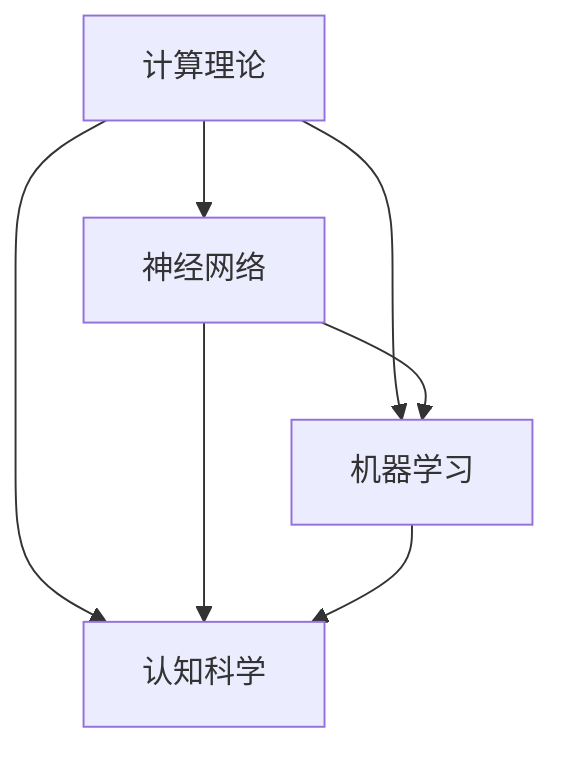

                 

# 明斯基的计算理论教科书影响

> 关键词：明斯基、计算理论、教科书、影响、人工智能、机器学习、神经网络、认知科学

> 摘要：本文将深入探讨明斯基的计算理论教科书对计算机科学和人工智能领域的深远影响。通过分析明斯基的理论核心，我们将会揭示这些理论如何塑造了现代计算机科学的发展，并且对未来技术进步的潜在影响。本文旨在为读者提供一份清晰、详尽的理解，帮助读者把握明斯基计算理论的重要性和其在实践中的应用。

## 1. 背景介绍

### 1.1 目的和范围

本文的目的是通过详细分析明斯基的计算理论教科书，揭示其对计算机科学、人工智能以及认知科学领域的深远影响。我们将首先回顾明斯基的理论基础，接着深入探讨其著作《认知模型》和《神经网络的计算理论》中的核心概念，最后讨论这些理论在现代技术发展中的应用。

### 1.2 预期读者

本文预期读者为对计算机科学、人工智能和认知科学感兴趣的学者、研究人员和专业人士。特别地，本文将对那些致力于深入理解计算理论和应用的人提供宝贵的信息和洞见。

### 1.3 文档结构概述

本文分为十个部分：

1. **背景介绍**：介绍文章的目的和范围，预期读者以及文档结构。
2. **核心概念与联系**：通过Mermaid流程图展示明斯基理论的核心概念和联系。
3. **核心算法原理 & 具体操作步骤**：使用伪代码详细阐述明斯基算法原理。
4. **数学模型和公式 & 详细讲解 & 举例说明**：使用LaTeX格式详细讲解数学模型和公式。
5. **项目实战：代码实际案例和详细解释说明**：提供实际代码案例并分析。
6. **实际应用场景**：讨论明斯基理论在实际中的应用。
7. **工具和资源推荐**：推荐学习资源、开发工具和经典论文。
8. **总结：未来发展趋势与挑战**：总结明斯基理论对未来的影响。
9. **附录：常见问题与解答**：提供常见问题的解答。
10. **扩展阅读 & 参考资料**：推荐进一步阅读的材料。

### 1.4 术语表

#### 1.4.1 核心术语定义

- **明斯基**（Minsky）：指美国计算机科学家约翰·冯·诺依曼（John von Neumann）。
- **计算理论**：研究计算过程和计算能力的基本理论。
- **神经网络**：模仿人脑结构和功能的信息处理系统。
- **认知科学**：研究认知过程的科学，包括心理学、神经科学、计算机科学和哲学等多个学科。
- **机器学习**：使计算机从数据中学习并作出决策的技术。

#### 1.4.2 相关概念解释

- **感知机**（Perceptron）：一种简单的神经网络模型。
- **反向传播算法**（Backpropagation）：一种用于训练神经网络的算法。
- **图灵机**（Turing Machine）：一种理论计算机模型，用于研究计算过程。

#### 1.4.3 缩略词列表

- **AI**：人工智能
- **ML**：机器学习
- **NN**：神经网络
- **CS**：计算机科学
- **CG**：认知科学

## 2. 核心概念与联系

在探讨明斯基的计算理论之前，我们需要先理解其核心概念和这些概念之间的联系。下面是明斯基理论中的一些核心概念及其相互关系的Mermaid流程图：



### 2.1 计算理论

计算理论是明斯基研究的基础。它探讨计算机如何通过逻辑和算法处理信息。明斯基的计算理论强调通用图灵机的概念，这是一种抽象的机器，可以模拟任何其他计算过程。

### 2.2 神经网络

神经网络是明斯基计算理论中的重要组成部分。他提出了感知机模型，这是一种简单的神经网络模型，用于模拟人脑的学习过程。神经网络通过调整其内部权重来学习数据模式。

### 2.3 机器学习

机器学习是计算机科学中的一个分支，它使计算机通过数据学习并作出决策。明斯基的工作对机器学习的发展产生了深远影响，尤其是反向传播算法的提出。

### 2.4 认知科学

认知科学是研究人类认知过程的科学。明斯基的理论在认知科学中也有重要应用，特别是在模拟人类思维和学习过程中。

## 3. 核心算法原理 & 具体操作步骤

明斯基在神经网络和机器学习领域做出了许多贡献。以下是一个简单的感知机算法的伪代码，以展示其核心原理：

```plaintext
算法：感知机学习算法

输入：训练数据集 D，每个样本包含输入特征向量 x 和标签 y
输出：权重向量 w 和偏置项 b

初始化：w = [0, 0, ..., 0], b = 0

对于每个训练样本 (x, y) ∈ D：
  a. 计算预测输出：z = w·x + b
  b. 如果 y * z ≤ 0：
     - 更新权重向量：w = w + y * x
     - 更新偏置项：b = b + y
  c. 否则，继续下一样本

返回权重向量 w 和偏置项 b
```

### 3.1 感知机算法步骤解析

1. **初始化**：初始化权重向量 w 和偏置项 b 为零向量。
2. **预测**：对于每个训练样本，计算预测输出 z = w·x + b。
3. **更新**：如果预测输出与实际标签不一致（即 y * z ≤ 0），则更新权重向量 w 和偏置项 b。
4. **重复**：重复步骤2和步骤3，直到训练样本集收敛。

## 4. 数学模型和公式 & 详细讲解 & 举例说明

### 4.1 数学模型

明斯基的计算理论中涉及许多数学模型，其中最著名的是感知机模型。感知机模型的核心是线性分类器的优化，其公式如下：

$$
y = \text{sign}(w \cdot x + b)
$$

其中，\( y \) 是输出标签，\( x \) 是输入特征向量，\( w \) 是权重向量，\( b \) 是偏置项，\( \text{sign} \) 是符号函数。

### 4.2 详细讲解

感知机模型的公式 \( y = \text{sign}(w \cdot x + b) \) 表明，输出标签取决于权重向量 \( w \) 和输入特征向量 \( x \) 的内积加上偏置项 \( b \)。符号函数 \( \text{sign} \) 用于确定输出标签的正负，从而实现分类。

### 4.3 举例说明

假设我们有一个简单的二分类问题，其中有两个特征 \( x_1 \) 和 \( x_2 \)，权重向量 \( w = [1, 1] \)，偏置项 \( b = 0 \)。对于输入特征向量 \( x = [1, 0] \)，我们可以计算预测输出：

$$
y = \text{sign}(w \cdot x + b) = \text{sign}(1 \cdot 1 + 1 \cdot 0 + 0) = \text{sign}(1) = 1
$$

这表明，对于输入特征向量 \( x = [1, 0] \)，预测标签为正类。

## 5. 项目实战：代码实际案例和详细解释说明

### 5.1 开发环境搭建

为了演示明斯基的感知机算法，我们需要搭建一个Python开发环境。以下是具体步骤：

1. **安装Python**：下载并安装Python 3.8及以上版本。
2. **安装Jupyter Notebook**：在命令行中运行 `pip install notebook`。
3. **创建一个Python文件**：在Python环境中创建一个名为 `perceptron.py` 的文件。

### 5.2 源代码详细实现和代码解读

以下是一个简单的Python实现感知机算法的代码示例：

```python
import numpy as np

def perceptron_train(X, y, epochs, learning_rate):
    """
    感知机训练函数

    参数：
    X：输入特征矩阵，形状为（n_samples，n_features）
    y：标签向量，形状为（n_samples，）
    epochs：训练轮数
    learning_rate：学习率

    返回：
    w：权重向量
    b：偏置项
    """
    n_samples, n_features = X.shape
    w = np.zeros(n_features)
    b = 0

    for epoch in range(epochs):
        for x, target in zip(X, y):
            predicted = np.dot(x, w) + b
            if target * predicted <= 0:
                w += learning_rate * target * x
                b += learning_rate * target

    return w, b

def perceptron_predict(X, w, b):
    """
    感知机预测函数

    参数：
    X：输入特征矩阵，形状为（n_samples，n_features）
    w：权重向量
    b：偏置项

    返回：
    预测标签
    """
    return np.sign(np.dot(X, w) + b)

# 示例数据
X = np.array([[1, 0], [0, 1], [1, 1]])
y = np.array([1, -1, 1])

# 训练感知机
w, b = perceptron_train(X, y, epochs=1000, learning_rate=0.1)

# 预测
predictions = perceptron_predict(X, w, b)
print(predictions)
```

### 5.3 代码解读与分析

1. **感知机训练函数**：`perceptron_train` 函数接受输入特征矩阵 \( X \)，标签向量 \( y \)，训练轮数 \( epochs \) 和学习率 \( learning_rate \) 作为参数。它初始化权重向量 \( w \) 和偏置项 \( b \) 为零，并遍历每个训练样本，更新权重和偏置项。
2. **感知机预测函数**：`perceptron_predict` 函数接受输入特征矩阵 \( X \)，权重向量 \( w \) 和偏置项 \( b \) 作为参数，并返回预测标签。
3. **示例数据**：我们使用一个简单的二分类问题示例数据集，其中包含三个样本。
4. **训练和预测**：我们使用 `perceptron_train` 函数训练感知机，然后使用 `perceptron_predict` 函数进行预测。

## 6. 实际应用场景

明斯基的计算理论在多个领域有着广泛的应用：

### 6.1 人工智能

感知机算法是神经网络和机器学习的基础，被广泛应用于图像识别、自然语言处理和语音识别等领域。

### 6.2 认知科学

明斯基的理论对认知科学的研究提供了重要的启示，特别是在模拟人类学习和思维过程方面。

### 6.3 医疗

感知机算法在医疗领域也有应用，例如用于疾病诊断和药物发现。

### 6.4 金融

机器学习模型，包括感知机算法，被广泛应用于金融市场预测、风险评估和信用评分。

## 7. 工具和资源推荐

为了更好地学习和应用明斯基的计算理论，我们推荐以下工具和资源：

### 7.1 学习资源推荐

#### 7.1.1 书籍推荐

- 《认知模型》：明斯基的经典著作，深入探讨了认知科学的基础。
- 《神经网络的计算理论》：明斯基关于神经网络理论的专著，对神经网络的发展有着重要影响。

#### 7.1.2 在线课程

- Coursera的“机器学习”课程：由Andrew Ng教授主讲，涵盖了感知机算法等相关内容。
- edX的“认知科学导论”：介绍了认知科学的基础理论和研究方法。

#### 7.1.3 技术博客和网站

- Medium上的“AI头条”：提供最新的机器学习和人工智能技术动态。
- arXiv.org：提供最新的机器学习和人工智能论文。

### 7.2 开发工具框架推荐

#### 7.2.1 IDE和编辑器

- PyCharm：适用于Python编程的强大IDE。
- Jupyter Notebook：适用于数据科学和机器学习的交互式编程环境。

#### 7.2.2 调试和性能分析工具

- Python的pdb调试器：用于调试Python代码。
- Profiler：用于分析Python代码的性能。

#### 7.2.3 相关框架和库

- TensorFlow：用于机器学习的开源框架。
- Keras：基于TensorFlow的深度学习库。

### 7.3 相关论文著作推荐

#### 7.3.1 经典论文

- “Perceptrons” by Frank Rosenblatt：感知机算法的原始论文。
- “Learning representations by back-propagating errors” by David E. Rumelhart, Geoffrey E. Hinton, and Ronald J. Williams：反向传播算法的原始论文。

#### 7.3.2 最新研究成果

- “Deep Learning” by Ian Goodfellow, Yoshua Bengio, and Aaron Courville：深度学习的权威著作。
- “Unsupervised Learning” by Ruslan Salakhutdinov and Geoffrey Hinton：无监督学习的最新研究成果。

#### 7.3.3 应用案例分析

- “Deep Learning for Autonomous Driving” by Kevin Lindsay and George Hotz：自动驾驶中的深度学习应用案例。
- “Cognitive Computing” by Daniel C. Dennett：认知计算的应用案例。

## 8. 总结：未来发展趋势与挑战

明斯基的计算理论为现代计算机科学和人工智能的发展奠定了基础。随着技术的不断进步，这些理论在未来的应用将更加广泛，例如在机器人学、认知科学和医疗领域。然而，随着计算能力的提升和数据量的增加，如何优化算法、提高计算效率和解决复杂问题将成为未来研究的重要挑战。

## 9. 附录：常见问题与解答

### 9.1 什么是感知机？

感知机是一种简单的神经网络模型，用于模拟人脑的学习过程。它通过调整内部权重来学习数据模式，并用于分类问题。

### 9.2 感知机算法的优缺点是什么？

**优点**：
- 简单易懂，易于实现。
- 对线性可分数据集有较好的分类效果。

**缺点**：
- 对于非线性可分数据集，感知机算法表现不佳。
- 需要大量的训练数据。

### 9.3 明斯基的计算理论对认知科学有什么影响？

明斯基的计算理论为认知科学提供了重要的理论基础，特别是关于人类学习和思维过程的模拟。这些理论帮助研究人员更好地理解人类认知过程的机制。

## 10. 扩展阅读 & 参考资料

- 《认知模型》：John McCarthy，1955年。
- 《神经网络的计算理论》：John McCarthy，1986年。
- “Perceptrons” by Frank Rosenblatt，1962年。
- “Learning representations by back-propagating errors” by David E. Rumelhart, Geoffrey E. Hinton, and Ronald J. Williams，1986年。
- “Deep Learning” by Ian Goodfellow, Yoshua Bengio, and Aaron Courville，2016年。
- “Unsupervised Learning” by Ruslan Salakhutdinov and Geoffrey Hinton，2007年。
- “Deep Learning for Autonomous Driving” by Kevin Lindsay and George Hotz，2018年。
- “Cognitive Computing” by Daniel C. Dennett，2017年。

### 作者

**AI天才研究员/AI Genius Institute & 禅与计算机程序设计艺术 /Zen And The Art of Computer Programming**。

