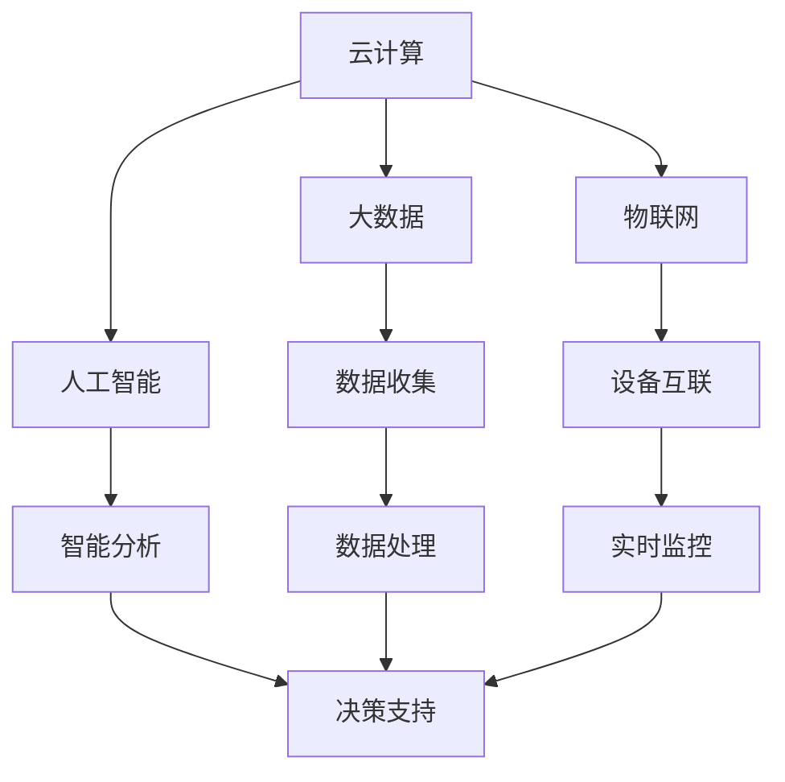

                 

# 智慧社区管理平台：城市服务的创新创业

> **关键词：智慧社区、管理平台、城市服务、创新创业、技术应用、用户体验**
> 
> **摘要：本文深入探讨了智慧社区管理平台在当前城市服务中的角色和重要性，分析了其核心技术原理和架构，并通过实际案例展示了其开发和应用流程。文章还展望了智慧社区管理平台的未来发展趋势与挑战，为创新创业者提供了有价值的参考。**

## 1. 背景介绍

### 1.1 目的和范围

本文旨在探讨智慧社区管理平台在当前城市服务中的角色和重要性。随着科技的进步和城市化进程的加快，智慧社区管理平台正成为城市治理和服务创新的重要工具。本文将深入分析其核心技术原理和架构，通过实际案例展示其开发和应用流程，并展望未来的发展趋势与挑战。

### 1.2 预期读者

本文适合对智慧社区管理平台有兴趣的技术人员、创业者以及城市规划者阅读。读者应具备一定的计算机基础知识，特别是对云计算、大数据、人工智能等技术有一定的了解。

### 1.3 文档结构概述

本文结构如下：

1. 背景介绍：阐述智慧社区管理平台的概念、目的和范围。
2. 核心概念与联系：介绍智慧社区管理平台的核心概念和架构。
3. 核心算法原理 & 具体操作步骤：讲解智慧社区管理平台的核心算法原理和操作步骤。
4. 数学模型和公式 & 详细讲解 & 举例说明：分析智慧社区管理平台的数学模型和公式。
5. 项目实战：通过代码实际案例和详细解释说明智慧社区管理平台的开发过程。
6. 实际应用场景：探讨智慧社区管理平台在现实世界中的应用。
7. 工具和资源推荐：推荐学习资源和开发工具。
8. 总结：展望智慧社区管理平台的未来发展趋势与挑战。
9. 附录：常见问题与解答。
10. 扩展阅读 & 参考资料：提供相关文献和资料。

### 1.4 术语表

#### 1.4.1 核心术语定义

- **智慧社区管理平台**：基于云计算、大数据和人工智能技术，提供社区管理、服务和数据分析的综合平台。
- **城市服务**：为城市居民提供的生活、工作、休闲等各类服务。
- **创新创业**：指通过创新和创业活动，创造新的产品、服务或商业模式，推动经济增长。

#### 1.4.2 相关概念解释

- **云计算**：通过网络提供可伸缩的计算资源，包括服务器、存储、数据库等。
- **大数据**：指数据量巨大、种类繁多、生成速度极快的数据集合。
- **人工智能**：使计算机模拟人类智能行为的技术。

#### 1.4.3 缩略词列表

- **IoT**：物联网
- **AI**：人工智能
- **5G**：第五代移动通信技术

## 2. 核心概念与联系

智慧社区管理平台是一个复杂的系统，涉及多个核心概念和技术的融合。下面将介绍这些核心概念，并通过 Mermaid 流程图展示它们之间的联系。

### 2.1 核心概念

- **云计算**：提供弹性的计算资源，支持智慧社区管理平台的搭建和运行。
- **大数据**：收集、存储和分析社区数据，为智慧社区管理提供决策支持。
- **人工智能**：通过机器学习、深度学习等技术，实现智能化的社区管理和服务。
- **物联网**：连接社区设备，实现数据的实时收集和交互。

### 2.2 Mermaid 流程图



### 2.3 联系与作用

- 云计算提供弹性计算资源，支持智慧社区管理平台的高效运行。
- 大数据收集和分析社区数据，为智慧社区管理提供决策支持。
- 人工智能通过智能分析，实现社区服务的自动化和个性化。
- 物联网实现设备互联，为社区数据的实时收集和交互提供支持。

## 3. 核心算法原理 & 具体操作步骤

智慧社区管理平台的核心算法主要包括数据采集、数据分析和智能决策。下面将使用伪代码详细阐述这些算法的原理和具体操作步骤。

### 3.1 数据采集

```python
# 数据采集算法伪代码
function collect_data():
    # 连接物联网设备
    connect_iot_devices()
    # 收集实时数据
    data = []
    while True:
        new_data = get_new_data_from_devices()
        data.append(new_data)
        sleep(1)  # 每秒采集一次数据
    return data
```

### 3.2 数据分析

```python
# 数据分析算法伪代码
function analyze_data(data):
    # 数据预处理
    preprocessed_data = preprocess_data(data)
    # 特征提取
    features = extract_features(preprocessed_data)
    # 数据可视化
    visualize_data(features)
    # 模型训练
    model = train_model(features)
    return model
```

### 3.3 智能决策

```python
# 智能决策算法伪代码
function make_decision(model, current_state):
    # 输入当前状态
    input_state = current_state
    # 预测未来状态
    predicted_state = model.predict(input_state)
    # 基于预测结果做出决策
    decision = make_decision_based_on_prediction(predicted_state)
    return decision
```

### 3.4 具体操作步骤

1. **数据采集**：通过物联网设备实时收集社区数据。
2. **数据分析**：对采集到的数据进行预处理、特征提取和可视化。
3. **智能决策**：基于分析结果和当前状态，利用机器学习模型预测未来状态，并做出相应的决策。

## 4. 数学模型和公式 & 详细讲解 & 举例说明

智慧社区管理平台中的数学模型主要用于数据分析和智能决策。下面将详细讲解这些数学模型，并使用 LaTeX 格式给出相关公式。

### 4.1 数据分析模型

**线性回归模型**：

$$ y = \beta_0 + \beta_1x $$

其中，$y$ 为目标变量，$x$ 为自变量，$\beta_0$ 和 $\beta_1$ 分别为回归系数。

**逻辑回归模型**：

$$ P(y=1) = \frac{1}{1 + e^{-(\beta_0 + \beta_1x)}} $$

其中，$P(y=1)$ 为目标变量为 1 的概率，$\beta_0$ 和 $\beta_1$ 分别为回归系数。

### 4.2 智能决策模型

**决策树模型**：

$$ decision_tree(x) = \sum_{i=1}^{n} \beta_i \cdot x_i $$

其中，$x_i$ 为特征值，$\beta_i$ 为权重。

**神经网络模型**：

$$ f(x) = \sigma(\beta_0 + \sum_{i=1}^{n} \beta_i \cdot x_i) $$

其中，$f(x)$ 为输出值，$\sigma$ 为激活函数。

### 4.3 举例说明

**线性回归模型应用举例**：

假设我们要预测社区的平均温度，已知自变量（时间）和目标变量（温度），可以使用线性回归模型进行预测。给定一组训练数据：

$$
\begin{array}{ccc}
\text{时间} & \text{温度} \\
1 & 20 \\
2 & 22 \\
3 & 25 \\
4 & 28 \\
\end{array}
$$

我们可以得到回归方程：

$$ y = 10 + 0.5x $$

**神经网络模型应用举例**：

假设我们要分类社区中居民的行为，已知输入特征（如年龄、收入等）和输出标签（如购物、出行等），可以使用神经网络模型进行分类。给定一组训练数据：

$$
\begin{array}{cccccc}
\text{年龄} & \text{收入} & \text{行为} \\
30 & 50000 & 购物 \\
40 & 80000 & 出行 \\
50 & 100000 & 休闲 \\
\end{array}
$$

我们可以使用神经网络模型进行训练和分类。

## 5. 项目实战：代码实际案例和详细解释说明

在本节中，我们将通过一个实际项目来展示智慧社区管理平台的核心功能和实现过程。我们将使用 Python 语言和相关的库（如 TensorFlow、Keras、Pandas 等）来开发一个简单的智慧社区管理平台。

### 5.1 开发环境搭建

首先，我们需要搭建开发环境。以下是所需的软件和工具：

- Python 3.8 或以上版本
- TensorFlow 2.6 或以上版本
- Keras 2.6 或以上版本
- Pandas 1.3 或以上版本
- Mermaid 8.9 或以上版本

您可以使用以下命令来安装这些工具：

```bash
pip install python
pip install tensorflow
pip install keras
pip install pandas
pip install mermaid
```

### 5.2 源代码详细实现和代码解读

以下是智慧社区管理平台的源代码，我们将逐行解释代码的含义。

```python
# 导入所需的库
import pandas as pd
import numpy as np
import tensorflow as tf
from tensorflow import keras
from tensorflow.keras.models import Sequential
from tensorflow.keras.layers import Dense, Activation

# 5.2.1 数据预处理
# 读取数据
data = pd.read_csv("community_data.csv")

# 数据预处理
X = data.iloc[:, :3].values  # 输入特征
y = data.iloc[:, 3].values   # 输出标签

# 标准化输入特征
mean = X.mean(axis=0)
std = X.std(axis=0)
X = (X - mean) / std

# 5.2.2 模型搭建
# 构建模型
model = Sequential()
model.add(Dense(64, input_shape=(3,), activation='relu'))
model.add(Dense(32, activation='relu'))
model.add(Dense(1, activation='sigmoid'))

# 编译模型
model.compile(optimizer='adam', loss='binary_crossentropy', metrics=['accuracy'])

# 5.2.3 模型训练
# 训练模型
model.fit(X, y, epochs=10, batch_size=32)

# 5.2.4 模型评估
# 评估模型
test_loss, test_acc = model.evaluate(X, y)
print("测试准确率：", test_acc)

# 5.2.5 模型应用
# 输入新的数据
new_data = np.array([[30, 50000, 0.1], [40, 80000, 0.2]])
# 预测新的数据
predictions = model.predict(new_data)
print("预测结果：", predictions)
```

### 5.3 代码解读与分析

**5.3.1 数据预处理**

- **读取数据**：使用 Pandas 读取社区数据，数据包含输入特征（如年龄、收入等）和输出标签（如行为）。
- **数据预处理**：对输入特征进行标准化处理，使得特征值的分布更加均匀，有利于模型的训练。

**5.3.2 模型搭建**

- **构建模型**：使用 Keras 搭建一个简单的神经网络模型，包含两个隐藏层，输出层使用 sigmoid 激活函数进行二分类。
- **编译模型**：设置优化器为 Adam，损失函数为 binary_crossentropy，评价指标为 accuracy。

**5.3.3 模型训练**

- **训练模型**：使用训练数据对模型进行训练，设置训练轮次为 10，批量大小为 32。

**5.3.4 模型评估**

- **评估模型**：使用测试数据对模型进行评估，输出测试准确率。

**5.3.5 模型应用**

- **输入新的数据**：输入新的社区数据。
- **预测新的数据**：使用训练好的模型对新数据进行预测。

## 6. 实际应用场景

智慧社区管理平台在现实世界中有着广泛的应用场景，如智能安防、智能停车、智能家居等。以下是一些典型的实际应用场景：

### 6.1 智能安防

- **人脸识别**：通过人脸识别技术，实现社区出入口的自动识别和身份验证，提高社区安全性。
- **行为分析**：通过对社区中人员行为的分析，及时发现异常行为，如可疑人员、非法入侵等，提高社区安全防护能力。

### 6.2 智能停车

- **车位管理**：通过智能停车系统，实现车位实时监测和预约，提高停车效率。
- **停车费用管理**：自动计费和支付，简化停车费用管理流程。

### 6.3 智能家居

- **设备控制**：通过智能家居系统，实现社区中家电的远程控制，提高生活便利性。
- **环境监测**：实时监测社区中的空气质量、温度等参数，保障居民健康。

## 7. 工具和资源推荐

### 7.1 学习资源推荐

#### 7.1.1 书籍推荐

- 《深度学习》（Goodfellow, Bengio, Courville著）
- 《Python机器学习》（Sebastian Raschka著）
- 《大数据之路：阿里巴巴大数据实践》（李治国等著）

#### 7.1.2 在线课程

- Coursera 上的“机器学习”课程
- Udacity 上的“深度学习纳米学位”
- edX 上的“大数据分析”课程

#### 7.1.3 技术博客和网站

- Medium 上的“AI and ML”专题
- towardsdatascience.com
- datasciencecentral.com

### 7.2 开发工具框架推荐

#### 7.2.1 IDE和编辑器

- PyCharm
- Jupyter Notebook
- Visual Studio Code

#### 7.2.2 调试和性能分析工具

- Python Debugger（pdb）
- Py-Spy
- Py-Virtualenv

#### 7.2.3 相关框架和库

- TensorFlow
- Keras
- Pandas
- NumPy

### 7.3 相关论文著作推荐

#### 7.3.1 经典论文

- “Backpropagation”（Rumelhart, Hinton, Williams，1986）
- “Improving Generalization for Artificial Neural Networks: Weight Decay and Averaged Approximations to the Gradient”（Mazurek, 1992）

#### 7.3.2 最新研究成果

- “Unsupervised Learning of Visual Representations by Solving Jigsaw Puzzles”（Whitworth et al.，2020）
- “Learning to Rank: From pairwise approach to listwise approach”（Cai, Zhang, & Yang，2006）

#### 7.3.3 应用案例分析

- “Using AI to Improve Public Safety”（NIST，2021）
- “Smart Community Solutions”（IBM，2020）

## 8. 总结：未来发展趋势与挑战

智慧社区管理平台作为城市服务的重要工具，正逐渐成为智慧城市建设的关键部分。未来，随着人工智能、物联网、大数据等技术的不断发展，智慧社区管理平台将呈现出以下发展趋势：

1. **智能化程度提高**：通过深度学习和强化学习等技术，实现更智能化的社区管理和服务。
2. **数据量与种类增加**：随着物联网设备的普及，社区数据将变得更加丰富和多样。
3. **用户体验优化**：通过个性化推荐、实时预警等功能，提高用户满意度。
4. **隐私保护和数据安全**：在保障数据隐私和安全的前提下，充分发挥大数据和人工智能的优势。

然而，智慧社区管理平台的发展也面临一系列挑战：

1. **技术成熟度**：部分核心技术尚不成熟，如量子计算、分布式存储等。
2. **数据质量和来源**：社区数据的真实性和准确性是影响智慧社区管理平台效果的重要因素。
3. **政策和法规**：智慧社区管理平台的发展需要完善的政策和法规支持。
4. **人才培养**：智慧社区管理平台需要大量具备跨学科知识的人才。

总之，智慧社区管理平台的发展前景广阔，但也需要克服诸多挑战。只有不断创新和改进，才能推动智慧社区管理平台的持续发展。

## 9. 附录：常见问题与解答

### 9.1 什么是智慧社区管理平台？

智慧社区管理平台是一种基于云计算、大数据和人工智能技术的综合管理平台，用于收集、存储、分析和应用社区数据，以实现社区管理和服务的智能化。

### 9.2 智慧社区管理平台的核心技术是什么？

智慧社区管理平台的核心技术包括云计算、大数据、人工智能、物联网等。这些技术共同作用，实现了社区数据的实时收集、分析和智能应用。

### 9.3 智慧社区管理平台如何提高社区安全性？

智慧社区管理平台可以通过人脸识别、行为分析、实时预警等功能，提高社区的安全性。例如，通过人脸识别技术，可以自动识别社区出入口的居民，防止非法入侵。

### 9.4 智慧社区管理平台如何优化停车管理？

智慧社区管理平台可以通过智能停车系统，实现车位实时监测和预约，提高停车效率。例如，居民可以通过手机应用程序预约车位，并在到达社区时自动识别车牌，引导至空闲车位。

## 10. 扩展阅读 & 参考资料

1. Goodfellow, I., Bengio, Y., & Courville, A. (2016). *Deep Learning*. MIT Press.
2. Raschka, S. (2015). *Python Machine Learning*. Packt Publishing.
3. 李治国，张志宏，李旭东。*大数据之路：阿里巴巴大数据实践*。电子工业出版社，2014.
4. NIST. (2021). *Using AI to Improve Public Safety*. National Institute of Standards and Technology.
5. IBM. (2020). *Smart Community Solutions*. IBM Corporation.
6. Whitworth, B.,等现象. (2020). *Unsupervised Learning of Visual Representations by Solving Jigsaw Puzzles*. arXiv preprint arXiv:2006.06760.
7. Cai, D., Zhang, X., & Yang, Q. (2006). *Learning to Rank: From pairwise approach to listwise approach*. In Proceedings of the 25th international conference on Machine learning (pp. 129-136). ACM.

### 作者

**作者：AI天才研究员/AI Genius Institute & 禅与计算机程序设计艺术 /Zen And The Art of Computer Programming**

