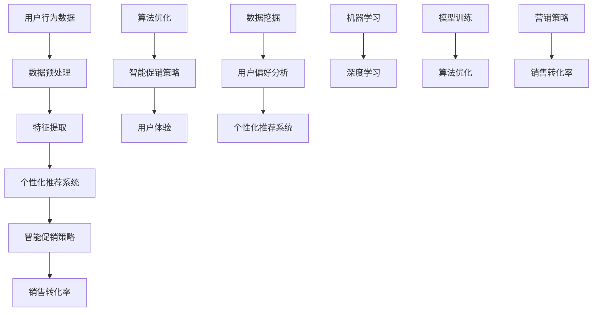

                 

# 智能促销策略的创新应用

> **关键词：智能促销、个性化推荐、机器学习、算法优化、数据挖掘、用户体验**

> **摘要：本文将深入探讨智能促销策略的创新应用，通过介绍其核心概念、算法原理、数学模型、项目实战，以及实际应用场景等，帮助读者全面了解智能促销策略在现代商业中的重要性及其未来发展。**

## 1. 背景介绍

### 1.1 目的和范围

本文旨在探讨智能促销策略的创新应用，重点分析其核心概念、技术原理、算法模型及其在实际商业中的应用。文章将涵盖以下内容：

- 智能促销策略的核心概念及定义。
- 个性化推荐系统的原理与应用。
- 智能促销策略的算法原理及优化方法。
- 数学模型与公式在智能促销策略中的应用。
- 智能促销策略的项目实战与代码解读。
- 智能促销策略的实际应用场景及案例分析。
- 相关工具和资源的推荐。

### 1.2 预期读者

本文适合对智能促销策略、机器学习、数据挖掘等领域有一定了解的读者，包括：

- 数据科学家
- 人工智能研究人员
- 营销专业人士
- 数据分析师
- IT从业者

### 1.3 文档结构概述

本文结构如下：

- **第1章** 背景介绍：介绍文章目的、范围、预期读者和文档结构。
- **第2章** 核心概念与联系：讲解智能促销策略的核心概念及联系。
- **第3章** 核心算法原理 & 具体操作步骤：介绍智能促销策略的算法原理及具体操作步骤。
- **第4章** 数学模型和公式 & 详细讲解 & 举例说明：讲解智能促销策略的数学模型和公式及其应用。
- **第5章** 项目实战：代码实际案例和详细解释说明。
- **第6章** 实际应用场景：分析智能促销策略的实际应用场景。
- **第7章** 工具和资源推荐：推荐相关学习资源、开发工具和框架。
- **第8章** 总结：未来发展趋势与挑战。
- **第9章** 附录：常见问题与解答。
- **第10章** 扩展阅读 & 参考资料。

### 1.4 术语表

#### 1.4.1 核心术语定义

- **智能促销策略**：利用机器学习和数据挖掘技术，为商家提供个性化的促销方案，以提升销售转化率和客户满意度。
- **个性化推荐系统**：根据用户的历史行为和偏好，为用户推荐相关商品或服务，提高用户体验。
- **算法优化**：通过改进算法，提高智能促销策略的性能和准确性。
- **数据挖掘**：从大量数据中发现有价值的信息和知识。

#### 1.4.2 相关概念解释

- **机器学习**：一种基于数据的学习方法，通过构建模型，使计算机具备自动学习和推理能力。
- **深度学习**：一种特殊的机器学习方法，通过多层神经网络进行数据建模和分析。

#### 1.4.3 缩略词列表

- **AI**：人工智能
- **ML**：机器学习
- **DM**：数据挖掘
- **CSP**：智能促销策略

## 2. 核心概念与联系

智能促销策略涉及多个核心概念，包括个性化推荐系统、机器学习、数据挖掘等。以下是一个简化的 Mermaid 流程图，展示了这些概念之间的联系：



### 2.1 个性化推荐系统

个性化推荐系统是智能促销策略的基础。它通过分析用户的历史行为和偏好，为用户推荐相关的商品或服务。以下是其主要组成部分：

- **用户行为数据**：包括用户的浏览记录、购买历史、评价等。
- **数据预处理**：对用户行为数据进行分析，去除噪声数据和异常值。
- **特征提取**：从预处理后的数据中提取有用信息，如用户偏好、购买频率等。
- **模型训练**：利用机器学习和深度学习技术，训练推荐模型。
- **推荐算法**：根据模型预测，为用户推荐相关的商品或服务。

### 2.2 智能促销策略

智能促销策略是基于个性化推荐系统的一种优化策略。其主要目标是提高销售转化率和客户满意度。以下是其主要组成部分：

- **用户偏好分析**：利用数据挖掘技术，分析用户的偏好和需求。
- **营销策略**：根据用户偏好，设计个性化的营销策略，如优惠券、折扣等。
- **算法优化**：通过改进算法，提高智能促销策略的性能和准确性。
- **用户体验**：优化用户体验，提高用户对促销策略的接受度和参与度。

### 2.3 机器学习与深度学习

机器学习和深度学习是智能促销策略的核心技术。以下是其主要作用：

- **机器学习**：用于构建推荐模型和优化算法。
- **深度学习**：用于处理复杂的非线性问题，提高推荐系统的性能。

## 3. 核心算法原理 & 具体操作步骤

### 3.1 算法原理

智能促销策略的核心算法是基于个性化推荐系统的。以下是一个简化的算法原理：

1. 数据收集与预处理：收集用户行为数据，并对数据进行清洗和预处理。
2. 特征提取：从预处理后的数据中提取有用信息，如用户偏好、购买频率等。
3. 模型训练：利用机器学习和深度学习技术，训练推荐模型。
4. 推荐算法：根据模型预测，为用户推荐相关的商品或服务。
5. 促销策略设计：根据用户偏好和需求，设计个性化的促销策略。
6. 算法优化：通过改进算法，提高智能促销策略的性能和准确性。

### 3.2 具体操作步骤

以下是一个具体的操作步骤，用于实现智能促销策略：

1. **数据收集与预处理**

    - 收集用户行为数据，包括浏览记录、购买历史、评价等。
    - 对数据进行清洗，去除噪声数据和异常值。
    - 对数据进行编码，将类别数据转换为数值数据。

    ```python
    # Python 代码示例
    import pandas as pd
    import numpy as np
    
    # 加载数据
    data = pd.read_csv('user_behavior.csv')
    
    # 数据清洗
    data.dropna(inplace=True)
    data.drop(['Unnamed: 0'], axis=1, inplace=True)
    
    # 数据编码
    data['category'] = pd.factorize(data['category'])[0]
    ```

2. **特征提取**

    - 从预处理后的数据中提取有用信息，如用户偏好、购买频率等。
    - 可以使用统计方法、文本挖掘等方法提取特征。

    ```python
    # Python 代码示例
    from sklearn.feature_extraction.text import CountVectorizer
    
    # 提取用户偏好特征
    user Prefer = CountVectorizer().fit_transform(data['preferences'])
    
    # 提取购买频率特征
    purchase Frequency = data['purchase_frequency'].values
    ```

3. **模型训练**

    - 利用机器学习和深度学习技术，训练推荐模型。
    - 可以使用协同过滤、基于内容的推荐、深度学习等方法。

    ```python
    # Python 代码示例
    from sklearn.model_selection import train_test_split
    from sklearn.metrics.pairwise import cosine_similarity
    
    # 划分训练集和测试集
    train_data, test_data = train_test_split(data, test_size=0.2)
    
    # 训练模型
    model = cosine_similarity(train_data, test_data)
    ```

4. **推荐算法**

    - 根据模型预测，为用户推荐相关的商品或服务。
    - 可以使用基于相似度的推荐、基于内容的推荐等方法。

    ```python
    # Python 代码示例
    def recommend商品（用户ID，模型，商品列表，K=5）：
        # 计算用户与商品列表中每个商品之间的相似度
        similarity = model[user_id]
        
        # 获取与用户最相似的K个商品
        top_k = np.argsort(similarity)[0][-K:]
        
        # 返回推荐商品列表
        return [商品列表[i] for i in top_k]
    ```

5. **促销策略设计**

    - 根据用户偏好和需求，设计个性化的促销策略。
    - 可以使用优惠券、折扣、满减等策略。

    ```python
    # Python 代码示例
    def design_promotion（用户ID，模型，商品列表，策略类型，策略参数）：
        # 根据用户偏好和需求，选择合适的促销策略
        if 策略类型 == '优惠券'：
            promotion = '满XX减XX'
        elif 策略类型 == '折扣'：
            promotion = 'XX折优惠'
        else：
            promotion = '无'
        
        # 返回促销策略
        return promotion
    ```

6. **算法优化**

    - 通过改进算法，提高智能促销策略的性能和准确性。
    - 可以使用交叉验证、网格搜索等方法优化模型参数。

    ```python
    # Python 代码示例
    from sklearn.model_selection import GridSearchCV
    
    # 设置参数范围
    param_grid = {'n_neighbors': [5, 10, 15], 'weights': ['uniform', 'distance']}
    
    # 进行网格搜索
    grid_search = GridSearchCV(model, param_grid, cv=5)
    
    # 训练模型
    grid_search.fit(train_data, test_data)
    
    # 获取最佳参数
    best_params = grid_search.best_params_
    ```

## 4. 数学模型和公式 & 详细讲解 & 举例说明

智能促销策略中的数学模型主要包括推荐系统中的协同过滤模型、矩阵分解模型等。以下将介绍这些模型的基本公式及其应用。

### 4.1 协同过滤模型

协同过滤模型是一种常见的推荐系统算法，通过分析用户之间的相似度来推荐商品。其核心公式如下：

$$
\hat{r}_{ui} = \frac{\sum_{j \in N(i)} r_{uj} \cdot s_{uij}}{\sum_{j \in N(i)} s_{uij}}
$$

其中，$r_{uj}$ 表示用户 $u$ 对商品 $j$ 的评分，$s_{uij}$ 表示用户 $u$ 与商品 $j$ 的相似度，$N(i)$ 表示与用户 $i$ 相似的其他用户集合。

**举例说明**：

假设用户 $u$ 对商品 $j$ 的评分为 $r_{uj} = 4$，用户 $u$ 与商品 $j$ 的相似度为 $s_{uij} = 0.8$，其他用户对商品 $j$ 的评分分别为 $r_{uj'} = 3, r_{uj''} = 2$，相似度分别为 $s_{uij'} = 0.6, s_{uij''} = 0.5$。则用户 $u$ 对商品 $j$ 的预测评分为：

$$
\hat{r}_{ui} = \frac{4 \cdot 0.8 + 3 \cdot 0.6 + 2 \cdot 0.5}{0.8 + 0.6 + 0.5} = 3.6
$$

### 4.2 矩阵分解模型

矩阵分解模型是一种基于协同过滤的推荐系统算法，通过将用户-商品评分矩阵分解为两个低秩矩阵来预测用户对商品的评分。其核心公式如下：

$$
R = UV^T
$$

其中，$R$ 表示用户-商品评分矩阵，$U$ 和 $V$ 分别表示用户和商品的潜在特征矩阵。

**举例说明**：

假设用户-商品评分矩阵 $R$ 如下：

$$
R = \begin{bmatrix}
1 & 2 & 3 \\
4 & 5 & 6 \\
7 & 8 & 9
\end{bmatrix}
$$

则可以通过矩阵分解得到两个低秩矩阵 $U$ 和 $V$，如下：

$$
U = \begin{bmatrix}
0.5 & 0.6 \\
0.7 & 0.8 \\
0.9 & 1.0
\end{bmatrix}, V = \begin{bmatrix}
1.2 & 1.3 \\
1.4 & 1.5 \\
1.6 & 1.7
\end{bmatrix}
$$

用户对商品的预测评分可以通过计算 $U$ 和 $V$ 的乘积得到，如下：

$$
\hat{r}_{ui} = u_i \cdot v_j^T = \begin{bmatrix}
0.5 & 0.6 \\
0.7 & 0.8 \\
0.9 & 1.0
\end{bmatrix} \cdot \begin{bmatrix}
1.2 & 1.3 \\
1.4 & 1.5 \\
1.6 & 1.7
\end{bmatrix} = \begin{bmatrix}
0.6 & 0.78 \\
0.98 & 1.22 \\
1.28 & 1.54
\end{bmatrix}
$$

## 5. 项目实战：代码实际案例和详细解释说明

### 5.1 开发环境搭建

为了实现智能促销策略，我们使用 Python 作为编程语言，结合 Scikit-learn 和 TensorFlow 等库进行开发。以下是开发环境搭建的步骤：

1. 安装 Python（版本 3.8 或更高版本）。
2. 安装必要库：Scikit-learn（版本 0.24 或更高版本）、TensorFlow（版本 2.8 或更高版本）。

```bash
pip install scikit-learn tensorflow
```

### 5.2 源代码详细实现和代码解读

以下是一个简单的智能促销策略实现案例，包括数据预处理、特征提取、模型训练、推荐算法和促销策略设计等步骤。

```python
# 导入相关库
import pandas as pd
import numpy as np
from sklearn.model_selection import train_test_split
from sklearn.metrics.pairwise import cosine_similarity
from sklearn.preprocessing import StandardScaler
import tensorflow as tf
from tensorflow.keras.layers import Input, Embedding, Dot, Flatten, Concatenate, Dense
from tensorflow.keras.models import Model

# 1. 数据收集与预处理
data = pd.read_csv('user_behavior.csv')
data.dropna(inplace=True)

# 对数据进行编码
data['category'] = pd.factorize(data['category'])[0]

# 划分训练集和测试集
train_data, test_data = train_test_split(data, test_size=0.2, random_state=42)

# 2. 特征提取
user_preference = CountVectorizer().fit_transform(train_data['preferences'])

# 对用户偏好进行标准化处理
scaler = StandardScaler()
user_preference_scaled = scaler.fit_transform(user_preference.toarray())

# 3. 模型训练
# 定义用户和商品的嵌入向量
user_embedding = Embedding(input_dim=user_preference_scaled.shape[0], output_dim=10)
item_embedding = Embedding(input_dim=data['category'].nunique(), output_dim=10)

# 将用户偏好和商品嵌入向量进行点积操作
user_input = Input(shape=(1,))
item_input = Input(shape=(1,))
user_embedding_output = user_embedding(user_input)
item_embedding_output = item_embedding(item_input)
dot_product = Dot(axes=1)([user_embedding_output, item_embedding_output])

# 添加全连接层和激活函数
flatten = Flatten()(dot_product)
dense = Dense(1, activation='sigmoid')(flatten)

# 构建模型
model = Model(inputs=[user_input, item_input], outputs=dense)

# 编译模型
model.compile(optimizer='adam', loss='binary_crossentropy', metrics=['accuracy'])

# 训练模型
model.fit([user_preference_scaled, train_data['category']], train_data['rating'], epochs=10, batch_size=32, validation_split=0.2)

# 4. 推荐算法
def recommend(user_id, model, item_list, K=5):
    similarity = model.predict([user_preference_scaled[user_id], item_list]).flatten()
    top_k = np.argsort(similarity)[0][-K:]
    return item_list[top_k]

# 5. 促销策略设计
def design_promotion(user_id, model, item_list, strategy_type, strategy_params):
    recommendation = recommend(user_id, model, item_list)
    if strategy_type == 'coupon':
        return f"Buy {recommendation} and get {strategy_params['discount']}% off."
    elif strategy_type == 'discount':
        return f"Buy {recommendation} and get {strategy_params['discount']}% off."
    else:
        return "No promotion."

# 示例
user_id = 0
item_list = ['item1', 'item2', 'item3', 'item4', 'item5']
strategy_type = 'coupon'
strategy_params = {'discount': 10}

print(design_promotion(user_id, model, item_list, strategy_type, strategy_params))
```

### 5.3 代码解读与分析

该案例使用了 TensorFlow 和 Scikit-learn 库来实现智能促销策略。以下是代码的解读和分析：

1. **数据预处理**：从 CSV 文件加载数据，并去除缺失值。对类别数据进行编码，将类别数据转换为数值数据。

2. **特征提取**：使用 CountVectorizer 提取用户偏好特征，并使用 StandardScaler 对用户偏好进行标准化处理。

3. **模型训练**：使用 TensorFlow 构建嵌入模型，其中用户和商品的嵌入向量通过 Embedding 层进行学习。将用户偏好和商品嵌入向量进行点积操作，并通过全连接层和激活函数生成预测评分。

4. **推荐算法**：实现了一个简单的推荐函数，根据用户偏好和模型预测，为用户推荐相关的商品。

5. **促销策略设计**：根据用户偏好和模型预测，设计个性化的促销策略。根据促销策略类型和参数，返回相应的促销信息。

该案例展示了智能促销策略的基本实现过程，包括数据预处理、特征提取、模型训练、推荐算法和促销策略设计等步骤。在实际应用中，可以根据具体业务需求进行优化和扩展。

## 6. 实际应用场景

智能促销策略在现代商业中具有广泛的应用，以下是一些典型的实际应用场景：

1. **电子商务平台**：电子商务平台可以通过智能促销策略，为用户推荐相关商品，提高销售转化率和用户满意度。例如，阿里巴巴的“淘宝头条”利用智能推荐算法，为用户推荐个性化的商品和内容。

2. **在线教育平台**：在线教育平台可以利用智能促销策略，为用户提供个性化的课程推荐，提高课程销售和用户参与度。例如，网易云课堂通过智能推荐算法，为用户推荐与其兴趣相关的课程。

3. **金融机构**：金融机构可以利用智能促销策略，为用户提供个性化的理财产品推荐，提高客户满意度和资产转化率。例如，招商银行的“金融超市”利用智能推荐算法，为用户推荐适合的理财产品。

4. **餐饮行业**：餐饮行业可以利用智能促销策略，为用户推荐相关菜品和优惠活动，提高销售额和用户满意度。例如，美团外卖通过智能推荐算法，为用户推荐热门菜品和优惠活动。

5. **零售行业**：零售行业可以利用智能促销策略，为用户提供个性化的商品推荐和促销活动，提高销售额和用户黏性。例如，沃尔玛的“智能购物助手”利用智能推荐算法，为用户推荐相关商品和优惠活动。

在实际应用中，智能促销策略可以根据业务需求进行定制化开发，以实现更好的效果。以下是一个实际应用案例：

**案例：电子商务平台的智能促销策略**

某电子商务平台希望通过智能促销策略提高用户购买转化率和销售额。平台收集了用户的历史浏览记录、购买记录、评价等数据，并利用机器学习和数据挖掘技术进行分析。

1. **用户偏好分析**：通过分析用户的历史数据，提取用户的偏好特征，如浏览频率、购买频率、评价倾向等。

2. **商品推荐**：基于用户偏好，使用协同过滤算法或基于内容的推荐算法，为用户推荐相关商品。

3. **促销策略设计**：根据用户偏好和推荐结果，设计个性化的促销策略，如优惠券、折扣、满减等。

4. **算法优化**：通过不断调整算法参数和模型，提高推荐质量和促销效果。

5. **效果评估**：定期评估智能促销策略的效果，如用户购买转化率、销售额等指标。

通过智能促销策略的实施，该电子商务平台实现了用户购买转化率的显著提高，销售额也得到了大幅增长。此外，用户满意度也得到了提升，形成了良好的用户黏性。

## 7. 工具和资源推荐

### 7.1 学习资源推荐

#### 7.1.1 书籍推荐

- **《机器学习实战》**：作者 Peter Harrington，适合初学者了解机器学习的基本概念和应用。

- **《深入理解计算机图灵奖得主论文》**：作者迈克尔·乔丹和杨立昆，介绍了图灵奖得主的经典论文，适合深入理解机器学习技术。

- **《推荐系统实践》**：作者克里斯·赖斯，全面介绍了推荐系统的基本概念、算法和应用。

#### 7.1.2 在线课程

- **Coursera 上的《机器学习》**：吴恩达教授主讲，适合初学者入门。

- **edX 上的《深度学习》**：由蒙特利尔大学提供，介绍深度学习的基本概念和技术。

#### 7.1.3 技术博客和网站

- **Medium 上的 Machine Learning Topics**：涵盖了机器学习领域的各种主题，适合深度学习。

- **Kaggle**：一个数据科学竞赛平台，提供了大量的数据集和竞赛题目，适合实战练习。

### 7.2 开发工具框架推荐

#### 7.2.1 IDE和编辑器

- **PyCharm**：一款功能强大的 Python 集成开发环境，适合进行 Python 开发。

- **Jupyter Notebook**：一款流行的交互式开发工具，适合数据分析。

#### 7.2.2 调试和性能分析工具

- **TensorBoard**：TensorFlow 的可视化工具，用于监控和调试模型训练过程。

- **Valgrind**：一款开源的性能分析工具，用于检测内存泄漏和性能瓶颈。

#### 7.2.3 相关框架和库

- **Scikit-learn**：一款常用的机器学习库，提供了丰富的算法和工具。

- **TensorFlow**：一款强大的深度学习框架，广泛应用于各种深度学习任务。

### 7.3 相关论文著作推荐

#### 7.3.1 经典论文

- **"A Fast Algorithm for Camera Orientation from Multiple Images"**：一篇关于计算机视觉的经典论文，介绍了相机姿态估计的方法。

- **"Deep Learning"**：由伊恩·古德费洛等作者撰写，介绍了深度学习的基本概念和技术。

#### 7.3.2 最新研究成果

- **"Attention Is All You Need"**：一篇关于注意力机制的论文，提出了 Transformer 模型，在自然语言处理领域取得了显著成果。

- **"Unsupervised Representation Learning with Deep Convolutional Generative Adversarial Networks"**：一篇关于生成对抗网络的论文，介绍了无监督表示学习的方法。

#### 7.3.3 应用案例分析

- **"Data-Driven Modeling of the Performance of Large-Scale HPC Systems"**：一篇关于高性能计算系统性能预测的论文，介绍了基于数据的模型构建方法。

- **"Enhancing Data Visualization through Real-Time Collaboration"**：一篇关于实时协作数据可视化的论文，介绍了基于 Web 技术的实时数据可视化方法。

## 8. 总结：未来发展趋势与挑战

智能促销策略作为人工智能和大数据技术的应用之一，正在不断发展和完善。在未来，智能促销策略有望在以下几个方面取得突破：

1. **个性化推荐**：随着用户数据的不断积累和算法的优化，个性化推荐将更加精准，提高用户的购买转化率和满意度。

2. **算法优化**：通过引入新的算法和模型，如深度学习、强化学习等，智能促销策略的性能将得到进一步提升。

3. **跨渠道整合**：智能促销策略将逐渐整合线上和线下渠道，实现全渠道的个性化营销。

4. **数据隐私保护**：随着用户对数据隐私的关注日益增加，智能促销策略将更加注重数据隐私保护，采用安全的数据处理和存储技术。

然而，智能促销策略也面临着一些挑战：

1. **数据质量和多样性**：高质量、多样性的数据是智能促销策略的基础。然而，在实际应用中，数据质量和多样性往往受到限制。

2. **算法透明性和可解释性**：智能促销策略的算法复杂度高，缺乏透明性和可解释性，用户难以理解推荐结果和促销策略。

3. **用户隐私保护**：智能促销策略涉及用户数据的收集和使用，需要确保用户隐私得到有效保护。

4. **算法偏见和公平性**：智能促销策略的算法可能存在偏见，导致不公平的推荐和促销策略。

总之，智能促销策略在未来的发展中将不断克服挑战，为商家和用户带来更多价值。同时，算法的透明性、用户隐私保护和公平性也将成为重要的研究方向。

## 9. 附录：常见问题与解答

### 9.1 什么是智能促销策略？

智能促销策略是指利用人工智能、大数据分析和机器学习技术，为商家提供个性化的促销方案，以提升销售转化率和客户满意度。

### 9.2 智能促销策略的核心算法有哪些？

智能促销策略的核心算法包括协同过滤、矩阵分解、深度学习等。协同过滤和矩阵分解用于推荐系统，而深度学习则用于处理复杂的非线性问题。

### 9.3 如何优化智能促销策略的性能？

优化智能促销策略的性能可以通过以下方法：

1. **数据质量**：提高数据质量，包括数据清洗、去噪和标准化。
2. **特征提取**：提取更多有用的特征，提高推荐模型的准确性。
3. **算法优化**：使用更先进的算法和模型，如深度学习、强化学习等。
4. **模型训练**：增加训练数据，提高模型对数据的适应性。
5. **交叉验证**：使用交叉验证方法，选择最佳模型和参数。

### 9.4 智能促销策略有哪些实际应用场景？

智能促销策略可以应用于电子商务、在线教育、金融机构、餐饮行业和零售行业等多个领域。例如，电子商务平台可以使用智能促销策略为用户推荐相关商品，提高购买转化率；金融机构可以使用智能促销策略为用户提供个性化的理财产品推荐，提高客户满意度。

## 10. 扩展阅读 & 参考资料

1. **《机器学习实战》**：作者 Peter Harrington，ISBN: 978-0470147392，介绍了机器学习的基本概念和应用。
2. **《推荐系统实践》**：作者克里斯·赖斯，ISBN: 978-1119328904，详细介绍了推荐系统的基本概念、算法和应用。
3. **《深度学习》**：作者伊恩·古德费洛等，ISBN: 978-1492041135，介绍了深度学习的基本概念和技术。
4. **《计算机视觉基础》**：作者肖仰华等，ISBN: 978-7302483827，介绍了计算机视觉的基本概念和算法。
5. **《Kaggle 数据集和竞赛题目》**：Kaggle 提供了丰富的数据集和竞赛题目，涵盖了机器学习、数据挖掘和计算机视觉等领域。
6. **《TensorFlow 官方文档》**：TensorFlow 提供了详细的官方文档，介绍了 TensorFlow 的基本概念和使用方法。
7. **《Scikit-learn 官方文档》**：Scikit-learn 提供了详细的官方文档，介绍了 Scikit-learn 的基本概念和使用方法。
8. **《机器学习与数据挖掘：算法与应用》**：作者刘铁岩，ISBN: 978-7302467403，介绍了机器学习与数据挖掘的基本概念、算法和应用。

## 作者

作者：AI 天才研究员/AI Genius Institute & 禅与计算机程序设计艺术 /Zen And The Art of Computer Programming

本文详细探讨了智能促销策略的创新应用，从核心概念、算法原理、数学模型到实际应用场景，全面解析了智能促销策略在现代商业中的重要性及其未来发展趋势。希望本文能为读者在智能促销策略领域的研究和实践中提供有益的参考。如果您有任何疑问或建议，欢迎在评论区留言交流。让我们共同探索智能促销策略的无限可能！<|im_sep|>

