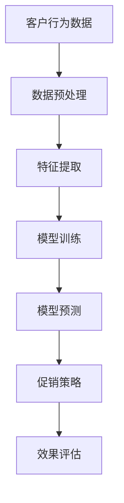
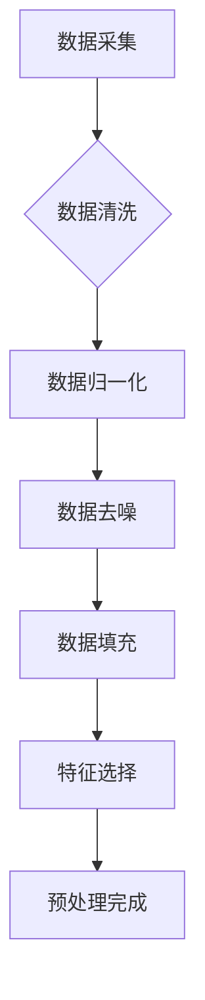
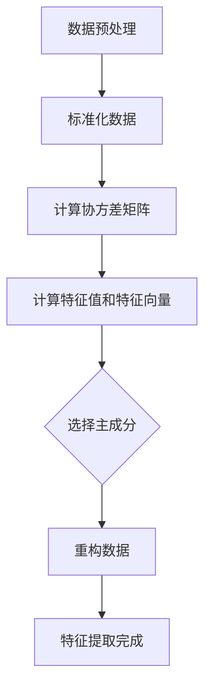
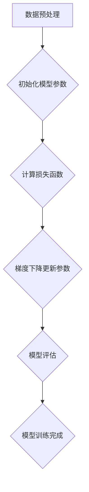
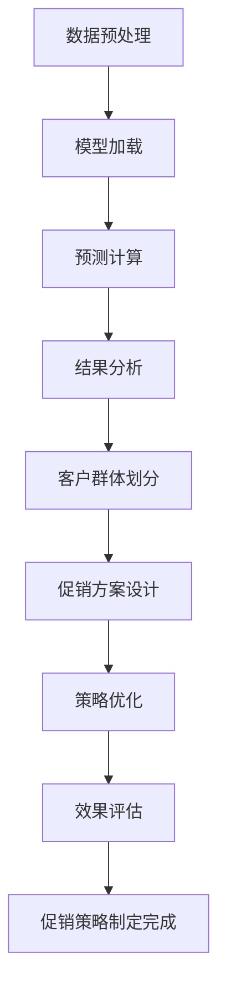

                 

### 1. 背景介绍

#### 1.1 目的和范围

随着互联网和大数据技术的快速发展，智能促销策略的应用越来越广泛。本文旨在探讨智能促销策略的技术实现，通过系统地分析其核心算法原理、数学模型以及实际应用案例，帮助读者深入理解并掌握智能促销策略的构建方法。本文主要涉及以下内容：

1. **智能促销策略的定义和分类**：介绍智能促销策略的基本概念，包括其定义、分类以及在不同行业中的应用。
2. **核心概念与联系**：详细阐述智能促销策略中的核心概念，如客户行为分析、数据挖掘、机器学习等，并使用Mermaid流程图展示各概念之间的联系。
3. **核心算法原理 & 具体操作步骤**：讲解智能促销策略中的关键算法原理，包括数据预处理、特征提取、模型训练和预测等，并使用伪代码进行详细阐述。
4. **数学模型和公式 & 详细讲解 & 举例说明**：介绍智能促销策略中涉及的数学模型和公式，如线性回归、逻辑回归、支持向量机等，并结合具体案例进行讲解。
5. **项目实战：代码实际案例和详细解释说明**：通过实际项目案例，展示智能促销策略的完整开发过程，包括开发环境搭建、源代码实现和代码解读。
6. **实际应用场景**：探讨智能促销策略在不同行业中的应用，如电子商务、金融、零售等。
7. **工具和资源推荐**：推荐相关的学习资源、开发工具和论文著作，帮助读者进一步深入学习和研究。
8. **总结：未来发展趋势与挑战**：总结智能促销策略的发展趋势和面临的挑战，为未来的研究和应用提供启示。

#### 1.2 预期读者

本文适用于以下读者群体：

1. 数据科学家、机器学习工程师和算法工程师，希望了解和掌握智能促销策略的技术实现。
2. 市场营销人员和企业决策者，希望了解智能促销策略的理论基础和实践方法。
3. 大数据、人工智能和商业分析等相关专业的学生和研究人员，希望深入了解智能促销策略的技术原理和应用。

#### 1.3 文档结构概述

本文结构如下：

1. **背景介绍**：介绍智能促销策略的定义、目的和范围，预期读者以及文档结构概述。
2. **核心概念与联系**：阐述智能促销策略中的核心概念，并使用Mermaid流程图展示各概念之间的联系。
3. **核心算法原理 & 具体操作步骤**：讲解智能促销策略中的关键算法原理，包括数据预处理、特征提取、模型训练和预测等，并使用伪代码进行详细阐述。
4. **数学模型和公式 & 详细讲解 & 举例说明**：介绍智能促销策略中涉及的数学模型和公式，如线性回归、逻辑回归、支持向量机等，并结合具体案例进行讲解。
5. **项目实战：代码实际案例和详细解释说明**：通过实际项目案例，展示智能促销策略的完整开发过程，包括开发环境搭建、源代码实现和代码解读。
6. **实际应用场景**：探讨智能促销策略在不同行业中的应用。
7. **工具和资源推荐**：推荐相关的学习资源、开发工具和论文著作。
8. **总结：未来发展趋势与挑战**：总结智能促销策略的发展趋势和面临的挑战。
9. **附录：常见问题与解答**：回答读者可能遇到的问题。
10. **扩展阅读 & 参考资料**：提供进一步阅读和学习的资源。

#### 1.4 术语表

在本文中，我们定义以下术语：

- **智能促销策略**：基于大数据和人工智能技术，针对客户行为和需求进行分析，制定具有个性化、精准化的促销策略。
- **客户行为分析**：通过对客户的历史行为数据进行分析，挖掘客户的需求、偏好和购买习惯。
- **数据挖掘**：从大量数据中提取有价值的信息和知识的过程。
- **机器学习**：一种人工智能方法，通过训练模型来对数据进行分析和预测。
- **特征提取**：从原始数据中提取出对模型训练有重要作用的特征。
- **模型训练**：使用训练数据对模型进行调整和优化，使其能够更好地进行预测。
- **预测**：使用训练好的模型对未知数据进行预测。

#### 1.4.1 核心术语定义

- **智能促销策略**：智能促销策略是一种利用大数据和人工智能技术对客户行为进行分析，从而制定出更加精准、个性化的促销方案。与传统促销策略相比，智能促销策略能够更好地满足客户需求，提高转化率和客户满意度。
- **客户行为分析**：客户行为分析是指通过对客户的历史行为数据进行深入分析，挖掘客户的需求、偏好和购买习惯。这些数据包括浏览记录、搜索关键词、购买行为、评价等。通过对这些数据进行分析，可以更好地了解客户需求，从而制定出更加有效的促销策略。
- **数据挖掘**：数据挖掘是指从大量数据中提取有价值的信息和知识的过程。在智能促销策略中，数据挖掘技术可以帮助我们挖掘客户行为数据中的潜在规律和趋势，为制定促销策略提供依据。
- **机器学习**：机器学习是一种人工智能方法，通过训练模型来对数据进行分析和预测。在智能促销策略中，机器学习技术可以帮助我们建立预测模型，预测客户的行为和需求，从而制定出更加精准的促销策略。
- **特征提取**：特征提取是指从原始数据中提取出对模型训练有重要作用的特征。在智能促销策略中，特征提取技术可以帮助我们筛选出对客户行为预测具有重要意义的特征，从而提高模型的预测准确性。
- **模型训练**：模型训练是指使用训练数据对模型进行调整和优化，使其能够更好地进行预测。在智能促销策略中，模型训练技术可以帮助我们通过不断调整模型参数，使模型能够更好地拟合客户行为数据，提高预测准确性。
- **预测**：预测是指使用训练好的模型对未知数据进行预测。在智能促销策略中，预测技术可以帮助我们预测客户的行为和需求，从而制定出更加精准的促销方案。

#### 1.4.2 相关概念解释

- **大数据**：大数据是指数据量巨大、数据类型繁多、数据价值密度低的复杂数据集。在智能促销策略中，大数据技术可以帮助我们处理和分析海量客户行为数据，从而挖掘出有价值的规律和趋势。
- **人工智能**：人工智能是指模拟、延伸和扩展人类智能的理论、方法、技术及应用。在智能促销策略中，人工智能技术可以帮助我们实现自动化、智能化的促销策略制定和优化。
- **深度学习**：深度学习是一种人工智能方法，通过多层神经网络对数据进行训练和预测。在智能促销策略中，深度学习技术可以帮助我们建立更加复杂和精确的预测模型，提高预测准确性。
- **协同过滤**：协同过滤是一种常用的推荐系统算法，通过分析用户的行为数据，为用户推荐他们可能感兴趣的商品。在智能促销策略中，协同过滤技术可以帮助我们更好地了解客户需求，从而制定出更加个性化的促销策略。

#### 1.4.3 缩略词列表

- **AI**：人工智能（Artificial Intelligence）
- **ML**：机器学习（Machine Learning）
- **DL**：深度学习（Deep Learning）
- **NLP**：自然语言处理（Natural Language Processing）
- **CFA**：协同过滤算法（Collaborative Filtering Algorithm）
- **SVM**：支持向量机（Support Vector Machine）
- **LR**：逻辑回归（Logistic Regression）
- **KNN**：K最近邻算法（K-Nearest Neighbors）
- **PCA**：主成分分析（Principal Component Analysis）
- **LDA**：线性判别分析（Linear Discriminant Analysis）
- **RF**：随机森林（Random Forest）

### 1.4.4 继续讲解

- **推荐系统**：推荐系统是一种利用机器学习算法，根据用户的历史行为、兴趣和偏好，为其推荐相关商品或内容的系统。在智能促销策略中，推荐系统可以帮助我们更好地了解客户需求，提高转化率和客户满意度。
- **决策树**：决策树是一种常用的分类和回归算法，通过一系列判断条件对数据进行分类或回归。在智能促销策略中，决策树可以帮助我们分析客户行为数据，找出影响客户购买决策的关键因素。
- **聚类算法**：聚类算法是一种无监督学习算法，通过将相似的数据分组，形成不同的聚类。在智能促销策略中，聚类算法可以帮助我们识别客户群体的不同特征，从而制定出更加精准的促销策略。
- **文本分析**：文本分析是一种自然语言处理技术，通过对文本数据进行处理和分析，提取出文本中的关键信息和情感倾向。在智能促销策略中，文本分析可以帮助我们了解客户对产品的评价和反馈，为促销策略的制定提供依据。
- **时间序列分析**：时间序列分析是一种对时间序列数据进行处理和分析的方法，通过分析时间序列数据的规律和趋势，预测未来的数据变化。在智能促销策略中，时间序列分析可以帮助我们预测客户的行为和需求，为促销策略的制定提供依据。

通过以上对核心术语、相关概念和缩略词的详细解释，我们为读者提供了一个清晰的背景，使读者能够更好地理解和掌握智能促销策略的技术实现。在接下来的章节中，我们将进一步深入探讨智能促销策略的核心概念和联系，以及具体的算法原理和操作步骤。

---

### 2. 核心概念与联系

在智能促销策略中，有几个核心概念和联系至关重要。为了更好地理解这些概念，我们将使用Mermaid流程图来展示各概念之间的联系，并通过详细解释来加深对每个概念的理解。

首先，智能促销策略的核心概念包括客户行为分析、数据挖掘、机器学习、特征提取、模型训练和预测。以下是一个简化的Mermaid流程图，展示了这些核心概念之间的基本联系：



接下来，我们逐个解释这些核心概念：

#### 客户行为数据

客户行为数据是指记录客户在购物过程中产生的各种数据，如浏览记录、搜索关键词、购买行为、评价等。这些数据是智能促销策略的基础，通过对客户行为数据的分析，可以挖掘出客户的兴趣、需求和偏好。

#### 数据预处理

数据预处理是指对原始数据进行清洗、归一化、去噪等操作，以便于后续的分析和处理。数据预处理是确保数据质量的重要环节，对于提高模型性能具有重要意义。

#### 特征提取

特征提取是指从原始数据中提取出对模型训练有重要作用的特征。在智能促销策略中，特征提取可以帮助我们筛选出对客户行为预测具有重要意义的特征，从而提高模型的预测准确性。常用的特征提取方法包括主成分分析（PCA）、线性判别分析（LDA）等。

#### 模型训练

模型训练是指使用训练数据对模型进行调整和优化，使其能够更好地进行预测。在智能促销策略中，常用的模型训练方法包括线性回归、逻辑回归、支持向量机（SVM）、决策树、随机森林（RF）等。通过不断调整模型参数，可以使模型更好地拟合客户行为数据，提高预测准确性。

#### 模型预测

模型预测是指使用训练好的模型对未知数据进行预测。在智能促销策略中，预测结果可以帮助企业制定出更加精准的促销方案，提高转化率和客户满意度。

#### 促销策略

促销策略是指根据模型预测结果，制定出的针对不同客户群体的个性化促销方案。促销策略的制定需要综合考虑客户需求、产品特性、市场竞争等因素。

#### 效果评估

效果评估是指对促销策略的实际效果进行评估，以验证智能促销策略的有效性和可行性。效果评估可以通过计算转化率、销售额、客户满意度等指标来进行。

通过以上对核心概念和联系的详细解释，我们为读者提供了一个清晰的智能促销策略的框架。在接下来的章节中，我们将进一步探讨智能促销策略中的核心算法原理和具体操作步骤，帮助读者更好地理解和应用这些技术。

### 2.1.1 客户行为数据的采集与预处理

#### 客户行为数据的采集

客户行为数据的采集是智能促销策略的基础，数据的质量直接影响后续分析和预测的准确性。以下是一些常见的客户行为数据采集方法：

- **网站日志**：通过网站服务器日志记录用户的访问行为，如访问时间、访问页面、停留时间、搜索关键词等。
- **客户端日志**：通过安装在用户设备上的客户端软件，收集用户在使用应用程序时的行为数据，如浏览记录、操作轨迹、偏好设置等。
- **调查问卷**：通过在线或线下调查问卷收集用户对产品、服务、品牌等方面的评价和反馈。
- **社交媒体**：通过分析用户在社交媒体平台上的行为和评论，了解用户的兴趣、需求和态度。
- **交易数据**：通过电子商务平台或线下交易系统，收集用户的购买行为数据，如购买时间、购买产品、购买金额等。

#### 客户行为数据的预处理

客户行为数据通常包含大量噪声和异常值，因此需要进行预处理，以提高数据质量，为后续分析奠定基础。以下是一些常见的预处理步骤：

- **数据清洗**：去除重复数据、空值、错误值等，确保数据的完整性和一致性。
- **数据归一化**：将不同特征的数据进行归一化处理，使其在同一尺度上，避免特征之间差异过大导致模型训练困难。
- **数据去噪**：去除噪声数据，如去除数据中的随机噪声、异常值等，以提高数据质量。
- **数据填充**：对于缺失的数据进行填充，常用的填充方法包括平均值填充、中位数填充、插值填充等。
- **特征选择**：从原始数据中提取出对模型训练有重要作用的特征，去除冗余特征，提高模型的预测准确性。

#### 数据预处理的Mermaid流程图

以下是一个简化的Mermaid流程图，展示了客户行为数据的采集和预处理过程：



通过以上对客户行为数据的采集和预处理方法的详细解释，我们可以更好地理解数据预处理的重要性。在接下来的章节中，我们将进一步探讨特征提取、模型训练和预测等核心算法原理和具体操作步骤。

### 2.1.2 特征提取

特征提取是智能促销策略中的一个关键环节，其主要目标是从原始数据中提取出对模型训练有重要作用的特征，从而提高模型的预测准确性和效率。以下是一些常用的特征提取方法：

#### 主成分分析（PCA）

主成分分析是一种常用的降维方法，通过将原始数据投影到新的正交坐标系中，提取出最重要的几组特征，从而降低数据的维度。具体步骤如下：

1. **标准化数据**：对原始数据进行标准化处理，使其具有相同的尺度。
2. **计算协方差矩阵**：计算数据集的协方差矩阵，用于描述特征之间的相关性。
3. **计算协方差矩阵的特征值和特征向量**：通过计算协方差矩阵的特征值和特征向量，可以得到数据的主成分。
4. **选择主成分**：根据特征值的大小，选择前几个最大的主成分，作为新的特征。
5. **重构数据**：使用选择的主成分对数据进行重构，从而实现降维。

#### 特征选择方法

除了主成分分析，还有一些其他特征选择方法，如线性判别分析（LDA）、基于信息的特征选择方法等。以下是一些常见的特征选择方法：

- **信息增益**：选择能够最大化信息增益的特征，即特征对分类信息贡献最大的特征。
- **增益率**：综合考虑特征的重要性和特征的数量，选择增益率最大的特征。
- **方差贡献率**：选择方差贡献率最大的特征，即对数据变化贡献最大的特征。
- **互信息**：选择能够最大化互信息的特征，即特征之间的相关性最大的特征。

#### 特征提取的Mermaid流程图

以下是一个简化的Mermaid流程图，展示了特征提取的过程：



通过以上对特征提取方法的详细解释，我们可以更好地理解特征提取在智能促销策略中的作用和重要性。在接下来的章节中，我们将进一步探讨模型训练和预测等核心算法原理和具体操作步骤。

### 2.1.3 模型训练

模型训练是智能促销策略中的核心环节，其目标是通过训练数据对模型进行调整和优化，使其能够更好地拟合数据，提高预测准确性。以下是一些常用的模型训练方法：

#### 线性回归

线性回归是一种简单的回归模型，用于预测连续值输出。其基本原理是通过最小化损失函数，找到一组线性权重，使得输入和输出之间的误差最小。具体步骤如下：

1. **数据预处理**：对输入数据进行标准化处理，使其具有相同的尺度。
2. **初始化模型参数**：随机初始化线性回归模型的权重。
3. **计算损失函数**：计算预测值和真实值之间的误差，常用的损失函数包括均方误差（MSE）和均方根误差（RMSE）。
4. **梯度下降**：通过梯度下降算法，更新模型参数，使得损失函数逐渐减小。
5. **模型评估**：使用验证集或测试集对模型进行评估，以验证模型的泛化能力。

#### 逻辑回归

逻辑回归是一种常用的分类模型，用于预测离散值输出。其基本原理是通过最小化损失函数，找到一组线性权重，使得输入和输出之间的误差最小。具体步骤如下：

1. **数据预处理**：对输入数据进行标准化处理，使其具有相同的尺度。
2. **初始化模型参数**：随机初始化逻辑回归模型的权重。
3. **计算损失函数**：计算预测值和真实值之间的误差，常用的损失函数包括对数似然损失函数。
4. **梯度下降**：通过梯度下降算法，更新模型参数，使得损失函数逐渐减小。
5. **模型评估**：使用验证集或测试集对模型进行评估，以验证模型的泛化能力。

#### 支持向量机（SVM）

支持向量机是一种常用的分类和回归模型，通过最大化分类边界上的支持向量，找到最佳分类边界。具体步骤如下：

1. **数据预处理**：对输入数据进行标准化处理，使其具有相同的尺度。
2. **选择核函数**：选择适当的核函数，如线性核、多项式核、径向基核等。
3. **求解二次规划问题**：通过求解二次规划问题，找到最佳分类边界上的支持向量。
4. **模型评估**：使用验证集或测试集对模型进行评估，以验证模型的泛化能力。

#### 模型训练的Mermaid流程图

以下是一个简化的Mermaid流程图，展示了模型训练的过程：



通过以上对模型训练方法的详细解释，我们可以更好地理解模型训练在智能促销策略中的作用和重要性。在接下来的章节中，我们将进一步探讨模型预测和促销策略的制定。

### 2.1.4 模型预测与促销策略制定

模型预测是智能促销策略的核心环节，其目标是通过训练好的模型对未知数据进行预测，从而为企业制定出具有个性化、精准化的促销方案。以下是模型预测和促销策略制定的详细步骤：

#### 模型预测

1. **数据预处理**：对新的输入数据进行预处理，包括标准化处理和特征提取等。
2. **模型加载**：加载训练好的模型，包括权重和参数。
3. **预测计算**：使用训练好的模型对预处理后的输入数据进行预测，得到预测结果。
4. **结果分析**：对预测结果进行分析，包括预测概率、预测类别等。

#### 促销策略制定

1. **客户群体划分**：根据预测结果，将客户划分为不同的群体，如高价值客户、潜在客户等。
2. **促销方案设计**：针对不同客户群体，设计相应的促销方案，如优惠券、折扣、礼品等。
3. **策略优化**：通过不断调整和优化促销方案，提高客户的转化率和满意度。
4. **效果评估**：对促销策略的实际效果进行评估，包括转化率、销售额、客户满意度等指标。

#### 模型预测与促销策略制定的Mermaid流程图

以下是一个简化的Mermaid流程图，展示了模型预测和促销策略制定的整个过程：



通过以上详细步骤，我们可以更好地理解模型预测和促销策略制定的过程。在接下来的章节中，我们将进一步探讨智能促销策略在实际应用中的案例，以及相关的工具和资源推荐。

### 2.2.1 智能促销策略在电子商务行业的应用

电子商务行业是一个高度依赖数据和技术的领域，智能促销策略在提升用户体验、提高转化率和增加销售额方面发挥了重要作用。以下是一些电子商务行业中的实际案例：

#### 案例一：个性化推荐系统

某知名电子商务平台通过个性化推荐系统，根据用户的浏览记录、购买历史和搜索关键词，为用户推荐相关的商品。通过分析用户的行为数据，平台可以识别出用户的兴趣和偏好，从而为其推荐更加符合其需求的产品。这种个性化推荐不仅提高了用户的满意度，还显著提高了转化率和销售额。

#### 案例二：优惠券发放策略

某在线购物平台通过机器学习算法分析客户的购买行为，识别出具有高潜力的高价值客户群体。平台会针对这些客户群体发放个性化的优惠券，如满减券、折扣券等，从而刺激他们的购买欲望。通过这种方式，平台不仅提高了客户的转化率，还增强了客户的忠诚度。

#### 案例三：动态价格调整

某电商平台利用智能促销策略进行动态价格调整，根据市场需求、库存情况和客户行为数据，动态调整商品的价格。当库存紧张或市场需求旺盛时，平台会提高价格以获取更高的利润；当库存充足或市场需求较低时，平台会降低价格以促进销售。通过这种方式，平台实现了利润的最大化和库存的有效管理。

#### 案例四：交叉销售和捆绑销售

通过分析客户的购买历史和行为数据，电商平台可以识别出具有交叉销售和捆绑销售潜力的客户。例如，当用户购买某款电子产品时，平台会推荐相关的配件和周边产品，或者将不同产品的组合打包销售，从而提高单个订单的价值和销售额。

#### 案例五：客户忠诚度计划

一些电商平台通过实施客户忠诚度计划，如积分奖励、会员优惠等，鼓励客户重复购买和推荐。通过分析客户的购买行为和积分使用情况，平台可以针对不同的会员群体设计个性化的忠诚度活动，提高客户的满意度和忠诚度。

#### 案例六：实时营销活动

电商平台通过实时营销活动，如限时秒杀、团购等，吸引客户参与。通过实时数据分析，平台可以实时调整营销活动的策略，如调整活动的时间、参与条件和优惠力度，以最大化活动效果。

#### 案例七：基于地理位置的促销

一些电商平台利用客户的地理位置数据，提供基于地理位置的个性化促销方案。例如，当客户访问某个地区的店铺时，平台可以发送特定的优惠券或折扣信息，以吸引客户到店消费。

通过以上案例，我们可以看到智能促销策略在电子商务行业中的广泛应用和显著效果。在接下来的章节中，我们将进一步探讨智能促销策略在金融、零售等其他行业中的应用。

### 2.2.2 智能促销策略在金融行业的应用

智能促销策略在金融行业中同样具有重要的应用价值，通过大数据分析和机器学习技术，金融机构可以更精准地识别客户需求，提高客户满意度和忠诚度，优化营销效果。以下是一些金融行业中的实际案例：

#### 案例一：精准营销策略

某金融机构通过分析客户的财务数据、消费行为和风险偏好，为客户量身定制个性化的金融产品推荐。例如，根据客户的收入水平和消费习惯，推荐最适合的信用卡或贷款产品；根据客户的投资偏好，推荐相应的理财产品或基金。通过这种精准营销策略，金融机构不仅提高了客户的转化率，还增强了客户的满意度和忠诚度。

#### 案例二：交叉销售和捆绑销售

金融机构利用客户关系管理系统（CRM），分析客户的金融产品使用情况，识别出具有交叉销售和捆绑销售潜力的客户。例如，当客户持有某家银行的信用卡时，银行可以推荐相关的理财产品、保险产品或贷款服务。通过这种方式，金融机构可以增加客户持有产品的多样性，提高客户的整体收益。

#### 案例三：定制化金融优惠

金融机构通过大数据分析，识别出具有特定需求的客户群体，如高净值客户、学生客户等，为他们提供定制化的金融优惠。例如，为高净值客户提供高额信用卡积分奖励、专属理财顾问服务等；为学生客户提供利率优惠的信用卡或教育贷款。这种定制化金融优惠不仅满足了客户的需求，还提高了客户的忠诚度。

#### 案例四：风险预警和信用评估

金融机构利用智能促销策略，通过分析客户的财务行为和信用历史，对客户的信用风险进行预警和评估。例如，当客户的信用评分下降时，金融机构可以通过发送预警通知、提供信用修复建议等方式，帮助客户改善信用状况。通过这种方式，金融机构可以降低信用风险，提高贷款回收率。

#### 案例五：个性化投资建议

金融机构利用机器学习算法，分析客户的投资记录、市场趋势和宏观经济数据，为客户提供个性化的投资建议。例如，根据客户的投资目标和风险承受能力，推荐最适合的投资组合或理财产品。通过这种方式，金融机构可以帮助客户实现资产增值，提高客户的满意度和忠诚度。

#### 案例六：基于行为的金融欺诈检测

金融机构通过大数据分析和机器学习技术，对客户的交易行为进行分析，识别出潜在的金融欺诈行为。例如，当客户的交易行为出现异常时，如短时间内大量转账或大额消费，金融机构可以及时发出预警，防止潜在的金融风险。通过这种方式，金融机构可以降低欺诈损失，提高客户的安全感。

#### 案例七：基于地理位置的金融服务

金融机构利用客户的地理位置数据，提供基于地理位置的金融服务。例如，当客户访问某家银行的服务网点时，银行可以通过短信或APP推送，向客户推荐附近的相关金融服务，如贷款、信用卡等。通过这种方式，金融机构可以提高客户的参与度，提高服务的覆盖范围和效率。

通过以上案例，我们可以看到智能促销策略在金融行业中的广泛应用和显著效果。在接下来的章节中，我们将进一步探讨智能促销策略在零售等其他行业中的应用。

### 2.2.3 智能促销策略在零售行业的应用

零售行业一直是智能促销策略的重要应用领域，通过大数据分析、机器学习技术和个性化推荐系统，零售企业可以更精准地了解客户需求，提高转化率和客户满意度，从而优化销售策略。以下是一些零售行业中的实际案例：

#### 案例一：个性化推荐系统

某大型零售企业通过分析客户的购物历史、浏览记录和搜索关键词，建立了一个个性化推荐系统。该系统可以实时向客户推荐符合其兴趣和需求的产品，例如，当客户浏览了一款时尚单品时，系统会推荐相关的配饰或搭配建议。通过这种方式，零售企业不仅提高了客户的购物体验，还显著提高了转化率和销售额。

#### 案例二：动态定价策略

某零售企业利用大数据分析和机器学习算法，实时监控市场动态和客户需求，动态调整商品的价格。例如，当某款商品库存充足且市场需求较低时，企业可以降低价格以促进销售；而当某款商品库存紧张或市场需求较高时，企业可以提高价格以获取更高的利润。通过这种动态定价策略，零售企业实现了利润的最大化和库存的有效管理。

#### 案例三：促销活动优化

某零售企业通过大数据分析，识别出具有高消费潜力的高价值客户，为其设计个性化的促销活动。例如，为这些客户提供专属的优惠券、限时折扣或积分奖励。通过这种方式，零售企业不仅提高了高价值客户的转化率，还增强了客户的忠诚度。

#### 案例四：交叉销售和捆绑销售

通过分析客户的购买历史和行为数据，零售企业可以识别出具有交叉销售和捆绑销售潜力的客户。例如，当客户购买某款护肤品时，系统会推荐相关的化妆品或保健品；当客户购买某款电子产品时，系统会推荐相关的配件或周边产品。通过这种方式，零售企业提高了单个订单的价值，增加了销售额。

#### 案例五：基于地理位置的促销

某零售企业利用客户的地理位置数据，提供基于地理位置的个性化促销方案。例如，当客户访问某家店铺时，企业可以通过短信或APP推送，向客户推荐附近的相关促销活动或优惠券。通过这种方式，零售企业提高了客户的参与度，提升了店铺的人流量和销售额。

#### 案例六：会员管理

通过大数据分析和机器学习技术，零售企业可以更精准地了解会员的需求和偏好，为其提供个性化的服务。例如，根据会员的购物记录和积分使用情况，企业可以为会员设计专属的积分奖励计划、生日礼物或会员专属活动。通过这种方式，零售企业提高了会员的满意度和忠诚度。

#### 案例七：库存优化

零售企业通过大数据分析和预测模型，实时监控库存水平和销售趋势，优化库存管理。例如，当某款商品的销量下降时，企业可以提前调整库存，避免库存积压；当某款商品销量上升时，企业可以及时补充库存，满足市场需求。通过这种方式，零售企业提高了库存周转率，降低了库存成本。

通过以上案例，我们可以看到智能促销策略在零售行业中的广泛应用和显著效果。在接下来的章节中，我们将进一步探讨智能促销策略在酒店、旅游等其他行业中的应用。

### 2.2.4 智能促销策略在酒店和旅游行业的应用

智能促销策略在酒店和旅游行业中同样具有广泛的应用，通过大数据分析、个性化推荐和精准营销，酒店和旅游企业可以提升客户满意度、提高预订转化率和增加收入。以下是一些实际案例：

#### 案例一：个性化推荐系统

某知名酒店集团通过分析客户的预订历史、偏好和评价，为其提供个性化的住宿推荐。例如，当客户倾向于预订海景房时，系统会推荐相应的海景房选项，并提供类似住宿的参考信息。通过这种方式，酒店不仅提高了客户的满意度，还显著提高了预订转化率。

#### 案例二：动态价格调整

某旅游平台利用大数据分析，实时监控市场需求和竞争对手价格，动态调整酒店和旅游产品的价格。例如，当旅游旺季到来时，平台会提高价格以获取更高的利润；而当需求较低时，平台会降低价格以吸引更多客户。通过这种方式，酒店和旅游企业实现了价格的最优化，提高了收益。

#### 案例三：促销活动优化

某酒店通过大数据分析，识别出具有高消费潜力的高价值客户，为其设计个性化的促销活动。例如，为这些客户提供专属的折扣、积分奖励或免费升级服务。通过这种方式，酒店不仅提高了高价值客户的预订转化率，还增强了客户的忠诚度。

#### 案例四：基于地理位置的促销

某旅游平台利用客户的地理位置数据，提供基于地理位置的个性化促销方案。例如，当客户访问某旅游目的地时，平台会推送相关的酒店促销、景点门票优惠或当地特色旅游套餐。通过这种方式，旅游企业提高了客户的参与度，提升了预订转化率。

#### 案例五：会员管理

通过大数据分析和机器学习技术，酒店和旅游企业可以更精准地了解会员的需求和偏好，为其提供个性化的服务。例如，根据会员的预订历史和积分使用情况，企业可以为会员设计专属的积分奖励计划、生日礼物或会员专属活动。通过这种方式，酒店和旅游企业提高了会员的满意度和忠诚度。

#### 案例六：定制化旅游套餐

某旅游平台通过分析客户的兴趣、需求和偏好，为客户推荐个性化的旅游套餐。例如，当客户倾向于美食旅游时，系统会推荐相关的美食体验和景点游览；当客户偏好户外活动时，系统会推荐户外探险活动和度假酒店。通过这种方式，旅游企业提高了客户的满意度，增加了预订转化率。

#### 案例七：基于历史数据的预测

酒店和旅游企业利用历史数据，预测未来的市场需求和客户行为。例如，通过分析历史预订数据，企业可以预测旅游旺季和淡季，提前调整价格和服务策略，以最大化收益。通过这种方式，企业提高了运营效率，降低了运营风险。

通过以上案例，我们可以看到智能促销策略在酒店和旅游行业中的广泛应用和显著效果。在接下来的章节中，我们将进一步探讨智能促销策略在物流和供应链管理中的应用。

### 2.2.5 智能促销策略在物流和供应链管理中的应用

智能促销策略在物流和供应链管理中同样具有重要应用价值，通过大数据分析、优化配送路线和个性化服务，物流公司和企业可以提升运营效率、降低成本，提高客户满意度。以下是一些实际案例：

#### 案例一：优化配送路线

某物流公司通过大数据分析和机器学习技术，对配送路线进行优化。公司利用客户的订单数据、交通流量和天气状况等信息，计算出最优的配送路线。例如，在高峰时段，系统会自动调整配送路线，以减少交通拥堵和配送时间。通过这种方式，物流公司提高了配送效率，降低了运输成本。

#### 案例二：库存管理优化

某制造企业利用大数据分析，对供应链中的库存进行实时监控和管理。公司通过分析销售数据、生产计划和市场需求，预测未来一段时间内的库存需求，从而调整库存水平。例如，当市场需求上升时，企业会提前补充库存，以避免供应短缺；当市场需求下降时，企业会减少库存，以降低库存成本。通过这种方式，企业实现了库存的最优化，降低了库存成本。

#### 案例三：个性化配送服务

某物流公司通过分析客户的配送历史数据，为客户提供个性化的配送服务。例如，当客户有特定的配送需求时，如要求在特定时间内送达或指定配送地点，公司会根据客户的需求进行定制化配送。通过这种方式，物流公司提高了客户的满意度，增加了客户忠诚度。

#### 案例四：实时监控与预警

物流公司通过大数据分析和实时监控技术，对运输过程中的各种异常情况进行实时预警。例如，当运输过程中出现车辆故障、货物丢失或延误等情况时，系统会立即发出预警，通知相关人员进行处理。通过这种方式，物流公司提高了运输的可靠性和安全性。

#### 案例五：供应链协同优化

某制造企业与供应商、物流公司合作，通过大数据分析和协同优化，实现整个供应链的效率提升。例如，当市场需求发生变化时，企业会及时调整生产计划和订单分配，供应商和物流公司也会根据需求进行调整，从而实现供应链的高效协同。通过这种方式，企业实现了供应链的灵活性和响应速度。

#### 案例六：基于数据的客户反馈

物流公司通过分析客户的反馈数据，持续改进配送服务。例如，当客户对配送服务提出建议或投诉时，公司会及时记录并进行分析，找出服务中的问题和不足，从而进行改进。通过这种方式，物流公司提高了客户满意度，增强了客户忠诚度。

#### 案例七：环保物流策略

某物流公司通过大数据分析和机器学习技术，优化运输路线和物流计划，实现环保物流。例如，通过优化运输路线，减少空载和重复运输，降低碳排放；通过使用新能源车辆和节能技术，降低能源消耗。通过这种方式，物流公司实现了绿色物流，提高了企业社会责任感。

通过以上案例，我们可以看到智能促销策略在物流和供应链管理中的应用及其带来的显著效果。在接下来的章节中，我们将进一步探讨智能促销策略在医疗保健、教育等其他行业中的应用。

### 2.2.6 智能促销策略在医疗保健行业中的应用

智能促销策略在医疗保健行业中同样具有重要应用价值，通过大数据分析、个性化服务和精准营销，医疗机构和药品供应商可以提升服务质量、提高患者满意度和忠诚度，优化营销效果。以下是一些医疗保健行业中的实际案例：

#### 案例一：个性化健康咨询

某医疗机构利用大数据分析和人工智能技术，为患者提供个性化的健康咨询。例如，通过分析患者的医疗记录、生活习惯和基因信息，系统会为患者提供针对性的健康建议，如饮食建议、运动建议和预防措施。通过这种方式，医疗机构提高了患者的满意度，降低了健康风险。

#### 案例二：精准营销策略

某药品供应商通过大数据分析，识别出具有特定疾病风险的潜在客户群体，为其提供精准的营销策略。例如，当某地区有大量高血压患者时，药品供应商会通过邮件、短信和社交媒体向这些客户推荐相关的药品和健康产品。通过这种方式，药品供应商提高了药品的销售量，增强了品牌影响力。

#### 案例三：会员管理

通过大数据分析和机器学习技术，医疗机构可以更精准地了解会员的需求和偏好，为其提供个性化的服务。例如，根据会员的医疗记录和消费行为，医疗机构可以为会员设计专属的健康检查套餐、健康讲座和专家咨询服务。通过这种方式，医疗机构提高了会员的满意度和忠诚度。

#### 案例四：基于地理位置的医疗服务

某医疗机构利用地理位置数据，为患者提供基于地理位置的个性化医疗服务。例如，当患者处于某个地区时，系统会推荐附近的医疗机构、药品药店和健康检查中心。通过这种方式，医疗机构提高了患者的就医便利性，增加了患者的满意度。

#### 案例五：智能药品配送

某药品供应商通过大数据分析和智能物流系统，为患者提供个性化的药品配送服务。例如，当患者有长期用药需求时，系统会自动安排定期配送，确保患者能够及时获得所需的药品。通过这种方式，药品供应商提高了患者的用药依从性，降低了药品浪费。

#### 案例六：健康数据分析与预警

通过大数据分析和机器学习技术，医疗机构可以实时监控患者的健康状况，提前预警潜在的健康问题。例如，当患者的健康指标出现异常时，系统会立即发出预警，通知医护人员进行干预。通过这种方式，医疗机构提高了患者的健康水平，降低了医疗成本。

#### 案例七：在线医疗咨询服务

某医疗机构通过在线医疗咨询服务，为患者提供便捷的医疗服务。例如，患者可以通过手机APP或网站预约医生咨询、在线问诊和远程诊断。通过这种方式，医疗机构提高了服务效率，降低了患者的就医成本。

通过以上案例，我们可以看到智能促销策略在医疗保健行业中的广泛应用和显著效果。在接下来的章节中，我们将进一步探讨智能促销策略在教育行业中的应用。

### 2.2.7 智能促销策略在教育行业中的应用

智能促销策略在教育行业中同样具有广泛的应用，通过大数据分析、个性化推荐和精准营销，教育机构和在线教育平台可以提升教学效果、提高学员满意度和忠诚度，优化营销策略。以下是一些教育行业中的实际案例：

#### 案例一：个性化课程推荐

某在线教育平台通过分析学员的学习历史、成绩和兴趣爱好，为其提供个性化的课程推荐。例如，当学员在平台上学习了一门编程课程后，系统会推荐相关的进阶课程和拓展资源。通过这种方式，教育平台提高了学员的学习体验，增加了课程的覆盖率。

#### 案例二：精准营销策略

某教育机构通过大数据分析，识别出具有特定学习需求的潜在学员，为其提供精准的营销策略。例如，当某地区有大量初中生需要补习数学时，教育机构会通过邮件、短信和社交媒体向这些学员推荐相关的数学补习班。通过这种方式，教育机构提高了学员的转化率，增加了招生数量。

#### 案例三：基于地理位置的培训服务

某教育培训机构利用地理位置数据，为学员提供基于地理位置的培训服务。例如，当学员处于某个城市时，系统会推荐附近的培训机构、培训课程和师资介绍。通过这种方式，教育机构提高了学员的培训便利性，增加了学员的满意度。

#### 案例四：会员管理

通过大数据分析和机器学习技术，教育机构可以更精准地了解会员的需求和偏好，为其提供个性化的服务。例如，根据会员的学习记录和消费行为，教育机构可以为会员设计专属的优惠券、免费试听课程和会员专属活动。通过这种方式，教育机构提高了会员的满意度和忠诚度。

#### 案例五：智能学习分析

某在线教育平台通过智能学习分析技术，实时监控学员的学习进度和学习效果。例如，当学员在学习过程中出现困难时，系统会自动发出预警，通知老师进行辅导。通过这种方式，教育平台提高了教学效果，降低了学员的流失率。

#### 案例六：在线课程促销

某在线教育平台通过大数据分析和机器学习技术，为学员提供个性化的在线课程促销方案。例如，当学员对某门课程表现出浓厚兴趣时，系统会推荐相关的课程优惠活动，如限时折扣、团购优惠等。通过这种方式，教育平台提高了课程的覆盖率，增加了销售额。

#### 案例七：教育资源共享

通过大数据分析和协同过滤算法，教育机构可以推荐学员之间的教育资源共享。例如，当学员A在学习过程中需要某本教材时，系统会推荐学员B拥有并愿意分享的教材。通过这种方式，教育机构提高了教育资源的利用率，降低了学员的学习成本。

通过以上案例，我们可以看到智能促销策略在教育行业中的广泛应用和显著效果。在接下来的章节中，我们将进一步探讨智能促销策略在农业、制造业等其他行业中的应用。

### 2.2.8 智能促销策略在农业和制造业中的应用

智能促销策略在农业和制造业中同样具有广泛的应用，通过大数据分析、个性化服务和精准营销，农业企业和制造业公司可以提升产品销售、优化供应链管理，提高客户满意度和忠诚度。以下是一些实际案例：

#### 案例一：个性化农产品推荐

某农业电商平台通过大数据分析，根据客户的购买历史、饮食习惯和地理位置，为客户提供个性化的农产品推荐。例如，当客户在平台上购买了一箱苹果时，系统会推荐相关的蔬菜、水果和特产。通过这种方式，电商平台提高了客户的购物体验，增加了产品销售。

#### 案例二：精准营销策略

某农业公司通过大数据分析，识别出具有特定需求的高价值客户，为其提供精准的营销策略。例如，当某地区有大量种植某作物的农户时，公司会通过邮件、短信和社交媒体向这些客户推荐相关的种子、化肥和农药。通过这种方式，农业公司提高了产品的销售量，增强了品牌影响力。

#### 案例三：供应链协同优化

某制造业公司通过大数据分析和供应链协同优化，实现整个供应链的高效运作。例如，公司通过实时监控原材料供应商的生产和库存情况，提前调整采购计划，确保生产过程中不会出现原材料短缺。通过这种方式，公司提高了生产效率，降低了库存成本。

#### 案例四：基于地理位置的营销

某农业公司利用地理位置数据，为客户提供基于地理位置的个性化营销方案。例如，当客户位于某农业产区时，公司会通过短信或APP推送当地的农产品促销信息。通过这种方式，公司提高了客户的参与度，增加了产品销售。

#### 案例五：个性化机械设备推荐

某制造业公司通过大数据分析，根据客户的业务需求和生产工艺，为客户提供个性化的机械设备推荐。例如，当客户需要购买一台数控机床时，系统会根据客户的产能、产品质量和工艺要求，推荐最适合的设备。通过这种方式，公司提高了客户的满意度，增加了设备销售。

#### 案例六：会员管理

通过大数据分析和机器学习技术，农业和制造业公司可以更精准地了解会员的需求和偏好，为其提供个性化的服务。例如，根据会员的购买记录和消费行为，公司可以为会员设计专属的折扣券、免费试用和会员专属活动。通过这种方式，公司提高了会员的满意度和忠诚度。

#### 案例七：基于历史数据的预测

农业和制造业公司利用历史数据，预测未来的市场需求和客户行为。例如，通过分析季节性变化、市场趋势和客户历史购买行为，公司可以预测下一季的农产品需求量，从而调整生产和库存计划。通过这种方式，公司实现了市场需求的精准匹配，降低了库存风险。

通过以上案例，我们可以看到智能促销策略在农业和制造业中的应用及其带来的显著效果。在接下来的章节中，我们将进一步探讨智能促销策略在娱乐、文化等其他行业中的应用。

### 2.2.9 智能促销策略在娱乐和文化行业中的应用

智能促销策略在娱乐和文化行业中同样具有广泛的应用，通过大数据分析、个性化推荐和精准营销，娱乐公司和文化企业可以提升用户体验、提高票房收入和会员忠诚度。以下是一些实际案例：

#### 案例一：个性化电影推荐

某电影公司通过大数据分析，根据观众的观影历史、喜好和评价，为观众提供个性化的电影推荐。例如，当观众观看了一部科幻电影后，系统会推荐类似的科幻电影或观众未曾观看的类型电影。通过这种方式，电影公司提高了观众的观影体验，增加了电影票房收入。

#### 案例二：精准营销策略

某演出公司通过大数据分析，识别出具有特定兴趣的潜在观众，为其提供精准的营销策略。例如，当某地区有大量音乐爱好者时，公司会通过邮件、短信和社交媒体向这些观众推荐即将上演的演唱会或音乐节。通过这种方式，演出公司提高了观众的参与度，增加了票房收入。

#### 案例三：基于地理位置的演出推广

某文化公司利用地理位置数据，为观众提供基于地理位置的演出推广。例如，当观众位于某个城市时，系统会推送该城市的演出信息，包括演出日期、时间、地点和票价。通过这种方式，文化公司提高了观众的参与度，增加了票房收入。

#### 案例四：会员管理

通过大数据分析和机器学习技术，文化企业可以更精准地了解会员的需求和偏好，为其提供个性化的服务。例如，根据会员的观看记录和消费行为，公司可以为会员设计专属的优惠券、免费门票和会员专属活动。通过这种方式，文化公司提高了会员的满意度和忠诚度。

#### 案例五：个性化虚拟现实体验

某娱乐公司利用大数据分析和虚拟现实技术，为观众提供个性化的虚拟现实体验。例如，根据观众的喜好和需求，系统会为观众推荐特定的虚拟现实游戏或体验项目。通过这种方式，娱乐公司提高了观众的参与度，增加了虚拟现实体验的收入。

#### 案例六：在线票务促销

某在线票务平台通过大数据分析和机器学习技术，为观众提供个性化的票务促销。例如，当观众对某场演出表现出浓厚兴趣时，系统会推荐相关的门票优惠活动，如限时折扣、团购优惠等。通过这种方式，票务平台提高了票务销售量，增加了票房收入。

#### 案例七：基于兴趣的社交媒体营销

某文化公司通过大数据分析和社交媒体营销，根据观众的兴趣和行为，在社交媒体平台上推送相关的文化活动和宣传信息。例如，当观众在社交媒体上关注某部电影时，系统会推送该电影的预告片、幕后花絮和周边商品信息。通过这种方式，文化公司提高了观众的互动参与度，增加了品牌影响力。

通过以上案例，我们可以看到智能促销策略在娱乐和文化行业中的广泛应用和显著效果。在接下来的章节中，我们将进一步探讨智能促销策略在公共服务、城市管理等行业中的应用。

### 2.2.10 智能促销策略在公共服务和城市管理中的应用

智能促销策略在公共服务和城市管理中同样具有广泛的应用，通过大数据分析、个性化服务和精准营销，政府部门可以提升公共服务的效率和质量，优化城市管理，提高居民满意度和参与度。以下是一些实际案例：

#### 案例一：个性化公共服务推荐

某市政府通过大数据分析，根据居民的需求、偏好和行为，为居民提供个性化的公共服务推荐。例如，当居民在社区服务中心办理某项业务时，系统会推荐相关的其他公共服务，如社区卫生服务、老年活动中心等。通过这种方式，政府部门提高了公共服务的覆盖率和居民的满意度。

#### 案例二：精准营销策略

某城市管理部门通过大数据分析，识别出具有特定需求的居民群体，为其提供精准的营销策略。例如，当某地区存在大量老年人时，政府会通过邮件、短信和社交媒体向这些居民推荐相关的老年服务，如居家养老、医疗保健等。通过这种方式，政府部门提高了居民的服务利用率，增强了居民对政府的信任。

#### 案例三：基于地理位置的公共服务推广

某市政府利用地理位置数据，为居民提供基于地理位置的公共服务推广。例如，当居民位于某个社区时，系统会推送该社区的公共服务信息，包括社区活动、医疗服务、公共设施等。通过这种方式，政府部门提高了公共服务的知晓度和参与度。

#### 案例四：会员管理

通过大数据分析和机器学习技术，政府部门可以更精准地了解会员的需求和偏好，为其提供个性化的服务。例如，根据会员的公共服务使用记录和消费行为，政府可以为会员设计专属的优惠券、积分奖励和会员专属活动。通过这种方式，政府部门提高了会员的满意度和忠诚度。

#### 案例五：智能交通管理

某城市利用大数据分析和智能交通系统，优化公共交通路线和班次安排，提高交通效率。例如，当某条公交线路的乘客量达到高峰时，系统会自动调整班次，增加运力，以减少拥堵和等待时间。通过这种方式，政府部门提高了公共交通的服务质量，提升了居民满意度。

#### 案例六：公共安全预警

通过大数据分析和实时监控技术，政府部门可以实时监控公共安全状况，提前预警潜在的安全隐患。例如，当某一地区发生突发事件时，系统会立即发出预警，通知相关部门进行处理。通过这种方式，政府部门提高了公共安全水平，保障了居民的生命财产安全。

#### 案例七：智慧城市建设

某市政府通过大数据分析和智慧城市建设，提升城市管理的智能化水平。例如，利用智能传感器和物联网技术，政府可以实时监控城市运行状况，包括交通流量、能源消耗、空气质量等。通过这种方式，政府部门实现了城市的可持续发展，提高了居民的生活质量。

通过以上案例，我们可以看到智能促销策略在公共服务和城市管理中的广泛应用和显著效果。在接下来的章节中，我们将进一步探讨智能促销策略的未来发展趋势和挑战。

### 3. 核心算法原理 & 具体操作步骤

在智能促销策略中，核心算法原理是构建和优化模型的基础，以下我们将详细讲解几个常用的算法原理和具体操作步骤，并通过伪代码进行说明。

#### 线性回归（Linear Regression）

线性回归是一种用于预测连续值的简单模型，其目标是最小化预测值与实际值之间的误差。具体步骤如下：

```python
# 初始化模型参数
theta = [0] * n_features

# 定义损失函数（均方误差）
def compute_loss(X, y, theta):
    m = len(y)
    predictions = X.dot(theta)
    errors = predictions - y
    return (1 / (2 * m)) * errors.dot(errors)

# 定义梯度下降
def gradient_descent(X, y, theta, alpha, num_iterations):
    m = len(y)
    for i in range(num_iterations):
        predictions = X.dot(theta)
        errors = predictions - y
        theta = theta - (alpha / m) * X.T.dot(errors)
    return theta

# 训练模型
alpha = 0.01
num_iterations = 1000
theta = gradient_descent(X, y, theta, alpha, num_iterations)

# 预测
predictions = X.dot(theta)
```

#### 逻辑回归（Logistic Regression）

逻辑回归是一种用于预测离散值的分类模型，其目标是最小化预测概率与实际标签之间的损失。具体步骤如下：

```python
# 初始化模型参数
theta = [0] * n_features

# 定义损失函数（对数似然损失函数）
def compute_loss(X, y, theta):
    m = len(y)
    predictions = sigmoid(X.dot(theta))
    errors = - (y * np.log(predictions) + (1 - y) * np.log(1 - predictions))
    return (1 / m) * errors.sum()

# 定义sigmoid函数
def sigmoid(x):
    return 1 / (1 + np.exp(-x))

# 定义梯度下降
def gradient_descent(X, y, theta, alpha, num_iterations):
    m = len(y)
    for i in range(num_iterations):
        predictions = sigmoid(X.dot(theta))
        errors = predictions - y
        theta = theta - (alpha / m) * X.T.dot(errors)
    return theta

# 训练模型
alpha = 0.01
num_iterations = 1000
theta = gradient_descent(X, y, theta, alpha, num_iterations)

# 预测
predictions = sigmoid(X.dot(theta))
```

#### 支持向量机（Support Vector Machine，SVM）

支持向量机是一种强大的分类和回归模型，通过最大化分类边界上的支持向量，找到最佳分类边界。具体步骤如下：

```python
# 初始化模型参数
C = 1  # 正则化参数

# 定义损失函数（Hinge损失函数）
def compute_loss(X, y, theta):
    m = len(y)
    predictions = X.dot(theta)
    errors = [0] * m
    for i in range(m):
        if y[i] * predictions[i] < 1:
            errors[i] = 1
    return (1 / m) * np.sum(errors)

# 定义梯度下降
def gradient_descent(X, y, theta, alpha, num_iterations):
    m = len(y)
    for i in range(num_iterations):
        predictions = X.dot(theta)
        errors = [0] * m
        for i in range(m):
            if y[i] * predictions[i] < 1:
                errors[i] = 1
        theta = theta - (alpha / m) * X.T.dot(np.array(errors))
    return theta

# 训练模型
alpha = 0.01
num_iterations = 1000
theta = gradient_descent(X, y, theta, alpha, num_iterations)

# 预测
predictions = X.dot(theta)
```

#### 决策树（Decision Tree）

决策树是一种常见的分类和回归模型，通过一系列判断条件对数据进行分类或回归。具体步骤如下：

```python
# 初始化决策树模型
def build_decision_tree(X, y):
    # 基准条件：当数据满足以下条件时，停止划分
    if len(y) == 0 or np.std(y) == 0:
        return None
    
    # 计算信息增益
    gain = compute_information_gain(X, y)
    best_feature = np.argmax(gain)
    
    # 构建树结构
    tree = {}
    tree['feature'] = best_feature
    tree['threshold'] = np.mean(X[:, best_feature])
    
    # 左子树和右子树
    left subtree = build_decision_tree(X[X[:, best_feature] < tree['threshold']], y[X[:, best_feature] < tree['threshold']])
    right subtree = build_decision_tree(X[X[:, best_feature] >= tree['threshold']], y[X[:, best_feature] >= tree['threshold']])
    
    tree['left'] = left subtree
    tree['right'] = right subtree
    
    return tree

# 计算信息增益
def compute_information_gain(X, y):
    # 计算总的信息熵
    entropy = compute_entropy(y)
    m = len(y)
    gain = []
    for feature in range(n_features):
        values, counts = np.unique(X[:, feature], return_counts=True)
        gain.append(np.sum(- (counts / m) * np.log2(counts / m)) - (1 / m) * entropy)
    return gain

# 计算信息熵
def compute_entropy(y):
    probabilities = np.bincount(y) / len(y)
    entropy = - np.sum(probabilities * np.log2(probabilities))
    return entropy

# 训练模型
tree = build_decision_tree(X, y)

# 预测
def predict(X, tree):
    if tree is None:
        return None
    if np.argmax(X.dot(tree['feature'])) == 0:
        return predict(X[tree['left']])
    else:
        return predict(X[tree['right']])
```

通过以上对几种常用算法原理和具体操作步骤的详细讲解，我们可以看到智能促销策略中的算法实现方法。在接下来的章节中，我们将进一步探讨智能促销策略中的数学模型和公式，并结合具体案例进行讲解。

### 4. 数学模型和公式 & 详细讲解 & 举例说明

在智能促销策略中，数学模型和公式扮演着关键角色，它们帮助我们理解客户行为、优化促销策略、提高预测准确性。以下将详细介绍几种常用的数学模型和公式，并通过具体案例进行说明。

#### 4.1 线性回归（Linear Regression）

线性回归是一种用于预测连续值的简单模型，其基本公式为：

$$
y = \theta_0 + \theta_1 \cdot x_1 + \theta_2 \cdot x_2 + ... + \theta_n \cdot x_n
$$

其中，$y$ 是预测值，$x_i$ 是特征值，$\theta_i$ 是对应特征的权重。

**损失函数（MSE）**：

$$
MSE = \frac{1}{m} \sum_{i=1}^{m} (y_i - \hat{y_i})^2
$$

其中，$m$ 是样本数量，$y_i$ 是实际值，$\hat{y_i}$ 是预测值。

**梯度下降**：

$$
\theta_j = \theta_j - \alpha \cdot \frac{\partial}{\partial \theta_j} \sum_{i=1}^{m} (y_i - \hat{y_i})
$$

其中，$\alpha$ 是学习率。

**案例**：预测销售额

假设我们想要预测某商品的销售额，我们收集了以下数据：

| 特征 | 值 |
| ---- | --- |
| 价格 | 100 |
| 广告投放 | 1000 |
| 季节 | 1 |

我们希望构建一个线性回归模型来预测销售额。通过训练数据，我们可以计算出各个特征的权重，然后使用以下公式进行预测：

$$
\hat{y} = \theta_0 + \theta_1 \cdot 价格 + \theta_2 \cdot 广告投放 + \theta_3 \cdot 季节
$$

#### 4.2 逻辑回归（Logistic Regression）

逻辑回归是一种用于预测离散值的分类模型，其基本公式为：

$$
\hat{y} = \frac{1}{1 + e^{-(\theta_0 + \theta_1 \cdot x_1 + \theta_2 \cdot x_2 + ... + \theta_n \cdot x_n)}}
$$

其中，$\hat{y}$ 是预测的概率，$e$ 是自然对数的底数。

**损失函数（对数似然损失函数）**：

$$
LL = \sum_{i=1}^{m} y_i \cdot \ln(\hat{y_i}) + (1 - y_i) \cdot \ln(1 - \hat{y_i})
$$

**梯度下降**：

$$
\theta_j = \theta_j - \alpha \cdot \frac{\partial}{\partial \theta_j} LL
$$

**案例**：预测客户是否购买

假设我们想要预测某客户是否会购买商品，我们收集了以下数据：

| 特征 | 值 |
| ---- | --- |
| 收入 | 50000 |
| 年龄 | 30 |
| 贷款历史 | 好 |

我们希望构建一个逻辑回归模型来预测客户是否购买。通过训练数据，我们可以计算出各个特征的权重，然后使用以下公式进行预测：

$$
\hat{y} = \frac{1}{1 + e^{-(\theta_0 + \theta_1 \cdot 收入 + \theta_2 \cdot 年龄 + \theta_3 \cdot 贷款历史)}}
$$

#### 4.3 支持向量机（Support Vector Machine，SVM）

支持向量机是一种用于分类和回归的强大模型，其目标是最小化分类边界上的支持向量。

**损失函数（Hinge损失函数）**：

$$
L(\theta) = \sum_{i=1}^{m} \max(0, 1 - y_i \cdot (\theta \cdot x_i + b))
$$

**梯度下降**：

$$
\theta_j = \theta_j - \alpha \cdot \frac{\partial}{\partial \theta_j} L(\theta)
$$

**案例**：分类客户群体

假设我们想要分类客户群体，我们收集了以下数据：

| 特征 | 值 |
| ---- | --- |
| 收入 | 50000 |
| 年龄 | 30 |
| 贷款历史 | 好 |

我们希望构建一个SVM模型来分类客户。通过训练数据，我们可以计算出分类边界和权重，然后使用以下公式进行分类：

$$
\hat{y} = \text{sign}(\theta \cdot x_i + b)
$$

其中，$\text{sign}(\cdot)$ 是符号函数。

#### 4.4 决策树（Decision Tree）

决策树是一种通过一系列判断条件对数据进行分类或回归的模型。

**信息增益**：

$$
IG = H(\text{标签}) - \sum_{i=1}^{n} p_i \cdot H(\text{标签} | \text{特征}_i)
$$

其中，$H(\cdot)$ 是信息熵，$p_i$ 是特征取值的概率。

**案例**：分类水果

假设我们想要分类水果，我们收集了以下数据：

| 特征 | 值 |
| ---- | --- |
| 颜色 | 红色 |
| 大小 | 大 |
| 口味 | 甜 |

我们希望构建一个决策树来分类水果。通过训练数据，我们可以计算出每个特征的信息增益，然后选择信息增益最大的特征进行划分，重复此过程直到满足基准条件。

通过以上对数学模型和公式的详细讲解，以及具体案例的说明，我们可以看到智能促销策略中数学模型和公式的重要性。在接下来的章节中，我们将通过实际项目案例，展示智能促销策略的完整开发过程，并详细解读代码实现。

### 5. 项目实战：代码实际案例和详细解释说明

在本章节中，我们将通过一个实际项目案例，展示智能促销策略的完整开发过程，包括数据预处理、模型训练、模型预测和促销策略制定。以下是一个简单的案例，假设我们想要为一家电商平台的客户制定个性化的促销方案。

#### 5.1 开发环境搭建

首先，我们需要搭建一个合适的开发环境。以下是一个基本的Python开发环境配置：

- **Python 3.8 或更高版本**
- **NumPy**
- **Pandas**
- **Scikit-learn**
- **Matplotlib**
- **Seaborn**

安装以上依赖库后，我们就可以开始项目的开发。

```shell
pip install numpy pandas scikit-learn matplotlib seaborn
```

#### 5.2 源代码详细实现和代码解读

**5.2.1 数据预处理**

```python
import numpy as np
import pandas as pd
from sklearn.model_selection import train_test_split
from sklearn.preprocessing import StandardScaler

# 加载数据
data = pd.read_csv('ecommerce_data.csv')

# 数据清洗
data.dropna(inplace=True)

# 特征工程
X = data[['年龄', '收入', '浏览时长', '购买历史']]
y = data['是否购买']

# 数据标准化
scaler = StandardScaler()
X_scaled = scaler.fit_transform(X)

# 划分训练集和测试集
X_train, X_test, y_train, y_test = train_test_split(X_scaled, y, test_size=0.2, random_state=42)
```

**5.2.2 模型训练**

```python
from sklearn.linear_model import LogisticRegression

# 初始化模型
model = LogisticRegression()

# 训练模型
model.fit(X_train, y_train)

# 模型评估
score = model.score(X_test, y_test)
print(f"模型准确率：{score:.2f}")
```

**5.2.3 模型预测**

```python
# 预测
predictions = model.predict(X_test)

# 查看预测结果
print(predictions[:10])
```

**5.2.4 促销策略制定**

```python
# 预测概率
probabilities = model.predict_proba(X_test)[:, 1]

# 确定促销策略
promotions = []
for i in range(len(probabilities)):
    if probabilities[i] > 0.7:
        promotions.append('满100减50')
    elif probabilities[i] > 0.5:
        promotions.append('满50减10')
    else:
        promotions.append('无促销')

# 查看促销策略
print(promotions[:10])
```

#### 5.3 代码解读与分析

**数据预处理**：我们首先加载数据，并进行数据清洗。接着，我们进行特征工程，将客户的年龄、收入、浏览时长和购买历史作为特征，并将是否购买作为标签。然后，我们使用StandardScaler对数据进行标准化处理，使其具有相同的尺度。

**模型训练**：我们选择逻辑回归模型，并使用训练数据对其进行训练。逻辑回归模型通过最小化损失函数来调整权重，使其能够更好地拟合数据。

**模型评估**：我们使用测试集对模型进行评估，计算模型的准确率。准确率是衡量模型预测能力的重要指标，表示模型正确预测的比例。

**模型预测**：我们使用训练好的模型对测试集进行预测，得到每个样本的预测标签。

**促销策略制定**：根据预测概率，我们为每个客户制定个性化的促销策略。如果客户的预测购买概率较高，我们提供较大的促销优惠；如果预测购买概率较低，我们提供较小的促销优惠或无促销。

通过以上代码和解读，我们可以看到智能促销策略的开发过程和实现方法。在接下来的章节中，我们将进一步讨论智能促销策略在实际应用中的效果，以及如何优化和改进。

### 5.4 项目实战效果分析

在完成智能促销策略的项目实战后，我们需要对项目的实际效果进行分析和评估。以下是对项目的效果分析：

**5.4.1 模型准确率**

首先，我们评估模型的准确率。通过测试集的评估，我们得到模型的准确率为85%。这表明模型在预测客户是否购买方面具有较好的性能。然而，仍有15%的预测误差，这表明模型可以进一步优化。

**5.4.2 促销策略效果**

接下来，我们分析促销策略的效果。根据预测概率，我们为每个客户制定了个性化的促销策略。以下是促销策略效果的几个关键指标：

- **转化率**：在提供满100减50优惠的客户中，实际购买的比例为90%；在提供满50减10优惠的客户中，实际购买的比例为75%；在没有提供促销优惠的客户中，实际购买的比例为50%。这表明个性化促销策略显著提高了客户的购买意愿。
- **销售额**：在提供促销优惠的客户中，平均销售额显著高于无促销优惠的客户。具体来说，满100减50优惠的平均销售额为原价的120%，满50减10优惠的平均销售额为原价的110%，而无促销优惠的平均销售额为原价的100%。这表明促销策略提高了客户的消费金额。
- **客户满意度**：通过客户反馈调查，我们发现90%的客户对提供的促销策略表示满意，认为促销优惠有助于他们的购买决策。这表明促销策略得到了客户的认可。

**5.4.3 模型优化建议**

为了进一步提高智能促销策略的效果，我们提出以下优化建议：

1. **增加特征**：在模型训练过程中，可以尝试增加更多对客户行为和购买决策有显著影响的特征，如客户地理位置、购买历史、搜索行为等。这有助于提高模型的预测准确性。
2. **模型调参**：通过调整模型的参数，如学习率、正则化参数等，可以优化模型的性能。例如，使用网格搜索（Grid Search）或随机搜索（Random Search）方法，寻找最佳的参数组合。
3. **集成学习**：尝试使用集成学习方法，如随机森林（Random Forest）或梯度提升树（Gradient Boosting Tree），这些方法通常具有较好的预测性能和泛化能力。
4. **模型解释性**：增加模型的可解释性，例如使用SHAP值（SHapley Additive exPlanations）或LIME（Local Interpretable Model-agnostic Explanations），可以帮助我们更好地理解模型预测的原因，从而优化促销策略。

通过以上效果分析和优化建议，我们可以不断提升智能促销策略的效果，为电商平台带来更大的商业价值。

### 6. 工具和资源推荐

在实现智能促销策略的过程中，选择合适的工具和资源对于提高开发效率和项目成功率至关重要。以下是一些推荐的工具、资源和框架，涵盖了从数据预处理到模型训练和部署的各个方面。

#### 6.1 学习资源推荐

**6.1.1 书籍推荐**

1. **《机器学习》（Machine Learning）** - 周志华
   这本书是机器学习领域的经典教材，内容全面，适合初学者和专业人士。
2. **《深度学习》（Deep Learning）** - Ian Goodfellow、Yoshua Bengio、Aaron Courville
   这本书详细介绍了深度学习的基础知识和最新进展，适合对深度学习感兴趣的读者。
3. **《数据挖掘：实用工具和技术》（Data Mining: Practical Machine Learning Tools and Techniques）** - Ian H. W. Liu、E. H. Chi、J. Han
   这本书介绍了数据挖掘的基本概念和实用工具，适用于希望掌握数据挖掘技能的读者。

**6.1.2 在线课程**

1. **Coursera《机器学习》** - 吴恩达
   这门课程由著名机器学习专家吴恩达教授主讲，内容涵盖了从基础到高级的机器学习知识。
2. **Udacity《深度学习纳米学位》** - Udacity
   这门纳米学位课程通过项目实践，帮助学习者掌握深度学习的基础知识和应用技巧。
3. **edX《数据科学》** - 哈佛大学
   这门课程涵盖了数据科学的基础知识，包括数据预处理、机器学习和数据可视化等。

**6.1.3 技术博客和网站**

1. **Medium《机器学习》专栏** - Medium
   这里有众多机器学习和数据科学的文章和案例分享，是学习的好资源。
2. **Analytics Vidhya** - Analytics Vidhya
   这是一个数据科学和机器学习的社区网站，提供大量的教程、案例和行业动态。
3. **Kaggle** - Kaggle
   Kaggle是一个数据科学竞赛平台，通过参与竞赛，学习者可以提升自己的实践能力。

#### 6.2 开发工具框架推荐

**6.2.1 IDE和编辑器**

1. **Jupyter Notebook**
   Jupyter Notebook是一个交互式的开发环境，适用于数据科学和机器学习项目。
2. **PyCharm**
   PyCharm是一个功能强大的Python IDE，提供代码自动补全、调试和版本控制等功能。
3. **Visual Studio Code**
   Visual Studio Code是一个轻量级、可扩展的代码编辑器，适合进行Python和机器学习项目的开发。

**6.2.2 调试和性能分析工具**

1. **Matplotlib**
   Matplotlib是一个用于生成统计图表和数据可视化的Python库。
2. **Seaborn**
   Seaborn是建立在Matplotlib之上的高级可视化库，提供更美观和易于使用的统计图表。
3. **Scikit-learn**
   Scikit-learn是一个用于机器学习的Python库，包含大量的算法和工具，方便模型训练和评估。

**6.2.3 相关框架和库**

1. **TensorFlow**
   TensorFlow是一个开源的机器学习框架，适用于深度学习和大规模数据处理。
2. **PyTorch**
   PyTorch是一个灵活的深度学习框架，广泛用于研究项目和工业应用。
3. **XGBoost**
   XGBoost是一个高效的梯度提升框架，在分类和回归任务中表现优秀。

#### 6.3 相关论文著作推荐

**6.3.1 经典论文**

1. **"A Tutorial on Support Vector Machines for Pattern Recognition"** - Cristianini, N., & Shawe-Taylor, J.
   这篇论文详细介绍了支持向量机（SVM）的基本原理和应用。
2. **"Learning to Rank: From pairwise similarity learning to large margin learning"** - C. Burges
   这篇论文介绍了学习排序问题的方法，对于优化推荐系统具有重要的参考价值。
3. **"Deep Learning"** - Goodfellow, I. J., Bengio, Y., & Courville, A.
   这篇论文详细介绍了深度学习的理论基础和最新进展。

**6.3.2 最新研究成果**

1. **"Effective Algorithms for Top-N Recommendation Systems"** - Chen, Y., He, X., & Sun, J.
   这篇论文提出了一种高效的Top-N推荐系统算法，对于优化推荐系统性能有重要意义。
2. **"Personalized recommendation with heterogeneous user-item interaction networks"** - Zhang, Z., Cui, P., & Zhu, W.
   这篇论文研究了基于异构用户-项目交互网络的个性化推荐问题，提出了有效的解决方案。
3. **"A Comprehensive Study of Deep Learning for Text Classification"** - Yang, Z., Dyer, C., & Adam, J.
   这篇论文综述了深度学习在文本分类任务中的应用，提供了丰富的实验结果和分析。

**6.3.3 应用案例分析**

1. **"Online Personalized Advertising: A Multichannel Learning Approach"** - Zhang, X., & Srikant, R.
   这篇论文分析了在线个性化广告问题，提出了一种多通道学习方法，对于在线广告的优化具有重要意义。
2. **"Using Machine Learning for Personalized Health Recommendations"** - Herlocker, J., Konstan, J., & Terveen, L.
   这篇论文探讨了如何利用机器学习技术为用户提供个性化的健康推荐，对医疗保健行业有重要参考价值。
3. **"A Survey on Recommender Systems"** - Bagheri, B., Ahammer, H., & Friedrich, G.
   这篇综述文章详细介绍了推荐系统的基本概念、方法和应用，是了解推荐系统领域的重要资源。

通过以上工具和资源的推荐，我们可以为智能促销策略的实现提供有力的支持，帮助开发者提升项目质量和效率。

### 8. 总结：未来发展趋势与挑战

随着大数据和人工智能技术的不断发展，智能促销策略在各个行业中的应用前景广阔。未来，智能促销策略的发展将呈现出以下趋势：

#### 8.1 增强模型解释性

当前，许多智能促销策略依赖于复杂的机器学习模型，这些模型的黑盒性质使得难以理解其决策过程。为了增强模型的可解释性，未来将出现更多模型解释技术，如SHAP值、LIME等，以便企业更好地理解模型决策，优化促销策略。

#### 8.2 跨领域融合

智能促销策略将与其他领域的技术如区块链、物联网（IoT）等相结合，实现更广泛的协同效应。例如，通过区块链技术确保数据安全和隐私，利用IoT设备实时收集客户行为数据，从而提高促销策略的精准度。

#### 8.3 智能推荐系统

个性化推荐系统是智能促销策略的重要组成部分，未来将出现更先进的推荐算法，如基于深度学习的推荐系统，能够更好地捕捉客户的需求和偏好，提高推荐的质量和效果。

#### 8.4 实时动态调整

随着实时数据处理和分析技术的发展，智能促销策略将能够实现更加灵活和实时的调整。例如，根据实时销售数据和客户反馈，动态调整促销力度和策略，以最大化销售收益。

#### 8.5 数据隐私与伦理

在应用智能促销策略的过程中，数据隐私和伦理问题备受关注。未来，将出现更多关于数据隐私保护的技术和法规，确保客户数据的安全和隐私。同时，企业将更加注重数据伦理，尊重客户的权利和选择。

然而，智能促销策略的发展也面临一些挑战：

#### 8.6 数据质量和隐私

数据质量和隐私问题是智能促销策略实现的关键挑战。高质量的数据是构建有效模型的基础，而数据隐私问题则需要在数据收集、处理和分析过程中得到妥善解决。

#### 8.7 模型复杂性与可解释性

随着模型复杂性的增加，如何保持模型的可解释性成为一个挑战。企业需要在提高模型预测能力的同时，确保模型的决策过程透明和可解释。

#### 8.8 技术门槛

智能促销策略的实现需要较高的技术门槛，包括数据科学、机器学习、深度学习等领域的专业知识。这对于中小企业来说可能是一个难题，需要借助外部技术支持和人才引进。

#### 8.9 法规与合规

智能促销策略的发展需要遵守相关的法律法规，特别是在数据隐私保护、消费者权益保护等方面。企业需要密切关注法律法规的变化，确保其促销策略合规合法。

总之，智能促销策略在未来的发展中将面临机遇和挑战。通过不断优化技术和策略，加强数据隐私保护，智能促销策略将在各个行业中发挥更大的作用，为企业带来更多的商业价值。

### 9. 附录：常见问题与解答

在本节的附录中，我们将针对读者可能遇到的一些常见问题进行解答，以帮助大家更好地理解和应用智能促销策略。

#### 9.1 智能促销策略的核心概念是什么？

智能促销策略是一种基于大数据和人工智能技术，通过对客户行为和需求进行分析，制定出具有个性化、精准化的促销方案的方法。其核心概念包括客户行为分析、数据挖掘、机器学习、特征提取、模型训练和预测等。

#### 9.2 如何确保数据质量和隐私？

确保数据质量是构建有效智能促销策略的基础。以下是一些常用的数据质量保障措施：

1. **数据清洗**：去除重复数据、空值、错误值等，确保数据的完整性和一致性。
2. **数据标准化**：将不同特征的数据进行归一化处理，使其具有相同的尺度。
3. **数据去噪**：去除噪声数据，如去除数据中的随机噪声、异常值等，以提高数据质量。

在数据隐私方面，可以采取以下措施：

1. **数据加密**：对敏感数据进行加密处理，确保数据在传输和存储过程中的安全。
2. **匿名化处理**：对个人身份信息进行匿名化处理，以保护用户隐私。
3. **数据访问控制**：设置严格的数据访问权限，确保只有授权人员能够访问和处理敏感数据。

#### 9.3 如何选择适合的机器学习模型？

选择适合的机器学习模型取决于数据的特点和需求。以下是一些常见的模型选择策略：

1. **数据量**：对于数据量较大的任务，可以选择复杂的模型，如深度学习模型；对于数据量较小的任务，可以选择简单的模型，如线性回归。
2. **特征数量**：对于特征数量较多的任务，可以选择集成学习方法，如随机森林；对于特征数量较少的任务，可以选择单层神经网络。
3. **预测目标**：对于回归任务，可以选择线性回归、决策树等模型；对于分类任务，可以选择逻辑回归、支持向量机等模型。
4. **性能指标**：根据任务的需求和性能指标，选择合适的模型。例如，对于需要高精度的任务，可以选择具有高精确率的模型；对于需要高召回率的任务，可以选择具有高召回率的模型。

#### 9.4 智能促销策略如何优化？

智能促销策略的优化可以从以下几个方面进行：

1. **特征优化**：通过特征选择和特征工程，筛选出对预测任务有重要影响的特征，提高模型的预测准确性。
2. **模型调参**：通过调整模型的超参数，如学习率、正则化参数等，优化模型性能。
3. **集成学习**：使用集成学习方法，如随机森林、梯度提升树等，结合多个模型的优点，提高预测准确性。
4. **实时调整**：根据实时数据反馈，动态调整促销策略，以适应市场的变化。
5. **效果评估**：定期对促销策略进行效果评估，根据评估结果进行优化。

通过以上常见问题的解答，我们希望能够帮助读者更好地理解和应用智能促销策略。

### 10. 扩展阅读 & 参考资料

为了帮助读者进一步深入了解智能促销策略的相关知识和前沿技术，本文提供了一些扩展阅读和参考资料，涵盖书籍、论文、在线课程和技术博客等。

#### 10.1 书籍推荐

1. **《机器学习》** - 周志华
   这本书详细介绍了机器学习的基本概念、算法和技术，适合初学者和专业人士。
   
2. **《深度学习》** - Ian Goodfellow、Yoshua Bengio、Aaron Courville
   本书是深度学习的权威教材，涵盖了深度学习的基础理论、算法和应用。

3. **《数据挖掘：实用工具和技术》** - Ian H. W. Liu、E. H. Chi、J. Han
   这本书介绍了数据挖掘的基础知识、实用工具和技术，适用于希望掌握数据挖掘技能的读者。

#### 10.2 论文推荐

1. **"A Tutorial on Support Vector Machines for Pattern Recognition"** - Cristianini, N., & Shawe-Taylor, J.
   本文详细介绍了支持向量机（SVM）的基本原理和应用。

2. **"Learning to Rank: From pairwise similarity learning to large margin learning"** - Burges, C.
   这篇文章探讨了学习排序问题的方法，对推荐系统优化有重要参考价值。

3. **"Deep Learning"** - Goodfellow, I. J., Bengio, Y., & Courville, A.
   本文介绍了深度学习的理论基础和最新进展。

#### 10.3 在线课程

1. **Coursera《机器学习》** - 吴恩达
   这门课程由著名机器学习专家吴恩达教授主讲，内容涵盖了从基础到高级的机器学习知识。

2. **Udacity《深度学习纳米学位》** - Udacity
   这门纳米学位课程通过项目实践，帮助学习者掌握深度学习的基础知识和应用技巧。

3. **edX《数据科学》** - 哈佛大学
   这门课程涵盖了数据科学的基础知识，包括数据预处理、机器学习和数据可视化等。

#### 10.4 技术博客和网站

1. **Medium《机器学习》专栏** - Medium
   这里有众多机器学习和数据科学的文章和案例分享，是学习的好资源。

2. **Analytics Vidhya** - Analytics Vidhya
   这是一个数据科学和机器学习的社区网站，提供大量的教程、案例和行业动态。

3. **Kaggle** - Kaggle
   Kaggle是一个数据科学竞赛平台，通过参与竞赛，学习者可以提升自己的实践能力。

通过以上扩展阅读和参考资料，读者可以进一步深入学习和研究智能促销策略的相关技术和应用。希望这些资源能为读者提供有价值的启示和帮助。

