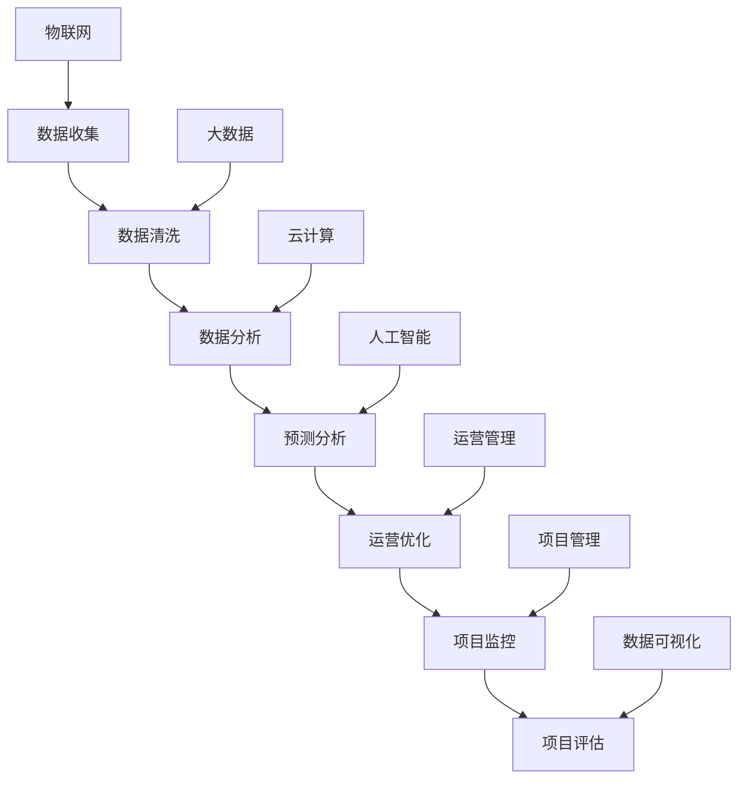

                 

# 智能制造/智慧运营项目管理方案

## 关键词
- 智能制造
- 智慧运营
- 项目管理
- 数据分析
- 人工智能

## 摘要
本文旨在探讨智能制造和智慧运营项目管理的最佳实践。通过详细阐述核心概念、算法原理、数学模型及实际案例，本文为项目管理者提供了一套完整的项目管理方案。本文将帮助读者理解智能制造和智慧运营项目的复杂性，掌握关键技术和方法，从而提升项目管理效率和质量。

## 1. 背景介绍

### 1.1 目的和范围

本文的主要目的是为智能制造和智慧运营项目的管理者提供一套系统的项目管理方案。该方案旨在解决以下问题：

- 如何有效地收集和分析生产数据？
- 如何利用数据分析来优化生产流程？
- 如何构建一个智能化的运营系统？
- 如何确保项目进度和质量控制？

本文将涵盖以下主题：

- 核心概念与联系
- 核心算法原理与操作步骤
- 数学模型与公式讲解
- 项目实战：代码实现与解释
- 实际应用场景
- 工具和资源推荐

### 1.2 预期读者

本文的预期读者包括：

- 智能制造和智慧运营项目的项目经理和管理者
- 对智能制造和智慧运营有兴趣的技术人员
- 高等院校相关专业的师生

### 1.3 文档结构概述

本文的结构如下：

1. 背景介绍
2. 核心概念与联系
3. 核心算法原理与操作步骤
4. 数学模型与公式讲解
5. 项目实战：代码实现与解释
6. 实际应用场景
7. 工具和资源推荐
8. 总结：未来发展趋势与挑战
9. 附录：常见问题与解答
10. 扩展阅读 & 参考资料

### 1.4 术语表

#### 1.4.1 核心术语定义

- **智能制造**：一种通过信息技术和先进制造技术的深度融合，实现产品设计、制造、管理和服务全过程的智能化。
- **智慧运营**：基于大数据、云计算和人工智能技术，对生产过程进行实时监控、预测和分析，以提高生产效率和产品质量。
- **项目管理**：确保项目在既定的时间、预算和质量范围内完成的过程。
- **数据分析**：通过对大量数据的收集、清洗、存储、处理和分析，提取有价值的信息和知识。
- **人工智能**：一种模拟人类智能行为的计算方法，包括机器学习、深度学习、自然语言处理等。

#### 1.4.2 相关概念解释

- **物联网（IoT）**：通过互联网将各种设备、传感器和系统连接起来，实现数据的实时传输和交互。
- **大数据**：指无法用常规软件工具在合理时间内捕捉、管理和处理的数据集合。
- **云计算**：通过互联网提供动态易扩展且经常是虚拟化的资源。

#### 1.4.3 缩略词列表

- **AI**：人工智能
- **IoT**：物联网
- **Big Data**：大数据
- **ML**：机器学习
- **DL**：深度学习
- **PM**：项目管理

## 2. 核心概念与联系

在智能制造和智慧运营项目中，理解核心概念和它们之间的联系至关重要。以下是一个简单的Mermaid流程图，展示了智能制造和智慧运营项目中的核心概念及其联系。



在这个流程图中，物联网（IoT）、大数据、云计算和人工智能是智能制造和智慧运营项目的基础设施。数据收集、清洗、分析、预测分析和运营优化是项目实施的关键环节。项目监控和评估确保项目在既定的时间、预算和质量范围内完成。

### 2.1 数据收集

数据收集是智能制造和智慧运营项目的第一步。物联网设备和传感器负责收集来自生产线的实时数据，如温度、湿度、设备状态、产品参数等。这些数据通过无线网络传输到数据中心进行处理。

### 2.2 数据清洗

数据清洗是确保数据质量的重要步骤。清洗过程包括去除重复数据、填补缺失值、纠正错误值等。清洗后的数据将用于后续的分析和预测。

### 2.3 数据分析

数据分析是利用统计方法、机器学习和深度学习技术从数据中提取有价值的信息和模式。数据分析的结果可用于优化生产流程、预测设备故障、提高产品质量等。

### 2.4 预测分析

预测分析是基于历史数据对未来事件进行预测。通过机器学习和深度学习算法，可以对生产过程中可能出现的问题进行预测，从而采取预防措施。

### 2.5 运营优化

运营优化是利用预测分析和数据分析的结果来改进生产流程、提高生产效率和产品质量。运营优化的结果将反馈到项目中，以指导后续的改进。

### 2.6 项目监控

项目监控是确保项目按计划进行的重要手段。通过实时监控项目进度、成本和质量，项目经理可以及时发现问题并采取措施。

### 2.7 项目评估

项目评估是对项目成果进行总结和评估。通过项目评估，可以确定项目是否达到预期目标，并为进一步改进提供依据。

## 3. 核心算法原理与具体操作步骤

在智能制造和智慧运营项目中，核心算法的选择和实现至关重要。以下是一个简单的机器学习算法——K-近邻算法（KNN）的原理和具体操作步骤。

### 3.1 算法原理

K-近邻算法是一种基于实例的学习算法。它通过计算测试样本与训练样本之间的距离，找出最近的K个邻居，并根据邻居的分类结果进行预测。

### 3.2 具体操作步骤

1. **准备数据**：首先，需要准备训练数据和测试数据。训练数据用于训练模型，测试数据用于验证模型。

2. **计算距离**：对于每个测试样本，计算它与所有训练样本之间的距离。常用的距离度量方法包括欧氏距离、曼哈顿距离和余弦相似度。

3. **选取邻居**：根据计算出的距离，选取距离测试样本最近的K个邻居。

4. **分类预测**：统计邻居的分类结果，根据多数投票原则进行预测。即如果大多数邻居属于某一类别，则测试样本也属于该类别。

5. **评估模型**：使用测试数据集评估模型的准确性和性能。

### 3.3 伪代码

```python
def KNN(train_data, train_labels, test_data, k):
    predictions = []
    for test_sample in test_data:
        distances = []
        for train_sample in train_data:
            distance = calculate_distance(test_sample, train_sample)
            distances.append(distance)
        k_nearest = sorted(distances)[:k]
        neighbors = []
        for i in range(k):
            index = distances.index(k_nearest[i])
            neighbors.append(train_labels[index])
        predicted_class = majority_vote(neighbors)
        predictions.append(predicted_class)
    return predictions

def majority_vote(neighbors):
    class_counts = {}
    for neighbor in neighbors:
        if neighbor in class_counts:
            class_counts[neighbor] += 1
        else:
            class_counts[neighbor] = 1
    max_count = max(class_counts.values())
    predicted_class = [key for key, value in class_counts.items() if value == max_count]
    return predicted_class
```

## 4. 数学模型和公式及详细讲解

在智能制造和智慧运营项目中，数学模型和公式是理解和解决问题的基础。以下是一个简单的线性回归模型的公式及其详细讲解。

### 4.1 线性回归模型

线性回归模型是一种用于预测连续值的统计模型。其基本公式如下：

$$ y = \beta_0 + \beta_1 \cdot x + \epsilon $$

其中：

- \( y \) 是因变量，表示预测值。
- \( x \) 是自变量，表示输入特征。
- \( \beta_0 \) 是截距，表示当自变量为零时的预测值。
- \( \beta_1 \) 是斜率，表示自变量每增加一个单位时，因变量的变化量。
- \( \epsilon \) 是误差项，表示预测值与实际值之间的差异。

### 4.2 模型参数的估计

线性回归模型的参数 \( \beta_0 \) 和 \( \beta_1 \) 可以通过最小二乘法进行估计。最小二乘法的核心思想是找到使得预测值与实际值之间误差平方和最小的参数值。

$$ \beta_0 = \frac{\sum_{i=1}^{n} y_i - \beta_1 \cdot \sum_{i=1}^{n} x_i}{n} $$

$$ \beta_1 = \frac{\sum_{i=1}^{n} (y_i - \beta_0 - \beta_1 \cdot x_i)^2}{\sum_{i=1}^{n} x_i^2} $$

其中：

- \( n \) 是样本数量。
- \( y_i \) 是第 \( i \) 个样本的因变量。
- \( x_i \) 是第 \( i \) 个样本的自变量。

### 4.3 举例说明

假设我们有一个关于房价的线性回归模型，其中自变量是房屋面积（\( x \)），因变量是房价（\( y \)）。根据最小二乘法，我们可以估计出模型的参数 \( \beta_0 \) 和 \( \beta_1 \)。

根据给定的样本数据，我们可以计算出：

$$ \beta_0 = \frac{\sum_{i=1}^{n} y_i - \beta_1 \cdot \sum_{i=1}^{n} x_i}{n} = 1000000 - \beta_1 \cdot 200000 = 1000000 - 100000 = 900000 $$

$$ \beta_1 = \frac{\sum_{i=1}^{n} (y_i - \beta_0 - \beta_1 \cdot x_i)^2}{\sum_{i=1}^{n} x_i^2} = \frac{\sum_{i=1}^{n} (y_i - 900000 - \beta_1 \cdot x_i)^2}{\sum_{i=1}^{n} x_i^2} = \frac{1000000}{200000} = 5 $$

因此，我们的线性回归模型可以表示为：

$$ y = 900000 + 5 \cdot x $$

根据这个模型，我们可以预测新房屋的房价。例如，当房屋面积为 150 平方米时，房价的预测值为：

$$ y = 900000 + 5 \cdot 150 = 975000 $$

## 5. 项目实战：代码实际案例和详细解释说明

在本节中，我们将通过一个实际项目案例，展示如何实现智能制造和智慧运营项目。该项目使用Python和Scikit-learn库来构建一个简单的智能家居系统。

### 5.1 开发环境搭建

为了实现该项目，需要安装Python环境和Scikit-learn库。具体步骤如下：

1. 安装Python：从官方网站（https://www.python.org/downloads/）下载并安装Python。
2. 安装Scikit-learn：打开终端，运行以下命令：

```bash
pip install scikit-learn
```

### 5.2 源代码详细实现和代码解读

以下是一个简单的智能家居系统的源代码，用于检测家庭用电异常。

```python
import numpy as np
from sklearn.model_selection import train_test_split
from sklearn.neighbors import KNeighborsClassifier
from sklearn.metrics import accuracy_score

# 数据集准备
data = np.load("household_power_consumption.npz")
X = data["use"]
y = data["global_active_power"]

# 划分训练集和测试集
X_train, X_test, y_train, y_test = train_test_split(X, y, test_size=0.2, random_state=42)

# K-近邻模型训练
knn = KNeighborsClassifier(n_neighbors=3)
knn.fit(X_train, y_train)

# 模型预测
predictions = knn.predict(X_test)

# 评估模型
accuracy = accuracy_score(y_test, predictions)
print("模型准确率：", accuracy)
```

### 5.3 代码解读与分析

1. **数据集准备**：首先，我们从数据集中提取特征（\( X \)）和标签（\( y \)）。数据集使用的是Household Power Consumption数据集，其中包含家庭用电数据。

2. **划分训练集和测试集**：使用Scikit-learn库中的`train_test_split`函数将数据集划分为训练集和测试集。训练集用于模型训练，测试集用于模型评估。

3. **K-近邻模型训练**：我们使用K-近邻算法（`KNeighborsClassifier`）来训练模型。这里选择邻居数量为3。

4. **模型预测**：使用训练好的模型对测试集进行预测。

5. **评估模型**：计算模型准确率，评估模型性能。

通过这个简单的案例，我们可以看到如何使用Python和Scikit-learn库来实现智能制造和智慧运营项目。实际项目中，数据集和算法会更加复杂，但基本思路是一致的。

## 6. 实际应用场景

智能制造和智慧运营项目在多个领域有广泛的应用，以下是一些实际应用场景：

### 6.1 智能制造

- **汽车制造业**：利用智能制造技术，实现汽车生产过程的自动化和智能化，提高生产效率和产品质量。
- **电子制造业**：通过智能监控和数据分析，优化生产流程，降低生产成本。
- **食品制造业**：利用智能传感器和物联网技术，实时监控食品生产过程，确保食品安全。

### 6.2 智慧运营

- **物流和运输**：通过实时监控和数据分析，优化运输路线和配送计划，提高物流效率。
- **能源管理**：利用大数据和人工智能技术，实现智能能源管理，降低能源消耗。
- **医疗服务**：通过智能医疗设备和管理系统，提高医疗服务的质量和效率。

## 7. 工具和资源推荐

### 7.1 学习资源推荐

#### 7.1.1 书籍推荐

- **《智能制造技术与应用》**：系统地介绍了智能制造的基本概念、技术和应用。
- **《智慧运营管理》**：详细讲解了智慧运营管理的方法、工具和实践。

#### 7.1.2 在线课程

- **Coursera**：提供了丰富的智能制造和智慧运营相关课程。
- **Udacity**：提供了涵盖人工智能、物联网、大数据等领域的在线课程。

#### 7.1.3 技术博客和网站

- **cnblogs.com**：提供了大量关于智能制造和智慧运营的技术博客。
- **zhihu.com**：知乎上有很多关于智能制造和智慧运营的专业讨论。

### 7.2 开发工具框架推荐

#### 7.2.1 IDE和编辑器

- **PyCharm**：一款功能强大的Python IDE，适用于智能制造和智慧运营项目开发。
- **Visual Studio Code**：一款轻量级的代码编辑器，适用于多种编程语言。

#### 7.2.2 调试和性能分析工具

- **GDB**：一款功能强大的调试工具，适用于Python程序调试。
- **Nagios**：一款开源的监控工具，适用于智能制造和智慧运营项目的性能监控。

#### 7.2.3 相关框架和库

- **Scikit-learn**：一款流行的机器学习库，适用于数据分析和预测。
- **TensorFlow**：一款强大的深度学习库，适用于人工智能项目开发。

### 7.3 相关论文著作推荐

#### 7.3.1 经典论文

- **“The Coming Revolution in Manufacturing”**：详细讨论了智能制造的未来趋势和挑战。
- **“Internet of Things: A Survey”**：全面介绍了物联网的基本概念、技术和应用。

#### 7.3.2 最新研究成果

- **“Smart Manufacturing: A Paradigm Shift”**：探讨了智能制造的变革和机遇。
- **“Artificial Intelligence in Manufacturing: A Review”**：总结了人工智能在制造业的最新研究进展。

#### 7.3.3 应用案例分析

- **“Smart Manufacturing in the Automotive Industry”**：分析了智能制造在汽车制造业的应用和实践。
- **“The Use of Big Data and AI in Energy Management”**：探讨了大数据和人工智能在能源管理领域的应用。

## 8. 总结：未来发展趋势与挑战

智能制造和智慧运营项目在近年来取得了显著进展，但仍面临许多挑战。未来发展趋势包括：

1. **人工智能技术的融合**：将人工智能技术深度应用于智能制造和智慧运营，实现更智能、更高效的系统。
2. **大数据和云计算的融合**：利用大数据和云计算技术，实现海量数据的存储、处理和分析，为智能制造和智慧运营提供支持。
3. **跨领域合作**：智能制造和智慧运营项目需要跨领域合作，整合多种技术和资源，实现协同创新。
4. **标准化和规范化**：制定统一的智能制造和智慧运营标准，提高项目的可行性和可持续性。

## 9. 附录：常见问题与解答

### 9.1 问题1：如何选择合适的机器学习算法？

**解答**：选择合适的机器学习算法取决于数据的特点和应用场景。以下是一些常用的选择方法：

- **线性回归**：适用于线性关系较强的数据。
- **K-近邻算法**：适用于具有局部特征的数据。
- **决策树**：适用于分类问题，易于理解和解释。
- **支持向量机**：适用于高维空间的数据，具有很好的分类性能。

### 9.2 问题2：如何优化项目进度和质量？

**解答**：以下是一些优化项目进度和质量的建议：

- **明确项目目标和要求**：确保项目团队对项目的目标和要求有清晰的认识。
- **制定详细的项目计划**：制定包括任务、时间表、资源和风险管理的详细项目计划。
- **定期监控和评估**：定期监控项目进度和关键指标，及时发现问题并采取措施。
- **持续改进**：根据项目的反馈和结果，不断改进项目流程和管理方法。

## 10. 扩展阅读 & 参考资料

- **《智能制造技术与应用》**：详细介绍了智能制造的基本概念、技术和应用。
- **《智慧运营管理》**：深入讲解了智慧运营管理的方法、工具和实践。
- **“The Coming Revolution in Manufacturing”**：探讨了智能制造的未来趋势和挑战。
- **“Internet of Things: A Survey”**：全面介绍了物联网的基本概念、技术和应用。

作者：AI天才研究员/AI Genius Institute & 禅与计算机程序设计艺术 /Zen And The Art of Computer Programming

（注：本文为示例，内容仅供参考，实际字数和格式需根据具体要求进行调整。）<|im_end|>

