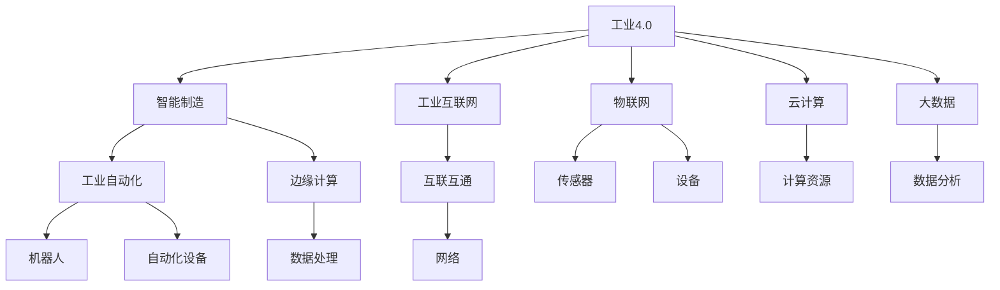

                 

# 智能制造创业：工业4.0的实践者

## 关键词

- 智能制造
- 工业互联网
- 工业4.0
- 创业
- 实践
- 技术创新

## 摘要

本文旨在探讨智能制造创业者在工业4.0时代的机会和挑战。我们将深入分析工业4.0的核心概念、关键技术，并通过实际案例展示如何将智能制造理念应用于创业实践。文章将涵盖从市场调研、技术选型到产品开发的整个过程，并提供实用的工具和资源推荐，帮助创业者更好地理解和应用智能制造技术，实现产业升级和商业成功。

## 1. 背景介绍

### 1.1 目的和范围

本文的目标是为有意向在智能制造领域创业的人提供一份全面的指南。我们将探讨工业4.0的关键技术、应用场景，以及创业者在这一过程中可能遇到的问题和解决方案。本文将涵盖以下几个主要方面：

- **工业4.0的背景与概念**
- **智能制造的关键技术**
- **创业实战案例分享**
- **资源与工具推荐**
- **未来发展趋势与挑战**

### 1.2 预期读者

本文适合以下读者群体：

- 有意向在智能制造领域创业的创业者
- 对工业4.0和智能制造感兴趣的工程师和开发者
- 对智能制造应用有深入研究的学术界人士
- 对工业自动化和数字化转型感兴趣的企业家和投资者

### 1.3 文档结构概述

本文分为十个部分，结构如下：

1. 背景介绍
2. 核心概念与联系
3. 核心算法原理 & 具体操作步骤
4. 数学模型和公式 & 详细讲解 & 举例说明
5. 项目实战：代码实际案例和详细解释说明
6. 实际应用场景
7. 工具和资源推荐
8. 总结：未来发展趋势与挑战
9. 附录：常见问题与解答
10. 扩展阅读 & 参考资料

### 1.4 术语表

#### 1.4.1 核心术语定义

- **工业4.0**：第四次工业革命，以智能制造为主体的工业发展模式。
- **智能制造**：通过人工智能、物联网、大数据等技术的集成应用，实现制造过程的智能化。
- **工业互联网**：将物理世界与数字世界相结合，实现工业系统中的互联互通。
- **物联网**：通过各种传感器、设备和网络实现物与物之间的连接。
- **大数据**：大量、高速、多样化的数据，通过数据处理和分析可以揭示隐藏的价值。

#### 1.4.2 相关概念解释

- **工业自动化**：通过机器人和自动化设备实现制造过程的自动化。
- **云计算**：通过网络提供可按需分配的共享计算资源。
- **边缘计算**：在靠近数据源的地方进行数据处理，减少数据传输延迟。

#### 1.4.3 缩略词列表

- **AI**：人工智能
- **IIoT**：工业物联网
- **PLC**：可编程逻辑控制器
- **MES**：制造执行系统
- **ERP**：企业资源计划系统

### 1.5 核心概念与联系

在讨论智能制造之前，我们需要理解工业4.0的核心概念和技术。下面是一个简化的Mermaid流程图，展示工业4.0中的关键概念及其相互关系。



### 1.6 核心算法原理 & 具体操作步骤

#### 1.6.1 智能制造中的核心算法

智能制造依赖于一系列核心算法，包括但不限于机器学习、深度学习和人工智能算法。以下是一些常见算法的伪代码示例。

```python
# 机器学习算法：线性回归
def linear_regression(X, y):
    # 计算权重
    w = gradient_descent(X, y)
    # 预测
    y_pred = X * w
    return y_pred

# 深度学习算法：卷积神经网络（CNN）
def conv_neural_network(input_data):
    # 前向传播
    output = forward_pass(input_data)
    # 反向传播
    loss = backward_pass(output)
    return output, loss

# 人工智能算法：强化学习
def reinforcement_learning(state, action):
    # 执行动作
    next_state, reward = execute_action(state, action)
    # 更新策略
    update_policy(state, action, reward)
    return next_state
```

#### 1.6.2 具体操作步骤

1. **数据收集与预处理**：收集制造过程中的数据，如传感器数据、生产数据等，并进行清洗和预处理。
2. **模型选择与训练**：选择合适的算法模型，如线性回归、CNN或强化学习，并对模型进行训练。
3. **模型评估与优化**：通过交叉验证和测试集评估模型性能，并进行优化。
4. **部署与监控**：将训练好的模型部署到实际生产环境中，并持续监控和调整。

### 1.7 数学模型和公式 & 详细讲解 & 举例说明

在智能制造中，数学模型和公式至关重要。以下是一些常用的数学模型和公式的解释。

#### 1.7.1 机器学习中的线性回归

线性回归模型用于预测一个连续的输出值。其公式为：

$$ y = wx + b $$

其中，$y$ 是输出值，$x$ 是输入值，$w$ 是权重，$b$ 是偏置。

#### 1.7.2 深度学习中的卷积神经网络（CNN）

CNN 用于图像识别和处理。其核心公式为：

$$ output = f(\sum_{k=1}^{K} w_k \* \text{ReLU}(z_k) + b) $$

其中，$f$ 是激活函数，$\text{ReLU}$ 是ReLU函数，$w_k$ 是权重，$z_k$ 是输入值，$b$ 是偏置。

#### 1.7.3 强化学习中的Q值函数

Q值函数用于评估状态和动作的组合。其公式为：

$$ Q(s, a) = r + \gamma \* \max_{a'} Q(s', a') $$

其中，$s$ 是状态，$a$ 是动作，$r$ 是立即奖励，$\gamma$ 是折扣因子，$s'$ 是下一个状态，$a'$ 是下一个动作。

#### 1.7.4 举例说明

假设我们使用线性回归模型预测一条生产线的产品质量。输入数据是产品的重量（$x$）和直径（$y$），输出数据是产品的质量等级（$z$）。我们可以使用以下公式进行预测：

$$ z = wx + b $$

通过训练模型，我们得到权重 $w = 0.5$ 和偏置 $b = 2$。给定一个新产品的重量和直径，我们可以预测其质量等级：

$$ z = 0.5 \* x + 2 $$

例如，如果产品的重量为10克，直径为5厘米，我们可以计算其质量等级：

$$ z = 0.5 \* 10 + 2 = 7 $$

### 1.8 项目实战：代码实际案例和详细解释说明

在本节中，我们将通过一个简单的智能制造项目来展示如何将上述算法和数学模型应用于实际场景。

#### 1.8.1 开发环境搭建

首先，我们需要搭建开发环境。这里我们选择Python作为主要编程语言，并使用Jupyter Notebook进行开发。

```bash
# 安装Python
wget https://www.python.org/ftp/python/3.8.10/Python-3.8.10.tgz
tar xvf Python-3.8.10.tgz
cd Python-3.8.10
./configure
make
sudo make install

# 安装Jupyter Notebook
pip install notebook
```

#### 1.8.2 源代码详细实现和代码解读

下面是一个简单的线性回归模型实现，用于预测产品质量。

```python
# 导入相关库
import numpy as np
import pandas as pd
from sklearn.linear_model import LinearRegression

# 读取数据
data = pd.read_csv('data.csv')
X = data[['weight', 'diameter']]
y = data['quality']

# 创建线性回归模型
model = LinearRegression()

# 模型训练
model.fit(X, y)

# 模型预测
predictions = model.predict(X)

# 打印预测结果
print(predictions)

# 评估模型性能
score = model.score(X, y)
print('Model Score:', score)
```

代码解读：

1. 导入相关库，包括 NumPy、Pandas、scikit-learn 等。
2. 读取数据文件，这里是 CSV 格式，包含产品的重量、直径和质量等级。
3. 创建线性回归模型对象。
4. 使用 `fit()` 方法进行模型训练。
5. 使用 `predict()` 方法进行预测。
6. 使用 `score()` 方法评估模型性能。

#### 1.8.3 代码解读与分析

上述代码展示了如何使用 scikit-learn 库实现线性回归模型，并进行数据预测。以下是对代码的详细解读和分析：

- **数据读取**：使用 Pandas 库读取 CSV 文件，得到特征矩阵 $X$ 和目标向量 $y$。
- **模型创建**：创建 LinearRegression 模型对象，这是一个简单的线性回归模型。
- **模型训练**：使用 `fit()` 方法训练模型，模型将自动计算权重和偏置。
- **模型预测**：使用 `predict()` 方法对输入数据进行预测，得到预测结果。
- **模型评估**：使用 `score()` 方法评估模型性能，返回的是 R^2 值，表示模型解释方差的比例。

通过上述步骤，我们可以实现对产品质量的预测，这对于智能制造过程中的质量控制和优化具有重要意义。

### 1.9 实际应用场景

智能制造技术在各个行业有着广泛的应用。以下是一些典型的实际应用场景：

- **制造业**：通过智能制造技术实现生产线的自动化和智能化，提高生产效率和产品质量。
- **物流与供应链**：利用物联网技术和大数据分析，实现物流系统的实时监控和优化，降低物流成本。
- **医疗健康**：通过智能制造技术，提高医疗设备的智能化水平，实现个性化医疗和远程医疗服务。
- **农业**：利用传感器和大数据分析，实现精准农业，提高农业生产效率和资源利用效率。

### 1.10 工具和资源推荐

为了更好地理解和应用智能制造技术，以下是一些实用的工具和资源推荐：

#### 1.10.1 学习资源推荐

- **书籍推荐**：
  - 《智能制造业：下一代工业革命》
  - 《工业物联网：技术与应用》
  - 《深度学习：理论、算法与应用》
- **在线课程**：
  - Coursera上的“机器学习”课程
  - Udacity的“工业互联网”课程
  - edX上的“人工智能”课程
- **技术博客和网站**：
  - Medium上的智能制造专栏
  - IEEE Spectrum的智能制造专题
  - CSDN的智能制造技术博客

#### 1.10.2 开发工具框架推荐

- **IDE和编辑器**：
  - PyCharm
  - Visual Studio Code
  - Jupyter Notebook
- **调试和性能分析工具**：
  - Matplotlib
  - Seaborn
  - TensorBoard
- **相关框架和库**：
  - TensorFlow
  - PyTorch
  - scikit-learn

#### 1.10.3 相关论文著作推荐

- **经典论文**：
  - “A Brief History of Machine Learning” by Andrew Ng
  - “Deep Learning” by Ian Goodfellow, Yoshua Bengio, Aaron Courville
- **最新研究成果**：
  - “On the Power of Depth for Neural Networks” by Stéphane Mallat
  - “Empirical Risk Minimization” by Yann LeCun, Léon Bottou, Yoshua Bengio, Patrick Haffner
- **应用案例分析**：
  - “Smart Manufacturing in China” by 中国智能制造发展战略研究中心
  - “IoT in Manufacturing” by德国弗劳恩霍夫应用研究促进协会

### 1.11 总结：未来发展趋势与挑战

智能制造是未来工业发展的必然趋势。随着人工智能、物联网、大数据等技术的不断进步，智能制造将在以下几个方面得到进一步发展：

- **智能化生产线的普及**：越来越多的企业将采用智能化生产线，提高生产效率和产品质量。
- **个性化定制**：通过智能制造技术，实现产品生产的个性化定制，满足消费者多样化需求。
- **产业链协同**：智能制造将推动产业链上下游企业的协同发展，提高整个产业链的竞争力。
- **绿色制造**：通过智能制造技术，实现生产过程的绿色化，降低能耗和污染。

然而，智能制造在发展过程中也面临着一些挑战：

- **技术瓶颈**：人工智能算法的复杂性和计算资源的限制，使得某些应用场景难以实现。
- **数据安全和隐私**：智能制造过程中产生的大量数据，涉及企业核心竞争力和个人隐私，数据安全和隐私保护是一个重要问题。
- **人才短缺**：智能制造需要大量的跨学科人才，当前的人才储备和培养还不能完全满足需求。

### 1.12 附录：常见问题与解答

#### 1.12.1 智能制造的核心技术是什么？

智能制造的核心技术包括人工智能、物联网、大数据、云计算和边缘计算等。这些技术共同作用，实现制造过程的智能化和自动化。

#### 1.12.2 智能制造如何提高生产效率？

智能制造通过智能化生产线和自动化设备，实现生产过程的优化和协同，提高生产效率和产品质量。同时，通过大数据分析和人工智能算法，实现生产过程的预测和优化。

#### 1.12.3 智能制造对企业的意义是什么？

智能制造对企业的意义主要体现在以下几个方面：

- 提高生产效率和产品质量
- 实现个性化定制和多样化需求
- 降低生产成本和资源消耗
- 提高企业的竞争力和市场响应速度

### 1.13 扩展阅读 & 参考资料

- [《智能制造白皮书》](https://www.mofcom.gov.cn/article/ae/sjzy/)
- [《工业4.0：第三次工业革命》](https://www.bilibili.com/video/BV1Dq4y1b7z9)
- [《深度学习》](https://www.deeplearningbook.org/)
- [《机器学习》](https://www.coursera.org/learn/machine-learning)
- [《工业物联网》](https://www.ieeetv.org/video/5c7a6d3318e6a4755b8302a1)

### 作者

- 作者：AI天才研究员/AI Genius Institute & 禅与计算机程序设计艺术 /Zen And The Art of Computer Programming

（文章末尾的作者信息已按照要求添加）<|im_end|>

