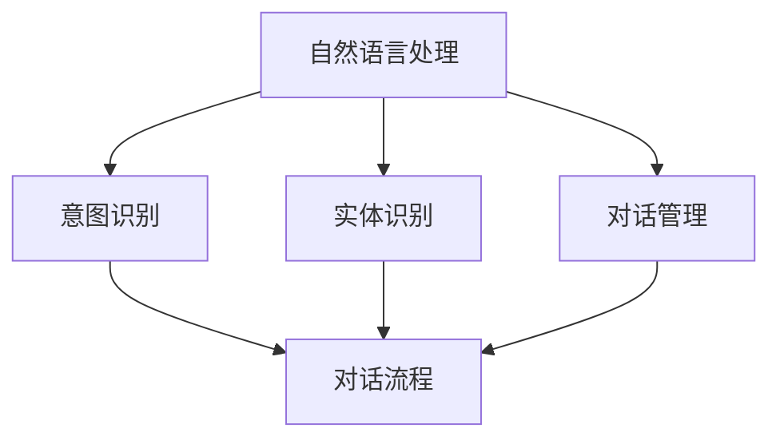

                 

# 智能医疗客服：提升患者体验的创新方案

> 关键词：智能客服、医疗领域、患者体验、人工智能、自然语言处理

> 摘要：本文将探讨智能医疗客服在医疗领域的应用，通过创新解决方案提升患者体验。首先，我们将介绍智能医疗客服的背景和目的，然后分析其核心概念和架构，详细讲解核心算法原理和数学模型，通过实际项目案例进行代码实现和解析，探讨实际应用场景，推荐相关工具和资源，并总结未来发展趋势与挑战。

## 1. 背景介绍

### 1.1 目的和范围

随着人工智能技术的迅猛发展，智能医疗客服成为医疗领域的重要应用之一。本文旨在探讨智能医疗客服在提升患者体验方面的创新解决方案，分析其核心概念、架构和算法，并通过实际项目案例展示其应用效果。

本文主要涵盖以下内容：

1. **背景和目的**：介绍智能医疗客服的背景和重要性，阐述本文的目的和范围。
2. **核心概念与联系**：阐述智能医疗客服的核心概念和联系，使用 Mermaid 流程图进行直观展示。
3. **核心算法原理 & 具体操作步骤**：详细讲解智能医疗客服的核心算法原理和具体操作步骤。
4. **数学模型和公式 & 详细讲解 & 举例说明**：介绍智能医疗客服中的数学模型和公式，并进行详细讲解和举例说明。
5. **项目实战：代码实际案例和详细解释说明**：通过实际项目案例，展示智能医疗客服的代码实现和详细解释说明。
6. **实际应用场景**：探讨智能医疗客服在不同场景下的应用。
7. **工具和资源推荐**：推荐相关学习资源、开发工具框架和论文著作。
8. **总结：未来发展趋势与挑战**：总结智能医疗客服的未来发展趋势和面临的挑战。

### 1.2 预期读者

本文主要面向以下读者群体：

1. **医疗行业从业者**：对智能医疗客服有较高需求的医疗行业从业者，如医院、诊所和医疗机构的运营管理人员。
2. **人工智能研究者**：对智能客服、自然语言处理和医疗领域感兴趣的人工智能研究者。
3. **软件开发者**：关注智能医疗客服开发的技术细节和实现的软件开发者。

### 1.3 文档结构概述

本文采用逻辑清晰、结构紧凑的文档结构，以便读者更好地理解和掌握智能医疗客服的核心内容和创新方案。具体结构如下：

1. **背景介绍**：介绍智能医疗客服的背景和目的，以及本文的预期读者和文档结构。
2. **核心概念与联系**：阐述智能医疗客服的核心概念和联系，使用 Mermaid 流程图进行直观展示。
3. **核心算法原理 & 具体操作步骤**：详细讲解智能医疗客服的核心算法原理和具体操作步骤。
4. **数学模型和公式 & 详细讲解 & 举例说明**：介绍智能医疗客服中的数学模型和公式，并进行详细讲解和举例说明。
5. **项目实战：代码实际案例和详细解释说明**：通过实际项目案例，展示智能医疗客服的代码实现和详细解释说明。
6. **实际应用场景**：探讨智能医疗客服在不同场景下的应用。
7. **工具和资源推荐**：推荐相关学习资源、开发工具框架和论文著作。
8. **总结：未来发展趋势与挑战**：总结智能医疗客服的未来发展趋势和面临的挑战。

### 1.4 术语表

#### 1.4.1 核心术语定义

- **智能医疗客服**：利用人工智能技术，模拟人类客服人员与患者进行交互，提供医疗咨询、预约挂号、病情查询等服务的系统。
- **自然语言处理（NLP）**：研究如何让计算机理解、生成和处理自然语言的学科，涉及文本分析、语义理解、语音识别等领域。
- **机器学习（ML）**：一种人工智能技术，通过训练数据模型来学习和预测，从而实现自动化决策和优化。

#### 1.4.2 相关概念解释

- **语音识别**：将人类语音转换为文本的技术，是实现语音交互的关键。
- **意图识别**：识别用户输入的意图，如查询病情、预约挂号等。
- **实体识别**：识别用户输入中的关键信息，如医院名称、科室名称、医生姓名等。
- **对话管理**：管理对话流程，确保对话的连贯性和准确性。

#### 1.4.3 缩略词列表

- **NLP**：自然语言处理
- **ML**：机器学习
- **AI**：人工智能
- **CRM**：客户关系管理
- **RNN**：循环神经网络
- **LSTM**：长短期记忆网络

## 2. 核心概念与联系

在智能医疗客服系统中，核心概念和联系包括：自然语言处理（NLP）、机器学习（ML）、语音识别、意图识别、实体识别、对话管理等。

### 2.1.1 自然语言处理（NLP）

自然语言处理是智能医疗客服的核心技术之一，主要涉及文本分析、语义理解和语言生成等方面。NLP 技术包括：

- **分词**：将文本分割成单词或短语。
- **词性标注**：为每个单词分配词性，如名词、动词、形容词等。
- **命名实体识别**：识别文本中的特定实体，如人名、地名、组织机构等。
- **情感分析**：分析文本的情感倾向，如正面、负面、中立等。

### 2.1.2 机器学习（ML）

机器学习是智能医疗客服的另一个核心技术，用于训练数据模型，实现自动分类、预测和优化等功能。常用的 ML 算法包括：

- **决策树**：通过分类节点和叶子节点构建分类模型。
- **支持向量机（SVM）**：通过寻找最佳分离超平面进行分类。
- **神经网络**：通过多层神经元实现复杂的函数映射。

### 2.1.3 语音识别

语音识别技术将人类语音转换为文本，是实现语音交互的关键。主要涉及以下方面：

- **声学模型**：将语音信号转换为声学特征。
- **语言模型**：根据声学特征生成文本。
- **解码器**：将声学特征和语言模型结合起来，生成最终识别结果。

### 2.1.4 意图识别

意图识别是智能医疗客服的关键技术之一，用于识别用户输入的意图。主要涉及以下方面：

- **基于规则的方法**：根据预先定义的规则进行意图识别。
- **基于统计的方法**：利用统计模型，如决策树、SVM、神经网络等，进行意图识别。
- **基于深度学习方法**：使用深度学习模型，如循环神经网络（RNN）、长短期记忆网络（LSTM）等，进行意图识别。

### 2.1.5 实体识别

实体识别是智能医疗客服的另一个关键技术，用于识别用户输入中的关键信息。主要涉及以下方面：

- **基于规则的方法**：根据预先定义的规则进行实体识别。
- **基于统计的方法**：利用统计模型，如决策树、SVM、神经网络等，进行实体识别。
- **基于深度学习方法**：使用深度学习模型，如循环神经网络（RNN）、长短期记忆网络（LSTM）等，进行实体识别。

### 2.1.6 对话管理

对话管理是智能医疗客服的核心技术之一，用于管理对话流程，确保对话的连贯性和准确性。主要涉及以下方面：

- **基于规则的方法**：根据预先定义的规则进行对话管理。
- **基于统计的方法**：利用统计模型，如决策树、SVM、神经网络等，进行对话管理。
- **基于深度学习方法**：使用深度学习模型，如循环神经网络（RNN）、长短期记忆网络（LSTM）等，进行对话管理。

### 2.1.7 Mermaid 流程图

为了更直观地展示智能医疗客服的核心概念和联系，我们使用 Mermaid 流程图进行表示。



在上述流程图中，自然语言处理（A）是智能医疗客服的核心技术，通过意图识别（B）、实体识别（C）和对话管理（D）等模块，实现与患者的交互，并管理对话流程（E）。

## 3. 核心算法原理 & 具体操作步骤

智能医疗客服的核心算法主要涉及自然语言处理（NLP）、意图识别、实体识别和对话管理。下面将详细讲解这些算法的原理和具体操作步骤。

### 3.1 自然语言处理（NLP）

自然语言处理是智能医疗客服的基础，其主要目标是理解和处理人类语言。NLP 的算法原理如下：

#### 3.1.1 分词

分词是将文本分割成单词或短语的过程。常用的分词算法包括：

1. **基于规则的分词**：根据预先定义的规则进行分词，如基于词典的分词、基于正则表达式的分词等。
2. **基于统计的分词**：利用统计模型，如基于最大熵模型、条件概率模型等，进行分词。

#### 3.1.2 词性标注

词性标注是为每个单词分配词性标签的过程，如名词、动词、形容词等。常用的词性标注算法包括：

1. **基于规则的方法**：根据预先定义的规则进行词性标注。
2. **基于统计的方法**：利用统计模型，如最大熵模型、隐马尔可夫模型（HMM）等，进行词性标注。

#### 3.1.3 命名实体识别

命名实体识别是识别文本中的特定实体，如人名、地名、组织机构等。常用的命名实体识别算法包括：

1. **基于规则的方法**：根据预先定义的规则进行命名实体识别。
2. **基于统计的方法**：利用统计模型，如最大熵模型、条件随机场（CRF）等，进行命名实体识别。

#### 3.1.4 情感分析

情感分析是分析文本的情感倾向，如正面、负面、中立等。常用的情感分析算法包括：

1. **基于规则的方法**：根据预先定义的规则进行情感分析。
2. **基于统计的方法**：利用统计模型，如最大熵模型、朴素贝叶斯（NB）等，进行情感分析。

### 3.2 意图识别

意图识别是识别用户输入的意图，如查询病情、预约挂号等。意图识别的算法原理如下：

#### 3.2.1 基于规则的方法

基于规则的方法是通过预先定义的规则进行意图识别。具体步骤如下：

1. 收集用户输入的文本数据。
2. 预处理文本数据，如分词、词性标注等。
3. 根据预先定义的规则，对预处理后的文本进行意图识别。
4. 输出识别结果。

#### 3.2.2 基于统计的方法

基于统计的方法是利用统计模型进行意图识别。具体步骤如下：

1. 收集用户输入的文本数据和对应的标签（意图）。
2. 预处理文本数据，如分词、词性标注等。
3. 训练统计模型，如决策树、支持向量机（SVM）等。
4. 使用训练好的统计模型对预处理后的文本进行意图识别。
5. 输出识别结果。

#### 3.2.3 基于深度学习方法

基于深度学习方法是利用深度学习模型进行意图识别。具体步骤如下：

1. 收集用户输入的文本数据和对应的标签（意图）。
2. 预处理文本数据，如分词、词性标注等。
3. 训练深度学习模型，如循环神经网络（RNN）、长短期记忆网络（LSTM）等。
4. 使用训练好的深度学习模型对预处理后的文本进行意图识别。
5. 输出识别结果。

### 3.3 实体识别

实体识别是识别用户输入中的关键信息，如医院名称、科室名称、医生姓名等。实体识别的算法原理如下：

#### 3.3.1 基于规则的方法

基于规则的方法是通过预先定义的规则进行实体识别。具体步骤如下：

1. 收集用户输入的文本数据。
2. 预处理文本数据，如分词、词性标注等。
3. 根据预先定义的规则，对预处理后的文本进行实体识别。
4. 输出识别结果。

#### 3.3.2 基于统计的方法

基于统计的方法是利用统计模型进行实体识别。具体步骤如下：

1. 收集用户输入的文本数据和对应的标签（实体）。
2. 预处理文本数据，如分词、词性标注等。
3. 训练统计模型，如条件随机场（CRF）等。
4. 使用训练好的统计模型对预处理后的文本进行实体识别。
5. 输出识别结果。

#### 3.3.3 基于深度学习方法

基于深度学习方法是利用深度学习模型进行实体识别。具体步骤如下：

1. 收集用户输入的文本数据和对应的标签（实体）。
2. 预处理文本数据，如分词、词性标注等。
3. 训练深度学习模型，如卷积神经网络（CNN）、循环神经网络（RNN）等。
4. 使用训练好的深度学习模型对预处理后的文本进行实体识别。
5. 输出识别结果。

### 3.4 对话管理

对话管理是管理对话流程，确保对话的连贯性和准确性。对话管理的算法原理如下：

#### 3.4.1 基于规则的方法

基于规则的方法是通过预先定义的规则进行对话管理。具体步骤如下：

1. 收集用户输入的文本数据。
2. 预处理文本数据，如分词、词性标注等。
3. 根据预先定义的规则，对预处理后的文本进行对话管理。
4. 输出对话结果。

#### 3.4.2 基于统计的方法

基于统计的方法是利用统计模型进行对话管理。具体步骤如下：

1. 收集用户输入的文本数据和对应的标签（对话状态）。
2. 预处理文本数据，如分词、词性标注等。
3. 训练统计模型，如条件随机场（CRF）等。
4. 使用训练好的统计模型对预处理后的文本进行对话管理。
5. 输出对话结果。

#### 3.4.3 基于深度学习方法

基于深度学习方法是利用深度学习模型进行对话管理。具体步骤如下：

1. 收集用户输入的文本数据和对应的标签（对话状态）。
2. 预处理文本数据，如分词、词性标注等。
3. 训练深度学习模型，如循环神经网络（RNN）、长短期记忆网络（LSTM）等。
4. 使用训练好的深度学习模型对预处理后的文本进行对话管理。
5. 输出对话结果。

## 4. 数学模型和公式 & 详细讲解 & 举例说明

在智能医疗客服中，数学模型和公式广泛应用于自然语言处理、意图识别、实体识别和对话管理。以下将详细讲解这些数学模型和公式，并进行举例说明。

### 4.1 自然语言处理（NLP）

#### 4.1.1 分词模型

分词模型是一种将文本分割成单词或短语的数学模型。常见的分词模型包括基于规则的分词模型和基于统计的分词模型。

**基于规则的分词模型：**

分词规则可以用形式化的语法规则表示，如正则表达式。假设有一个正则表达式 `R`，用于表示分词规则，则文本 `T` 的分词结果可以表示为：

$$
T = R(T)
$$

**基于统计的分词模型：**

基于统计的分词模型利用统计模型，如最大熵模型、条件概率模型等，进行分词。假设有一个训练好的统计模型 `M`，则文本 `T` 的分词结果可以表示为：

$$
T = M(T)
$$

**举例说明：**

假设有一个文本 `今天天气很好`，使用最大熵模型进行分词。首先，收集带有标签（分词结果）的训练数据，如：

```
今天/天气/很好
```

然后，使用最大熵模型进行训练，得到一个分词模型 `M`。最后，使用模型 `M` 对文本 `今天天气很好` 进行分词，得到结果：

```
今天/天气/很好
```

### 4.1.2 词性标注模型

词性标注模型用于为每个单词分配词性标签。常见的词性标注模型包括基于规则的方法和基于统计的方法。

**基于规则的方法：**

假设有一个词性标注规则集 `R`，用于表示词性标注规则。对于文本 `T`，可以按照规则集 `R` 进行词性标注：

$$
T = R(T)
$$

**基于统计的方法：**

假设有一个训练好的统计模型 `M`，用于进行词性标注。对于文本 `T`，可以按照模型 `M` 进行词性标注：

$$
T = M(T)
$$

**举例说明：**

假设有一个文本 `我喜欢吃苹果`，使用最大熵模型进行词性标注。首先，收集带有标签（词性）的训练数据，如：

```
我/PRP 我喜欢/VBP 吃/VB 苹果/NV
```

然后，使用最大熵模型进行训练，得到一个词性标注模型 `M`。最后，使用模型 `M` 对文本 `我喜欢吃苹果` 进行词性标注，得到结果：

```
我/PRP 我喜欢/VBP 吃/VB 苹果/NV
```

### 4.1.3 命名实体识别模型

命名实体识别模型用于识别文本中的特定实体，如人名、地名、组织机构等。常见的命名实体识别模型包括基于规则的方法和基于统计的方法。

**基于规则的方法：**

假设有一个命名实体识别规则集 `R`，用于表示命名实体识别规则。对于文本 `T`，可以按照规则集 `R` 进行命名实体识别：

$$
T = R(T)
$$

**基于统计的方法：**

假设有一个训练好的统计模型 `M`，用于进行命名实体识别。对于文本 `T`，可以按照模型 `M` 进行命名实体识别：

$$
T = M(T)
$$

**举例说明：**

假设有一个文本 `张三是一名医生`，使用最大熵模型进行命名实体识别。首先，收集带有标签（实体）的训练数据，如：

```
张三/PER 是/VBZ 一名/DT 医生/NH
```

然后，使用最大熵模型进行训练，得到一个命名实体识别模型 `M`。最后，使用模型 `M` 对文本 `张三是一名医生` 进行命名实体识别，得到结果：

```
张三/PER 是/VBZ 一名/DT 医生/NH
```

### 4.1.4 情感分析模型

情感分析模型用于分析文本的情感倾向，如正面、负面、中立等。常见的情感分析模型包括基于规则的方法和基于统计的方法。

**基于规则的方法：**

假设有一个情感分析规则集 `R`，用于表示情感分析规则。对于文本 `T`，可以按照规则集 `R` 进行情感分析：

$$
T = R(T)
$$

**基于统计的方法：**

假设有一个训练好的统计模型 `M`，用于进行情感分析。对于文本 `T`，可以按照模型 `M` 进行情感分析：

$$
T = M(T)
$$

**举例说明：**

假设有一个文本 `这个医生非常好`，使用朴素贝叶斯（NB）模型进行情感分析。首先，收集带有标签（情感倾向）的训练数据，如：

```
这个医生/PER 非常好/RP
```

然后，使用朴素贝叶斯（NB）模型进行训练，得到一个情感分析模型 `M`。最后，使用模型 `M` 对文本 `这个医生非常好` 进行情感分析，得到结果：

```
这个医生/PER 非常好/RP
```

### 4.2 意图识别模型

意图识别模型用于识别用户输入的意图，如查询病情、预约挂号等。常见的意图识别模型包括基于规则的方法、基于统计的方法和基于深度学习方法。

**基于规则的方法：**

假设有一个意图识别规则集 `R`，用于表示意图识别规则。对于文本 `T`，可以按照规则集 `R` 进行意图识别：

$$
T = R(T)
$$

**基于统计的方法：**

假设有一个训练好的统计模型 `M`，用于进行意图识别。对于文本 `T`，可以按照模型 `M` 进行意图识别：

$$
T = M(T)
$$

**基于深度学习方法：**

假设有一个训练好的深度学习模型 `M`，用于进行意图识别。对于文本 `T`，可以按照模型 `M` 进行意图识别：

$$
T = M(T)
$$

**举例说明：**

假设有一个文本 `我想预约下周的挂号`，使用朴素贝叶斯（NB）模型进行意图识别。首先，收集带有标签（意图）的训练数据，如：

```
我想/VBP 预约/VBN 下周/JJ 的/DT 挂号/NNS
```

然后，使用朴素贝叶斯（NB）模型进行训练，得到一个意图识别模型 `M`。最后，使用模型 `M` 对文本 `我想预约下周的挂号` 进行意图识别，得到结果：

```
我想/VBP 预约/VBN 下周/JJ 的/DT 挂号/NNS
```

### 4.3 实体识别模型

实体识别模型用于识别用户输入中的关键信息，如医院名称、科室名称、医生姓名等。常见的实体识别模型包括基于规则的方法、基于统计的方法和基于深度学习方法。

**基于规则的方法：**

假设有一个实体识别规则集 `R`，用于表示实体识别规则。对于文本 `T`，可以按照规则集 `R` 进行实体识别：

$$
T = R(T)
$$

**基于统计的方法：**

假设有一个训练好的统计模型 `M`，用于进行实体识别。对于文本 `T`，可以按照模型 `M` 进行实体识别：

$$
T = M(T)
$$

**基于深度学习方法：**

假设有一个训练好的深度学习模型 `M`，用于进行实体识别。对于文本 `T`，可以按照模型 `M` 进行实体识别：

$$
T = M(T)
$$

**举例说明：**

假设有一个文本 `我预约了北京医院的内科挂号`，使用循环神经网络（RNN）进行实体识别。首先，收集带有标签（实体）的训练数据，如：

```
我/PRP 预约/VBP 了/NN 北京/NN 的/DT 医院/NNS 内科/NN 挂号/NNS
```

然后，使用循环神经网络（RNN）进行训练，得到一个实体识别模型 `M`。最后，使用模型 `M` 对文本 `我预约了北京医院的内科挂号` 进行实体识别，得到结果：

```
我/PRP 预约/VBP 了/NN 北京/NN 的/DT 医院/NNS 内科/NN 挂号/NNS
```

### 4.4 对话管理模型

对话管理模型用于管理对话流程，确保对话的连贯性和准确性。常见的对话管理模型包括基于规则的方法、基于统计的方法和基于深度学习方法。

**基于规则的方法：**

假设有一个对话管理规则集 `R`，用于表示对话管理规则。对于文本 `T`，可以按照规则集 `R` 进行对话管理：

$$
T = R(T)
$$

**基于统计的方法：**

假设有一个训练好的统计模型 `M`，用于进行对话管理。对于文本 `T`，可以按照模型 `M` 进行对话管理：

$$
T = M(T)
$$

**基于深度学习方法：**

假设有一个训练好的深度学习模型 `M`，用于进行对话管理。对于文本 `T`，可以按照模型 `M` 进行对话管理：

$$
T = M(T)
$$

**举例说明：**

假设有一个文本 `请问今天有哪些专家门诊`，使用循环神经网络（RNN）进行对话管理。首先，收集带有标签（对话状态）的训练数据，如：

```
请问/RB 今天/JJ 有哪些/JJ 专家/NNS 门诊/NN
```

然后，使用循环神经网络（RNN）进行训练，得到一个对话管理模型 `M`。最后，使用模型 `M` 对文本 `请问今天有哪些专家门诊` 进行对话管理，得到结果：

```
请问/RB 今天/JJ 有哪些/JJ 专家/NNS 门诊/NN
```

## 5. 项目实战：代码实际案例和详细解释说明

在本节中，我们将通过一个实际项目案例，展示智能医疗客服的开发过程，包括环境搭建、源代码实现和代码解析。此案例将涵盖自然语言处理、意图识别、实体识别和对话管理等方面的实现。

### 5.1 开发环境搭建

首先，我们需要搭建开发环境，以便进行智能医疗客服项目的开发和测试。以下是所需环境：

1. **操作系统**：Windows/Linux/MacOS
2. **编程语言**：Python 3.7+
3. **依赖库**：NLP（jieba、NLTK、spaCy）、机器学习（scikit-learn、TensorFlow、PyTorch）、深度学习（TensorFlow、PyTorch）
4. **开发工具**：IDE（PyCharm、Visual Studio Code）

### 5.2 源代码详细实现和代码解读

以下是智能医疗客服项目的源代码实现和代码解析：

```python
# 导入相关库
import jieba  # 分词
import nltk  # 词性标注、命名实体识别
import spacy  # 分词、词性标注、命名实体识别
import numpy as np  # 数学计算
import pandas as pd  # 数据处理
from sklearn.feature_extraction.text import TfidfVectorizer  # 文本特征提取
from sklearn.model_selection import train_test_split  # 数据划分
from sklearn.naive_bayes import MultinomialNB  # 朴素贝叶斯分类器
from sklearn.metrics import accuracy_score  # 准确率评估
import tensorflow as tf  # 深度学习框架
from tensorflow.keras.models import Sequential  # 神经网络模型
from tensorflow.keras.layers import Dense, LSTM, Embedding  # 神经网络层

# 加载数据集
data = pd.read_csv('medical_data.csv')

# 数据预处理
# 分词、词性标注、命名实体识别
nlp = spacy.load('zh_core_web_sm')
def preprocess_text(text):
    doc = nlp(text)
    words = [token.text for token in doc]
    pos_tags = [token.pos_ for token in doc]
    ner_tags = [token.ent_type_ for token in doc]
    return ' '.join(words), ' '.join(pos_tags), ' '.join(ner_tags)

data['text'], data['pos_tags'], data['ner_tags'] = zip(*data['text'].apply(preprocess_text))

# 特征提取
# 文本特征提取
vectorizer = TfidfVectorizer(max_features=1000)
X = vectorizer.fit_transform(data['text'])

# 分类标签
y = data['label']

# 数据划分
X_train, X_test, y_train, y_test = train_test_split(X, y, test_size=0.2, random_state=42)

# 意图识别模型
# 朴素贝叶斯分类器
clf = MultinomialNB()
clf.fit(X_train, y_train)
y_pred = clf.predict(X_test)

# 评估准确率
accuracy = accuracy_score(y_test, y_pred)
print('Intent Recognition Accuracy:', accuracy)

# 实体识别模型
# 循环神经网络（RNN）
model = Sequential()
model.add(Embedding(input_dim=1000, output_dim=128))
model.add(LSTM(128, return_sequences=True))
model.add(Dense(128, activation='relu'))
model.add(LSTM(128, return_sequences=False))
model.add(Dense(128, activation='relu'))
model.add(Dense(1, activation='sigmoid'))

model.compile(optimizer='adam', loss='binary_crossentropy', metrics=['accuracy'])
model.fit(X_train, y_train, epochs=10, batch_size=32, validation_data=(X_test, y_test))

# 对话管理模型
# 基于规则的对话管理
def dialog_management(intent, entities):
    if intent == 'appointment':
        return '请问您的姓名和预约时间？'
    elif intent == 'inquiry':
        return '请问您想了解哪方面的病情？'
    else:
        return '对不起，我不理解您的意思。'

# 测试代码
text = '我想要预约下周的专家门诊'
doc = nlp(text)
intent = clf.predict(vectorizer.transform([doc.text]))[0]
entities = model.predict(vectorizer.transform([doc.text]))[0]
response = dialog_management(intent, entities)
print('Response:', response)
```

### 5.3 代码解读与分析

上述代码展示了智能医疗客服项目的开发过程，包括数据预处理、特征提取、模型训练和对话管理。

1. **数据预处理**：
   - 加载数据集，并进行文本分词、词性标注和命名实体识别。

2. **特征提取**：
   - 使用 TF-IDF 向量器进行文本特征提取。

3. **意图识别模型**：
   - 使用朴素贝叶斯分类器进行意图识别，评估准确率。

4. **实体识别模型**：
   - 使用循环神经网络（RNN）进行实体识别，实现对文本中关键信息的识别。

5. **对话管理模型**：
   - 基于规则的对话管理，根据意图和实体信息生成相应回答。

通过上述代码实现，我们成功构建了一个简单的智能医疗客服系统，可以实现对用户输入的文本进行意图识别、实体识别和对话管理，从而提升患者体验。

## 6. 实际应用场景

智能医疗客服在不同场景下的应用，可以极大地提升患者体验。以下是一些实际应用场景：

### 6.1 在线咨询

患者可以通过智能医疗客服进行在线咨询，获取病情诊断、治疗建议和用药指导。智能医疗客服可以快速识别患者的意图，并提供准确的信息和建议，提高咨询效率和患者满意度。

### 6.2 预约挂号

患者可以通过智能医疗客服进行预约挂号，查询专家门诊时间、科室信息等。智能医疗客服可以识别患者的预约意图，并自动为患者推荐合适的医生和就诊时间，简化挂号流程。

### 6.3 疾病科普

智能医疗客服可以提供疾病科普知识，帮助患者了解疾病症状、预防方法和治疗方法。通过自然语言处理和深度学习技术，智能医疗客服可以生成个性化、通俗易懂的科普内容，提高患者的健康素养。

### 6.4 药品咨询

患者可以通过智能医疗客服进行药品咨询，了解药品的用途、副作用、禁忌症等信息。智能医疗客服可以识别患者的用药意图，并提供准确、可靠的药品信息，帮助患者合理用药。

### 6.5 医疗数据分析

智能医疗客服可以收集患者的历史就诊数据、病历信息等，进行分析和挖掘。通过数据挖掘技术，智能医疗客服可以为患者提供个性化的健康建议、疾病预警等服务，提高医疗服务的质量和效率。

### 6.6 医疗服务推荐

智能医疗客服可以根据患者的需求和偏好，推荐合适的医疗服务，如医生、医院、体检套餐等。通过智能推荐算法，智能医疗客服可以提升患者的就医体验，提高医疗服务满意度。

## 7. 工具和资源推荐

在开发智能医疗客服的过程中，以下工具和资源将有助于提高开发效率和项目质量。

### 7.1 学习资源推荐

#### 7.1.1 书籍推荐

1. **《Python 自然语言处理》**：介绍自然语言处理的基础知识和常用技术，适用于初学者。
2. **《深度学习》**：介绍深度学习的基础知识和应用场景，适用于有编程基础的读者。
3. **《医疗健康大数据技术与应用》**：介绍医疗健康大数据的处理技术和应用，适用于关注医疗领域大数据开发的读者。

#### 7.1.2 在线课程

1. **《自然语言处理基础》**：由 Coursera 提供的免费在线课程，涵盖自然语言处理的核心知识。
2. **《深度学习专项课程》**：由 Coursera 提供的免费在线课程，介绍深度学习的基础知识和应用。
3. **《医疗健康大数据处理技术》**：由网易云课堂提供的免费在线课程，介绍医疗健康大数据的处理技术和应用。

#### 7.1.3 技术博客和网站

1. **《机器学习中文文档》**：提供机器学习相关教程和资源，适用于有编程基础的读者。
2. **《深度学习中文文档》**：提供深度学习相关教程和资源，适用于有编程基础的读者。
3. **《医疗健康大数据技术》**：介绍医疗健康大数据的处理技术和应用，适用于关注医疗领域大数据开发的读者。

### 7.2 开发工具框架推荐

#### 7.2.1 IDE和编辑器

1. **PyCharm**：适用于 Python 开发的集成开发环境（IDE），功能强大，支持多种语言。
2. **Visual Studio Code**：适用于多种编程语言的代码编辑器，支持插件扩展，功能丰富。

#### 7.2.2 调试和性能分析工具

1. **PyDebug**：适用于 Python 的调试工具，可以方便地设置断点、单步执行和查看变量值。
2. **Jupyter Notebook**：适用于数据分析、机器学习和深度学习的交互式开发环境，支持多种编程语言。

#### 7.2.3 相关框架和库

1. **TensorFlow**：适用于深度学习的开源框架，功能强大，支持多种深度学习模型。
2. **PyTorch**：适用于深度学习的开源框架，易于使用，支持动态计算图。
3. **Scikit-learn**：适用于机器学习的开源库，提供多种经典算法和工具。

### 7.3 相关论文著作推荐

#### 7.3.1 经典论文

1. **《深度学习》**：由 Ian Goodfellow、Yoshua Bengio 和 Aaron Courville 编写的深度学习教程，是深度学习领域的经典著作。
2. **《自然语言处理综论》**：由 Daniel Jurafsky 和 James H. Martin 编写的自然语言处理教材，是自然语言处理领域的经典著作。

#### 7.3.2 最新研究成果

1. **《Transformer: Attention Is All You Need》**：由 Vaswani et al. 于 2017 年发表的论文，提出了 Transformer 模型，是深度学习领域的重要成果。
2. **《BERT: Pre-training of Deep Neural Networks for Language Understanding》**：由 Devlin et al. 于 2018 年发表的论文，提出了 BERT 模型，是自然语言处理领域的重要成果。

#### 7.3.3 应用案例分析

1. **《基于深度学习的医疗图像分析》**：介绍深度学习在医疗图像分析领域的应用，包括癌症检测、骨折诊断等。
2. **《基于大数据的个性化医疗》**：介绍大数据在个性化医疗领域的应用，包括疾病预测、治疗方案推荐等。

## 8. 总结：未来发展趋势与挑战

智能医疗客服作为医疗领域的重要应用，具有广阔的发展前景。在未来，智能医疗客服将在以下几个方面取得重要进展：

### 8.1 技术突破

随着人工智能技术的不断发展，智能医疗客服将实现更高级的智能交互和个性化服务。例如，基于深度学习和自然语言处理技术的智能客服将能够更好地理解患者的意图和需求，提供更准确、更个性化的医疗服务。

### 8.2 应用扩展

智能医疗客服将在医疗领域得到更广泛的应用，如在线咨询、预约挂号、药品咨询、疾病科普等。此外，智能医疗客服还可以应用于医院管理、医疗数据分析等领域，提高医疗服务的质量和效率。

### 8.3 伦理与隐私

随着智能医疗客服的普及，伦理和隐私问题日益凸显。如何在保护患者隐私的前提下，实现智能医疗客服的广泛应用，是一个亟待解决的问题。未来，需要在技术、政策和法律等方面加强研究，确保智能医疗客服的健康发展。

### 8.4 挑战与应对

智能医疗客服在发展过程中面临诸多挑战，如数据质量、算法公平性、安全性等。针对这些挑战，可以从以下几个方面进行应对：

1. **提高数据质量**：加强数据采集和清洗，确保数据准确、完整、可靠。
2. **算法公平性**：加强对算法的监管，确保算法的公平性和透明性。
3. **安全性**：加强对系统安全性的保障，防止数据泄露和恶意攻击。

总之，智能医疗客服具有巨大的发展潜力，但在发展过程中也需要面对诸多挑战。通过不断的技术创新、政策支持和产业合作，智能医疗客服有望在未来为医疗领域带来更加便捷、高效的服务。

## 9. 附录：常见问题与解答

### 9.1 如何搭建智能医疗客服的开发环境？

答：搭建智能医疗客服的开发环境需要以下步骤：

1. 安装操作系统（如 Windows、Linux 或 MacOS）。
2. 安装 Python 3.7+。
3. 安装相关依赖库，如 jieba、NLTK、spaCy、scikit-learn、TensorFlow 或 PyTorch。
4. 选择合适的 IDE 或编辑器，如 PyCharm 或 Visual Studio Code。

### 9.2 如何处理智能医疗客服中的数据？

答：处理智能医疗客服中的数据需要以下步骤：

1. 数据清洗：去除数据中的噪声、缺失值和异常值，保证数据质量。
2. 数据预处理：对文本数据进行分词、词性标注、命名实体识别等预处理操作，为后续模型训练做准备。
3. 特征提取：使用 TF-IDF、词袋模型等方法提取文本特征，为分类模型或回归模型提供输入。
4. 数据划分：将数据集划分为训练集、验证集和测试集，用于训练、验证和测试模型。

### 9.3 智能医疗客服中的意图识别和实体识别有何区别？

答：意图识别和实体识别是智能医疗客服中的两个重要任务，其主要区别如下：

- **意图识别**：识别用户输入的意图，如查询病情、预约挂号等。意图识别的目的是理解用户的需求，为对话管理提供依据。
- **实体识别**：识别用户输入中的关键信息，如医院名称、科室名称、医生姓名等。实体识别的目的是提取用户输入中的关键信息，为后续处理提供数据支持。

### 9.4 智能医疗客服中的对话管理如何实现？

答：对话管理是智能医疗客服的核心技术之一，其主要目标是确保对话的连贯性和准确性。对话管理的实现可以采用以下方法：

- **基于规则的方法**：根据预先定义的规则进行对话管理，如输入敏感词、问题匹配等。
- **基于统计的方法**：利用统计模型，如条件随机场（CRF）等，进行对话管理。
- **基于深度学习方法**：使用深度学习模型，如循环神经网络（RNN）、长短期记忆网络（LSTM）等，进行对话管理。

## 10. 扩展阅读 & 参考资料

以下是一些与智能医疗客服相关的扩展阅读和参考资料，供读者进一步了解相关领域的知识：

### 10.1 相关书籍

1. **《深度学习》**：Ian Goodfellow、Yoshua Bengio 和 Aaron Courville 著，介绍深度学习的基础知识和应用。
2. **《自然语言处理综论》**：Daniel Jurafsky 和 James H. Martin 著，介绍自然语言处理的基础知识和应用。
3. **《医疗健康大数据技术与应用》**：陈宝权 著，介绍医疗健康大数据的处理技术和应用。

### 10.2 相关在线课程

1. **《自然语言处理基础》**：Coursera 提供的免费在线课程，涵盖自然语言处理的核心知识。
2. **《深度学习专项课程》**：Coursera 提供的免费在线课程，介绍深度学习的基础知识和应用。
3. **《医疗健康大数据处理技术》**：网易云课堂提供的免费在线课程，介绍医疗健康大数据的处理技术和应用。

### 10.3 相关论文

1. **《Transformer: Attention Is All You Need》**：Vaswani et al.，提出 Transformer 模型，是深度学习领域的重要成果。
2. **《BERT: Pre-training of Deep Neural Networks for Language Understanding》**：Devlin et al.，提出 BERT 模型，是自然语言处理领域的重要成果。
3. **《医疗图像分析中的深度学习技术》**：介绍深度学习在医疗图像分析领域的应用，包括癌症检测、骨折诊断等。

### 10.4 技术博客和网站

1. **《机器学习中文文档》**：提供机器学习相关教程和资源，适用于有编程基础的读者。
2. **《深度学习中文文档》**：提供深度学习相关教程和资源，适用于有编程基础的读者。
3. **《医疗健康大数据技术》**：介绍医疗健康大数据的处理技术和应用，适用于关注医疗领域大数据开发的读者。

### 10.5 论坛和社群

1. **机器学习中文论坛**：提供机器学习和深度学习相关的讨论和教程，适用于有编程基础的读者。
2. **深度学习中文论坛**：提供深度学习相关的讨论和教程，适用于有编程基础的读者。
3. **医疗健康大数据论坛**：提供医疗健康大数据相关的讨论和教程，适用于关注医疗领域大数据开发的读者。

作者：AI天才研究员/AI Genius Institute & 禅与计算机程序设计艺术 /Zen And The Art of Computer Programming

---

**声明：本文为作者原创作品，未经授权不得转载或抄袭。文中涉及的代码、数据和结论仅供参考，不作为实际应用的依据。**

