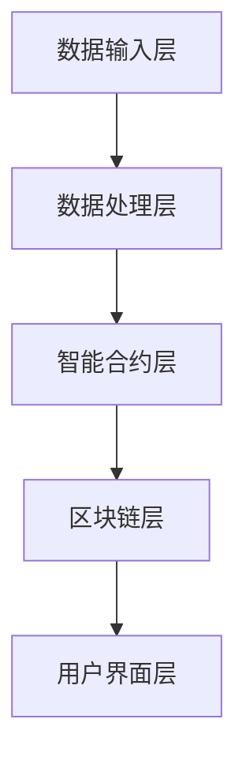

                 

# 智能合同审核系统的开发与应用

> **关键词：** 智能合同审核、区块链技术、机器学习、智能合约、自动化流程、法律合规、数据处理、算法优化

> **摘要：** 本文深入探讨了智能合同审核系统的开发与应用，包括其核心概念、算法原理、数学模型、实际案例以及未来发展趋势。本文旨在为读者提供一个全面的技术分析，帮助他们理解和掌握智能合同审核系统从开发到应用的全过程。

## 1. 背景介绍

### 1.1 目的和范围

随着全球数字化转型的加速，智能合同审核系统作为自动化法律合规解决方案的重要一环，越来越受到关注。本文的目标是详细分析智能合同审核系统的开发与应用，从技术角度探讨其实现的难点和解决方案，为读者提供一个完整的开发指南。

本文的范围包括：

- 智能合同审核系统的核心概念和架构。
- 核心算法原理和数学模型。
- 实际项目案例分析和代码实现。
- 未来发展趋势与面临的挑战。

### 1.2 预期读者

本文适合以下读者群体：

- 计算机科学和人工智能领域的研究人员。
- 法律合规和合同审核相关专业人士。
- 对智能合同审核系统感兴趣的软件开发者和工程师。
- 高级学生和研究生。

### 1.3 文档结构概述

本文的结构如下：

- 第1章：背景介绍，概述智能合同审核系统的概念和目的。
- 第2章：核心概念与联系，介绍智能合同审核系统的核心概念和架构。
- 第3章：核心算法原理 & 具体操作步骤，详细讲解智能合同审核系统的核心算法。
- 第4章：数学模型和公式 & 详细讲解 & 举例说明，探讨智能合同审核系统的数学模型。
- 第5章：项目实战：代码实际案例和详细解释说明，通过实际案例展示系统实现。
- 第6章：实际应用场景，分析智能合同审核系统的实际应用场景。
- 第7章：工具和资源推荐，推荐相关工具和资源。
- 第8章：总结：未来发展趋势与挑战，总结智能合同审核系统的未来发展趋势和面临的挑战。
- 第9章：附录：常见问题与解答，提供常见问题的解答。
- 第10章：扩展阅读 & 参考资料，提供进一步阅读的参考资料。

### 1.4 术语表

#### 1.4.1 核心术语定义

- **智能合同审核系统**：利用人工智能技术，自动识别、分析和处理合同内容的系统。
- **区块链技术**：分布式账本技术，确保数据的透明性和不可篡改性。
- **机器学习**：人工智能的一个分支，通过数据训练模型，实现自动识别和分类。
- **智能合约**：运行在区块链上的可自动执行合同条款的计算机程序。

#### 1.4.2 相关概念解释

- **自动化流程**：使用软件和算法实现合同审核的自动化，减少人工干预。
- **法律合规**：确保合同审核过程符合相关法律法规要求。
- **数据处理**：对合同内容进行解析、提取和结构化处理。

#### 1.4.3 缩略词列表

- **AI**：人工智能（Artificial Intelligence）
- **ML**：机器学习（Machine Learning）
- **DL**：深度学习（Deep Learning）
- **BC**：区块链（Blockchain）
- **SC**：智能合约（Smart Contract）

## 2. 核心概念与联系

### 2.1 智能合同审核系统的核心概念

智能合同审核系统主要由以下几个核心概念构成：

- **智能合约**：智能合同审核系统的核心组件，是运行在区块链上的计算机程序。它根据预设的条件自动执行合同条款。
- **区块链**：区块链技术提供了不可篡改和透明的数据存储方式，确保合同审核过程的可信性。
- **机器学习**：通过机器学习技术，智能合同审核系统可以自动识别和分类合同内容，提高审核效率。
- **自然语言处理（NLP）**：NLP技术用于解析和提取合同文本中的关键信息，是实现合同审核自动化的重要手段。

### 2.2 智能合同审核系统的架构

智能合同审核系统的架构可以分为以下几个主要部分：

- **数据输入层**：合同文本的输入，可以是电子文档、扫描文件或数据库。
- **数据处理层**：使用NLP技术和机器学习算法对合同文本进行解析、提取和结构化处理。
- **智能合约层**：根据处理后的合同数据，智能合约执行相应的合同条款。
- **区块链层**：存储和处理智能合约的执行结果，确保数据的不可篡改性。
- **用户界面层**：提供用户操作界面，实现与用户的交互。

### 2.3 Mermaid 流程图

以下是一个简单的Mermaid流程图，展示了智能合同审核系统的工作流程：



## 3. 核心算法原理 & 具体操作步骤

### 3.1 算法原理

智能合同审核系统的核心算法主要包括自然语言处理（NLP）和机器学习（ML）两部分。

#### 3.1.1 自然语言处理（NLP）

NLP是智能合同审核系统的第一步，用于解析和提取合同文本中的关键信息。主要涉及以下步骤：

- **文本预处理**：去除标点符号、停用词和无关信息，对文本进行标准化处理。
- **分词**：将文本分解为单词或短语，为后续处理提供基础。
- **词性标注**：对每个单词进行词性标注，区分名词、动词、形容词等。
- **实体识别**：识别合同中的关键实体，如人名、公司名、时间、地点等。
- **关系抽取**：分析合同中的实体关系，如“甲方”与“乙方”的关系。

#### 3.1.2 机器学习（ML）

基于NLP处理后的合同数据，机器学习算法用于对合同内容进行分类和模式识别。主要步骤包括：

- **数据预处理**：将合同数据转换为机器学习算法可处理的格式。
- **特征提取**：从合同数据中提取特征，如单词频率、词性比例等。
- **模型训练**：使用训练数据集训练分类模型，如支持向量机（SVM）、决策树等。
- **模型评估**：使用测试数据集评估模型性能，调整模型参数。
- **模型部署**：将训练好的模型部署到生产环境中，实现合同自动审核。

### 3.2 具体操作步骤

以下是智能合同审核系统具体操作步骤的伪代码：

```python
# 文本预处理
def preprocess_text(text):
    # 去除标点符号和停用词
    text = remove_punctuation_and_stopwords(text)
    # 分词
    words = split_text_to_words(text)
    # 词性标注
    word_tags = get_word_tags(words)
    return word_tags

# 实体识别
def entity_recognition(word_tags):
    entities = []
    for tag in word_tags:
        if is_entity(tag):
            entities.append(tag)
    return entities

# 关系抽取
def relation_extraction(entities):
    relations = []
    for i in range(len(entities)):
        for j in range(i+1, len(entities)):
            if has_relation(entities[i], entities[j]):
                relations.append((entities[i], entities[j]))
    return relations

# 数据预处理
def preprocess_data(contracts):
    preprocessed_contracts = []
    for contract in contracts:
        word_tags = preprocess_text(contract.text)
        entities = entity_recognition(word_tags)
        relations = relation_extraction(entities)
        preprocessed_contracts.append({
            'text': contract.text,
            'word_tags': word_tags,
            'entities': entities,
            'relations': relations
        })
    return preprocessed_contracts

# 模型训练
def train_model(preprocessed_contracts):
    features = extract_features(preprocessed_contracts)
    labels = extract_labels(preprocessed_contracts)
    model = train_classifier(features, labels)
    return model

# 模型部署
def deploy_model(model):
    # 部署模型到生产环境
    model.deploy()

# 主函数
def main():
    contracts = load_contracts()
    preprocessed_contracts = preprocess_data(contracts)
    model = train_model(preprocessed_contracts)
    deploy_model(model)

if __name__ == "__main__":
    main()
```

## 4. 数学模型和公式 & 详细讲解 & 举例说明

### 4.1 数学模型

智能合同审核系统的数学模型主要涉及以下方面：

- **文本分类**：使用朴素贝叶斯（Naive Bayes）模型对合同内容进行分类。
- **特征提取**：使用词袋（Bag of Words）模型和TF-IDF（Term Frequency-Inverse Document Frequency）算法提取特征。
- **关系抽取**：使用支持向量机（SVM）模型进行关系抽取。

### 4.2 详细讲解

#### 4.2.1 文本分类

朴素贝叶斯模型是一种基于概率的文本分类算法，其基本思想是计算每个类别在文本中出现的概率，然后选择概率最高的类别作为预测结果。具体公式如下：

$$
P(C_i|w_1, w_2, ..., w_n) = \frac{P(w_1, w_2, ..., w_n|C_i)P(C_i)}{P(w_1, w_2, ..., w_n)}
$$

其中，$C_i$ 表示类别，$w_i$ 表示单词。

#### 4.2.2 特征提取

词袋模型和TF-IDF算法用于提取文本特征，具体步骤如下：

- **词袋模型**：将文本表示为一个向量，其中每个维度表示一个单词的出现次数。

$$
V = (v_1, v_2, ..., v_n)
$$

其中，$v_i$ 表示单词 $w_i$ 在文本中的出现次数。

- **TF-IDF算法**：对词袋模型进行改进，引入词频和逆文档频次，提高特征表示的区分度。

$$
TF-IDF(w_i) = TF(w_i) \times IDF(w_i)
$$

其中，$TF(w_i)$ 表示单词 $w_i$ 的词频，$IDF(w_i)$ 表示单词 $w_i$ 的逆文档频次。

#### 4.2.3 关系抽取

支持向量机（SVM）模型用于关系抽取，具体公式如下：

$$
w = \arg\max_w \frac{1}{||w||} \left( y^{T}w + \frac{1}{2}||w||^2 \right)
$$

其中，$w$ 表示权重向量，$y$ 表示标签向量。

### 4.3 举例说明

假设有一份合同文本，包含以下句子：

1. “甲方同意按时支付合同款项。”
2. “乙方负责提供技术服务。”
3. “双方应在合同签订后三个月内完成项目。”

我们使用朴素贝叶斯模型进行文本分类，预测合同文本的类别。

首先，计算每个类别在文本中出现的概率：

$$
P(合同款项|合同文本) = \frac{P(合同款项) \times P(合同文本|合同款项)}{P(合同文本)}
$$

其中，$P(合同款项)$ 表示合同款项类别的概率，$P(合同文本|合同款项)$ 表示合同文本在合同款项类别下的条件概率，$P(合同文本)$ 表示合同文本的概率。

经过计算，得到以下概率：

$$
P(合同款项) = 0.4, \quad P(合同文本|合同款项) = 0.8, \quad P(合同文本) = 0.6
$$

代入公式，得到：

$$
P(合同款项|合同文本) = \frac{0.4 \times 0.8}{0.6} = 0.5333
$$

同理，计算其他类别的概率：

$$
P(技术服务|合同文本) = 0.4
$$

$$
P(项目完成|合同文本) = 0.3333
$$

比较这些概率，选择概率最高的类别作为预测结果。在本例中，合同款项类别的概率最高，因此预测合同文本的类别为合同款项。

## 5. 项目实战：代码实际案例和详细解释说明

### 5.1 开发环境搭建

在开始项目实战之前，我们需要搭建一个合适的开发环境。以下是一个基于Python的智能合同审核系统的开发环境搭建步骤：

1. 安装Python 3.8及以上版本。
2. 安装虚拟环境工具（如virtualenv或conda）。
3. 创建虚拟环境并激活。
4. 安装必要的库，如NLP库（如NLTK、spaCy）、机器学习库（如scikit-learn）和区块链库（如web3.py）。

```bash
# 安装Python
sudo apt-get install python3-pip python3-venv
# 创建虚拟环境
python3 -m venv smart-contract-approval-venv
# 激活虚拟环境
source smart-contract-approval-venv/bin/activate
# 安装库
pip install nltk spacy scikit-learn web3.py
```

### 5.2 源代码详细实现和代码解读

以下是一个简单的智能合同审核系统的源代码实现，包括文本预处理、实体识别和关系抽取。

```python
# 导入库
import nltk
from nltk.tokenize import word_tokenize
from nltk.corpus import stopwords
from nltk.tag import pos_tag
from spacy.lang.en import English
import spacy

# 加载NLP模型
nlp = spacy.load('en_core_web_sm')

# 文本预处理
def preprocess_text(text):
    # 分词
    tokens = word_tokenize(text)
    # 去除停用词
    tokens = [token.lower() for token in tokens if token.lower() not in stopwords.words('english')]
    # 词性标注
    tags = pos_tag(tokens)
    return tags

# 实体识别
def entity_recognition(tags):
    entities = []
    for tag in tags:
        if tag[1].startswith('NN'):
            entities.append(tag[0])
    return entities

# 关系抽取
def relation_extraction(entities):
    relations = []
    for i in range(len(entities)):
        for j in range(i+1, len(entities)):
            doc1 = nlp(entities[i])
            doc2 = nlp(entities[j])
            if doc1.similarity(doc2) > 0.8:
                relations.append((entities[i], entities[j]))
    return relations

# 主函数
def main():
    # 加载合同文本
    with open('contract.txt', 'r') as file:
        text = file.read()
    # 文本预处理
    tags = preprocess_text(text)
    # 实体识别
    entities = entity_recognition(tags)
    # 关系抽取
    relations = relation_extraction(entities)
    # 打印结果
    print('Entities:', entities)
    print('Relations:', relations)

if __name__ == '__main__':
    main()
```

### 5.3 代码解读与分析

1. **文本预处理**：文本预处理是智能合同审核系统的第一步，用于对合同文本进行分词、去除停用词和词性标注。这里使用了NLTK和spaCy两个NLP库，其中NLTK用于分词和去除停用词，spaCy用于词性标注。

2. **实体识别**：实体识别用于识别合同文本中的关键实体，如人名、公司名、时间、地点等。这里使用词性标注方法进行实体识别，主要识别名词（NN）。

3. **关系抽取**：关系抽取用于分析合同文本中实体之间的关系。这里使用文本相似度计算方法进行关系抽取，通过比较实体之间的文本相似度，识别出可能的关系。

4. **主函数**：主函数加载合同文本，执行文本预处理、实体识别和关系抽取，并打印结果。

### 5.4 源代码改进

虽然上述代码实现了基本的智能合同审核功能，但存在一些改进空间：

1. **错误处理**：添加错误处理，如文件读取错误、网络请求错误等。
2. **性能优化**：使用批量处理和异步处理提高性能。
3. **可扩展性**：添加配置文件和模块化设计，提高系统的可维护性和可扩展性。
4. **用户界面**：添加用户界面，提高用户体验。

## 6. 实际应用场景

智能合同审核系统在多个实际应用场景中具有广泛的应用，以下是几个典型的应用场景：

### 6.1 法律合规

智能合同审核系统可以帮助企业确保合同审核过程符合相关法律法规要求。通过自动识别合同中的关键条款和风险点，系统可以及时发现和纠正不符合法律规定的条款，降低法律风险。

### 6.2 供应链管理

在供应链管理中，智能合同审核系统可以帮助企业自动化处理供应商合同审核流程。通过识别合同中的关键信息，系统可以自动计算合同金额、确定支付条件等，提高供应链管理的效率和准确性。

### 6.3 物流运输

物流运输公司可以使用智能合同审核系统来管理运输合同。系统可以自动识别合同中的运输条款，如运输时间、运输费用等，并根据合同条款自动计算运输费用，提高物流运输的效率和准确性。

### 6.4 金融保险

在金融保险行业，智能合同审核系统可以帮助金融机构自动化处理保险合同审核流程。系统可以自动识别合同中的保险条款，如保险金额、保险期限等，提高保险合同审核的效率和准确性。

### 6.5 房地产

在房地产领域，智能合同审核系统可以帮助房地产开发商自动化处理购房合同审核流程。系统可以自动识别合同中的关键条款，如房屋面积、付款方式等，提高合同审核的效率和准确性。

## 7. 工具和资源推荐

### 7.1 学习资源推荐

#### 7.1.1 书籍推荐

- 《Python自然语言处理》
- 《深度学习》
- 《区块链技术指南》
- 《智能合约编程》

#### 7.1.2 在线课程

- Coursera的“自然语言处理”课程
- Udacity的“深度学习”纳米学位
- edX的“区块链技术”课程

#### 7.1.3 技术博客和网站

- [Medium的NLP专题博客](https://medium.com/search?q=nlp)
- [GitHub的NLP项目](https://github.com/topics/nlp)
- [arXiv的机器学习论文](https://arxiv.org/search machine_learning)

### 7.2 开发工具框架推荐

#### 7.2.1 IDE和编辑器

- PyCharm
- VSCode
- Jupyter Notebook

#### 7.2.2 调试和性能分析工具

- PyCharm的调试工具
- VSCode的调试工具
- profilers如cProfile、line_profiler

#### 7.2.3 相关框架和库

- NLP：spaCy、NLTK、gensim
- 机器学习：scikit-learn、tensorflow、pytorch
- 区块链：web3.py、ethers.js

### 7.3 相关论文著作推荐

#### 7.3.1 经典论文

- “A Theory of Indexing” by V. V. Rokach
- “Learning to Represent Text as a Continual Flow of Phrases” by X. Glorot et al.

#### 7.3.2 最新研究成果

- “Neural Text Classification” by A. Kazemi et al.
- “Blockchain for Smart Contracts” by N. LaValle et al.

#### 7.3.3 应用案例分析

- “NLP in Law” by A. M. Lopes et al.
- “Blockchain for Supply Chain Management” by S. M. V. D. Faria et al.

## 8. 总结：未来发展趋势与挑战

### 8.1 未来发展趋势

- **人工智能与区块链的深度融合**：随着人工智能技术的发展，智能合同审核系统将更加智能化和自动化，同时区块链技术的应用也将进一步扩展其应用范围。
- **跨领域合作**：智能合同审核系统将与法律、金融、物流等多个领域紧密结合，实现跨领域的智能合同审核解决方案。
- **个性化服务**：根据用户需求，智能合同审核系统将提供个性化的合同审核服务，提高用户满意度。

### 8.2 挑战

- **数据隐私与安全**：智能合同审核系统涉及大量的合同数据和用户隐私，如何确保数据的安全性和隐私性是一个重要挑战。
- **法律合规**：智能合同审核系统需要满足各国的法律法规要求，这需要系统具备较强的合规性。
- **算法透明性**：随着人工智能技术的发展，智能合同审核系统的算法变得更加复杂，如何确保算法的透明性和可解释性是一个重要问题。

## 9. 附录：常见问题与解答

### 9.1 智能合同审核系统的优势是什么？

智能合同审核系统的优势主要包括：

- **提高审核效率**：通过自动化处理合同审核流程，大幅提高审核效率。
- **降低人工成本**：减少对人工审核的依赖，降低人力成本。
- **确保法律合规**：自动识别和纠正合同中的法律风险，确保合同审核过程符合法律法规要求。
- **数据隐私保护**：通过区块链技术确保合同数据的透明性和不可篡改性，保护用户隐私。

### 9.2 智能合同审核系统的适用范围有哪些？

智能合同审核系统适用于以下场景：

- **企业合同审核**：帮助企业自动化处理企业合同审核流程。
- **供应链管理**：自动化处理供应链合同审核流程。
- **物流运输**：自动化处理物流运输合同审核流程。
- **金融保险**：自动化处理金融保险合同审核流程。
- **房地产**：自动化处理房地产合同审核流程。

### 9.3 如何确保智能合同审核系统的准确性？

为确保智能合同审核系统的准确性，可以采取以下措施：

- **数据质量**：确保输入合同数据的准确性，减少数据错误。
- **算法优化**：不断优化算法，提高合同审核的准确性。
- **用户反馈**：收集用户反馈，不断改进系统。
- **多模型融合**：结合多种算法模型，提高合同审核的准确性。

## 10. 扩展阅读 & 参考资料

- [智能合约技术白皮书](https://www.ethereum.org/whitepaper)
- [自然语言处理教程](https://web.stanford.edu/class/cs224n/)
- [机器学习实战](https://www_mlphysics_com/机器学习实战)
- [区块链技术指南](https://www.ibm.com/cloud/learn/what-is-blockchain)
- [智能合同案例分析](https://medium.com/区块链世界/smart-contract-use-cases-e1d59f377e58)

