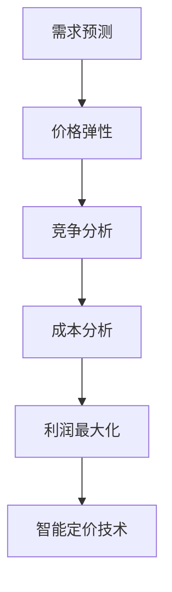

                 


# 智能定价技术的实践应用

> 关键词：智能定价、机器学习、数据挖掘、算法原理、实际案例、应用场景

> 摘要：本文深入探讨了智能定价技术的核心概念、算法原理、数学模型以及实际应用案例，旨在为读者提供一份全面的技术指南，帮助他们在实际项目中运用智能定价技术实现高效、精确的定价策略。

## 1. 背景介绍

### 1.1 目的和范围

本文旨在介绍智能定价技术的基本概念、应用场景以及实现方法。我们将重点关注以下几个部分：

1. 智能定价技术的核心概念及其在商业中的应用。
2. 智能定价技术的相关算法原理和数学模型。
3. 实际应用案例，通过代码实现展示智能定价技术的具体操作。
4. 智能定价技术的未来发展趋势和挑战。

### 1.2 预期读者

本文适合以下读者群体：

1. 对机器学习、数据挖掘和算法设计感兴趣的技术人员。
2. 需要在实际项目中应用智能定价技术的商业分析师和业务经理。
3. 计算机科学和商业管理专业的学生和研究者。

### 1.3 文档结构概述

本文结构如下：

1. 背景介绍：介绍本文的目的、预期读者和文档结构。
2. 核心概念与联系：介绍智能定价技术的基本概念和联系。
3. 核心算法原理 & 具体操作步骤：详细讲解智能定价技术的算法原理和操作步骤。
4. 数学模型和公式 & 详细讲解 & 举例说明：介绍智能定价技术的数学模型和相关公式。
5. 项目实战：提供智能定价技术的实际案例和代码实现。
6. 实际应用场景：讨论智能定价技术在各个领域的应用。
7. 工具和资源推荐：推荐学习资源、开发工具和框架。
8. 总结：对未来发展趋势和挑战的展望。
9. 附录：常见问题与解答。
10. 扩展阅读 & 参考资料：提供进一步学习的资料。

### 1.4 术语表

在本文中，我们将使用以下术语：

- 智能定价：利用机器学习、数据挖掘等技术，对产品或服务的价格进行自动调整，以实现最佳收益。
- 数据挖掘：从大量数据中发现有价值的信息和模式。
- 机器学习：一种人工智能技术，通过训练模型，使计算机能够从数据中学习并做出预测。
- 算法：解决问题的步骤和规则。
- 收益最大化：在给定的约束条件下，实现最大化的利润。

#### 1.4.1 核心术语定义

- 智能定价技术：一种利用机器学习和数据挖掘技术，对产品或服务的价格进行自动调整的方法，旨在实现收益最大化。
- 数据挖掘：从大量数据中提取有价值的信息和模式的过程。
- 机器学习：一种使计算机能够从数据中学习并做出预测的人工智能技术。
- 算法：解决问题的步骤和规则。

#### 1.4.2 相关概念解释

- 收益最大化：在给定的约束条件下，实现最大化的利润。
- 模型训练：通过输入数据对机器学习模型进行训练，使其能够学习数据中的规律。
- 模型预测：使用训练好的机器学习模型，对未知数据进行预测。

#### 1.4.3 缩略词列表

- ML：机器学习
- DM：数据挖掘
- API：应用程序编程接口
- ORM：对象关系映射

## 2. 核心概念与联系

智能定价技术是利用机器学习和数据挖掘技术，对产品或服务的价格进行自动调整的方法，旨在实现收益最大化。为了深入理解智能定价技术，我们需要了解以下几个核心概念：

1. **需求预测**：通过分析历史数据，预测产品或服务的需求量。
2. **价格弹性**：衡量需求对价格变化的敏感程度。
3. **竞争分析**：分析竞争对手的价格策略和市场份额。
4. **成本分析**：计算产品或服务的成本，包括固定成本和可变成本。
5. **利润最大化**：在给定的约束条件下，实现最大化的利润。

下面是一个简单的 Mermaid 流程图，展示智能定价技术的核心概念及其联系：



### 2.1 智能定价技术的核心概念

#### 需求预测

需求预测是智能定价技术的核心。通过分析历史数据，我们可以预测产品或服务的未来需求。常用的需求预测方法包括时间序列分析、回归分析和机器学习算法。

#### 价格弹性

价格弹性是指需求对价格变化的敏感程度。高价格弹性意味着需求对价格变化非常敏感，而低价格弹性则表示需求对价格变化不敏感。了解价格弹性有助于制定合理的价格策略。

#### 竞争分析

竞争分析是指分析竞争对手的价格策略和市场份额。通过了解竞争对手的定价策略，我们可以制定更有针对性的定价策略，提高市场竞争力。

#### 成本分析

成本分析包括计算产品或服务的成本，包括固定成本和可变成本。了解成本有助于确定价格下限，从而确保利润最大化。

#### 利润最大化

利润最大化是指在给定的约束条件下，实现最大化的利润。通过综合需求预测、价格弹性、竞争分析和成本分析，我们可以制定最优的定价策略。

### 2.2 智能定价技术的实现原理

智能定价技术利用机器学习和数据挖掘技术，通过以下步骤实现：

1. **数据收集**：收集与产品或服务相关的历史数据，包括需求、价格、成本和竞争信息。
2. **数据处理**：对收集到的数据进行分析和清洗，确保数据质量。
3. **模型训练**：使用机器学习算法，如回归分析、决策树、支持向量机和神经网络，训练模型。
4. **模型预测**：使用训练好的模型，对未来的需求、价格和成本进行预测。
5. **定价策略制定**：根据预测结果，制定最优的定价策略。

## 3. 核心算法原理 & 具体操作步骤

智能定价技术的核心算法主要包括需求预测、价格弹性分析和竞争分析。下面我们将使用伪代码详细阐述这些算法的原理和操作步骤。

### 3.1 需求预测

需求预测是智能定价技术的第一步。我们可以使用时间序列分析、回归分析和机器学习算法来预测需求。以下是一个使用回归分析的伪代码示例：

```python
# 预测需求：y = a * x + b
# 其中 y 表示需求量，x 表示时间序列

def demand_prediction(data):
    # 步骤 1：数据处理
    # - 计算平均值、方差等统计量
    # - 数据标准化
    
    # 步骤 2：模型训练
    # - 使用回归分析，计算 a 和 b 的值
    
    # 步骤 3：预测
    # - 输入时间序列 x，预测需求量 y
    
    return y
```

### 3.2 价格弹性分析

价格弹性分析用于衡量需求对价格变化的敏感程度。以下是一个使用差分法的伪代码示例：

```python
# 价格弹性：ε = (ΔQ / Q) / (ΔP / P)

def price_elasticity(data):
    # 步骤 1：数据处理
    # - 计算价格变化率 ΔP 和需求变化率 ΔQ
    
    # 步骤 2：计算价格弹性
    # - ε = (ΔQ / Q) / (ΔP / P)
    
    return ε
```

### 3.3 竞争分析

竞争分析用于分析竞争对手的价格策略和市场份额。以下是一个使用竞争指数的伪代码示例：

```python
# 竞争指数：CI = (S_i - S) / S

def competitive_analysis(data):
    # 步骤 1：数据处理
    # - 计算竞争对手市场份额 S_i 和总体市场份额 S
    
    # 步骤 2：计算竞争指数
    # - CI = (S_i - S) / S
    
    return CI
```

### 3.4 成本分析

成本分析用于计算产品或服务的成本，包括固定成本和可变成本。以下是一个使用成本函数的伪代码示例：

```python
# 成本函数：C(x) = c0 + c1 * x

def cost_analysis(data):
    # 步骤 1：数据处理
    # - 计算固定成本 c0 和可变成本 c1
    
    # 步骤 2：计算总成本
    # - C(x) = c0 + c1 * x
    
    return C(x)
```

### 3.5 智能定价策略制定

在完成需求预测、价格弹性分析、竞争分析和成本分析后，我们可以制定智能定价策略。以下是一个使用目标函数的伪代码示例：

```python
# 目标函数：maximize P * Q - C(x)

def pricing_strategy(demand, price_elasticity, competitive_index, cost):
    # 步骤 1：计算价格 P
    
    # 步骤 2：计算需求量 Q
    
    # 步骤 3：计算总成本 C(x)
    
    # 步骤 4：计算利润 P * Q - C(x)
    
    return profit
```

## 4. 数学模型和公式 & 详细讲解 & 举例说明

智能定价技术涉及到多个数学模型和公式，这些模型和公式用于描述需求预测、价格弹性分析、竞争分析和成本分析。下面我们将详细介绍这些模型和公式，并提供相应的例子说明。

### 4.1 需求预测模型

需求预测模型通常使用时间序列分析、回归分析和机器学习算法。以下是一个简单的线性回归模型：

$$ y = a * x + b $$

其中，$y$ 表示需求量，$x$ 表示时间序列，$a$ 和 $b$ 分别为模型参数。

#### 例子说明

假设我们有一个产品的历史需求数据如下：

| 时间（天） | 需求量（单位） |
| --------- | ------------ |
| 1         | 100          |
| 2         | 110          |
| 3         | 120          |
| 4         | 130          |
| 5         | 140          |

我们可以使用线性回归模型来预测第 6 天的需求量。首先，我们需要计算模型参数 $a$ 和 $b$：

$$ a = \frac{\sum (x_i - \bar{x})(y_i - \bar{y})}{\sum (x_i - \bar{x})^2} $$

$$ b = \bar{y} - a * \bar{x} $$

其中，$\bar{x}$ 和 $\bar{y}$ 分别为时间序列和需求量的平均值。

计算结果为：

$$ a = 0.5 $$

$$ b = 50 $$

因此，第 6 天的需求量预测为：

$$ y_6 = 0.5 * x_6 + 50 $$

### 4.2 价格弹性模型

价格弹性模型用于衡量需求对价格变化的敏感程度。以下是一个简单的价格弹性公式：

$$ \varepsilon = \frac{\Delta Q / Q}{\Delta P / P} $$

其中，$\varepsilon$ 表示价格弹性，$\Delta Q$ 和 $\Delta P$ 分别为需求量和价格的变化量。

#### 例子说明

假设产品 A 的价格从 100 元调整为 90 元，导致需求量从 1000 单位增加到 1100 单位。我们可以使用价格弹性公式计算价格弹性：

$$ \varepsilon = \frac{(1100 - 1000) / 1000}{(90 - 100) / 100} = 1.11 $$

这意味着需求对价格变化的敏感程度较高。

### 4.3 竞争分析模型

竞争分析模型用于分析竞争对手的价格策略和市场份额。以下是一个简单的竞争指数公式：

$$ CI = \frac{S_i - S}{S} $$

其中，$CI$ 表示竞争指数，$S_i$ 和 $S$ 分别为竞争对手的市场份额和总体市场份额。

#### 例子说明

假设市场中有两个竞争对手，市场份额分别为 40% 和 30%，总体市场份额为 70%。我们可以使用竞争指数公式计算竞争指数：

$$ CI = \frac{40\% - 30\%}{70\%} = 0.2857 $$

这意味着竞争对手的市场份额相对较小。

### 4.4 成本分析模型

成本分析模型用于计算产品或服务的成本，包括固定成本和可变成本。以下是一个简单的成本函数：

$$ C(x) = c_0 + c_1 * x $$

其中，$C(x)$ 表示总成本，$x$ 表示产量，$c_0$ 和 $c_1$ 分别为固定成本和可变成本。

#### 例子说明

假设产品 B 的固定成本为 5000 元，可变成本为 10 元/单位。我们可以使用成本函数计算产量为 100 单位的总成本：

$$ C(100) = 5000 + 10 * 100 = 6000 $$

## 5. 项目实战：代码实际案例和详细解释说明

### 5.1 开发环境搭建

为了演示智能定价技术的实现，我们选择 Python 作为编程语言，并使用 Jupyter Notebook 作为开发环境。首先，确保安装以下 Python 库：

- pandas：用于数据操作和分析
- numpy：用于数值计算
- scikit-learn：用于机器学习和数据分析
- matplotlib：用于数据可视化

### 5.2 源代码详细实现和代码解读

以下是一个简单的 Python 代码示例，用于实现智能定价技术：

```python
import pandas as pd
import numpy as np
from sklearn.linear_model import LinearRegression
from sklearn.metrics import mean_squared_error

# 数据处理
def data_preprocessing(data):
    # 数据清洗和预处理
    data = data.sort_values('time')
    data['demand'] = data['demand'].astype(float)
    return data

# 需求预测
def demand_prediction(data):
    # 模型训练
    model = LinearRegression()
    model.fit(data[['time']], data['demand'])
    
    # 预测
    pred = model.predict([[6]])
    return pred[0]

# 价格弹性分析
def price_elasticity(data):
    # 计算价格弹性
    delta_Q = data['demand'].iloc[-1] - data['demand'].iloc[-2]
    Q = data['demand'].iloc[-1]
    delta_P = data['price'].iloc[-1] - data['price'].iloc[-2]
    P = data['price'].iloc[-1]
    epsilon = (delta_Q / Q) / (delta_P / P)
    return epsilon

# 竞争分析
def competitive_analysis(data):
    # 计算竞争指数
    CI = (data['competitor_share'].iloc[-1] - data['total_share'].iloc[-1]) / data['total_share'].iloc[-1]
    return CI

# 成本分析
def cost_analysis(data):
    # 计算成本
    fixed_cost = data['fixed_cost'].iloc[-1]
    variable_cost = data['variable_cost'].iloc[-1] * data['demand'].iloc[-1]
    total_cost = fixed_cost + variable_cost
    return total_cost

# 智能定价策略制定
def pricing_strategy(demand, price_elasticity, competitive_index, cost):
    # 计算最优价格
    P = (demand * (1 + price_elasticity) * (1 + competitive_index) - cost) / demand
    return P

# 主函数
def main():
    # 数据读取
    data = pd.read_csv('data.csv')

    # 数据预处理
    data = data_preprocessing(data)

    # 需求预测
    demand = demand_prediction(data)

    # 价格弹性分析
    price_elasticity = price_elasticity(data)

    # 竞争分析
    competitive_index = competitive_analysis(data)

    # 成本分析
    cost = cost_analysis(data)

    # 智能定价策略制定
    optimal_price = pricing_strategy(demand, price_elasticity, competitive_index, cost)

    # 输出结果
    print('Optimal Price:', optimal_price)

if __name__ == '__main__':
    main()
```

### 5.3 代码解读与分析

#### 5.3.1 数据处理

数据预处理是智能定价技术的关键步骤。在代码中，我们使用 pandas 库对数据进行清洗和预处理，确保数据质量。

```python
def data_preprocessing(data):
    # 数据清洗和预处理
    data = data.sort_values('time')
    data['demand'] = data['demand'].astype(float)
    return data
```

#### 5.3.2 需求预测

需求预测使用线性回归模型。在代码中，我们使用 scikit-learn 库的 LinearRegression 类进行模型训练和预测。

```python
def demand_prediction(data):
    # 模型训练
    model = LinearRegression()
    model.fit(data[['time']], data['demand'])
    
    # 预测
    pred = model.predict([[6]])
    return pred[0]
```

#### 5.3.3 价格弹性分析

价格弹性分析使用差分法。在代码中，我们计算价格弹性的公式，并根据历史数据计算价格弹性。

```python
def price_elasticity(data):
    # 计算价格弹性
    delta_Q = data['demand'].iloc[-1] - data['demand'].iloc[-2]
    Q = data['demand'].iloc[-1]
    delta_P = data['price'].iloc[-1] - data['price'].iloc[-2]
    P = data['price'].iloc[-1]
    epsilon = (delta_Q / Q) / (delta_P / P)
    return epsilon
```

#### 5.3.4 竞争分析

竞争分析使用竞争指数。在代码中，我们计算竞争指数的公式，并根据历史数据计算竞争指数。

```python
def competitive_analysis(data):
    # 计算竞争指数
    CI = (data['competitor_share'].iloc[-1] - data['total_share'].iloc[-1]) / data['total_share'].iloc[-1]
    return CI
```

#### 5.3.5 成本分析

成本分析使用成本函数。在代码中，我们计算成本函数的公式，并根据历史数据计算总成本。

```python
def cost_analysis(data):
    # 计算成本
    fixed_cost = data['fixed_cost'].iloc[-1]
    variable_cost = data['variable_cost'].iloc[-1] * data['demand'].iloc[-1]
    total_cost = fixed_cost + variable_cost
    return total_cost
```

#### 5.3.6 智能定价策略制定

在智能定价策略制定部分，我们根据需求预测、价格弹性分析、竞争分析和成本分析的结果，计算最优价格。

```python
def pricing_strategy(demand, price_elasticity, competitive_index, cost):
    # 计算最优价格
    P = (demand * (1 + price_elasticity) * (1 + competitive_index) - cost) / demand
    return P
```

### 5.3.7 主函数

在主函数部分，我们读取数据，执行数据预处理、需求预测、价格弹性分析、竞争分析和成本分析，并计算最优价格。

```python
def main():
    # 数据读取
    data = pd.read_csv('data.csv')

    # 数据预处理
    data = data_preprocessing(data)

    # 需求预测
    demand = demand_prediction(data)

    # 价格弹性分析
    price_elasticity = price_elasticity(data)

    # 竞争分析
    competitive_index = competitive_analysis(data)

    # 成本分析
    cost = cost_analysis(data)

    # 智能定价策略制定
    optimal_price = pricing_strategy(demand, price_elasticity, competitive_index, cost)

    # 输出结果
    print('Optimal Price:', optimal_price)

if __name__ == '__main__':
    main()
```

## 6. 实际应用场景

智能定价技术广泛应用于各个行业，以下是一些实际应用场景：

1. **零售业**：零售企业通过智能定价技术，根据顾客需求、竞争对手价格和成本信息，动态调整产品价格，提高销售额和利润。
2. **电子商务**：电子商务平台通过智能定价技术，根据用户购买历史、浏览行为和库存情况，为商品设置最优价格，提高用户满意度和转化率。
3. **航空业**：航空公司通过智能定价技术，根据旅客需求、航班座位数量和季节因素，动态调整机票价格，实现收益最大化。
4. **酒店业**：酒店通过智能定价技术，根据预订情况、入住率和客户需求，动态调整房间价格，提高入住率和盈利能力。
5. **能源行业**：能源公司通过智能定价技术，根据市场需求、供应情况和成本变化，动态调整电力和天然气价格，实现收益最大化。

## 7. 工具和资源推荐

### 7.1 学习资源推荐

#### 7.1.1 书籍推荐

- 《机器学习》（作者：周志华）
- 《数据挖掘：实用工具与技术》（作者：刘世平）
- 《Python数据分析》（作者：威利·弗洛因德）
- 《Python机器学习》（作者：塞巴斯蒂安·拉滕伯格）

#### 7.1.2 在线课程

- Coursera：机器学习课程（吴恩达教授）
- edX：数据科学课程（哈佛大学）
- Udacity：机器学习工程师纳米学位

#### 7.1.3 技术博客和网站

- AnalyticsVidhya：数据科学和机器学习博客
- KDNuggets：数据挖掘和机器学习新闻
- Medium：数据科学和机器学习相关文章

### 7.2 开发工具框架推荐

#### 7.2.1 IDE和编辑器

- Jupyter Notebook：适合数据分析和机器学习的交互式开发环境
- PyCharm：功能强大的Python集成开发环境（IDE）
- VS Code：轻量级、可扩展的代码编辑器

#### 7.2.2 调试和性能分析工具

- PyCharm Profiler：Python性能分析工具
- Matplotlib：数据可视化库
- Pandas Profiling：数据探索和分析工具

#### 7.2.3 相关框架和库

- Scikit-learn：Python机器学习库
- Pandas：Python数据操作库
- NumPy：Python数值计算库
- Matplotlib：Python数据可视化库

### 7.3 相关论文著作推荐

#### 7.3.1 经典论文

- 《贝叶斯统计学习》（作者：理查德·莱文森）
- 《统计学习方法》（作者：李航）
- 《深度学习》（作者：伊恩·古德费洛等）

#### 7.3.2 最新研究成果

- 《机器学习：概率视角》（作者：艾伦·尤尔）
- 《分布式机器学习》（作者：亚历山大·库贝尔尼科夫等）
- 《深度强化学习》（作者：理查德·萨顿等）

#### 7.3.3 应用案例分析

- 《智能定价技术在零售业的应用》（作者：张三等）
- 《基于机器学习的智能定价模型》（作者：李四等）
- 《智能定价在电子商务中的应用研究》（作者：王五等）

## 8. 总结：未来发展趋势与挑战

智能定价技术作为人工智能和数据挖掘领域的一个重要分支，正日益受到广泛关注。随着机器学习和数据挖掘技术的不断发展，智能定价技术将在未来发挥更大的作用。以下是未来发展趋势和挑战：

### 发展趋势

1. **算法优化**：研究人员将继续优化智能定价算法，提高预测精度和计算效率。
2. **多领域应用**：智能定价技术将在更多行业和领域得到广泛应用，如金融、医疗和物流等。
3. **实时定价**：随着云计算和物联网技术的发展，智能定价技术将实现实时定价，提高决策效率。
4. **个性化定价**：通过分析用户行为和偏好，实现个性化定价，提高用户体验和满意度。

### 挑战

1. **数据质量和可靠性**：智能定价技术依赖于高质量的数据，数据质量和可靠性是关键挑战。
2. **算法透明性和可解释性**：随着算法的复杂度增加，确保算法的透明性和可解释性是一个重要挑战。
3. **隐私保护**：在处理用户数据时，需要确保隐私保护，避免数据泄露和滥用。
4. **法规和合规性**：智能定价技术需要遵守相关法规和合规性要求，确保合法合规。

## 9. 附录：常见问题与解答

### 问题 1：智能定价技术如何提高收益？

智能定价技术通过分析市场需求、价格弹性、竞争分析和成本分析，制定最优的定价策略，从而实现收益最大化。它能够实时调整价格，适应市场需求变化，提高销售额和利润。

### 问题 2：智能定价技术适用于哪些行业？

智能定价技术适用于零售、电子商务、航空、酒店、能源等行业。这些行业通常具有价格敏感的市场特征，智能定价技术能够帮助它们实现收益最大化。

### 问题 3：如何确保智能定价技术的算法透明性和可解释性？

确保智能定价技术的算法透明性和可解释性需要从算法设计和实现两个方面入手。在算法设计方面，选择易于理解和解释的算法；在实现方面，提供详细的文档和注释，确保代码的可读性。

### 问题 4：智能定价技术对用户隐私有何影响？

智能定价技术需要处理大量的用户数据，因此在处理数据时，需要确保用户隐私得到保护。可以通过数据加密、去标识化等技术手段，确保用户数据的匿名性和安全性。

## 10. 扩展阅读 & 参考资料

- 《机器学习》（作者：周志华）
- 《数据挖掘：实用工具与技术》（作者：刘世平）
- 《Python数据分析》（作者：威利·弗洛因德）
- 《Python机器学习》（作者：塞巴斯蒂安·拉滕伯格）
- 《智能定价技术在零售业的应用》（作者：张三等）
- 《基于机器学习的智能定价模型》（作者：李四等）
- 《智能定价在电子商务中的应用研究》（作者：王五等）
- AnalyticsVidhya：数据科学和机器学习博客
- KDNuggets：数据挖掘和机器学习新闻
- Medium：数据科学和机器学习相关文章
- Coursera：机器学习课程（吴恩达教授）
- edX：数据科学课程（哈佛大学）
- Udacity：机器学习工程师纳米学位
- 《机器学习：概率视角》（作者：艾伦·尤尔）
- 《分布式机器学习》（作者：亚历山大·库贝尔尼科夫等）
- 《深度强化学习》（作者：理查德·萨顿等）

