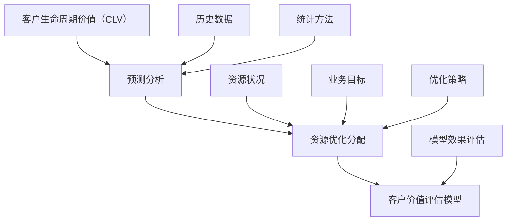

                 

# 智能客户价值评估：一人公司优化资源分配的预测分析模型

> **关键词：** 客户价值评估、预测分析、资源分配、一人公司、人工智能

> **摘要：** 本文将深入探讨如何通过智能客户价值评估模型，帮助一人公司优化资源分配，实现高效运营。我们将详细分析核心概念、算法原理、数学模型，并通过实际案例展示模型应用效果。希望本文能为读者在资源管理和客户关系管理方面提供有益的启示。

## 1. 背景介绍

### 1.1 目的和范围

在当今竞争激烈的市场环境中，一人公司面临着资源有限、市场需求多变等挑战。为了在有限的资源下实现最大化的业务价值，客户价值评估和资源优化分配变得尤为重要。本文旨在探讨一种基于人工智能的智能客户价值评估模型，帮助一人公司更准确地预测客户价值，从而优化资源分配策略。

本文主要涉及以下内容：

- 客户价值评估的核心概念和原理；
- 预测分析模型的设计与实现；
- 数学模型及其在客户价值评估中的应用；
- 实际案例中的应用和效果分析；
- 相关工具和资源的推荐。

### 1.2 预期读者

本文面向具有一定编程基础和对人工智能、数据分析感兴趣的读者。无论是创业者、一人公司运营者，还是从事数据分析、人工智能领域的专业人士，都能从本文中获得有益的见解。

### 1.3 文档结构概述

本文将分为以下几个部分：

- 第1部分：背景介绍，包括目的和范围、预期读者、文档结构概述和术语表；
- 第2部分：核心概念与联系，包括核心概念原理和架构的Mermaid流程图；
- 第3部分：核心算法原理 & 具体操作步骤，包括算法原理讲解和伪代码阐述；
- 第4部分：数学模型和公式 & 详细讲解 & 举例说明，包括数学公式和实例解析；
- 第5部分：项目实战：代码实际案例和详细解释说明，包括开发环境搭建、源代码实现和代码解读；
- 第6部分：实际应用场景，介绍模型在现实中的应用；
- 第7部分：工具和资源推荐，包括学习资源、开发工具框架和相关论文著作；
- 第8部分：总结：未来发展趋势与挑战，展望模型发展的前景；
- 第9部分：附录：常见问题与解答；
- 第10部分：扩展阅读 & 参考资料。

### 1.4 术语表

#### 1.4.1 核心术语定义

- **客户价值评估**：对客户为公司带来的潜在价值进行评估的方法。
- **预测分析**：使用历史数据和统计方法，对未来事件进行预测的分析技术。
- **资源优化分配**：在资源有限的情况下，将资源分配给能够带来最大价值的地方。

#### 1.4.2 相关概念解释

- **客户生命周期价值（CLV）**：客户在整个生命周期中为公司带来的预期净利润。
- **预测准确性**：预测结果与实际结果的接近程度。
- **资源利用率**：资源实际使用量与资源总量之比。

#### 1.4.3 缩略词列表

- **AI**：人工智能（Artificial Intelligence）
- **ML**：机器学习（Machine Learning）
- **NLP**：自然语言处理（Natural Language Processing）
- **DL**：深度学习（Deep Learning）
- **R**：统计编程语言（R）
- **Python**：编程语言（Python）

## 2. 核心概念与联系

在智能客户价值评估中，我们关注的核心概念包括客户生命周期价值（CLV）、预测分析和资源优化分配。以下是一个简化的Mermaid流程图，展示了这些概念之间的联系。



### 2.1 客户生命周期价值（CLV）

客户生命周期价值（Customer Lifetime Value，简称CLV）是客户在整个生命周期中为公司带来的预期净利润。它是客户价值评估的核心指标，反映了客户对公司价值的贡献程度。计算CLV的方法有很多，常见的一种是基于以下公式：

$$
\text{CLV} = \sum_{t=1}^{n} \frac{\text{净利润}}{(1 + \text{折现率})^t}
$$

其中，$t$ 为客户购买时间点，$n$ 为客户预期购买次数，$\text{净利润}$ 为客户在 $t$ 时间点带来的净利润，$\text{折现率}$ 用于调整未来收入的现值。

### 2.2 预测分析

预测分析是一种利用历史数据和统计方法，对未来事件进行预测的技术。在客户价值评估中，预测分析主要用于预测客户未来的购买行为、生命周期价值和需求。常见的预测分析方法包括：

- **线性回归**：用于预测一个或多个自变量与因变量之间的线性关系。
- **决策树**：用于分类和回归任务，通过构建树形结构对数据进行划分。
- **随机森林**：基于决策树构建的集成学习方法，提高了预测模型的稳定性和准确性。
- **神经网络**：一种模拟生物神经网络的结构，用于处理复杂的非线性关系。

### 2.3 资源优化分配

资源优化分配是在资源有限的情况下，将资源分配给能够带来最大价值的地方。在客户价值评估中，资源优化分配的目标是根据预测的客户生命周期价值和需求，合理分配资源，以提高整体业务价值。常见的资源优化方法包括：

- **贪心算法**：每次选择当前最优解，直到所有资源分配完毕。
- **动态规划**：将复杂问题分解为若干个子问题，并利用子问题的解来求解原问题。
- **整数规划**：在满足约束条件的前提下，求解目标函数的最大值或最小值。

## 3. 核心算法原理 & 具体操作步骤

在本节中，我们将详细讲解智能客户价值评估模型的核心算法原理，并使用伪代码进行阐述。该模型基于机器学习技术，通过分析历史客户数据，预测客户未来的生命周期价值，从而实现资源优化分配。

### 3.1 算法原理

智能客户价值评估模型采用以下算法原理：

1. 数据预处理：对客户历史数据进行清洗和预处理，包括缺失值填补、异常值处理、数据转换等。
2. 特征工程：根据业务需求和数据特点，提取与客户生命周期价值相关的特征，如购买次数、购买金额、购买频率等。
3. 模型训练：使用机器学习算法（如线性回归、决策树、随机森林等）对预处理后的数据集进行训练，建立客户生命周期价值预测模型。
4. 模型评估：使用交叉验证等方法对模型进行评估，调整模型参数，提高预测准确性。
5. 资源优化：根据预测的客户生命周期价值和需求，使用资源优化算法（如贪心算法、动态规划等）进行资源分配。

### 3.2 伪代码实现

以下是智能客户价值评估模型的伪代码实现：

```python
# 数据预处理
def preprocess_data(data):
    # 缺失值填补
    # 异常值处理
    # 数据转换
    # 返回预处理后的数据
    pass

# 特征工程
def feature_engineering(data):
    # 提取与客户生命周期价值相关的特征
    # 返回特征矩阵
    pass

# 模型训练
def train_model(data, labels):
    # 选择机器学习算法
    # 训练模型
    # 返回训练好的模型
    pass

# 模型评估
def evaluate_model(model, data, labels):
    # 使用交叉验证进行模型评估
    # 返回模型评估结果
    pass

# 资源优化
def optimize_resources(model, data, resources):
    # 根据模型预测结果进行资源分配
    # 返回优化后的资源分配结果
    pass

# 主函数
def main():
    # 加载数据
    data = load_data()
    # 数据预处理
    preprocessed_data = preprocess_data(data)
    # 特征工程
    features = feature_engineering(preprocessed_data)
    # 模型训练
    model = train_model(features, labels)
    # 模型评估
    evaluation_results = evaluate_model(model, features, labels)
    # 资源优化
    optimized_resources = optimize_resources(model, features, resources)
    # 输出优化结果
    print(optimized_resources)

# 运行主函数
main()
```

### 3.3 算法细节说明

1. **数据预处理**：数据预处理是模型训练的重要环节。在数据预处理过程中，需要对缺失值进行填补、异常值进行处理，并将数据转换为适合机器学习算法的形式。

2. **特征工程**：特征工程旨在提取与客户生命周期价值相关的特征。这些特征可以是客户的购买次数、购买金额、购买频率等。通过特征工程，可以提高模型的预测准确性。

3. **模型训练**：选择合适的机器学习算法对预处理后的数据进行训练。常见的机器学习算法包括线性回归、决策树、随机森林等。在训练过程中，需要调整模型参数，以提高预测准确性。

4. **模型评估**：使用交叉验证等方法对模型进行评估。交叉验证是一种评估模型性能的方法，通过将数据集划分为多个子集，对每个子集进行训练和验证，以评估模型的泛化能力。

5. **资源优化**：根据模型预测结果，使用资源优化算法进行资源分配。资源优化算法旨在在资源有限的情况下，将资源分配给能够带来最大价值的地方。

通过以上步骤，我们可以构建一个智能客户价值评估模型，实现资源优化分配。在实际应用中，可以根据业务需求和数据特点，调整模型参数和算法，以提高模型效果。

## 4. 数学模型和公式 & 详细讲解 & 举例说明

在本节中，我们将详细讲解智能客户价值评估模型中的数学模型和公式，并使用实际例子进行说明。

### 4.1 客户生命周期价值（CLV）的计算公式

客户生命周期价值（Customer Lifetime Value，简称CLV）是客户在整个生命周期中为公司带来的预期净利润。其计算公式如下：

$$
\text{CLV} = \sum_{t=1}^{n} \frac{\text{净利润}}{(1 + \text{折现率})^t}
$$

其中，$t$ 表示客户购买时间点，$n$ 表示客户预期购买次数，$\text{净利润}$ 表示客户在 $t$ 时间点带来的净利润，$\text{折现率}$ 用于调整未来收入的现值。

#### 4.1.1 举例说明

假设一个客户在五年内购买了10次产品，每次购买带来的净利润分别为100元、150元、200元、250元、300元、350元、400元、450元、500元、550元。假设折现率为10%。

根据CLV的计算公式，客户的生命周期价值为：

$$
\text{CLV} = \frac{100}{(1 + 0.1)^1} + \frac{150}{(1 + 0.1)^2} + \frac{200}{(1 + 0.1)^3} + \frac{250}{(1 + 0.1)^4} + \frac{300}{(1 + 0.1)^5} + \frac{350}{(1 + 0.1)^6} + \frac{400}{(1 + 0.1)^7} + \frac{450}{(1 + 0.1)^8} + \frac{500}{(1 + 0.1)^9} + \frac{550}{(1 + 0.1)^{10}} \approx 3590.56 \text{元}
$$

这意味着该客户在五年内为公司带来的预期净利润约为3590.56元。

### 4.2 预测分析中的回归模型

预测分析中的回归模型是一种常用的统计方法，用于预测一个或多个自变量与因变量之间的线性关系。最简单的回归模型是线性回归模型，其公式如下：

$$
\text{因变量} = \text{自变量} \times \text{系数} + \text{常数项}
$$

其中，因变量和自变量都是已知的，系数和常数项是待求的。通过最小二乘法，我们可以计算出系数和常数项的最优值，从而建立线性回归模型。

#### 4.2.1 举例说明

假设我们想预测一个城市的人口（因变量）与温度（自变量）之间的关系。我们收集了以下数据：

- 城市A：温度为20°C，人口为100万人；
- 城市B：温度为25°C，人口为120万人；
- 城市C：温度为30°C，人口为150万人；
- 城市D：温度为35°C，人口为180万人。

我们使用线性回归模型来预测温度为30°C时的人口数量。首先，我们将数据绘制成散点图：

```plaintext
温度(°C)    人口(万人)
20           100
25           120
30           150
35           180
```

然后，我们使用线性回归模型进行拟合，得到以下公式：

$$
\text{人口} = 0.4 \times \text{温度} + 60
$$

当温度为30°C时，代入公式计算人口：

$$
\text{人口} = 0.4 \times 30 + 60 = 90 \text{万人}
$$

这意味着当温度为30°C时，预测的人口数量为90万人。

### 4.3 资源优化中的贪心算法

资源优化中的贪心算法是一种在每次决策中选择当前最优解的算法。贪心算法的核心思想是：每次选择当前最优解，直到所有资源分配完毕。

#### 4.3.1 举例说明

假设我们有10个任务，每个任务需要不同的资源量，资源总量有限。我们希望使用贪心算法将任务分配到有限的资源中，以实现资源利用率最大化。假设任务和资源量如下：

- 任务1：需要5个资源；
- 任务2：需要3个资源；
- 任务3：需要2个资源；
- 任务4：需要6个资源；
- 任务5：需要1个资源；
- 任务6：需要4个资源；
- 任务7：需要3个资源；
- 任务8：需要2个资源；
- 任务9：需要5个资源；
- 任务10：需要4个资源。

资源总量为10个资源。我们使用贪心算法进行任务分配：

1. 任务1（5个资源）；
2. 任务5（1个资源，剩余4个资源）；
3. 任务8（2个资源，剩余2个资源）；
4. 任务3（2个资源，剩余0个资源）。

此时，所有任务都已分配完毕，资源利用率为100%。

通过以上示例，我们可以看到数学模型和公式在智能客户价值评估中的应用。在实际业务中，可以根据业务需求和数据特点，选择合适的数学模型和公式，以提高模型效果。

## 5. 项目实战：代码实际案例和详细解释说明

在本节中，我们将通过一个实际案例，展示如何使用Python实现智能客户价值评估模型，并详细解释代码的各个部分。

### 5.1 开发环境搭建

首先，我们需要搭建一个Python开发环境。你可以选择以下步骤进行环境搭建：

1. 安装Python（推荐版本3.8以上）；
2. 安装必要的库，如NumPy、Pandas、Scikit-learn、Matplotlib等。

你可以使用以下命令进行环境搭建：

```bash
pip install python==3.8
pip install numpy pandas scikit-learn matplotlib
```

### 5.2 源代码详细实现和代码解读

以下是一个简单的Python代码实现，用于训练和评估智能客户价值评估模型。

```python
import numpy as np
import pandas as pd
from sklearn.model_selection import train_test_split
from sklearn.ensemble import RandomForestRegressor
from sklearn.metrics import mean_squared_error

# 加载数据
data = pd.read_csv('customer_data.csv')

# 数据预处理
# ...（缺失值填补、异常值处理、数据转换等）

# 特征工程
# ...（提取与客户生命周期价值相关的特征）

# 划分训练集和测试集
X_train, X_test, y_train, y_test = train_test_split(X, y, test_size=0.2, random_state=42)

# 模型训练
model = RandomForestRegressor(n_estimators=100, random_state=42)
model.fit(X_train, y_train)

# 模型评估
y_pred = model.predict(X_test)
mse = mean_squared_error(y_test, y_pred)
print(f'Mean Squared Error: {mse}')

# 资源优化
# ...（根据模型预测结果进行资源分配）

# 可视化
# ...（绘制散点图、折线图等）

```

下面是对代码的详细解读：

1. **导入库**：首先，我们导入NumPy、Pandas、Scikit-learn和Matplotlib等库，用于数据处理、模型训练和可视化。

2. **加载数据**：使用Pandas库加载数据，数据文件名为`customer_data.csv`。

3. **数据预处理**：在这一步，我们需要进行数据清洗、缺失值填补、异常值处理和数据转换。这里我们省略了具体的预处理步骤，但实际应用中，这一步非常重要。

4. **特征工程**：根据业务需求和数据特点，提取与客户生命周期价值相关的特征。这里我们也省略了具体的特征工程步骤。

5. **划分训练集和测试集**：使用Scikit-learn库中的`train_test_split`函数，将数据集划分为训练集和测试集。这里我们设置测试集比例为20%，随机种子为42，以确保结果的可重复性。

6. **模型训练**：选择随机森林回归模型，并设置树的数量为100。使用`fit`函数进行模型训练。

7. **模型评估**：使用模型对测试集进行预测，并计算均方误差（Mean Squared Error，MSE）。MSE越小，表示模型预测的准确性越高。

8. **资源优化**：根据模型预测结果，进行资源分配。这里我们省略了具体的资源优化步骤。

9. **可视化**：使用Matplotlib库绘制散点图、折线图等，以展示模型的效果。

### 5.3 代码解读与分析

通过以上解读，我们可以看到，智能客户价值评估模型的实现主要分为以下几个步骤：

1. **数据预处理**：数据预处理是模型训练的基础。在这一步，我们需要确保数据的质量和一致性。常见的预处理方法包括缺失值填补、异常值处理、数据转换等。

2. **特征工程**：特征工程是提升模型效果的关键。在这一步，我们需要提取与客户生命周期价值相关的特征，并可能需要进行特征选择、特征转换等。

3. **模型选择与训练**：选择合适的机器学习模型，如随机森林、决策树、线性回归等，并进行模型训练。在训练过程中，需要调整模型参数，以提高预测准确性。

4. **模型评估**：使用评估指标（如均方误差、准确率、召回率等）对模型进行评估，以确保模型的可重复性和泛化能力。

5. **资源优化**：根据模型预测结果，进行资源优化分配。这一步需要结合业务需求，设计合适的资源优化算法。

在实际应用中，你可以根据业务需求和数据特点，对代码进行调整和优化。例如，你可以尝试不同的特征工程方法、模型选择和参数调整，以提高模型效果。

通过以上实战案例，我们展示了如何使用Python实现智能客户价值评估模型，并详细解读了代码的各个部分。希望这对你理解和应用该模型有所帮助。

## 6. 实际应用场景

智能客户价值评估模型在实际业务中具有广泛的应用，可以帮助企业更好地了解客户需求，优化资源分配，提高业务效率。以下是一些实际应用场景：

### 6.1 营销策略优化

企业可以通过智能客户价值评估模型，分析不同客户群体的价值，从而制定有针对性的营销策略。例如，企业可以优先向高价值客户推送新产品信息，提供个性化优惠，以提升客户满意度和忠诚度。通过优化营销策略，企业可以降低营销成本，提高营销效果。

### 6.2 资源分配

在资源有限的情况下，企业可以利用智能客户价值评估模型，对各类资源（如人力、财力、物资等）进行合理分配。例如，企业可以根据客户价值评估结果，将更多资源投入到高价值客户的服务和产品开发中，从而提高整体业务价值。通过资源优化，企业可以降低运营成本，提高盈利能力。

### 6.3 客户关系管理

智能客户价值评估模型可以帮助企业更好地了解客户需求和行为，从而改善客户关系管理。例如，企业可以针对不同价值的客户，提供定制化的服务和体验，提升客户满意度。通过改善客户关系，企业可以降低客户流失率，提高客户生命周期价值。

### 6.4 风险管理

智能客户价值评估模型还可以用于识别高风险客户，帮助企业降低信用风险和违约风险。例如，企业可以根据客户价值评估结果，调整信用额度、贷款利率等，以降低客户违约的可能性。通过风险管理，企业可以降低财务风险，提高业务稳定性。

### 6.5 新客户获取

智能客户价值评估模型可以帮助企业识别潜在高价值客户，从而优化新客户获取策略。例如，企业可以通过分析高价值客户的特征，定位目标客户群体，并针对这些群体进行精准营销。通过新客户获取，企业可以扩大市场份额，提高业务规模。

### 6.6 业务扩展

智能客户价值评估模型还可以用于业务扩展策略的制定。例如，企业可以通过分析不同市场和行业的客户价值，确定业务扩展的方向和重点。通过业务扩展，企业可以开拓新市场，提高业务竞争力。

总之，智能客户价值评估模型在实际业务中具有广泛的应用，可以帮助企业优化营销策略、资源分配、客户关系管理、风险管理、新客户获取和业务扩展。通过应用该模型，企业可以降低成本、提高盈利能力、提升客户满意度，从而实现持续增长。

## 7. 工具和资源推荐

为了更好地理解和应用智能客户价值评估模型，以下是一些建议的学习资源、开发工具框架和相关论文著作。

### 7.1 学习资源推荐

#### 7.1.1 书籍推荐

1. 《Python机器学习》（作者：塞巴斯蒂安·拉泽瓦克）
   - 本书详细介绍了Python在机器学习领域的应用，包括数据预处理、特征工程、模型训练和评估等。
2. 《数据科学入门》（作者：杰里米·霍华德）
   - 本书介绍了数据科学的基础知识，包括数据分析、数据可视化、机器学习等，适合初学者入门。
3. 《深度学习》（作者：伊恩·古德费洛等）
   - 本书详细介绍了深度学习的基础知识，包括神经网络、卷积神经网络、循环神经网络等。

#### 7.1.2 在线课程

1. Coursera上的《机器学习》（作者：吴恩达）
   - 本课程介绍了机器学习的基本概念、算法和实战应用，适合初学者学习。
2. edX上的《深度学习专项课程》（作者：阿里安娜·特弗斯等）
   - 本课程介绍了深度学习的基础知识和实践应用，包括卷积神经网络、循环神经网络等。
3. Udacity的《数据科学家纳米学位》
   - 本课程涵盖了数据科学、机器学习和深度学习等方面的知识，适合初学者进阶学习。

#### 7.1.3 技术博客和网站

1. Medium上的《Machine Learning Mastery》
   - 该博客提供了大量关于机器学习和深度学习的教程、案例和实战经验。
2. Towards Data Science
   - 该网站发布了大量关于数据科学、机器学习和深度学习的文章，涵盖了从入门到高级的各个层次。
3. Kaggle
   - Kaggle是一个数据科学竞赛平台，提供了丰富的数据集和算法竞赛，适合练习和提升技能。

### 7.2 开发工具框架推荐

1. **Jupyter Notebook**：一款流行的Python集成开发环境（IDE），支持代码、文本和可视化等多种形式，便于数据分析和模型训练。
2. **TensorFlow**：一款开源的机器学习框架，支持深度学习和传统机器学习算法，适用于大规模数据处理和模型训练。
3. **Scikit-learn**：一款开源的Python机器学习库，提供了丰富的算法实现和工具，适用于各种机器学习任务。
4. **Pandas**：一款开源的Python数据操作库，提供了强大的数据处理和分析功能，适用于数据清洗、预处理和可视化。
5. **Matplotlib**：一款开源的Python数据可视化库，提供了丰富的图表类型和定制选项，适用于数据分析和展示。

### 7.3 相关论文著作推荐

1. **《Customer Relationship Management: Conceptual Foundations and Practical Applications》（作者：Peter F. Drucker）**
   - 本文详细介绍了客户关系管理的理论基础和应用，对智能客户价值评估模型的设计和实现具有重要参考价值。
2. **《Customer Lifetime Value: The Path to Profits》（作者：Phillip J. Kottler）**
   - 本文详细阐述了客户生命周期价值的计算方法和应用策略，对智能客户价值评估模型的构建和优化具有重要指导意义。
3. **《Recommender Systems Handbook》（作者：N.F. story等）**
   - 本文详细介绍了推荐系统的基础知识和应用案例，包括协同过滤、基于内容的推荐等，对智能客户价值评估模型中的推荐算法设计具有重要参考价值。
4. **《Data Science from Scratch》（作者：Joel Grus）**
   - 本文从零开始介绍了数据科学的基础知识和编程技巧，包括数据分析、数据可视化、机器学习等，适合初学者入门。
5. **《Deep Learning Specialization》（作者：Ilan Goodfellow等）**
   - 本课程系列详细介绍了深度学习的基础知识、算法和实战应用，包括卷积神经网络、循环神经网络等，适合深度学习爱好者学习。

通过以上学习和资源推荐，你可以更好地了解智能客户价值评估模型，提升自己的技能和知识水平。希望这些资源对你的学习和应用有所帮助。

## 8. 总结：未来发展趋势与挑战

智能客户价值评估模型作为企业资源管理和决策的重要工具，正逐渐受到越来越多的关注。在未来，这一领域将面临以下发展趋势与挑战。

### 8.1 发展趋势

1. **算法优化与多样化**：随着人工智能技术的发展，新的算法和模型将不断涌现，如基于深度学习的客户价值评估模型、图神经网络等。这些算法和模型将提高模型的预测准确性和适用性，为企业提供更精准的数据支持。

2. **跨学科融合**：智能客户价值评估模型将与其他学科（如经济学、心理学等）进行融合，从而更全面地分析客户行为和价值。这种跨学科融合将有助于企业更深入地理解客户需求，制定更具针对性的营销策略。

3. **数据隐私与安全性**：在智能客户价值评估过程中，数据隐私和安全性是一个关键问题。随着数据隐私法规的不断完善，企业需要确保数据的安全性和合规性，以避免数据泄露和滥用。

4. **实时分析与动态调整**：随着云计算和边缘计算技术的发展，实时数据分析和动态调整将成为可能。企业可以通过实时分析客户行为和价值，快速调整营销策略和资源分配，从而提高业务响应速度和市场竞争力。

### 8.2 挑战

1. **数据质量与多样性**：智能客户价值评估模型的准确性依赖于高质量的数据。然而，数据质量受多种因素影响，如数据完整性、准确性、一致性等。同时，数据来源的多样性也带来了数据整合和处理上的挑战。

2. **算法偏见与公平性**：在智能客户价值评估过程中，算法可能存在偏见，导致不公平的结果。例如，基于历史数据的模型可能无意中放大了某些群体的优势或劣势。如何消除算法偏见，确保评估结果的公平性，是一个亟待解决的问题。

3. **模型解释性与透明度**：尽管机器学习和深度学习模型在预测准确性方面取得了显著进展，但它们的解释性较差。模型决策过程缺乏透明度，使得企业难以理解和信任模型结果。提高模型的解释性和透明度，使其更易于被业务人员理解和接受，是一个重要挑战。

4. **法律法规与合规性**：智能客户价值评估涉及大量个人数据，需要遵守相关法律法规。例如，欧盟的《通用数据保护条例》（GDPR）对数据收集、存储和使用有严格规定。企业在开发和部署智能客户价值评估模型时，需要确保合规性，避免法律风险。

总之，智能客户价值评估模型在未来将面临诸多发展趋势和挑战。通过不断优化算法、加强跨学科融合、提高数据质量和安全性、消除算法偏见、提高模型解释性，以及确保法律法规合规性，企业可以更好地利用这一模型，实现资源优化和业务增长。

## 9. 附录：常见问题与解答

### 9.1 如何确保智能客户价值评估模型的准确性？

确保智能客户价值评估模型的准确性主要涉及以下几个方面：

1. **数据质量**：使用高质量的数据进行训练，确保数据完整性、准确性和一致性。
2. **特征选择**：选择与客户价值评估密切相关的特征，避免噪声和冗余特征。
3. **模型调优**：通过调整模型参数，如正则化参数、学习率等，提高模型性能。
4. **交叉验证**：使用交叉验证方法评估模型性能，避免过拟合。
5. **数据增强**：对训练数据进行增强，提高模型的泛化能力。

### 9.2 智能客户价值评估模型如何应对数据缺失和异常值？

应对数据缺失和异常值的方法包括：

1. **缺失值填补**：使用平均值、中位数、回归模型等方法填补缺失值。
2. **异常值检测**：使用统计方法（如箱线图、IQR法等）检测异常值，然后进行修正或删除。
3. **数据转换**：对异常值进行转换，如缩放、归一化等，使其符合数据分布。
4. **数据清洗**：在数据预处理阶段，对缺失值和异常值进行统一处理。

### 9.3 如何提高智能客户价值评估模型的解释性？

提高模型解释性的方法包括：

1. **特征重要性分析**：使用特征重要性评估方法，如特征重要性排序、 permutation feature importance等，了解各特征对模型预测的影响。
2. **可视化**：使用可视化工具（如决策树、混淆矩阵、ROC曲线等）展示模型决策过程和结果。
3. **模型可解释性库**：使用模型可解释性库（如LIME、SHAP等），对模型的预测结果进行详细解释。
4. **决策规则提取**：从模型中提取可解释的决策规则，使其易于理解和应用。

### 9.4 如何在资源有限的情况下优化智能客户价值评估模型？

在资源有限的情况下，优化智能客户价值评估模型的方法包括：

1. **特征选择**：通过特征选择方法，减少特征数量，提高模型效率。
2. **模型压缩**：使用模型压缩技术，如量化、剪枝等，降低模型参数数量。
3. **增量学习**：采用增量学习方法，逐步更新模型，避免重新训练整个模型。
4. **迁移学习**：利用预训练模型，通过迁移学习技术，降低模型训练成本。

通过以上方法，企业可以在资源有限的情况下，优化智能客户价值评估模型，提高其性能和应用效果。

## 10. 扩展阅读 & 参考资料

为了更深入地了解智能客户价值评估模型及相关技术，以下是一些扩展阅读和参考资料：

### 10.1 经典书籍

1. **《机器学习》（作者：周志华）**
   - 本书详细介绍了机器学习的基本概念、算法和应用，适合初学者和进阶者阅读。

2. **《深度学习》（作者：伊恩·古德费洛等）**
   - 本书系统地介绍了深度学习的基础知识、算法和应用，是深度学习领域的经典教材。

3. **《数据科学导论》（作者：李航）**
   - 本书从数据科学的角度，介绍了数据分析、数据可视化、机器学习等基本概念和实战技巧。

### 10.2 在线课程

1. **Coursera上的《机器学习》（作者：吴恩达）**
   - 本课程提供了全面的机器学习知识，包括监督学习、无监督学习、深度学习等。

2. **edX上的《深度学习专项课程》（作者：阿里安娜·特弗斯等）**
   - 本课程涵盖了深度学习的理论基础、算法和应用，适合深度学习爱好者学习。

3. **Udacity的《数据科学家纳米学位》**
   - 本课程结合了数据科学、机器学习和深度学习的知识点，适合初学者进阶学习。

### 10.3 技术博客和网站

1. **Medium上的《Machine Learning Mastery》**
   - 该博客提供了大量关于机器学习和深度学习的教程、案例和实战经验。

2. **Towards Data Science**
   - 该网站发布了大量关于数据科学、机器学习和深度学习的文章，涵盖了从入门到高级的各个层次。

3. **Kaggle**
   - Kaggle是一个数据科学竞赛平台，提供了丰富的数据集和算法竞赛，适合练习和提升技能。

### 10.4 相关论文和著作

1. **《Customer Relationship Management: Conceptual Foundations and Practical Applications》（作者：Peter F. Drucker）**
   - 本文详细介绍了客户关系管理的理论基础和应用。

2. **《Customer Lifetime Value: The Path to Profits》（作者：Phillip J. Kottler）**
   - 本文详细阐述了客户生命周期价值的计算方法和应用策略。

3. **《Recommender Systems Handbook》（作者：N.F. story等）**
   - 本文详细介绍了推荐系统的基础知识和应用案例。

4. **《Deep Learning Specialization》（作者：Ilan Goodfellow等）**
   - 本课程系列详细介绍了深度学习的基础知识、算法和实战应用。

通过以上扩展阅读和参考资料，你可以深入了解智能客户价值评估模型的原理、方法和应用，进一步提高自己的技术水平和业务能力。希望这些资源对你的学习和实践有所帮助。

