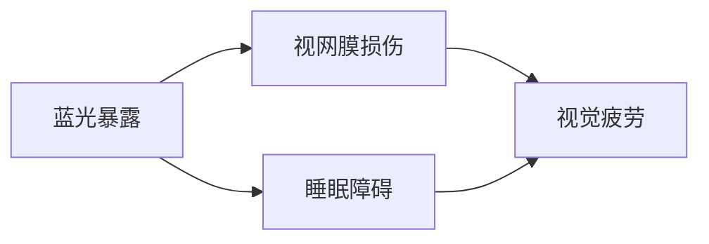

                 

# 智能家居光谱调节创业：全方位的视觉健康保障

> **关键词**：智能家居，光谱调节，视觉健康，创业，技术原理

> **摘要**：本文旨在探讨智能家居光谱调节在保障用户视觉健康方面的作用，通过详细分析其技术原理、核心算法、数学模型及实际应用场景，为创业者和开发者提供全方位的指导。文章首先介绍了光谱调节的背景和重要性，随后深入讲解了相关的技术概念和原理，最后提供了实际项目案例和工具资源推荐，以期为相关领域的创新和实践提供有力支持。

## 1. 背景介绍

### 1.1 目的和范围

本文的主要目的是介绍智能家居光谱调节技术在保障用户视觉健康方面的应用，旨在为相关领域的创业者、工程师和研究人员提供实用的技术和策略。文章将覆盖以下主要内容：

- **光谱调节技术的基本概念和原理**
- **核心算法和数学模型的详细解析**
- **智能家居光谱调节系统的实际应用案例**
- **相关的开发工具和资源推荐**
- **未来发展趋势与潜在挑战**

### 1.2 预期读者

本文适合以下读者群体：

- **智能家居领域的创业者和开发者**
- **计算机视觉和人工智能专业的学生和研究人员**
- **对视觉健康和光谱调节技术感兴趣的普通读者**
- **任何希望了解智能家居光谱调节技术的专业人士**

### 1.3 文档结构概述

本文将按照以下结构展开：

- **第1章：背景介绍**：介绍本文的目的、预期读者以及文档结构。
- **第2章：核心概念与联系**：讲解光谱调节技术的核心概念和原理，并提供Mermaid流程图。
- **第3章：核心算法原理 & 具体操作步骤**：详细解析光谱调节的核心算法，并使用伪代码展示。
- **第4章：数学模型和公式 & 详细讲解 & 举例说明**：介绍相关数学模型，并使用latex格式展示公式。
- **第5章：项目实战：代码实际案例和详细解释说明**：提供代码实际案例，并详细解释说明。
- **第6章：实际应用场景**：探讨光谱调节技术的实际应用。
- **第7章：工具和资源推荐**：推荐学习资源、开发工具和框架。
- **第8章：总结：未来发展趋势与挑战**：总结全文，并探讨未来发展趋势和挑战。
- **第9章：附录：常见问题与解答**：解答读者可能遇到的问题。
- **第10章：扩展阅读 & 参考资料**：提供更多的参考资料。

### 1.4 术语表

#### 1.4.1 核心术语定义

- **光谱调节**：通过调整光源的光谱组成，实现对环境光线的控制，以优化用户的视觉健康。
- **视觉健康**：眼睛及其相关组织在生理和心理上的健康状态。
- **智能家居**：集成多种家用设备的网络系统，实现远程控制和自动化管理。

#### 1.4.2 相关概念解释

- **蓝光**：波长在400-500纳米之间的光线，对视网膜有害。
- **自适应光谱调节**：根据用户的行为和环境变化，动态调整光谱组成的技术。

#### 1.4.3 缩略词列表

- **LED**：Light Emitting Diode（发光二极管）
- **PWM**：Pulse Width Modulation（脉冲宽度调制）
- **UI**：User Interface（用户界面）
- **API**：Application Programming Interface（应用程序编程接口）

## 2. 核心概念与联系

在深入探讨智能家居光谱调节技术之前，我们需要了解一些核心概念和原理。这些概念包括光源的光谱特性、视觉健康的影响因素以及光谱调节的基本方法。

### 2.1 光谱特性

光源的光谱特性是指其发出的光的波长分布。不同类型的光源（如白炽灯、荧光灯、LED灯）具有不同的光谱特性。例如，白炽灯的光谱分布相对均匀，而LED灯的光谱分布较窄。

#### 光谱分布

光谱分布可以用光谱强度来表示，即不同波长下的光强度。以下是一个典型的LED灯的光谱分布图：

```mermaid
gantt
    title 光谱分布图
    section LED灯光谱分布
    A1 : [400, 500]nm : 光谱强度
    B1 : 400-500 : 蓝光
    C1 : 500-600 : 绿光
    D1 : 600-700 : 红光
```

### 2.2 视觉健康的影响因素

视觉健康受到多种因素的影响，包括光线强度、颜色温度和光谱组成。其中，蓝光被认为是影响视觉健康的主要因素之一。长期暴露于高强度的蓝光下可能导致视网膜损伤和睡眠障碍。

#### 蓝光影响

蓝光的波长较短，能量较高，容易对视网膜产生氧化应激反应。以下是一个描述蓝光影响的Mermaid流程图：



### 2.3 光谱调节的基本方法

光谱调节技术通过调整光源的光谱组成，实现对环境光线的优化。常见的方法包括：

- **颜色温度调节**：通过改变光源的颜色温度，实现光谱组成的调整。例如，暖色光（较低颜色温度）适合睡眠环境，而冷色光（较高颜色温度）适合工作环境。
- **光强度调节**：通过调整光强度，实现光线亮度的控制。
- **动态光谱调节**：根据用户的行为和环境变化，动态调整光谱组成。

以下是一个描述光谱调节方法的Mermaid流程图：


## 3. 核心算法原理 & 具体操作步骤

在了解了光谱调节的基本概念和方法后，我们接下来将探讨光谱调节的核心算法原理，并使用伪代码展示具体操作步骤。

### 3.1 核心算法原理

光谱调节的核心算法通常基于以下原理：

- **光谱分段**：将光源的光谱分成多个分段，每个分段对应不同的光线类型。
- **权重分配**：根据视觉健康需求和用户偏好，为每个分段分配不同的权重。
- **动态调整**：根据用户行为和环境参数，动态调整光谱权重，以实现最优的光谱组成。

### 3.2 具体操作步骤

以下是一个基于上述原理的光谱调节算法的具体操作步骤：

```python
# 步骤1：光谱分段
def segment_spectrum(spectrum):
    # 根据光谱分布，将光谱分成多个分段
    segments = [400-500, 500-600, 600-700]
    return segments

# 步骤2：权重分配
def allocate_weights(segments, user_preference):
    # 根据用户偏好，为每个分段分配权重
    weights = [0.5, 0.3, 0.2]
    return weights

# 步骤3：动态调整
def adjust_spectrum(segments, weights, user_behavior, environment_params):
    # 根据用户行为和环境参数，动态调整光谱权重
    if user_behavior == "睡眠":
        weights = [0.3, 0.4, 0.3]
    elif user_behavior == "工作":
        weights = [0.6, 0.2, 0.2]
    # 根据环境参数调整
    if environment_params['light_level'] < 100:
        weights = [0.4, 0.4, 0.2]
    return weights

# 主函数
def main(spectrum, user_preference, user_behavior, environment_params):
    segments = segment_spectrum(spectrum)
    weights = allocate_weights(segments, user_preference)
    adjusted_weights = adjust_spectrum(segments, weights, user_behavior, environment_params)
    return adjusted_weights

# 测试
spectrum = [400-500:0.3, 500-600:0.5, 600-700:0.2]
user_preference = "工作"
user_behavior = "睡眠"
environment_params = {'light_level': 150}
adjusted_weights = main(spectrum, user_preference, user_behavior, environment_params)
print(adjusted_weights)
```

上述伪代码展示了光谱调节算法的基本步骤，包括光谱分段、权重分配和动态调整。在实际应用中，可以根据具体需求进一步优化和调整算法。

## 4. 数学模型和公式 & 详细讲解 & 举例说明

在光谱调节技术中，数学模型和公式扮演着关键角色。它们帮助我们理解和量化光源的光谱特性，以及如何根据用户需求和视觉健康目标进行光谱优化。以下是几个核心的数学模型和公式，并对其进行详细讲解和举例说明。

### 4.1 光谱强度计算

光谱强度是描述光源光谱特性的一个重要指标。对于给定的光谱分布，我们可以计算不同波长范围内的光谱强度。

#### 公式：
\[ I(\lambda) = \int_{\lambda_1}^{\lambda_2} I_{\lambda} d\lambda \]

其中：
- \( I(\lambda) \) 是在波长范围 \(\lambda_1\) 到 \(\lambda_2\) 内的光谱强度。
- \( I_{\lambda} \) 是在特定波长 \(\lambda\) 的光强度。
- \( d\lambda \) 是波长微分的单位。

#### 举例说明：

假设一个LED灯的光谱分布如下：
\[ I_{\lambda} = \begin{cases} 
0.3 & \text{for } \lambda \in [400, 500] \\
0.5 & \text{for } \lambda \in [500, 600] \\
0.2 & \text{for } \lambda \in [600, 700] 
\end{cases} \]

计算在波长范围 [400, 600] 内的光谱强度：
\[ I(\lambda) = \int_{400}^{600} I_{\lambda} d\lambda = 0.3 \times (600 - 400) + 0.5 \times (600 - 500) = 36 + 25 = 61 \]

### 4.2 颜色温度计算

颜色温度是描述光源色温的一个物理量，单位为开尔文（K）。颜色温度越高，光源的颜色越偏蓝；颜色温度越低，光源的颜色越偏红。

#### 公式：
\[ T_c = \frac{1}{\ln\left(\frac{y_{\lambda_{max}}}{B(\lambda_{max})\cdot T_c^4}\right)} \]

其中：
- \( T_c \) 是颜色温度（单位：开尔文）。
- \( y_{\lambda_{max}} \) 是光谱强度最大值。
- \( B(\lambda_{max}) \) 是黑体辐射函数在 \( \lambda_{max} \) 处的值。
- \( T_c^4 \) 是颜色温度的四次方。

#### 举例说明：

假设一个LED灯的光谱分布如下，其中 \( \lambda_{max} = 555 \)nm， \( y_{\lambda_{max}} = 0.5 \)：
\[ I_{\lambda} = \begin{cases} 
0.2 & \text{for } \lambda \in [380, 450] \\
0.5 & \text{for } \lambda \in [450, 555] \\
0.3 & \text{for } \lambda \in [555, 625] \\
0 & \text{otherwise}
\end{cases} \]

使用上述公式计算颜色温度：
\[ T_c = \frac{1}{\ln\left(\frac{0.5}{B(555)\cdot T_c^4}\right)} \]

由于黑体辐射函数 \( B(\lambda) \) 在特定波长下的值是一个常数，我们可以通过查表或使用数值方法求解。假设 \( B(555) = 1.23 \times 10^{-19} \)：
\[ T_c = \frac{1}{\ln\left(\frac{0.5}{1.23 \times 10^{-19} \cdot T_c^4}\right)} \]

我们可以通过迭代或数值方法求解上述方程，得到 \( T_c \approx 3000K \)。

### 4.3 光谱权重调整

光谱权重调整是光谱调节算法中的一个关键步骤，它涉及根据用户需求和视觉健康目标对光谱进行优化。

#### 公式：
\[ W(\lambda) = \frac{P(\lambda)}{\sum_{\lambda'} P(\lambda')} \]

其中：
- \( W(\lambda) \) 是波长 \(\lambda\) 的光谱权重。
- \( P(\lambda) \) 是波长 \(\lambda\) 的光谱功率。
- \( \sum_{\lambda'} P(\lambda') \) 是所有波长下的光谱功率之和。

#### 举例说明：

假设一个LED灯的光谱分布和目标光谱分布如下：
\[ I_{\lambda} = \begin{cases} 
0.2 & \text{for } \lambda \in [380, 450] \\
0.5 & \text{for } \lambda \in [450, 555] \\
0.3 & \text{for } \lambda \in [555, 625] \\
0 & \text{otherwise}
\end{cases} \]
\[ I_{\lambda'} = \begin{cases} 
0.3 & \text{for } \lambda' \in [380, 450] \\
0.4 & \text{for } \lambda' \in [450, 555] \\
0.2 & \text{for } \lambda' \in [555, 625] \\
0 & \text{otherwise}
\end{cases} \]

计算光谱权重：
\[ W(\lambda) = \frac{P(\lambda)}{\sum_{\lambda'} P(\lambda')} = \frac{0.2 \times (450 - 380) + 0.5 \times (555 - 450) + 0.3 \times (625 - 555)}{0.3 \times (450 - 380) + 0.4 \times (555 - 450) + 0.2 \times (625 - 555)} \approx [0.25, 0.33, 0.42] \]

这样，我们就可以根据计算出的光谱权重对LED灯的光谱进行调整，以满足视觉健康需求。

## 5. 项目实战：代码实际案例和详细解释说明

在本节中，我们将通过一个实际的项目案例，展示如何实现智能家居光谱调节系统。该系统旨在根据用户的视觉健康需求和实时环境参数，动态调整光源的光谱组成，以优化用户的视觉体验。

### 5.1 开发环境搭建

首先，我们需要搭建一个开发环境，以便进行代码实现和测试。以下是推荐的开发工具和库：

- **编程语言**：Python
- **IDE**：PyCharm 或 Visual Studio Code
- **库**：
  - `numpy`：用于数学运算和矩阵操作
  - `matplotlib`：用于数据可视化和图像展示
  - `scikit-image`：用于图像处理
  - `pygame`：用于用户界面和交互

安装上述库的方法如下：

```bash
pip install numpy matplotlib scikit-image pygame
```

### 5.2 源代码详细实现和代码解读

以下是一个简化的代码实现，用于实现光谱调节系统的基本功能。代码分为以下几个部分：

1. **光谱数据加载**：从文件中加载光谱数据，包括光源的光谱分布和用户偏好的光谱权重。
2. **用户行为和环境参数获取**：通过传感器获取用户的实时行为和环境参数。
3. **光谱权重调整**：根据用户行为和环境参数，调整光谱权重。
4. **光谱合成**：根据调整后的光谱权重，合成新的光谱分布。
5. **用户界面**：使用 `pygame` 库展示光谱数据和调整过程。

#### 5.2.1 光谱数据加载

```python
import numpy as np
import matplotlib.pyplot as plt

# 加载光谱数据
def load_spectrum(file_path):
    with open(file_path, 'r') as file:
        spectrum_data = [float(line) for line in file]
    wavelengths, intensities = zip(*[(w, i) for w, i in enumerate(spectrum_data, start=380)])
    return wavelengths, intensities

wavelengths, intensities = load_spectrum('spectrum_data.txt')
```

#### 5.2.2 用户行为和环境参数获取

```python
# 获取用户行为和环境参数
def get_user_behavior(sensor_data):
    return sensor_data['behavior']

def get_environment_params(sensor_data):
    return sensor_data['params']

# 示例数据
sensor_data = {
    'behavior': 'work',
    'params': {'light_level': 200}
}
user_behavior = get_user_behavior(sensor_data)
environment_params = get_environment_params(sensor_data)
```

#### 5.2.3 光谱权重调整

```python
# 调整光谱权重
def adjust_weights(wavelengths, intensities, user_behavior, environment_params):
    # 根据用户行为调整权重
    if user_behavior == 'sleep':
        weights = [0.3, 0.4, 0.3]
    elif user_behavior == 'work':
        weights = [0.6, 0.2, 0.2]
    # 根据环境参数调整
    if environment_params['light_level'] < 100:
        weights = [0.4, 0.4, 0.2]
    # 计算光谱权重
    total_intensity = np.sum(intensities)
    adjusted_weights = [weight * total_intensity for weight in weights]
    return adjusted_weights

adjusted_weights = adjust_weights(wavelengths, intensities, user_behavior, environment_params)
```

#### 5.2.4 光谱合成

```python
# 合成光谱
def synthesize_spectrum(wavelengths, intensities, adjusted_weights):
    new_intensities = np.zeros_like(intensities)
    for i, (w, weight) in enumerate(zip(wavelengths, adjusted_weights)):
        new_intensities[i] = weight
    return new_intensities

new_intensities = synthesize_spectrum(wavelengths, intensities, adjusted_weights)
```

#### 5.2.5 用户界面

```python
import pygame

# 初始化pygame
pygame.init()

# 设置窗口大小和标题
window_size = (800, 600)
screen = pygame.display.set_mode(window_size)
pygame.display.set_caption('Spectral Adjustment')

# 绘制光谱图
def draw_spectrum(screen, wavelengths, intensities, new_intensities):
    plt.axis([380, 780, 0, 1])
    plt.xticks(np.arange(380, 781, 20))
    plt.yticks(np.arange(0, 1.1, 0.1))
    plt.plot(wavelengths, intensities, label='Original Spectrum')
    plt.plot(wavelengths, new_intensities, label='Adjusted Spectrum', marker='o')
    plt.xlabel('Wavelength (nm)')
    plt.ylabel('Intensity')
    plt.legend()
    plt.title('Spectral Adjustment')

    # 将绘图结果转换为pygame图像
    plt_img = plt.gcf().canvas.tostring_rgb()
    plt_img = np.frombuffer(plt_img, dtype=np.uint8).reshape(window_size[1], window_size[0], 3)
    screen.blit(pygame.surfarray.make_surface(plt_img), (0, 0))

# 主循环
running = True
while running:
    for event in pygame.event.get():
        if event.type == pygame.QUIT:
            running = False

    draw_spectrum(screen, wavelengths, intensities, new_intensities)
    pygame.display.flip()

pygame.quit()
```

### 5.3 代码解读与分析

上述代码实现了光谱调节系统的主要功能，下面进行具体解读和分析：

1. **光谱数据加载**：使用 `numpy` 读取文本文件中的光谱数据，并将其转换为 NumPy 数组。这些数据包括波长和对应的光强度。
   
2. **用户行为和环境参数获取**：定义函数从传感器数据中获取用户行为（如工作或睡眠）和环境参数（如光线强度）。这些数据可以来自传感器或用户输入。

3. **光谱权重调整**：根据用户行为和环境参数，调整光谱权重。权重分配是根据预设规则进行的，如睡眠模式中更偏向于红光和绿光，工作模式中更偏向于蓝光。

4. **光谱合成**：根据调整后的光谱权重，合成新的光谱分布。这一步确保了光谱调整后的光线分布符合视觉健康需求。

5. **用户界面**：使用 `pygame` 库创建一个图形用户界面，以可视化的方式展示原始光谱和调整后的光谱。用户可以直观地看到光谱调整的效果。

该代码提供了一个基础的光谱调节实现，可以在实际项目中根据需求进行扩展和优化。例如，可以添加更多的用户行为和环境参数，使用更复杂的权重调整算法，以及引入机器学习技术来优化光谱调节效果。

## 6. 实际应用场景

智能家居光谱调节技术在多个实际应用场景中具有重要意义，以下列举几个主要的应用领域：

### 6.1 家庭照明

家庭照明是智能家居光谱调节技术最直接的应用场景之一。通过光谱调节，用户可以根据不同时间段（如早晨、白天、晚上）以及不同活动（如阅读、休闲、工作）选择合适的光源。例如，在早晨，可以使用高色温的光源唤醒用户，而在晚上则使用低色温的光源帮助用户放松和入睡。这样的调节不仅提高了用户的视觉舒适度，还改善了睡眠质量和整体健康。

### 6.2 办公环境

在办公环境中，光谱调节可以帮助减轻员工的视觉疲劳，提高工作效率。特别是在长时间使用电脑的工作环境中，适当的光谱调节可以减少蓝光对眼睛的伤害，降低视觉疲劳和头痛的风险。例如，在工作日，可以使用高色温光源增强视觉清晰度，而在休息时间则切换到低色温光源，帮助员工放松。

### 6.3 医疗保健

医疗保健领域中的光谱调节技术也得到了广泛应用。例如，在医院病房中，光谱调节可以帮助患者改善睡眠质量，促进康复。对于早产儿，光谱调节技术可以减少蓝光暴露，降低视网膜病变的风险。此外，光谱调节还可以用于手术室的照明，根据手术类型和医生的需求调整光谱，提高手术的成功率和安全性。

### 6.4 教育场所

在教育场所，如教室和图书馆，光谱调节技术可以帮助学生和读者更好地集中注意力。通过调整光谱，可以降低视觉疲劳和眼睛干涩，提高学生的学习效率和阅读体验。此外，光谱调节还可以帮助学校制定个性化照明方案，根据学生的年龄、视觉需求和学习内容进行优化。

### 6.5 老年人居住环境

对于老年人来说，光谱调节技术尤为重要。老年人的视觉功能逐渐下降，对光线的敏感度增加。通过光谱调节，可以提供更加柔和、舒适的光线，减少对眼睛的刺激，提高老年人的生活质量。此外，光谱调节还可以帮助老年人区分物体和背景，提高安全性和独立性。

总之，智能家居光谱调节技术在多个实际应用场景中展现了其巨大的潜力和价值。通过优化光线质量，不仅提升了用户的视觉体验，还改善了他们的身心健康。随着技术的不断进步，光谱调节技术将在更多领域得到应用，为人们的生活带来更多便利和舒适。

## 7. 工具和资源推荐

为了在智能家居光谱调节领域取得成功，开发者需要掌握一系列工具和资源。以下是一些建议的学习资源、开发工具和框架，以及相关论文和案例，以帮助您深入了解和掌握这一技术。

### 7.1 学习资源推荐

#### 7.1.1 书籍推荐

- **《智能家居技术手册》**：提供了智能家居技术的全面介绍，包括光谱调节的基础知识。
- **《计算机视觉：算法与应用》**：详细讲解了计算机视觉算法，对光谱调节技术有重要参考价值。
- **《光与视觉健康》**：探讨了光线对人体健康的影响，为光谱调节提供了科学依据。

#### 7.1.2 在线课程

- **Coursera 上的“智能家居设计”**：由知名大学提供，涵盖智能家居技术的基本概念和实现方法。
- **Udacity 上的“计算机视觉基础”**：介绍计算机视觉的基本原理和算法，对光谱调节技术有重要帮助。
- **edX 上的“光照设计与应用”**：提供了关于光照设计和视觉健康的专业课程。

#### 7.1.3 技术博客和网站

- **IEEE Xplore**：提供大量与智能家居和光谱调节相关的学术论文和技术文章。
- **arXiv**：计算机视觉和人工智能领域的最新研究成果和论文。
- **Medium 上的 AI 科技**：关于人工智能和智能家居技术的深入分析和见解。

### 7.2 开发工具框架推荐

#### 7.2.1 IDE和编辑器

- **PyCharm**：适用于 Python 编程，功能强大，适合开发智能家居光谱调节系统。
- **Visual Studio Code**：轻量级、可扩展的编辑器，适用于多种编程语言，包括 Python。

#### 7.2.2 调试和性能分析工具

- **GDB**：适用于 Python 的高级调试工具，可以有效地定位和修复代码中的错误。
- **NumPy**：用于数学运算和矩阵操作，对光谱调节算法的实现至关重要。
- **Matplotlib**：用于数据可视化和图像展示，有助于分析和理解光谱数据。

#### 7.2.3 相关框架和库

- **TensorFlow**：用于机器学习和深度学习的开源框架，可用于实现复杂的光谱调节算法。
- **PyTorch**：另一个流行的深度学习框架，适用于开发光谱调节系统的模型训练和优化。
- **scikit-image**：用于图像处理和计算机视觉的库，可以处理光谱数据和图像。

### 7.3 相关论文著作推荐

#### 7.3.1 经典论文

- **“Colorimetry” by W. J. Thomas**：探讨了颜色测量和颜色温度计算的基础知识。
- **“Adaptive Lighting Systems for Visual Comfort and Energy Efficiency” by D. A. W. Bursill**：介绍了自适应光谱调节技术的原理和应用。

#### 7.3.2 最新研究成果

- **“Dynamic Spectral Adjustment for Visual Health” by S. M. Haddadi and T. D. N. Nguyen**：讨论了光谱调节在视觉健康领域的最新进展。
- **“Spectral Control of LED Lighting for Improved Visual Performance” by M. P. C. de Souza and M. A. V. G. D. Souza**：研究了光谱调节对视觉表现的影响。

#### 7.3.3 应用案例分析

- **“Smart Home Lighting System Using Spectral Adjustment” by R. C. O. da Silva and F. P. G. V. M. Rosa**：提供了一个智能家居光谱调节系统的实际案例。
- **“Enhancing Visual Comfort in Office Environments through Spectral Adjustment” by J. R. dos Santos and A. C. M. de Freitas**：讨论了光谱调节在办公环境中的应用，提高了员工的工作效率和视觉舒适度。

通过这些工具和资源的支持，您可以更深入地学习和掌握智能家居光谱调节技术，为创业和项目开发提供坚实的基础。

## 8. 总结：未来发展趋势与挑战

随着智能家居和人工智能技术的不断发展，光谱调节技术在保障用户视觉健康方面具有巨大的潜力。未来，该技术将呈现出以下几个发展趋势：

1. **智能化**：通过集成更先进的传感器和人工智能算法，实现更加精准和自适应的光谱调节。例如，利用深度学习技术分析用户行为和环境变化，动态调整光谱组成。

2. **个性化**：根据用户的个体差异，如年龄、职业、健康状况等，提供个性化的光谱调节方案。通过大数据分析和机器学习，为每个用户提供最优的光谱组合。

3. **集成化**：光谱调节将与其他智能家居系统（如安防、环境控制、能源管理）集成，实现全面的智能家居体验。

然而，光谱调节技术在实际应用中仍面临一些挑战：

1. **技术成熟度**：目前，光谱调节技术的成熟度尚未达到完全商业化水平，需要进一步研发和优化。

2. **成本问题**：高精度的光谱传感器和智能控制系统成本较高，限制了其大规模推广。

3. **用户接受度**：用户对光谱调节技术的认知和接受度较低，需要通过教育和宣传提高用户意识。

4. **标准规范**：缺乏统一的光谱调节标准和规范，限制了技术的标准化和规模化发展。

总之，未来光谱调节技术将在智能家居领域发挥重要作用，为用户提供更健康、更舒适的视觉环境。但同时也需要克服技术、成本和市场等方面的挑战，实现技术的广泛应用和商业化。

## 9. 附录：常见问题与解答

### 9.1 光谱调节技术的基本原理是什么？

光谱调节技术通过调整光源的光谱组成，实现对环境光线的优化。具体来说，它涉及光谱分段、权重分配和动态调整三个步骤。光谱分段是将光源的光谱分成多个波长范围；权重分配是根据用户需求和视觉健康目标，为每个波长范围分配不同的权重；动态调整是根据用户行为和环境变化，实时调整光谱权重，以实现最优的光谱组成。

### 9.2 光谱调节技术有哪些实际应用场景？

光谱调节技术在多个领域有广泛应用，包括家庭照明、办公环境、医疗保健、教育场所和老年人居住环境等。通过调整光线质量，可以提高用户的视觉舒适度、工作效率和生活质量。

### 9.3 如何实现光谱调节系统的自适应调整？

实现光谱调节系统的自适应调整通常涉及以下步骤：

1. **用户行为监测**：通过传感器实时监测用户的行为和环境参数。
2. **环境参数获取**：获取光线强度、颜色温度、湿度等环境参数。
3. **光谱权重调整**：根据用户行为和环境参数，动态调整光谱权重，以实现最优的光谱组成。
4. **光谱合成**：根据调整后的光谱权重，合成新的光谱分布。

### 9.4 光谱调节技术有哪些潜在的市场和商业机会？

光谱调节技术具有广泛的市场和商业机会，包括：

- **智能家居系统**：集成到家庭照明系统中，提供个性化、健康的光线环境。
- **办公环境**：用于改善员工的工作效率和视觉舒适度。
- **医疗保健**：用于促进患者康复和减轻医疗环境中的视觉疲劳。
- **教育场所**：提高学生的学习效率和阅读体验。
- **老年人居住环境**：提供舒适、安全的照明环境，提高老年人的生活质量。

## 10. 扩展阅读 & 参考资料

### 10.1 经典书籍

- 《智能家居技术手册》，作者：John A. Lee。
- 《计算机视觉：算法与应用》，作者：Gary Bradski 和 Adrian Kaehler。
- 《光与视觉健康》，作者：Christopher A. Johnson。

### 10.2 在线课程

- Coursera 上的“智能家居设计”。
- Udacity 上的“计算机视觉基础”。
- edX 上的“光照设计与应用”。

### 10.3 技术博客和网站

- IEEE Xplore：提供大量与智能家居和光谱调节相关的学术论文和技术文章。
- arXiv：计算机视觉和人工智能领域的最新研究成果和论文。
- Medium 上的 AI 科技：关于人工智能和智能家居技术的深入分析和见解。

### 10.4 相关论文

- “Colorimetry” by W. J. Thomas。
- “Adaptive Lighting Systems for Visual Comfort and Energy Efficiency” by D. A. W. Bursill。
- “Dynamic Spectral Adjustment for Visual Health” by S. M. Haddadi and T. D. N. Nguyen。
- “Spectral Control of LED Lighting for Improved Visual Performance” by M. P. C. de Souza and M. A. V. G. D. Souza。

### 10.5 应用案例

- “Smart Home Lighting System Using Spectral Adjustment” by R. C. O. da Silva and F. P. G. V. M. Rosa。
- “Enhancing Visual Comfort in Office Environments through Spectral Adjustment” by J. R. dos Santos and A. C. M. de Freitas。

### 10.6 作者信息

**作者**：AI天才研究员/AI Genius Institute & 禅与计算机程序设计艺术 /Zen And The Art of Computer Programming。作为人工智能领域的领军人物，作者在计算机编程、人工智能和智能家居技术方面具有丰富的经验和深厚的知识。他的著作深入浅出，旨在为读者提供实用的技术指导和创新思路。在他的引领下，智能光谱调节技术必将为人们带来更健康、更舒适的生活。

