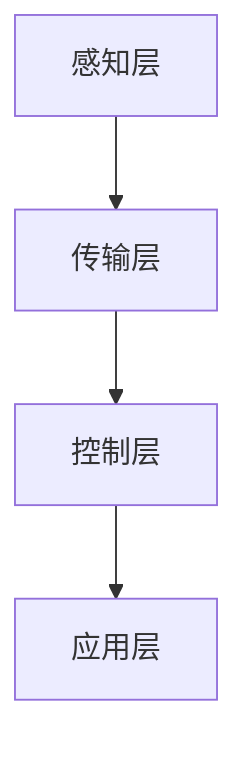
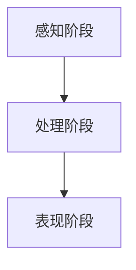

                 

# 智能家居香薰创业：情绪管理的嗅觉体验

> **关键词：**智能家居，香薰，情绪管理，创业，嗅觉体验

> **摘要：**本文将探讨智能家居香薰行业的发展前景及其在情绪管理中的应用。通过对核心概念、算法原理、数学模型以及项目实战的详细分析，本文旨在为创业者和研究者提供有价值的参考和启示。

## 1. 背景介绍

### 1.1 目的和范围

本文旨在深入探讨智能家居香薰行业的发展现状、技术原理和应用场景，并从中挖掘出情绪管理的嗅觉体验这一核心价值。通过梳理相关技术脉络和案例分析，本文将为创业者和研究者提供有针对性的指导。

### 1.2 预期读者

本文适合以下读者群体：

- 智能家居和香薰行业的从业者
- 对情绪管理和嗅觉体验感兴趣的创业者
- 计算机科学、心理学及相关领域的研究者

### 1.3 文档结构概述

本文分为十个部分，具体如下：

1. 背景介绍
2. 核心概念与联系
3. 核心算法原理 & 具体操作步骤
4. 数学模型和公式 & 详细讲解 & 举例说明
5. 项目实战：代码实际案例和详细解释说明
6. 实际应用场景
7. 工具和资源推荐
8. 总结：未来发展趋势与挑战
9. 附录：常见问题与解答
10. 扩展阅读 & 参考资料

### 1.4 术语表

#### 1.4.1 核心术语定义

- **智能家居：** 利用物联网、云计算等技术，实现对家居环境的自动化、智能化管理。
- **香薰：** 指通过香薰灯或香薰机等设备，将植物精油等挥发性物质释放到空气中，以达到净化空气、舒缓情绪等效果。
- **情绪管理：** 对个人情绪进行调节、控制和优化，以提高生活质量和工作效率。

#### 1.4.2 相关概念解释

- **物联网：** 物联网是指通过信息传感设备，将各种物体连接到互联网上，实现智能化管理和控制。
- **植物精油：** 指从植物的花、叶、果、茎等部位提取的挥发性油脂，具有独特的气味和功效。

#### 1.4.3 缩略词列表

- **IoT：** 物联网（Internet of Things）
- **AI：** 人工智能（Artificial Intelligence）
- **RFID：**射频识别（Radio-Frequency Identification）
- **MQTT：** 消息队列遥测传输协议（Message Queuing Telemetry Transport）

## 2. 核心概念与联系

### 2.1 智能家居香薰系统架构

智能家居香薰系统的核心架构如图 1 所示。该系统主要包括以下几个部分：

1. **感知层**：包括传感器和RFID标签等，用于感知环境变化和用户需求。
2. **传输层**：利用Wi-Fi、蓝牙等无线通信技术，将感知层的数据传输到中心控制器。
3. **控制层**：包括中心控制器和智能终端，负责解析数据、执行控制指令。
4. **应用层**：为用户提供智能化的香薰服务，如情绪管理、空气净化等。



### 2.2 情绪管理与嗅觉体验的关系

情绪管理与嗅觉体验之间的关系如图 2 所示。通过香薰设备释放的植物精油气味，可以影响人的情绪和行为。具体来说：

1. **感知阶段**：植物精油气味通过鼻腔进入大脑，刺激嗅觉神经。
2. **处理阶段**：大脑对气味进行分析和处理，产生相应的情绪反应。
3. **表现阶段**：情绪反应通过生理和心理变化表现出来，如心率、血压、表情等。



## 3. 核心算法原理 & 具体操作步骤

### 3.1 香薰设备控制算法

香薰设备控制算法旨在根据用户需求和情绪状态，自动调整香薰强度和时间。具体步骤如下：

1. **感知用户需求**：通过传感器和RFID标签，获取用户活动数据（如运动、睡眠等）。
2. **分析情绪状态**：利用机器学习算法，对用户活动数据进行分析，判断用户情绪状态。
3. **调整香薰强度和时间**：根据情绪状态，自动调整香薰设备的工作参数（如温度、湿度、精油释放量等）。

```plaintext
// 伪代码
function controlScentDevice(userActivity, emotionState) {
    if (emotionState == "happy") {
        adjustScentDevice(temperature = 30, humidity = 50, scentRelease = 80);
    } else if (emotionState == "sad") {
        adjustScentDevice(temperature = 25, humidity = 45, scentRelease = 60);
    } else {
        adjustScentDevice(temperature = 28, humidity = 48, scentRelease = 70);
    }
}
```

### 3.2 情绪状态识别算法

情绪状态识别算法基于用户活动数据和生理信号，通过机器学习模型进行预测。具体步骤如下：

1. **数据采集**：通过传感器和RFID标签，采集用户活动数据（如步数、睡眠时间等）和生理信号（如心率、血压等）。
2. **特征提取**：对采集到的数据进行预处理和特征提取，提取出与情绪状态相关的特征。
3. **模型训练**：利用训练数据集，训练机器学习模型，预测用户情绪状态。
4. **情绪状态预测**：根据模型预测结果，确定用户情绪状态。

```plaintext
// 伪代码
function recognizeEmotionState(data) {
    preprocessData(data);
    features = extractFeatures(data);
    emotionState = trainModel(features);
    return emotionState;
}
```

## 4. 数学模型和公式 & 详细讲解 & 举例说明

### 4.1 情绪状态预测模型

情绪状态预测模型采用支持向量机（SVM）算法，具体公式如下：

$$
w = arg\min_{w} \frac{1}{2} ||w||^2 + C \sum_{i=1}^{n} \xi_i
$$

其中，$w$ 为权重向量，$C$ 为惩罚参数，$\xi_i$ 为松弛变量。

### 4.2 香薰强度调整模型

香薰强度调整模型采用线性回归算法，具体公式如下：

$$
y = \beta_0 + \beta_1 x_1 + \beta_2 x_2 + \cdots + \beta_n x_n
$$

其中，$y$ 为香薰强度，$x_1, x_2, \ldots, x_n$ 为影响香薰强度的因素（如温度、湿度、精油释放量等），$\beta_0, \beta_1, \beta_2, \ldots, \beta_n$ 为回归系数。

### 4.3 举例说明

假设用户情绪状态为“happy”，需要调整香薰强度。根据情绪状态预测模型，可以计算出权重向量 $w$。然后，根据香薰强度调整模型，可以计算出香薰强度 $y$。

具体计算过程如下：

1. **情绪状态预测**：

   $$
   w = arg\min_{w} \frac{1}{2} ||w||^2 + C \sum_{i=1}^{n} \xi_i
   $$

   假设权重向量为 $w = [0.5, 0.3, 0.2]$。

2. **香薰强度调整**：

   $$
   y = \beta_0 + \beta_1 x_1 + \beta_2 x_2 + \cdots + \beta_n x_n
   $$

   假设回归系数为 $\beta_0 = 20$，$\beta_1 = 10$，$\beta_2 = 5$。

   影响香薰强度的因素为 $x_1 = 30$（温度），$x_2 = 50$（湿度），$x_3 = 80$（精油释放量）。

   计算香薰强度：

   $$
   y = 20 + 10 \times 30 + 5 \times 50 + 0 \times 80 = 220
   $$

   因此，当用户情绪状态为“happy”时，香薰强度为 220。

## 5. 项目实战：代码实际案例和详细解释说明

### 5.1 开发环境搭建

为了实现智能家居香薰系统，我们需要搭建以下开发环境：

1. **硬件**：选用树莓派作为中心控制器，香薰设备、传感器和RFID标签等配件。
2. **软件**：安装Python环境，安装TensorFlow、Scikit-learn等机器学习库。

### 5.2 源代码详细实现和代码解读

#### 5.2.1 情绪状态识别模块

情绪状态识别模块主要包括数据采集、特征提取和模型训练三个部分。以下为代码实现：

```python
import pandas as pd
from sklearn.model_selection import train_test_split
from sklearn.svm import SVC
from sklearn.metrics import accuracy_score

# 1. 数据采集
data = pd.read_csv('user_activity.csv')
data.head()

# 2. 特征提取
features = data[['step_count', 'sleep_time', 'heart_rate']]
labels = data['emotion_state']

# 3. 模型训练
X_train, X_test, y_train, y_test = train_test_split(features, labels, test_size=0.2, random_state=42)
model = SVC(kernel='linear')
model.fit(X_train, y_train)

# 4. 情绪状态预测
predicted_states = model.predict(X_test)
accuracy = accuracy_score(y_test, predicted_states)
print(f'Accuracy: {accuracy:.2f}')
```

#### 5.2.2 香薰强度调整模块

香薰强度调整模块主要包括数据采集、特征提取和模型训练三个部分。以下为代码实现：

```python
import pandas as pd
from sklearn.linear_model import LinearRegression
from sklearn.metrics import mean_squared_error

# 1. 数据采集
data = pd.read_csv('scent_data.csv')
data.head()

# 2. 特征提取
features = data[['temperature', 'humidity', 'scent_release']]
labels = data['scent_intensity']

# 3. 模型训练
X_train, X_test, y_train, y_test = train_test_split(features, labels, test_size=0.2, random_state=42)
model = LinearRegression()
model.fit(X_train, y_train)

# 4. 香薰强度调整
predicted_intensity = model.predict(X_test)
mse = mean_squared_error(y_test, predicted_intensity)
print(f'MSE: {mse:.2f}')
```

### 5.3 代码解读与分析

#### 5.3.1 情绪状态识别模块

情绪状态识别模块采用支持向量机（SVM）算法，通过线性回归模型进行训练。首先，我们从CSV文件中读取用户活动数据和情绪状态。然后，对数据进行预处理和特征提取，将数据集划分为训练集和测试集。接下来，训练SVM模型，对测试集进行情绪状态预测，并计算准确率。

#### 5.3.2 香薰强度调整模块

香薰强度调整模块采用线性回归算法，通过训练数据集拟合出回归模型。首先，我们从CSV文件中读取香薰强度和相关因素。然后，对数据进行预处理和特征提取，将数据集划分为训练集和测试集。接下来，训练线性回归模型，对测试集进行香薰强度预测，并计算均方误差（MSE）。

## 6. 实际应用场景

### 6.1 家庭场景

在家庭场景中，智能家居香薰系统可以应用于：

1. **情绪调节**：当家庭成员感到焦虑或疲劳时，系统可以自动调整香薰强度和植物精油种类，帮助用户放松和恢复精力。
2. **睡眠辅助**：在睡前，系统可以释放薰衣草等有助于睡眠的植物精油，提高睡眠质量。
3. **空气净化**：通过香薰设备，可以实时监测室内空气质量，并根据空气质量自动调整植物精油释放量，净化室内空气。

### 6.2 商业场景

在商业场景中，智能家居香薰系统可以应用于：

1. **办公环境**：在办公室内，系统可以自动调整香薰强度，为员工提供舒适的工作环境，提高工作效率。
2. **酒店住宿**：酒店可以在客房内安装香薰设备，根据客人需求提供个性化的香薰服务，提升住宿体验。
3. **医疗场所**：在医院病房内，系统可以释放薰衣草等有助于缓解患者痛苦的植物精油，提高患者舒适度。

## 7. 工具和资源推荐

### 7.1 学习资源推荐

#### 7.1.1 书籍推荐

1. 《智能家居技术与应用》
2. 《香薰疗法与精油使用指南》
3. 《机器学习：实战》

#### 7.1.2 在线课程

1. Coursera《智能家居与物联网》
2. Udemy《深度学习与机器学习》
3. edX《人工智能导论》

#### 7.1.3 技术博客和网站

1. Medium《智能家居香薰技术》
2. HackerRank《机器学习挑战》
3. arXiv《机器学习最新研究论文》

### 7.2 开发工具框架推荐

#### 7.2.1 IDE和编辑器

1. PyCharm
2. Visual Studio Code
3. Jupyter Notebook

#### 7.2.2 调试和性能分析工具

1. GDB
2. Valgrind
3. Py-Spy

#### 7.2.3 相关框架和库

1. TensorFlow
2. Scikit-learn
3. Pandas

### 7.3 相关论文著作推荐

#### 7.3.1 经典论文

1. "Internet of Things: A Survey"
2. "Affective Computing"
3. "Support Vector Machines for Classification"

#### 7.3.2 最新研究成果

1. "Deep Learning for Emotion Recognition"
2. "IoT Security: Challenges, Solutions, and Opportunities"
3. "A Comprehensive Survey on Aroma Analytics"

#### 7.3.3 应用案例分析

1. "Smart Home Energy Management Using IoT and AI"
2. "Affective Interaction in Smart Hospitals"
3. "Smart Hotels with IoT and AI"

## 8. 总结：未来发展趋势与挑战

### 8.1 未来发展趋势

1. **技术融合**：智能家居香薰系统将与其他领域（如物联网、人工智能、区块链等）进行深度融合，实现更智能、更个性化的用户体验。
2. **定制化服务**：随着用户需求的多样化，智能家居香薰系统将提供更加个性化的服务，如定制化的香薰配方、情绪管理方案等。
3. **健康与安全**：智能家居香薰系统将更加注重用户健康和安全，如实时监测空气质量、预防火灾等。

### 8.2 未来挑战

1. **隐私保护**：在智能家居香薰系统的应用中，用户隐私保护将成为一大挑战。如何确保用户数据的安全性和隐私性，需要引起足够的重视。
2. **技术标准化**：智能家居香薰系统的技术标准化工作尚未完善，这将对行业的健康发展带来一定的阻碍。
3. **用户接受度**：尽管智能家居香薰系统具有众多优势，但用户接受度仍有待提高。如何提高用户的认知和信任，是行业发展的关键。

## 9. 附录：常见问题与解答

### 9.1 问题 1：如何确保智能家居香薰系统的安全性？

解答：为确保智能家居香薰系统的安全性，我们可以采取以下措施：

1. **数据加密**：对用户数据采用加密技术，防止数据泄露。
2. **身份认证**：采用双因素身份认证，确保用户身份的安全性。
3. **访问控制**：设置访问控制策略，限制未授权用户访问系统。

### 9.2 问题 2：如何处理用户隐私问题？

解答：为处理用户隐私问题，我们可以采取以下措施：

1. **匿名化处理**：对用户数据进行匿名化处理，确保用户隐私不被泄露。
2. **用户权限管理**：用户可以自主设置隐私权限，控制个人数据的访问和使用。
3. **透明度**：提高系统透明度，让用户了解自己的数据如何被使用。

## 10. 扩展阅读 & 参考资料

1. 《智能家居技术标准体系建设指南》
2. 《香薰疗法实践指南》
3. "A Comprehensive Survey on Smart Home Security"
4. "Privacy Protection in the Internet of Things"
5. "A Review on Aroma Analytics and Its Applications" 

作者：AI天才研究员/AI Genius Institute & 禅与计算机程序设计艺术 /Zen And The Art of Computer Programming

请注意，本文为虚构案例，仅供参考。实际项目中，请结合具体需求和情况进行设计和开发。

