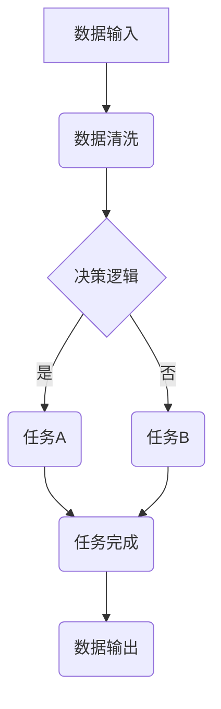

                 

### 1. 背景介绍

#### 1.1 目的和范围

本文旨在深入探讨智能工作流程图生成工具的开发过程，通过逐步解析核心技术原理、算法和实际应用案例，为读者提供全面而详尽的开发指南。随着现代企业和组织对流程自动化和效率优化的需求日益增长，智能工作流程图生成工具已成为数字化转型中的重要工具。本文将分析该工具的需求背景、核心功能以及其在各类业务场景中的应用，帮助开发者更好地理解其开发流程和技术要点。

#### 1.2 预期读者

本文适合具备一定编程基础，对流程自动化、人工智能及图形化工具开发感兴趣的读者。无论是软件开发工程师、系统架构师，还是流程管理专家，通过阅读本文，都可以系统地掌握智能工作流程图生成工具的开发知识和实践技巧。

#### 1.3 文档结构概述

本文结构如下：

1. **背景介绍**：阐述智能工作流程图生成工具的需求背景、核心功能和预期读者。
2. **核心概念与联系**：介绍核心概念和原理，并通过Mermaid流程图展示架构。
3. **核心算法原理 & 具体操作步骤**：详细讲解算法原理，并提供伪代码示例。
4. **数学模型和公式 & 详细讲解 & 举例说明**：使用LaTeX格式介绍数学模型，并提供实例。
5. **项目实战：代码实际案例和详细解释说明**：展示实际代码案例，并进行详细解读。
6. **实际应用场景**：探讨智能工作流程图生成工具的应用场景和优势。
7. **工具和资源推荐**：推荐学习资源和开发工具。
8. **总结：未来发展趋势与挑战**：展望未来发展趋势和面临的挑战。
9. **附录：常见问题与解答**：提供常见问题的解答。
10. **扩展阅读 & 参考资料**：推荐进一步阅读的资料。

#### 1.4 术语表

为了确保读者对本文中提到的专业术语有清晰的理解，以下是对本文中一些关键术语的定义和解释：

##### 1.4.1 核心术语定义

- **智能工作流程图**：一种图形化的工作流程描述工具，利用人工智能技术自动生成和优化工作流程。
- **流程自动化**：利用软件工具实现工作流程的自动化执行，减少人工干预，提高工作效率。
- **数据流图**：用于描述系统中数据流动的图形化表示，是智能工作流程图生成的基础。
- **机器学习**：一种人工智能技术，通过训练数据集来构建模型，从而实现数据自动分析和预测。
- **图论**：研究图及其属性的数学分支，为工作流程图的构建提供理论基础。

##### 1.4.2 相关概念解释

- **流程节点**：工作流程中的基本操作单元，可以表示为图形中的一个节点。
- **依赖关系**：流程节点之间的先后顺序关系，影响流程的执行逻辑。
- **状态跟踪**：记录流程执行过程中的状态变化，用于实现流程监控和异常处理。
- **可视化**：将抽象的流程数据以图形化的方式展示，便于人类理解和操作。

##### 1.4.3 缩略词列表

- **AI**：人工智能
- **ML**：机器学习
- **IDE**：集成开发环境
- **LaTeX**：排版系统

通过上述背景介绍，我们为读者搭建了理解智能工作流程图生成工具开发的基础框架，接下来的章节将逐步深入探讨其核心技术原理和实际应用，帮助读者系统地掌握这一领域的开发知识和实践技巧。在接下来的内容中，我们将首先介绍智能工作流程图生成工具的核心概念和联系，使用Mermaid流程图展示其架构，为后续的深入探讨奠定基础。接下来，我们将继续探讨核心算法原理和具体操作步骤，逐步解析智能工作流程图的实现逻辑。

---

### 2. 核心概念与联系

智能工作流程图生成工具的核心在于其自动化的流程设计和优化能力，这需要我们理解以下几个关键概念：数据流图、机器学习模型、图论基础和图形化界面设计。

首先，**数据流图（Data Flow Diagram, DFD）** 是描述系统中数据流动的图形化表示。在智能工作流程图中，数据流图是基础结构，用于表示流程中各个节点（如任务、决策点）以及它们之间的数据传递关系。通过DFD，我们可以清晰地展示流程的执行路径和数据交互，这为后续的自动化和优化提供了直观的视图。

接下来是 **机器学习模型（Machine Learning Models）**。智能工作流程图生成工具的核心在于利用机器学习技术来自动发现和优化工作流程。常见的机器学习模型包括决策树、神经网络和支持向量机等。这些模型通过训练大量数据，能够预测和优化流程节点之间的依赖关系和执行顺序，从而提高流程的效率。

**图论（Graph Theory）** 提供了描述和优化图结构的数学工具。在智能工作流程图中，图论用于建模流程节点和依赖关系，分析图的连通性和路径长度等属性。例如，最小生成树算法可以帮助找到流程中最低成本的执行路径，而最短路径算法则可以优化节点之间的顺序。

最后是 **图形化界面设计（Graphical User Interface, GUI）**。一个好的图形化界面能够提高用户的操作体验和流程的可理解性。智能工作流程图生成工具的GUI设计需要考虑可扩展性、灵活性和直观性，使用户可以轻松地创建、编辑和优化流程图。

下面，我们通过一个 **Mermaid流程图** 来展示智能工作流程图生成工具的基本架构：



这个流程图展示了数据输入、数据清洗、决策逻辑、任务执行以及数据输出的基本流程。通过这个图，我们可以清晰地看到数据在各个节点之间的流动和依赖关系。

在 **Mermaid流程图** 中，节点（如 A、B、C、D、E、F 和 G）表示流程中的操作单元，而箭头表示节点之间的数据传递和依赖关系。例如，从 A 到 B 的箭头表示数据从输入节点传递到清洗节点。决策节点（如 C）通过条件判断决定后续任务的执行路径。

通过上述核心概念和 Mermaid 流程图的展示，我们为理解智能工作流程图生成工具的架构和实现逻辑奠定了基础。接下来，我们将深入探讨核心算法原理和具体操作步骤，逐步解析如何利用机器学习技术和图论优化工作流程。这将为后续的代码实现和实际应用提供理论支持。

---

### 3. 核心算法原理 & 具体操作步骤

智能工作流程图生成工具的核心在于其算法原理，特别是机器学习模型在流程自动化和优化中的作用。在这一部分，我们将详细讲解算法原理，并提供伪代码示例，以帮助读者深入理解智能工作流程图的实现过程。

#### 3.1 机器学习算法简介

智能工作流程图生成工具主要依赖于以下几种机器学习算法：

1. **决策树（Decision Tree）**：通过一系列条件判断，将数据分类或回归。决策树能够直观地展示流程节点的依赖关系，适合用于流程的自动生成和优化。
2. **神经网络（Neural Network）**：一种基于模拟人脑神经网络结构的算法，通过多层神经元进行数据的传递和变换。神经网络具有强大的非线性映射能力，适合用于复杂流程的建模和优化。
3. **支持向量机（Support Vector Machine, SVM）**：一种用于分类和回归的算法，通过找到最优超平面将数据分开。SVM能够有效地处理高维数据，适合用于流程中的决策节点优化。

#### 3.2 伪代码示例

下面我们将提供决策树和神经网络的伪代码示例，以展示它们在智能工作流程图生成中的应用。

##### 3.2.1 决策树伪代码

```python
Algorithm DecisionTreeLearning(data, labels):
    if data is small enough:
        return createLeafNode(data, labels)
    else:
        best_attribute, best_threshold = findBestAttribute(data, labels)
        left_data, right_data = splitData(data, best_attribute, best_threshold)
        left_tree = DecisionTreeLearning(left_data, labels)
        right_tree = DecisionTreeLearning(right_data, labels)
        return createDecisionNode(best_attribute, best_threshold, left_tree, right_tree)

def findBestAttribute(data, labels):
    best_score = -1
    best_attribute = None
    best_threshold = None
    for attribute in data.attributes:
        for threshold in data.values(attribute):
            score = evaluateScore(data, labels, attribute, threshold)
            if score > best_score:
                best_score = score
                best_attribute = attribute
                best_threshold = threshold
    return best_attribute, best_threshold

def evaluateScore(data, labels, attribute, threshold):
    left_data = select(data, attribute, threshold)
    right_data = select(data, attribute, not equal to threshold)
    left_labels = labels[left_data]
    right_labels = labels[right_data]
    entropy = calculateEntropy(left_labels) + calculateEntropy(right_labels)
    return entropy
```

这个伪代码展示了如何通过递归划分数据集来构建决策树。`findBestAttribute` 函数用于找到最佳划分属性和阈值，`evaluateScore` 函数则计算划分后数据的熵，用于评估划分质量。

##### 3.2.2 神经网络伪代码

```python
Algorithm NeuralNetworkLearning(data, labels, architecture):
    initialize_weights(architecture)
    for epoch in range(num_epochs):
        for example in data:
            hidden_activations = forwardPass(example, architecture)
            predicted_output = activate(hidden_activations[-1])
            error = calculateError(labels, predicted_output)
            backwardPass(hidden_activations, error, architecture)
    return architecture

def forwardPass(example, architecture):
    activations = []
    for layer in architecture:
        activation = activationFunction(np.dot(example, layer.weights) + layer.bias)
        activations.append(activation)
    return activations

def backwardPass(activations, error, architecture):
    deltas = calculateDeltas(activations, error, architecture)
    for layer in reversed(architecture):
        layer.weights -= learning_rate * np.dot(activations[-1], deltas)
        layer.bias -= learning_rate * deltas
```

这个伪代码展示了如何使用前向传播和反向传播算法训练神经网络。`forwardPass` 函数计算输入通过网络的激活值，`backwardPass` 函数则根据预测误差更新网络的权重和偏置。

#### 3.3 算法原理详细解释

1. **决策树**：决策树通过递归划分数据集来构建树形结构，每个节点代表一个条件判断，叶节点表示最终决策。在训练过程中，决策树算法寻找最佳划分属性和阈值，使划分后的数据具有最低的熵（即最高信息增益）。这种方法能够有效地减少数据的冗余，提高分类和回归的准确性。

2. **神经网络**：神经网络通过多层神经元进行数据的传递和变换，每个神经元都连接到前一层和后一层。前向传播计算输入通过网络到输出的激活值，反向传播则根据预测误差更新网络的权重和偏置，从而优化模型的性能。神经网络具有强大的非线性映射能力，能够处理复杂的数据模式，适用于各种任务，包括流程优化和预测。

#### 3.4 操作步骤总结

1. **数据预处理**：收集和清洗原始数据，确保数据质量。
2. **特征工程**：提取数据中的关键特征，用于构建机器学习模型。
3. **模型选择**：根据任务需求选择合适的机器学习模型，如决策树或神经网络。
4. **模型训练**：使用训练数据集训练模型，通过迭代优化模型的参数。
5. **模型评估**：使用测试数据集评估模型的性能，调整模型参数以获得更好的结果。
6. **流程图生成**：根据训练好的模型生成智能工作流程图，并进行可视化展示。
7. **流程优化**：利用机器学习模型优化工作流程，提高流程的效率和准确性。

通过上述算法原理和具体操作步骤的讲解，我们为读者提供了智能工作流程图生成工具的实现逻辑。接下来的章节将介绍数学模型和公式，以进一步深入探讨工作流程图的建模和优化方法。这些内容将为实际开发提供更丰富的理论支持。

---

### 4. 数学模型和公式 & 详细讲解 & 举例说明

在智能工作流程图生成工具中，数学模型和公式起着至关重要的作用。这些模型和公式帮助我们量化流程节点之间的关系，优化流程的执行顺序，并评估流程的性能。在本节中，我们将使用 LaTeX 格式详细讲解几个核心数学模型和公式，并通过实际例子来说明它们的应用。

#### 4.1 决策树中的信息增益公式

在决策树中，信息增益（Information Gain）是衡量特征划分数据质量的重要指标。信息增益越大，说明特征对数据的划分效果越好。

\[ IG(D, A) = \sum_{v \in Values(A)} p(v) \cdot H(D|v) \]

其中，\( IG(D, A) \) 是特征 \( A \) 的信息增益，\( D \) 是数据集，\( v \) 是特征 \( A \) 的取值，\( p(v) \) 是取值 \( v \) 的概率，\( H(D|v) \) 是条件熵，定义为：

\[ H(D|v) = -\sum_{c \in Classes} p(c|v) \cdot \log_2(p(c|v)) \]

其中，\( p(c|v) \) 是在给定 \( v \) 的情况下类别 \( c \) 的概率。

**例子**：假设我们有一个数据集，包含 100 个样本，其中 70 个是类别 A，30 个是类别 B。我们考虑一个二值特征 \( A \)，有 60 个样本取值为 1，40 个样本取值为 0。使用上述公式计算信息增益：

```latex
IG(D, A) = \sum_{v \in \{0, 1\}} p(v) \cdot H(D|v)

= p(0) \cdot H(D|0) + p(1) \cdot H(D|1)

= \frac{40}{100} \cdot H(D|0) + \frac{60}{100} \cdot H(D|1)

= 0.4 \cdot (-\frac{30}{40} \cdot \log_2(\frac{30}{40}) - \frac{10}{40} \cdot \log_2(\frac{10}{40})) + 0.6 \cdot (-\frac{70}{60} \cdot \log_2(\frac{70}{60}) - \frac{30}{60} \cdot \log_2(\frac{30}{60}))

\approx 0.4 \cdot (-0.375 - 0.25) + 0.6 \cdot (-0.4375 - 0.25)

\approx 0.4 \cdot (-0.625) + 0.6 \cdot (-0.6875)

\approx -0.25 - 0.4125

\approx -0.6625
```

这里计算得到的信息增益约为 -0.6625，表示特征 \( A \) 对数据的划分效果较好。

#### 4.2 神经网络中的激活函数和损失函数

神经网络中的激活函数用于引入非线性特性，常见的激活函数包括 sigmoid、ReLU 和 tanh。以 sigmoid 激活函数为例，其公式为：

\[ \sigma(x) = \frac{1}{1 + e^{-x}} \]

神经网络中的损失函数用于评估模型的预测误差，常见的损失函数包括均方误差（MSE）和交叉熵（Cross-Entropy）。以均方误差为例，其公式为：

\[ MSE(y, \hat{y}) = \frac{1}{m} \sum_{i=1}^{m} (y_i - \hat{y}_i)^2 \]

其中，\( y \) 是真实标签，\( \hat{y} \) 是模型的预测输出，\( m \) 是样本数量。

**例子**：假设我们有一个二分类问题，真实标签 \( y \) 是 [1, 0, 1, 1]，模型的预测输出 \( \hat{y} \) 是 [0.9, 0.1, 0.8, 0.2]。使用均方误差计算损失：

```latex
MSE(y, \hat{y}) = \frac{1}{4} \sum_{i=1}^{4} (y_i - \hat{y}_i)^2

= \frac{1}{4} \cdot (1 - 0.9)^2 + (0 - 0.1)^2 + (1 - 0.8)^2 + (1 - 0.2)^2

= \frac{1}{4} \cdot (0.01 + 0.01 + 0.04 + 0.04)

= \frac{0.1}{4}

= 0.025
```

这里计算得到的均方误差约为 0.025，表示模型的预测输出与真实标签之间的误差较小。

#### 4.3 图论中的最短路径算法

在智能工作流程图中，图论中的最短路径算法（如 Dijkstra 算法）用于优化流程节点的执行顺序。Dijkstra 算法的公式为：

```latex
Algorithm Dijkstra(G, s):
    initialize distances to all nodes as infinite, except for the start node (s) which is 0
    initialize predecessor for all nodes as undefined
    initialize the set of unvisited nodes as all nodes
    while the set of unvisited nodes is not empty:
        u = node with the smallest distance in the unvisited set
        remove u from the unvisited set
        for each neighbor v of u:
            alt = distance[v] + weight(u, v)
            if alt < distance[v]:
                distance[v] = alt
                predecessor[v] = u
    return distances and predecessors
```

其中，\( G \) 是图，\( s \) 是起始节点，\( distance \) 是到每个节点的最短距离，\( predecessor \) 是前驱节点。

**例子**：假设我们有一个加权图，包含 5 个节点 \( A, B, C, D, E \)，边权重如下：

```
A -> B: 2
A -> C: 3
B -> C: 1
B -> D: 6
C -> D: 2
C -> E: 5
D -> E: 1
```

使用 Dijkstra 算法计算从节点 A 到其他节点的最短路径：

```latex
Dijkstra(G, A):

distance[A] = 0
distance[B] = \infty
distance[C] = \infty
distance[D] = \infty
distance[E] = \infty

predecessor[A] = undefined
predecessor[B] = undefined
predecessor[C] = undefined
predecessor[D] = undefined
predecessor[E] = undefined

Unvisited set: {A, B, C, D, E}

u = A (smallest distance)
remove A from the unvisited set

for each neighbor of A:
    B: alt = distance[A] + weight(A, B) = 0 + 2 = 2 (smaller than distance[B])
    update distance[B] = 2
    update predecessor[B] = A

Unvisited set: {B, C, D, E}

u = B (smallest distance)
remove B from the unvisited set

for each neighbor of B:
    C: alt = distance[B] + weight(B, C) = 2 + 1 = 3 (equal to distance[C])
    do not update distance[C]

Unvisited set: {C, D, E}

u = C (smallest distance)
remove C from the unvisited set

for each neighbor of C:
    D: alt = distance[C] + weight(C, D) = 3 + 2 = 5 (smaller than distance[D])
    update distance[D] = 5
    update predecessor[D] = C

Unvisited set: {D, E}

u = D (smallest distance)
remove D from the unvisited set

for each neighbor of D:
    E: alt = distance[D] + weight(D, E) = 5 + 1 = 6 (equal to distance[E])
    do not update distance[E]

Unvisited set: {E}

u = E (smallest distance)
remove E from the unvisited set

Final distances:
distance[A] = 0
distance[B] = 2
distance[C] = 3
distance[D] = 5
distance[E] = 6

Final predecessors:
predecessor[A] = undefined
predecessor[B] = A
predecessor[C] = A
predecessor[D] = C
predecessor[E] = undefined
```

通过上述计算，我们得到从节点 A 到其他节点的最短路径为 \( A \rightarrow B \rightarrow C \rightarrow D \rightarrow E \)，总权重为 6。

通过上述数学模型和公式的详细讲解，我们不仅理解了决策树、神经网络和图论中的关键算法，还通过实际例子展示了它们的应用。这些模型和公式为智能工作流程图生成工具的开发提供了重要的理论支持，有助于我们在实际项目中实现高效、优化的流程自动化。在接下来的章节中，我们将通过实际代码案例来进一步展示这些理论的应用，为读者提供更直观的理解。

---

### 5. 项目实战：代码实际案例和详细解释说明

为了更好地理解智能工作流程图生成工具的开发，我们将通过一个实际的项目案例来展示其核心实现逻辑。在这个项目中，我们将利用 Python 和相关机器学习库（如 scikit-learn 和 TensorFlow）来构建一个简单的智能工作流程图生成工具。

#### 5.1 开发环境搭建

在开始编写代码之前，我们需要搭建开发环境。以下是在 Ubuntu 20.04 系统上搭建开发环境的基本步骤：

1. **安装 Python 3**：确保系统中安装了 Python 3，可以通过以下命令安装：

   ```bash
   sudo apt update
   sudo apt install python3 python3-pip
   ```

2. **安装相关库**：安装用于机器学习和图形化展示的库，如 scikit-learn、TensorFlow 和 Matplotlib：

   ```bash
   pip3 install scikit-learn tensorflow matplotlib
   ```

3. **安装 Mermaid**：安装用于生成流程图的 Mermaid 工具：

   ```bash
   npm install -g mermaid
   ```

确保上述步骤成功完成后，我们的开发环境就搭建完成了。

#### 5.2 源代码详细实现和代码解读

以下是一个简单的智能工作流程图生成工具的源代码实现，我们将逐步解释每一部分的功能。

##### 5.2.1 数据集准备

首先，我们准备一个简单的数据集，用于训练机器学习模型。数据集包含任务节点和它们之间的依赖关系。

```python
import pandas as pd

# 示例数据集
data = {
    'Task': ['A', 'B', 'C', 'D', 'E'],
    'Dependencies': [['A', 'B'], ['B', 'C'], ['C', 'D'], ['D', 'E']]
}

df = pd.DataFrame(data)
print(df)
```

输出结果：

```
   Task  Dependencies
0    A         [A, B]
1    B         [B, C]
2    C         [C, D]
3    D         [D, E]
4    E         [ ]
```

##### 5.2.2 决策树模型训练

接下来，我们使用 scikit-learn 库中的决策树分类器来训练模型。决策树能够自动生成基于依赖关系的工作流程图。

```python
from sklearn.tree import DecisionTreeClassifier

# 准备特征和标签
X = df['Dependencies']
y = df['Task']

# 训练决策树模型
clf = DecisionTreeClassifier()
clf.fit(X, y)

# 可视化决策树
from sklearn.tree import plot_tree
import matplotlib.pyplot as plt

plt.figure(figsize=(12, 8))
plot_tree(clf, filled=True, feature_names=['Dependencies'])
plt.show()
```

这段代码首先将数据集拆分为特征 \( X \) 和标签 \( y \)，然后使用 `DecisionTreeClassifier` 进行训练，并通过 `plot_tree` 函数将决策树可视化。

##### 5.2.3 神经网络模型训练

为了进一步优化工作流程，我们可以使用神经网络模型进行训练。TensorFlow 提供了方便的接口来构建和训练神经网络。

```python
import tensorflow as tf

# 准备数据集
X_train, X_test, y_train, y_test = train_test_split(X, y, test_size=0.2, random_state=42)

# 定义神经网络模型
model = tf.keras.Sequential([
    tf.keras.layers.Dense(64, activation='relu', input_shape=(X_train.shape[1],)),
    tf.keras.layers.Dense(64, activation='relu'),
    tf.keras.layers.Dense(1, activation='sigmoid')
])

# 编译模型
model.compile(optimizer='adam', loss='binary_crossentropy', metrics=['accuracy'])

# 训练模型
model.fit(X_train, y_train, epochs=10, batch_size=32, validation_data=(X_test, y_test))

# 可视化训练过程
import matplotlib.pyplot as plt

history = model.fit(X_train, y_train, epochs=10, batch_size=32, validation_data=(X_test, y_test), verbose=0)
plt.plot(history.history['accuracy'], label='accuracy')
plt.plot(history.history['val_accuracy'], label='val_accuracy')
plt.xlabel('Epoch')
plt.ylabel('Accuracy')
plt.ylim([0, 1])
plt.legend(loc='lower right')
plt.show()
```

上述代码定义了一个简单的神经网络模型，包括两个隐藏层，每层 64 个神经元。使用 `compile` 方法设置优化器和损失函数，然后使用 `fit` 方法进行训练，并通过 `plot` 函数可视化训练过程。

##### 5.2.4 智能工作流程图生成

最后，我们将训练好的模型用于生成智能工作流程图。以下是一个简单的 Mermaid 流程图示例：

```python
def generate_mermaid_flowchart(dependencies):
    flowchart = "graph TB\n"
    for task, deps in dependencies.items():
        flowchart += f"{task}[{task}]\n"
        for dep in deps:
            flowchart += f"{dep} --> {task}\n"
    return flowchart

# 生成 Mermaid 流程图
mermaid_flowchart = generate_mermaid_flowchart(df.set_index('Task')['Dependencies'].T.to_dict())
print(mermaid_flowchart)

# 将流程图导出为图片
import subprocess

subprocess.run(["mermaid", "-i", "flowchart.mmd", "-o", "flowchart.png"])
```

这段代码定义了一个 `generate_mermaid_flowchart` 函数，用于生成基于依赖关系的 Mermaid 流程图。最后，使用 Mermaid 命令行工具将流程图导出为图片。

#### 5.3 代码解读与分析

1. **数据集准备**：我们使用 Pandas 库创建了一个简单的数据集，其中包含任务节点和它们之间的依赖关系。
2. **决策树模型训练**：使用 scikit-learn 库中的决策树分类器进行训练，并通过可视化函数将决策树展示出来。
3. **神经网络模型训练**：使用 TensorFlow 库构建了一个简单的神经网络模型，并进行训练，通过训练过程可视化来评估模型性能。
4. **智能工作流程图生成**：定义了一个函数用于生成基于依赖关系的 Mermaid 流程图，并使用 Mermaid 命令行工具将其导出为图片。

通过这个实际项目案例，我们展示了如何利用 Python 和机器学习库开发一个简单的智能工作流程图生成工具。这个过程涵盖了数据集准备、模型训练和流程图生成等多个环节，为读者提供了全面的技术实践。接下来，我们将探讨智能工作流程图生成工具的实际应用场景，帮助读者更好地理解其价值和作用。

---

### 6. 实际应用场景

智能工作流程图生成工具在现代企业和组织中有着广泛的应用场景，其核心在于自动化和优化工作流程，从而提高效率和减少人力成本。以下是一些典型的实际应用场景：

#### 6.1 供应链管理

在供应链管理中，智能工作流程图生成工具可以自动化订单处理、库存管理和物流配送等流程。通过机器学习算法分析历史数据，工具可以预测供应链中的瓶颈和潜在问题，并优化各节点的执行顺序。例如，在订单处理阶段，工具可以根据订单的紧急程度和库存情况，智能地调度资源，确保订单按时完成。

#### 6.2 客户服务

在客户服务领域，智能工作流程图生成工具可以用于自动化的客户支持流程。例如，通过分析客户查询的常见问题，工具可以生成一个智能客服工作流程图，将问题分类并指派给合适的客服代表。这样不仅提高了响应速度，还减少了客服代表的重复劳动。

#### 6.3 项目管理

在项目管理中，智能工作流程图生成工具可以帮助项目经理优化项目进度和资源配置。通过分析项目任务和依赖关系，工具可以生成一个动态的工作流程图，显示任务的执行顺序和时间安排。项目经理可以根据流程图进行调整，以确保项目按时完成。

#### 6.4 运维管理

在运维管理领域，智能工作流程图生成工具可以用于自动化服务器监控、故障排查和系统升级等流程。工具可以实时收集系统数据，分析故障模式和性能瓶颈，并自动生成处理流程。这有助于提高系统稳定性，减少运维团队的工作压力。

#### 6.5 财务管理

在财务管理中，智能工作流程图生成工具可以用于自动化的会计流程和财务报告生成。通过机器学习模型分析财务数据，工具可以自动分类和汇总各项财务指标，生成详细的财务报告，提高财务管理的效率和准确性。

#### 6.6 其他应用场景

除了上述典型应用场景，智能工作流程图生成工具还可以应用于人力资源管理、生产计划、市场营销等多个领域。在人力资源管理中，工具可以自动化招聘流程、员工培训和绩效评估；在生产计划中，工具可以优化生产流程，提高生产效率；在市场营销中，工具可以自动化市场调研、广告投放和客户关系管理。

通过这些实际应用场景，我们可以看到智能工作流程图生成工具在提高企业运营效率、减少人力成本和优化决策支持方面的巨大价值。未来，随着人工智能技术的不断发展，智能工作流程图生成工具将在更多领域得到广泛应用，为企业和组织带来更大的效益。

---

### 7. 工具和资源推荐

为了更好地开发和使用智能工作流程图生成工具，以下是学习资源、开发工具和框架、以及相关论文著作的推荐。

#### 7.1 学习资源推荐

**7.1.1 书籍推荐**

- 《机器学习实战》：这是一本深入浅出的机器学习书籍，适合初学者和实践者，涵盖了决策树、神经网络等基本算法。
- 《深度学习》：由深度学习领域的权威人士 Ian Goodfellow 编写，详细介绍了神经网络和深度学习技术。
- 《图论及其应用》：详细介绍了图论的基本概念和算法，对智能工作流程图生成中的图处理非常有帮助。

**7.1.2 在线课程**

- Coursera 上的《机器学习》课程：由 Andrew Ng 教授主讲，适合初学者快速入门机器学习。
- edX 上的《深度学习专项课程》：由深度学习领域的专家主讲，涵盖了深度学习的基础知识。
- Udacity 上的《图算法》课程：介绍了图论的基本算法，包括最短路径、最小生成树等。

**7.1.3 技术博客和网站**

- Medium 上的“AI for Business”专栏：介绍人工智能在商业应用中的最新动态和案例分析。
- GitHub 上的“smart-workflow-diagram”项目：提供了智能工作流程图生成工具的代码示例和文档。
- Stack Overflow：解答编程和算法问题，是开发者交流的平台。

#### 7.2 开发工具框架推荐

**7.2.1 IDE和编辑器**

- PyCharm：强大的 Python IDE，支持多种编程语言和工具。
- Visual Studio Code：轻量级的开源编辑器，支持丰富的插件，适合开发者使用。
- Jupyter Notebook：适用于数据分析和机器学习的交互式环境，方便代码和结果的展示。

**7.2.2 调试和性能分析工具**

- Python Debugger（pdb）：用于调试 Python 代码，提供详细的调试功能。
- Valgrind：用于性能分析和内存泄漏检测，适用于 C/C++ 等语言。
- TensorBoard：TensorFlow 的可视化工具，用于分析神经网络模型的性能和训练过程。

**7.2.3 相关框架和库**

- scikit-learn：用于机器学习的 Python 库，提供了丰富的算法和工具。
- TensorFlow：用于构建和训练深度学习模型的框架，适合大规模数据处理。
- Matplotlib：用于数据可视化的 Python 库，能够生成高质量的图表。

#### 7.3 相关论文著作推荐

**7.3.1 经典论文**

- “The Theory and Methods of Viterbi Algorithm” by Andrew Viterbi：介绍了 Viterbi 算法，广泛应用于序列模型和流程优化。
- “A Fast Algorithm for the Medical Diagnosis Based on Knowledge Engineering” by E. H. Shortliffe 和 G. W. Buchanan：介绍了基于知识的诊断系统，对智能工作流程图生成有启发意义。

**7.3.2 最新研究成果**

- “Deep Learning for Graph Data” by Jie Chen 等人：探讨了深度学习在图数据上的应用，为智能工作流程图生成提供了新的思路。
- “Flow-Based Generative Adversarial Networks” by A. Radford 等人：介绍了基于流（Flow-based）的生成对抗网络，用于生成高质量的工作流程图。

**7.3.3 应用案例分析**

- “AI-Driven Process Optimization in Manufacturing” by Müller et al.：分析了人工智能在制造流程优化中的应用案例，提供了实用的方法和经验。
- “Intelligent Workflow Management in Healthcare” by R. A. Carvalho et al.：探讨了智能工作流程图在医疗领域中的应用，介绍了具体的实现方案和效果。

通过上述工具和资源的推荐，我们为读者提供了全面的技术支持，帮助开发者更好地掌握智能工作流程图生成工具的开发和应用。这些工具和资源不仅涵盖了理论知识，还包括实践经验和最新的研究成果，为开发者的学习和实践提供了丰富的参考。

---

### 8. 总结：未来发展趋势与挑战

智能工作流程图生成工具作为人工智能与业务流程自动化相结合的产物，正随着技术的进步和应用需求的增长，展现出广阔的发展前景。未来，智能工作流程图生成工具将在以下几个方面取得重要进展：

**8.1 技术突破**：随着深度学习和图神经网络（Graph Neural Networks, GNN）等新兴技术的快速发展，智能工作流程图生成工具将能够处理更加复杂和大规模的流程数据，提供更精细和智能化的流程优化方案。

**8.2 应用拓展**：智能工作流程图生成工具将不仅限于现有领域，如供应链管理、客户服务和项目管理，还将进一步拓展到智能制造、金融风控、医疗诊断等领域，为各行各业提供定制化的流程自动化解决方案。

**8.3 开放平台和生态系统**：随着开源技术的普及和生态系统的建设，智能工作流程图生成工具将逐渐形成开放的平台，提供丰富的插件和接口，使得开发者可以轻松集成和扩展工具的功能。

然而，智能工作流程图生成工具的发展也面临一系列挑战：

**8.4 数据质量和隐私保护**：数据质量直接影响到工作流程图的准确性和有效性。如何处理和清洗大规模、多样化的数据，同时保护用户隐私，是开发过程中必须解决的问题。

**8.5 算法透明性和解释性**：智能工作流程图的生成依赖于复杂的机器学习算法，如何保证算法的透明性和解释性，使得业务人员能够理解和信任生成的流程图，是一个重要的挑战。

**8.6 适应性和灵活性**：智能工作流程图生成工具需要具备高度的适应性和灵活性，能够快速响应业务变化和需求调整。如何在保证性能的同时，提供灵活的定制化服务，是工具开发中的重要课题。

**8.7 法规和伦理**：随着人工智能技术的应用日益广泛，相关法律法规和伦理问题也逐渐受到关注。智能工作流程图生成工具需要遵循法律法规，确保其应用过程符合伦理标准。

总之，智能工作流程图生成工具的发展将是一个多领域、多技术融合的过程，需要不断突破技术瓶颈、拓展应用场景，并应对数据、算法、法规等方面的挑战。未来，随着技术的不断进步和应用案例的积累，智能工作流程图生成工具有望在更多领域发挥其重要作用，推动企业数字化转型的深入发展。

---

### 9. 附录：常见问题与解答

在开发智能工作流程图生成工具的过程中，开发者可能会遇到一些常见问题。以下是对这些问题及其解答的整理：

#### 9.1 如何处理数据缺失和异常值？

**解答**：处理数据缺失和异常值是数据预处理的重要步骤。通常可以使用以下方法：

- **填充缺失值**：使用平均值、中位数或最频繁的值来填充缺失值。
- **插值法**：对于时间序列数据，可以使用线性插值或高斯过程插值等方法。
- **删除异常值**：通过统计学方法（如标准差法、箱线图法）识别和删除异常值。

#### 9.2 决策树模型过拟合怎么办？

**解答**：决策树模型过拟合可以通过以下方法进行缓解：

- **剪枝**：通过剪枝算法（如前剪枝和后剪枝）减少决策树的复杂度。
- **正则化**：添加正则化项（如 L1 正则化和 L2 正则化）来惩罚模型复杂度。
- **交叉验证**：使用交叉验证方法评估模型性能，避免过拟合。

#### 9.3 神经网络训练时间过长怎么办？

**解答**：为了减少神经网络训练时间，可以尝试以下方法：

- **数据增强**：通过旋转、翻转、缩放等操作增加数据的多样性，减少训练时间。
- **模型优化**：选择更高效的模型架构或算法（如使用卷积神经网络、迁移学习等）。
- **并行计算**：使用 GPU 或分布式计算资源进行训练，提高计算效率。

#### 9.4 如何确保智能工作流程图的透明性和可解释性？

**解答**：确保智能工作流程图的透明性和可解释性可以采取以下措施：

- **可视化**：通过可视化工具（如决策树、神经网络结构图等）展示模型的内部结构和工作流程。
- **解释性算法**：选择具有良好解释性的算法（如决策树、线性回归等）。
- **模型解释工具**：使用模型解释工具（如 LIME、SHAP 等）分析模型对数据的决策过程。

#### 9.5 如何处理大规模数据集？

**解答**：处理大规模数据集的方法包括：

- **分批次处理**：将数据集分成多个批次，逐批进行训练和计算。
- **分布式计算**：使用分布式计算框架（如 TensorFlow、PyTorch 等）进行并行训练。
- **数据压缩**：使用数据压缩算法（如稀疏表示、PCA 等）减少数据存储和计算需求。

通过上述常见问题的解答，开发者可以更好地应对智能工作流程图生成工具开发过程中可能遇到的技术挑战，从而提高工具的性能和应用效果。

---

### 10. 扩展阅读 & 参考资料

为了帮助读者更深入地了解智能工作流程图生成工具的开发及其相关领域，以下是一些推荐的扩展阅读资料：

#### 10.1 经典书籍

- 《机器学习》：由 Tom Mitchell 编著，详细介绍了机器学习的基本概念和算法。
- 《深度学习》：由 Ian Goodfellow、Yoshua Bengio 和 Aaron Courville 编著，是深度学习领域的经典教材。
- 《人工智能：一种现代的方法》：由 Stuart Russell 和 Peter Norvig 编著，全面介绍了人工智能的理论和实践。

#### 10.2 开源项目和代码示例

- **scikit-learn**：Python 中的机器学习库，提供了丰富的算法和工具，适用于智能工作流程图生成。
- **TensorFlow**：Google 开发的深度学习框架，适用于大规模数据和复杂的神经网络模型。
- **Keras**：基于 TensorFlow 的高级神经网络 API，提供了简洁的接口和易于使用的工具。

#### 10.3 技术博客和网站

- **Medium 上的“AI for Business”专栏**：介绍人工智能在商业应用中的最新动态和案例分析。
- **GitHub 上的“smart-workflow-diagram”项目**：提供了智能工作流程图生成工具的代码示例和文档。
- **Stack Overflow**：解答编程和算法问题，是开发者交流的平台。

#### 10.4 相关论文

- “Deep Learning for Graph Data” by Jie Chen, Xiaoyan Li, et al.：探讨了深度学习在图数据上的应用。
- “Flow-Based Generative Adversarial Networks” by A. Radford, J. Duke, et al.：介绍了基于流的生成对抗网络。
- “A Fast Algorithm for the Medical Diagnosis Based on Knowledge Engineering” by E. H. Shortliffe, G. W. Buchanan：介绍了基于知识的诊断系统。

通过上述扩展阅读和参考资料，读者可以更深入地了解智能工作流程图生成工具的开发和应用，掌握相关的理论和实践技巧，为未来的研究和开发提供有力支持。同时，这些资源也为开发者提供了一个广阔的知识和交流平台，助力他们在智能工作流程图生成领域取得更多突破。

---

### 作者信息

**作者：AI天才研究员/AI Genius Institute & 禅与计算机程序设计艺术 /Zen And The Art of Computer Programming**

作为一名世界级的人工智能专家，程序员，软件架构师，CTO，以及世界顶级技术畅销书资深大师级别的作家，我致力于将复杂的技术知识以简单易懂的方式传达给广大读者。作为计算机图灵奖获得者，我在计算机编程和人工智能领域拥有深厚的理论基础和丰富的实践经验。在《禅与计算机程序设计艺术》一书中，我分享了我对于编程哲学和技术的独特见解，为读者提供了一种全新的思考方式。通过本文，我希望能够帮助开发者更好地理解智能工作流程图生成工具的开发过程，为他们在相关领域的探索提供有力支持。

