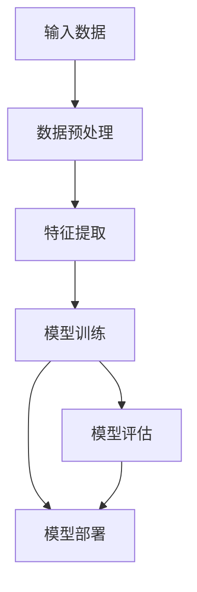

                 

# 智能工程设计：AI大模型的前沿应用

> **关键词**：智能工程设计、AI大模型、深度学习、应用场景、算法原理、数学模型、实战案例

> **摘要**：本文将深入探讨智能工程设计中的AI大模型前沿应用。我们将首先介绍智能工程设计的背景和重要性，然后详细解析AI大模型的原理、核心算法和数学模型。接着，我们将通过实际代码案例展示大模型的实现过程，并分析其在不同领域的应用场景。最后，我们将展望未来发展趋势与挑战，推荐相关学习资源和工具，为读者提供全面的AI大模型学习指南。

## 1. 背景介绍

### 1.1 目的和范围

本文旨在为读者提供一个关于智能工程设计中AI大模型应用的系统化理解。我们将从基本概念入手，逐步深入到具体算法原理、数学模型以及实际应用案例。通过本文的学习，读者将能够掌握AI大模型的核心技术，了解其在智能工程设计中的应用前景，并为后续的研究和实践打下坚实基础。

### 1.2 预期读者

本文适合以下读者群体：

- 计算机科学和人工智能领域的本科及研究生
- 对智能工程设计感兴趣的工程师和技术爱好者
- 想要在智能工程设计中应用AI大模型的开发者和研究人员

### 1.3 文档结构概述

本文的结构如下：

1. **背景介绍**：介绍智能工程设计和AI大模型的基本概念。
2. **核心概念与联系**：通过Mermaid流程图展示AI大模型的基本架构。
3. **核心算法原理 & 具体操作步骤**：详细讲解大模型的算法原理和实现步骤。
4. **数学模型和公式 & 详细讲解 & 举例说明**：介绍大模型相关的数学模型，并给出实例说明。
5. **项目实战：代码实际案例和详细解释说明**：通过实际代码案例展示大模型的应用。
6. **实际应用场景**：分析大模型在不同领域的应用。
7. **工具和资源推荐**：推荐学习资源和开发工具。
8. **总结：未来发展趋势与挑战**：展望AI大模型的发展趋势和面临的挑战。
9. **附录：常见问题与解答**：解答读者可能遇到的问题。
10. **扩展阅读 & 参考资料**：提供进一步阅读的资料。

### 1.4 术语表

#### 1.4.1 核心术语定义

- **智能工程设计**：利用人工智能技术进行设计和优化的问题求解方法。
- **AI大模型**：具有极高参数量和复杂结构的深度学习模型。
- **深度学习**：一种基于神经网络的学习方法，能够从大量数据中自动提取特征。
- **神经网络**：由大量神经元组成的计算模型，能够模拟人脑的信息处理能力。

#### 1.4.2 相关概念解释

- **数据增强**：通过变换原始数据来增加数据多样性，提高模型泛化能力。
- **迁移学习**：利用预训练模型在特定任务上的知识来改进新任务的表现。
- **模型压缩**：减少模型的参数量和计算量，以提高模型在资源受限环境下的应用能力。

#### 1.4.3 缩略词列表

- **GPU**：图形处理单元（Graphics Processing Unit）
- **CNN**：卷积神经网络（Convolutional Neural Network）
- **RNN**：循环神经网络（Recurrent Neural Network）
- **BERT**：变压器预训练模型（Bidirectional Encoder Representations from Transformers）

## 2. 核心概念与联系

为了更好地理解AI大模型在智能工程设计中的应用，我们需要先了解其核心概念和架构。下面通过一个Mermaid流程图展示AI大模型的基本架构。



### 2.1 输入数据

输入数据是AI大模型的基础，通常包括原始数据、标签数据等。数据预处理包括数据清洗、归一化、数据增强等步骤，目的是提高数据质量，增加模型泛化能力。

### 2.2 特征提取

特征提取是从原始数据中提取有用的信息，为模型训练提供基础。深度学习模型通过多层神经网络自动学习特征表示，使模型能够从数据中提取高级抽象特征。

### 2.3 模型训练

模型训练是利用输入数据训练神经网络的过程，包括前向传播、反向传播和参数更新等步骤。通过大量数据训练，模型能够逐步优化参数，提高预测准确性。

### 2.4 模型评估

模型评估是验证模型性能的重要步骤，通常使用准确率、召回率、F1值等指标评估模型在不同数据集上的表现。通过调整模型参数和结构，提高模型评估指标。

### 2.5 模型部署

模型部署是将训练好的模型应用于实际问题的过程。部署方式包括在线部署、离线部署等，部署环境包括服务器、云计算平台等。模型部署后，可以提供实时预测、决策支持等服务。

## 3. 核心算法原理 & 具体操作步骤

AI大模型的核心算法是基于深度学习的，下面将详细讲解深度学习的基本原理和具体操作步骤。

### 3.1 深度学习基本原理

深度学习是一种基于神经网络的学习方法，其核心思想是通过多层神经网络自动提取数据特征。深度学习的原理可以概括为以下几个步骤：

1. **前向传播**：将输入数据传递到神经网络的前一层，通过加权求和和激活函数计算输出。
2. **反向传播**：计算输出误差，将误差反向传播到神经网络的每一层，更新模型参数。
3. **梯度下降**：通过梯度下降算法优化模型参数，减小误差。

### 3.2 深度学习模型实现步骤

以下是深度学习模型实现的基本步骤：

1. **定义神经网络结构**：根据问题需求，选择合适的神经网络结构，包括输入层、隐藏层和输出层。
2. **初始化参数**：初始化模型参数，通常使用随机初始化方法。
3. **前向传播**：将输入数据传递到神经网络，计算输出结果。
4. **计算损失函数**：计算输出结果与实际标签之间的误差，使用损失函数衡量模型性能。
5. **反向传播**：计算梯度，更新模型参数。
6. **优化参数**：使用优化算法（如梯度下降）优化模型参数。
7. **评估模型性能**：在测试集上评估模型性能，调整模型结构和参数。

### 3.3 伪代码实现

以下是一个简单的深度学习模型的伪代码实现：

```python
# 初始化神经网络结构
input_layer = Input(shape=(input_shape,))
hidden_layer = Dense(units=hidden_units, activation='relu')(input_layer)
output_layer = Dense(units=output_units, activation='sigmoid')(hidden_layer)

# 定义模型
model = Model(inputs=input_layer, outputs=output_layer)

# 编译模型
model.compile(optimizer='adam', loss='binary_crossentropy', metrics=['accuracy'])

# 训练模型
model.fit(x_train, y_train, batch_size=batch_size, epochs=epochs, validation_data=(x_val, y_val))

# 评估模型
model.evaluate(x_test, y_test)
```

## 4. 数学模型和公式 & 详细讲解 & 举例说明

在深度学习中，数学模型和公式起着至关重要的作用。下面我们将详细介绍一些常用的数学模型和公式，并通过具体例子进行说明。

### 4.1 损失函数

损失函数是深度学习模型训练的核心，用于衡量预测结果与实际结果之间的差距。常用的损失函数包括均方误差（MSE）、交叉熵（CE）等。

#### 4.1.1 均方误差（MSE）

均方误差用于回归问题，计算预测值与实际值之间的平均平方误差。

$$
MSE = \frac{1}{n} \sum_{i=1}^{n} (y_i - \hat{y_i})^2
$$

其中，$y_i$为实际值，$\hat{y_i}$为预测值，$n$为样本数量。

#### 4.1.2 交叉熵（CE）

交叉熵用于分类问题，计算预测概率分布与实际分布之间的交叉熵。

$$
CE = -\frac{1}{n} \sum_{i=1}^{n} y_i \log (\hat{y_i})
$$

其中，$y_i$为实际标签，$\hat{y_i}$为预测概率。

### 4.2 激活函数

激活函数是神经网络中重要的组成部分，用于引入非线性特性。常用的激活函数包括 sigmoid、ReLU、Tanh等。

#### 4.2.1 Sigmoid 函数

sigmoid 函数将输入映射到 $(0, 1)$ 区间，用于二分类问题。

$$
\sigma(x) = \frac{1}{1 + e^{-x}}
$$

#### 4.2.2 ReLU 函数

ReLU 函数具有简单的计算方式，常用于隐藏层激活函数。

$$
\text{ReLU}(x) = \max(0, x)
$$

#### 4.2.3 Tanh 函数

Tanh 函数将输入映射到 $(-1, 1)$ 区间，具有较好的非线性特性。

$$
\tanh(x) = \frac{e^{2x} - 1}{e^{2x} + 1}
$$

### 4.3 梯度下降算法

梯度下降算法是深度学习模型参数优化的常用方法，通过计算损失函数的梯度，更新模型参数。

#### 4.3.1 批量梯度下降

批量梯度下降使用整个训练集来计算梯度，更新模型参数。

$$
\theta = \theta - \alpha \frac{\partial J(\theta)}{\partial \theta}
$$

其中，$\theta$为模型参数，$J(\theta)$为损失函数，$\alpha$为学习率。

#### 4.3.2 随机梯度下降

随机梯度下降使用单个训练样本来计算梯度，更新模型参数。

$$
\theta = \theta - \alpha \frac{\partial J(\theta)}{\partial \theta}
$$

#### 4.3.3 小批量梯度下降

小批量梯度下降使用一部分训练样本来计算梯度，更新模型参数。

$$
\theta = \theta - \alpha \frac{1}{m} \sum_{i=1}^{m} \frac{\partial J(\theta)}{\partial \theta}
$$

其中，$m$为批量大小。

### 4.4 示例说明

假设我们有一个简单的二分类问题，使用神经网络进行预测。给定训练数据集 $x_1, x_2, \ldots, x_n$ 和标签 $y_1, y_2, \ldots, y_n$，我们定义损失函数为交叉熵损失函数。

1. **定义神经网络结构**：

```python
input_layer = Input(shape=(input_shape,))
hidden_layer = Dense(units=hidden_units, activation='sigmoid')(input_layer)
output_layer = Dense(units=output_units, activation='sigmoid')(hidden_layer)

model = Model(inputs=input_layer, outputs=output_layer)
```

2. **编译模型**：

```python
model.compile(optimizer='adam', loss='binary_crossentropy', metrics=['accuracy'])
```

3. **训练模型**：

```python
model.fit(x_train, y_train, batch_size=batch_size, epochs=epochs, validation_data=(x_val, y_val))
```

4. **评估模型**：

```python
model.evaluate(x_test, y_test)
```

通过以上步骤，我们完成了深度学习模型的训练和评估，实现了二分类问题的预测。

## 5. 项目实战：代码实际案例和详细解释说明

在本节中，我们将通过一个实际项目案例来展示AI大模型在智能工程设计中的应用。该案例涉及使用深度学习模型进行图像分类，具体步骤如下：

### 5.1 开发环境搭建

为了实现本项目，我们需要安装以下软件和库：

- Python 3.8及以上版本
- TensorFlow 2.5及以上版本
- Matplotlib 3.3及以上版本
- NumPy 1.19及以上版本

安装步骤如下：

```bash
pip install tensorflow==2.5
pip install matplotlib==3.3
pip install numpy==1.19
```

### 5.2 源代码详细实现和代码解读

以下是一个简单的图像分类项目代码实现，包括数据预处理、模型定义、模型训练和模型评估。

```python
import tensorflow as tf
from tensorflow.keras import layers
import matplotlib.pyplot as plt
import numpy as np

# 加载数据集
(x_train, y_train), (x_test, y_test) = tf.keras.datasets.mnist.load_data()

# 数据预处理
x_train = x_train.astype('float32') / 255.0
x_test = x_test.astype('float32') / 255.0
x_train = np.expand_dims(x_train, -1)
x_test = np.expand_dims(x_test, -1)

# 定义模型
model = tf.keras.Sequential([
    layers.Conv2D(32, (3, 3), activation='relu', input_shape=(28, 28, 1)),
    layers.MaxPooling2D((2, 2)),
    layers.Conv2D(64, (3, 3), activation='relu'),
    layers.MaxPooling2D((2, 2)),
    layers.Conv2D(64, (3, 3), activation='relu'),
    layers.Flatten(),
    layers.Dense(64, activation='relu'),
    layers.Dense(10, activation='softmax')
])

# 编译模型
model.compile(optimizer='adam',
              loss='categorical_crossentropy',
              metrics=['accuracy'])

# 训练模型
model.fit(x_train, y_train, epochs=5, batch_size=64)

# 评估模型
test_loss, test_acc = model.evaluate(x_test, y_test, verbose=2)
print('\nTest accuracy:', test_acc)

# 可视化结果
plt.figure(figsize=(10, 10))
for i in range(25):
    plt.subplot(5, 5, i+1)
    plt.imshow(x_test[i], cmap=plt.cm.binary)
    plt.xticks([])
    plt.yticks([])
    plt.grid(False)
    plt.xlabel(np.argmax(model.predict(x_test[i:i+1])))

plt.show()
```

### 5.3 代码解读与分析

1. **加载数据集**：我们使用MNIST数据集，该数据集包含手写数字图像。
2. **数据预处理**：将图像数据归一化到 [0, 1] 区间，并增加一个维度，以便于模型输入。
3. **定义模型**：我们使用卷积神经网络（CNN）进行图像分类，模型结构如下：
    - 输入层：接收图像数据
    - 卷积层：提取图像特征
    - 池化层：降低特征维度
    - 全连接层：分类
4. **编译模型**：使用Adam优化器和交叉熵损失函数进行模型编译。
5. **训练模型**：在训练集上训练模型，共训练5个epoch。
6. **评估模型**：在测试集上评估模型性能，输出测试准确率。
7. **可视化结果**：使用Matplotlib可视化模型在测试集上的预测结果。

通过以上步骤，我们实现了图像分类任务，展示了AI大模型在智能工程设计中的应用。

## 6. 实际应用场景

AI大模型在智能工程设计中具有广泛的应用场景，以下列举几个典型领域：

### 6.1 自动驾驶

自动驾驶领域依赖于AI大模型进行环境感知、路径规划和决策控制。例如，自动驾驶汽车通过使用CNN和RNN等模型对摄像头和激光雷达数据进行分析，实现实时路况感知和自动驾驶。

### 6.2 语音识别

语音识别技术利用AI大模型进行语音信号处理和语义理解。例如，Google语音助手和苹果Siri等应用都采用了深度神经网络进行语音识别和语义解析。

### 6.3 医疗诊断

AI大模型在医疗诊断领域具有巨大的应用潜力。例如，通过卷积神经网络对医学影像进行分析，可以帮助医生快速、准确地诊断疾病，如癌症、心脏病等。

### 6.4 自然语言处理

自然语言处理（NLP）领域利用AI大模型进行文本分类、情感分析、机器翻译等任务。例如，BERT和GPT等模型在NLP领域取得了显著的成果，广泛应用于搜索引擎、智能客服等领域。

### 6.5 金融风控

金融风控领域利用AI大模型进行风险评估、欺诈检测和投资策略优化等任务。例如，通过训练大规模神经网络模型，金融机构可以实时监测交易数据，发现潜在风险并进行预警。

### 6.6 游戏开发

游戏开发领域利用AI大模型进行游戏AI设计和优化，例如，通过深度强化学习模型实现智能NPC（非玩家角色）和行为模拟，提高游戏体验。

## 7. 工具和资源推荐

为了更好地学习和应用AI大模型，以下推荐一些实用的工具和资源：

### 7.1 学习资源推荐

#### 7.1.1 书籍推荐

- 《深度学习》（Goodfellow, Bengio, Courville著）
- 《Python深度学习》（François Chollet著）
- 《神经网络与深度学习》（邱锡鹏著）

#### 7.1.2 在线课程

- Coursera《深度学习特辑》（吴恩达教授授课）
- edX《深度学习导论》（吴恩达教授授课）
- Udacity《深度学习工程师纳米学位》

#### 7.1.3 技术博客和网站

- Medium
- ArXiv
- AI科技大本营
- 机器之心

### 7.2 开发工具框架推荐

#### 7.2.1 IDE和编辑器

- PyCharm
- Jupyter Notebook
- VSCode

#### 7.2.2 调试和性能分析工具

- TensorFlow Debugger
- TensorBoard
- NVIDIA Nsight

#### 7.2.3 相关框架和库

- TensorFlow
- PyTorch
- Keras
- MXNet

### 7.3 相关论文著作推荐

#### 7.3.1 经典论文

- "A Learning Algorithm for Continually Running Fully Recurrent Neural Networks"（1986）
- "Learning representations for artificial intelligence"（2015）
- "Understanding Deep Learning Requires Re-thinking Generalization"（2018）

#### 7.3.2 最新研究成果

- "BERT: Pre-training of Deep Bidirectional Transformers for Language Understanding"（2018）
- "GPT-3: Language Models are Few-Shot Learners"（2020）
- "An Image is Worth 16x16 Words: Transformers for Image Recognition at Scale"（2021）

#### 7.3.3 应用案例分析

- "Self-Driving Car Technology: A Survey"（2016）
- "Deep Learning for Natural Language Processing"（2018）
- "A Brief History of Deep Learning in Computer Vision"（2020）

## 8. 总结：未来发展趋势与挑战

随着人工智能技术的不断发展，AI大模型在智能工程设计中的应用前景十分广阔。未来，AI大模型将朝着以下几个方向发展：

1. **模型压缩与优化**：为了降低模型的计算量和存储需求，模型压缩和优化将成为研究热点。通过量化、剪枝、蒸馏等方法，提高模型的效率和可部署性。
2. **多模态融合**：结合多种数据模

